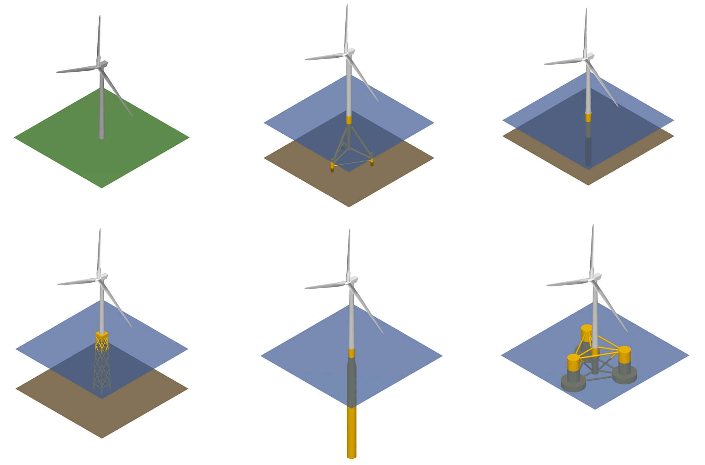

.. QBlade Documentation documentation master file, created by
   sphinx-quickstart on Thu Jul 15 12:34:20 2021.
   You can adapt this file completely to your liking, but it should at least
   contain the root `toctree` directive.

**v 2.0.7**

====================
QBlade Documentation
====================

QBlade :footcite:p:`Marten19` is a state-of-the-art multi-physics code covering the complete range of aspects required for the aero-servo-hydro-elastic simulation of horizontal or vertical axis wind turbines. This software, developed since 2010, is implemented as a modular system of highly efficient multi-fidelity aerodynamic, structural dynamic, and hydrodynamic solvers within a modern, object-oriented C++ framework.

Advanced Performance and User-Friendly Interface 
++++++++++++++++++++++++++++++++++++++++++++++++

We leverage the current computer architecture by thoroughly utilizing CPU (via OpenMP) and GPU (via OpenCL) parallelization techniques for high numerical performance. QBlade is platform-independent software, deployable on workstations or clusters running Windows or Unix based operating systems. The software is equipped with an intuitive graphical user interface that aids users throughout the wind turbine design process. All turbine and simulation details are readily accessible and modifiable within a logical, well-structured, and tested graphical user interface (GUI). Simulation results are presented in dynamic graphs that provide insight into every simulation detail. Simulations and turbine designs are fully rendered in real time to aid in the comprehension and evaluation of our complex multi-physics models. QBlade enables the serialization of complete model data, setup, and results into project files to facilitate simple sharing and collaboration on complex simulation and turbine design projects. The Community Edition of QBlade (QBlade-CE) is freely available under the Academic Public License, while the Enterprise Edition (QBlade-EE) is available under a Commercial License.

Aerodynamics
+++++++++++++
QBlade uses a highly optimized and thoroughly validated Lifting Line Free Vortex Wake Method for its aerodynamic calculations. Instead of approximating the wake aerodynamics with a steady-state momentum balance (BEM), the rotor wake is explicitly modeled through Lagrangian vortex elements. This results in a more accurate and detailed spatial and temporal representation :footcite:t:`Marten2020` of the rotor induction compared to BEM approaches, and fully resolves the velocity distribution behind the rotor. This allows for the assessment of wind turbine wake interaction, accurately accounts for the aerodynamics of oscillating floating wind turbine structures, and explicitly resolves unsteady vertical axis wind turbine wake dynamics :footcite:t:`Balduzzi2017b`. As an alternative with lower computational demand, the aerodynamics of horizontal-axis wind turbines can be simulated using an unsteady polar-BEM implementation :footcite:t:`polarBEM`.

Structural Dynamics
++++++++++++++++++++
The structural dynamics are modeled in a true multi-body formulation. The subcomponents of the multi-body model consist of rigid or flexible nonlinear Euler or Timoshenko beam elements in a corotational formulation. For floating offshore simulations, QBlade uses integrated cable elements in the absolute nodal coordinate formulation (ANCF), which meet the requirements to effectively model the nonlinear dynamics of complex mooring systems.

Hydrodynamics
++++++++++++++
The hydrodynamic loads on the wind turbine’s substructure are calculated either via potential flow theory, the Morison equation-based strip theory, or a user-defined combination of the two. The integrated potential flow approach also includes second order sum- and difference frequency loads obtained from quadratic transfer functions (QTFs). QBlade integrates with potential flow data from common software such as WAMIT, NEMOH, or similar toolboxes.

.. _fig-turbines:

    Different wind turbine types modelled with QBlade.

.. toctree::
   :maxdepth: 4

   QBlade Documentation <https://docs.qblade.org>
   src/theory/index_th
   src/user/index_ue
   src/validation/index_val
   src/license/index_license

.. footbibliography::
