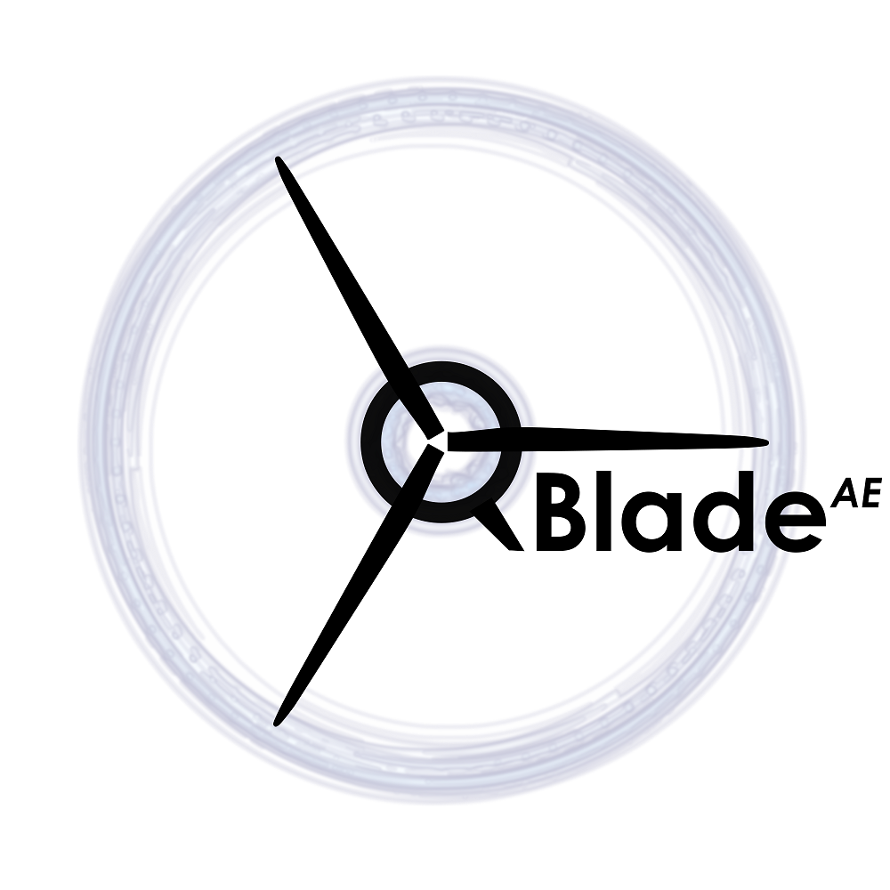

.. QBlade Documentation documentation master file, created by
   sphinx-quickstart on Thu Jul 15 12:34:20 2021.
   You can adapt this file completely to your liking, but it should at least
   contain the root `toctree` directive.

======
QBlade
======

.. toctree::
   :maxdepth: 1
   :caption: Documentation

   src/theory/index_th
   src/user/index_ue

Bibliography
============
.. toctree::
   :maxdepth: 1

   bibliography

