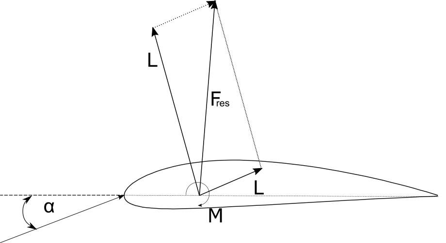
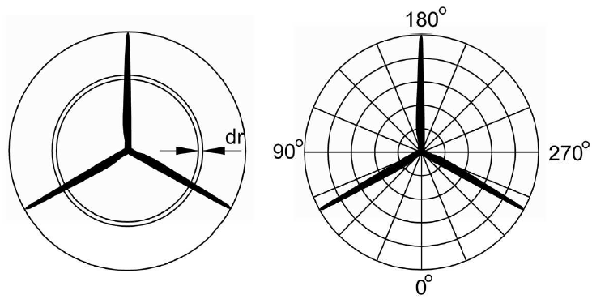

Blade Element Momentum Method
=============================

In QBlade the aerodynamic forces acting on a rotor can be modeled either using a steady Blade Element Momentum (BEM) or a with a more advanced, time resolved
unsteady BEM (UBEM) which is enhanced by several correctional models. The theory interlinks the actuator disc theory and the blade element theory and it was
first introduced by :footcite:t:`Glauert1935`. Despite its simplicity, the BEM method allows for an accurate representation of the steady aerodynamic loads that act on
the rotor of a wind turbine, provided certain model assumptions are not violated.

Momentum Theory
----------------
Under the assumptions of a steady, incompressible and axisymmetric inflow of an inviscid fluid the actuator disc theory may be applied. The rotor plane is treated as an actuator
disk that causes a uniform pressure drop over the rotor area while the flow velocity varies continuously through the disk.
In its simplest form, the actuator disc theory assumes that the velocity through the rotor plane does not contain a tangential
component and the pressures far up- and downstream of the rotor are equal to the ambient pressure. These assumptions allow for the calculation of the rotor performance
(power and thrust) and the velocity in the rotor plane by invoking the conservation of mass and momentum (see :footcite:t:`Branlard2017`).
The introduction of the induction factor :math:`a` allows for the expression of the velocity in the rotor plane as function of the incoming velocity :math:`u_{0}`:

.. math::
	\begin{align}
	u = (1-a)u_\infty .
	\end{align}

The rotor performance coefficients for power and thrust may also be expressed as a function of the axial induction factor :math:`a`:

.. math::
	\begin{align}
	C_T = 4a(1-a),
	\end{align}

.. math::
	\begin{align}
	C_P = 4a(1-a)^2.
	\end{align}

   1D momentum theory, pressure and velocity evolution.

Blade Element Theory
--------------------
The blade element theory allows for the computation of the loads acting on a rotor based on the geometric and aerodynamic properties of individual spanwise blade sections.
The blade is divided into a discrete number of radially distributed sections. The loads on each section are calculated under the assumption that the flow there is locally two-dimensional and in the plane of the airfoil section.
This allows for the use of two-dimensional lift, drag and moment coefficients together with the relative flow velocity to determine sectional airfoil forces.

   2D forces on an airfoil.

Classical Blade Element Momentum Theory
----------------------------------------
The blade element momentum theory combines the 1D actuator disc theory with the blade element theory. For practical reasons, the stream tube theory is
applied to radial annuli that match the discretization of the blade elements. Both theories allow for the expression of the blade forces
within an annular segment as a function of streamtube geometric properties and the axial and tangential induction factors :math:`a` and :math:`a'`, respectively. 
A solution method is applied which iteratively finds the values of :math:`a` and :math:`a'` which satisfy both theories. 

Corrections
-----------
Due to the two dimensional nature of the BEM theory, three dimensional effects are not accounted for by the classical BEM. This leads to large deviations of
flow quantities compared with measured turbine data, particularly in regions where strong changes in the blade circulation occur. 
To improve the accuracy of the BEM results, two correctional methods are implemented into QBlade:

- Prandtl Tip Loss Factor (see :footcite:t:`Glauert1935`);
- 3D Correction (see :footcite:t:`Snel1992`);

Unsteady Blade Element Momentum Theory
---------------------------------------
Although the classical BEM method provides good estimates of the annual energy production, it is incapable of accounting for unsteady phenomena like the atmospheric boundary layer, turbulence or the tower influence. 
These unsteady phenomena make the position of each blade at a certain time necessary. Hence, non-rotating coordinate systems are placed at the bottom of the tower and the nacelle.
Furthermore, a coordinate system is attached to the rotating shaft and each blade. The instantaneous velocity seen by each blade can now be determined and be accounted for in the calculation of
the flow angle (:footcite:t:`Tavares2013`).
As the classical BEM is only valid for steady flow cases and provides induced velocities corresponding to this specific state, a dynamic inflow model is used to introduce a time lag to the sectional 
rotor induction (see :footcite:t:`Glauert1935` or :footcite:t:`Henriksen2012`).

Polar Grid
----------
The polar-grid has been developed by (:footcite:t:`Madsen2020`) to consider azimuthal variations of the axial induction caused by the azimuthal dependence of blade loadings. 
Within the approach, the annular rings of the actuator disc theory are divided into stationary azimuthal sections. 
Each point on the azimuthal grid is associated with a local induction factor, based on the local instantaneous velocity. The latter is approximated by the induced
velocity of the neighboring two blades and weighted by their azimuthal distance (:footcite:t:`BdL2022`).

   Classical BEM approach (left) and polar grid with azimuthal sub elements (right), taken from :footcite:t:`Madsen2020`)

.. footbibliography::
