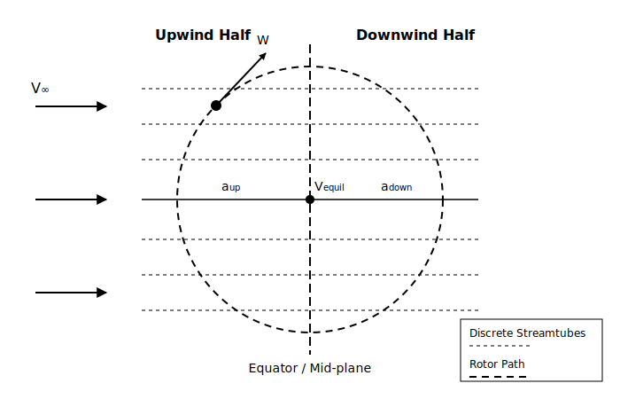

Double Multiple Streamtube Method
=================================

.. _fig-dms:

    The Double Multiple Streamtube concept

In QBlade, the aerodynamic forces acting on a Vertical Axis Wind Turbine (VAWT) rotor can be modeled using the Double Multiple Streamtube (DMS) algorithm. The theory interlinks the conservation of momentum with the blade element theory, adapted specifically for the rotating kinematics of a vertical axis turbine. Despite the complex, unsteady nature of VAWT aerodynamics, the DMS method allows for an accurate and computationally highly efficient representation of the steady aerodynamic loads and overall rotor performance parameters.

Double Multiple Streamtube Theory (DMST)
----------------------------------------
The Double Multiple Streamtube theory (see :footcite:t:`Paraschivoiu1982`) expands upon classical momentum models by dividing the rotor swept area into a discrete series of parallel, adjacent streamtubes. Because a VAWT blade completes a full :math:`360^{\circ}` rotation, it passes through each streamtube twice: once on the upwind pass and once on the downwind pass.

The theory applies the conservation of mass and momentum independently to the upwind and downwind halves of the rotor. By equating the aerodynamic forces generated by the blade elements traversing a streamtube to the change in momentum of the fluid passing through it, the local induction factors can be iteratively determined. 

Within each streamtube, the local relative velocity :math:`W` perceived by the blade element is calculated as:

.. math::
	\begin{align}
	W = V \sqrt{(X - \sin\theta)^2 + F^2 \cos^2\theta \cos^2\delta},
	\end{align}

where :math:`V` is the induced streamtube velocity, :math:`X = \frac{r \omega}{V}` is the local tip speed ratio, :math:`\theta` is the azimuthal angle, :math:`\delta` is the local blade inclination angle, and :math:`F` is the tip loss factor. 

The algorithm first solves for the upwind induction factor :math:`a_{up}` iteratively. Once the upwind pass converges, an equilibrium wake velocity is computed in the center of the rotor. This equilibrium velocity acts as the freestream inflow for the downwind pass, which then iteratively solves for the downwind induction factor :math:`a_{down}`.

DMST Corrections
----------------
Due to the two-dimensional nature of the base theory, three-dimensional effects and highly loaded flow conditions are not accounted for automatically. To improve the accuracy of the VAWT simulations, several correction methods are implemented into the DMS algorithm:

* **Tip Loss Correction:**
  A Willmer modification of the Prandtl tip loss method is applied to account for the finite span of the blades and the resulting tip vortices (see :footcite:t:`Paraschivoiu2002`). The tip loss factor :math:`F` directly scales the geometric inflow angle and the local induction field.

* **Turbulent Wake State (Glauert/Spera Correction):**
  When a streamtube's local thrust coefficient becomes too large (:math:`C_{T, local} > 0.96F`), standard momentum theory breaks down and overpredicts induction. In these highly loaded regimes, an empirical Glauert/Spera correction (see :footcite:t:`Spera1994` and :footcite:t:`Buhl2005`) is applied to calculate the target induction :math:`a`:

  .. math::
  	\begin{align}
  	a = \frac{18F - 20 - 3\sqrt{C_T(50-36F) + 12F(3F-4)}}{36F - 50}
  	\end{align}

DMST Load Integration & Rotor Performance
-----------------------------------------
The DMS algorithm evaluates the normal and tangential blade forces at discrete azimuthal steps over a full revolution. These sectional loads are then integrated along the blade height (accounting for the local blade inclination angle :math:`\delta` and chord variations) and averaged over the $360^{\circ}$ azimuthal domain. 

The total mean torque :math:`Q`, power :math:`P`, and thrust :math:`T` are subsequently normalized using the freestream dynamic pressure and the rotor swept area to yield the dimensionless turbine performance coefficients:

.. math::
	\begin{align}
	C_P = \frac{P}{\frac{1}{2} \rho V_\infty^3 A_{ref}}, \quad C_T = \frac{T}{\frac{1}{2} \rho V_\infty^2 A_{ref}}, \quad C_Q = \frac{Q}{\frac{1}{2} \rho V_\infty^2 A_{ref} R_{max}}.
	\end{align}

.. footbibliography::