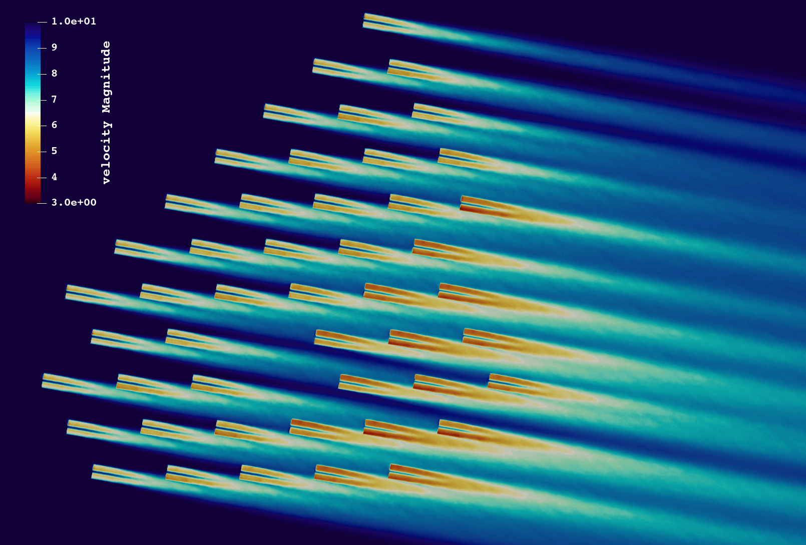
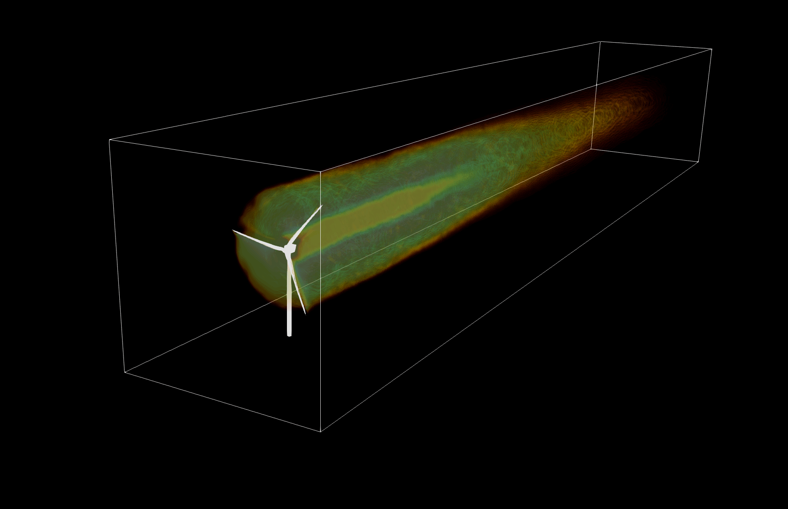

Dynamic Wake Meandering Model
-----------------------------

.. _fig-lillgrund:

    Exemplary application of the DWM model to the simulation of the Lillgrund Wind Farm in QBlade.

The Dynamic Wake Meandering (DWM) model in QBlade represents an approach to simulating the wake behind a wind turbine rotor, when its aerodynamics are simulated with the unsteady BEM theory. The DWM model captures the essential dynamics of wind turbine wakes, providing a robust framework for analyzing how wakes influence the operation and loads on downstream turbines. The DWM model is able to simulate wake behavior quickly and accurately, making it an ideal tool for investigations into wind park layout or control optimization.

The DWM model simulates the meandering motion of the wake generated by a wind turbine. Unlike static wake models, which assume a steady-state flow, the DWM model accounts for the time-dependent nature of wakes, incorporating both the advection and diffusion of wake structures over time. This dynamic approach allows for a realistic representation of wake effects, including:

- **Meandering Motion**: The turbulence induced lateral and vertical movement of the wake as it propagates downstream.
- **Wake Expansion**: The spreading of the wake caused by turbulent mixing with the ambient wind flow.
- **Velocity Deficits**: The reduction in wind speed within the wake, which affects downstream turbines.
- **Turbulence Intensification**: The increase in turbulence levels within the wake, impacting the loading on downstream turbines.

.. _fig-dwm:

    3D Visualization of the wake velocity deficit evaluated with the DWM model.

