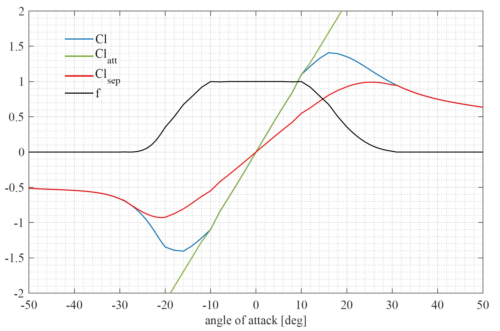
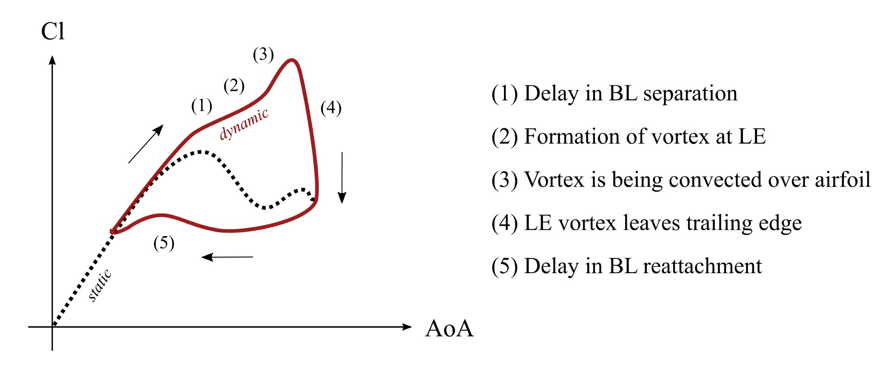
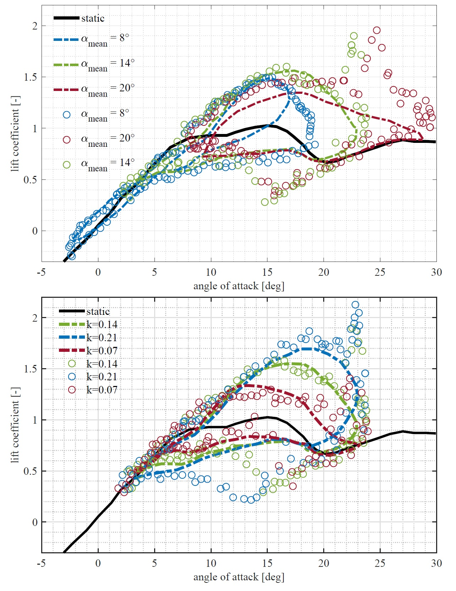

ATEFlap Dynamic Stall Model
===========================

To account for dynamic stall and unsteady aerodynamics the ATEFLap :footcite:`Bergami2012` model for 2D airfoil behavior has been integrated :footcite:`Wendler2016` to be used with :doc:`../lifting_line/lifting_line` simulations (note that the ATEFlap model has been specifically modified to be used with :doc:`../lifting_line/lifting_line` simulations, it is not advised to use the ATEFlap model with :doc:`../bem/bem` simulations). The unsteady aerodynamics model consists of mainly two parts; an attached or potential flow model, as proposed by Bergami and Gaunaa in :footcite:`Bergami2012`, and the classical Beddoes-Leishman dynamic stall model with a custom formulation for vortex lift, as presented by Hansen and Gaunaa in :footcite:`Hansen2004b`. The implemented ATEFlap model also accounts for unsteady lift contribution of trailing edge flaps. 

Polar Decomposition
-------------------

.. _fig-decomposition:

    Decomposition of static polar data.
	
The unsteady aerodynamics model is based on a decomposition of the static, two dimensional lift :math:`Cl_{st}` into a fully attached :math:`Cl_{att}` and a fully separated :math:`Cl_{sep}` contribution. The contributions of the attached and the separated lift to the static lift are described by the separation function :math:`f`:

.. _decompose:
.. math::
	\begin{align}
	Cl_{st} = f   Cl	 + (1-f)   Cl_{sep} . 
	\end{align}
	
A module to perform the decomposition of polar data has been integrated with QBlades airfoil data pre-processor. To generate the decomposed data, the angle of 
attack for the positive and the negative stall point, as well as the attached lift slope of the static polar, have to be provided as a user input.

Attached Flow Contribution
--------------------------

The potential flow model accounts for non-circulatory (added mass) effects, and circulatory lift which includes wake memory effects that play a role long 
before the onset of stall. The added mass term models the forces due to the reaction of the fluid to the airfoil motion and the motion of its trailing edge flap:
	
.. math::
	\begin{align}
			Cl^{nc} = \pi\frac{b_{hc}}{V_\infty}\dot{\alpha}^{str} + \frac{F_{dydxLE}}{\pi}\frac{b_{hc}}{V_\infty}\dot{\beta}.
	\end{align}
	
:math:`b_{hc}` denotes the half chord length of the airfoil, :math:`V_{\infty}` the free stream velocity and :math:`\dot{\alpha}_{str}` the pitch rate due to torsional deformation, :math:`F_{dxdyLE}` is the deflection shape integral, a geometrical property depending on the airfoils shape (See Gaunaa's work in :footcite:`Gaunaa2010`) and :math:`\dot\beta` the flap deflection rate. The quasi steady lift component is the steady lift that is generated by the airfoil at the current angle of attack :math:`\alpha_{qs}` and the current flap deflection :math:`\beta_{qs}` obtained from the relative airfoil motion and free-stream velocity, but without the influence of shed wake vorticity:

.. math::
	\begin{align}
			Cl^{qs} = Cl^{att}(\alpha_{qs},\beta_{qs}).
	\end{align}
	
Wake memory effects account for the influence of span wise or shed vorticity in the wake on the quasi-steady angle of attack. As the ATEFlap model has been formulated for BEM codes, the downwash of the wake (which also causes the wake memory effect) is modeled with an effective angle of attack that is computed via step responses that are described by exponential indicial response functions. In QBlade's implementation, the effective angle of attack is directly obtained as the induction from the free vortex wake formulation is already considered in the evaluation of the on-blade velocities. 

.. math::
	\begin{align}
			Cl^{circ}=Cl^{att}(\alpha_{eff}).
	\end{align}
	
However, the quasi steady angle of attack, which does not include the effect of wake vorticity, is not known in the free vortex wake formulation of QBlade. As the quasi steady angle :math:`\alpha_{qs}` is needed for a later evaluation of the induced drag contribution it is computed by calculating the isolated contribution of the wake vorticity on the angle of attack, denoted as :math:`\alpha_{shed}`, separately. :math:`\alpha_{shed}` is computed via the induction of the total shed vorticity in the vicinity of the blade, up to :math:`8` chord lengths away from the trailing edge. As the dynamic stall model is formulated for an isolated two-dimensional airfoil, it is necessary to limit the vortices that are involved in the evaluation of :math:`\alpha_{shed}` to those in the vicinity of the blade to exclude the significant influence of the total shed vorticity from all previous time steps on the global flow field (this is especially important for VAWT simulations where the shed vorticity has a major contribution to the total induction field around the rotor). :math:`\alpha_{shed}` is then used to calculate the quasi steady angle of attack from the effective angle of attack. 
	
.. math::
	\begin{align}
			\alpha_{qs} = \alpha_{eff}-\alpha_{shed}.
	\end{align}
	
This extra treatment is necessary because the common unsteady aerodynamics models are formulated for BEM codes and are using indicial functions which are replaced by the free vortex wake model in this adaptation. 

Separated Flow Contribution
---------------------------

.. _fig-dsloop:

    The dynamic stall hysteresis loop.

The implementation of the Beddoes-Leishman dynamic stall model follows along the procedure explained in :footcite:`Bergami2012`. The dynamic stall effect is modeled from three contributions. The first contribution is the lagged potential lift (leading edge pressure time lag), obtained via a low pass filter with the pressure time lag constant :math:`\tau_p`: 
	
.. math::
	\begin{align}
			\dot{Cl}^{lag} = -\frac{V_{\infty}}{b_{hc}}\frac{1}{\tau_p}Cl^{lag}+\frac{V_{\infty}}{b_{hc}}\frac{1}{\tau_p}Cl^{pot}.
	\end{align}

Using the lagged potential lift :math:`Cl^{lag}`, the dynamic separation function :math:`f^{dyn}` is calculated, by passing the separation function :math:`f` (obtained via the polar decomposition) through a low pass fiter with the boundary layer lag constant :math:`\tau_f`:

.. math::	
	\begin{align}
			f^{dyn} = -\frac{V_{\infty}}{b_{hc}}\frac{1}{\tau_f}f^{dyn}+\frac{V_{\infty}}{b_{hc}}\frac{1}{\tau_f}f(\alpha^{\ast}).
	\end{align}
	
.. math::
	\begin{align}
			\alpha^{\ast} = \frac{Cl^{lag}}{\frac{\partial Cl}{\partial \alpha}}+\alpha_0.
	\end{align}
	
The dynamic circulatory lift :math:`Cl^{circ,dyn}` is then obtained by multiplying the dynamic separation function :math:`f^{dyn}` with the fully attached :math:`Cl^{att}` and the fully separated :math:`Cl^{sep}` lift contributions that were obtained from the polar decomposition:
	
.. math::
	\begin{align}
			Cl^{circ,dyn} = Cl^{att}(\alpha_{eff},\beta_{eff})f^{dyn}+Cl^{sep}(\alpha_{eff},\beta_{eff})(1-f^{dyn}).
	\end{align}
	
Within the ATEFlap formulation for separated flow a term for modeling the vortex lift is included:

.. math::
	\begin{align}
			 C_v = Cl^{circ,dyn}(1-\frac{(1+\sqrt{f^{dyn}})^2}{4}).
	 \end{align}
	 
However, it was found, especially when simulating VAWT with large fluctuations in angle of attack, that this term is prone to large fluctuations, often causing unrealistically large values for the total dynamic lift coefficient. Thus, in favor of robustness, it was decided to exclude this term from the calculation of total lift. The total lift, including the attached and separated flow contribution, but excluding the vortex lift, then equals:

.. math::
	\begin{align}
			Cl^{dyn} = Cl^{circ,dyn}+Cl^{nc}.
	\end{align}
	
The dynamic drag is evaluated from four contributions. The steady drag at the effective angle of attack:

.. math::
	\begin{align}
			Cd^{eff} = Cd(\alpha_{eff},\beta_{eff}),
	\end{align}
	
the drag induced from shed wake vorticity, using the quasi steady angle of attack:

.. math::
	\begin{align}
			Cd_{ind}=Cl^{circ,dyn}(\alpha_{qs}-\alpha_{eff}).
	\end{align}
	
The induced drag contribution from the flap deflection is calculated according to:

.. math::
	\begin{align}
			Cd_{ind}^\beta=Cl^{circ,dyn}\frac{\frac{\partial Cl}{\partial\beta}}{\frac{\partial Cl}{\partial\alpha}}(\beta^{st}-\beta^{eff})f^{dyn}.
	\end{align}
	
The last contribution is the drag change caused through the separation delay:

.. math::
	\begin{align}
			Cd_{ind}^f = (Cd^{eff}-Cd(\alpha_0))\left[\frac{(1-\sqrt{f^{dyn}})^2}{4}-\frac{(1+\sqrt{f^{st}})^2}{4}\right].
	\end{align}
	
The total drag is then computed as the sum of these contributions:

.. math::
	\begin{align}
			Cd = Cd^{eff}+Cd_{ind}+Cd_{ind}^\beta+Cd_{ind}^f.
	\end{align}
	
More details about the implementation and validation of the unsteady aerodynamics model can be found in the publication of Wendler et al. :footcite:`Wendler2016`. Two exemplary validation graphs from this publication are shown in :numref:`fig-vali1`, where the general sensitivity of the dynamic stall hysteresis loop to the reduced frequency and amplitude is well reproduced.

.. _fig-vali1:

    Validation of the unsteady aerodynamics model with OSU test data :footcite:`NREL1999` (in circles) of the S809 airfoil; top: varying mean AoA; bottom: varying dimensionless frequency.

.. footbibliography::
