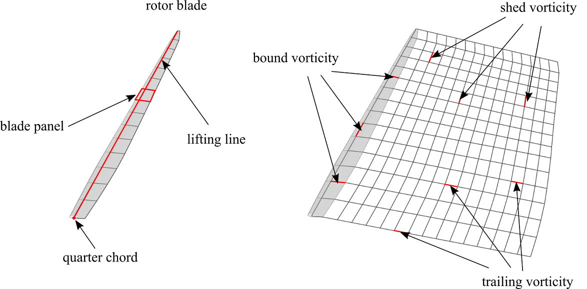
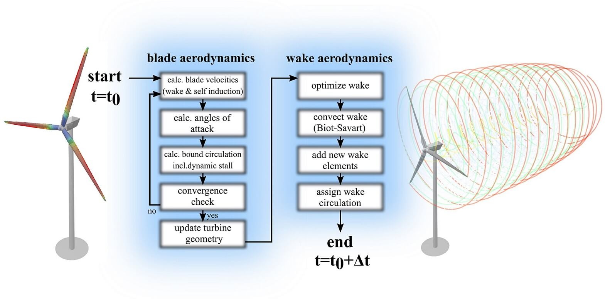
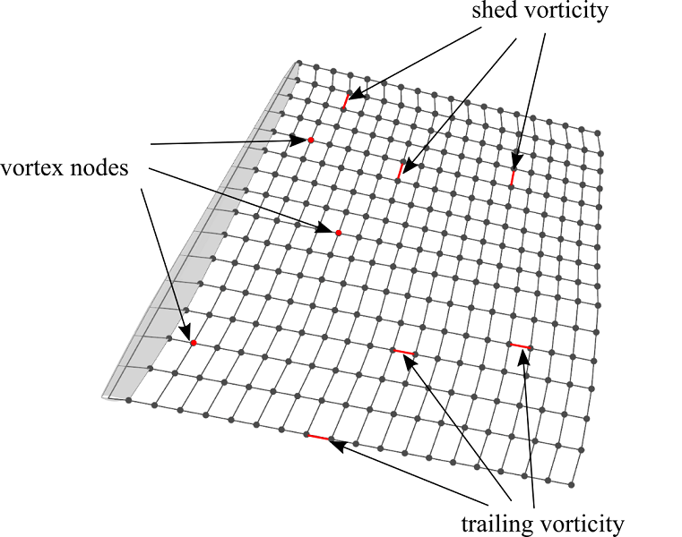
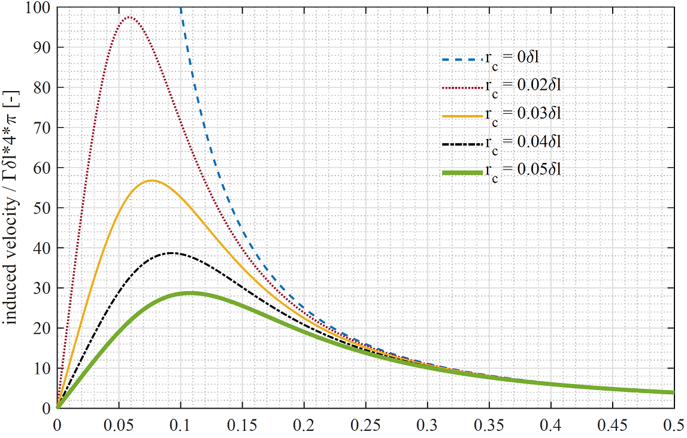

Lifting Line Free Vortex Wake
=============================
In QBlade the aerodynamic forces acting on a rotor can be modeled using the Lifting Line Free Vortex Wake method (LLFVW).
Similar to the :doc:`../bem/bem`, in the LLFVW model the blade forces are calculated using two dimensional sectional airfoil polar data. 
The main difference is that the rotor wake, shed from the blades, is explicitly resolved.
This is a large improvement over the commonly used :doc:`../bem/bem` style approaches, which necessitate the introduction of a large number of empirical corrections into the simulated system. 
Modeling the wake dynamics explicitly avoids the dependency on such correction models and often lead to more physically sound results. 
Simulation results are improved especially in cases where the assumptions of the :doc:`../bem/bem` are violated.
These include unsteady operation, large blade deformations and high tip speed ratios where the turbulent wake state is approached. 
Such conditions become more and more prevalent with the ongoing trend towards larger rotor sizes and offshore floating wind turbines.

Overview of LLFVW Theory
------------------------

.. _fig-bladewake:

    Basic elements of the blade and wake model inside the LLFVW algorithm.

The rotor is represented by a lifting line, located at the quarter chord position of the 2D airfoil sections (see :numref:`fig-bladewake`). 
Each blade panel is represented by a vortex ring which consists of four straight vortex filaments. 
The circulation of the bound vortex lines, forming the lifting line, is calculated from the relative inflow velocity and the lift and drag coefficients that are obtained from tabulated airfoil data. 
The sectional circulation :math:`\partial\Gamma` is calculated according to the Kutta-Joukowski theorem:

.. math::
	\begin{align}
	\partial F_L(\alpha) = \rho V_{rel} \times \partial\Gamma ,
	\end{align}

where :math:`\partial F_L` is the sectional lift force and :math:`\rho` is the fluid density.
The relative velocity :math:`V_{rel}` is obtained from a simple vector addition of the free stream velocity :math:`V_\infty`, 
the blade motion :math:`V_{mot}` and the induced velocity :math:`V_{ind}`, which is calculated from the contribution of all vortex elements on the blade and in the wake through the Biot-Savart equation:

.. _biotsavart:
.. math::
	\begin{align}
	V_{ind} = -\frac{1}{4\pi}\int\Gamma\frac{\vec{r}\times d\vec{l}}{r^3} . 
	\end{align}

.. _fig-aeroflow:

    Flowchart for a single timestep of the aerodynamic calculations in QBlade

At the beginning of each time step, the circulation distribution along the blade is calculated. 
This is carried out with an iterative procedure which ensures that the forces predicted by the Kutta-Joukoswki theorem and the blade element theorem coincide.
During the iteration only the bound vorticity distribution is updated, while the induction of the wake elements on the blade is only evaluated once. 
After convergence is obtained, the rotor rotation is advanced for a single time step. All free wake vortex elements are convected with the local inflow and local induced velocity. 
After the wake convection step, new vortex elements are created between the trailing edge of each blade panel and the last row of wake vortices that were convected away from the trailing edge. 
As a last step, the circulation is computed and assigned to the new released vortex lines through the Kutta condition:

.. math::
	\begin{align}
	\Gamma_{trail} = \frac{\partial{\Gamma_{bound}}}{\partial x}\Delta x . 
	\end{align}

.. math::
	\begin{align}
	\Gamma_{shed} = \frac{\partial{\Gamma_{bound}}}{\partial t}\Delta t . 
	\end{align}

Wake Lattice and Connectivity
-----------------------------

.. _fig-wakelattice:

    Visualization of the wake lattice structure with wake nodes and filaments.

:numref:`fig-wakelattice` shows the wake lattice structure. Shed- and trailing vortices are interconnected via common vortex nodes. 
During the free wake convection step the evolution of the wake is evaluated by advancing the positions of the vortex nodes in time. 
Each newly created vortex node is attached to at least one shed and one trailing vortex filament, thus the total number of vortex nodes is approximately half the number of vortex filaments. 
Consequently, the Biot-Savart equation has to be evaluated around:

.. math::
	\begin{align}
	N_{nodes}\cdot N_{vortices} \approx \frac{N^2_{vortices}}{2} 
	\end{align}

times for a fully populated (assuming that no vortex elements have been removed) infinite wake lattice. 
Compared to a vortex particle discretization, where no inter-connectivity exists, this means a reduction in computational cost by a factor of 2, due to the inter-connectivity of the wake lattice. 
To facilitate strategies that reduce the number of free vortices within the wake a method to remove individual vortices from the wake mesh has been implemented whereby vortex filaments are detached from their corresponding nodes. 
A check is performed during every step of the simulation that removes isolated vortex nodes which are not attached to any vortex filament. 
The more vortices have been removed from the wake lattice, the lower the aforementioned leverage of the interconnections.

Vortex Core Desingularization
-----------------------------

.. _fig-core:

    Velocity distribution around the vortex core.

The Biot-Savart :ref:`equation <biotsavart>` exhibits a singularity at the core where :math:`\vec{r}=0` (:numref:`fig-core`). To prevent this singularity from affecting the stability of the simulation 
and also to model the viscous core of the bound and free vortices more accurately, a model for a viscous vortex core was implemented. 
Many different models that describe the tangential velocity distribution around the core exist, such as the Rankine, Lamb-Oseen or Ramasay and Leishman models (see :footcite:t:`Hommes2015`). 
In QBlade a simple cut-off radius is used, which is added to the denominator of :ref:`this equation <biotsavart>` in the form of :math:`r_{c}^2`, and ensures that the induced velocity smoothly approaches zero in the vicinity of the core. 
This is a computationally efficient implementation as the viscous core modeling is directly implemented in the calculation of the induced velocity. 
For other vortex models a viscous parameter needs to be evaluated from the relative vortex positions in addition to the Biot-Savart equation. 
This has a severe effect on the simulation performance, as the evaluation of the viscous parameter is carried :math:`N^2_{vortices}/2` times per time step. 
When shed from the trailing edge of the blade, a vortex is release with an initial core-size :math:`r_c` (a value of around 10\% of local chord is proposed from experience). 
The core-size is updated every time step according to:

.. math::	
	\begin{align}
	r_c = r_0+\sqrt{\frac{4a\delta_v \nu \Delta t}{1+\epsilon}} .
	\end{align}

where :math:`a = 1.25643` is a constant, :math:`\delta_v` is the turbulent viscosity coefficient (a value depending on rotor size, see :footcite:t:`Sant2007`), 
:math:`\nu` is the kinematic viscosity and :math:`\Delta t` the time step size. The strain rate of the vortex filament is computed as:

.. math::
	\begin{align}
	\epsilon = \frac{\Delta l}{l} . 
	\end{align}

The desingularized Biot-Savart equation then becomes:

.. math::
	\begin{align}
	V_{ind} = -\frac{1}{4\pi}\int\Gamma\frac{\vec{r}\times\partial\vec{l}}{r^3+r_c^2} . 
	\end{align}

.. footbibliography::

