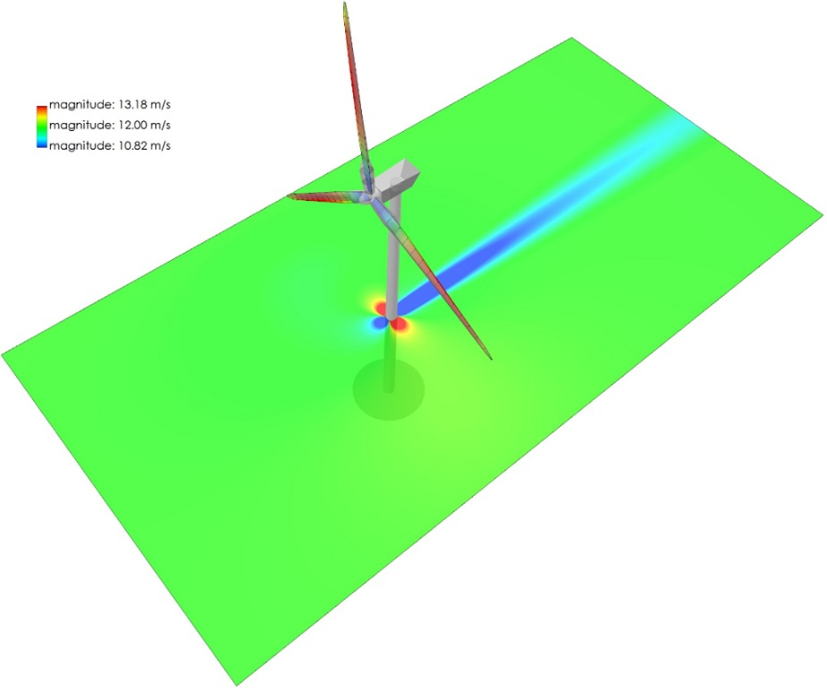

Tower Influence
===============

A tower shadow model, based on the work of Bak (:footcite:t:`Moriarty2005`) is implemented in QBlade. This model is based on a superposition of the analytical solution for potential flow around a cylinder and a model for the downwind wake behind a cylinder, based on a tower drag coefficient. 

For the potential flow around the cylinder contribution, the local velocity components :math:`U_{\mathrm{local}}` and :math:`V_{\mathrm{local}}` are affected by normalized velocity factors:

.. math::
	\begin{align}
	U_{\mathrm{local}} &= u\cdot U_{\infty}, \\
	V_{\mathrm{local}} &= v\cdot U_{\infty}. \\
	\end{align}

In the above equations, :math:`U_{\infty}` is the free stream velocity and :math:`u` and :math:`v` are given by:

.. math::
	\begin{align}
	u &= 1-\frac{\left(x+0.1\right)^2 - y^2}{\left( \left(x+0.1\right)^2 + y^2\right)^2} + \frac{C_d}{2\pi} \frac{x+0.1}{\left(x+0.1\right)^2 + y^2}, \\
	v &= 2\frac{\left(x+0.1\right)y}{\left( \left(x+0.1\right)^2 + y^2 \right)^2} + \frac{C_d}{2\pi} \frac{y}{\left(x+0.1\right)^2 + y^2}. \\
	\end{align}

In these equations, :math:`x` and :math:`y` are the upwind and crosswind distances normalized by the tower radius at the relevant height. 
:math:`C_d` is the drag coefficient of the tower.

In addition, the tower produces a wake deficit in the downstream direction. 
The deficit inside the location of the wake is given by:

.. math::
	\begin{align}
	U_{\mathrm{local}} = (1-u_{\mathrm{wake}})\cdot U_{\infty},
	\end{align}

where :math:`u_{\mathrm{wake}}` is given by:

.. math::
	\begin{align}
	u_{\mathrm{wake}} = \frac{C_d}{\sqrt{d}}\cos^2 \left( \frac{\pi}{2} \frac{y}{\sqrt{d}} \right) \qquad \mathrm{for} \quad |y|\leq\sqrt{d}.
	\end{align}

In the above equation, :math:`d=\sqrt{x^2+y^2}` is the non-dimensional radial distance from the evaluation point to the tower center.
The wake width is assumed to be :math:`\sqrt{d}`.

The tower shadow model only affects velocity components that are normal to the tower centerline; the z-component of the velocity, parallel to the tower centerline, remains unaffected. 
The tower shadow model is only used when the z-component of the evaluation point is smaller or equal to the tower height. 
An example of the tower shadow velocity deficit is shown in :numref:`fig-towershadow`.

.. _fig-towershadow:

    Visualization of the tower shadow model; showing velocity magnitude.

An application of the tower model, including a comparison to CFD simulations and experimental data is found in the work of :footcite:t:`Klein2018`.

.. footbibliography::

