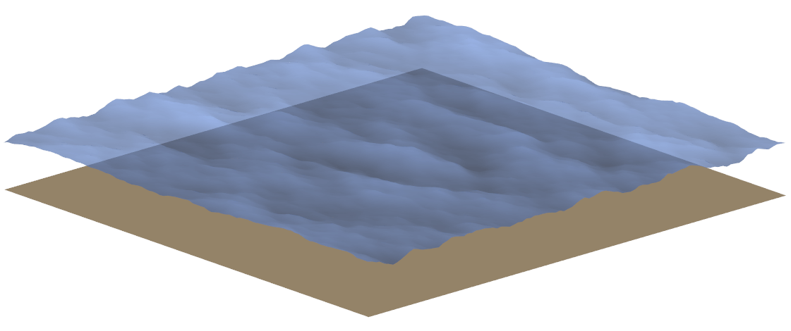

Linear Wave Theory
==================

Linear wave theory (also referred to as airy waves in the literature) may be applied when the sea water is assumed to be incompressible,
inviscid and the fluid motion is irrotational. In addition to this is it assumed that the wave steepness is very small. Subsequently,
a velocity potential can be used to describe the velocity vector (u,v,w) of a water particle at an arbitrary position (x,y,z) at any time (t) :footcite:t:`Faltinsen1993`.
Following these assumptions, the linear wave model in QBlade is implemented through the following set of equations. The velocity potential for finite depth
may be expressed as

.. math::
   \begin{align}
   \Theta(x,y,z,t) = \frac{gA}{\omega} \frac{cosh(k(z+h))}{cosh(kh)}cos(\omega t - kx)
   \end{align}

where,

- :math:`\Theta` is the volity potential,
- :math:`g` is the graviational acceleration,
- :math:`A` is the wave amplitude,
- :math:`\omega` is the ciruclar frequency,
- :math:`h` is the water depth,
- :math:`t` is the time,
- :math:`x,y,z` are Cartesian coordinates,
- :math:`k` is the wave number.

The wave number k may be be expressed through the approximation of the dispersion relationship :footcite:t:`Guo2002`

.. math::
   \begin{align}
   k = \frac{\omega^2}{g}\Bigg(1-e^{-\omega \sqrt{\frac{h}{g}}^\frac{5}{2}}\Bigg)^{-\frac{2}{5}}.
   \end{align}

For infinite water depth the velocity potential is defined as:

.. math::
   \begin{align}
   \Theta(x,y,z,t) = \frac{gA}{\omega} e^{kz} cos(\omega t - kx).
   \end{align}

Regular Waves
-------------
The wave elevation of a regular wave train at any position of the free surface at a given time t is defined by

.. math::
   \begin{align}
   \zeta (x,y,t) = A sin(kX-\omega t)
   \end{align}

where,

- :math:`\zeta` is the wave elevation,
- :math:`X` is the ordinate in wave direction defined as :math:`X = xcos(\Theta) +ysin(\Theta)`.

.. _fig-regWav:

    Regular wave field created in QBlade

Unidirectional Irregular Waves 
------------------------------
Irregular wave fields in QBlade belong to a short-term description of the sea, meaning that the significant wave height and the mean wave period are assumed
to be constant over the considered time :footcite:t:`Faltinsen1993`. The irregular wave field is created through a linear superposition of N different linear
waves trains. Each one of these wave trains is described by an amplitude :math:`A_j`, a circular frequency :math:`\omega_j` and a phase :math:`\epsilon_j` (:math:`0 - 2\pi`).
Hence, the wave elevation of an irregular wave field propagating along one direction (x-axis in this case) can be expressed through the following equation.

.. math::
   \begin{align}
   \zeta(x,y,t) = \sum_{j}^{N_j} A_j sin(k_jx -\omega_j t + \epsilon_j)
   \end{align}

in which :math:`N_j` is the number of wave trains.

The amplitude :math:`A_j` is to be determined by discretizing a wave spectrum :math:`S(\omega)` into bins corresponding to a frequency range :math:`\Delta \omega` :footcite:t:`Faltinsen1993`.

.. math::
   \begin{align}
   \frac{1}{2}A_j^2 = S(\omega_j)\Delta \omega
   \end{align}

Two of the most commonly used wave spectra are the Pierson-Moskowitz (PM), also known as ISSC-spectrum, and the JONSWAP (JS) spectrum. The former was
originally proposed for fully developed sea and the latter extends the PM-spectrum to include developing sea states :footcite:t:`DNV_RP205`. The spectra are described by the
following equations.

.. math::
   \begin{align}
   S_{PM} = \frac{5}{16}\bigg(\frac{f}{f_p}\bigg)^{-5}H_s^2 T_p e^{-\frac{5}{4}\bigg(\frac{f}{f_p}\bigg)^{-4}}
   \end{align}

and

.. math::
   \begin{align}
   S_{JS} = A_\gamma S_{PM}(\omega) \gamma^{e^{-\frac{1}{2}\bigg(\frac{f-f_p}{\sigma f_p}\bigg)^{2}}}
   \end{align}

where,

- :math:`T_p` is the peak period,
- :math:`f_p` is the peak frequency,
- :math:`H_s` is the significant wave height,
- :math:`A_\gamma` is a normalizing factor,
- :math:`\gamma` is the peak shape parameter
- :math:`\sigma` is the spectra width parameter

.. _fig-spectra:

    Person-Moskowitz an JONSWAP spectra with different peak shape parameters :math:`\gamma`

As visible in :numref:`fig-spectra`, the JONSWAP spectrum is a modification of the PM-spectrum by :math:`A_\gamma` a normalizing factor,  :math:`\gamma` the peak shape parameter
and :math:`\sigma` the spectra width parameter :footcite:t:`Branlard2010`.

.. _fig-irregWave:

    Irregular wave field created in QBlade

Multidirectional Irregular Waves
--------------------------------

A uni-directional wave spectrum :math:`S(\omega)` may be augmented through a directional function :math:`D(\Theta)` in order to create a multi-directional wave field :footcite:t:`Faltinsen1993`

.. math::
   \begin{align}
   S(\omega \Theta) = S(\omega) D(\Theta)
   \end{align}

where :math:`\Theta` is the wave angle. The directional spectrum :math:`D(\Theta)` is implemented in QBlade as defined in :footcite:t:`orcinaDir`

.. math::
   \begin{align}
   D(\Theta) = C(s)cos^s(\Theta-\Theta_p)
   \end{align}

:math:`C(s)` is a normalizing constant that is defined as

.. math::
   \begin{align}
   C(s) = \frac{\Gamma(\frac{s}{2}+1)}{\sqrt{(\pi)}\Gamma(\frac{s}{2}+\frac{1}{2})}.
   \end{align}

In this equation,

- :math:`s` is the spreading exponent,
- :math:`\Theta_p` is the principal wave direction,

When the directional spectrum is added, the equation of the wave elevation needs to be advanced by another summation term over the number of directions of the wave trains. Subsequently, the wave amplitdue needs to be
extended by the wave direction

.. math::
   \begin{align}
   \zeta(x,y,t) = \sum_{i}^{N_i}\sum_{j}^{N_j} A_{ij} sin(k_iX_j -\omega_i t + \epsilon_{ij}),
   \end{align}

.. math::
   \begin{align}
   \frac{1}{2}A_{ij}^2 = S(\omega_j,\Theta_j)\Delta \omega \Delta \Theta.
   \end{align}

.. _fig-irregWaveDir:

    Irregular, multi-directional wave field created in QBlade

.. footbibliography::
