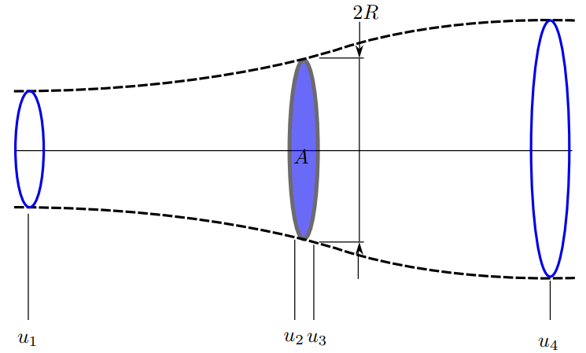
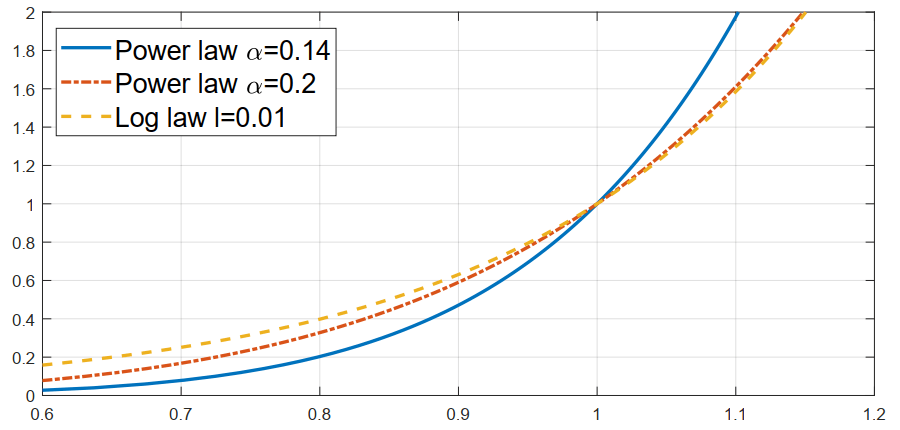
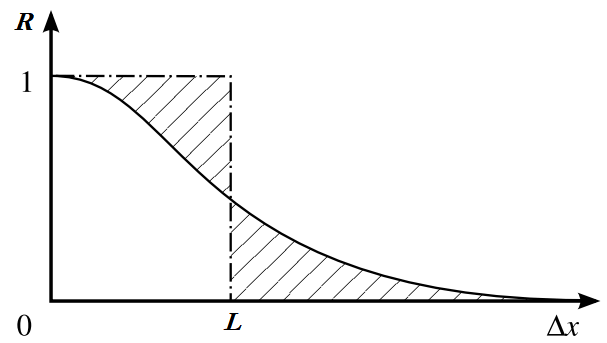
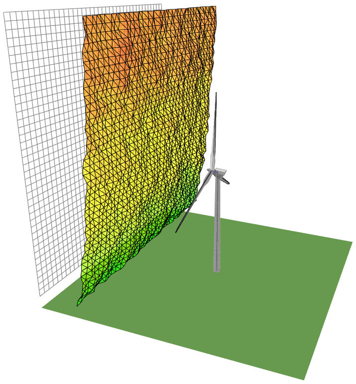

Wind
====

A wind turbine extracts energy from the wind. This occurs by converting linear kinetic energy of the wind into a force on the turbine blades. 
The force distribution along the blades generates a torque which drives a generator capable of converting the rotational kinetic energy into electrical energy. 
As such, the spatial and temporal distribution of the wind greatly affects both the loads experienced by the turbine components as well as the amount of energy which can be captured. 
A good understanding of the wind field is hence necessary in order to accurately simulate both the loads acting on the turbine as well as the energy yield.

Energy Content of the Wind 
-------------------------------------------------------

A small packet of wind with mass :math:`m`, velocity :math:`u` has a total kinetic energy :math:`E` given by :math:`\frac{1}{2} mu^2`.
The number of packets passing through the rotor per unit time :math:`\dot{m}` is proportional to the inflow velocity :math:`u`. The total energy per unit time passing through the rotor is hence given by:

.. math::
	\begin{equation}
	\frac{dE}{dt} = \frac{1}{2}\dot{m}u^2 \propto \frac{1}{2}m u^3
	\end{equation}
	\textrm{  .} 

We see that the total energy captured is in fact proportional to the cube of the inflow velocity. 
The actuator disc theory is a simplified analysis which can be used to assess the maximum amount of energy which can be extracted by the turbine. 
In this theory the rotor is modelled as a thin disc which extracts energy from the field in the form of a uniform pressure drop :footcite:`BurtonBook`.
It is assumed that the flow is unidirectional (uniform) and that the streamtube containing the inflow expands passing through the rotor, as illustrated in :numref:`fig-Wind-AD1`. 

.. _fig-Wind-AD1:

	
	Idealised treatment of the flow field through a wind turbine rotor of the actuator disc theory. The streamtube is shown dashed.

We shall introduce a new quantity, the axial induction :math:`a = 1 - u/u_{\infty}`, where :math:`u_{\infty}=u_1` is the inflow velocity far upstream of the rotor. 
The axial induction is a measure for the deceleration of the wind caused by the presence of the rotor. Following this specification, it is clear that the velocity through the rotor can be expressed as :math:`u = u_{\infty}(1-a)`.
The flow downstream is given by :math:`u_4 = u_{\infty}(1-2a)`. In addition to predictions of the velocity field, the Bernoulli equation is utilized within the actuator disc to calculate integral forces acting over the disc. 
The total force in freestream direction, the thrust :math:`T`, is given by:

.. math::
	\begin{equation}
	T = 4a(1-a)\frac{1}{2}\rho u_{\infty}^2 A
	\end{equation}
	\textrm{  ,}
	
where :math:`A` is the area of the rotor and :math:`\rho` is the density of the inflow field. A similar analysis can be used to determine the total power :math:`P` extracted by the disc:

.. math::
	\begin{equation}
	P = 4a(1-a)^2\frac{1}{2}\rho u_{\infty}^3 A
	\end{equation}
	\textrm{  .}

The factor :math:`4a(1-a)^2` leading this equation provides insight into the energy which can be extracted from the wind. The factor reaches a maximum of :math:`16/27` at :math:`a = 1/3`. 
This is known as the Betz limit and implies that practically only approximately 60% of the kinetic energy of the wind can be extracted in practice. 
Although the actuator disc theory is useful for theoretical predictions, in practice the wind field is nonuniform and unsteady. The following sections describe realistic corrections to this model.

Atmospheric Boundary Layer
---------------------------------------------
In a realistic inflow the velocity of the windfield at low altitudes is decelerated due to the no-slip boundary condition at the surface of the earth. 
This means practically that as the height from the ground increases, the wind speed increases until it reaches the velocity of the geostrophic wind (outside of the boundary layer). 
This is also commonly referred to as vertical shear. One common approach to modelling this is to use a power law rule for the velocity field as a function of height :math:`z`. In this case the velocity is specified as:

.. math::
	\begin{equation}
	u(z) = u_0\left( \frac{z}{z_0} \right)^\alpha
	\end{equation}
	\textrm{  ,}
 
where :math:`u_0` is a reference wind velocity specified at a reference height :math:`z_0` and :math:`\alpha` is the exponent. 
A typical value for :math:`\alpha` is :math:`0.2` for normal wind conditions onshore and :math:`0.14` for normal wind conditions offshore. An alternative model is to assume a logarithmic wind profile, described by:

.. math::
	\begin{equation}
	u(z) = u_0\frac{\log (z/l)}{\log (z_0/l)}
	\end{equation}
	\textrm{  ,}

where :math:`l` is a roughness height. These are visualised for three profiles in :numref:`fig-Wind-VertVel`. 

.. _fig-Wind-VertVel:

	
	Standard approaches to modelling the atmospheric boundary layer velocity profile.

Yaw, Vertical Shear, and Veer
---------------------------------------------
In addition to the atmospheric boundary layer, the mean inflow direction may not be aligned with the rotor axis due to change in wind direction or misalignment of the turbine.
The angle between the mean inflow direction and the rotor axis in a horizontal plane (:math:`z=\textrm{const.}`) is referred to as the yaw misalignment. The relative velocity of the inflow seen by the blade changes
depending on whether the blade is moving upstream or downstream, and this hence induces an unsteady load on the turbine. A misalignment in a vertical plane can also occur, this is commonly referred to as the vertical inflow angle. 
For very large rotors, Coriolis forces acting on the atmosphere can also give rise to a change in wind direction with height, this is referred to as vertical veer.

Turbulent Inflow
---------------------------------------------
In generally all cases of practical interest, the inflow of a wind turbine is turbulent.
The influence of atmospheric stability, terrain, obstacles and upstream turbines act to further increase the turbulence in the inflow of a wind turbine. 
A realistic modelling approach therefore also accounts for this.
Inflow turbulence is generally inhomogeneous and anisotropic, however for many cases homogeneity and isotropy can be assumed.
A representative quantity for the magnitude of the turbulent velocity fluctuations is given by the turbulence intensity :math:`I_T`, given by:

.. math::
	\begin{equation}
	I_T = \frac{\sqrt{u'^2}}{u_0} = \frac{\sigma}{u_0} 
	\end{equation}
	\textrm{  ,}

where :math:`\sigma` is the standard deviation of the velocity fluctuations. 
Turbulent fluctuations are strongly a function of space and time, and the degree of correlation of these fluctuations provides insight into the statistical variance of the field.
The autocorrelation function :math:`R` quantifies how a given flow quantity (here, :math:`u'` for example) are spatially coincident based on its value at two positions :math:`\Delta\vec{x}` apart in space:

.. math::
	\begin{equation}
	R(\vec{x},\Delta\vec{x}) = \frac{ u'(\vec{x})u'(\vec{x}+\Delta\vec{x}) }{ \sqrt{ u'^2(\vec{x}) }\sqrt{ u'^2(\vec{x}+\Delta\vec{x}) } }
	\end{equation}
	\textrm{  ,}

all quantities here refer to ensemble averaged values. By recording this for a given turbulent field (shown in :numref:`fig-Wind-R`), this allows the calculation of the integral length scale :math:`L`, which 
provides a measure for the physical scale of the turbulent structures in the flow field. 

.. _fig-Wind-R:

	
	The autocorrelation function of a field quantity. The integral length scale :math:`L` can be determined from this.

Within the scope of isotropic turbulence theory :footcite:`BatchelorBook`, empirical observations of atmospheric flows have allowed for the development of models which describe accurately turbulence spectra within atmospheric boundary layers.
Two models are commonly applied to determine the spectral density distribution :math:`S(f)`, where :math:`f` represents the frequency. The first is the Kaimal spectrum:

.. math::
	\begin{equation}
	\frac{fS_u(f)}{\sigma^2} = \frac{4fL{u_0}^{-1}}{ (1 + 6fL{u_0}^{-1})^{5/3} }
	\end{equation}
	\textrm{  .}

The second is the von Karman spectrum: 

.. math::
	\begin{equation}
	\frac{fS_u(f)}{\sigma^2} = \frac{4fL{u_0}^{-1}}{ (1 + 70.8(fL{u_0}^{-1})^2)^{5/6} }
	\end{equation}
	\textrm{  ,}

With these models it is possible to generate a synthetic turbulence field which has representative statistical properties. Two methods are commonly applied to cases of wind turbine simulation.
These methods, based upon Taylor's hypothesis :footcite:`BatchelorBook`, generate a *block* grid which is convected with the mean free stream velocity through the computational domain. 
The first method, commonly known as Veer's method :footcite:`Veers_1988` takes as input the power spectral density type and coherence function. 
A turbulent windfield generated with this method is illustrated in :numref:`fig-Wind-Turb`. The second method, referred to as Mann's method :footcite:`Mann_1998` relies on a model of the spectral tensor. 

.. _fig-Wind-Turb:

	
	A synthetically generated turbulent velocity field for the simulation of a turbine operating in a turbulent inflow. 

.. footbibliography::
