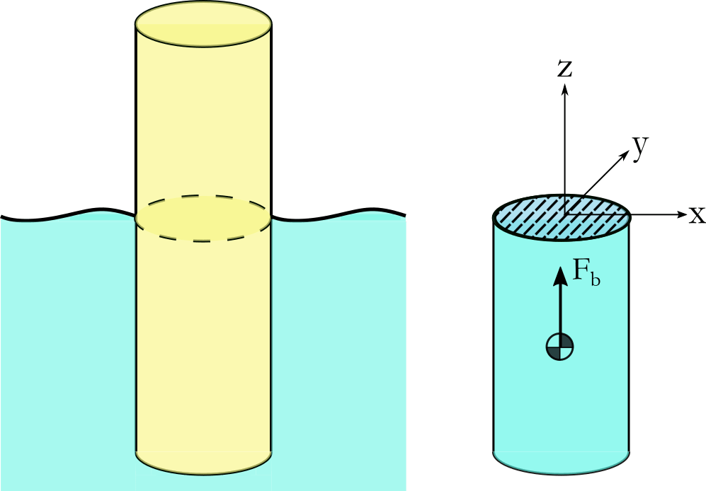

Hydrostatic Forces
==================
Of the numerous forces acting on the substructure of an offshore wind turbine, amongst the most important are those due to buoyancy. 
It shall be assumed that the displaced fluid has density :math:`\rho` [kgm :math:`^{-3}`] and is within a gravity field with acceleration :math:`g` [ms :math:`^{-2}`].

Archimedes' Principle
---------------------
This states that the magnitude of the buoyancy force :math:`\vec{F}_b` is equivalent to the weight of the fluid volume that the body displaces :math:`V_d`. 
The total force can be calculated as:

.. math::
   \vec{F}_b = \iint_{A} p(z)\vec{n}\,dA = \iiint_V \nabla(p)\,dV = \rho g V_d

where :math:`p(z)` is the pressure (normal stress) as a function of depth, :math:`\vec{n}` is the normal to the surface and :math:`A` and :math:`V` are the submerged surface area and displaced volume of the body, respectively.
The force acts at the center of buoyancy, which is the center of gravity of :math:`V_d`. This is shown for a simple geometry in :numref:`fig-HS-HF`.

.. _fig-HS-HF:

	
	Floating body (left) and the corresponding displaced volume (right).	
	
The motion and orientation of the body and the local surface elevation causes the displaced volume to change with time, this correspondingly changes the magnitude and direction of :math:`\vec{F}_b`.
Depending on the spatial distribution of :math:`V_d`, this can also induce a buoyancy moment on the body. There are three main approaches for calculating these loads. 

Discrete Surface Buoyancy Calculation
---------------------------------------------
In this approach the submerged surface :math:`A` is discretised non-overlapping surface elements and the pressure acting over the surface is numerically integrated in order to arrive at the total buoyancy force. 
The hydrostatic equation is used to determine the pressure as a function of depth:

.. math::
   p(z) = p_0 - \rho g z

where :math:`p_0` is the atmospheric pressure at the free surface. As pressure is a normal stress, this force always acts in the direction normal to the surface :math:`\vec{n}`.

Discrete Volume Buoyancy Calculation
---------------------------------------------
In this approach the displaced volume :math:`V_d` is discretised into non-overlapping volume elements. The buoyancy force acting at the centre of buoyancy of each element are then integrated to get :math:`\vec{F}_b`. 
This is practically equivalent to the discrete surface approach, however integration is carried out over volume elements. 

In QBlade the volume buoyancy calculation approach is used. In general all offshore substructures in QBlade are composed of cylindrical elements. There are two methods implemented how the buoyancy of a cylinder is calculated in QBlade. 

In the simple approach the intersection between the cylinder center-line and the local sea elevation is evaluated. Based on this intersection and the cylinder endpoints it is estimated whether the cylinder is not, fully or only partially submerged. The partially submerged part of the cylinder is estimated from the submerged part of the center-line. The submerged height is treated as constant around the cylinder circumference, regardless of its orientation. The buoyancy force then acts on the midpoint of the submerged part of the center-line. 

In the advanced buoyancy approach in QBlade each cylinder is discretized into multiple prismatic elements (the element number is a user input, 100 is the suggested default value). For each of these elements the center-line approximation is carried out and then all forces are summed up and an equivalent force acting point is evaluated.

Hydrostatic Stiffness Matrix
---------------------------------------------
It is assumed that the surface elevation is approximately constant. This is valid if the wavelength of the sea state is much larger than the body's dimensions. The motion of the body away from equilibrium can be expressed as a translation and rotation:

.. math::
   d\vec{x} = [\delta_x, \delta_y, \delta_z, \theta_x, \theta_y, \theta_z]

The buoyancy force can then be expressed as:

.. math::
   \vec{F}_b = \vec{F}_{c} - C d\vec{x}

where:

.. math::
   \vec{F}_{c} =
   \begin{bmatrix}
      0 \\
      0 \\
      \rho g V_d \\
      0 \\
      0 \\
      0 \\
   \end{bmatrix}, \quad
   C =
   \begin{bmatrix}
      0 & 0 & 0 & 0 & 0 & 0 \\
      0 & 0 & 0 & 0 & 0 & 0 \\
      0 & 0 & C_{33} & C_{34} & C_{35} & 0 \\
      0 & 0 & C_{43} & C_{44} & C_{45} & C_{46} \\
      0 & 0 & C_{53} & C_{54} & C_{55} & C_{56} \\
      0 & 0 & 0 & 0 & 0 & 0 \\
   \end{bmatrix}

Here, :math:`\vec{F}_c` is the buoyancy force vector at equilibrium, and :math:`C` is the hydrostatic stiffness matrix, defined by integrals over the waterplane area :math:`S`:

.. math::
   \begin{aligned}
      C_{33} & = \rho g \iint_S dS, & C_{34} & = C_{43} = \rho g \iint_S y \, dS, \\
      C_{44} & = \rho g \iint_S y^2 \, dS + \rho g V_d z_b, & C_{35} & = C_{53} = -\rho g \iint_S x \, dS, \\
      C_{55} & = \rho g \iint_S x^2 \, dS + \rho g V_d z_b, & C_{45} & = C_{54} = -\rho g \iint_S xy \, dS, \\
      C_{46} & = -\rho g V_d x_b, & C_{56} & = -\rho g V_d y_b
   \end{aligned}

where :math:`\vec{B} = [x_b, y_b, z_b]` is the position of the center of buoyancy. In practice many of these terms are zero due to symmetries of the body. 
It can be seen that the hydrostatic loads assume that the water-plane area does not significantly change. It is for this reason that the above expression is only valid for small rotations and translations. 
When the force  acting on the body due to gravity is taken into account, it can be seen that the :math:`V_d` terms in the :math:`C_{ij}` represent restoring buoyancy moments which act to stabilise the body position. 
For a detailed overview of stability of floating bodies, the reader is referred to the book by Newman :footcite:`Newman_Book`. 

.. footbibliography::
