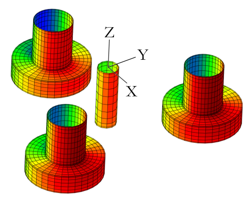

Linear Potential Flow Theory
============================
QBlade is capable of calculating hydrodynamic forces on submerged elements due to floater motion and waves by making use of potential flow theory. 
This allows the full interaction between the three dimensional floater geometry and the wave field to be accounted for.

Potential flow and boundary conditions
---------------------------------------------
Here it is assumed that the flow field is irrotational. This allows the flow field to be described in terms of a scalar potential :math:`\phi`, 
which satisfies Laplace's differential equation :math:`\nabla^2\phi=0`. The velocity field :math:`\vec{v}` can be expressed as the gradient of this potential:

.. math::
	\begin{equation}
	\vec{v} = \nabla \phi = \frac{\partial \phi}{\partial x}\vec{e}_x + \frac{\partial \phi}{\partial y}\vec{e}_y + \frac{\partial \phi}{\partial z}\vec{e}_z
	\end{equation}
	\textrm{  .} 

Three boundary conditions are require to specify fully the problem :footcite:`Newman_Book`. The first enforces continuity at the free surface. This is linearised (hence *linear* potential flow) to give:

 .. math::
	\begin{equation}
	\frac{\partial \phi}{\partial z} - \frac{\omega^2}{g}\phi = 0  \hspace{5mm} \textrm{on} \hspace{5mm} z=0 
	\end{equation}
	\textrm{  ,} 

where :math:`g` is the acceleration due to gravity and :math:`\omega` is the discrete frequency being analysed.
The second enforces the boundary condition on the sea bottom:

 .. math::
	\begin{align}
	\nabla\phi \rightarrow 0 \hspace{2mm} \textrm{as} \hspace{2mm} z \rightarrow -\infty 	& \hspace{10mm} \textrm{Infinite depth} 				\\
	\frac{\partial \phi}{\partial z} = 0 \hspace{2mm} \textrm{on} \hspace{2mm} z = -h 					& \hspace{10mm} \textrm{Finite depth  } h \textrm{  .}  \\ 
	\end{align}
	
Finally, the Sommerfeld condition states that wave energy associated with disturbance due to the body is radiated in all directions. 
A few assumptions are outlined here for the following discussion:

- The floater undergoes negligibly small motions away from the equilibrium position.    
- Solutions are assumed to be harmonic  :math:`\hat{\phi} = \phi\,e^{i\omega t}`.    
- The floater is submerged in a fluid with density :math:`\rho` :math:`\textrm{kg}\,\textrm{m}^{-3}`.    

Equations of Motion
---------------------------------------------
The motion of a generic floating body in dimension :math:`j`: :math:`x_j(t)` can be modelled with the equation due to :footcite:t:`Cummins_1962`:

.. math::
	\begin{equation}
	(M_{ij}+A_{ij}^{\infty})\ddot{x}_j(t) + 
	\int_{-\infty}^{t}K_{ij}(t-\tau)\dot{x}_j(\tau)\,d\tau + 
	C_{ij}x_j(t) =
	F_j^{w}(t) - F_j^{e}(x,\dot{x},t)  \textrm{   .}
	\end{equation}
	
In the above expression the indices :math:`i` and :math:`j` represent the degree of freedom of motion
and the acting force, respectively. In this equation:

- :math:`M_{ij}` represents the inertia of the floater
- :math:`A_{ij}^{\infty}` is the added mass matrix (see Radiation forces below) 
- :math:`K_{ij}` is the radiation damping matrix (see below) 
- :math:`C_{ij}` is the hydrostatic stiffness matrix (see Article on Buoyancy)
- :math:`F_j^{w}` are the forces due to waves (see Excitation forces below)
- :math:`F_j^{m}` are external forces due to moorings
	
These terms shall be described in the following sections.

Radiation forces
---------------------------------------------
The motion of the floater in an undisturbed field generates waves which radiate away from the body. 
Newton's third law dictates that the force required to set this disturbance in motion gives rise to an equal and opposite force on the body. This acts in the form of a pressure disturbance. 
An example of this is shown in the following figure for a motion in the surge direction.

.. _fig-lpft-srge:

	
    Disturbance potential :math:`\phi_r` of a triple-spar geometry for a surge motion.

The disturbance potential :math:`\phi_r` due to this motion is sought. The body is taken as being impermeable which implies that the local velocity (gradient of the potential) must be equivalent to the local body motion:

.. math::
	\begin{equation}
	\frac{\partial \phi_r}{\partial n} = \nabla\phi\cdot\vec{n} =  \vec{u}
	\end{equation}
	\textrm{  ,} 
	
where :math:`\vec{n}` is the normal vector at the surface. The solution for :math:`\phi_r` on the geometry represents the hydrodynamic pressure acting. 
This is integrated over the floater surface :math:`S_b` to give the total forcing due to motion (note that this is complex as a harmonic solution has been assumed):  

.. math::
	\begin{equation}
	A_{ij} - \frac{i}{\omega}B_{ij} = \rho \iint_{S_b}n_i\,\phi_{r,j}\,dS
	\end{equation}
	\textrm{  ,} 

where :math:`A_{ij}` and :math:`B_{ij}` are referred to as the *added mass* and *radiation damping* matrices. It is important to note that the terms above are calculated in a frequency domain analysis.
The added mass matrix can be taken directly from the frequency domain analysis as:

.. math::
	\begin{equation}
	A_{ij}^{\infty} = \lim_{\omega\to\infty} A_{ij}(\omega)
	\end{equation}
	\textrm{  ,}

where it is important that a sufficiently high analysis frequency  :math:`\omega` is taken to ensure that :math:`A_{ij}(\omega)` has converged. 
An impulsive motion in any direction generates a force which is time-varying, this is accounted for with the time convolution in the equations of motion above. 
The time convolution kernel is referred to as the *impulse response function*, or IRF and is calculated as:

.. math::
	\begin{equation}
	K_{ij}(t) = 
	\frac{2}{\pi}\int_{0}^{\infty} \omega A_{ij}(\omega)\sin \omega t\,d\omega = 
	\frac{2}{\pi}\int_{0}^{\infty} B_{ij}(\omega)\cos \omega t\,d\omega  
	\end{equation}
	\textrm{  .}
	
In practise the second form is used due to its easier numerical integration.

The arrays for :math:`A_{ij}(\omega)` and :math:`B_{ij}(\omega)` can be imported into QBlade in NEMOH, WAMIT, or BEMUse formats. This integration is carried out numerically with a frequency step size :math:`\Delta_{\omega}`, 
specified in the input file with the parameter DELTA_FREQ_RAD over the frequency range specified in the input file:
	
.. math::
	\begin{equation}
	K_{ij}(t) = 
	\frac{2}{\pi}\int_{0}^{\infty} B_{ij}(\omega)\cos \omega t\,d\omega  \approx
	\frac{2}{\pi} \sum_{n=1}^{n=\omega_{max}} \Delta_{\omega} B_{ij}(n\Delta_{\omega})\cos tn\Delta_{\omega}
	\end{equation}
	\textrm{  .}

The decay of :math:`K_{ij}` implies that the time convolution can be truncated to a finite time :math:`T`, specified in the input file with the parameter TRUNC_TIME_RAD. 
The time convolution is carried out numerically based on the timestep :math:`\Delta_t`:

.. math::
	\begin{equation}
	\int_{t-T}^{t}K_{ij}(t-\tau)\dot{x}_j(\tau)\,d\tau \approx
	\sum_{i=1}^{i=T/\Delta_t} \Delta_t K_{ij}(i\Delta_t)\dot{x}_j(t-i\Delta_t)
	\end{equation}
	\textrm{  .}
	
In practise this is a double summation. 
	
Excitation forces
---------------------------------------------
The boundary condition on the surface of the floater causes incoming waves to be reflected away. As with the radiation forces, this gives rise to a disturbance potential :math:`\phi_d` and a corresponding force :math:`X_j` which acts on the floater.
The Haskind relations allows these forces to be expressed in terms of the radiation potential:

.. math::
	\begin{equation}
	X_j = -i\omega\rho\iint_{S_b} \left( n_i\phi_0- \phi_{r,j}\frac{\partial \phi_0}{\partial n}\right)dS
	\end{equation}
	\textrm{  ,}

where :math:`\phi_0` is the potential of the incoming wave. An IRF for this is calculated as:

.. math::
	\begin{equation}
	E_{ij}(t) = 
	\frac{1}{2\pi}\int_{-\infty}^{\infty}X_j(\omega)e^{i\omega t}\,d\omega 
	\end{equation}
	\textrm{  .}

This is numerically integrated as with the IRF for the radiation forces with a frequency step size :math:`\Delta_{\omega}`, specified in the input file with the parameter DELTA_FREQ_DIFF over the frequency range specified in the input file.
As with the radiation forces, the time-domain excitation forces are calculated with a time convolution with the IRF given above:

.. math::
	\begin{equation}
	F_j^{w}(t) = \int_{-\infty}^{\infty} E_{ij}(\tau)\dot{x}_j(t-\tau)\,d\tau
	\end{equation}
	\textrm{  .}
	
This implies that incoming wave information is required as *upstream* waves induce an excitation force on the floater. 
This integral is again calculated numerically over a truncated time period :math:`T`, specified in the input file with the parameter TRUNC_TIME_DIFF, in an equivalent fashion to that done for the radiation forces.
	
.. footbibliography::
