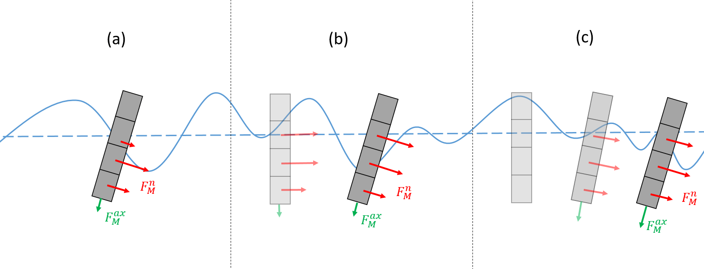

Morison Equation
================
QBlade also offers the possibility to model hydrodynamic loads on slender cylindrical bodies via the Morison equation.
This is especially useful for calculating distributed hydrodynamic loads on the members and allow substructure flexibility.
QBlade considers two types of Morison forces on cylindrical elements: normal forces that act at the center of the element and axial forces that
act at the ends of the element.

Normal Morison Force on a Cylindrical Element
---------------------------------------------
The hydrodynamic normal forces on a cylindrical element are given by :footcite:t:`Faltinsen1993`

.. math::
    \begin{align}
    F_M^n &= \rho \pi \left(\frac{D}{2}+R_{MG}\right)^2 L \left((C_a^n+C_p^n) \dot{u}^n - C_a^n \ddot{X}^n\right)  \\
          &+ \frac{1}{2} \rho \left(D+R_{MG}\right) L C_d^n \left(u^n - \dot{X}^n\right)\left|u^n - \dot{X}^n\right|.
    \end{align}

In this equation,

- :math:`F_M^n` is the normal Morison force,
- :math:`\rho` is the water density,
- :math:`D` and :math:`L` are the diameter and length of the cylinder element, respectively,
- :math:`R_{MG}` is the marine growth tickness,
- :math:`C_a^n` is the normal added mass coefficient,
- :math:`C_p^n` is the normal dynamic pressure coefficient,
- :math:`C_d^n` is the normal drag coefficient,
- :math:`u^n` is the resulting normal flow velocity,
- :math:`\dot{X}^n` is the resulting normal velocity of the center of the cylinder element.

In the structural model of QBlade naturally handles the vector direction of the local normal force components depending on the element position and rotation (see :doc:`../../structure/chrono/chrono`). 
The normal force always acts at the center of the submerged part of the cylinder. Note that this position can vary if the cylinder element is close to the water surface and only parts of the cylinder are submerged. 
The local instantaneous wave elevation is taken into account every timestep to calculate submerged fraction of the cylinder and hence the position where the force vector acts. 
It is therefore recommended to subdivide cylinder elements that are close to the water surfeace into smaller sub-elements to increase model accuracy (see :ref:`modeling-considerations`)

Axial Morison Force on a Cylindrical Element
---------------------------------------------
Axial forces can also be applied to the ends of a cylindrical element. In QBlade, the hydrodynamic forces are calculated using following equation:

.. math::
    \begin{align}
    F_M^{ax} &= \rho \frac{2\pi}{3} \left(\frac{D}{2}+R_{MG}\right)^3 C_a^{ax} (\dot{u}^{ax} - \ddot{X}^{ax}) + C_p^{ax} p_{dyn}^{ax} \pi \left(\frac{D}{2}+R_{MG}\right)^2  \\
             &+ \frac{1}{2} \rho \pi \left(D+R_{MG}\right)^2 C_d^{ax} \left(u^{ax} - \dot{X}^{ax}\right)\left|u^{ax} - \dot{X}^{ax}\right| .
    \end{align}

In this equation,

- :math:`F_M^{ax}` is the axial Morison force,
- :math:`\rho` is the water density,
- :math:`D` and :math:`L` are the diameter and length of the cylinder element respectively,
- :math:`R_{MG}` is the marine growth tickness,
- :math:`C_a^{ax}` is the axial added mass coefficient,
- :math:`C_p^{ax}` is the axial dynamic pressure coefficient,
- :math:`C_d^{ax}` is the axial drag coefficient, along the ith axis,
- :math:`p_{dyn}^{ax}` is the axial dynamic pressure,
- :math:`u^{ax}` is the resulting axial flow velocity,
- :math:`\dot{X}^{ax}` is the resulting axial velocity of the center of the cylinder end.

As with :math:`F_M^n`, the structural model in QBlade always applies the axial loads in the local frame of reference considering the orientation of the cylinder. 

The axial force calculation is only performed at the ends of cylindrical elements that are not obstructed, or overlapped, by the ends of other cylindrical elements which share the same node.
Example: If a 'thinner' cylindrical element :math:`D_{thin}` is connected to a 'thicker' element :math:`D_{thick}` via a common node the axial force is evaluated at the end of the 'thick' element only. 

In such a case the effective volume at the 'thicker' element would be calculated as:

.. math::
    \begin{align}
    V = \frac{2\pi}{3}\left(\left(\frac{D_{thick}}{2}+R_{MG}\right)^3-\left(\frac{D_{thin}}{2}+R_{MG}\right)^3\right) ,
    \end{align}

and the effective area would be calculated as:

.. math::
    \begin{align}
    A = \pi\left(\left(\frac{D_{thick}}{2}+R_{MG}\right)^2-\left(\frac{D_{thin}}{2}+R_{MG}\right)^2\right) .
    \end{align}

.. _modeling-considerations:

Modeling Considerations
-----------------------
In QBlade, each cylindrical element is divided into sub-elements for which the Morison equations is applied. 
Setting the hydrodynamic coefficients to 0 effectively disables the calculation of the Morison forces. This way, it possible to include for example the hydrodynamic drag only. 
To determine if a sub-element is partially or fully submerged, the wave elevation is required. 
Wave kinematics are also required to calculate :math:`u^n` and :math:`u^{ax}` in the equations above. There are three posibilities in QBlade to do this. 
These options are shown in the following figure.

.. _fig-me-kin-opt:

    Options in QBlade to consider the wave elevation and kinematics. (a) local intantaneous values; (b) values at the inital undisplaced position; (c) values at a low-passed position of the element.

The first option shown in :numref:`fig-me-kin-opt` (a) is the wave kinematics and elevation in the local instantaneous position of the cylinder. In this example, the cylinder has been divided into four
sub-elements. The lower two are fully submerged and one sub-element is partially submerged. The second option in :numref:`fig-me-kin-opt` (b) 
is using the wave elevation and kinematics at the inital position of the sub-element. This option allows a coherent theoretical assumption of small oscillations around a steady positon when Morison forces are used in conjuction with a linear potential
flow model (see :doc:`../lpft/lpft`). The third option is using the wave elevation and kinematics at a low-passed position of the sub-element (:numref:`fig-me-kin-opt` (c)). This allows for an assumption of 
small oscillations around a steady state for an element that as drifted from its initial position due to e.g. an aerodynamic thrust or sea current forces.

.. footbibliography::
