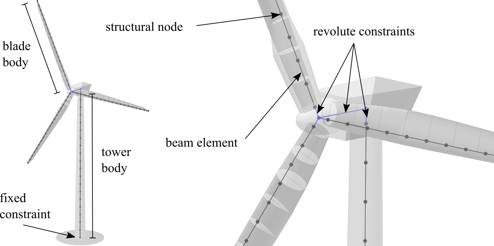

Multi Body Beam Formulation
===========================
The structural model in QBlade is based on the FEA module of the open source multi-physics engine Project Chrono :footcite:t:`Tasora2016b`. Project Chrono is based on a platform independent design :footcite:t:`Projectchrono.org2019`, which is developed in the C++ language as an object-oriented library.

For the integration into QBlade the Chrono::Engine module is employed. Chrono::Engine is the core module of Project::Chrono, it contains functionality for setting up and solving physical systems containing Newtonian dynamics and finite elements. The SparseLU solver of the EIGEN C++ template library :footcite:t:`eigen` is used as a solver for the finite element problem. A dynamic link library, containing the Chrono module, has been compiled from Project Chrono's GIT repository. The relevant header files of Project Chrono and the EIGEN library are included, and the Chrono DLL is linked to QBlade's source code. This enables the definition of the physical system and the finite elements and grants access to the solver to perform time domain simulation of structural dynamics inside QBlade.

Element and Multi-Body Formulation
----------------------------------
The structural turbine model in the QBlade-Chrono coupling consists of Euler Bernoulli beams in a co-rotational formulation :footcite:t:`Negrut2016`. In the co-rotational formulation (see :numref:`fig-corotational`), a floating coordinate system is attached to each deformable beam element. The overall motion of a beam element is then the addition of the rigid body (translation and rotation) undergone by the floating coordinate system and a smaller strain deformation, expressed in the floating frame of reference. The global tangent stiffness matrix in Project Chrono's implementation is formulated in a way to include terms for geometric stiffness.

.. _fig-corotational:

   Visualization of the co-rotational beam approach.

In QBlade's implementation of the structural model the complete turbine structure is divided up into body objects. A body object contains an array for its structural nodes, an array for its structural beam elements, a unique identifier and several functions to access forces, torques, positions, velocities, accelerations and deflections. For a common HAWT one body is created for each blade and one body for the tower. 

.. _fig-structural_model:

   Visualization of the co-rotational beam approach.

After the bodies have been created they are assembled using joints or constraints (see :numref:`fig-structural_model`). The tower is fixed to the ground by constraining all six DoF of the bottom tower node. A spring and damper may be defined at the ground to include foundation and soil dynamics. Using a revolute constraint, a free yaw node is connected to the tower top. Another revolute constraint then connects the hub node to the yaw node. Lastly, the blades are fixed around the hub node with revolute constraints, allowing them to rotate around the pitch axis. After the assembly of the bodies is completed, actuators are added to the revolute constraints. These actuators are used to yaw or pitch the turbine, based on controller signals and to model the generator. Actuators are implemented as engine type constraints. At these engine type constraints either a rotational angle, a rotational speed or a torque can be applied. This functionality is used to prescribe pitch angles at the pitch constraints, yaw angles at the yaw constraint and the generator torque at the shaft constraint. Furthermore, if no controller is used within a simulation, a constant rotational speed is prescribed to the main shaft to operate the turbine at a constant rotational speed.

.. footbibliography::