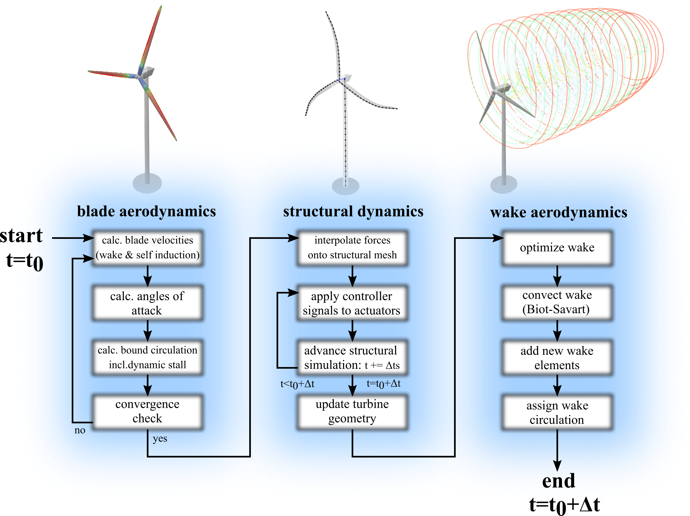

Aero-Elastic Coupling
=====================
A loose coupling approach is employed for the aero-elastic co-simulation in QBlade. Figure :numref:`fig-aeroelastic_flowchart` shows the flowchart for one complete aeroelastic time step:

.. _fig-aeroelastic_flowchart:

   Flowchart for one time step of the aeroelastic model in QBlade.
   
- The simulation starts at the time :math:`t=t_0`. At first, the iteration to find a converged circulation distribution for the bound vorticity of the rotor blade is carried out. In this evaluation, the expensive step of calculating the wake induced velocities for the rotor panels is only carried out once at the beginning of the iteration, as the wake shape remains fixed during the iteration. During this iteration, in the calculation of the blade panels lift and drag characteristics, the unsteady aerodynamics model (see :doc:`../../aerodynamics/dynamic_stall/index_dynamicstall`) and other corrections, such as Snel's correction (see :doc:`../../aerodynamics/secondary_effects/himmelskamp`) are applied. Once a converged solution for the bound circulation is obtained, the blade aerodynamics calculations are finished.

- The blade panel forces and moments, resulting from the associated airfoils lift-, drag- and moment characteristics, are interpolated from the aerodynamic discretization (panels) onto the structural dynamics discretization (beam elements). Furthermore, the controller signals are applied onto the actuators. The simulation is now advanced with the structural time step :math:`\Delta t_s`. If the current simulation time has reached :math:`t=t_0+\Delta t`, the structural dynamics simulation is finished. If :math:`t<t_0+\Delta t` the structural simulation is incremented again with :math:`\Delta t_s`, applying new controller signals and rotating the aerodynamic forces and moments\footnote{These forces remain constant during the structural sub time steps} with the incremental rotor advancement. This is repeated until the simulation time has reached :math:`t=t_0 +\Delta t`. Now, the current positions of all beam elements and rigid bodies are interpolated back onto the aerodynamic mesh and the aerodynamic model is advanced onto its final position for this time step.

- In the last step the wake is updated. The wake discretization is optimized by removing or lumping wake elements (see :doc:`../../aerodynamics/lifting_line/lifting_line`). Now, the wake is updated by evaluating the self-induced wake velocities at the wake nodes, updating the vortex core sizes and advancing the wake element positions with :math:`\Delta t` using one of the implemented time integrators (see :doc:`../../structure/chrono/chrono`). The gap that now exists between the new wake positions and the advanced rotor blade positions is 'filled' with new shed and trailing wake elements. Finally, the circulation of the newly created wake elements is assigned using the Kutta condition.
   
.. _fig-coupled:

   
   Visualization of the coupled, aero-elastic model