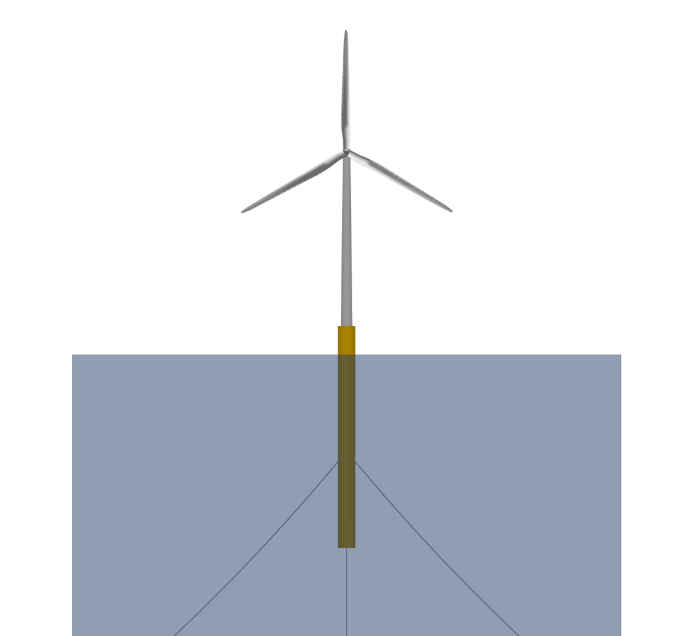
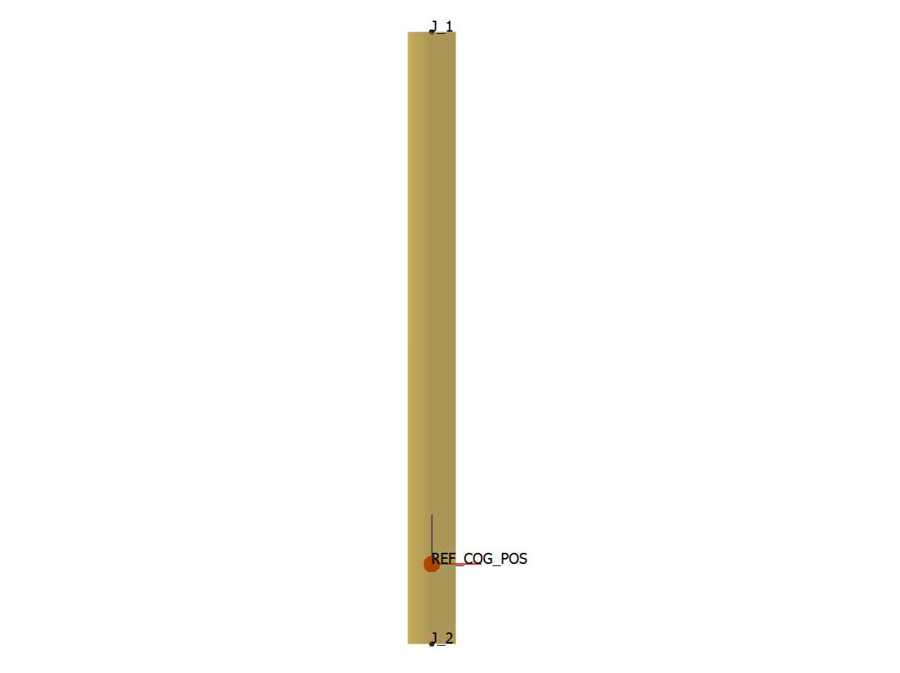
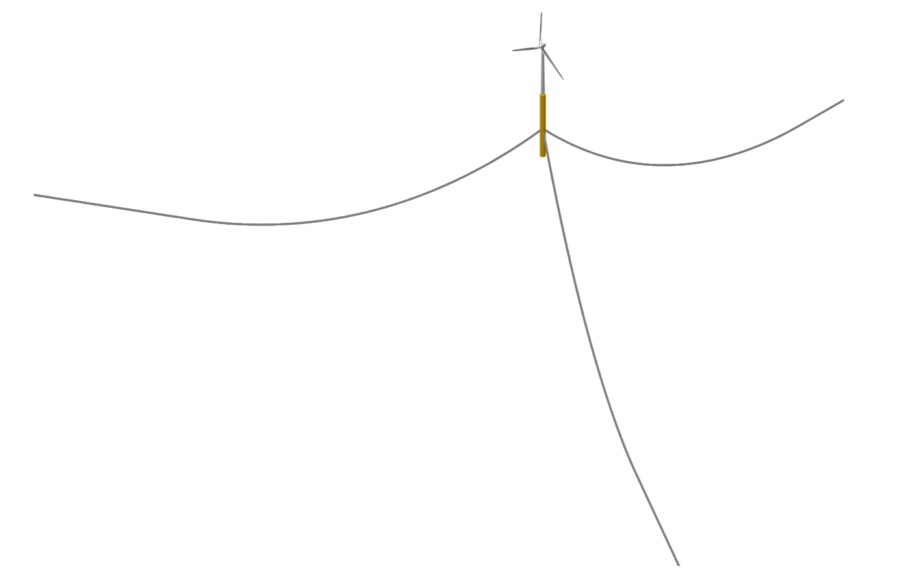

Creating a Simple Rigid Spar Substructure
=========================================

In this tutorial, we will build a basic floating offshore wind turbine foundation: a rigid spar buoy. To keep things simple and focus on the fundamentals, we will use a lumped mass matrix for the structure's inertia and the Morison equation for all hydrodynamic forces. We will balance this spar specifically to support the standard NREL 5MW onshore turbine.

.. _fig-rigid_spar_1:

   
   The Rigid Spar Substructure created during this tutorial

By the end of this tutorial, you will have a complete ``.sub`` file that you can integrate into a full aeroelastic QBlade simulation.

Step 1: Global Environment Settings
-----------------------------------

Every substructure file begins by defining the environment. We need to tell QBlade that this is a floating structure, define the water depth, and set the water density for buoyancy calculations. 

By setting ``ISFLOATING`` to ``true``, we shift the global origin (0,0,0) from the seabed up to the Mean Sea Level (MSL). This simple change makes defining drafts and wave elevations much more intuitive as we build our geometry.

.. code-block:: text

   // --- 1. GLOBAL ENVIRONMENT SETTINGS ---
   true            ISFLOATING      // Origin (0,0,0) is at Mean Sea Level (MSL)
   320             WATERDEPTH      // Design water depth in meters
   1025            WATERDENSITY    // Seawater density (kg/m^3)

Step 2: Reference Points and Ballast
------------------------------------

The ``TP_INTERFACE_POS`` (Transition Piece) is where our spar connects to the bottom of the wind turbine tower. We place this 15 meters above the waterline to provide a sufficient "air gap." This ensures that extreme 50-year storm waves do not slam into the tower base or transition piece platform.

For stability, a spar buoy relies heavily on gravity. The Center of Buoyancy (COB) of our 100m draft cylinder naturally sits at -50m. To prevent the turbine from capsizing, we must place heavy ballast at the very bottom of the spar. By setting the ``REF_COG_POS`` (Center of Gravity) deep down at -85m, we create a strong righting moment that keeps the turbine upright.

.. code-block:: text

   // --- 2. REFERENCE POINTS ---
   TP_INTERFACE_POS                
   X[m]    Y[m]    Z[m]
   0       0       15

   REF_COG_POS                     
   X[m]    Y[m]    Z[m]
   0       0       -85

Step 3: Geometry, Topology, and Visualization
---------------------------------------------

We create the spar using just two joints: the top (at the 15m Transition Piece) and the bottom (-100m deep). 

We use the ``SUBELEMENTSRIGID`` table to define our 9.0m diameter structure. Because we will define the total lumped mass in the ``SUB_MASS`` matrix, we must explicitly set the element mass density (``BMASSD``) to ``0``. If we gave the element a density, QBlade would add that mass on top of the lumped mass matrix, double counting the floaters mass.

.. code-block:: text

   // --- 4. GEOMETRY & TOPOLOGY ---
   RGBCOLOR                        // Paint the substructure offshore safety yellow
   Red     Green   Blue
   255     204     0

   SUBJOINTS
   JntID   JntX    JntY    JntZ
   1       0       0       15      // Top of the spar (at the TP)
   2       0       0       -100    // Bottom of the spar

   SUBELEMENTSRIGID                
   ElemID  BMASSD  DIAMETER
   1       0       9.0             // Zero mass, 9.0m diameter

   SUBMEMBERS                      
   // MemID Jnt1 Jnt2 ElmID ElmRot HyCoID IsBuoy MaGrID FldArea ElmDsc Name
   1        1    2    1     0      1      1      0      0       10     Main_Spar_Body
   
.. _fig-rigid_spar_2:

   
   The spar created between Jnt1 and Jnt2. Showing position of the center of gravity

Step 4: Mass Properties
-----------------------

We include the lumped spar's mass using a 6x6 mass matrix (``SUB_MASS``) at our ``REF_COG_POS``. 

To float in equilibrium at our desired 100m draft, the total downward weight must match the upward buoyant force. A 9.0m diameter cylinder displacing 100m of water creates roughly :math:`6.52 \times 10^6` kg of lift. The NREL 5MW turbine weighs about :math:`0.7 \times 10^6` kg, and the suspended portion of our heavy mooring chains (see :ref:`Step 7: Catenary Mooring System`) will pull down with another :math:`0.2 \times 10^6` kg. 

Subtracting the turbine and mooring weight from our total buoyancy leaves us with :math:`5.62 \times 10^6` kg. We set the diagonal mass terms of our ``SUB_MASS`` matrix to ``5.6E+06`` to achieve a perfect equilibrium float.

.. code-block:: text

   // --- 3. MASS PROPERTIES (LUMPED APPROACH) ---
   SUB_MASS
   5.6E+06   0.0       0.0       0.0       0.0       0.0
   0.0       5.6E+06   0.0       0.0       0.0       0.0
   0.0       0.0       5.6E+06   0.0       0.0       0.0
   0.0       0.0       0.0       4.5E+09   0.0       0.0
   0.0       0.0       0.0       0.0       4.5E+09   0.0
   0.0       0.0       0.0       0.0       0.0       2.0E+08

Step 5: Hydrodynamic Coefficients
---------------------------------

To enable hydrodynamic forces, we use the Morison equation. ``HYDROMEMBERCOEFF`` allows us to model the standard transverse viscous drag acting on the submerged parts of the cylinder. 

We also assign a ``HYDROJOINTCOEFF`` specifically to the bottom face (Joint 2) to model the drag acting on the downward facing cylinder end. This acts as a virtual "heave plate." Without axial drag at the bottom face, a spar buoy tends to bob up and down uncontrollably (heave resonance) when hit by certain wave frequencies.

.. code-block:: text

   // --- 5. HYDRODYNAMIC COEFFICIENTS (MORISON EQUATION) ---
   HYDROMEMBERCOEFF                
   CoeffID CdN     CaN     CpN     MCFC
   1       0.6     1.0     1.0     0       

   HYDROJOINTCOEFF                 
   CoeffID JointID CdA     CaA     CpA
   1       2       4.8     1.0     1.0     

Step 6: Constraints
-------------------

The ``SUBCONSTRAINTS`` table acts as our *glue*. We use it to rigidly lock Joint 1 to the Transition Piece across all 6 degrees of freedom. This ensures that all the aerodynamic and structural loads from the turbine tower transfer down into our substructure.

.. code-block:: text

   // --- 6. CONSTRAINTS ---
   SUBCONSTRAINTS                  
   // CstID JntID JntCon TpCon GrdCon Spring DoF_X DoF_Y DoF_Z DoF_rX DoF_rY DoF_rZ
   1        1     0      1     0      0      1     1     1     1      1      1

Step 7: Catenary Mooring System
-------------------------------

A proper catenary system relies on the lifted weight of a heavy chain resting on the seabed, rather than a taut elastic cable. We attach three heavy lines (200 kg/m) spreading out radially 120 degrees apart. The fairleads are at -50m depth, and the anchors are pushed far out to an 800m radius. 

.. _fig-rigid_spar_3:

   
   The catenary mooring system created for the sparbuoy

The straight-line distance from the fairlead to the anchor is roughly 403 meters. If we used a cable that short, it would be extremely taut, causing massive tension spikes and potentially ripping the anchor out of the seabed. By setting the unstretched chain length to 880m, we ensure a massive amount of heavy chain rests slack on the seabed. This creates a soft, non-linear restoring force and guarantees that the pull on the anchor remains purely horizontal.

.. code-block:: text

   // --- 7. CATENARY MOORING SYSTEM ---
   MOORELEMENTS                    
   MooID   MASS_[kg/m] EIy_[N.m^2] EA_[N]      DAMP_[-]  DIA_[m]
   1       200.0       1.0E+05     7.5E+08     0.0       0.15

   MOORMEMBERS                     
   // ID CONN_1(Floater)    CONN_2(Seabed)     Len.[m] MooID HyCoID IsBuoy MaGrID ElmDsc Name
   1     FLT_0_0_-50        GRD_800_0          880     1     1      0      0      30     Line_1
   2     FLT_0_0_-50        GRD_-400_692.8     880     1     1      0      0      30     Line_2
   3     FLT_0_0_-50        GRD_-400_-692.8    880     1     1      0      0      30     Line_3

Step 8: Adding Sensors to Store Outputs
---------------------------------------

Setting up sensors allows us to analyze the physics post-simulation. ``MOO_1_0.0`` requests the tension specifically at the fairlead (relative position 0.0) of Mooring Line 1. ``JNT_1`` tracks the 6-degree-of-freedom displacements and rotations of Joint 1.

.. code-block:: text

   // --- 8. SENSORS (OUTPUTS) ---
   MOO_1_0.0   
   JNT_1       

Step 9: Integrating with Your Turbine Model
-------------------------------------------

Once your substructure file is complete, you have two distinct ways to use it in QBlade:

1. **Full Aeroelastic Turbine Simulation (Coupled):** To place the NREL 5MW turbine on top of this spar, open your main structural input file (often a ``.str`` file) for the NREL 5MW. Add the filename of your substructure followed by the keyword ``SUBFILE`` anywhere in that document. QBlade will automatically connect the tower bottom to your ``TP_INTERFACE_POS``.
   
   .. code-block:: text
   
      rigid_spar.sub    SUBFILE

2. **Standalone Substructure Modeling (Uncoupled):**
   If you want to test the hydrodynamics, decay, or mooring response of the spar *without* the aerodynamic complexity of the turbine, you can load the ``.sub`` file directly into the turbine model (instead of the structural main file). In this mode, QBlade will simulate the substructure strictly on its own, without a turbine. 
   
   Remember that we specifically tuned the buoyancy of this spar assuming the :math:`\approx 0.7 \times 10^6` kg NREL 5MW turbine would be sitting on top of it. If you run this ``.sub`` file completely on its own, the spar will lack that downward force and will float much too high in the water. 
   
   To run a standalone test at the correct 100m equilibrium draft, you must account for the missing turbine weight inside the substructure file itself. You have three ways to do this:

   1. Add the turbine's mass directly into the ``SUB_MASS`` matrix.
   2. Use the ``ADDMASS_1`` keyword to lump the turbine's mass directly at Joint 1 (the Transition Piece).
   3. Create a 3rd joint (``SUBJOINTS``) located at the actual Center of Gravity of the missing turbine (e.g., Z = 70m). Apply the mass to this joint using ``ADDMASS_3``, and then rigidly constrain it to the Transition Piece in the ``SUBCONSTRAINTS`` table. This method preserves the turbine's center of gravity location, which is critical for accurate pitch and roll free decay tests.

Full Substructure File
----------------------

Save this complete text as ``rigid_spar.sub``.

.. code-block:: text

   // ============================================================================
   // QBLADE SUBSTRUCTURE TEMPLATE: RIGID SPAR TUNED FOR NREL 5MW (MORISON ONLY)
   // ============================================================================

   true            ISFLOATING      
   320             WATERDEPTH      
   1025            WATERDENSITY    

   TP_INTERFACE_POS                
   X[m]    Y[m]    Z[m]
   0       0       15

   REF_COG_POS                     
   X[m]    Y[m]    Z[m]
   0       0       -85

   SUB_MASS
   5.6E+06   0.0       0.0       0.0       0.0       0.0
   0.0       5.6E+06   0.0       0.0       0.0       0.0
   0.0       0.0       5.6E+06   0.0       0.0       0.0
   0.0       0.0       0.0       4.5E+09   0.0       0.0
   0.0       0.0       0.0       0.0       4.5E+09   0.0
   0.0       0.0       0.0       0.0       0.0       2.0E+08

   RGBCOLOR                        
   Red     Green   Blue
   255     204     0

   HYDROMEMBERCOEFF                
   CoeffID CdN     CaN     CpN     MCFC
   1       0.6     1.0     1.0     0       

   HYDROJOINTCOEFF                 
   CoeffID JointID CdA     CaA     CpA
   1       2       4.8     1.0     1.0     

   SUBJOINTS
   JntID   JntX    JntY    JntZ
   1       0       0       15      
   2       0       0       -100    

   SUBELEMENTSRIGID                
   ElemID  BMASSD  DIAMETER
   1       0       9.0             

   SUBMEMBERS                      
   MemID Jnt1 Jnt2 ElmID ElmRot HyCoID IsBuoy MaGrID FldArea ElmDsc Name
   1        1    2    1     0      1      1      0      0       10     Main_Spar_Body

   SUBCONSTRAINTS                  
   CstID JntID JntCon TpCon GrdCon Spring DoF_X DoF_Y DoF_Z DoF_rX DoF_rY DoF_rZ
   1        1     0      1     0      0      1     1     1     1      1      1

   MOORELEMENTS                    
   MooID   MASS_[kg/m] EIy_[N.m^2] EA_[N]      DAMP_[-]  DIA_[m]
   1       200.0       1.0E+05     7.5E+08     0.0       0.15

   MOORMEMBERS                     
   ID CONN_1              CONN_2             Len.[m] MooID HyCoID IsBuoy MaGrID ElmDsc Name
   1  FLT_0_0_-50         GRD_800_0          880     1     1      0      0      30     Line_1
   2  FLT_0_0_-50         GRD_-400_692.8     880     1     1      0      0      30     Line_2
   3  FLT_0_0_-50         GRD_-400_-692.8    880     1     1      0      0      30     Line_3

   MOO_1_0.0   
   JNT_1