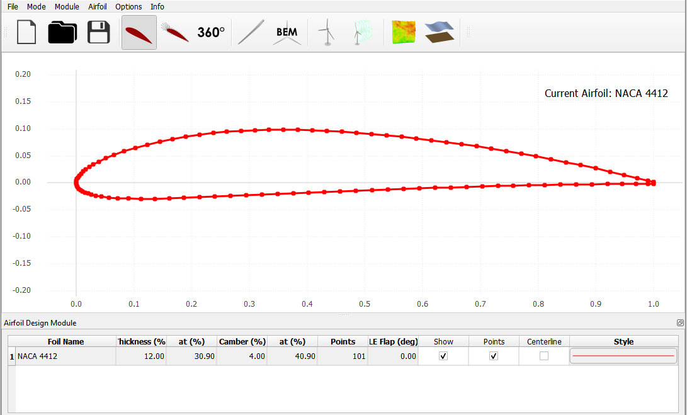
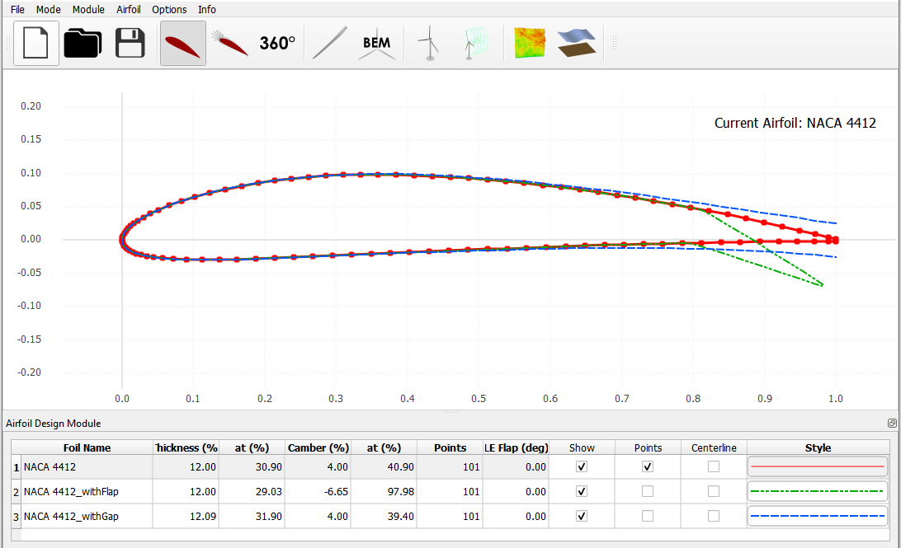

Airfoil Generation Overview
---------------------------

QBlade calculates both local blade values as well as global performance metrics by using local aerodynamic properties of the discrete blade sections (see :doc:`../blade/blade`).
Prior to designing a blade, these must be defined for each blade section. For this purpose, QBlade has an airfoil module which allows creating or importing airfoil profiles. 
This module is shown in the main toolbar in :numref:`fig-airfoil-module`.

.. _fig-airfoil-module:
.. figure:: airfoil_module.png
    :align: center
    :alt: Airfoil design module in QBlade.

    The airfoil design module is represented by the foil symbol in the QBlade main tool bar.
	
Airfoils may be added to the active airfoil design list either by generating them within QBlade or importing them as described in the sections below. 
Airfoils objects can be removed or renamed simply by selecting the *Airfoil* dialog in the menu.
or by right-clicking on the appropriate item in the foil list (see :numref:`fig-naca-airfoil`). 
All airfoil profiles can be exported in a ``.txt`` file format. Once the airfoil profiles have been specified, the user can proceed with the aerodynamic analysis of the profiles (see :doc:`../airfoil/airfoil_analysis`).

Creating Standard Airfoils
--------------------------
Two standard airfoil types can be generated within QBlade automatically. Circular profiles can be generated by selecting *Circular Airfoil Generator* within the *Airfoil* menu option.
This type of airfoil is particularly useful for the generation of the root section of a turbine blade. 
As this generates only a drag force, the user is required to enter a numerical value for the Reynolds number and the corresponding drag coefficient.
In addition, the entire range of 4-digit NACA profiles :footcite:`Anderson_Book` can be automatically generate in QBlade by selecting the menu option *NACA Airfoil Generator*.
The user must then enter the 4-digit code of the desired airfoil profile and the number of panels used to discretise the surface. The result of generating a NACA 4412 profile with 100 panels is shown in :numref:`fig-naca-airfoil`.

.. _fig-naca-airfoil:

    A NACA 4412 airfoil generated within the airfoil design module. Airfoil coordinates are displayed in the visualisation window and can be selected in the foil list (bottom).
	
Importing Airfoils
--------------------------
The user also has the option to import arbitrary airfoil profiles in the format of a ``.dat`` file. This file must contain the [:math:`x`, :math:`y`] coordinates of the airfoil in two columns. 
The scaling and orientation of the imported airfoil is described in the following section.

Airfoil Editing Options
-----------------------
Whether the airfoil is generated within QBlade or imported, it may be necessary to edit the airfoil coordinates. This can be achieved in QBlade by using the editing options. 
These can be called either by right-clicking on the airfoil in the foil list or by selecting the corresponding option from the *Airfoil* menu. The editing options are as follows:

* **Normalize Airfoil:** The coordinates are scaled proportionally such that the leading edge has position :math:`x=0.0` and the trailing edge has position :math:`x=1.0`.
* **Duplicate Airfoil:** The panel coordinates are duplicated and an additional airfoil object is created with these coordinates.
* **De-rotate Airfoil:** The mean camber line of the airfoil is calculated and the coordinates are rotated such that the leading edge and traililng edge are both on the :math:`x`-axis.
* **Re-panel Airfoil:** The current airfoil coordinates are used to generate a second set of coordinates where the :math:`x`-coordinates have a cosine distribution (increased refinement near leading and trailing edge regions) and the new positions are interpolated from the original coordinates. 
* **Edit Current Airfoil Coordinates:** The list of airfoil coordinates is displayed and the user can delete, add or modify coordinates.

Airfoil Transformations
-----------------------
In addition to airfoil editing options, there exist a range of options to transform the current airfoil for more detailed analyses. These include:

* **Set T.E. Flap:** This introduces a trailing edge deflection to the airfoil. This requires specification of the flap angle and the hinge :math:`x` and :math:`y` positions (specified as fraction of chord length and airfoil thickness, respectively).
* **Set T.E. Gap:** This introduces a blunt trailing edge. This requires specification of the gap height (specified as fraction of chord length) and the blending distance. The blending distance specifies the position along the profile where the tangent curve begins (terminating at the modified TE nodes). 
* **Interpolate Airfoils:** This allows the generation of intermediate profiles for blended blade sections. 
* **Virtual Camber:** The virtual camber feature modifies the airfoil profile to account for the curved path traversed by the blade of a vertical axis wind turbine. This requires specification of the tip speed ratio of the turbine and the chord to radius ratio.

To illustrate two of these features, the NACA 4412 profile generated above has been modified to account for a trailing edge gap and a trailing edge flap. The modified profiles are shown in :numref:`fig-nacagapflap-airfoil`.

.. _fig-nacagapflap-airfoil:

    The NACA4412 airfoil generated previously is transformed to have a trailing edge gap (dashed line) and a trailing edge flap (dash-dot line).

Exporting Airfoils
------------------
All airfoils generated within the airfoil creation module can be exported as a ``.afl`` file simply be selecting the *Export Current Airfoil* option from the *Airfoil* menu.
An exemplary ``.afl`` file is shown below:

.. code-block:: console

	NACA 0020
	 1.00000     0.00210
	 0.91670     0.02063
	 0.74385     0.05373
	 0.56305     0.08092
	 0.39002     0.09731
	 0.23691     0.09839
	 0.12569     0.08441
	 0.06125     0.06450
	 0.02521     0.04375
	 0.00589     0.02202
	 0.00000    -0.00000
	 0.00589    -0.02203
	 0.02521    -0.04375
	 0.06125    -0.06451
	 0.12569    -0.08441
	 0.23691    -0.09839
	 0.39002    -0.09731
	 0.56305    -0.08092
	 0.74385    -0.05373
	 0.91670    -0.02063
	 1.00000    -0.00210

.. footbibliography::