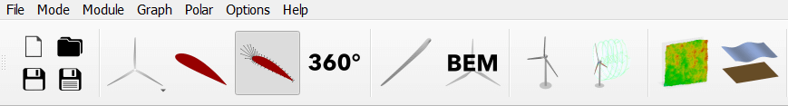

Airfoil Analysis Module
=======================

Once the desired blade section profiles have been selected in the :doc:`../airfoil/airfoil`, the aerodynamic data for these profiles must be generated. 
This is accomplished within the airfoil creation module. This module is shown in :numref:`fig-analysis-module`.

.. _fig-analysis-module:

    The airfoil analysis module is represented by the dynamic foil symbol in the QBlade main tool bar. 
	
The aerodynamic models within QBlade calculate local aerodynamic properties using airfoil look-up tables. 
These tables store the relevant aerodynamic quantities such as airfoil lift, drag and moment coefficients as a function of angle of attack :math:`\alpha`.
There are two ways to generate these tables in QBlade. These two options are described below.

In general the method used to generate the airfoil polars, whether experimental or numerical, only delivers reliable or repeatable values within a certain :math:`\alpha` range.
For this reason, the polars generated or imported here may only correspond to a disjoint range: :math:`\alpha \in [-180^\text{o},180^\text{o}]`. 
Extrapolating this range to ensure continuity of aerodynamic coefficients is the topic of the :doc:`../airfoil/polar_extrapolation` page.

Carrying out an XFoil Analysis 
------------------------------
It is possible for the user to carry out an analysis using the 2D airfoil solver XFoil. :footcite:`xfoil` 
This solver is linked to QBlade such that no preprocessing is required and the airfoil coordinates generated in the :doc:`../airfoil/airfoil` are automatically prepared for analysis.
An XFoil analysis can be carried out by generating a polar definition by selecting a new analysis from the polar control panel. The dialogue which then appears is shown in :numref:`fig-xfoil-createpolar`.

.. _fig-xfoil-createpolar:

    The XFoil polar creation dialogue.
	
This requires the input of a range of parameters:

* **Polar Name**: This is the name stored for the generated polar.
* **Reynolds**: The Reynolds number of the analysis dictates the Reynolds number at which the airfoil is operating. 
* **Mach**: The Mach number of the analysis. XFoil is also capable of treating transonic flow. For most wind energy applications however the flow around the airfoil is assumed to be incompressible.
* **N-Crit**: This is a parameter of the :math:`e^N` model XFoil uses to predict when the boundary layer over the airfoil freely transitions from laminar to turbulent flow. :footcite:`xfoil_bl`
* **Forced top transition**: If the :math:`e^N` model is to be ignored on the suction side of the airfoil, this parameter gives the position of boundary layer transition (as a fraction of chord length).	
* **Forced bottom transition**: If the :math:`e^N` model is to be ignored on the pressure side of the airfoil, this parameter gives the position of boundary layer transition (as a fraction of chord length).

A range of advanced XFoil parameter settings can also be found in the Polar drop-down dialogue *XFoil Parameter Settings*: see :numref:`fig-aa-import`.
Once a polar object has been created, the operational points for the analysis can be selected. This is accomplished in the *Analysis Settings* dialogue which is now accessible. 
The user must specify the start, end and delta values for :math:`\alpha`. Subsequently, the analysis is executed by clicking on the *Start Analysis* button. A progress bar will display the state of completion of the analysis.

XFoil Batch Analysis
^^^^^^^^^^^^^^^^^^^^
For any given blade design, the airfoil section of a blade will be exposed to a range of operating conditions. For this reason, it can be beneficial to carry out an airfoil analysis for a range of Reynolds numbers. 
To streamline this process, QBlade features an XFoil batch option. The creation dialogue for this is shown in :numref:`fig-xfoil-batch`.

.. _fig-xfoil-batch:

    The XFoil batch creation dialogue.
	
The parameter options are as described above and the batch calculation is executed by clicking on the *Analyze!* button.

Operational Point Analysis
--------------------------
Open completeion of the XFoil analysis, a detailed aerodynamic description of the flow over the airfoil at each of the selected operational points (OpPoint) is available.
These parameters can be conveniently viewed in the output pane of QBlade. Three options are available for data visualisation:

* **Polar Graph:** Shows changes of global aerodynamic parameters for each OpPoint. 
* **OpPoint Graph:** Shows local aerodynamic quantities as a function of the position on the airfoil.
* **Aifoil visualization:** Provide a visualisation of flow features superimposed onto the airfoil profile.

An example output for an airfoil is given in :numref:`fig-oppoint`. 

.. _fig-oppoint:

    Operational point data from an XFoil Analysis. Top left: Polar plot. Top right: OpPoint plot. Bottom plots: Airfoil visualisations. 

Importing Airfoil Aerodynamic Coefficients
------------------------------------------
Airfoil aerodynamic data can also be imported within the airfoil analysis module. The options here are visualised in the *Polar* drop-down menu, shown in :numref:`fig-aa-import`.

* **Plain text**: These are ``.dat`` file formats which contain somewhere in their body an array with at least three columns containing: [:math:`\alpha`, :math:`C_L`, :math:`C_D`, (:math:`C_M`)].
* **XFOIL file**: This is a filetype generated by the XFoil solver which contains numerous additional aerodynamic parameters for the airfoil. 

.. _fig-aa-import:

    The options to import airfoil data in QBlade. 

It should again be emphasised that polars for the entire :math:`\alpha` range are required for an analysis, as such polar import is more practical within the :doc:`../airfoil/polar_extrapolation`. 

Exporting Airfoil Data
----------------------
Airfoil data generated within the airfoil creation module can be exported for each airfoil either as an XFoil file or as an 
NREL file simply be selecting the *Export Data* option from the *Polar* dropdown menu shown in :numref:`fig-aa-import`. The option is also available to export all generated airfoil data with the *Export ALL* options.

.. footbibliography::
