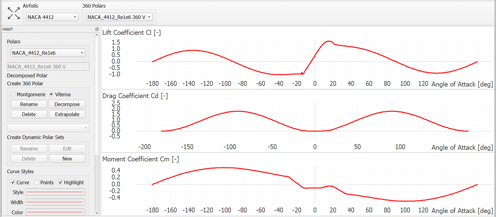

Polar Extrapolation Module
==========================

The numerical models used by QBlade to calculate aerodynamic properties and forces require knowledge of the airfoil sectional properties. 
It is often the case that the polar data for an airfoil (which has previously been either defined or imported- see :doc:`../airfoil/airfoil`) 
is only available for a certain range of angles of attack :math:`\alpha`, these we shall refer to as *partial polars*.
It often occurs that as a result of the turbine architecture, geometry, operational state or other factors that :math:`\alpha` values outside of this range are experienced by the airfoils of the turbine blade. 
For this reason, the blade creation module of QBlade requires that polars are defined for the full 360 :math:`^\text{o}` :math:`\alpha` range. 
It is therefore practical to have a methodology for extrapolating the partial polars.  
This is possible within QBlade using the polar extrapolation module. The module button for this is shown in :numref:`fig-pol-extrap`.

.. _fig-pol-extrap:
.. figure:: extrap_module.png
    :align: center
    :scale: 80%
    :alt: Polar extrapolation module in QBlade.

    The polar extrapolation module is represented by the 360 :math:`^\text{o}` symbol in the QBlade main tool bar. 
	
A range of options for generating or defining full-range polars are available in the polar extrapolation module. These are described in the following sections.

Import and Export of Polars
---------------------------
Much as is the case with  partial polars, a range of import and export options exist so that external sources and files may be used to define full polars within QBlade. 
This is achieved by selecting the *360 Polar* dropdown menu, as illustrated in :numref:`fig-extrap-dropdown`. 

* **Plain text format:** These include either AeroDyn V13 files or XFoil formats (see :doc:`../airfoil/airfoil`)
* **Flex5 polar file:** This format is used as input to the aeroelastic software Flex5, developed at the Technical University of Denmark :footcite:`Oye_1996`.
* **HAWC2 polar file:** This format is used as input to the aeroelastic software HAWC2, developed at the Technical University of Denmark :footcite:`HAWC2`.
* **Multi Re polar file:** This format is generated within QBlade in the :doc:`../blade/blade` when multiple Reynolds number airfoils are applied to a single blade section.
* **Dynamics Polar set:** This format is generated within QBlade when the airfoil is configured for use with a dynamic stall model. This is described below.

.. _fig-extrap-dropdown:

    A range of full polar import options are available in QBlade.
	
Viterna Extrapolation
---------------------
The first option available to extrapolate airfoil polar data is the Viterna method :footcite:`Viterna_1982`. 
The generated extrapolation is visualised in the graph section to allow for optimisation. 
The following parameters can be tuned to improve the behaviour of the polar:

* **Range of original polar:** This determine which :math:`\alpha` range of the partial polar is used for the interpolation.
* **CD90:** Specifies the value of the drag coefficient at :math:`\alpha = 90^\text{o}`. This also influences the lift coefficient behaviour.
* **St+, St-:** These specify the positive and negative stall :math:`\alpha` for the airfoil, respectively.

Upon generation the tuning parameters are specified such that they correspond to those recommended in Viterna :footcite:`Viterna_1982`.
Once the polar is found to be suitable, this can be stored by clicking on the *Save* button. A full visulasation of anairfoil extrapolation with the Viterna method is shown in :numref:`fig-viterna`.

.. _fig-viterna:

    An airfoil extrapolation carried out using the Viterna method in QBlade.
	

Montgomery Extrapolation
------------------------

The second option available to extrapolate airfoil polar data is the Montgomery method :footcite:`Montgomerie2004c`. 
This method is based on the assumption that the airfoil acts aerodynamically as a flat plat for high values of :math:`\alpha`. 
The generated extrapolation is visualised in the graph section to allow for optimisation. 
The following parameters can be tuned to improve the behaviour of the polar:

* **A+/B+:** These are curve parameters corresponding to the positive :math:`\alpha` range.
* **A-/B-:** These are curve parameters corresponding to the negative :math:`\alpha` range.
* **Slope:** This is a matching parameter which ensures continuity of the curve slope.
* **CD90:** Specifies the value of the drag coefficient at :math:`\alpha = 90^\text{o}`. This also influences the lift coefficient behaviour.

Upon generation the tuning parameters are specified such that they correspond to those recommended in Montgomerie :footcite:`Montgomerie2004c`.
Once the polar is found to be suitable, this can be stored by clicking on the *Save* button. 

Dynamic Polar Decomposition
---------------------------
In the case that a dynamic stall model is to be applied during a simulation, then a decomposition of the airfoil must be carried out. 
This separates the the airfoil coefficients into attached and separated regimes, which are applied together with kinematic data to calculate the unsteady lift, drag or moment coefficients.
QBlade provides this utility to the user with the dynamic polar set option. Upon selecting this option the user must select analysis states for the decomposition. 
This dialogue is shown in :numref:`fig-decomp1`.

.. _fig-decomp1:
.. figure:: dynamic_spec.png
    :align: center
    :scale: 50%
    :alt: Dynamic airfoil state selection in QBlade.

    A dynamic polar decomposition requires the specific of airfoil states.
	
Once this has been carried out, the dynamic parameters of the decomposition can be visualised for analysis. These include:

* **Attached Lift Coefficient:** The value of the lift coefficient for attached flows. 
* **Detached Lift Coefficient:** The value of the lift coefficient for detached flows and dynamic airfoils near the detachment point. 
* **f function:** The function which determines which fraction of the aforementioned polars are used based on kinematic parameters (this varies depending on the dynamic stall model applied).

A plot of these parameters, as generated for a NACA 4412 profile are shown in :numref:`fig-decomp1`.

.. _fig-decomp2:
.. figure:: dynamic_plots.png
    :align: center
    :alt: Dynamic airfoil data for an airfoil in QBlade.

    Dynamics airfoil parameters for a NACA 4412 airfoil dynamic decomposition carried out in QBlade.

.. footbibliography::
