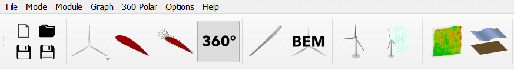

Polar Extrapolation Overview
----------------------------

The numerical models used by QBlade to calculate aerodynamic properties and forces require knowledge of the airfoil sectional properties. 
It is often the case that the polar data for an airfoil (which has previously been either defined or imported- see :doc:`../airfoil/airfoil`) 
is only available for a certain range of angles of attack :math:`\alpha`, these we shall refer to as *partial polars*.
It often occurs that as a result of the turbine architecture, geometry, operational state or other factors that :math:`\alpha` values outside of this range are experienced by the airfoils of the turbine blade. 
For this reason, the blade creation module of QBlade requires that polars are defined for the full 360 :math:`^\text{o}` :math:`\alpha` range. 
It is therefore practical to have a methodology for extrapolating the partial polars.  
This is possible within QBlade using the polar extrapolation module. The module button in the main toolbar for this is shown in :numref:`fig-pol-extrap`.

.. _fig-pol-extrap:

    The polar extrapolation module is represented by the 360 :math:`^\text{o}` symbol in the QBlade main tool bar. 
	
A range of options for generating or defining 360 :math:`^\text{o}` polars are available in the polar extrapolation module. These are described in the following sections.

Viterna Extrapolation
---------------------
The first option available to extrapolate airfoil polar data is the Viterna method. :footcite:`Viterna_1982`. 
The generated extrapolation is visualized in the graph section to allow for optimization. 
The following parameters can be tuned to improve the behavior of the polar:

* **Range of original polar:** This determine which :math:`\alpha` range of the polar is used for the interpolation.
* **CD90:** Specifies the value of the drag coefficient at :math:`\alpha = 90^\text{o}`. This also influences the lift coefficient behavior.
* **St+, St-:** These specify the positive and negative stall :math:`\alpha` for the airfoil, respectively.

Upon generation the tuning parameters are specified such that they correspond to those recommended in Viterna :footcite:`Viterna_1982`.
Once the polar is found to be suitable, this can be stored by clicking on the *Save* button. A full visualization of an airfoil extrapolation with the Viterna method is shown in :numref:`fig-viterna`.

.. _fig-viterna:
.. figure:: viterna_extrap.png
    :align: center
    :alt: A Viterna extrapolation in QBlade.

    An airfoil extrapolation carried out using the Viterna method in QBlade.
	

Montgomery Extrapolation
------------------------

The second option available to extrapolate airfoil polar data is the Montgomery method :footcite:`Montgomerie2004c`. 
This method is based on the assumption that the airfoil acts aerodynamically as a flat plat for high values of :math:`\alpha`. 
The generated extrapolation is visualized in the graph section to allow for optimization. 
The following parameters can be tuned to improve the behavior of the polar:

* **A+/B+:** These are curve parameters corresponding to the positive :math:`\alpha` range.
* **A-/B-:** These are curve parameters corresponding to the negative :math:`\alpha` range.
* **Slope:** This is a matching parameter which ensures continuity of the curve slope.
* **CD90:** Specifies the value of the drag coefficient at :math:`\alpha = 90^\text{o}`. This also influences the lift coefficient behavior.

Upon generation the tuning parameters are specified such that they correspond to those recommended in Montgomerie :footcite:`Montgomerie2004c`.
Once the polar is found to be suitable, this can be stored by clicking on the *Save* button. 

Dynamic Polar Decomposition
---------------------------
In the case that the :ref:`ATEFlap Dynamic Stall Model` dynamic stall model is to be applied for a simulation, then a decomposition of the airfoil must be carried out. This separates the the airfoil coefficients into fully attached and fully separated regimes, which are applied together with kinematic data to calculate the unsteady lift, drag or moment coefficients.
QBlade provides this utility to the user with the dynamic polar set option. Upon selecting this option the user must select analysis states for the decomposition. This dialogue is shown in :numref:`fig-decomp1`.

.. _fig-decomp1:
.. figure:: dynamic_spec.png
    :align: center
    :scale: 50%
    :alt: Dynamic airfoil state selection in QBlade.

    A dynamic polar decomposition requires the specific of airfoil states.
	
Once this has been carried out, the dynamic parameters of the decomposition can be visualised for analysis. These include:

* **Attached Lift Coefficient:** The value of the lift coefficient for attached flows. 
* **Detached Lift Coefficient:** The value of the lift coefficient for detached flows and dynamic airfoils near the detachment point. 
* **f function:** The function which determines which fraction of the aforementioned polars are used based on kinematic parameters (this varies depending on the dynamic stall model applied).

A plot of these parameters, as generated for a NACA 4412 profile are shown in :numref:`fig-decomp1`.

.. _fig-decomp2:
.. figure:: dynamic_plots.png
    :align: center
    :alt: Dynamic airfoil data for an airfoil in QBlade.

    Dynamics airfoil parameters for a NACA 4412 airfoil dynamic decomposition carried out in QBlade.
	
Import and Export of 360 Polars
-------------------------------------------------

Much as is the case with non extrapolated polars, a range of import and export options exist so that external sources and files may be used to define 360 :math:`^\text{o}` polars within QBlade. 
This is achieved by selecting the *360 Polar* menu option.

* **Plain text format:** These include either AeroDyn V13 files or XFoil formats (see :doc:`../airfoil/airfoil`)
* **Multi Re polar file:** The ``.plr`` format is the main format to import or export polar data. It can also be used to import polar data that is defined over a range of Reynolds numbers.
	
When a ``.plr`` file is imported and no airfoil, as specified in the file, exists an airfoil with the thickness as defined with the parameter *THICKNESS* is automatically created during loading. An exemplary ``.plr`` file is shown below:

.. code-block:: console

	----------------------------------------QBlade Multi RE Polar File--------------------------------------------------
	Generated with : QBlade CE v 2.0 windows-pre-release
	Archive Format: 310001
	Time : 21:36:42
	Date : 14.06.2022

	----------------------------------------Object Names----------------------------------------------------------------
	t17.0_nre_5mw_Polar                      POLARNAME          - the polar name
	t17.0_nre_5mw                            FOILNAME           - the airfoil name to which the polar(s) belong

	----------------------------------------Parameters------------------------------------------------------------------
	17.0                                     THICKNESS          - the name of the blade
	0                                        ISDECOMPOSED       - is the polar decomposed (add Cl_Sep, Cl_att and f_st columns)
	REYNOLDS            1.0000E+06          - the list of Reynolds numbers for the imported polars

	----------------------------------------Polar Data------------------------------------------------------------------
	AOA                 CL                  CD                  CM                  
	-180.000000         0.000000            0.019800            0.000000            
	-175.000000         0.374000            0.034100            0.188000            
	-170.000000         0.749000            0.095500            0.377000            
	-160.000000         0.659000            0.280700            0.274700            
	-155.000000         0.736000            0.391900            0.313000            
	-150.000000         0.783000            0.508600            0.342800            
	-145.000000         0.803000            0.626700            0.365400            
	-140.000000         0.798000            0.742700            0.382000            
	-135.000000         0.771000            0.853700            0.393500            
	-130.000000         0.724000            0.957400            0.400700            
	-125.000000         0.660000            1.051900            0.404200            
	-120.000000         0.581000            1.135500            0.404700            
	-115.000000         0.491000            1.207000            0.402500            
	-110.000000         0.390000            1.265600            0.398100            
	-105.000000         0.282000            1.310400            0.391800            
	-100.000000         0.169000            1.341000            0.383800            
	-95.000000          0.052000            1.357200            0.374300            
	-90.000000          -0.067000           1.358700            0.363600            
	-85.000000          -0.184000           1.345600            0.351700            
	-80.000000          -0.299000           1.318100            0.338800            
	-75.000000          -0.409000           1.276500            0.324800            
	-70.000000          -0.512000           1.221200            0.309900            
	-65.000000          -0.606000           1.153200            0.294000            
	-60.000000          -0.689000           1.073100            0.277200            
	-55.000000          -0.759000           0.982200            0.259500            
	-50.000000          -0.814000           0.882000            0.240900            
	-45.000000          -0.850000           0.774200            0.221200            
	-40.000000          -0.866000           0.661000            0.200600            
	-35.000000          -0.860000           0.545100            0.178900            
	-30.000000          -0.829000           0.429500            0.156300            
	-25.000000          -0.853000           0.307100            0.115600            
	-24.000000          -0.870000           0.281400            0.104000            
	-23.000000          -0.890000           0.255600            0.091600            
	-22.000000          -0.911000           0.229700            0.078500            
	-21.000000          -0.934000           0.204000            0.064900            
	-20.000000          -0.958000           0.178500            0.050800            
	-19.000000          -0.982000           0.153400            0.036400            
	-18.000000          -1.005000           0.128800            0.021800            
	-17.000000          -1.082000           0.103700            0.012900            
	-16.000000          -1.113000           0.078600            -0.002800           
	-15.000000          -1.105000           0.053500            -0.025100           
	-14.000000          -1.078000           0.028300            -0.041900           
	-13.500000          -1.053000           0.015800            -0.052100           
	-13.000000          -1.015000           0.015100            -0.061000           
	-12.000000          -0.904000           0.013400            -0.070700           
	-11.000000          -0.807000           0.012100            -0.072200           
	-10.000000          -0.711000           0.011100            -0.073400           
	-9.000000           -0.595000           0.009900            -0.077200           
	-8.000000           -0.478000           0.009100            -0.080700           
	-7.000000           -0.375000           0.008600            -0.082500           
	-6.000000           -0.264000           0.008200            -0.083200           
	-5.000000           -0.151000           0.007900            -0.084100           
	-4.000000           -0.017000           0.007200            -0.086900           
	-3.000000           0.088000            0.006400            -0.091200           
	-2.000000           0.213000            0.005400            -0.094600           
	-1.000000           0.328000            0.005200            -0.097100           
	0.000000            0.442000            0.005200            -0.101400           
	1.000000            0.556000            0.005200            -0.107600           
	2.000000            0.670000            0.005300            -0.112600           
	3.000000            0.784000            0.005300            -0.115700           
	4.000000            0.898000            0.005400            -0.119900           
	5.000000            1.011000            0.005800            -0.124000           
	6.000000            1.103000            0.009100            -0.123400           
	7.000000            1.181000            0.011300            -0.118400           
	8.000000            1.257000            0.012400            -0.116300           
	8.500000            1.293000            0.013000            -0.116300           
	9.000000            1.326000            0.013600            -0.116000           
	9.500000            1.356000            0.014300            -0.115400           
	10.000000           1.382000            0.015000            -0.114900           
	10.500000           1.400000            0.026700            -0.114500           
	11.000000           1.415000            0.038300            -0.114300           
	11.500000           1.425000            0.049800            -0.114700           
	12.000000           1.434000            0.061300            -0.115800           
	12.500000           1.443000            0.072700            -0.116500           
	13.000000           1.451000            0.084100            -0.115300           
	13.500000           1.453000            0.095400            -0.113100           
	14.000000           1.448000            0.106500            -0.111200           
	14.500000           1.444000            0.117600            -0.110100           
	15.000000           1.445000            0.128700            -0.110300           
	15.500000           1.447000            0.139800            -0.110900           
	16.000000           1.448000            0.150900            -0.111400           
	16.500000           1.444000            0.161900            -0.111100           
	17.000000           1.438000            0.172800            -0.109700           
	17.500000           1.439000            0.183700            -0.107900           
	18.000000           1.448000            0.194700            -0.108000           
	18.500000           1.452000            0.205700            -0.109000           
	19.000000           1.448000            0.216500            -0.108600           
	19.500000           1.438000            0.227200            -0.107700           
	20.000000           1.428000            0.237900            -0.109900           
	21.000000           1.401000            0.259000            -0.116900           
	22.000000           1.359000            0.279900            -0.119000           
	23.000000           1.300000            0.300400            -0.123500           
	24.000000           1.220000            0.320400            -0.139300           
	25.000000           1.168000            0.337700            -0.144000           
	26.000000           1.116000            0.355400            -0.148600           
	28.000000           1.015000            0.391600            -0.157700           
	30.000000           0.926000            0.429400            -0.166800           
	32.000000           0.855000            0.469000            -0.175900           
	35.000000           0.800000            0.532400            -0.189700           
	40.000000           0.804000            0.645200            -0.212600           
	45.000000           0.793000            0.757300            -0.234400           
	50.000000           0.763000            0.866400            -0.255300           
	55.000000           0.717000            0.970800            -0.275100           
	60.000000           0.656000            1.069300            -0.293900           
	65.000000           0.582000            1.160600            -0.311700           
	70.000000           0.495000            1.243800            -0.328500           
	75.000000           0.398000            1.317800            -0.344400           
	80.000000           0.291000            1.380900            -0.359300           
	85.000000           0.176000            1.430400            -0.373100           
	90.000000           0.053000            1.456500            -0.385800           
	95.000000           -0.074000           1.453300            -0.397300           
	100.000000          -0.199000           1.434500            -0.407500           
	105.000000          -0.321000           1.400400            -0.416200           
	110.000000          -0.436000           1.351200            -0.423100           
	115.000000          -0.543000           1.287400            -0.428000           
	120.000000          -0.640000           1.209900            -0.430600           
	125.000000          -0.723000           1.119600            -0.430400           
	130.000000          -0.790000           1.017900            -0.427000           
	135.000000          -0.840000           0.906400            -0.419600           
	140.000000          -0.868000           0.787100            -0.407700           
	145.000000          -0.872000           0.662700            -0.390300           
	150.000000          -0.850000           0.536300            -0.366500           
	155.000000          -0.798000           0.411600            -0.334900           
	160.000000          -0.714000           0.293100            -0.294200           
	170.000000          -0.749000           0.097100            -0.377100           
	175.000000          -0.374000           0.033400            -0.187900           
	180.000000          0.000000            0.019800            0.000000    
	
	
.. footbibliography::
