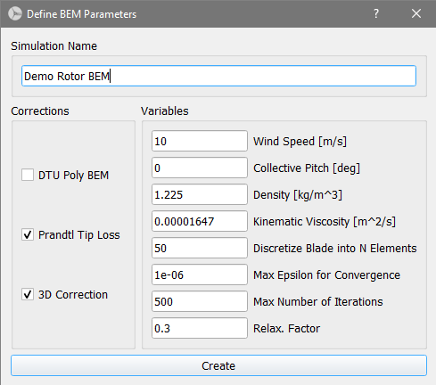

Steady BEM Analysis
===================
The *Steady BEM Analysis* tool allows to run simulations with very little usage of computational ressources with short simulation times and provides generally accurate
preamptive results with regard to rotor perfomance. The module is very useful to e.g., perform a first evaulation of a blade design, to get a fast estimate on annual energy production (AEP) or
to identify the controll strategies through parameter studies. This section gives insight into the three submodules *Rotor BEM*, *Characteristic BEM* and *Turbine BEM*.

Rotor BEM
---------
In the rotor simulation submodule, the user can commit rotor blade simulations over a range of tip speed ratios (TSRs). A rotor simulation can only be defined when at
least one rotor blade is present in the database (see :ref:`Blade Design Module`. When defining a rotor simulation in the *Analysis Settings* box, the user has to select the desired corrections to
the BEM algorithm and the simulation parameters. Once a simulation is defined, the user can select a range of l-values (tipspeed ratios), and the incremental step
for the simulation. A rotor simulation is always carried out dimensionless. The freestream velocity is assumed to be unity and the rotor radius is normalized for
the computation. This implies, that no power curve or load curves, like the bending moment, can be computed during a rotor simulation.

.. _fig-def_roto_bem:

    Definition of a Rotor BEM simulaton.

..
    Corrections

    * **DTU Poly BEM**: Time shift of the generated wave signal.
    * **Prandtl Tip Loss**: Acvitate Prandtl Tip Loss, see :ref:`Corrections`.
    * **3D Correction**: Activate 3D correction:ref:`Corrections`.

.. footbibliography::
