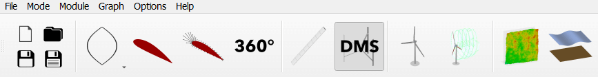
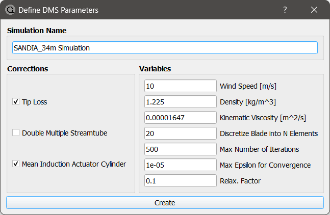
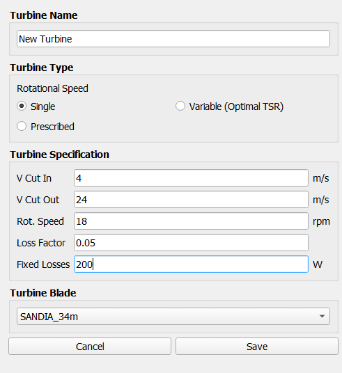

DMS/AC Analysis Overview
------------------------

.. _fig-dms_module:

    The DMS/AC module in QBlade's main tool bar.

The *Steady DMS/AC Analysis* (Double Multiple Streamtube, Mean Actuator Cylinder) tool allows the user to run aerodynamic simulations for Vertical Axis Wind Turbines (VAWTs) with very low computational expense, short run times and generally accurate preliminary results with regard to rotor performance parameters. The module is very useful for:

* Performing a first evaluation of a VAWT blade and rotor design,
* Calculating a fast estimate on annual energy production (AEP), or
* Identifying control strategies through parameter studies.

This section gives insight into the three submodules *Rotor DMS*, *Characteristic DMS* and *Turbine DMS*. For more details on the implemented methods, see :ref:`Double Multiple Streamtube Method` and :ref:`Mean Induction Actuator Cylinder Method` in the theory section.

Rotor DMS/AC
------------
In the *Rotor DMS/AC* submodule, the user can carry out VAWT rotor simulations over a range of tip speed ratios (TSRs). A rotor simulation can only be defined when at
least one VAWT rotor is present in the database. When defining a rotor simulation in the *Define DMS/AC Parameters* dialogue, the user can select the desired aerodynamic corrections to the algorithm:

* **Tip Loss**
* **Double Multiple Streamtube**
* **Mean Induction Actuator Cylinder**

Furthermore, the general simulation variables are defined here, including wind speed, fluid properties (density and kinematic viscosity), the number of elements to discretize the blade into, and solver settings (maximum number of iterations, max epsilon for convergence, and a relaxation factor). Once a simulation is defined, the user can select a range of TSRs, and the incremental step for the simulation.

A rotor simulation is always carried out with dimensionless arguments. The freestream velocity is assumed to be uniform and the rotor radius and height are normalized for
the computation. This implies that no dimensional power curve or load distributions (e.g. bending moment) can be computed during a rotor simulation.

.. _fig-rotor_dms:

    Definition of a Rotor DMS simulation and its parameters.

Characteristic DMS/AC
---------------------

In the *Characteristic DMS/AC* submodule simulations can be carried out over a specified range of windspeeds, rotational speeds and fixed pitch angles. By right-clicking on each graph in the graphics module, the user can specify the plotted variables which are displayed. When the selected windspeed, rotational speed or pitch angle is changed in the top toolbar, the series of curves is changed accordingly. This submodule is of great help when designing custom control strategies for variable rotational speed and/or pitch controlled vertical axis wind turbine rotors.

.. _fig-def_char_dms:
.. figure:: char_DMS.png
    :align: center
    :scale: 30%
    :alt: Characteristic DMS demonstration

    Result of a characteristic DMS simulation.
    
Turbine DMS/AC
--------------
In the *Turbine DMS/AC* submodule, the user can simulate steady state DMS simulations. To define a wind turbine, a VAWT rotor must be present in the runtime database. In preparation for the simulations, a turbine has
to be set up. This requires specification of the turbine's rotational speed behavior and its operational parameters. The rotational speed type is defined by:

* **Single**: One stationary rotational speed in which the turbine operates over the whole range of windspeeds.

* **Variable (Optimal TSR)**: Allows the turbine to operate at an optimal Tip Speed Ratio. A rotational speed is computed for every given wind speed during the simulation based on this desired TSR.

* **Prescribed**: Allows the user to set the rpm to an arbitrary value defined in an ``.txt`` file. This option is useful to match a certain control behavior or for code-to-code comparisons.

Further parameters that need to be selected by the user are shown in :numref:`fig-turbSpec_dms`. At :math:`V_{cut in}`, the turbine starts and at :math:`V_{cut out}` the turbine stops operation. 
To account for power losses that are not of aerodynamical nature but are caused by the efficiency of the generator and the gearbox, a Loss Factor and a value for Fixed Losses can be selected. 
The equation in which these losses are implemented is:

.. math::
   \begin{align}
   P_{out} = (1-k_v)P_0-P_{fixed},
   \end{align}

where, :math:`k_v` is the variable Loss Factor and :math:`P_{fixed}` the Fixed Losses. Finally, a previously defined VAWT rotor has to be selected from the *Turbine Blade* dropdown menu.

.. _fig-turbSpec_dms:

    
    Turbine specification dialogue.
    
After the turbine has been added to the runtime database, the DMS simulation can be executed identically to the :ref:`Rotor DMS/AC` described above.
The simulation is carried out over the specified range of windspeeds with the selected incremental step size.