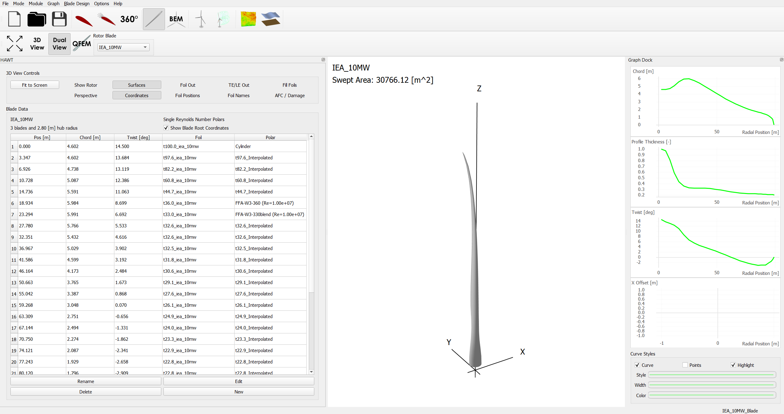
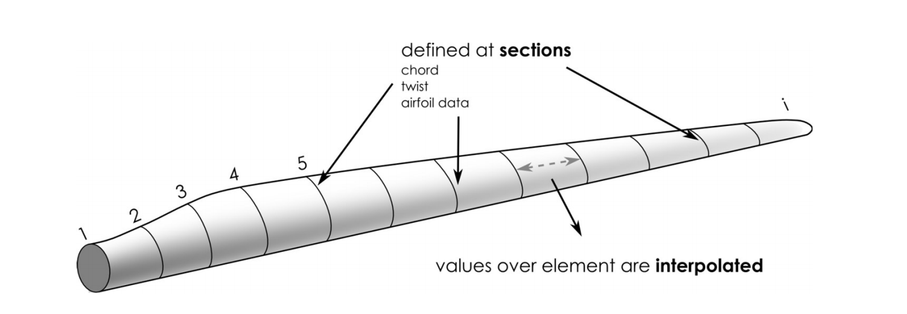
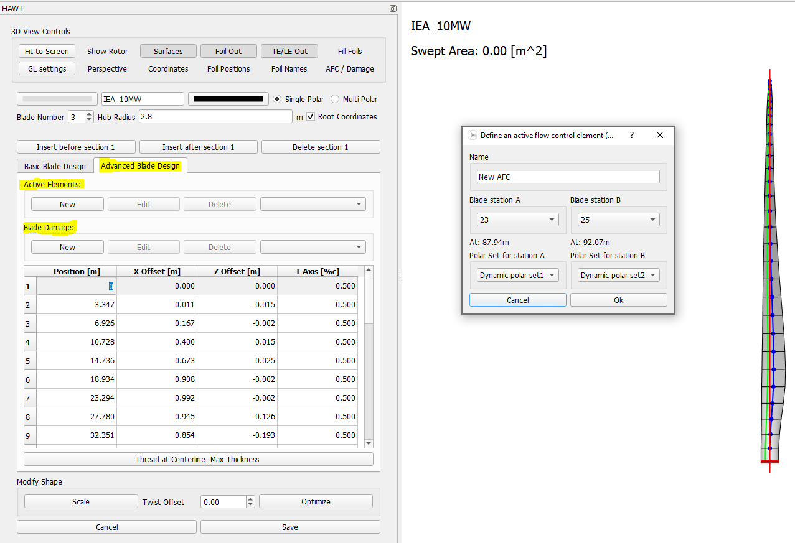

Blade Design Overview
---------------------

Once the airfoil polars have been created or imported (see :doc:`../airfoil/airfoil_analysis` and :doc:`../airfoil/polar_extrapolation`), 
they can be used in an aerodynamic blade design. To access the aerodynamic blade design module in QBlade, the user has to click on the blade symbol in the main tool bar.
This is shown in :numref:`fig-blade-module`.

.. _fig-blade-module:
.. figure:: blade_module.png
    :align: center
    :alt: Blade design module in QBlade.

    The aerodynamic blade design module is represented by the blade symbol in the QBlade main tool bar.

An overview of the blade design module is shown in :numref:`fig-blade-overview`. The module is split into three main parts. 
On the left side, the controls dock allows the user to define the blade sections and to control the 3D view section. 
The latter is located in the middle of the module and allows the user have a interactive 3D representation of the current blade design.
The right side of the module presents a graphical representation of the aerodynamic quantities along the blade. 
The user can interact with these graphs in the same manner as with all the other graphs within QBlade (see :doc:`../guigraph/guigraph`).

.. _fig-blade-overview:

    Overview of the blade design module in QBlade. The control dock is located on the left, the interactive 3D view in the center and the graphs on the right.  

Blade Definition
-----------------

In QBlade, the blade definition is done by splitting the blade into sections. This is shown
in :numref:`fig-blade-sections`. The aerodynamic parameters are defined by the user for each section and QBlade interpolates the values between sections (i.e. over the element). 

.. _fig-blade-sections:

    Aerodynamic blade definition in QBlade is done in sections. Values are linearly interpolated along the elements between the sections.

Each blade section is defined by a series of aerodynamic properties. The global blade/rotor parameters are the number of blades and the hub radius. 
The distributed blade properties are split into basic and advanced aerodynamic blade properties.
The columns of the basic blade properties are:

- **Pos [m]** is the position of the section along the blade pitch axes (in m). It can be given in blade root coordinates or in hub coordinates. 
- **Chord [m]** is the local chord length of the blade section (in m).
- **Twist [deg]** the local twist of the blade section (in deg). 
- **Foil** is the airfoil object used for that section (see :doc:`../airfoil/airfoil`).
- **Polar** is the particular polar used for this section (linked to the airfoil object).

We note that the polar data used in the blade definition always has to be linked to an airfoil object. Several airfoil polars can be linked to one airfoil object (e.g. for different Reynolds numbers).
A blade section can also contain multiple polars for one airfoil object e.g. for different Reynolds numbers (see :doc:`../airfoil/polar_extrapolation`). 
If the blade is to have multi-polar sets, then these need to be previously created and assigned to an airfoil object and the corresponding option has to be enabled in the blade design dock.

The columns of the advanced blade properties are:

- **Position [m]** is the position of the section along the blade pitch axis (in m). It should match the position given in the basic blade properties. 
- **X (IP) Offset [m]** is an additional offset of the blade section in the global y-direction. This is the in-plane direction.
- **Y (OOP) Offset [m]** is an additional offset of the blade section in the global x-direction. This is the out-of-plane direction.
- **T Axis [%c]** is the position of the thread axis as a percentage of the local chord. It is used to define the axis at which the section is rotated and also to define the position of the structural beam (see :ref:`StrDef_BladeTower`). 

In addition to the manual blade definition option, QBlade allows for some automated setups to speed up the blade design. It has the option to automatically set the
thread axis at the position of maximum thickness of the airfoil. It also offers the option to do a blade shape optimization so that the twist angle is optimal for a given tip speed ratio. 
In addition the chord distribution can be optimized according to the theories of Betz and Schmitz (see :footcite:t:`Gasch2005` for details). Finally, the blade design can also be scaled to another size using different scaling methods. These include position scaling, chord scaling and twist scaling.

Active Elements and Blade Damage
^^^^^^^^^^^^^^^^^^^^^^^^^^^^^^^^

.. _fig-blade-afc:

    Adding active elements and blade damage to the blade design.

QBlade also offers the possibility to add blade damage or active elements such as active trailing edge flaps to the blade definition. This is done in the advanced blade design tab and shown in :numref:`fig-blade-afc`.
To add an active element to the blade definition, a dynamic polar set must have been previously defined in the :doc:`../airfoil/polar_extrapolation`.
Each active element is defined between two blade sections (defined by the station number) and at least one dynamic polar set. 
Note that two active polar sets can be used if the airfoil polars are different in the start and end station. QBlade then interpolates between the two dynamic polar sets.
Care should be taken if two polar sets are used for the active element. They should have the same states defined so that the interpolation between the stations can occur seamlessly for each state.

The second option is to add blade damage to the blade definition. This is again done through the modification of the airfoil polars that are used in the blade section.
The airfoil polar for the damaged blade section must be created previously in the :doc:`../airfoil/polar_extrapolation`. Similar to an active element, the blade damage is defined between two stations. These can have 
different airfoils and polars, even multi-polar sets. QBlade will interpolate along the blade between the two stations with the different polars.

Importing and Exporting Blade Definitions
=========================================

QBlade allows to import and export blade definitions in a series of formats. The import/export options are located in the menu item *Blade Design*.
QBlade is currently capable of importing blade definitions in the following formats:

- QBlade blade format (``.bld``),
- Blade geometry in QBlade, AeroDyn and WT_perf format,
- AeroDyn V15 full blade definition,

QBlade is currently capable of exporting blade definitions in the following formats:

- QBlade blade format (``.bld``),
- Full blade definition in AeroDyn V13 format,
- 3D blade geometry in STL or ``.txt`` format.

When a blade is exported into the ``.bld`` format, the associated 360 polar (``.plr``) and airfoil (``.afl``) files are automatically created.
An exemplary ``.bld`` file is shown below:

.. code-block:: console

	----------------------------------------QBlade Blade Definition File------------------------------------------------
	Generated with : QBlade IH v2.0.2_alpha windows
	Archive Format: 310002
	Time : 12:05:50
	Date : 29.06.2022

	----------------------------------------Object Name-----------------------------------------------------------------
	NREL_5MW                                 OBJECTNAME         - the name of the blade object

	----------------------------------------Parameters------------------------------------------------------------------
	HAWT                                     ROTORTYPE          - the rotor type
	3                                        NUMBLADES          - number of blades

	----------------------------------------Blade Data------------------------------------------------------------------
	POS [m]             CHORD [m]           TWIST [deg]         OFFSET_X [m]        OFFSET_Y [m]        TAXIS [-]           POLAR_FILE          
	1.5000              3.5420              0.0000              0.0000              0.0000              0.5000              t100.0_nre_5mw_Cylinder_1_section_with_a_Cd_of_0.50.plr
	2.8674              3.5420              13.3080             0.0027              0.0006              0.5000              t100.0_nre_5mw_Cylinder_1_section_with_a_Cd_of_0.50.plr
	5.5992              3.8540              13.3080             0.1057              0.0250              0.5000              t100.0_nre_5mw_Cylinder_1_section_with_a_Cd_of_0.50.plr
	8.3289              4.1670              13.3080             0.2499              0.0591              0.5000              t90.0_nre_5mw_Cylinder_2_section_with_a_Cd_of_0.35.plr
	11.7402             4.5570              13.3080             0.4586              0.1085              0.5000              t40.0_nre_5mw_DU40_airfoil_with_an_aspect_ratio_of_17._Original_-180_to_180deg.plr
	15.8399             4.6520              11.4845             0.5696              0.1157              0.5000              t35.0_nre_5mw_DU35_airfoil_with_an_aspect_ratio_of_17._Original_-180_to_180deg.plr
	19.9410             4.4580              10.1649             0.5485              0.0983              0.5000              t35.0_nre_5mw_DU35_airfoil_with_an_aspect_ratio_of_17._Original_-180_to_180deg.plr
	24.0421             4.2490              9.0132              0.5246              0.0832              0.5000              t30.0_nre_5mw_DU30_airfoil_with_an_aspect_ratio_of_17._Original_-180_to_180deg.plr
	28.1432             4.0070              7.7970              0.4962              0.0679              0.5000              t25.0_nre_5mw_DU25_airfoil_with_an_aspect_ratio_of_17._Original_-180_to_180deg.plr
	32.2443             3.7480              6.5457              0.4654              0.0534              0.5000              t25.0_nre_5mw_DU25_airfoil_with_an_aspect_ratio_of_17._Original_-180_to_180deg.plr
	36.3454             3.5020              5.3623              0.4358              0.0409              0.5000              t21.0_nre_5mw_DU21_airfoil_with_an_aspect_ratio_of_17._Original_-180_to_180deg.plr
	40.4464             3.2560              4.1890              0.4059              0.0297              0.5000              t21.0_nre_5mw_DU21_airfoil_with_an_aspect_ratio_of_17._Original_-180_to_180deg.plr
	44.5475             3.0100              3.1256              0.3757              0.0205              0.5000              t17.0_nre_5mw_NA64_A17_airfoil_with_an_aspect_ratio_of_17._Original_-180_to_180deg.plr
	48.6486             2.7640              2.3193              0.3452              0.0140              0.5000              t17.0_nre_5mw_NA64_A17_airfoil_with_an_aspect_ratio_of_17._Original_-180_to_180deg.plr
	52.7497             2.5180              1.5261              0.3146              0.0084              0.5000              t17.0_nre_5mw_NA64_A17_airfoil_with_an_aspect_ratio_of_17._Original_-180_to_180deg.plr
	56.1676             2.3130              0.8629              0.2891              0.0044              0.5000              t17.0_nre_5mw_NA64_A17_airfoil_with_an_aspect_ratio_of_17._Original_-180_to_180deg.plr
	58.9013             2.0860              0.3699              0.2607              0.0017              0.5000              t17.0_nre_5mw_NA64_A17_airfoil_with_an_aspect_ratio_of_17._Original_-180_to_180deg.plr
	61.6338             1.4190              0.1059              0.1774              0.0003              0.5000              t17.0_nre_5mw_NA64_A17_airfoil_with_an_aspect_ratio_of_17._Original_-180_to_180deg.plr
	63.0000             0.9610              0.0000              0.1201              0.0000              0.5000              t17.0_nre_5mw_NA64_A17_airfoil_with_an_aspect_ratio_of_17._Original_-180_to_180deg.plr

.. footbibliography::
