Global Coordinate System
========================

The fixed global coordinate system in QBlade is defined as shown in :numref:`fig-globalcoord`. The x-axis points in the downwind direction, and the z-axis points vertically upwards. The y-axis is oriented to form a right-handed coordinate system.

If a sensor name in one of QBlade's graphs is annotated by **_g**, such as **X_g**, it refers to the global coordinate system. Whenever a coordinate system is displayed in QBlade, the following color code is used:

- **x-axis**: **RED**
- **y-axis**: **GREEN**
- **z-axis**: **BLUE**

This color code applies to all local coordinate systems as well.

.. _fig-globalcoord:
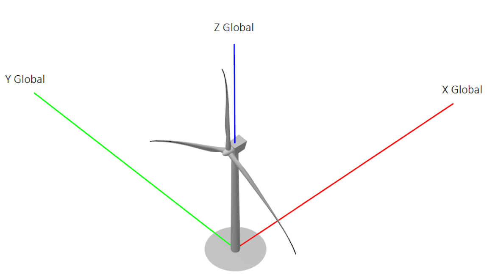
    
    Visualization of the global coordinate system.
    
Local Body Coordinate Systems
=============================

Some simulation results are output into local body coordinate systems, such as the local blade coordinate systems or the local tower coordinate system. These systems are generally denoted by **_g** in the variable name, such as **X_g**.

.. _fig-localcoord:
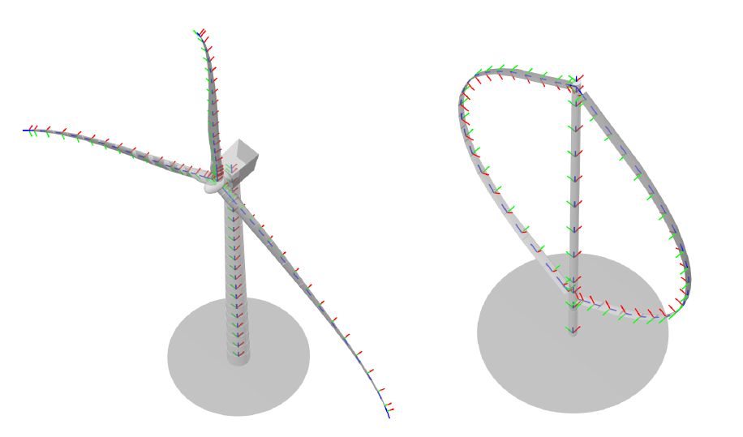
    
    Visualization of the local blade and tower coordinate systems.

Local Blade Coordinate System
-----------------------------

For rotor blades and struts, the coordinate system is defined as follows:

- **x-axis**: Oriented normal to the chord, pointing toward the suction side.
- **y-axis**: Oriented chord-wise, pointing toward the trailing edge. If the rotor rotates in the reverse direction, the y-axis points toward the leading edge.
- **z-axis**: Points along the principal beam direction, forming a right-handed coordinate system.

.. _fig-bladecoord:
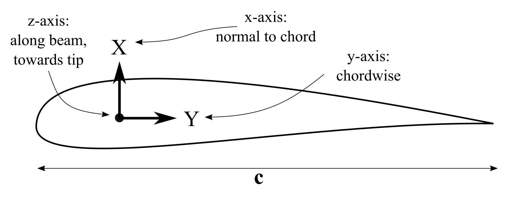
    
    The local blade coordinate system.

Local Tower Coordinate System
-----------------------------

For the tower, the local coordinate system is defined as follows:

- **x-axis**: Aligned with the global x-axis.
- **y-axis**: Points toward the global y-axis.
- **z-axis**: Points along the principal beam direction.

Local Sensor Coordinate Systems
===============================

Additional turbine load sensors, automatically generated for HAWT turbines, are output in the following coordinate systems (CS):

- **Blade CS**: :math:`X_b`, :math:`Y_b`, :math:`Z_b`
- **Coned CS**: :math:`X_c`, :math:`Y_c`, :math:`Z_c`
- **Nacelle CS**: :math:`X_n`, :math:`Y_n`, :math:`Z_n`
- **Hub CS**: :math:`X_h`, :math:`Y_h`, :math:`Z_h`
- **Shaft CS**: :math:`X_s`, :math:`Y_s`, :math:`Z_s`
- **Tower Top CS**: :math:`X_{tt}`, :math:`Y_{tt}`, :math:`Z_{tt}`
- **Tower Bottom CS**: :math:`X_{tb}`, :math:`Y_{tb}`, :math:`Z_{tb}`

These coordinate systems align with conventions used in the FAST User's Guide :footcite:`FASTUG`. An overview is provided in :numref:`fig-localcoord2`.

.. _fig-localcoord2:
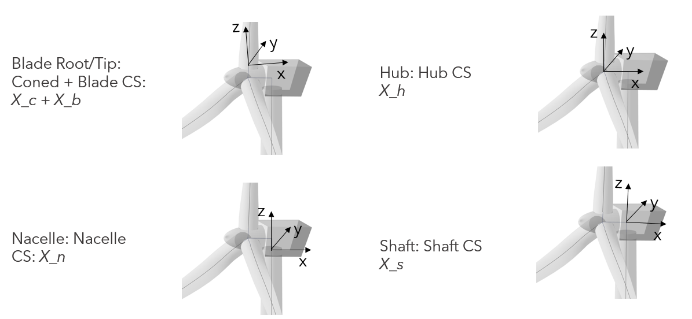
    
    Visualization of the Blade, Coned, Nacelle, Hub and Shaft CS.
	
Wind and Wave Direction
=======================

The directionality for wind and waves is defined according to the meteorological convention:

- A wind direction (horizontal inflow angle) or wave direction (principal wave direction) of **0°** indicates that the wind is blowing along, and the wave is traveling in the **positive x-direction** of the global coordinate system.
- Offsets from this direction are defined as a **clockwise (CW) rotation** around the global z-axis. This CW convention aligns with standard meteorological practices.

The misalignment between wind and waves is measured as the angle from the incoming wind to the wave direction. This angle is defined as positive in a **CW fashion** around the z-axis, as illustrated in :numref:`fig-wind-wave-misalignment`.

.. _fig-wind-wave-misalignment:
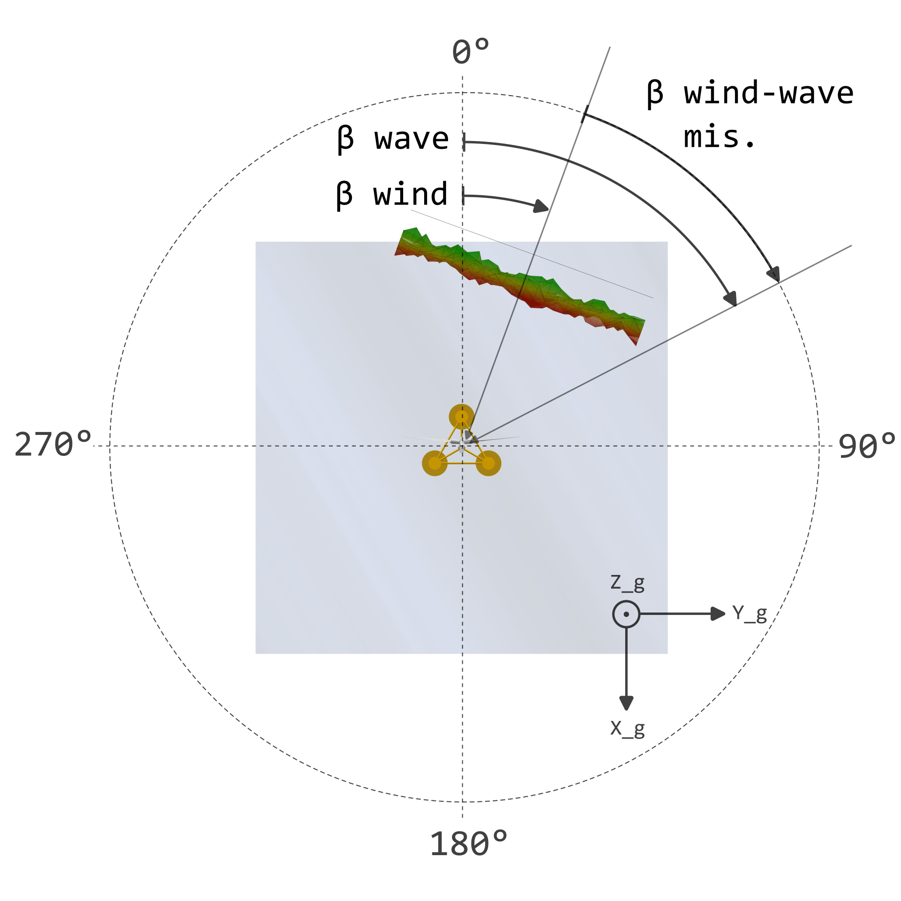
    
    Illustration of wind and wave directions and their misalignment.

The **vertical inflow angle** (or upflow angle) is defined as a **CW rotation** around the positive y-axis of the global coordinate system, see :numref:`fig-vertical-inflow-angle`. When both horizontal and vertical inflow angles are used, the wind field is rotated:

1. **First**: A CW rotation around the global y-axis :math:`Y_g`.
2. **Second**: A CW rotation of the (already rotated) wind field around the global z-axis :math:`Z_g`.

.. _fig-vertical-inflow-angle:
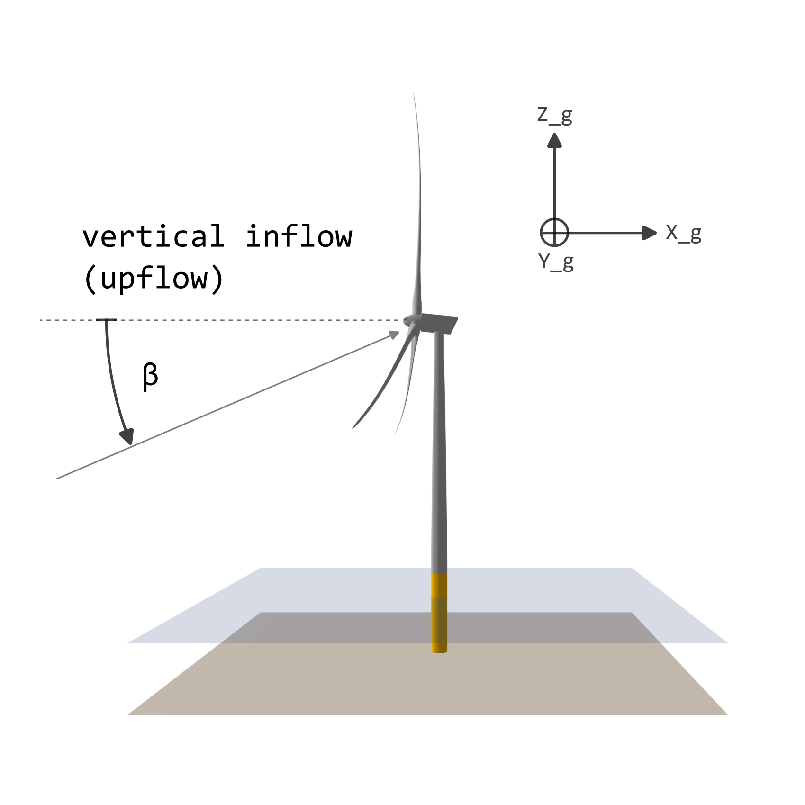
    
    Illustration of vertical inflow angle.

Yaw, Azimuth and Pitch Convention
=================================

Yaw Angle
---------

The yaw angle is defined as a **mathematically positive counter-clockwise (CCW) rotation** around the tower axis, typically aligned with the global z-axis. 

- Note that the yaw angle is defined in the **opposite direction** of the horizontal wind direction, which is a CW rotation.
- The **yaw misalignment** is the angle between the yaw direction and wind direction, counted in a **CW fashion** around the tower axis.

Example: For a turbine operating with a yaw angle of **10°**, where the wind direction is **15°**, the yaw misalignment is **25°**. To align the turbine with the inflow direction, a **yaw action of -25°** is required (10° yaw - 25° yaw = -15° yaw). See :numref:`fig-yaw-alignment`.

.. _fig-yaw-alignment:
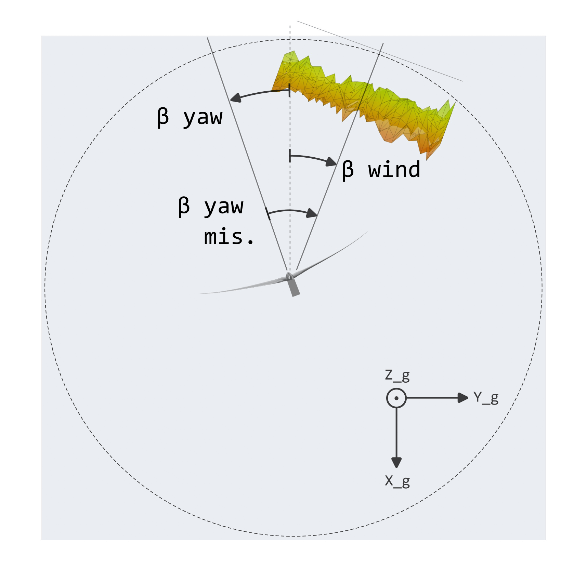
    
    Illustration of yaw direction.

Azimuthal Angle
---------------

For **HAWTs**, the azimuthal angle is defined as a **mathematically positive (CCW) rotation** around the hub x-axis :math:`X_h`. 

- Each rotor blade has its **0° azimuth position** defined as the blade pointing vertically upwards, see :numref:`fig-hawt-azimuth`.

.. _fig-hawt-azimuth:
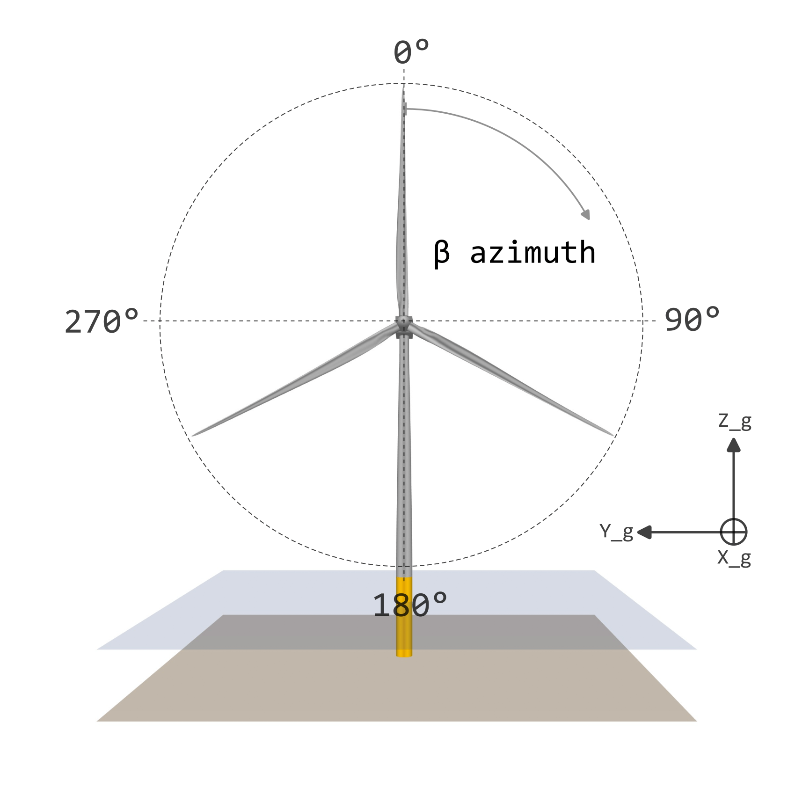
    
    Azimuthal angle definition for a HAWT.

For **VAWTs**, the azimuthal angle is defined as follows:

- The **0° azimuth position** marks the start of the upstream half-circle of rotation.
- The direction of rotation follows a **mathematically positive (CCW) rotation** around the tower axis, see :numref:`fig-vawt-azimuth`.

.. _fig-vawt-azimuth:
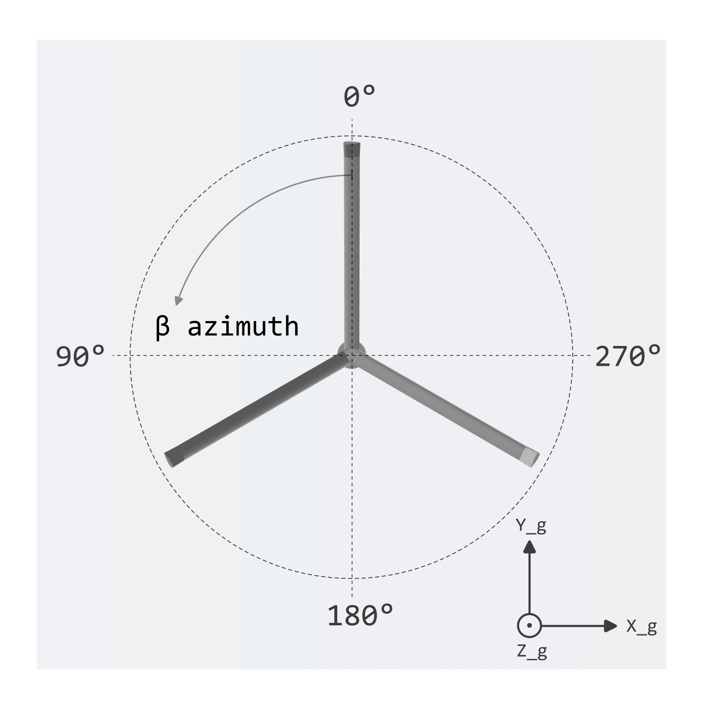
    
    Azimuthal angle definition for a VAWT.

Pitch Angle
-----------

The pitch angle definition for **HAWTs** is shown in :numref:`fig-pitch-angle`:

- A **pitch angle of 0°** means the blade chords (of a blade without any twist) are aligned with the rotor plane.
- A **pitch angle of 90°** places the blades in the feathered position, with the leading edge facing the wind.

.. _fig-pitch-angle:
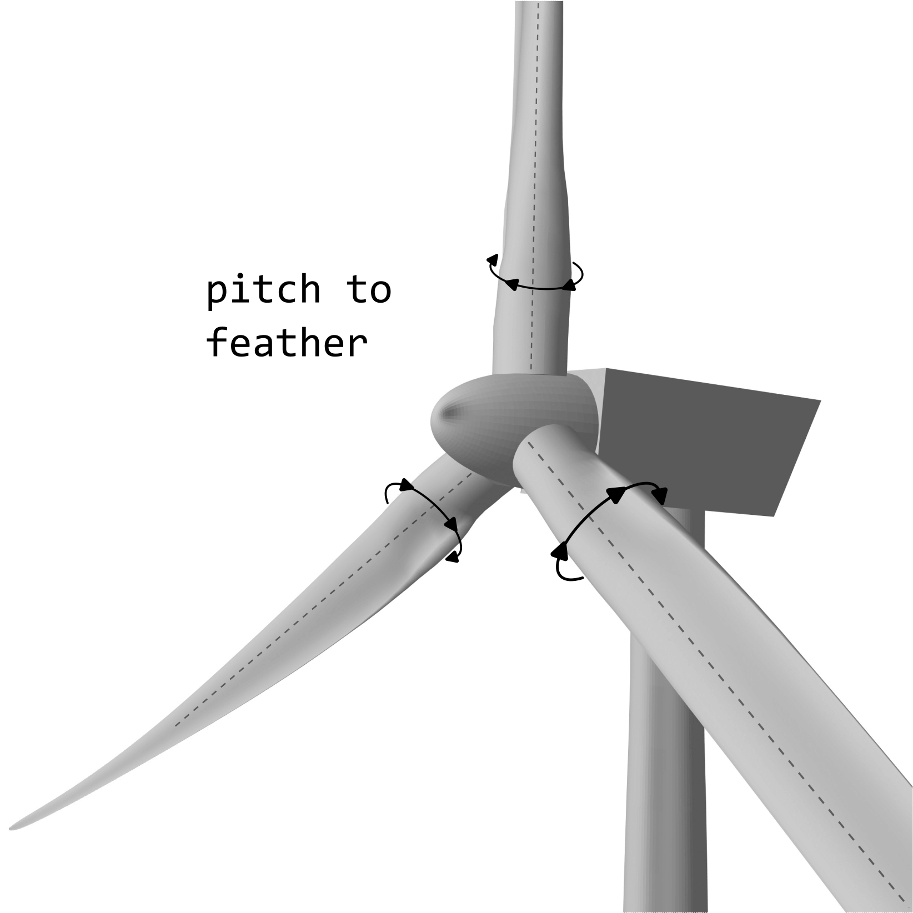
    
    Pitch angle definition for a HAWT blade.

Figure :numref:`fig-pitch-angle-vawt` shows the positive poitch direction for **VAWTs**:

- A **pitch angle of 0°** means the blade chords (of a blade without any twist) are tangential to the path of rotation.
- For a **pitch angle of 90°** the blade leading edge is facing in the direction of the rotation center, or tower..

.. _fig-pitch-angle-vawt:
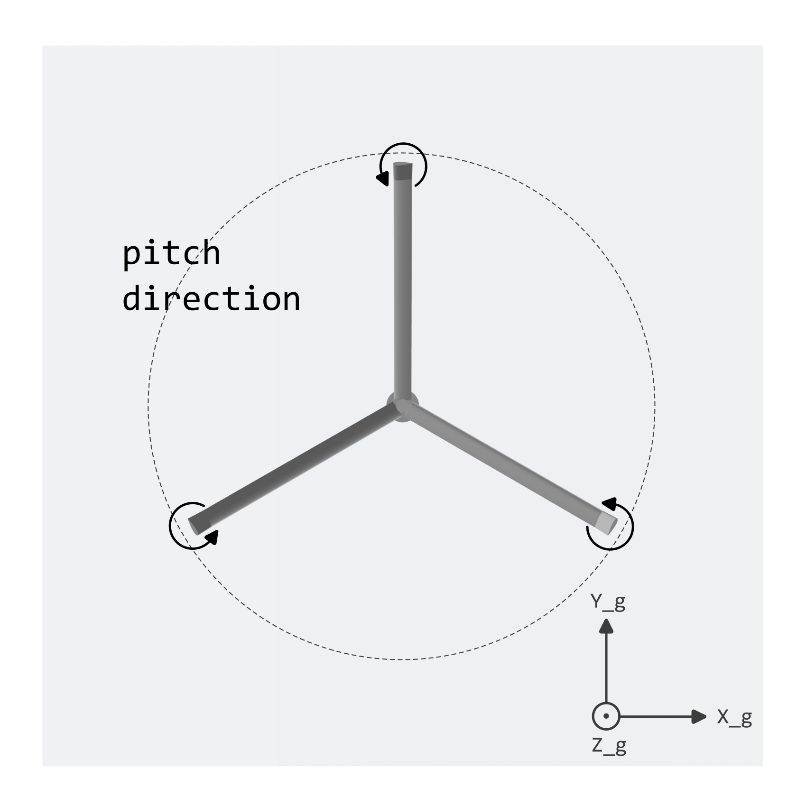
    
    Pitch angle definition for a VAWT blade.

Floater Degrees of Freedom
==========================

The floater's degrees of freedom (DoF) include:

- **Surge, Sway, Heave**: Translations along the local **x**, **y**, and **z** axes, respectively.
- **Roll, Pitch, Yaw**: Rotations around the local **x**, **y**, and **z** axes, respectively.

For an undisplaced and unrotated floater, its local coordinate system is aligned with the global coordinate system (:math:`X_g`, :math:`Y_g` and :math:`Z_g`). These DoFs are illustrated in :numref:`fig-floater-dof`.

.. _fig-floater-dof:
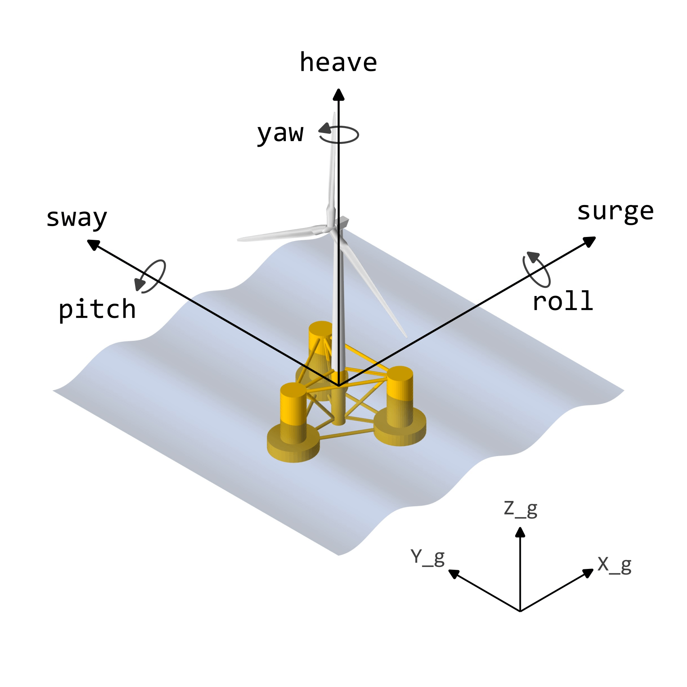
    
    Illustration of floater degrees of freedom.

.. footbibliography::
