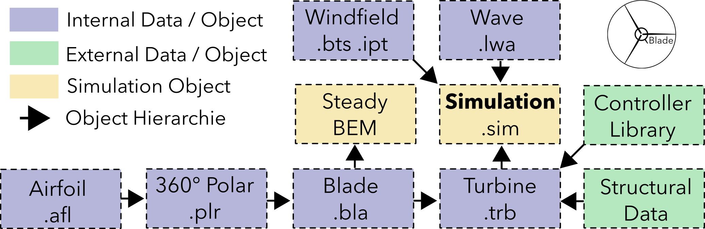

Object Hierarchy and Data Structure
====================================
   
In the back-end of QBlade all simulation objects and all data is organized in a specific hierarchy, representing the 'building blocks' of a completer aero-servo-hydro-elastic wind turbine simulation.
The data structure and object hierarchy of QBlade is shown in the following figure. 
  
 
.. _fig-data_struct:

   Overview of QBlades data structure.
   
One important thing to note is that when a data object is deleted from QBlades database all objects associated with it, that are below in the object hierarchy, are automatically removed from the database.
As an example: If a polar object is deleted all associated rotor blades are deleted and thus all associated simulations as well!
   
Project Serialization
=====================
   
Data Objects Import and Export
==============================

In QBlade several data objects exists. An aero-servo-hydro-elastic simulation definition is made up of several data objects (see :numref:`fig-data_struct`).  These objects are:

* **Simulation definition**: The simulation definition objects defines boundary conditions, discretization and simulation length and other parameters
* **Turbine definition**: The turbine definition object defines the aero-servo-hydro elastic model of the turbine that is simulated
* **Blade definition**: The blade definition contains the aerodynamic definition of the rotor blade
* **Polar**: The polar object contains the airfoil coefficients
* **Airfoil**: The airfoil object contains the outer contour of the airfoil
* **Windfield**: The windfield object contains the time resolved data of the inflow
* **Wavefield**: The wavefield contains the time resolved information of the seastate

One main concept in QBlade is the ability to easily create and edit the use data objects. In the GUI
