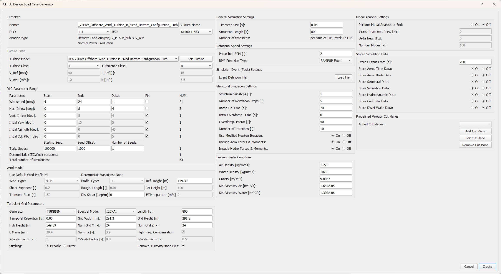
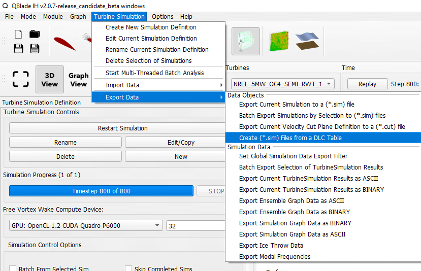

Design Load Cases Overview
**************************

.. admonition:: QBlade-EE

   This feature is only available in the Enterprise Edition of QBlade.
   
For the certification of a wind turbine, it is essential to assess its lifetime and structural integrity using simulations known as Design Load Cases (DLCs). These simulations, which are based on the IEC standard guiding the certification, range from 10 to 60 minutes in length. To ensure a comprehensive representation of the turbine's lifecycle, several hundred to thousands of DLCs are necessary. Each DLC is characterized by unique boundary conditions, including wind and wave scenarios, and different operational states such as normal power production, shutdown, or fault conditions. Although setting up each DLC manually using QBlade's user interface is straightforward, manually generating hundreds of DLCs is inefficient and time-consuming.

QBlade-EE is equipped with a fully featured automatic DLC generator (see :numref:`fig-dlc_diag`), according to the following standards:

* **IEC 61400-1 Ed. 2**
* **IEC 61400-1 Ed. 3**
* **IEC 61400-2 Ed. 2**
* **IEC 61400-3-1 Ed. 1**
* **IEC 61400-3-2 Ed. 2**

There two different ways how DLC's can be generated in QBlade with a high degree of automation. After all DLC simulations have been defined in QBlade all simulations are typically exported as Simulation Definition Files (:ref:`Simulation Definition ASCII File`) and then evaluated in parallel in the Command Line Interface (:ref:`CLI Overview`).
 
DLC Object Generation (in GUI)
******************************

This feature allows to generate a DLC object, which contains the definitions of all simulation timeseries for a specific DLC number from a specific IEC standard. After a DLC object has been generated, all simulations belonging to the DLC object can either be auto-generated as *Simulation Definition Objects* within QBlade or be exported as *Simulation Definition ASCII Files*.

.. _fig-dlc_diag:

   The DLC generator dialog (click to enlarge).

Template
--------
The automatic DLC generator can generate DLC's after a user selected standard. In the Template subsection of the dialog the user may choose the DLC, the IEC standard and a name for the DLC object.

Turbine Data
------------
In this section the turbine object, for which the DLC's should be generated, and the *Turbine Class* and *Turbulence Class* can be chosen.

DLC Parameter Range
-------------------

The user can choose the range and increments of windspeeds, inflow angles and turbine initial conditions that are required for the DLC definition. Depending on the DLC number that has been chosen some fields are automatically dactivated if they are not required.

Wind Model
----------

In this section the user can choose the wind model for the setup of the DLC. Typically all values are filled out automatically, according to the chosen IEC standard and the DLC number.

Turbulent Grid Parameters
-------------------------

The turbulent wind fields that are required for some DLC's are generated automatically by TurbSim and imported into QBlade if required. The spatial and temporal discretization, the wind field dimensions and the reference height can be chosen in this section.

Environmental Vars
------------------

The site specific environmental variables can be defined by the user.

General Sim Settings 
--------------------

Here the user needs to define the duration of the simulation (typically 600s with some added time to remove initial transients) and the timestep of the simulation. 

Rotational Speed Setting
------------------------

In this section the user can choose how the ramp-up phase should be handled (see :ref:`Rotational Speed Settings`).

Simulation Event(Fault) Settings
--------------------------------

If a specific event (such as shut-down, start-up, emergency brake, grid loss, etc.) should be included in the simulation the event definition file can be added to the simulation. Simulation events, and how they are defined, are detailed here: :ref:`Turbine Events and Operation`.

Structural Sim Settings
-----------------------

These settings concern the structural simulation of the wind turbine and are detailed here: :ref:`Structural Simulation Settings`.

Modal Analysis Settings
-----------------------

A modal analysis can be performed at the end of each DLC, if activated here. As an example, this feature can be used to automatically generate **Campbell** diagrams.

Stored Sim Data
---------------

In this section the user can choose from which timestep and what kind of data should be stored for each generated simulation. Typically the initial transient time is discarded from each DLC run.
   
Offshore DLC Generation in the GUI
----------------------------------

When IEC **61400-3-1** or **61400-3-2** is selected in the *IEC Design Load Case Generator* dialog, the user is asked to choose a *Wave Template* and to provide a *DLC List*, while the *DLC Parameter Range* section is hidden from view. The *Wave Template* is a *Linear Wave Object* in QBlade, which serves as the template for this particular DLC. E.g. the wave template contains information about the the spectrum, spectral discretization etc. and only the key parameters for wave height, wave period or wave direction will be adjusted for each simulation definition that will be generated from the Design Load Case Generator. The data table that is required then contains all information about the parameter variations for this DLC (that was previously input into the *Parameter Range* section). 

The format of the DLC table that is required is equivalent as described in :ref:`DLC Generation via Spreadsheets`, with the exception that the entries for a few columns in this table are not required, while others can be filled in automatically by QBlade according to the respective IEC standard. 

The table columns that are not required and must be filled out with the keyword *none* are:

3 **Master Simulation** : The simulation template is not required, as all needed data is defined within the *IEC Design Load Case Generator* already. Fill this column with the keyword *none*.
   
10 **Hub Height Input File** : The hub height data is automatically generated within QBlade. Fill this column with the keyword *none*.
   
11 **TurbSim Template** : The TurbSim template file is not required, as all needed data is defined within the *IEC Design Load Case Generator* already. Fill this column with the keyword *none*.

16 **Wave Template** : The Linear Wave template file is not required, as a linear wave object that serves as a template is already defined within the *IEC Design Load Case Generator*. Fill this column with the keyword *none*.

The following columns can be filled with the keyword *auto* so that QBlade will automatically choose the correct values according to the selected IEC standard:

17 **Near Surface Current Velocity** : The velocity of the near surface current in [m/s], see :ref:`Currents`. The automatic near surface current velocity is 1% of the wind velocity.

18 **Near Surface Current Direction** : The direction of the near surface current in [°], see :ref:`Currents`. The automatic near surface direction is aligned with the wind direction.

19 **Near Surface Current Depth** : The depth of the near surface current in [m], see :ref:`Currents`. The automatic depth is 20m.

21 **Sub Surface Current Direction** : The direction of the sub surface current in [°], see :ref:`Currents`. The automatic sub surface current direction is aligned with the wave direction.

22 **Sub Surface Current Exponent** : The exponent of the sub surface current velocity profile, see :ref:`Currents`. The automatic value for the exponent is 1/7.

Below is an example for such a DLC table, where some entries are replaced with the *none* and *auto* keywords. More information in QBlade DLC tables is found in the section :ref:`DLC Definition via Spreadsheets`.

.. code-block:: console

	QB_HEXAFLOAT_LC12_s0_ws5_hs1_tp6_mis-30_i0_y0		2200	none	none	5	0	0	0.14	0	none	250	1	6	-30		0	none	auto	auto	auto	0	auto	auto	0	0	0	0	0	0	0	0	0	0	0
	QB_HEXAFLOAT_LC12_s1_ws5_hs1_tp6_mis30_i0_y0		2200	none	none	5	0	0	0.14	1	none	250	1	6	30		1	none	auto	auto	auto	0	auto	auto	0	0	0	0	0	0	0	0	0	0	0
	QB_HEXAFLOAT_LC12_s2_ws5_hs1_tp8_mis-150_i0_y0		2200	none	none	5	0	0	0.14	2	none	250	1	8	-150		2	none	auto	auto	auto	0	auto	auto	0	0	0	0	0	0	0	0	0	0	0
	QB_HEXAFLOAT_LC12_s3_ws5_hs1_tp8_mis-90_i0_y0		2200	none	none	5	0	0	0.14	3	none	250	1	8	-90		3	none	auto	auto	auto	0	auto	auto	0	0	0	0	0	0	0	0	0	0	0
	QB_HEXAFLOAT_LC12_s4_ws5_hs1_tp8_mis-30_i0_y0		2200	none	none	5	0	0	0.14	4	none	250	1	8	-30		4	none	auto	auto	auto	0	auto	auto	0	0	0	0	0	0	0	0	0	0	0
	QB_HEXAFLOAT_LC12_s5_ws5_hs1_tp8_mis30_i0_y0		2200	none	none	5	0	0	0.14	5	none	250	1	8	30		5	none	auto	auto	auto	0	auto	auto	0	0	0	0	0	0	0	0	0	0	0
	QB_HEXAFLOAT_LC12_s6_ws5_hs1_tp8_mis90_i0_y0		2200	none	none	5	0	0	0.14	6	none	250	1	8	90		6	none	auto	auto	auto	0	auto	auto	0	0	0	0	0	0	0	0	0	0	0
	QB_HEXAFLOAT_LC12_s7_ws5_hs1_tp8_mis150_i0_y0		2200	none	none	5	0	0	0.14	7	none	250	1	8	150		7	none	auto	auto	auto	0	auto	auto	0	0	0	0	0	0	0	0	0	0	0
	QB_HEXAFLOAT_LC12_s8_ws5_hs1_tp10_mis-150_i0_y0		2200	none	none	5	0	0	0.14	8	none	250	1	10	-150		8	none	auto	auto	auto	0	auto	auto	0	0	0	0	0	0	0	0	0	0	0
	QB_HEXAFLOAT_LC12_s9_ws5_hs1_tp10_mis-90_i0_y0		2200	none	none	5	0	0	0.14	9	none	250	1	10	-90		9	none	auto	auto	auto	0	auto	auto	0	0	0	0	0	0	0	0	0	0	0
	QB_HEXAFLOAT_LC12_s10_ws5_hs1_tp10_mis-30_i0_y0		2200	none	none	5	0	0	0.14	10	none	250	1	10	-30		10	none	auto	auto	auto	0	auto	auto	0	0	0	0	0	0	0	0	0	0	0
	QB_HEXAFLOAT_LC12_s11_ws5_hs1_tp10_mis30_i0_y0		2200	none	none	5	0	0	0.14	11	none	250	1	10	30		11	none	auto	auto	auto	0	auto	auto	0	0	0	0	0	0	0	0	0	0	0
	QB_HEXAFLOAT_LC12_s12_ws5_hs1_tp10_mis90_i0_y0		2200	none	none	5	0	0	0.14	12	none	250	1	10	90		12	none	auto	auto	auto	0	auto	auto	0	0	0	0	0	0	0	0	0	0	0
	QB_HEXAFLOAT_LC12_s13_ws5_hs1_tp10_mis150_i0_y0		2200	none	none	5	0	0	0.14	13	none	250	1	10	150		13	none	auto	auto	auto	0	auto	auto	0	0	0	0	0	0	0	0	0	0	0
	QB_HEXAFLOAT_LC12_s14_ws5_hs1_tp12_mis-150_i0_y0	2200	none	none	5	0	0	0.14	14	none	250	1	12	-150		14	none	auto	auto	auto	0	auto	auto	0	0	0	0	0	0	0	0	0	0	0
	QB_HEXAFLOAT_LC12_s15_ws5_hs1_tp12_mis-90_i0_y0		2200	none	none	5	0	0	0.14	15	none	250	1	12	-90		15	none	auto	auto	auto	0	auto	auto	0	0	0	0	0	0	0	0	0	0	0
	QB_HEXAFLOAT_LC12_s16_ws5_hs1_tp12_mis-30_i0_y0		2200	none	none	5	0	0	0.14	16	none	250	1	12	-30		16	none	auto	auto	auto	0	auto	auto	0	0	0	0	0	0	0	0	0	0	0
	QB_HEXAFLOAT_LC12_s17_ws5_hs1_tp12_mis30_i0_y0		2200	none	none	5	0	0	0.14	17	none	250	1	12	30		17	none	auto	auto	auto	0	auto	auto	0	0	0	0	0	0	0	0	0	0	0
	QB_HEXAFLOAT_LC12_s18_ws5_hs1_tp12_mis90_i0_y0		2200	none	none	5	0	0	0.14	18	none	250	1	12	90		18	none	auto	auto	auto	0	auto	auto	0	0	0	0	0	0	0	0	0	0	0
	QB_HEXAFLOAT_LC12_s19_ws5_hs1_tp12_mis150_i0_y0		2200	none	none	5	0	0	0.14	19	none	250	1	12	150		19	none	auto	auto	auto	0	auto	auto	0	0	0	0	0	0	0	0	0	0	0
	QB_HEXAFLOAT_LC12_s20_ws5_hs1_tp14_mis30_i0_y0		2200	none	none	5	0	0	0.14	20	none	250	1	14	30		20	none	auto	auto	auto	0	auto	auto	0	0	0	0	0	0	0	0	0	0	0

   
Exporting DLC Definitions
*************************

After a *DLC Definition Object* has been defined through the dialog, all individual simulations can be automatically exported as ``.sim`` files, for an evaluation in the Command Line Interface (:ref:`CLI Overview`) or can be directly be generated and later evaluated in the GUI via the :ref:`Multi-Threaded Batch Analysis`. To export the DLC object into .sim files press: " Export .sim Files from this DLC Definition". To generate Simulation Objects within QBlade press "Create SImulations from this DLC Definition". (see :numref:`fig-dlc_gen`).
   
.. _fig-dlc_gen:
.. figure:: dlc_gen.png
   :align: center
   :scale: 70%
   :alt: Generation of DLC Simulations from a DLC definition.

   Generation of DLC Simulations from a DLC definition.
   
DLC Definition via Spreadsheets
*******************************

Alternatively, to using the GUI based dialog, DLC's may also be generated, based on a spreadsheet software. This gives the user full control over each aspect of the DLC definition and is especially useful in the DLC generation for offshore wind turbines where wind and wave distributions, their misalignment and sea currents need to be combined in often unique ways.

.. _fig-dlc_spread:

   Closeup view of a DLC spreadsheet showing the different column entries. An exemplary spreadsheet Excel file can be downloaded here: https://qblade.org/assets/DLC_Table.xlsx.

The general methodology, when generating DLC's via a spreadsheet, is to define simulation definition (.sim), wind (.inp) and wave (.lwa) template files and only to define and modify the variable parameters in a spreadsheet. When the spreadsheet is finished and all entries are defined it is possible to either import all defined simulation into QBlade as *Simulation Definition Objects* or to automatically generate *Simulation Definition ACII Files* from the spreadsheet. 

The definition of a single simulation requires 33 entries (columns) in a spreadsheet. The different entries are explained in detail in the following. If an entry should not be defined please insert *none* into the respective column. Only spreadsheet lines with 33 columns are identified during import.

1 **Name** : Each timeseries should have a unique name assigned.

2 **Simulation Length** : The length of the timeseries in [s].

3 **Master Simulation** : The path to a simulation definition template. A relative path based on the spreadsheet location can be used. This needs to be a *Simulation Definition ASCII File* with all associated files (.trb, plr, .bla, etc.). In this template all fixed varuiables that are not defined in one of the spreadsheet columns can be set.

4 **Events** : The (absolute or relative) path to an event definition file. If no event should be simulation insert the word *none*.  

5 **Windspeed** : The windspeed in [m/s].

6 **Horizontal Inflow Angle** : The horizontal inflow angle in [°].

7 **Vertical Inflow Angle** : The vertical inflow angle in [°].

8 **Shear Exponent** : The shear exponent of the power law wind profile.

9 **Turbulence Seed** : The seed that is used by TurbSim for the turbulent windfield generation (if a TurbSim template is defined).

10 **Hub Height Input File** : The (absolute or relative) path of a hub-height wind input file.

11 **TurbSim Template** : The (absolute or relative) path of the TurbSim input file (.inp) that will be used as a template for the generation of turbulent wind fields. Depending on the user entries in columns 4-9 the respective values in the template are overwritten.

12 **Water Depth** : The water depth in [m]. If an onshore turbine is simulated use the value 0.

13 **Significant Height (Hs)** : The significant wave height in [m].

14 **Significant Wave Period (Tp)** : The significant wave period in [s].

15 **Wave Misalignement** : The misalignement between wind and waves in [°]. The wave direction is calculated so that the wave is misaligned from the wind by the user specified value as a positive rotation around the global z-axis.

15 **Wave Seed** : The seed that is used by the wave generator during the generation of wave timeseries from wave spectra.

16 **Wave Template** : The (absolute or relative) path to a :ref:`Wave Definition ASCII File` that is used as a template for the wave generation. Depending on the user entries in column 13-15 the respective values in the template are overwritten.

17 **Near Surface Current Velocity** : The velocity of the near surface current in [m/s], see :ref:`Currents`.

18 **Near Surface Current Direction** : The direction of the near surface current in [°], see :ref:`Currents`.

19 **Near Surface Current Depth** : The depth of the near surface current in [m], see :ref:`Currents`.

20 **Sub Surface Current Velocity** : The velocity of the sub surface current in [m/s], see :ref:`Currents`.

21 **Sub Surface Current Direction** : The direction of the sub surface current in [°], see :ref:`Currents`.

22 **Sub Surface Current Exponent** : The exponent of the sub surface current velocity profile, see :ref:`Currents`.

23 **Near Shore Current** : The velocity of the near shore current in [m/s], see :ref:`Currents`.

24 **Near Shore Current Direction** : The direction of the near shore current in [°], see :ref:`Currents`.

25 **Intial Rotor Yaw** : The intial rotor yaw of the turbine at the beginning of the simulation, in [°]

26 **Intial Rotor Azimuth** : The intial rotor azimuthal angle of the turbine at the beginning of the simulation, in [°]

27 **Intial Rotor Pitch** : The intial collective rotor pitch angle at the beginning of the simulation, in [°]

28 **Initial FLoater X Position** : The initial position of the floating wind turbine in X-direction, in [m]

29 **Initial FLoater Y Position** : The initial position of the floating wind turbine in Y-direction, in [m]

30 **Initial FLoater Z Position** : The initial position of the floating wind turbine in Z-direction, in [m]

31 **Initial FLoater X Rotation** : The initial rotation of the floating wind turbine around X, in [°]

32 **Initial FLoater Y Rotation** : The initial rotation of the floating wind turbine around Y, in [°]

33 **Initial FLoater Z Rotation** : The initial rotation of the floating wind turbine around Z, in [°]

DLC Generation via Spreadsheets
*******************************

Once all DLC's have been defined in the spreadsheet the simulations can either be imported into QBlade or exported as *Simulation Definition ASCII Files*. For either of those options the spreadsheet table containing all columns and rows, excluding any header, has to be pasted into an ASCII file, see the code-block below for an example.

.. code-block:: console

	QB_HEXAFLOAT_LC12_s0_ws5_hs1_tp6_mis-30_i0_y0		2200	Hexafloat_Template.sim	none	5	0	0	0.14	0	DLC1.2_NTM.inp	250	1	6	-30		0	0.lwa	0	0	0	0	0	0	0	0	0	0	0	0	0	0	0	0	0
	QB_HEXAFLOAT_LC12_s1_ws5_hs1_tp6_mis30_i0_y0		2200	Hexafloat_Template.sim	none	5	0	0	0.14	1	DLC1.2_NTM.inp	250	1	6	30		1	1.lwa	0	0	0	0	0	0	0	0	0	0	0	0	0	0	0	0	0
	QB_HEXAFLOAT_LC12_s2_ws5_hs1_tp8_mis-150_i0_y0		2200	Hexafloat_Template.sim	none	5	0	0	0.14	2	DLC1.2_NTM.inp	250	1	8	-150	2	2.lwa	0	0	0	0	0	0	0	0	0	0	0	0	0	0	0	0	0
	QB_HEXAFLOAT_LC12_s3_ws5_hs1_tp8_mis-90_i0_y0		2200	Hexafloat_Template.sim	none	5	0	0	0.14	3	DLC1.2_NTM.inp	250	1	8	-90		3	3.lwa	0	0	0	0	0	0	0	0	0	0	0	0	0	0	0	0	0
	QB_HEXAFLOAT_LC12_s4_ws5_hs1_tp8_mis-30_i0_y0		2200	Hexafloat_Template.sim	none	5	0	0	0.14	4	DLC1.2_NTM.inp	250	1	8	-30		4	4.lwa	0	0	0	0	0	0	0	0	0	0	0	0	0	0	0	0	0
	QB_HEXAFLOAT_LC12_s5_ws5_hs1_tp8_mis30_i0_y0		2200	Hexafloat_Template.sim	none	5	0	0	0.14	5	DLC1.2_NTM.inp	250	1	8	30		5	5.lwa	0	0	0	0	0	0	0	0	0	0	0	0	0	0	0	0	0
	QB_HEXAFLOAT_LC12_s6_ws5_hs1_tp8_mis90_i0_y0		2200	Hexafloat_Template.sim	none	5	0	0	0.14	6	DLC1.2_NTM.inp	250	1	8	90		6	6.lwa	0	0	0	0	0	0	0	0	0	0	0	0	0	0	0	0	0
	QB_HEXAFLOAT_LC12_s7_ws5_hs1_tp8_mis150_i0_y0		2200	Hexafloat_Template.sim	none	5	0	0	0.14	7	DLC1.2_NTM.inp	250	1	8	150		7	7.lwa	0	0	0	0	0	0	0	0	0	0	0	0	0	0	0	0	0
	QB_HEXAFLOAT_LC12_s8_ws5_hs1_tp10_mis-150_i0_y0		2200	Hexafloat_Template.sim	none	5	0	0	0.14	8	DLC1.2_NTM.inp	250	1	10	-150	8	8.lwa	0	0	0	0	0	0	0	0	0	0	0	0	0	0	0	0	0
	QB_HEXAFLOAT_LC12_s9_ws5_hs1_tp10_mis-90_i0_y0		2200	Hexafloat_Template.sim	none	5	0	0	0.14	9	DLC1.2_NTM.inp	250	1	10	-90		9	9.lwa	0	0	0	0	0	0	0	0	0	0	0	0	0	0	0	0	0
	QB_HEXAFLOAT_LC12_s10_ws5_hs1_tp10_mis-30_i0_y0		2200	Hexafloat_Template.sim	none	5	0	0	0.14	10	DLC1.2_NTM.inp	250	1	10	-30		10	10.lwa	0	0	0	0	0	0	0	0	0	0	0	0	0	0	0	0	0
	QB_HEXAFLOAT_LC12_s11_ws5_hs1_tp10_mis30_i0_y0		2200	Hexafloat_Template.sim	none	5	0	0	0.14	11	DLC1.2_NTM.inp	250	1	10	30		11	11.lwa	0	0	0	0	0	0	0	0	0	0	0	0	0	0	0	0	0
	QB_HEXAFLOAT_LC12_s12_ws5_hs1_tp10_mis90_i0_y0		2200	Hexafloat_Template.sim	none	5	0	0	0.14	12	DLC1.2_NTM.inp	250	1	10	90		12	12.lwa	0	0	0	0	0	0	0	0	0	0	0	0	0	0	0	0	0
	QB_HEXAFLOAT_LC12_s13_ws5_hs1_tp10_mis150_i0_y0		2200	Hexafloat_Template.sim	none	5	0	0	0.14	13	DLC1.2_NTM.inp	250	1	10	150		13	13.lwa	0	0	0	0	0	0	0	0	0	0	0	0	0	0	0	0	0
	QB_HEXAFLOAT_LC12_s14_ws5_hs1_tp12_mis-150_i0_y0	2200	Hexafloat_Template.sim	none	5	0	0	0.14	14	DLC1.2_NTM.inp	250	1	12	-150	14	14.lwa	0	0	0	0	0	0	0	0	0	0	0	0	0	0	0	0	0
	QB_HEXAFLOAT_LC12_s15_ws5_hs1_tp12_mis-90_i0_y0		2200	Hexafloat_Template.sim	none	5	0	0	0.14	15	DLC1.2_NTM.inp	250	1	12	-90		15	15.lwa	0	0	0	0	0	0	0	0	0	0	0	0	0	0	0	0	0
	QB_HEXAFLOAT_LC12_s16_ws5_hs1_tp12_mis-30_i0_y0		2200	Hexafloat_Template.sim	none	5	0	0	0.14	16	DLC1.2_NTM.inp	250	1	12	-30		16	16.lwa	0	0	0	0	0	0	0	0	0	0	0	0	0	0	0	0	0
	QB_HEXAFLOAT_LC12_s17_ws5_hs1_tp12_mis30_i0_y0		2200	Hexafloat_Template.sim	none	5	0	0	0.14	17	DLC1.2_NTM.inp	250	1	12	30		17	17.lwa	0	0	0	0	0	0	0	0	0	0	0	0	0	0	0	0	0
	QB_HEXAFLOAT_LC12_s18_ws5_hs1_tp12_mis90_i0_y0		2200	Hexafloat_Template.sim	none	5	0	0	0.14	18	DLC1.2_NTM.inp	250	1	12	90		18	18.lwa	0	0	0	0	0	0	0	0	0	0	0	0	0	0	0	0	0
	QB_HEXAFLOAT_LC12_s19_ws5_hs1_tp12_mis150_i0_y0		2200	Hexafloat_Template.sim	none	5	0	0	0.14	19	DLC1.2_NTM.inp	250	1	12	150		19	19.lwa	0	0	0	0	0	0	0	0	0	0	0	0	0	0	0	0	0
	QB_HEXAFLOAT_LC12_s20_ws5_hs1_tp14_mis30_i0_y0		2200	Hexafloat_Template.sim	none	5	0	0	0.14	20	DLC1.2_NTM.inp	250	1	14	30		20	20.lwa	0	0	0	0	0	0	0	0	0	0	0	0	0	0	0	0	0

Now the easiest way to generate all simulations defined in the table above is to place the table and all associated templates (.sim file, .inp file, .lwa file) into the same folder. In this way we can simply specify the templates by their respective filename, without the need to also define their paths, since everything is located in the same directory. 

Importing DLC's from a Spreadsheet
----------------------------------

To import all simulation defined in a DLC table into QBlade's GUI simply enter the Simulation module and select *Import Simulations from a DLC Table*. 

.. _fig-dlc_imp:

   Import a DLC Table from the Simulation Menu.
   
Exporting DLC's from a Spreadsheet
----------------------------------

To export all simulation defined in a DLC table into *Simulation Definition ASCII Files* for batch evaluation in QBlade's CLI (see :ref:`Sample CLI Call to Start a Batch Run`) select *Generate (.sim) Files from a DLC Table*.

.. _fig-dlc_exp:

   Export a DLC Table from the Simulation Menu.