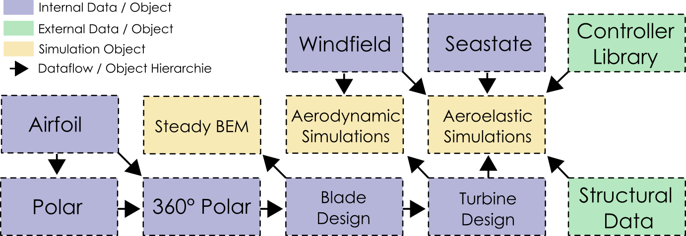

GUI Overview
===========================

A stand out feature of QBlade is the seamless integration of all functionality in a sophisticated and intuitive graphical user interface.
The main concepts and terms of QBlades user interface are briefly described in the following image.

.. _fig-gui_definitions:
.. figure:: gui_definitions.png
   :align: center
   :alt: Overview of QBlades user interface

   Overview of QBlades user interface.
   
In the backend of QBlade all simulation objects and all data is organized in a specific hirarchie, represneting the 'building blocks' of a completer aero-servo-hydro-elastic wind turbine simulation.
The data structure and object hierarchie of QBlade is shown in the follwing figure. 
  
 
.. _fig-data_struct:

   Overview of QBlades data structure.
   
One important thing to note is that when a data object is deleted from QBlades database all objects associated with it, that are bloe in the object hierarchie, are automatically removed from the database.
For example: If a polar object is deleted all associated rotor blades are deleted and thus all associated simulations as well!
   

