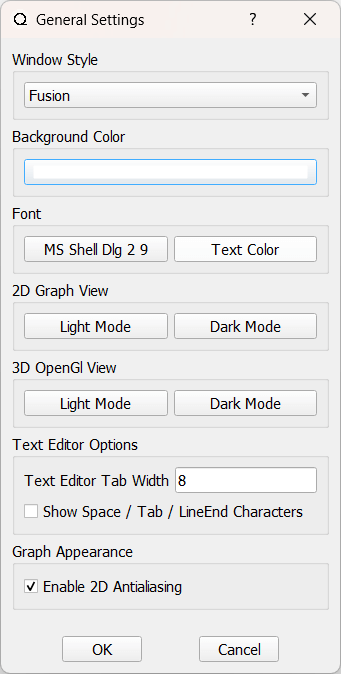
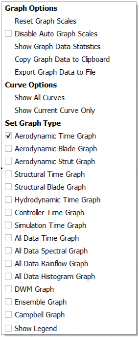

GUI Overview
============

A stand out feature of QBlade is the seamless integration of all functionality in a sophisticated and intuitive graphical user interface.
The main concepts and terms of QBlades user interface are briefly described in the following image.

.. _fig-gui_definitions:

   Overview of QBlades user interface.
   
* The **Menu** allows to change between HAWT and VAWT mode and enables access to GUI customization and export functionality.
* The **Main Toolbar** is used to switch to quickly open or save project and to switch between QBlade's different modules.
* The **Module Toolbar** changes, depending on which module is currently selected. The main functionality of this Toolbar is to select data objects through the shown *Combo Boxes* and to switch between the *Graph View*, *Gl View* or *Dual View* modes
* The **Dock Widget** changes, depending on which module is currently selected. Here data objects can be created, edited or removed and simulation can be started. Furthermore it contains module specific functionality.
* The **GL View** is available for some modules and shows a rendered representation of the simulation or data object.
* The **Graph View** is used to plot simulation results or object data in QBlade's custom 2D Graph class.

General Settings
================

the general settings dialog (see :numref:`fig-generalsettings`) can be found in the top *Menu* under *Options->General Gui Appearance*. 

.. _fig-generalsettings:

   The general settings dialog.
   
In this dialog the global font size and font type can be changed. Furthermore the overall wind style and several other global visualization options can be set.

Opengl Light Settings
=====================

The OpenGl Light Settings Dialog (see :numref:`fig-openglsettings`) can be found in the top *Menu* under *Options->OpenGl Light Settings*. 

.. _fig-openglsettings:

   The opengl light settings dialog.
   
This dialog allows to change the global illumination and light settings for all scenes that are rendered in 3D using opengl.

Debug Console Dialog
====================

The Debug Console Dialog (see :numref:`fig-debugdialog`) can be found in the top *Menu* under *Options->Open Debug Console*. 

.. _fig-debugdialog:
.. figure:: debug_dialog.png
   :align: center
   :alt: The debug console.

   The debug console.
   
The *Debug Output* dialog provides live, human-readable log messages from different QBlade subsystems. It is primarily intended for troubleshooting model setup, solver initialization, controller I/O, and serialization/import issues.

Overview
********

The dialog consists of:

- **Subsystem filters** (checkboxes): enable/disable log streams.
- **Redirect target** (radio buttons): choose where debug output is written.
- **Log view** (scrollable text area): displays collected messages.
- **Clear Output** button: clears the dialog content (does not delete external files).
- **Close** button: closes the dialog.

Subsystem Filters
*****************

The following checkboxes enable debug messages for specific parts of QBlade:

- **Simulation Debug Output**
  General simulation workflow messages (setup, runtime steps, solver state changes).

- **Turbine Debug Output**
  Turbine-specific messages (turbine initialization, aerodynamic/structural coupling stages, rotor state).

- **Controller Debug Output**
  Messages related to controller loading and communication (DLL/interface calls, signals, controller errors).

- **Structural Model Debug Output**
  Detailed messages from the structural model assembly and constraints.
  Typical entries include creation of connectors/joints, added mass assignment, and component property assignment.

- **Serializer, Store and I/O Debug Output**
  Messages from import/export, parsing, project serialization, and file I/O.

.. note::

   Enabling more categories increases verbosity. For performance-sensitive runs, enable only the subsystem you are debugging.

Redirect Debug Output
*********************

Under **Redirect Debug Output to:** you can select one output target:

- **DebugLog.txt**
  Writes the debug stream to a text file located in the QBlade folder. Use this when you need to attach logs to a support request or   compare runs. Even when QBlade crashes the debug output remains inside the file. Upon restarting QBlade the file is cleared and reinitialized. 

- **This Dialog**
  Shows output directly in the dialog (useful for interactive debugging and quick checks).

- **To Console**
  Redirects messages to stdout/stderr. This is useful when running QBlade from a terminal or when collecting logs
  from automated workflows.

.. tip::

   For reproducible bug reports, prefer **DebugLog.txt** so the full initialization sequence is preserved.

Graph Functionality
===================

.. _fig-graph:

   A QBlade Graph.

Each of the modules in QBlade is equipped with custom graphs that are used to plot various parameters of a simulation or a data object. The graphs in QBlade can be considered the main tool for analyzing and exporting results in QBlade.
Each graph can be customized individually. When closing a QBlade session all graph customizations are stored and are reloaded when QBlade is started again. The user can interact with a graph in the following ways:

- **Pan**: Hold down the left mouse key to pan the graph
- **Zoom**: Use the mouse wheel to zoom a graph. Holding down the *Y* or *X* key on the keyboard allows to only zoom the x- or y-axis.

Graph Types
***********

The results from various types of analysis are presented in different graph types. Most module have their analysis results spread out over several graph types. The data is arranged over different types of graphs due to the underlying differences in structure. A *blade graph* for instance contains all results distributed over a rotor blade. A *time graph* contains the results for each timestep and a *PSD graph* contains the results in the frequency domain. The graph type can quickly be changed in the :ref:`Graph Context Menu`. After a graph type is changed the currently available variables can be shown by double clicking on the graph (see :ref:`Variables & Styles and Axes`).

Graph Context Menu
******************

.. _fig-graph_context:

   The Graph Context Menu.
   
The *Graph Context Menu* contains three sections. The bottom section can be used to change the :ref:`Graph Types`. Depending on the module several different :ref:`Graph Types` are available. 
The top parts of the :ref:`Graph Context Menu` is the same for all modules. This functionality is related to the data shown in the graph and the visibility of the curves within a graph.

* **Reset Graph Scales**: The graph scales are adapted to best fit the currently shown curves
* **Disable Auto Graph Scales**: Disables the automatic graph scaling, the graph scaling is frozen until this option is deselected again.
* **Show Graph Data Statistics**: Show the min, max, mean, range, stdDev, variance and DEL's for all time series shown in a graph.
* **copy Graph Data to Clipboard**: The data of the displayed curves is copied to the clipboard, to facilitate simple copy/paste data transfer.
* **Export Graph Data to File**: The curves displayed in the currently selected graph are exported to a ``.txt`` file.

* **Show All Curves**: All data objects or simulations are displayed in the graph.
* **Show Current Curve Only**: Only the currently selected object curve is shown in the graph, all other object curves are hidden.

Variables & Styles and Axes
***************************

The *Variables* menu can be opened by a left mouse double click on any graph. The *Styles and Axes* menu is found by clicking on the *Styles and Axes* tab in the graph menu.

.. _fig-graph_options:

   The Graph Variables Menu.
   
The main functionality of the *Variables* menu is to select the parameter that is currently plotted. A variable can be selected for the x- and the y-axis. The *Search* edit can be used to search for a parameter in the graphs parameter list.
   
.. _fig-graph_styles:

   The Graph Styles Menu.

The *Styles and Axes* menu can be used to customize the graph appearance and the graph limits. Furthermore a moving average window size can be defined in this menu that is applied to the currently plotted parameter.
   
Curve Styles
************

.. _fig-curve_styles:

   The Curve Styles Menu.
   
When in the *Graph View* of a module the *Curve Styles* box is visible in the *Dock Widget*. The *Curve Styles* menu is used to set the appearance of the data curve of an object. By clicking on the colored line box the curve color, curve style and curve width can be changed by the user. Furthermore, the following options are available:

* **Highlight**: If this checkbox is ticked the currently selected object will be highlighted by increasing the width of the associated curve.
* **Show**: This checkbox toggles the visibility of the curve.
* **Curve**: This toggles if the curve is displayed.
* **Points**: This toggles if the individual data points are displayed.

Graph Layout
************

.. _fig-graph_layout:

   The Graph Layout Menu.
   
The *Graph Layout Menu* can be accessed from the *Menu*. For each module an individual graph layout can be selected. The user can choose to display one, two, three, four, six or eight graphs in two layout options.
When multiple graphs are displayed in QBlade each graph can be of a different *Graph Type* and can be configured with an individual appearance.

.. _fig-graph_multi:

   The 'Eight Graphs Vertical' Layout.
