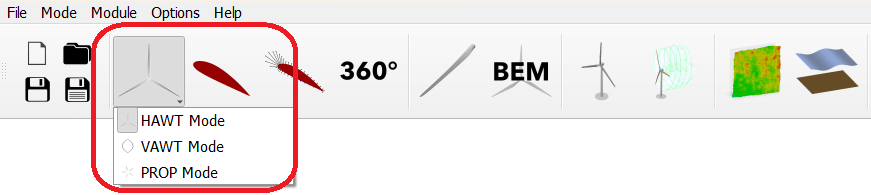

Setting the Design Mode
=======================

QBlade can be used to design and simulate not only horizontal axis wind turbines (HAWT) but also vertical axis wind turbines (VAWT) and even propellers (PROP).
To enable a clean and simple graphical user interface, regardless of the type of rotor investigated, the user can switch between three operational modes. These are:

* **HAWT** Rotor design and BEM analysis for horizontal axis wind turbines
* **VAWT** Rotor design and DMS analysis for vertical axis wind turbines
* **PROP** Propeller design and BEM analysis

The user can switch between the different modes using the *Menu* (see :numref:`fig-menumodes`).

.. _fig-menumodes:

   Switching between QBlade design modes via the menu.
   
After a mode has been chosen the *main toolbar* is automatically updated to display the modules that belong to the chosen mode (see :numref:`fig-modes_toolbar`).

.. _fig-modes_toolbar:

   Different modules displayed in the main toolbar for the different modes.
   
HAWT Mode, VAWT Mode and PROP Mode
==================================

The main differences between the three modes are in the Blade Design Module (see :ref:`Blade Design Overview`) and the :ref:`Rotor BEM` Module. Depending on the chosen mode features in the blade design module and variables for the steady state rotor/propeller design simulations are changed.
For instance when in **PROP** mode propeller specific variables are introduces, such as the *Advance ratio* or the *Propeller Efficiency*. Furthermore in the blade design module propeller specific optimization algorithms are introduced.

.. _fig-propdesign:

   The propeller design module and the propeller optimization dialog.