GUI Based Analysis
##################

The dynamic graphs in QBlade are a powerful tool to analyze time-domain data directly within QBlade's graphical user interface. After simulations have been conducted, or live during their evaluation, the simulation data can be analyzed in great detail using the 2D graph view of QBlade's simulation module (see :numref:`fig-graph_view`).

.. _fig-graph_view:
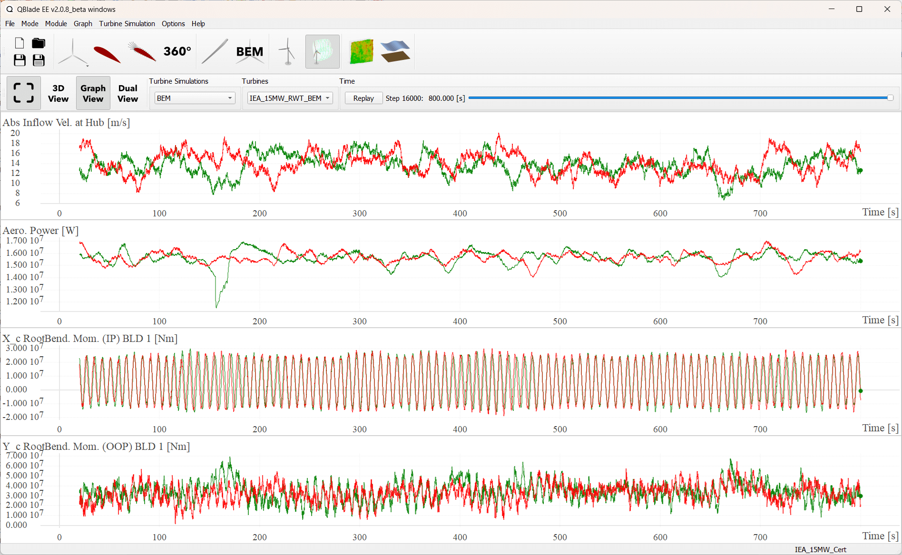
   
   The 2-D graph view.

Changing Graph Types
--------------------

After an aero-hydro-elastic simulation has been evaluated, thousands of time series may be available for analysis, depending on the sensors defined by the user and the type of simulation conducted. To organize this large amount of data, it is thematically distributed across different graph types:

* **Aerodynamic Time Graph**: Displays aerodynamic data over time.
* **Aerodynamic Blade Graph**: Shows aerodynamic data distribution along the blade for the currently selected timestep.
* **Aerodynamic Strut Graph**: Shows aerodynamic data distribution along the struts for the currently selected timestep.
* **Structural Time Graph**: Displays structural data (e.g., loads, positions, velocities) over time.
* **Structural Blade Graph**: Shows structural data distribution along the blades for the currently selected timestep.
* **Hydrodynamic Time Graph**: Displays hydrodynamic quantities over time.
* **Controller Time Graph**: Visualizes data from the controller SWAP arrays over time.
* **Simulation Time Graph**: Shows global simulation data, including performance metrics or global mooring system data over time.
* **All Data Time Graph**: Consolidates all data arrays into a single graph over time.
* **All Data Spectral Graph**: Consolidates all data arrays into a single graph over frequency.
* **All Data Rainflow Graph**: Displays Rainflow Cycle Counts for all data arrays.
* **All Data Histogram Graph**: Consolidates all data arrays into a single graph as histograms.
* **DWM Graph**: Displays data from the Dynamic Wake Meandering (DWM) model.
* **Ensemble Graph**: Plots ensemble data across multiple simulations, such as power curves where each point corresponds to an individual simulation.
* **Campbell Graph**: Displays the Campbell diagram of a turbine, derived from modal analysis results at specific operating conditions.

:numref:`fig-data_analysis` illustrates four graphs plotting the same data array (e.g., the out-of-plane root bending moment of blade 1 for two different simulations) in different ways. The top-left graph shows the signal in the time domain with a logarithmic y-axis (set via the **Graph Menu**). The top-right graph depicts a Rainflow Cycle count of the same data. The bottom-right graph presents a histogram of the signal, while the bottom-left graph shows the original time-domain signal.

.. _fig-data_analysis:
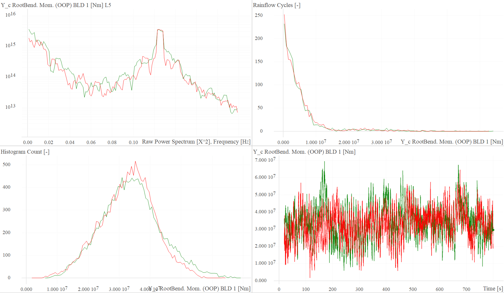
   
   Four different graph types showing the same data.

The graph type can be selected through the graph context menu (see :numref:`fig-graph-options`), accessible via a right-click on the graph. The menu also enables quick actions such as copying the plotted curves to the clipboard (**Copy Graph Data to Clipboard**) or exporting the curves to a file (**Export Graph Data to File**). The **Disable Auto Graph Scales** option prevents automatic graph scaling, useful when zooming in on specific details. To reset the scaling, use **Reset Graph Scales**.

.. _fig-graph-options:
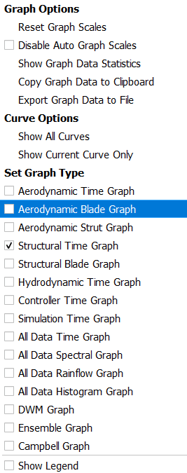
   
   The graph context menu, accessed by right clicking in a graph.
   
The graph context menu also allows displaying statistics for all plotted curves in the currently selected graph (see :numref:`fig-graph_statistics`).

.. _fig-graph_statistics:
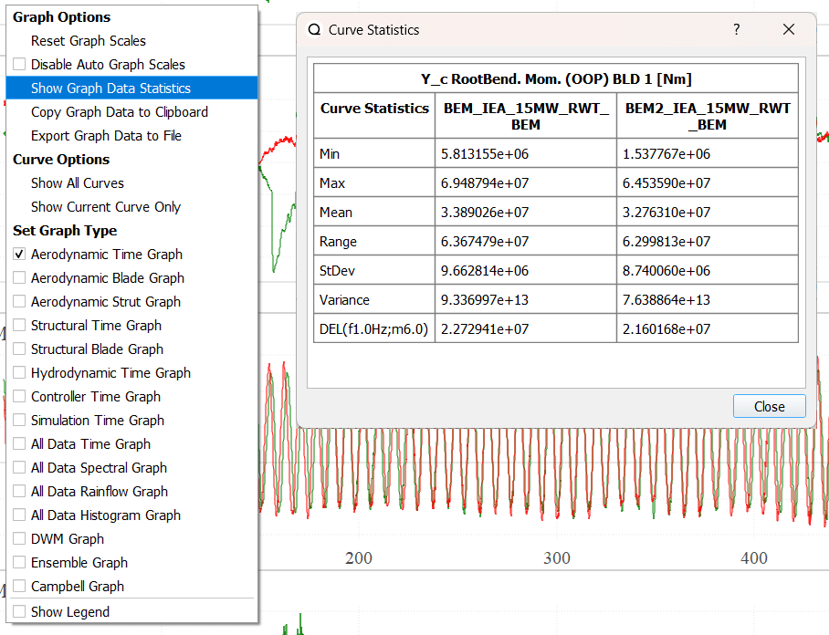
   
   Statistics for the plotted curves.

Choosing Values to Plot
-----------------------

Dynamic graphs can be customized to display various data (see also :ref:`Graph Functionality`). The graph menu, accessible by double-clicking a graph, provides customization options.

.. _fig-graph_variables:
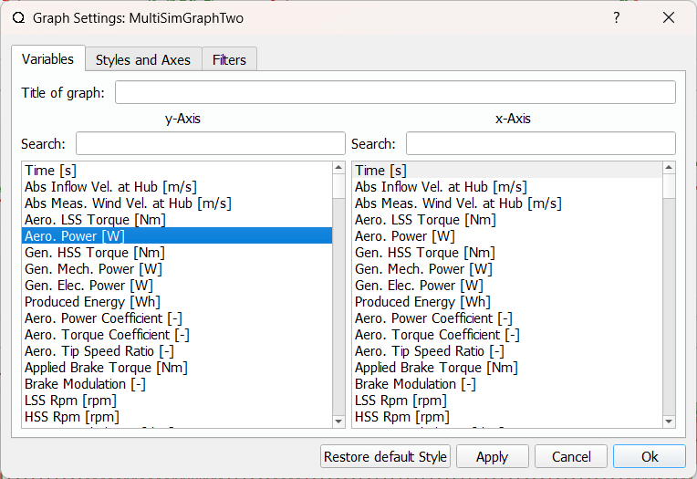
   
   The x- and y-axis variables in the graph menu, accessed by double click on a graph.
   
The first tab in the graph options menu allows the user to select data arrays for the x- and y-axes. The available data depends on the selected graph type.

Customizing the Graph Style
---------------------------

.. _fig-graph_stylesss:
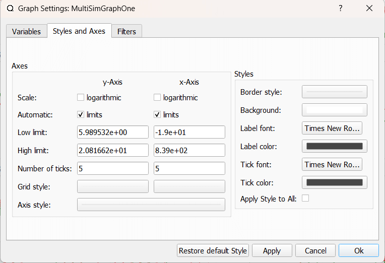
   
   The graph filter styles in the graph menu, accessed by double click on a graph.
   
On the second tab of the graph options menu, users can customize graph styles, including colors, grid lines, and fonts. Additionally, users can switch the x- or y-axis between linear and logarithmic scales.

Applying Filters to the Data
----------------------------

QBlade offers powerful time-domain filtering capabilities, including high-pass, low-pass, bandpass, and notch filters. These filters use a Simple Moving Average (SMA) approach, balancing efficiency and usability.

Filter Options
**************

- **Low-Pass Filter**: Smooths the signal by attenuating frequencies above the specified cutoff frequency.

- **High-Pass Filter**: Preserves high-frequency components by attenuating frequencies below the specified cutoff frequency. 

- **Bandpass Filter Mode**: Retains frequencies within a specified frequency band by combining low-pass and high-pass filters. Both low- and high pass filter must be activated for the bandpass filter to specify the frequency band.

- **Notch Filter Mode**: Eliminates specific frequencies within a specified frequency band by subtracting the bandpass-filtered signal from the original. Both low- and high pass filter must be activated for the notch filter to specify the frequency band.

.. _fig-graph_filters:
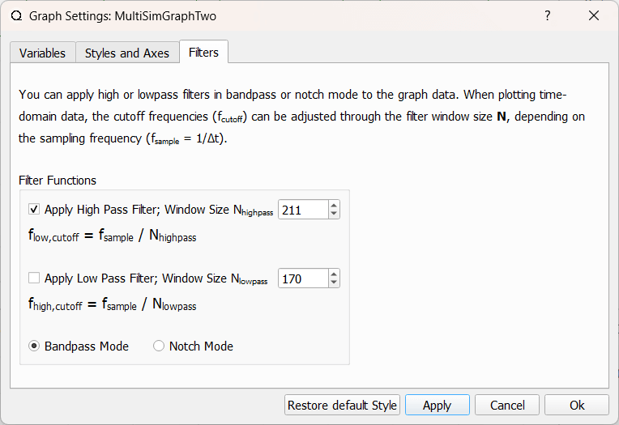
   
   The graph filter options in the graph menu, accessed by double click on a graph.

Cutoff Frequencies
******************

The cutoff frequency (:math:`f_c`) depends inversely on the filter window size (:math:`N`):

.. math::

   f_c = \frac{f_s}{N}

Where:

- :math:`f_s` is the sampling frequency (:math:`f_s = \frac{1}{\Delta t}`).
- :math:`N` is the filter window size.

The Graph View Dock
-------------------

.. _fig-graph_view_dock:
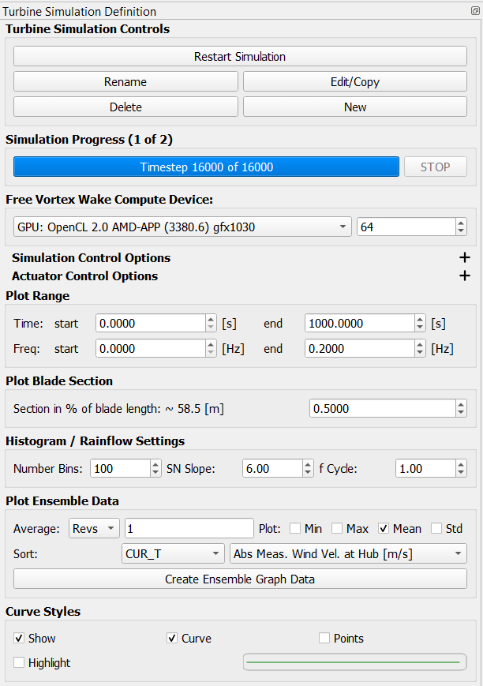
   
   The graph view dock.
   
The graph view dock contains various controls for managing the data displayed in the graphs.

Plot Range
**********

The **Plot Range** section allows users to define the range for time-domain and frequency-domain data to be displayed across all graphs in this view. If you need to focus on data within a specific time or frequency window, you can adjust it here. Once the range is applied, the graphs are automatically scaled. 

.. admonition:: Caution: Empty Graphs??
   :class: important
   
   If the available simulation data lies outside the plot range defined in this section, the graphs will not display any data, and it can appear that the simulations did not generate any data! The plot range that is configured is saved upon shutting down the program and will be retained for the next session.

Plot Blade Section
******************

Several variables in the **Aerodynamic Time Graph** and **Aerodynamic Strut Graph** are plotted for a specific blade section, as indicated by *(at section)* in the variable name. For example: *Lift Coefficient (at section) Blade 1 [-]*. This option allows users to select the blade position for which the data is plotted.

Histogram / Rainflow Settings
*****************************

This section allows users to configure the number of bins used in the **Histogram** and **Rainflow Cycle** graphs. Additionally, users can specify the **SN Slope** and **f Cycle** values, which are used to calculate the **DEL** displayed in the **Graph Data Statistics**.

Plot Ensemble Data
******************

This section facilitates the generation of data for the **Ensemble Graph**, which can display data aggregated over a range of simulations, such as the power curve of a wind turbine. 

To use this feature:

 1. Conduct a series of simulations over a range of wind speeds.
 2. Select the wind speed array in the **Sort:** column. This will organize simulations for the currently selected turbine type (**CUR_T**) or all turbines (**ALL_T**) by wind speed.
 3. Click *Create Ensemble Graph Data* to populate the **Ensemble Graph** with data sorted by wind speed. You can then plot the power curve.

In the **Average:** column, users can select whether to average data arrays from all simulations over the last *N* revolutions (**Revs**) or the last *N* time steps (**Steps**). Additionally, users can choose to display aggregated values such as Min, Max, Mean, or St (Standard Deviation) for all simulations.

Changing the Graph View
-----------------------

The user can choose here how many graphs should be diaplyed and in what arrangement they should be presented.

.. _fig-change_graph_view:
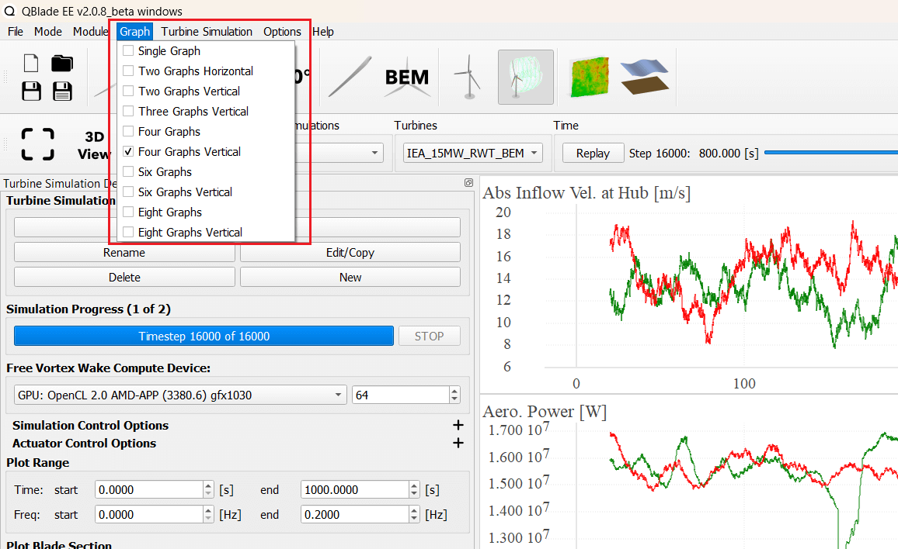
   
   Graph view options in the top menu.
   

External Postprocessing
#######################

After simulations have been conducted, all simulation data can be easily exported with just a few mouse clicks. The :ref:`Batch Export` functionality enables users to select a range of simulations, choose an appropriate :ref:`Data Export Format`, and export all simulation data into a specified folder for post-processing in the framework or scripting language of their choice. Generally, all time-domain data saved during simulations is included in the export. If only a subset of this data is required, the :ref:`Global Export Filter` can be used to define and arrange the desired subset.

Data Export Format
------------------

QBlade's primary purpose is to deliver efficient and robust tools for generating high-quality, validated simulation results in the time domain. For enhanced flexibility, users are encouraged to post-process these results in external environments or scripting languages, making it easy to integrate QBlade with existing toolchains.

Simulation results can be exported in various formats, from simple ASCII files to advanced binary formats optimized for low memory usage. These widely supported formats allow users to leverage existing post-processing tools, such as those developed for OpenFAST and HAWC2.

Supported export formats include:

- **QBlade ASCII**: The simple QBlade ASCII format, storing data in *tab* separated columns (generating ``.txt`` files)
- **HAWC2 ASCII**: The HAWC2 ASCII format (generating ``.dat`` and ``.sel`` files), see `HOW2HAWC2 User Manual <https://www.google.com/url?sa=t&source=web&rct=j&opi=89978449&url=https://orbit.dtu.dk/files/7703110/ris_r_1597.pdf&ved=2ahUKEwjf8tuP6tGGAxVjHjQIHQHYDRgQFnoECBYQAQ&usg=AOvVaw3D9y9rlDgZlGqOQCtCSvmF>`_. This format is also compatible with DTU's `PDap Software <https://tools.windenergy.dtu.dk/home/Pdap/default.html>`_. 
- **HAWC2 BINARY**: The HAWC2 BINARY format (generating ``.dat`` and ``.sel`` files), see `HOW2HAWC2 User Manual <https://www.google.com/url?sa=t&source=web&rct=j&opi=89978449&url=https://orbit.dtu.dk/files/7703110/ris_r_1597.pdf&ved=2ahUKEwjf8tuP6tGGAxVjHjQIHQHYDRgQFnoECBYQAQ&usg=AOvVaw3D9y9rlDgZlGqOQCtCSvmF>`_. This format is also compatible with DTU's `PDap Software <https://tools.windenergy.dtu.dk/home/Pdap/default.html>`_. 
- **OpenFAST BINARY**: The OpenFAST BINARY format (generating ``.outb`` files), see `OpenFAST Documentation <https://openfast.readthedocs.io/en/dev/source/user/fast.farm/OutputFiles.html>`_.

Batch Export
------------

After simulations are completed, results can be exported using the graph batch export dialog (see :numref:`fig-batch_export`).

.. _fig-batch_export:
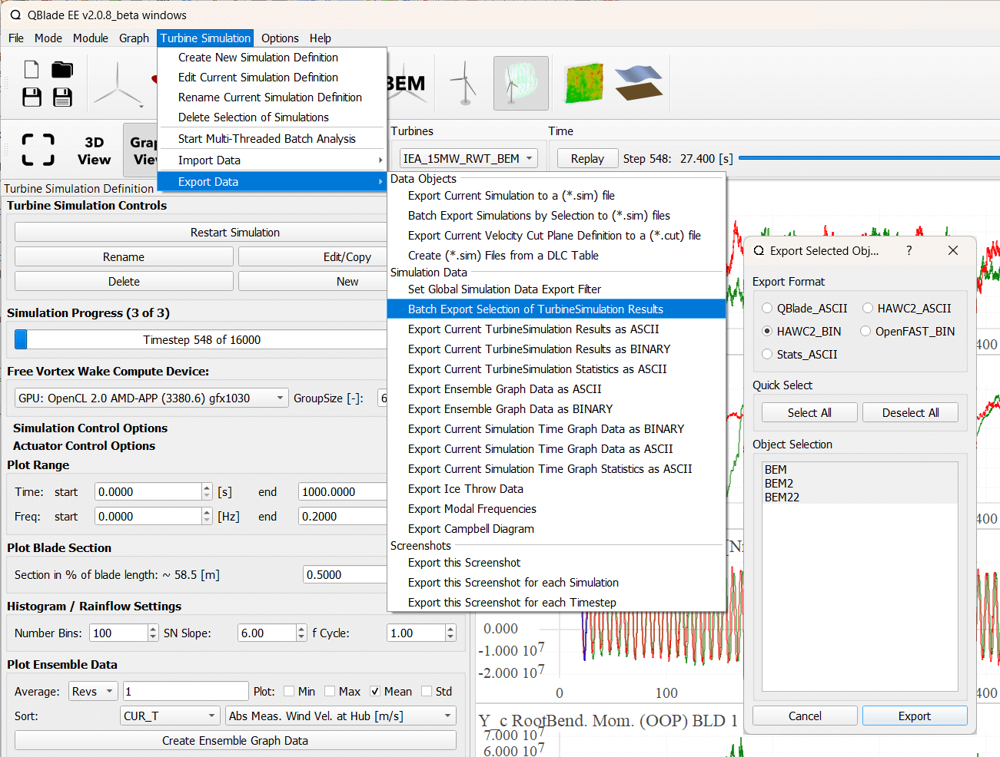
   
   The batch export option and dialog.

Global Export Filter
--------------------

To export only a subset of the generated data, the **Global Export Filter** can be applied. This filter is accessible through the simulation menu (see :numref:`fig-global_export_filter`). Users can specify a list of variable names to include in the export and control their order. Below is an example of variable names for the global export filter:

.. code-block:: console
	:caption: : Exemplary list of variable names for the global export filter
	
	Time [s]
	Gen. HSS Torque [Nm]
	X_c Tip Trl.Def. (OOP) BLD 1 [m]
	X_b RootBend. Mom. BLD 1 [Nm]
	...
	...

.. admonition:: Serialization of global results filter
   :class: important
   
   Once a global filter is set, it applies to all time-domain exports and is saved as part of the project ``.qpr`` file. The filter can be reset by clearing all specified variable names in the export filter dialog (see :numref:`fig-global_export_filter_dialog`). If you notice that certain timeseries or results are missing from your exported files, ensure that a global results filter is not still applied.

.. _fig-global_export_filter:
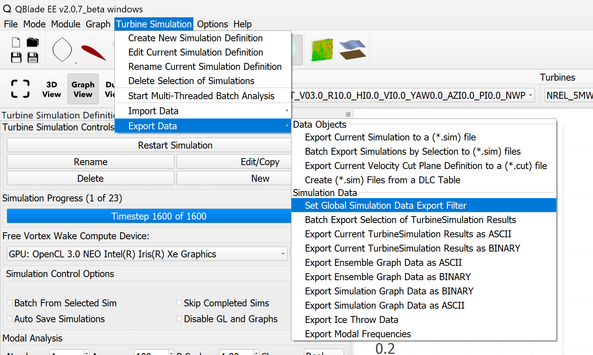

   The Global Export Filter option in the menu
   
.. _fig-global_export_filter_dialog:
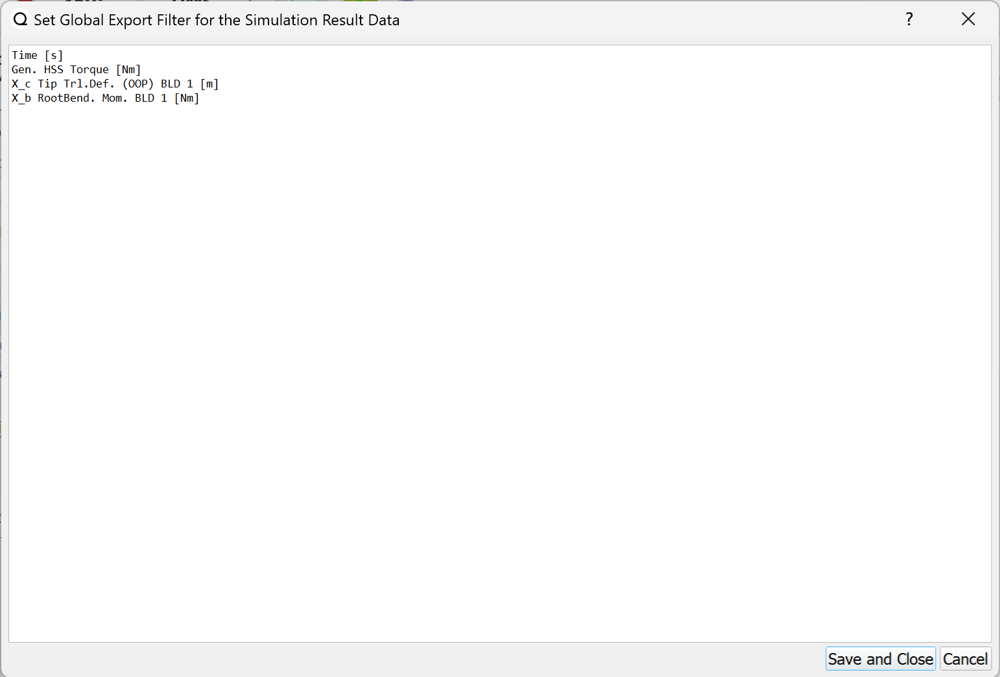

   The Global Export Filter option in the menu
   
Export filters can also be applied in the :ref:`Command Line Interface (CLI)` to automate their use for all CLI-generated results. For details, see :ref:`CLI Functionality`.