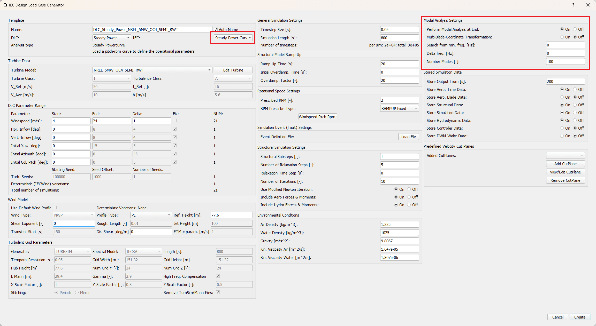
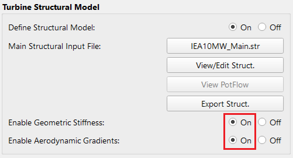
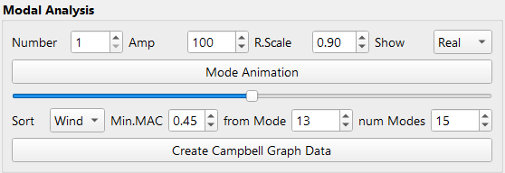
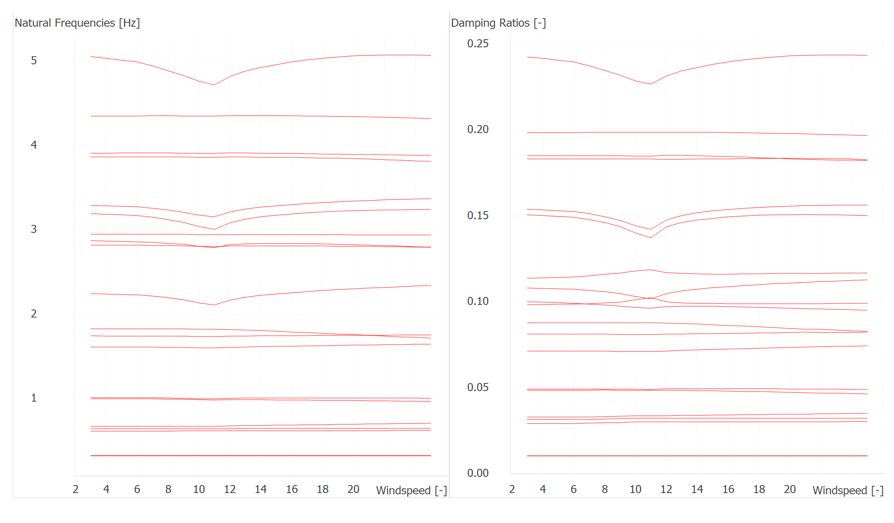

Creating Campbell Diagrams
##########################

.. admonition:: QBlade-EE

   This feature is only available in the Enterprise Edition of QBlade.

Campbell Diagrams provide a visualization of the interaction between a wind turbine's structural natural frequencies and the excitation frequencies caused by rotor harmonics and environmental conditions, such as wind speed. They are an essential tool for identifying potential resonance conditions that could impact turbine performance and durability.

Simulation Setup for Campbell Diagrams
**************************************

An efficient way to set up Campbell Graphs is using the Design Load Case Generator (see :ref:`Design Load Cases Overview`). Choosing the *Steady Power Curve* standard allows for efficient setup of simulations across a range of wind speeds. Ensure the :ref:`Modal Analysis` feature is activated for each simulation. After generating the simulations from this DLC definition, they can be quickly evaluated using the :ref:`Multi-Threaded Batch Analysis` feature, and subsequently, a Campbell Graph can be generated.

.. _fig-modal5:

   Setup of *Steady Power Curve* simulations for modal analysis

Turbine Settings
****************

To accurately capture aeroelastic damping in a modal analysis, the user should enable the **Aerodynamic Gradients** option. This option evaluates the Jacobian of the aerodynamic loads and includes the sensitivity of the aerodynamic forces and moments to structural motion. While this has no effect on standard time-domain simulations, it can have a major influence on the damping ratios predicted by the modal analysis and is therefore recommended whenever aeroelastic stability is assessed.

In addition, the user should enable **Geometric Stiffness** so that the modal analysis accounts for stress-stiffening effects caused by the current loading state. In rotating systems, this is particularly important for representing centrifugal stiffening effects correctly and for obtaining accurate natural frequencies and mode shapes under operating conditions.

.. _fig-modal6:

   Turbine structural settings recommended for the modal analysis
   
Campbell Diagrams Generation
****************************

Campbell graphs can be generated from a set of simulations for which a :ref:`Modal Analysis` has been carried out. Generally, this set of simulations spans over a range of wind speeds or rotational speeds. Across this range, the modes are tracked using the **Modal Assurance Criterion (MAC)**, which measures the statistical correlation between mode shapes at adjacent operating points. The modal frequencies and damping ratios are then aggregated and visualized in the **Campbell Graph**. 

To generate a Campbell graph, first select a simulation. The set of simulations will consist of all simulations that share the same turbine object as the selected simulation. The *Modal Analysis Dock Window* in :numref:`fig-modal3` is used to generate the Campbell diagram.

.. _fig-modal3:

   The Modal Analysis Dock Window
   
   
The user can choose to sort the simulation set based on rotational speed or wind speed (**Sort**). During the tracking process, the algorithm evaluates the entire available modal pool to ensure optimal global matching. 

* **Min. MAC**: Specifies the minimum allowable shape correlation to maintain a mode's identity. If the best available match for a track falls below this threshold (typically 0.6), the mode is considered to have vanished or "morphed" beyond recognition due to high damping or aeroelastic coupling, and the track is broken (visualized as a gap in the graph). The MAC value ranges from 0.0 to 1.0, representing the correlation between two mode shapes, with: 1.0 - Perfect Match and 0.0 - No Match. 

* **from Mode**: Selects the starting mode index (ordered by frequency at the first operating point) to be included in the diagram.

* **num Modes**: Specifies the total number of physical mode tracks to follow, starting from the **from Mode**.

Clicking on **Create Campbell Graph Data** then generates the tracking data. An exemplary Campbell Graph is shown in :numref:`fig-modal4`.

.. _fig-modal4:

   Campbell Graph showing modal frequencies and damping ratios
   

.. footbibliography::

