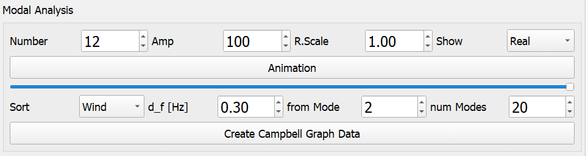

Campbell Graphs
---------------

.. admonition:: QBlade-EE

   This feature is only available in the Enterprise Edition of QBlade.

Campbell graphs can be generated from a set of simulations for which a :ref:`Modal Analysis` has been carried out. Generally, this set of simulations spans over a range of wind speeds or rotational speeds. Across this range, the modes are tracked using the Modal Assurance Criterion (MAC). The modal frequencies and damping ratios are then aggregated and visualized in the **Campbell Graph**. To generate a Campbell graph, first select a simulation. The set of simulations will consist of all simulations that share the same turbine object as the selected simulation. The *Modal Analysis Dock Window* in :numref:`fig-modal3` is used to generate the Campbell diagram.

.. _fig-modal3:

   The Modal Analysis Dock Window
   
   
The user can choose to sort the simulation set based on rotational speed or wind speed (**Sort**). The value **d_f [Hz]** specifies the maximum allowable delta in frequency for the same mode between two adjacent operating points during the mode sorting process. **from Mode** selects the starting mode for generating the Campbell diagram, and **num Modes** specifies the number of different modes (starting from **from Mode**) for the Campbell diagram. Clicking on **Create Campbell Graph Data** then generates the mode shapes. An exemplary Campbell Graph is shown in :numref:`fig-modal4`.

.. _fig-modal4:
.. figure:: modal_3.png
   :align: center
   :scale: 35%
   :alt: Campbell Graph showing modal frequencies and damping ratios

   Campbell Graph showing modal frequencies and damping ratios
   
Setup for Campbell Graphs
*************************

An efficient way to set up Campbell Graphs is using the Design Load Case Generator (see :ref:`Design Load Case Generation`). Choosing the *Steady Power Curve* standard allows for efficient setup of simulations across a range of wind speeds. Ensure the :ref:`Modal Analysis` feature is activated for each simulation. After generating the simulations from this DLC definition, they can be quickly evaluated using the :ref:`Multi-Threaded Batch Analysis` feature, and subsequently, a Campbell Graph can be generated.

.. _fig-modal5:
.. figure:: modal_4.png
   :align: center
   :scale: 35%
   :alt: Setup of *Steady Power Curve* simulations for modal analysis

   Setup of *Steady Power Curve* simulations for modal analysis

.. footbibliography::

