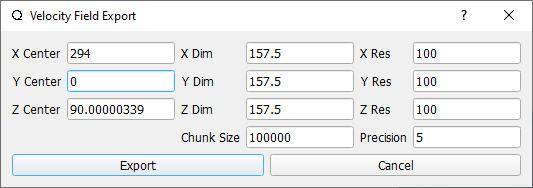
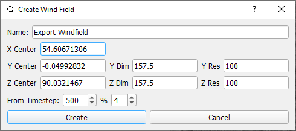
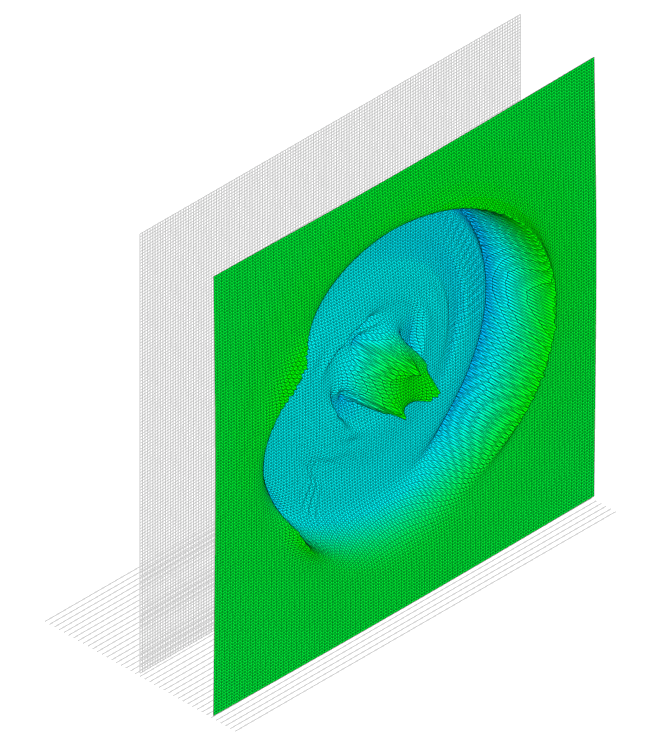
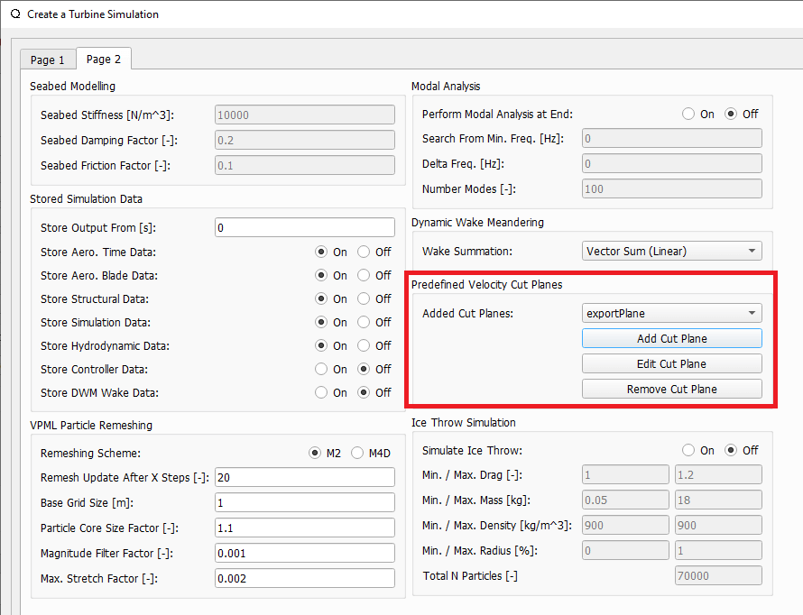

Velocity Cut-Planes 
===================

A velocity cut-plane can be used to extract velocity distributions from either a simulation if the wind turbine wake model is either the :ref:`Free Vortex Wake` model, or the :ref:`Dynamic Wake Meandering Model`.

.. _fig-wake_data:
.. figure:: wake_data.png
    :align: center
    :alt: Wake velocity distribution generated from a LLFVW simulation. 

    Wake velocity distribution generated from a LLFVW simulation. 

Generating Cut-Planes
*********************

In the Cut-Plane Dialog, found in the *Dock Window* of the *Turbine Simulation* module in QBlade (see :numref:`fig-cut_plane`), one or multiple cut planes can be generated by defining the plane center, its dimensions and orientation. If the *replay* (see :ref:`General Simulation Settings`) of a simulation has been stored it is also possible to automatically generate cut planes for each timestep of a simulation, after the simulation is finished, by choosing the *+ all next* option. The *% x* box allows to selectively only generate cut-planes when mod(timestep,x) = 0. The *from Timestep* box allows to choose the timestep from which the cut-planes should be generated. The checkbox *rotor fixed* allows to automatically rotate a cut plane definition with the current rotor position.

.. _fig-cut_plane:
.. figure:: cut_plane.png
   :align: center
   :alt: The cut-plane options dialog.

   The cut-plane options dialog.
   
Furthermore, the dialog allows to export three dimensional velocity fields, or to generate fully turbulent wind fields, sampled from a simulation. 
   
Export Velocity Fields
**********************

A three dimensional velocity field can be exported from a simulation by clicking the *Export Velocity Field* button in the Cut-Plane Dialog. The dimensions and locations of the box, as well as the resolution, can be specified in the *Velocity Field Dialog* see :numref:`fig-velocity_field_dialog`.

.. _fig-velocity_field_dialog:

   The Velocity Field Dialog
   
The parameter *Chunk Size* is used to partition the evaluation points and only send a size defined by this parameter to the GPU, to prevent memory issues on certain GPU models.

Create Wind Fields
******************

The main purpose to sample wind field is to record the *waked* inflow behind a wind turbine and use this data as a quick way to assess the influence of wake interaction in a simulation. The advantage is that the *waked* flow only has to be evaluated once and can then be used across any number of new simulations.

A wind field can be *sampled" from a simulation. The wind field size is defined by the parameters in the *Create Wind Field Dialog* (see :numref:`fig-windexport-field-dialog`), which is accessed by pressing the *create Wind Field* button in the *Cut Plane Dialog*. The plane in which the wind field is sampled is always oriented normal to the global x-direction. In the dialog the user can specify the field dimensions, its location and resolution. Furthermore, analogue to the cut-plane definition, the user can choose from which timestep the wind field should be sampled, and also apply a modulus to skip steps. 

.. _fig-windexport-field-dialog:

   The Create Wind Field Dialog

After a wind field has been generated from a simulation it appears in the object list of the wind field module and can be used in any simulation (see :numref:`fig-windexport-field`). 

.. _fig-windexport-field:

   A sampled wind field showing the wake deficit behind the rotor of a wind turbine
   
Cut-Plane Definitions
*********************   

It is also possible to export a cut-plane definition (see :numref:`fig-cut_plane_export`) to automate the cut-plane generation of a simulation, or to generate a cut-plane definition to be used for multiple simulations. A cut-plane definition can be either exported from the top menu (see :numref:`fig-cut_plane_export`, left) or from the cut-plane definition dialog itself (see :numref:`fig-cut_plane_export`, right).

.. _fig-cut_plane_export:
.. figure:: cut_plane_export.png
   :align: center
   :scale: 60%
   :alt: The cut-plane definition (.cut) export option.

   The cut-plane definition (.cut) export option.
   
An exemplary cut-plane definition file is shown below. The parameters in the cut-plane definition are analogue to the parameters in the cut-plane dialog.
   
.. code-block:: console
   	:caption: : An exemplary cut-plane definition file

	---------------------------------QBlade Cut Plane Definition File-------------------------------------
	Generated with : QBlade CE v2.0.7-release_candidate_beta windows
	Archive Format: 310023
	Time : 15:49:33
	Date : 08.05.2024

	----------------------------------------------Plane Description---------------------------------------
	exportPlane                             NAME                
	-5.000                                  XPOS                
	0.000                                   YPOS                
	90.000                                  ZPOS                

	0.000                                   XROT                
	0.000                                   YROT                
	0.000                                   ZROT                

	157.500                                 LENGTH              
	157.500                                 WIDTH               

	250                                     XRES                
	250                                     YRES                

	20000                                   TIMESTEP            

	false                                   ALLSTEPS            
	1                                       MODULUS             
	
Automated Evaluation of Cut-Planes
**********************************
Multiple cut-plane definitions can be predefined in the definition of a :ref:`Wind Turbine Simulation` object (see :numref:`fig-cut-plane-simulation-dialog`), before the simulation is evaluated. In this way it is possible to already define all cut-planes of interest at the start of a simulation. This feature also allows to generate cut-planes on-the-fly during a simulation even when the *Store Replay* option is not active. This can reduce the memory consumption drastically, especially for long simulations with finely resolved wakes. 

.. _fig-cut-plane-simulation-dialog:

   Assigning cut-plane predefinitions to a simulation object

.. footbibliography::

