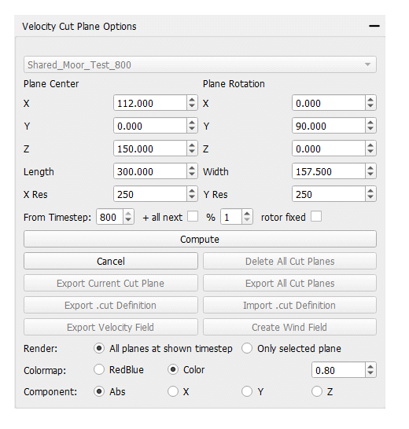
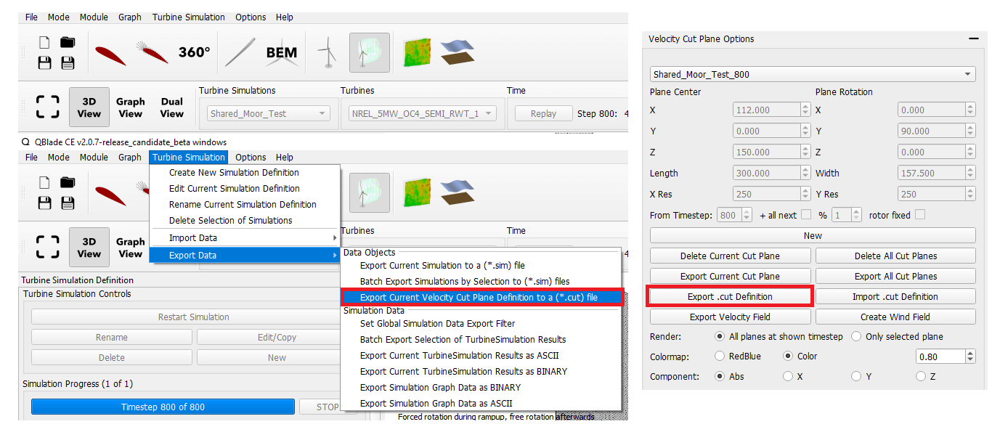

Extracting Wake Data with Cut-Planes
====================================

When a simulation of a :ref:`Wind Turbine Design` with a :ref:`Free Vortex Wake` has been performed it is possible to extract velocity distributions from the simulation.

.. _fig-wake_data:

    Wake velocity distribution generated from a LLFVW simulation. 

Velocities can either be calculated and visualized using a *Cut Plane Definition* or by exporting velocity data in a 3-dimensional field. The dialog to generate cut-planes or to export velocity fields is found in the *Dock Window* of the *Turbine Simulation* module in QBlade. If the dialog does not appear in the dock window it can be shown by selecting the option *Show Cut Plane Options in Dock* in the top menu (see :numref:`fig-cut_plane_menu`).

.. _fig-cut_plane_menu:
.. figure:: cut_plane_menu.png
    :align: center
    :scale: 60%
    :alt: The cut-plane option in the *Dock Options* menu of the *Simulation Module*. 

    The cut-plane option in the *Dock Options* menu of the *Simulation Module*. 
    
In the cut-plane dialog (see :numref:`fig-cut_plane`) one or multiple cut planes can be generated by defining the plane center, its dimensions and orientation. If the *replay* (see :ref:`General Simulation Settings`) of a simulation has been stored it is also possible to automatically generate cut planes for each timestep of a simulation by choosing the *+ all next* option. If the box *average* is ticked an average velocity field (averaged over all timesteps) is created for each cut plane definition. The checkbox *rotor fixed* allows to automatically rotate a cut plane definition with the current rotor position.

.. _fig-cut_plane:

   The cut-plane options dialog.
   
It is also possible to export a cut-plane definition (see :numref:`fig-cut_plane_export`) to facilitate the cut-plane generation in batch processing when using the :ref:`Command Line Interface (CLI)` or to generate a cut-plane for multiple simulations from the same definition.

.. _fig-cut_plane_export:

   The cut-plane export option.
   
An exemplary cut-plane definition file is shown below.
   
.. code-block:: console
   	:caption: : An exemplary cut-plane definition file

	---------------------------------QBlade Cut Plane Definition File-------------------------------------
	Generated with : QBlade EE v2.0.6.1_beta windows
	Archive Format: 310012
	Time : 17:14:48
	Date : 31.05.2023

	----------------------------------------------Data----------------------------------------------------
	112.097                                 XPOS                
	0.000                                   YPOS                
	150.195                                 ZPOS                

	0.000                                   XROT                
	90.000                                  YROT                
	0.000                                   ZROT                

	302.425                                 LENGTH              
	302.425                                 WIDTH               

	200                                     XRES                
	200                                     YRES                

	false                                   ALL                 
	false                                   AVERAGE             
	1                                       MODULUS             
	400                                     TIMESTEP     

	
.. footbibliography::

