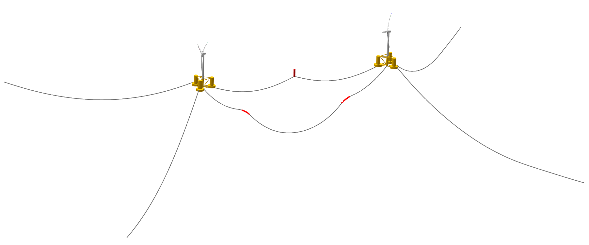

Multi Turbine Simulation Setup
==============================

.. admonition:: QBlade-EE

   This feature is only available in the Enterprise Edition of QBlade.
   
.. _fig-multi_turbines:
.. figure:: multi_turbines.png
   :align: center
   :alt: The multi turbine section in the simulation definition dialog.
   
   The multi-turbine section in the simulation definition dialog.

   
To define a simulation containing multiple turbines the user needs to activate the multiple turbines option in the simulation dialog (see :fig:'fig-multi_turbines`). After the option has been set to *On* turbines can be added to the simulation. 

Turbines can now be added manually, by clicking **Add**, or automated, through a **Wind Farm Layout File**. If added manually, thourgh the *Add** button, the currently selected turbine definition, with all parameters that are currently selected in the dialog, is then added to the list of turbines. 

If a **Wind Farm Layout File** is used turbines can be add automated. This is especially useful when simulating a very large number of turbines. An exemplary **Wind Farm layout File** is shown below. An Excel sheet, containing this data, can be downloaded `here <https://qblade.org/assets/LillgrundLayout.xlsx>`_.

.. _fig-lillgrund_layout_sheet:

   
   An excel sheet containing the farm layout data, link: https://qblade.org/assets/LillgrundLayout.xlsx.
    

.. code-block:: console
	:caption: : An exemplary turbine layout file for the Lillgrund wind farm

	Name	Turbine Object Name	X	Y	Z	RX	RY	RZ	Yaw	Pitch	Azimuth	Surge 	Sway	Heave	Plat.Roll	Plat.Pitch	Plat.Yaw	RPM	Prescribe Type	Substeps	RelaxSteps	Iterations	ModNewton	IsAero	IsHydro	Event	Loading	Sim	Motion
	Turb1	NREL_2.3-116	0.0	-675.4	0.0	0	0	0	-10	0	0	0	0	0	0	0	0	2	0	1	1	10	1	1	1	none	none	none	none
	Turb2	NREL_2.3-116	188.4	-1027.8	0.0	0	0	0	-10	0	0	0	0	0	0	0	0	2	0	1	1	10	1	1	1	none	none	none	none
	Turb3	NREL_2.3-116	377.0	-1365.9	0.0	0	0	0	-10	0	0	0	0	0	0	0	0	2	0	1	1	10	1	1	1	none	none	none	none
	Turb4	NREL_2.3-116	179.4	-4.0	0.0	0	0	0	-10	0	0	0	0	0	0	0	0	2	0	1	1	10	1	1	1	none	none	none	none
	Turb5	NREL_2.3-116	372.6	-342.1	0.0	0	0	0	-10	0	0	0	0	0	0	0	0	2	0	1	1	10	1	1	1	none	none	none	none
	Turb6	NREL_2.3-116	565.9	-680.2	0.0	0	0	0	-10	0	0	0	0	0	0	0	0	2	0	1	1	10	1	1	1	none	none	none	none
	Turb7	NREL_2.3-116	749.8	-1023.0	0.0	0	0	0	-10	0	0	0	0	0	0	0	0	2	0	1	1	10	1	1	1	none	none	none	none
	Turb8	NREL_2.3-116	938.4	-1370.6	0.0	0	0	0	-10	0	0	0	0	0	0	0	0	2	0	1	1	10	1	1	1	none	none	none	none
	Turb9	NREL_2.3-116	552.2	338.9	0.0	0	0	0	-10	0	0	0	0	0	0	0	0	2	0	1	1	10	1	1	1	none	none	none	none
	Turb10	NREL_2.3-116	745.5	5.6	0.0	0	0	0	-10	0	0	0	0	0	0	0	0	2	0	1	1	10	1	1	1	none	none	none	none
	Turb11	NREL_2.3-116	938.7	-337.3	0.0	0	0	0	-10	0	0	0	0	0	0	0	0	2	0	1	1	10	1	1	1	none	none	none	none
	Turb12	NREL_2.3-116	1131.9	-684.9	0.0	0	0	0	-10	0	0	0	0	0	0	0	0	2	0	1	1	10	1	1	1	none	none	none	none
	Turb13	NREL_2.3-116	1311.2	-1032.5	0.0	0	0	0	-10	0	0	0	0	0	0	0	0	2	0	1	1	10	1	1	1	none	none	none	none
	Turb14	NREL_2.3-116	1499.8	-1370.6	0.0	0	0	0	-10	0	0	0	0	0	0	0	0	2	0	1	1	10	1	1	1	none	none	none	none
	Turb15	NREL_2.3-116	934.3	681.7	0.0	0	0	0	-10	0	0	0	0	0	0	0	0	2	0	1	1	10	1	1	1	none	none	none	none
	Turb16	NREL_2.3-116	1122.9	343.7	0.0	0	0	0	-10	0	0	0	0	0	0	0	0	2	0	1	1	10	1	1	1	none	none	none	none
	Turb17	NREL_2.3-116	1311.5	0.8	0.0	0	0	0	-10	0	0	0	0	0	0	0	0	2	0	1	1	10	1	1	1	none	none	none	none
	Turb18	NREL_2.3-116	1877.3	-1023.0	0.0	0	0	0	-10	0	0	0	0	0	0	0	0	2	0	1	1	10	1	1	1	none	none	none	none
	Turb19	NREL_2.3-116	2065.9	-1370.6	0.0	0	0	0	-10	0	0	0	0	0	0	0	0	2	0	1	1	10	1	1	1	none	none	none	none
	Turb20	NREL_2.3-116	1311.8	1024.6	0.0	0	0	0	-10	0	0	0	0	0	0	0	0	2	0	1	1	10	1	1	1	none	none	none	none
	Turb21	NREL_2.3-116	1500.4	686.5	0.0	0	0	0	-10	0	0	0	0	0	0	0	0	2	0	1	1	10	1	1	1	none	none	none	none
	Turb22	NREL_2.3-116	1684.4	343.7	0.0	0	0	0	-10	0	0	0	0	0	0	0	0	2	0	1	1	10	1	1	1	none	none	none	none
	Turb23	NREL_2.3-116	1873.0	5.6	0.0	0	0	0	-10	0	0	0	0	0	0	0	0	2	0	1	1	10	1	1	1	none	none	none	none
	Turb24	NREL_2.3-116	2066.2	-346.8	0.0	0	0	0	-10	0	0	0	0	0	0	0	0	2	0	1	1	10	1	1	1	none	none	none	none
	Turb25	NREL_2.3-116	2250.2	-684.9	0.0	0	0	0	-10	0	0	0	0	0	0	0	0	2	0	1	1	10	1	1	1	none	none	none	none
	Turb26	NREL_2.3-116	2438.8	-1027.8	0.0	0	0	0	-10	0	0	0	0	0	0	0	0	2	0	1	1	10	1	1	1	none	none	none	none
	Turb27	NREL_2.3-116	2627.4	-1365.9	0.0	0	0	0	-10	0	0	0	0	0	0	0	0	2	0	1	1	10	1	1	1	none	none	none	none
	Turb28	NREL_2.3-116	1680.0	1367.5	0.0	0	0	0	-10	0	0	0	0	0	0	0	0	2	0	1	1	10	1	1	1	none	none	none	none
	Turb29	NREL_2.3-116	1873.3	1024.6	0.0	0	0	0	-10	0	0	0	0	0	0	0	0	2	0	1	1	10	1	1	1	none	none	none	none
	Turb30	NREL_2.3-116	2057.2	686.5	0.0	0	0	0	-10	0	0	0	0	0	0	0	0	2	0	1	1	10	1	1	1	none	none	none	none
	Turb31	NREL_2.3-116	2250.4	338.9	0.0	0	0	0	-10	0	0	0	0	0	0	0	0	2	0	1	1	10	1	1	1	none	none	none	none
	Turb32	NREL_2.3-116	2439.1	5.6	0.0	0	0	0	-10	0	0	0	0	0	0	0	0	2	0	1	1	10	1	1	1	none	none	none	none
	Turb33	NREL_2.3-116	2627.6	-346.8	0.0	0	0	0	-10	0	0	0	0	0	0	0	0	2	0	1	1	10	1	1	1	none	none	none	none
	Turb34	NREL_2.3-116	2816.3	-684.9	0.0	0	0	0	-10	0	0	0	0	0	0	0	0	2	0	1	1	10	1	1	1	none	none	none	none
	Turb35	NREL_2.3-116	3000.2	-1027.8	0.0	0	0	0	-10	0	0	0	0	0	0	0	0	2	0	1	1	10	1	1	1	none	none	none	none
	Turb36	NREL_2.3-116	2052.9	1710.3	0.0	0	0	0	-10	0	0	0	0	0	0	0	0	2	0	1	1	10	1	1	1	none	none	none	none
	Turb37	NREL_2.3-116	2246.1	1362.7	0.0	0	0	0	-10	0	0	0	0	0	0	0	0	2	0	1	1	10	1	1	1	none	none	none	none
	Turb38	NREL_2.3-116	2434.7	1029.4	0.0	0	0	0	-10	0	0	0	0	0	0	0	0	2	0	1	1	10	1	1	1	none	none	none	none
	Turb39	NREL_2.3-116	2627.9	681.7	0.0	0	0	0	-10	0	0	0	0	0	0	0	0	2	0	1	1	10	1	1	1	none	none	none	none
	Turb40	NREL_2.3-116	2811.9	338.9	0.0	0	0	0	-10	0	0	0	0	0	0	0	0	2	0	1	1	10	1	1	1	none	none	none	none
	Turb41	NREL_2.3-116	3005.2	5.6	0.0	0	0	0	-10	0	0	0	0	0	0	0	0	2	0	1	1	10	1	1	1	none	none	none	none
	Turb42	NREL_2.3-116	3189.1	-337.3	0.0	0	0	0	-10	0	0	0	0	0	0	0	0	2	0	1	1	10	1	1	1	none	none	none	none
	Turb43	NREL_2.3-116	3382.4	-680.2	0.0	0	0	0	-10	0	0	0	0	0	0	0	0	2	0	1	1	10	1	1	1	none	none	none	none
	Turb44	NREL_2.3-116	2435.0	2053.2	0.0	0	0	0	-10	0	0	0	0	0	0	0	0	2	0	1	1	10	1	1	1	none	none	none	none
	Turb45	NREL_2.3-116	2623.6	1705.6	0.0	0	0	0	-10	0	0	0	0	0	0	0	0	2	0	1	1	10	1	1	1	none	none	none	none
	Turb46	NREL_2.3-116	2807.6	1372.2	0.0	0	0	0	-10	0	0	0	0	0	0	0	0	2	0	1	1	10	1	1	1	none	none	none	none
	Turb47	NREL_2.3-116	3005.4	1029.4	0.0	0	0	0	-10	0	0	0	0	0	0	0	0	2	0	1	1	10	1	1	1	none	none	none	none
	Turb48	NREL_2.3-116	3170.7	667.5	0.0	0	0	0	-10	0	0	0	0	0	0	0	0	2	0	1	1	10	1	1	1	none	none	none	none

.. _fig-lillgrund_layout:

   
   The Wind Farm Layout loaded with the Lillgrund template, shown above

Furthermore, it is also possible to add a **global mooring system** to a multi turbine simulation. More information on this is found in the section :ref:`Multi Turbine Global Mooring System`.

Multi Turbine Global Mooring System
===================================

.. admonition:: QBlade-EE

   This feature is only available in the Enterprise Edition of QBlade.
   
.. _fig-global-mooring:

   
   A global mooring definition, connecting two turbines in a multi turbine simulation.

For multi-turbine simulations it is also possible to define a global mooring system. A global mooring system can be defined as an interconnection between different turbines (or floaters) in a multi-turbine simulation. In the example shown below a mooring system is defined that connects **Joint 43 of Turbine 1** (JNT_1_43) to **Joint 43 of Turbine 2** (JNT_2_43). In general, the global mooring system definition can contain a **MOORELEMENTS** table, a **MOORMEMBERS** table, and a **HYDROMEMBERCOEFF** table, following the same methodology as the mooring line definitions for turbine substructure.

Furthermore, it is also possible to include **SUBMEMBERS**, **SUBELEMENTS**, **SUBCONSTRAINTS** and  **NLSPRINGDAMPERS** and **MOORLOADS** in the same way as described in the section: :ref:`Creating a Substructure`.

Simulation Data from the Global Mooring System
----------------------------------------------

The simulation data that is stored from the global mooring system can be viewed in the *Simulation Time Graph*, see :ref:`Simulation Results & Data`.

The global mooring system definition file shown below is used to setup the mooring conficuration that is shown in :numref:`fig-global-mooring`.

.. code-block:: console
	:caption: : A global mooring system definition interconnecting two turbines.
	
	true	ISFLOATING								
	100	ADVANCEDBUOYANCY

	1.00	STIFFTUNER
	1.00	MASSTUNER				
	1.00	BUOYANCYTUNER

	SUBJOINTS
	JointID	JointX	JointY	JointZ
	1	0.00000	0.00000	-10.00000
	2	0.00000	0.00000	10.00000
	3	0.00000	0.00000	-13.00000

	SUBELEMENTSRIGID
	ElemID	BMASSD	DIAMETER
	1	10000	5.5
	2	100000	5.5

	HYDROJOINTCOEFF
	CoeffID	JointID	CdA	CaA	CpA																	
	1	2	4.8	1.0	1.0
	2	3	4.8	1.0	1.0

	SUBMEMBERS
	MemID	Jnt1ID	Jnt2ID	ElmID	ElmRot	HyCoID	IsBuoy	MaGrID	FldArea	ElmDsc	Name	(optional)
	1	1	2	1	0	1	1	0	0	2	Main_Colum
	2	1	3	2	0	1	1	0	0	2	Main_Column2									

	HYDROMEMBERCOEFF
	CoeffID	CdN	CaN	CpN	MCFC
	1	2.0	0.8	1.0	0

	MOORELEMENTS
	ID	Dens.[kg/m^3]	Area[m^2]	Iyy[m^4]	EMod[N/m^4]	RDp.[-]	Dia[m]	
	1	2.35723E+04	4.6084E-03	3.7601E-03	1.6353E+11	0.015	0.0766	
	2	6.35723E+04	4.6084E-03	3.7601E-04	1.6353E+10	0.005	0.0766

	MOORMEMBERS
	ID	CONN_1		CONN_2	Len.[m]	MoorID	HyCoID	IsBuoy	MaGrID	ElmDsc	Name
	1	JNT_1_43	JNT_3	270	1	1	1	0	30	Mooring1
	2	JNT_2_43	JNT_3	270	1	1	1	0	30	Mooring2
	3	JNT_1_1		JNT_2_1	700	2	1	1	0	30	Power

	MOORLOADS
	3	150	180	16000
	3	520	550	16000

	RGBCOLOR
	255	0	0

	-------------------------------	DATA OUTPUT TYPES -------------------------					
	true	FOR_OUT	
	true	ROT_OUT
	true	MOM_OUT
	true	DEF_OUT	
	true	POS_OUT
	true	VEL_OUT	
	true	ACC_OUT
	true	LVE_OUT
	true	LAC_OUT

	-------------------------------	SENSORS	------------------------------------					
	SUB_1_0.5
	MOO_1_0.2
	
Multi Turbine Simulation Definition ASCII File
==============================================
	
Within the *Simulation Definition ASCII Files* a multi-turbine simulation can be defined in two ways. The first option is to specify the path to the **Farm Layout File** (parameter *FARMLAYOUT*). In the farm layout file the turbine definitions and boundary conditions are defined.

The second options is is to defined multiple turbines by encapsulating each turbine object by *TURB_X* and *END_TURB_X* where *X* is the turbine number staring from 1. An example for a multi turbine simulation definition ASCII file that also contains a global mooring system is shown below.

.. code-block:: console
	:caption: : A multi turbine simulation definition file using a farm layout file
	
	----------------------------------------QBlade Simulation Definition File------------------------------------------
	Generated with : QBlade IH v2.0.7-release_candidate_beta windows
	Archive Format: 310023
	Time : 21:43:28
	Date : 15.05.2024

	----------------------------------------Object Name-----------------------------------------------------------------
	New_Turbine_Simulation                   OBJECTNAME         - the name of the simulation object

	----------------------------------------Simulation Type-------------------------------------------------------------
	0                                        ISOFFSHORE         - use a number: 0 = onshore; 1 = offshore

	----------------------------------------Turbine Parameters---------------------------------------------------------
	NREL_2.3-116/NREL_2.3-116.trb            TURBFILE           - the turbine definition file(s) used in this simulation
	farmLayout.xlsx                          FARMLAYOUT         - the farmlayout file (if existing)

	----------------------------------------Simulation Settings-------------------------------------------------------
	0.025366                                 TIMESTEP           - the timestep size in [s]
	1000                                     NUMTIMESTEPS       - the number of timesteps
	20.000                                   RAMPUP             - the rampup time for the structural model
	0.000                                    ADDDAMP            - the initial time with additional damping
	50.000                                   ADDDAMPFACTOR      - for the additional damping time this factor is used to increase the damping of all components
	0.000                                    WAKEINTERACTION    - in case of multi-turbine simulation the wake interaction start at? [s]

	----------------------------------------Wind Input-----------------------------------------------------------------
	0                                        WNDTYPE            - use a number: 0 = steady; 1 = windfield; 2 = hubheight
						 WNDNAME            - filename of the turbsim input file, mann input file or hubheight file (with extension), leave blank if unused
	0                                        STITCHINGTYPE      - the windfield stitching type; 0 = periodic; 1 = mirror
	true                                     WINDAUTOSHIFT      - the windfield shifting automatically based on rotor diameter [bool]
	0.00                                     SHIFTTIME          - the windfield is shifted by this time if WINDAUTOSHIFT = 0
	10.00                                    MEANINF            - the mean inflow velocity, overridden if a windfield or hubheight file is use
	0.00                                     HORANGLE           - the horizontal inflow angle
	0.00                                     VERTANGLE          - the vertical inflow angle
	0                                        PROFILETYPE        - the type of wind profile used (0 = Power Law; 1 = Logarithmic)
	0.000                                    SHEAREXP           - the shear exponent if using a power law profile, if a windfield is used these values are used to calculate the mean wake convection velocities
	0.010                                    ROUGHLENGTH        - the roughness length if using a log profile, if a windfield is used these values are used to calculate the mean wake convection velocities
	0.00                                     DIRSHEAR           - a value for the directional shear in deg/m
	78.00                                    REFHEIGHT          - the reference height, used to construct the BL profile

	----------------------------------------Ocean Depth, Waves and Currents------------------------------------------- 
	the following parameters only need to be set if ISOFFSHORE = 1
	1.00                                     WATERDEPTH         - the water depth
						 WAVEFILE           - the path to the wave file, leave blank if unused
	1                                        WAVESTRETCHING     - the type of wavestretching, 0 = vertical, 1 = wheeler, 2 = extrapolation, 3 = none
	10000.00                                 SEABEDSTIFF        - the vertical seabed stiffness [N/m^3]
	0.20                                     SEABEDDAMP         - a damping factor for the vertical seabed stiffness evaluation, between 0 and 1 [-]
	0.10                                     SEABEDSHEAR        - a factor for the evaluation of shear forces (friction), between 0 and 1 [-]
	0.00                                     SURF_CURR_U        - near surface current velocity [m/s]
	0.00                                     SURF_CURR_DIR      - near surface current direction [deg]
	30.00                                    SURF_CURR_DEPTH    - near surface current depth [m]
	0.00                                     SUB_CURR_U         - sub surface current velocity [m/s]
	0.00                                     SUB_CURR_DIR       - sub surface current direction [deg]
	0.14                                     SUB_CURR_EXP       - sub surface current exponent
	0.00                                     SHORE_CURR_U       - near shore (constant) current velocity [m/s]
	0.00                                     SHORE_CURR_DIR     - near shore (constant) current direction [deg]

	----------------------------------------Global Mooring System------------------------------------------------------
						 MOORINGSYSTEM      - the path to the global mooring system file, leave blank if unused

	----------------------------------------Dynamic Wake Meandering----------------------------------------------------
	2                                        DWMSUMTYPE         - the dynamic wake meandering wake summation type: 0 = DOMINANT; 1 = QUADRATIC; 2 = LINEAR

	----------------------------------------Environmental Parameters---------------------------------------------------
	1.22500                                  DENSITYAIR         - the air density [kg/m^3]
	0.000016470                              VISCOSITYAIR       - the air kinematic viscosity 
	1025.00000                               DENSITYWATER       - the water density [kg/m^3]
	0.000001307                              VISCOSITYWATER     - the water kinematic viscosity [m^2/s]
	9.806650000                              GRAVITY            - the gravity constant [m/s^2]

	----------------------------------------Output Parameters----------------------------------------------------------
	0.00000                                  STOREFROM          - the simulation stores data from this point in time, in [s]
	false                                    STOREREPLAY        - store a replay of the simulation (warning, large memory will be required) [bool]
	true                                     STOREAERO          - should the aerodynamic data be stored [bool]
	true                                     STOREBLADE         - should the local aerodynamic blade data be stored [bool]
	true                                     STORESTRUCT        - should the structural data be stored [bool]
	true                                     STORESIM           - should the simulation (performance) data be stored [bool]
	true                                     STOREHYDRO         - should the controller data be stored [bool]
	false                                    STORECONTROLLER    - should the controller data be stored [bool]
	false                                    STOREDWM           - should the dynamic wake meandering (DWM) data be stored [bool]

	----------------------------------------Modal Analysis Parameters--------------------------------------------------
	false                                    CALCMODAL          - perform a modal analysis (only single turbine simulations) [bool]
	0.00000                                  MINFREQ            - store Eigenvalues, starting with this frequency
	0.00000                                  DELTAFREQ          - omit Eigenvalues that are closer spaced than this value
	100.00000                                NUMFREQ            - set the number of Eigenmodes and Eigenvalues that will be stored

.. code-block:: console
	:caption: : A multi turbine simulation definition file using explicit, encapsulated, turbine definitions

	----------------------------------------QBlade Simulation Definition File------------------------------------------
	Generated with : QBlade IH v2.0.6_beta_dev windows
	Archive Format: 310012
	Time : 19:16:58
	Date : 18.05.2023

	----------------------------------------Object Name-----------------------------------------------------------------
	New_Turbine_Simulation                   OBJECTNAME         - the name of the simulation object

	----------------------------------------Simulation Type-------------------------------------------------------------
	1                                        ISOFFSHORE         - use a number: 0 = onshore; 1 = offshore

	----------------------------------------Turbine Parameters---------------------------------------------------------
	multiple turbines can be added by adding multiple definitions encapsulated with TURB_X and END_TURB_X, where X must start at 1

	TURB_1
	    NREL_5MW_OC4_SEMI_RWT/NREL_5MW_OC4_SEMI_RWT.trb TURBFILE           - the turbine definition file that is used for this simulation
	    NREL_5MW_OC4_SEMI_RWT                TURBNAME           - the (unique) name of the turbine in the simulation (results will appear under this name)
	    0.00                                 INITIAL_YAW        - the initial turbine yaw in [deg]
	    0.00                                 INITIAL_PITCH      - the initial collective blade pitch in [deg]
	    0.00                                 INITIAL_AZIMUTH    - the initial azimuthal rotor angle in [deg]
	    1                                    STRSUBSTEP         - the number of structural substeps per timestep (usually 1)
	    5                                    RELAXSTEPS         - the number of initial static structural relaxation steps
	    0                                    PRESCRIBETYPE      - rotor RPM prescribe type (0 = ramp-up; 1 = whole sim; 2 = no RPM prescibed) 
	    4.000                                RPMPRESCRIBED      - the prescribed rotor RPM [-]
	    10                                   STRITERATIONS      - number of iterations for the time integration (used when integrator is HHT or Euler)
	    1                                    MODNEWTONITER      - use the modified newton iteration?
	    300.00                               GLOBPOS_X          - the global x-position of the turbine [m]
	    0.00                                 GLOBPOS_Y          - the global y-position of the turbine [m]
	    0.00                                 GLOBPOS_Z          - the global z-position of the turbine [m]
	    0.00                                 GLOBROT_X          - the global x-rotation of the turbine [deg]
	    0.00                                 GLOBROT_Y          - the global y-rotation of the turbine [deg]
	    0.00                                 GLOBROT_Z          - the global z-rotation of the turbine [deg]
						 EVENTFILE          - the file containing fault event definitions (leave blank if unused)
						 LOADINGFILE        - the loading file name (leave blank if unused)
						 SIMFILE            - the simulation file name (leave blank if unused)
						 MOTIONFILE         - the prescribed motion file name (leave blank if unused)
	    0.00                                 FLOAT_SURGE        - the initial floater surge [m]
	    0.00                                 FLOAT_SWAY         - the initial floater sway [m]
	    0.00                                 FLOAT_HEAVE        - the initial floater heave [m]
	    0.00                                 FLOAT_ROLL         - the initial floater roll [deg]
	    0.00                                 FLOAT_PITCH        - the initial floater pitch [deg]
	    0.00                                 FLOAT_YAW          - the initial floater yaw [deg]
	END_TURB_1

	TURB_2
	    NREL_5MW_OC4_SEMI_RWT-2/NREL_5MW_OC4_SEMI_RWT-2.trb TURBFILE           - the turbine definition file that is used for this simulation
	    NREL_5MW_OC4_SEMI_RWT-2              TURBNAME           - the (unique) name of the turbine in the simulation (results will appear under this name)
	    180.00                               INITIAL_YAW        - the initial turbine yaw in [deg]
	    0.00                                 INITIAL_PITCH      - the initial collective blade pitch in [deg]
	    0.00                                 INITIAL_AZIMUTH    - the initial azimuthal rotor angle in [deg]
	    1                                    STRSUBSTEP         - the number of structural substeps per timestep (usually 1)
	    5                                    RELAXSTEPS         - the number of initial static structural relaxation steps
	    0                                    PRESCRIBETYPE      - rotor RPM prescribe type (0 = ramp-up; 1 = whole sim; 2 = no RPM prescribed) 
	    4.000                                RPMPRESCRIBED      - the prescribed rotor RPM [-]
	    10                                   STRITERATIONS      - number of iterations for the time integration (used when integrator is HHT or Euler)
	    1                                    MODNEWTONITER      - use the modified newton iteration?
	    -300.00                              GLOBPOS_X          - the global x-position of the turbine [m]
	    0.00                                 GLOBPOS_Y          - the global y-position of the turbine [m]
	    0.00                                 GLOBPOS_Z          - the global z-position of the turbine [m]
	    0.00                                 GLOBROT_X          - the global x-rotation of the turbine [deg]
	    0.00                                 GLOBROT_Y          - the global y-rotation of the turbine [deg]
	    0.00                                 GLOBROT_Z          - the global z-rotation of the turbine [deg]
						 EVENTFILE          - the file containing fault event definitions (leave blank if unused)
						 LOADINGFILE        - the loading file name (leave blank if unused)
						 SIMFILE            - the simulation file name (leave blank if unused)
						 MOTIONFILE         - the prescribed motion file name (leave blank if unused)
	    0.00                                 FLOAT_SURGE        - the initial floater surge [m]
	    0.00                                 FLOAT_SWAY         - the initial floater sway [m]
	    0.00                                 FLOAT_HEAVE        - the initial floater heave [m]
	    0.00                                 FLOAT_ROLL         - the initial floater roll [deg]
	    0.00                                 FLOAT_PITCH        - the initial floater pitch [deg]
	    180.00                               FLOAT_YAW          - the initial floater yaw [deg]
	END_TURB_2

	----------------------------------------Simulation Settings-------------------------------------------------------
	0.050000                                 TIMESTEP           - the timestep size in [s]
	800                                      NUMTIMESTEPS       - the number of timesteps
	20.000                                   RAMPUP             - the rampup time for the structural model
	0.000                                    ADDDAMP            - the initial time with additional damping
	100.000                                  ADDDAMPFACTOR      - for the additional damping time this factor is used to increase the damping of all components
	0.000                                    WAKEINTERACTION    - in case of multi-turbine simulation the wake interaction start at? [s]

	----------------------------------------Wind Input-----------------------------------------------------------------
	0                                        WNDTYPE            - use a number: 0 = steady; 1 = windfield; 2 = hubheight
						 WNDNAME            - filename of the turbsim input file or hubheight file (with extension), leave blank if unused
	0                                        STITCHINGTYPE      - the windfield stitching type; 0 = periodic; 1 = mirror
	1                                        WINDAUTOSHIFT      - the windfield shifting automatically based on rotor diameter; 0 = false; 1 = true
	0.00                                     SHIFTTIME          - the windfield is shifted by this time if WINDAUTOSHIFT = 0
	10.00                                    MEANINF            - the mean inflow velocity, overridden if a windfield or hubheight file is use
	0.00                                     HORANGLE           - the horizontal inflow angle
	0.00                                     VERTANGLE          - the vertical inflow angle
	0                                        PROFILETYPE        - the type of wind profile used (0 = Power Law; 1 = Logarithmic)
	0.000                                    SHEAREXP           - the shear exponent if using a power law profile, if a windfield is used these values are used to calculate the mean wake convection velocities
	0.010                                    ROUGHLENGTH        - the roughness length if using a log profile, if a windfield is used these values are used to calculate the mean wake convection velocities
	0.00                                     DIRSHEAR           - a value for the directional shear in deg/m
	77.60                                    REFHEIGHT          - the reference height, used to contruct the BL profile

	----------------------------------------Ocean Depth, Waves and Currents------------------------------------------- 
	the following parameters only need to be set if ISOFFSHORE = 1
	200.00                                   WATERDEPTH         - the water depth
	New_Wave.lwa                             WAVEFILE           - the path to the wave file, leave blank if unused
	1                                        WAVESTRETCHING     - the type of wave stretching, 0 = vertical, 1 = wheeler, 2 = extrapolation, 3 = none
	10000.00                                 SEABEDSTIFF        - the vertical seabed stiffness [N/m^3]
	0.50                                     SEABEDDAMP         - a damping factor for the vertical seabed stiffness evaluation, between 0 and 1 [-]
	0.00                                     SEABEDSHEAR        - a factor for the evaluation of shear forces (friction), between 0 and 1 [-]
	0.00                                     SURF_CURR_U        - near surface current velocity [m/s]
	0.00                                     SURF_CURR_DIR      - near surface current direction [deg]
	30.00                                    SURF_CURR_DEPTH    - near surface current depth [m]
	0.00                                     SUB_CURR_U         - sub surface current velocity [m/s]
	0.00                                     SUB_CURR_DIR       - sub surface current direction [deg]
	0.14                                     SUB_CURR_EXP       - sub surface current exponent
	0.00                                     SHORE_CURR_U       - near shore (constant) current velocity [m/s]
	0.00                                     SHORE_CURR_DIR     - near shore (constant) current direction [deg]

	----------------------------------------Global Mooring System------------------------------------------------------
	mooring.txt                              MOORINGSYSTEM      - the path to the global mooring system file, leave blank if unused

	----------------------------------------Environmental Parameters---------------------------------------------------
	1.22500                                  DENSITYAIR         - the air density [kg/m^3]
	0.000016470                              VISCOSITYAIR       - the air kinematic viscosity 
	1025.00000                               DENSITYWATER       - the water density [kg/m^3]
	0.000001307                              VISCOSITYWATER     - the water kinematic viscosity [m^2/s]
	9.806650000                              GRAVITY            - the gravity constant [m/s^2]

	----------------------------------------Output Parameters----------------------------------------------------------
	0                                        STOREREPLAY        - store a replay of the simulation: 0 = off, 1 = on (warning, large memory will be required)
	20.000                                   STOREFROM          - the simulation stores data from this point in time, in [s]
	1                                        STOREAERO          - should the aerodynamic data be stored (0 = OFF; 1 = ON)
	0                                        STOREBLADE         - should the local aerodynamic blade data be stored (0 = OFF; 1 = ON)
	1                                        STORESTRUCT        - should the structural data be stored (0 = OFF; 1 = ON)
	1                                        STORESIM           - should the simulation (performance) data be stored (0 = OFF; 1 = ON)
	1                                        STOREHYDRO         - should the controller data be stored (0 = OFF; 1 = ON)
	0                                        STORECONTROLLER    - should the controller data be stored (0 = OFF; 1 = ON)
	----------------------------------------Modal Analysis Parameters--------------------------------------------------
	0                                        CALCMODAL          - perform a modal analysis after the simulation has completed (only for single turbine simulations)
	0.00000                                  MINFREQ            - store Eigenvalues, starting with this frequency
	0.00000                                  DELTAFREQ          - omit Eigenvalues that are closer spaced than this value
	
.. footbibliography::