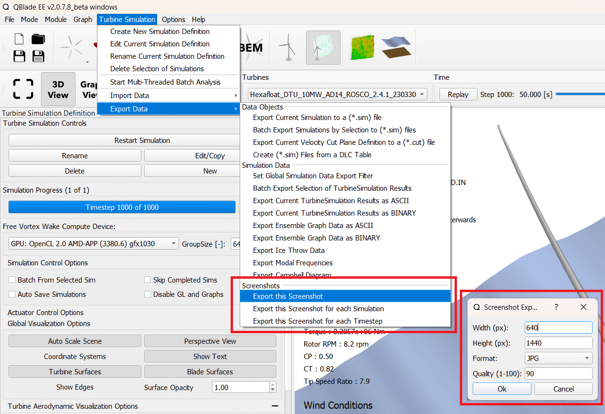

Generating Renderings & Screenshots
###################################

High-quality renderings can be generated from wind turbine models in QBlade. Additionally, high-quality videos can be created from simulations. Screenshots can be generated in three distinct ways:

- **Export this Screenshot**: Exports the currently displayed GL View.
- **Export this Screenshot for each Turbine**: Exports the current GL View for every turbine in the database (Turbine Design Module).
- **Export this Screenshot for each Simulation**: Exports the current GL View for every simulation in the database (Simulation Module).
- **Export this Screenshot for each Timestep**: Exports a screenshot for each timestep of the currently selected simulation.

.. _fig-screenshot_export:

   The screenshot export dialog.

To select an export option, navigate to the *Turbine Simulation Menu* or the *Turbine Design Menu*, as shown in :numref:`fig-screenshot_export`. After choosing an option, a dialog box will appear, allowing you to configure:

- Desired output resolution
- Image format (``.jpg``, ``.png``, or ``.bmp``)
- Quality level

Generating Videos
-----------------

Videos can be created by exporting screenshots for each timestep of a simulation. To enable this functionality, the "**Store Replay**" option must be activated (see :ref:`General Simulation Settings`). Once screenshots are created for each timestep, you can use a tool such as **FFmpeg** (https://www.ffmpeg.org/) to combine them into a video.

**Example FFmpeg Command**

An example command for generating a video from a folder of screenshots is:

.. code-block:: bash

	ffmpeg -framerate 30 -i folder/image_%d.png -c:v libx264 -pix_fmt yuv420p output.mp4

- ``folder/image_%d.png``: Specifies the folder containing screenshots named sequentially, such as ``image_1.png``, ``image_2.png``, ``image_3.png``, etc.
- ``-framerate 30``: Sets the frame rate of the output video to 30 frames per second.
- ``-c:v libx264``: Uses the H.264 codec for video compression.
- ``-pix_fmt yuv420p``: Ensures compatibility with most video players.
- ``output.mp4``: Specifies the name of the output video file.