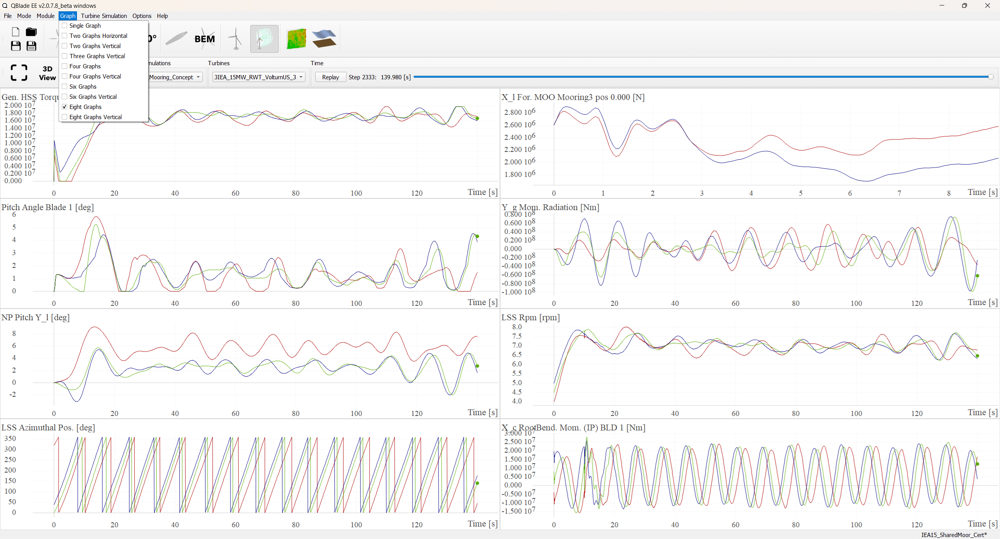
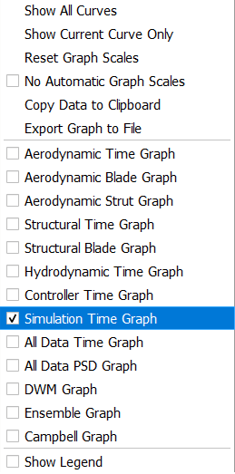

Simulation Results & Data
#########################

.. _fig-sim-results:

    
    Simulation results in live view.

Live Results View
-----------------

During the evaluation of a simulation, the live data generated can already be investigated by the user in the GUI (see :numref:`fig-sim-results`). The graph view can be configured to display between 2 and 8 graphs simultaneously. Each graph displayed in QBlade's GUI can be set to a *graph type* of choice.

The available graph types for QBlade time-domain simulations are:

- **Aerodynamic Time Graph**: Displays aerodynamic results plotted over time.
- **Aerodynamic Blade Graph**: Displays aerodynamic results plotted over the blade at the current timestep.
- **Aerodynamic Strut Graph**: Displays aerodynamic results plotted over the strut at the current timestep.
- **Structural Time Graph**: Displays structural results plotted over time.
- **Structural Blade Graph**: Displays structural results plotted over the structural bodies at the current timestep.
- **Hydrodynamic Time Graph**: Displays hydrodynamic results plotted over time.
- **Controller Time Graph**: Displays the contents of the controller swap array, plotted over time.
- **Simulation Time Graph**: Displays global simulation results and performance metrics, plotted over time. This graph also contains the time domain data of the global mooring system.
- **All Data Time Graph**: Displays all results that are a function of time.
- **All Data PSD Graph**: Displays all results as a function of frequency (performs a DFT for each plotted timeseries).
- **DWM Graph**: Displays results from the Dynamic Wake Meandering model.
- **Ensemble Graph**: Displays aggregated ensemble results spanning a range of simulations.
- **Campbell Graph**: Displays model frequencies and damping ratios over a range of simulations.

.. _fig-graph-context:

    
    The graph context menu, opened by right-clicking on a graph.
