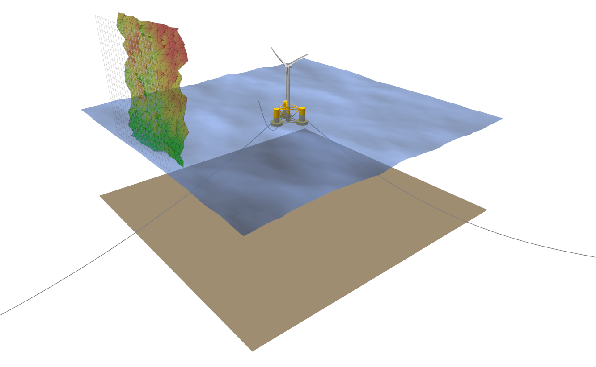
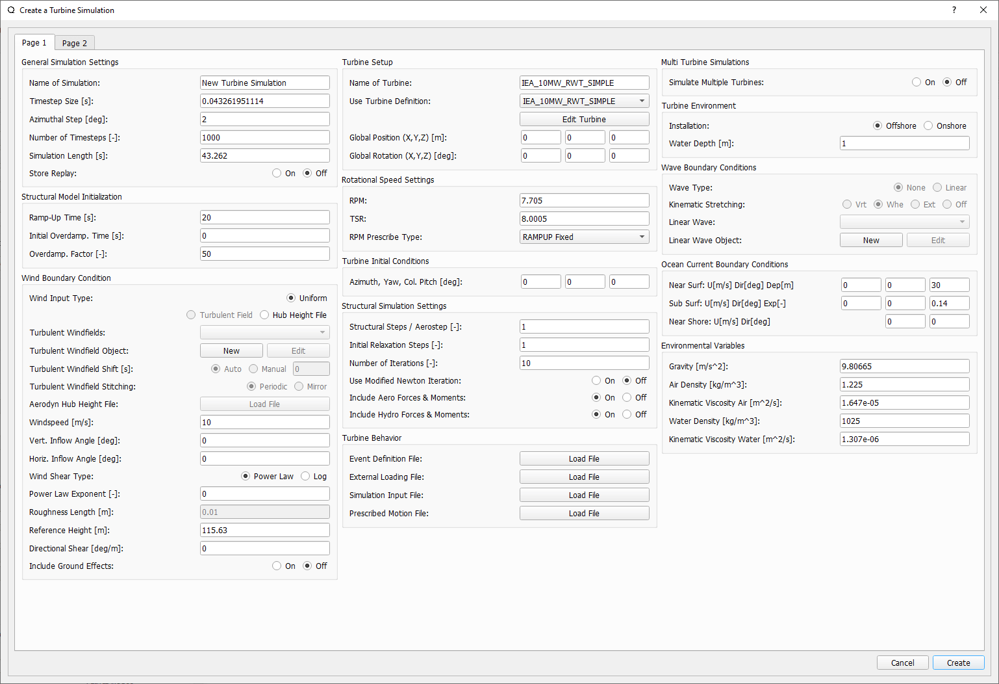
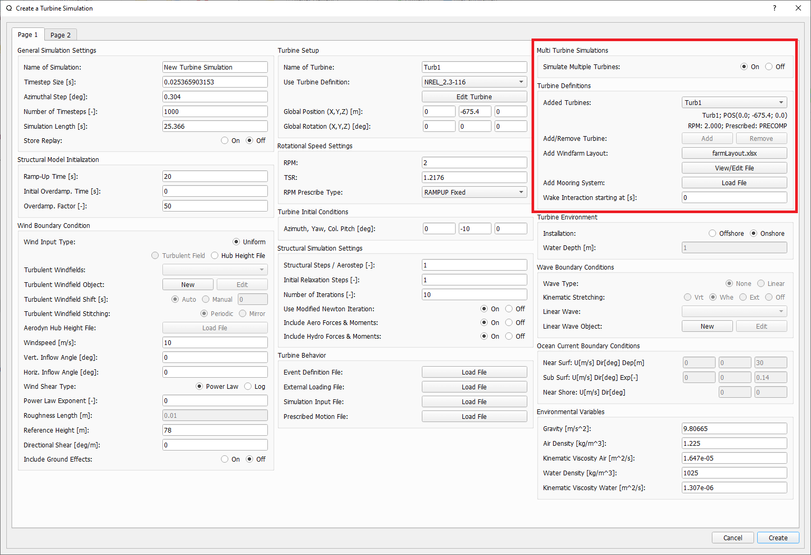
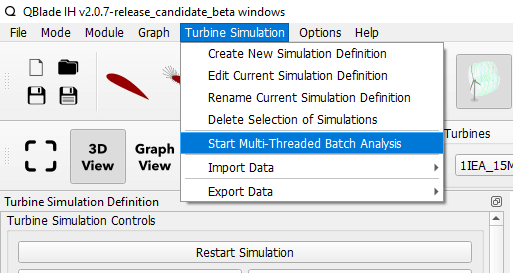

Simulation Module Overview
==========================

.. _fig-simulation-module:

    The simulation module symbol in the QBlade main tool bar. 

.. _fig-simulation:

   Visualization of an aero-hydro-servo-elastic simulation in QBlade.
   
To define a simulation of a turbine object several simulation parameters and boundary conditions need to be defined. The following list gives an overview:

* Simulation length & time step size
* Structural solver
* Wind boundary conditions
* Wave & current boundary conditions
* Environmental parameters: density, gravity, etc.

Simulations can either be defined through the turbine simulation dialog, or directly by creating or modifying simulation definition (``.sim``) files.

Simulation Definition Dialog
============================

Setting up a simulation in QBlade is handled through the dialog shown below:

.. _fig-sim_dialog1:

   Page 1 of the simulation definition dialog (click to enlarge).
   
.. _fig-sim_dialog2:

   Page 2 of the simulation definition dialog (click to enlarge).
   
Below, an overview of the different dialog sections and each editable parameters is given. If you are looking for a specific parameter from the dialog it is suggested to use the search function of the documentation to find it quickly. Also note that each of the parameters described in the following has an equivalent keyword within the :ref:`Simulation Definition ASCII File`.
   
General Simulation Settings
---------------------------

* **Name of Simulation**: A unique name to identify the simulation object
* **Timestep Size / Azimuthal Step**: Both values are interconnected through the turbine **RPM** setting
* **Number of Timesteps / Simulation Length**: Both values are interconnected through the **TimestepSize** setting
* **Store Replay**: A replay of the simulation is created by storing all position and wake data for every timestep. 

Structural Model Initialization
-------------------------------

These field are only editable if the selected turbine object has a structural model definition.

* **Ramp-Up Time**: The (structural) simulation is ramped-up over the specified time. This part of the simulation does not generate data and is not stored.
* **Initial Overdamp. Time**: For the specified time the model Rayleigh damping is increased by the factor **Overdamp. Factor**. If the value is 0 the *overdamping* is active during ramp-up, any negative value disables *overdamping* of the model.
* **Overdamp. Factor**: During the *overdamping* time all model damping values are increased by this factor.

Wind Boundary Condition
-----------------------

* **Wind Input Type**: Sets the wind input type. Options are :ref:`Uniform Wind Field`, :ref:`Turbulent Wind Field` and :ref:`Hub Height File`.
* **Turbulent Windfields**: In this *ComboBox* all Windfields that are stored in the database are listed.
* **Turbulent Windfield Object**: These buttons allow to generate a new Windfield or to edit an existing one.
* **Turbulent Windfield Shift**: The currently selected Windfield may be shifted in time (to start at another time than t=0s), if *Auto* is chosen the Windfield is shifted by the rotor diameter divided by the mean freestream velocity to fully immerse the rotor at the start of a simulation..
* **Turbulent Windfield Stitching**: If the simulation time is larger than the Windfield length the Windfield is either repeated (*Periodic*) or mirrored (*Mirror*) at the end of its timeseries.
* **Aerodyn Hub Height File**: This enables to load a hub height file from the file system to be assigned to this simulation.
* **Windspeed**: Set the windspeed if **Wind Input Type** is set to *Uniform*.
* **Vert. Inflow Angle**: Set the vertical inflow angle if **Wind Input Type** is either *Uniform* or *Turbulent Field*.
* **Horiz. Inflow Angle**: Set the horizontal inflow angle if **Wind Input Type** is either *Uniform* or *Turbulent Field*.
* **Wind Shear Type**: Set the windshear type if the wind input type is *Uniform* or the turbulent windfield is imported.
* **Power Law Exponent**: Set the Coefficient for a **Power Law** wind profile.
* **Roughness Length**: Set the **Roughness Length** for a *Log* Profile..
* **Reference Height**: Set the **Reference Height** for the wind profiles.
* **Directional Shear**: Set a directional shear. The shear is assumed to be 0.0 at the **Reference Height**.
* **Include Ground Effects**: Interludes the modelling of **Ground Effects**, see :ref:`Ground Effect`.

Turbine Setup
-------------

* **Name of Turbine**: Define a name for the turbine simulation object.
* **Use Turbine Definition**: Use the selected *turbine definition* object from the data base in this simulation object.
* **Global Position (X,Y,Z)**: Set the global position of the wind turbine for this simulation.
* **Global Rotation (X,Y,Z)**: Set the global rotation of the wind turbine for this simulation. In the case of a floating turbine being simulated the global rotation also rotates the mooring line connections to the ground.

Rotational Speed Settings
-------------------------

* **RPM / TSR**: Both values are interconnected through the rotor size and current windspeed.

The following options are related to the RPM control for this simulation. For *turbine definition* object without a structural definition the *RPM* is always constant if no **Simulation Input File** is defined. For *turbine definition* objects with a structural definition the following options are avaliable:

* **Ramp-Up Fixed**: The *RPM* is fixed only during the ramp-up time of the simulation so that when the simulation starts the rotor is operating at the chosen RPM. During the simulation time the rotor rotation is governed by the balance of aerodynamic- and generator torque. This is the recommended setting for simulations that contain a *Controller*.
* **Always Fixed**: The *RPM* is fixed for the total duration of the simulation to the chosen *RPM*.
* **Free**: For *ramp-up* and simulation time the rotor rotation is governed by the balance of aerodynamic- and generator torque. 

Turbine Initial Conditions
--------------------------

* **Azimuth, Yaw, Col. Pitch**: Sets the initial azimuthal rotor angle, yaw angle and collective pitch angle for the simulation.

Floater Initial Conditions
--------------------------
These edits are only enabled if a wind turbine with a floating substructure is simulated. The initial floater conditions can be used to setup decay tests for specific DOF's or to place the floater closer to its final equilibrium position to speed-up initial transients.

* **X, Y, Z Translation**: Sets the initial displacement for the floater.
* **Roll, Pitch, Yaw**: Sets the initial rotation of the floater.

Structural Simulation Settings
------------------------------

* **Structural Steps / Aerostep**: Sets how many structural steps will be evaluated per global timestep. If multiple structural steps are evaluated per global timestep the aerodynamic loading is assumed to be constant.
* **Initial Relaxation Steps**: An initial iterative relaxation is performed, taking into account only gravitational forces.
* **Number of Iterations**: Set the number of iterations for the *iterative* time steppers, such as the **HHT**.
* **Include Aero Forces & Moments**: Toggles if aerodynamic forces are projected onto  the structural model definition.
* **Include Hydro Forces & Moments**: Toggles if hydrodynamic forces are projected onto  the structural model definition.

Turbine Behavior
----------------

In this section special events, external loading, prescribed motion and prescribed operation can be defined for a *turbine definition*. Below exemplary files are shown for each file type:

* **Event Definition File**: An event is defined by a combination of *Keywords* and values. The following list gives an overview of the available event types. Events can only be defined if the turbine definition has a structural definition. Multiple events may be defined in a single file. The events override any events / control that is returned via the controller exchange array:

	* **30 FAILGRID**: At time 30 s, the generator moment is set to 0 Nm.
	* **30 SETBRAKE**: At time 30 s, the brake is engaged.
	* **30 1.5 FAILPITCH_1**: At time 30 s, the pitch rate of blade nr. 1 is set to a maximum rate of 1.5 deg/s
	* **30 90 1.5 PITCHTO**: At time 30 s, the collective pitch rate is set to 1.5deg/s until 90 deg are reached.
	* **30 90 1.5 YAWTO**: At time 30 s, the yaw rate is set to 1.5deg/s until 90 deg are reached.
	* **30 FAILBLADE_1**: At time 30 s, blade nr. 1 is *released* from the hub, by deactivating the respective structural constraint.
	* **30 FAILCABLE_1**: At time 30 s, the cable with the IDNr. 1 brakes away from the substructure.

* **External Loading File**: A user defined loading timeseries can be applied to the turbine during simulation via this file format, multiple loading timeseries may be appended into a single file. The nomenclature in the file is as follows:

.. code-block:: console
	:caption: : The scheme of an external loading file

	<SensorName> <localflag>
	<time1> <fx1> <fy1> <fz1> <mx1> <my1> <mz1>
	<time2> <fx2> <fy2> <fz2> <mx2> <my2> <mz2>
	
Sensor naming is the same as in the main file for the sensor outputs (see :ref:`Loading Data and Sensor Locations`) The local flag (local, global) defined if the loads are applied in the :ref:`Global Coordinate System` or in the :ref:`Local Body Coordinate Systems` or :ref:`Local Sensor Coordinate Systems`. QBlade interpolates linearly the loads between time stamps. External load time series for multiple sensors can be appended into a single file.

This exemplary file applies an impulsive load of 1e7 N along the global x-direction to the tower at 50% height. The loads are interpolated in time, so the x-loading rises from 0 N at 19.8s linearly to 1e7 N at 20s and drops of to 0 N at 20.2s:

.. code-block:: console
	:caption: : An exemplary external loading file that applies an impulsive load at 20s to the tower

	TWR_0.5	false	
	19.8	0	0	0	0	0	0	
	20	1e8	0	0	0	0	0	
	20.2	0	0	0	0	0	0

* **Simulation Input File**:

The turbine operation can be prescribed using a file of the following format. *Turbine definition* with or without a structural definition can be subjected to prescribed operation. QBlade interpolates linearly the loads between time stamps.

.. code-block:: console
	:caption: : An exemplary simulation input file

	Time	RPM	Yaw	PitchB1	PitchB2	...	PitchBN	AFC1_B1 AFC2_B2	...	AFCN_BN
	0	1	11	0	0	...	0	0	0	...	0	
	5	2	11	0	0	...	0	0	0	...	0
	10	4	11	0	5	...	0	0	0	...	0
	15	7	11	0	10	...	0	0	0	...	0
	20	11	11	0	17	...	0	0	0	...	0
	25	12	11	0	27	...	0	0	0	...	0
	30	13	11	0	40	...	10	0	0	...	0
	35	12	11	0	40	...	20	0	0	...	0
	40	11	11	0	40	...	30	0	0	...	0
	45	11	11	0	40	...	40	0	0	...	0
	50	11	11	0	40	...	40	0	0	...	0

* **Prescribed Motion File**

The translation and rotation of the ground, where the tower bottom of the wind turbine is constrained, can be prescribed using a prescribed motion file of the following format. The translation and rotation is applied to the "ground" to which a bottom fixed turbine is directly connected. If a floating wind turbine is simulated the prescribed motion will only affect elements that are constrained to the seabed (typically the mooring line anchors). By using the keyword *CONSTRAINEDFLOATER* in the turbine substructure definition it is also possible to prescribe the translation/rotation of the floater directly.

.. code-block:: console
	:caption: : An exemplary prescribed motion file

	Time	TransX	TransY	TransZ	RotX	RotY	RotZ
	0	1	11	0	0	0	0	
	5	2	11	0	0	0	0	
	10	4	11	0	5	0	0	
	15	7	11	0	10	0	0	
	20	11	11	0	17	0	0	
	25	12	11	0	27	0	0	
	30	13	11	0	40	10	10	
	35	12	11	0	40	20	20	
	40	11	11	0	40	30	30	
	45	11	11	0	40	40	40	
	50	11	11	0	40	40	40	

Multi Turbine Simulations
-------------------------
.. admonition:: QBlade-EE

   This feature is only available in the Enterprise Edition of QBlade.
   
If enabled multiple turbines may be added to a single simulation object and their wake interaction can be evaluated. Find more information in the section :ref:`Multi Turbine Simulation Setup`.

Turbine Environment
-------------------

* **Installation**: The user can chose between *Offshore* and *Onshore* installation. If *Offshore* is selected the user must also specify the water depth.
* **Water Depth**: Sets the water depth for an offshore simulation.

Wave Boundary Conditions
------------------------
These edits are only enabled if *Offshore* installation is selected.

* **Wave Type**: Toggles if a linear wave should be included in the simulation.
* **Kinematic Stretching**: Choose the :ref:`Kinematic Stretching` type if a linear wave is selected.
* **Linear Wave**: A wave from QBlades database can be selected.
* **Linear Wave Object**: The currently selected *wave object* can be edited or a new *wave object* can be created.

Ocean Current Boundary Conditions
---------------------------------

* **Near Surf: U, Dir, Dep**: Sets velocity, direction and depth parameters for **Near Surface Currents**, see :ref:`Currents`.
* **Sub Surf: U, Dir, Exp**: Sets velocity, direction and exponent parameters for **Sub Surface Currents**, see :ref:`Currents`.
* **Near Shore: U, Dir**: Sets velocity and direction for **Near Shore Currents**, see :ref:`Currents`.

Environmental Variables
-----------------------
The user can set the environmental parameters that are used during the simulation and for the evaluation of several quantities such as *Reynolds Number* or *Keulegan-Carpenter Number*. The list of environmental parameters is shown below:

* **Gravity**
* **Air Density**
* **Kinematic Viscosity (Air)**
* **Water Density**
* **Kinematic Viscosity (Water)**

Seabed Modelling
----------------

To prevent the mooring lines from penetrating the seabed, the seabed is modelled as vertically oriented spring/dampers that act on the mooring line elements that are in contact with the seabed. The model implemented is highly similar to the work of :footcite:t:`Hall2017`.

* **Seabed Stiffness**: The spring stiffness coefficient for the seabed model (acting in the vertical direction only).
* **Seabed Damping Factor**: The seabed damping coefficient, as a fraction of the spring stiffness coefficient (acting in the vertical direction only).
* **Seabed Fraction Factor**: The seabed fraction coefficient for the seabed model, as a fraction of the spring stiffness coefficient (acting in the horizontal direction, opposite to the direction of line movement, only).

Stored Simulation Data
----------------------

The uer can choose here to only store a certain type of simulation data (to limit the project file or data export size. Furthermore, the user can choose to store simulation data only after a certain time has passed, to remove transients from the datasets.

* **Store Output From**: Simulation Data is only stored after the defined simulation time has passed.
* **Store Aero Time Data**: Toggles if this data type is stored. (All data that is shown in the *Aerodynamic Time Graph*).
* **Store Aero Blade Data**: Toggles if this data type is stored. (All data that is shown in the *Aerodynamic Blade Graph*).
* **Store Structural Data**: Toggles if this data type is stored. (All data that is shown in the *Structural Time Graph*).
* **Store Hydrodynamic Data**: Toggles if this data type is stored. (All data that is shown in the *Hydrodynamic Time Graph*).
* **Store Controller Data**: Toggles if this data type is stored. (All data that is shown in the *Controller Time Graph*).

VPML Particle Remeshing
-----------------------

.. admonition:: QBlade-EE

   This feature is only available in the Enterprise Edition of QBlade.
   
Free wake filaments may be converted into vortex particles. The following parameters govern the treatment of free vortex particles during a simulation.

* **Remeshing Scheme**
* **Remesh Update After X Steps**
* **Base Grid Size**
* **Particle Core Size Factor**
* **Magnitude Filter Factor**
* **Max. Stretch Factor**

Modal Analysis
--------------

.. admonition:: QBlade-EE

   This feature is only available in the Enterprise Edition of QBlade.
   
A modal analysis may be performed at the end of a simulation run, based on the linearized structural model data. A modal analysis id performed when the rotor has reached its initial azimuthal position, to facilitate the comparison of modeshapes when generating automated Campbell Diagrams.

* **Perform Modal Analysis at end**: Toggles if a modal analysis is performed at the end of the simulation.
* **Search From Min. Freq.**: Only modeshapes with an Eigen frequency above this value are stored.
* **Delta Freq.**: Only modeshapes that are spaced apart by this value are stored.

Ice Throw Simulation
--------------------

.. admonition:: QBlade-EE

   This feature is only available in the Enterprise Edition of QBlade.
   
A simulation of ice throw, shed from the rotor, can be performed in QBlade, see :footcite:t:`Lennie2019`. The following parameters govern the range of the randomized uniform distributions of ice particle properties. The distribution of *landed* ice particles can then be exported to generate iso-risk contours for the localized individual risk (*LIRA*) of a person being hit by an ice throw event.

* **Simulate Ice Throw**: Toggles if an Ice Throw Simulation is carried out.
* **Min. / Max. Drag**: Sets the range of drag values for the generated ice particles.
* **Min. / Max. Mass**: Set the range of masses for the generated ice particles.
* **Min. / Max. Density**: Set the range of density for the generated ice particles.
* **Min. / Max. Radius**: Set the range of ice particle release positions (in % of rotor radius).
* **Total N Particles**: Set the total number of ice particles that are generated during the simulation. This number will be evenly distributed over all timesteps of the simulation.

Simulation Definition ASCII File
================================

Simulation objects can be exported into the text based ``.sim`` format. When a simulation object is exported into the ``.sim`` format, the associated turbine ``.trb`` file is automatically generated and exported. See an exemplary ``.sim`` file below:

.. code-block:: console
	:caption: : A simulation definition ASCII file

	----------------------------------------QBlade Simulation Definition File------------------------------------------
	Generated with : QBlade IH v2.0.2_alpha windows
	Archive Format: 310003
	Time : 17:22:16
	Date : 29.06.2022

	----------------------------------------Object Name-----------------------------------------------------------------
	IEA_15MW_TURB-UBEM222                    OBJECTNAME         - the name of the simulation object

	----------------------------------------Simulation Type-------------------------------------------------------------
	0                                        ISOFFSHORE         - use a number: 0 = onshore; 1 = offshore

	----------------------------------------Turbine Parameters---------------------------------------------------------
	multiple turbines can be added by adding multiple definitions encapsulated with TURB_X and END_TURB_X, where X must start at 1

	TURB_1
	    IEA_15MW_ASE_UBEM/IEA_15MW_ASE_UBEM.trb TURBFILE           - the turbine definition file that is used for this simulation
	    IEA_15MW_ASE_UBEM                    TURBNAME           - the (unique) name of the turbine in the simulation (results will appear under this name)
	    0.00                                 INITIAL_YAW        - the initial turbine yaw in [deg]
	    0.00                                 INITIAL_PITCH      - the initial collective blade pitch in [deg]
	    0.00                                 INITIAL_AZIMUTH    - the initial azimuthal rotor angle in [deg]
	    1                                    STRSUBSTEP         - the number of structural substeps per timestep (usually 1)
	    20                                   RELAXSTEPS         - the number of initial static structural relaxation steps
	    0                                    PRESCRIBETYPE      - rotor RPM prescribe type (0 = ramp-up; 1 = whole sim; 2 = no RPM prescibed) 
	    2.000                                RPMPRESCRIBED      - the prescribed rotor RPM [-]
	    10                                   STRITERATIONS      - number of iterations for the time integration (used when integrator is HHT or Euler)
	    1                                    MODNEWTONITER      - use the modified newton iteration?
	    0.00                                 GLOBPOS_X          - the global x-position of the turbine [m]
	    0.00                                 GLOBPOS_Y          - the global y-position of the turbine [m]
	    0.00                                 GLOBPOS_Z          - the global z-position of the turbine [m]
						 EVENTFILE          - the file containing fault event definitions (leave blank if unused)
						 LOADINGFILE        - the loading file name (leave blank if unused)
						 SIMFILE            - the simulation file name (leave blank if unused)
						 MOTIONFILE         - the prescribed motion file name (leave blank if unused)
	END_TURB_1

	----------------------------------------Simulation Settings-------------------------------------------------------
	0.050000                                 TIMESTEP           - the timestep size in [s]
	1600                                     NUMTIMESTEPS       - the number of timesteps
	10.000                                   RAMPUP             - the rampup time for the structural model
	0.000                                    ADDDAMP            - the initial time with additional damping
	100.000                                  ADDDAMPFACTOR      - for the additional damping time this factor is used to increase the damping of all components
	0.000                                    WAKEINTERACTION    - in case of multi-turbine simulation the wake interaction start at? [s]

	----------------------------------------Wind Input-----------------------------------------------------------------
	1                                        WNDTYPE            - use a number: 0 = steady; 1 = windfield; 2 = hubheight
	Windfield.bts                            WNDNAME            - filename of the turbsim input file or hubheight file (with extension), leave blank if unused
	1                                        STITCHINGTYPE      - the windfield stitching type; 0 = periodic; 1 = mirror
	0                                        WINDAUTOSHIFT      - the windfield shifting automatically based on rotor diameter; 0 = false; 1 = true
	11.00                                    SHIFTTIME          - the windfield is shifted by this time if WINDAUTOSHIFT = 0
	10.00                                    MEANINF            - the mean inflow velocity, overridden if a windfield or hubheight file is use
	0.00                                     HORANGLE           - the horizontal inflow angle
	0.00                                     VERTANGLE          - the vertical inflow angle
	0                                        PROFILETYPE        - the type of wind profile used (0 = Power Law; 1 = Logarithmic)
	0.200                                    SHEAREXP           - the shear exponent if using a power law profile, if a windfield is used these values are used to calculate the mean wake convection velocities
	0.010                                    ROUGHLENGTH        - the roughness length if using a log profile, if a windfield is used these values are used to calculate the mean wake convection velocities
	0.00                                     DIRSHEAR           - a value for the directional shear in deg/m
	150.00                                   REFHEIGHT          - the reference height, used to contruct the BL profile

	----------------------------------------Ocean Depth, Waves and Currents------------------------------------------- 
	the following parameters only need to be set if ISOFFSHORE = 1
	1.00                                     WATERDEPTH         - the water depth
						 WAVEFILE           - the path to the wave file, leave blank if unused
	0                                        WAVESTRETCHING     - the type of wavestretching, 0 = vertical, 1 = wheeler, 2 = extrapolation, 3 = none
	20000.00                                 SEABEDSTIFF        - the vertical seabed stiffness [N/m^3]
	0.50                                     SEABEDDAMP         - a damping factor for the vertical seabed stiffness evaluation, between 0 and 1 [-]
	0.00                                     SEABEDSHEAR        - a factor for the evaluation of shear forces (friction), between 0 and 1 [-]
	0.00                                     SURF_CURR_U        - near surface current velocity [m/s]
	0.00                                     SURF_CURR_DIR      - near surface current direction [deg]
	30.00                                    SURF_CURR_DEPTH    - near surface current depth [m]
	0.00                                     SUB_CURR_U         - sub surface current velocity [m/s]
	0.00                                     SUB_CURR_DIR       - sub surface current direction [deg]
	0.14                                     SUB_CURR_EXP       - sub surface current exponent
	0.00                                     SHORE_CURR_U       - near shore (constant) current velocity [m/s]
	0.00                                     SHORE_CURR_DIR     - near shore (constant) current direction [deg]

	----------------------------------------Global Mooring System------------------------------------------------------
						 MOORINGSYSTEM      - the path to the global mooring system file, leave blank if unused

	----------------------------------------Environmental Parameters---------------------------------------------------
	1.22500                                  DENSITYAIR         - the air density
	0.000016468                              VISCOSITYAIR       - the air kinematic viscosity
	997.00000                                DENSITYWATER       - the water density
	0.000001307                              VISCOSITYWATER     - the water kinematic viscosity
	9.806650000                              GRAVITY            - the gravity constant

	----------------------------------------Output Parameters----------------------------------------------------------
	0                                        STOREREPLAY        - store a replay of the simulation: 0 = off, 1 = on (warning, large memory will be required)
	20.000                                   STOREFROM          - the simulation stores data from this point in time, in [s]
	1                                        STOREAERO          - should the aerodynamic data be stored (0 = OFF; 1 = ON)
	1                                        STOREBLADE         - should the local aerodynamic blade data be stored (0 = OFF; 1 = ON)
	1                                        STORESTRUCT        - should the structural data be stored (0 = OFF; 1 = ON)
	0                                        STOREHYDRO         - should the controller data be stored (0 = OFF; 1 = ON)
	0                                        STORECONTROLLER    - should the controller data be stored (0 = OFF; 1 = ON)
	----------------------------------------Modal Analysis Parameters--------------------------------------------------
	0                                        CALCMODAL          - perform a modal analysis after the simulation has completed (only for single turbine simulations)
	0.00000                                  MINFREQ            - store Eigenvalues, starting with this frequency
	0.00000                                  DELTAFREQ          - omit Eigenvalues that are closer spaced than this value

Multi Turbine Simulation Setup
==============================

.. admonition:: QBlade-EE

   This feature is only available in the Enterprise Edition of QBlade.
   
.. _fig-multi_turbines:

   
   The multi-turbine section in the simulation definition dialog.

   
To define a simulation containing multiple turbines the user needs to activate the multiple turbines option in the simulation dialog (see :fig:'fig-multi_turbines`). After the option has been set to *On* turbines can be added by clicking the *Add* button. The currently selected turbine definition, with all parameters that are currently selected in the dialog, is then added to the list of turbines. Instead of manually adding several turbines it is also possible to load a *Layout* file. The *Layout* file should contain for each turbine its X,Y and Z position as well as the turbine name. When adding turbines via a *Layout* the currently selected turbine is added for each line within the *Layout* file. See an exemplary *Layout* file below:

.. code-block:: console
	:caption: : An exemplary turbine layout file

	XPos [m]	YPos [m]	ZPos[m]		Name
	0		100		0		Turbine_1
	200		-200		0		Turbine_2
	-200		0		0		Turbine_3
	
Furthermore, it is also possible to add a **global mooring system** to a multi turbine simulation. More information on this is found in the section :ref:`Multi Turbine Global Mooring System`.

Multi Turbine Global Mooring System
===================================

.. admonition:: QBlade-EE

   This feature is only available in the Enterprise Edition of QBlade.
   
.. _fig-global-mooring:
.. figure:: global_mooring.png
   :align: center
   :alt: A global mooring definition, connecting two turbines in a multi turbine simulation.
   
   A global mooring definition, connecting two turbines in a multi turbine simulation.

For multi-turbine simulations it is also possible to define a global mooring system. A global mooring system can be defined as an interconnection between different turbines (or floaters) in a multi-turbine simulation. In the example shown below a mooring system is defined that connects **Joint 43 of Turbine 1** (JNT_1_43) to **Joint 43 of Turbine 2** (JNT_1_43). In general, the global mooring system definition can contain a **MOORELEMENTS** table, a **MOORMEMBERS** table, and a **HYDROMEMBERCOEFF** table, following the same methodology as the mooring line definitions for turbine substructure.

Furthermore, it is also possible to include **SUBMEMBERS**, **SUBELEMENTS**, **SUBCONSTRAINTS** and  **NLSPRINGDAMPERS** and **MOORLOADS** in the same way as described in the :ref:`Substructure Design`.

The simulation data that is stored from the global mooring system can be viewed in the *Simulation Time Graph*.

The global mooring system definition file shown below is used to setup the mooring conficuration that is shown in :numref:`fig-global-mooring`.

.. code-block:: console
	:caption: : A global mooring system definition interconnecting two turbines.
	
	true	ISFLOATING								
	100	ADVANCEDBUOYANCY

	1.00	STIFFTUNER
	1.00	MASSTUNER				
	1.00	BUOYANCYTUNER

	SUBJOINTS
	JointID	JointX	JointY	JointZ
	1	0.00000	0.00000	-10.00000
	2	0.00000	0.00000	10.00000
	3	0.00000	0.00000	-13.00000

	SUBELEMENTSRIGID
	ElemID	BMASSD	DIAMETER
	1	10000	5.5
	2	100000	5.5

	HYDROJOINTCOEFF
	CoeffID	JointID	CdA	CaA	CpA																	
	1	2	4.8	1.0	1.0
	2	3	4.8	1.0	1.0

	SUBMEMBERS
	MemID	Jnt1ID	Jnt2ID	ElmID	ElmRot	HyCoID	IsBuoy	MaGrID	FldArea	ElmDsc	Name	(optional)
	1	1	2	1	0	1	1	0	0	2	Main_Colum
	2	1	3	2	0	1	1	0	0	2	Main_Column2									

	HYDROMEMBERCOEFF
	CoeffID	CdN	CaN	CpN	MCFC
	1	2.0	0.8	1.0	0

	MOORELEMENTS
	ID	Dens.[kg/m^3]	Area[m^2]	Iyy[m^4]	EMod[N/m^4]	RDp.[-]	Dia[m]	
	1	2.35723E+04	4.6084E-03	3.7601E-03	1.6353E+11	0.015	0.0766	
	2	6.35723E+04	4.6084E-03	3.7601E-04	1.6353E+10	0.005	0.0766

	MOORMEMBERS
	ID	CONN_1		CONN_2	Len.[m]	MoorID	HyCoID	IsBuoy	MaGrID	ElmDsc	Name
	1	JNT_1_43	JNT_3	270	1	1	1	0	30	Mooring1
	2	JNT_2_43	JNT_3	270	1	1	1	0	30	Mooring2
	3	JNT_1_1		JNT_2_1	700	2	1	1	0	30	Power

	MOORLOADS
	3	150	180	16000
	3	520	550	16000

	RGBCOLOR
	255	0	0

	-------------------------------	DATA OUTPUT TYPES -------------------------					
	true	FOR_OUT	
	true	ROT_OUT
	true	MOM_OUT
	true	DEF_OUT	
	true	POS_OUT
	true	VEL_OUT	
	true	ACC_OUT
	true	LVE_OUT
	true	LAC_OUT

	-------------------------------	SENSORS	------------------------------------					
	SUB_1_0.5
	MOO_1_0.2

Multi-Threaded Batch Analysis
=============================

.. admonition:: QBlade-EE

   This feature is only available in the Enterprise Edition of QBlade.

.. _fig-multi-batch-menu:

   The multi-threaded batch menu option.

Multiple simulations can be evaluated in a parallel batch queue through the dialog *Menu->Turbine Simulation->Multi-Threaded Batch Analysis*. The simulations are selected from a list in the dialog (see :numref:`fig-multi_batch`). After choosing the number of parallel threads the batch analysis starts by clicking the *Start Batch* button.

.. _fig-multi_batch:

   The multi-threaded batch analysis dialog.

Multi Turbine Simulation Definition ASCII File
==============================================
	
Within the *Simulation Definition ASCII Files* a multi-turbine simulation is defined by encapsulating each turbine object by *TURB_X* and *END_TURB_X* where *X* is the turbine number staring from 1. An example for a multi turbine simulation definition ASCII file that also contains a global mooring system is shown below.

.. code-block:: console
	:caption: : A multi turbine simulation definition file

	----------------------------------------QBlade Simulation Definition File------------------------------------------
	Generated with : QBlade IH v2.0.6_beta_dev windows
	Archive Format: 310012
	Time : 19:16:58
	Date : 18.05.2023

	----------------------------------------Object Name-----------------------------------------------------------------
	New_Turbine_Simulation                   OBJECTNAME         - the name of the simulation object

	----------------------------------------Simulation Type-------------------------------------------------------------
	1                                        ISOFFSHORE         - use a number: 0 = onshore; 1 = offshore

	----------------------------------------Turbine Parameters---------------------------------------------------------
	multiple turbines can be added by adding multiple definitions encapsulated with TURB_X and END_TURB_X, where X must start at 1

	TURB_1
	    NREL_5MW_OC4_SEMI_RWT/NREL_5MW_OC4_SEMI_RWT.trb TURBFILE           - the turbine definition file that is used for this simulation
	    NREL_5MW_OC4_SEMI_RWT                TURBNAME           - the (unique) name of the turbine in the simulation (results will appear under this name)
	    0.00                                 INITIAL_YAW        - the initial turbine yaw in [deg]
	    0.00                                 INITIAL_PITCH      - the initial collective blade pitch in [deg]
	    0.00                                 INITIAL_AZIMUTH    - the initial azimuthal rotor angle in [deg]
	    1                                    STRSUBSTEP         - the number of structural substeps per timestep (usually 1)
	    5                                    RELAXSTEPS         - the number of initial static structural relaxation steps
	    0                                    PRESCRIBETYPE      - rotor RPM prescribe type (0 = ramp-up; 1 = whole sim; 2 = no RPM prescibed) 
	    4.000                                RPMPRESCRIBED      - the prescribed rotor RPM [-]
	    10                                   STRITERATIONS      - number of iterations for the time integration (used when integrator is HHT or Euler)
	    1                                    MODNEWTONITER      - use the modified newton iteration?
	    300.00                               GLOBPOS_X          - the global x-position of the turbine [m]
	    0.00                                 GLOBPOS_Y          - the global y-position of the turbine [m]
	    0.00                                 GLOBPOS_Z          - the global z-position of the turbine [m]
	    0.00                                 GLOBROT_X          - the global x-rotation of the turbine [deg]
	    0.00                                 GLOBROT_Y          - the global y-rotation of the turbine [deg]
	    0.00                                 GLOBROT_Z          - the global z-rotation of the turbine [deg]
						 EVENTFILE          - the file containing fault event definitions (leave blank if unused)
						 LOADINGFILE        - the loading file name (leave blank if unused)
						 SIMFILE            - the simulation file name (leave blank if unused)
						 MOTIONFILE         - the prescribed motion file name (leave blank if unused)
	    0.00                                 FLOAT_SURGE        - the initial floater surge [m]
	    0.00                                 FLOAT_SWAY         - the initial floater sway [m]
	    0.00                                 FLOAT_HEAVE        - the initial floater heave [m]
	    0.00                                 FLOAT_ROLL         - the initial floater roll [deg]
	    0.00                                 FLOAT_PITCH        - the initial floater pitch [deg]
	    0.00                                 FLOAT_YAW          - the initial floater yaw [deg]
	END_TURB_1

	TURB_2
	    NREL_5MW_OC4_SEMI_RWT-2/NREL_5MW_OC4_SEMI_RWT-2.trb TURBFILE           - the turbine definition file that is used for this simulation
	    NREL_5MW_OC4_SEMI_RWT-2              TURBNAME           - the (unique) name of the turbine in the simulation (results will appear under this name)
	    180.00                               INITIAL_YAW        - the initial turbine yaw in [deg]
	    0.00                                 INITIAL_PITCH      - the initial collective blade pitch in [deg]
	    0.00                                 INITIAL_AZIMUTH    - the initial azimuthal rotor angle in [deg]
	    1                                    STRSUBSTEP         - the number of structural substeps per timestep (usually 1)
	    5                                    RELAXSTEPS         - the number of initial static structural relaxation steps
	    0                                    PRESCRIBETYPE      - rotor RPM prescribe type (0 = ramp-up; 1 = whole sim; 2 = no RPM prescibed) 
	    4.000                                RPMPRESCRIBED      - the prescribed rotor RPM [-]
	    10                                   STRITERATIONS      - number of iterations for the time integration (used when integrator is HHT or Euler)
	    1                                    MODNEWTONITER      - use the modified newton iteration?
	    -300.00                              GLOBPOS_X          - the global x-position of the turbine [m]
	    0.00                                 GLOBPOS_Y          - the global y-position of the turbine [m]
	    0.00                                 GLOBPOS_Z          - the global z-position of the turbine [m]
	    0.00                                 GLOBROT_X          - the global x-rotation of the turbine [deg]
	    0.00                                 GLOBROT_Y          - the global y-rotation of the turbine [deg]
	    0.00                                 GLOBROT_Z          - the global z-rotation of the turbine [deg]
						 EVENTFILE          - the file containing fault event definitions (leave blank if unused)
						 LOADINGFILE        - the loading file name (leave blank if unused)
						 SIMFILE            - the simulation file name (leave blank if unused)
						 MOTIONFILE         - the prescribed motion file name (leave blank if unused)
	    0.00                                 FLOAT_SURGE        - the initial floater surge [m]
	    0.00                                 FLOAT_SWAY         - the initial floater sway [m]
	    0.00                                 FLOAT_HEAVE        - the initial floater heave [m]
	    0.00                                 FLOAT_ROLL         - the initial floater roll [deg]
	    0.00                                 FLOAT_PITCH        - the initial floater pitch [deg]
	    180.00                               FLOAT_YAW          - the initial floater yaw [deg]
	END_TURB_2

	----------------------------------------Simulation Settings-------------------------------------------------------
	0.050000                                 TIMESTEP           - the timestep size in [s]
	800                                      NUMTIMESTEPS       - the number of timesteps
	20.000                                   RAMPUP             - the rampup time for the structural model
	0.000                                    ADDDAMP            - the initial time with additional damping
	100.000                                  ADDDAMPFACTOR      - for the additional damping time this factor is used to increase the damping of all components
	0.000                                    WAKEINTERACTION    - in case of multi-turbine simulation the wake interaction start at? [s]

	----------------------------------------Wind Input-----------------------------------------------------------------
	0                                        WNDTYPE            - use a number: 0 = steady; 1 = windfield; 2 = hubheight
						 WNDNAME            - filename of the turbsim input file or hubheight file (with extension), leave blank if unused
	0                                        STITCHINGTYPE      - the windfield stitching type; 0 = periodic; 1 = mirror
	1                                        WINDAUTOSHIFT      - the windfield shifting automatically based on rotor diameter; 0 = false; 1 = true
	0.00                                     SHIFTTIME          - the windfield is shifted by this time if WINDAUTOSHIFT = 0
	10.00                                    MEANINF            - the mean inflow velocity, overridden if a windfield or hubheight file is use
	0.00                                     HORANGLE           - the horizontal inflow angle
	0.00                                     VERTANGLE          - the vertical inflow angle
	0                                        PROFILETYPE        - the type of wind profile used (0 = Power Law; 1 = Logarithmic)
	0.000                                    SHEAREXP           - the shear exponent if using a power law profile, if a windfield is used these values are used to calculate the mean wake convection velocities
	0.010                                    ROUGHLENGTH        - the roughness length if using a log profile, if a windfield is used these values are used to calculate the mean wake convection velocities
	0.00                                     DIRSHEAR           - a value for the directional shear in deg/m
	77.60                                    REFHEIGHT          - the reference height, used to contruct the BL profile

	----------------------------------------Ocean Depth, Waves and Currents------------------------------------------- 
	the following parameters only need to be set if ISOFFSHORE = 1
	200.00                                   WATERDEPTH         - the water depth
	New_Wave.lwa                             WAVEFILE           - the path to the wave file, leave blank if unused
	1                                        WAVESTRETCHING     - the type of wavestretching, 0 = vertical, 1 = wheeler, 2 = extrapolation, 3 = none
	10000.00                                 SEABEDSTIFF        - the vertical seabed stiffness [N/m^3]
	0.50                                     SEABEDDAMP         - a damping factor for the vertical seabed stiffness evaluation, between 0 and 1 [-]
	0.00                                     SEABEDSHEAR        - a factor for the evaluation of shear forces (friction), between 0 and 1 [-]
	0.00                                     SURF_CURR_U        - near surface current velocity [m/s]
	0.00                                     SURF_CURR_DIR      - near surface current direction [deg]
	30.00                                    SURF_CURR_DEPTH    - near surface current depth [m]
	0.00                                     SUB_CURR_U         - sub surface current velocity [m/s]
	0.00                                     SUB_CURR_DIR       - sub surface current direction [deg]
	0.14                                     SUB_CURR_EXP       - sub surface current exponent
	0.00                                     SHORE_CURR_U       - near shore (constant) current velocity [m/s]
	0.00                                     SHORE_CURR_DIR     - near shore (constant) current direction [deg]

	----------------------------------------Global Mooring System------------------------------------------------------
	mooring.txt                              MOORINGSYSTEM      - the path to the global mooring system file, leave blank if unused

	----------------------------------------Environmental Parameters---------------------------------------------------
	1.22500                                  DENSITYAIR         - the air density [kg/m^3]
	0.000016470                              VISCOSITYAIR       - the air kinematic viscosity 
	1025.00000                               DENSITYWATER       - the water density [kg/m^3]
	0.000001307                              VISCOSITYWATER     - the water kinematic viscosity [m^2/s]
	9.806650000                              GRAVITY            - the gravity constant [m/s^2]

	----------------------------------------Output Parameters----------------------------------------------------------
	0                                        STOREREPLAY        - store a replay of the simulation: 0 = off, 1 = on (warning, large memory will be required)
	20.000                                   STOREFROM          - the simulation stores data from this point in time, in [s]
	1                                        STOREAERO          - should the aerodynamic data be stored (0 = OFF; 1 = ON)
	0                                        STOREBLADE         - should the local aerodynamic blade data be stored (0 = OFF; 1 = ON)
	1                                        STORESTRUCT        - should the structural data be stored (0 = OFF; 1 = ON)
	1                                        STORESIM           - should the simulation (performance) data be stored (0 = OFF; 1 = ON)
	1                                        STOREHYDRO         - should the controller data be stored (0 = OFF; 1 = ON)
	0                                        STORECONTROLLER    - should the controller data be stored (0 = OFF; 1 = ON)
	----------------------------------------Modal Analysis Parameters--------------------------------------------------
	0                                        CALCMODAL          - perform a modal analysis after the simulation has completed (only for single turbine simulations)
	0.00000                                  MINFREQ            - store Eigenvalues, starting with this frequency
	0.00000                                  DELTAFREQ          - omit Eigenvalues that are closer spaced than this value
	
.. footbibliography::

