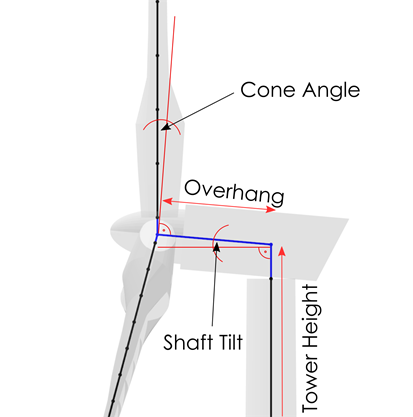
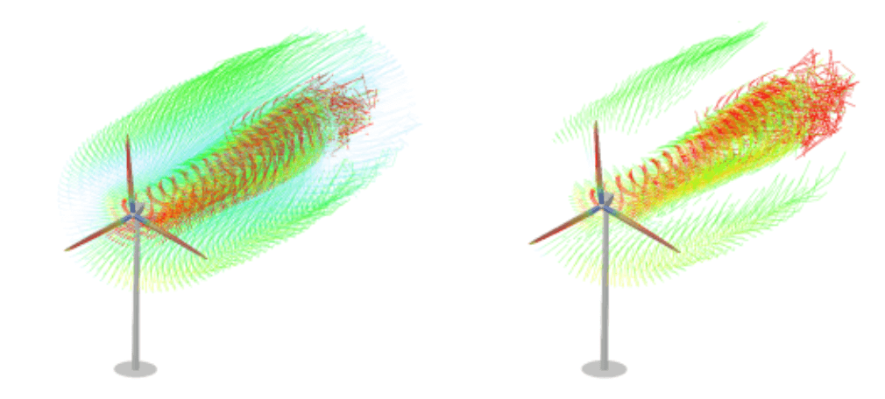
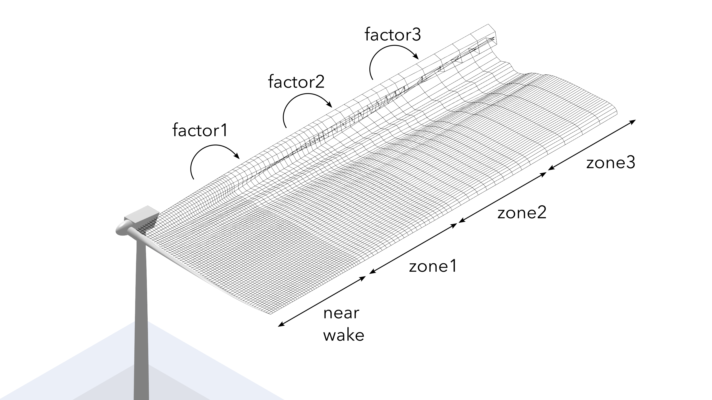
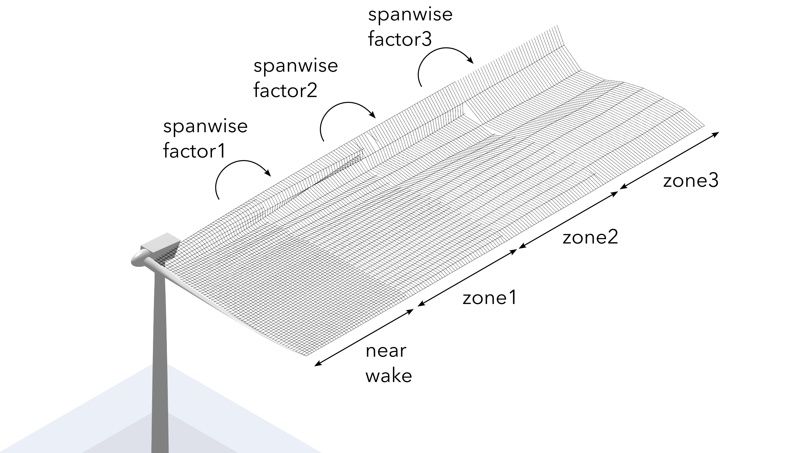
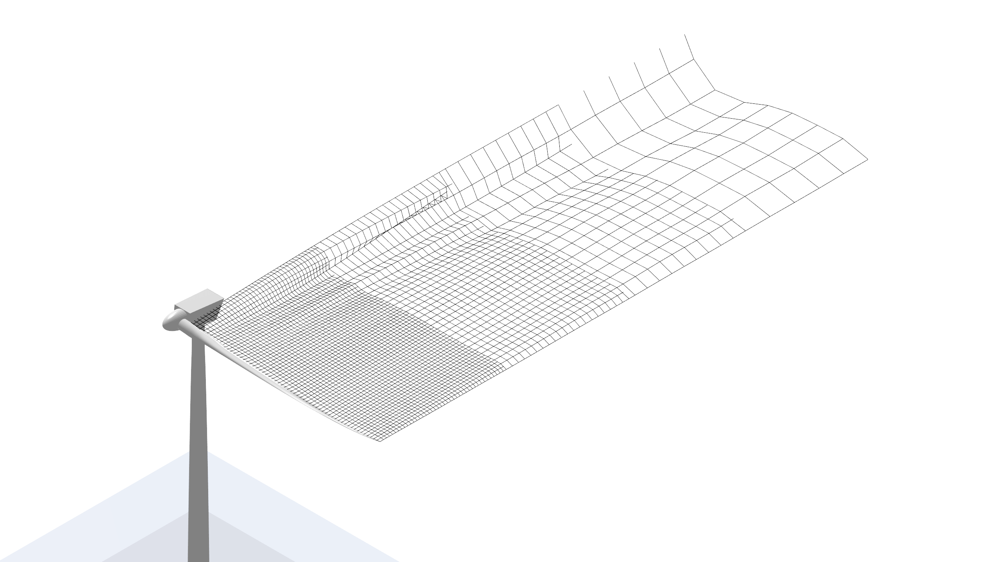

Aerodynamic Modeling
====================

This section covers all options that are related to the aerodynamic modelling of a turbine design. Covering wake models, dynamic stall models, geometry parameters and blade discretization.

Turbine Geometry
----------------

If no structural model is defined for this turbine object the turbine geometry is defined here. If a structural model is defined the geometry is defined within the structural model files.
    
- **Rotor Overhang**: Sets the rotor overhang of the turbine object (see :numref:`fig-turbine-geometry`)
- **Tower Height**: Definition of the tower height.
- **Tower Top/Bottom Radius**: Defined the tower top and bottom radius. A linear interpolation is applied for all tower stations in between.
- **Rotor Shaft Tilt Angle**: Sets the rotor shaft tilt angle (see :numref:`fig-turbine-geometry`).
- **Rotor Cone Angle**: Sets the rotor cone angle (see :numref:`fig-turbine-geometry`).

.. _fig-turbine-geometry:

    
    Definition of turbine geometry parameters.

Aerodynamic Discretization
--------------------------

**Blade Panels**: Here the user can specify the number of blade panels and the type of spacing. A **Linear** spacing distributes the panels evenly over the blade length. A **Cosine** spacing results in a finer discretization near the blade ends (root and tip) and a slightly coarser discretization near the blade center. The option **Table** uses the aerodynamic blade definition table as a template for the aerodynamic discretization, thus the user can use this option for a fully customized blade discretization.

Aerodynamic Models
------------------

- **Dynamic Stall**: The user can activate the use of a dynamic stall model. The options are: **Off**: No dynamic stall model is used. **OYE**: The OYE dynamic stall model is used, see :ref:`OYE Model`. **ATEF**: The ATEFlap unsteady aerodynamics model is used, see :ref:`ATEFlap Model`.
- **2 Point L/D Eval**: This actives the two point lift and drag evaluation model, proposed by :footcite:t:`wes-2021-163`. The advantage of this two point evaluation is that lift and drag predictions for dihedral or coned wind turbine rotor are improved and the airfoil **pitch rate** is explicitly being taken into account by evaluating the angle of attack at the three-quarter chord point and then applying the aerodynamic coefficients at the quarter-chord point.
- **Himmelskamp Effect**: The correction for the *Himmelskamp* effect can be activated here, see :ref:`Himmelskamp Effect`.
- **Tower Shadow**: The *Tower Shadow Effect* can be activated or deactivated here, see :ref:`Tower Influence`.
- **Tower Drag Coeff.**: Sets the drag coefficient that is used to model the *Tower Shadow Effect*. If a structural model is used for this turbine the tower drag coefficient is set in the 20th column of the structural tower data table, see :ref:`Tower and Torquetube Euler Bernoulli and Timoshenko Datatable`.
    
Wake Type
---------

Here the user can choose between the **Free Vortex Wake** or the **Unsteady BEM** aerodynamic model. The **Unsteady BEM** model can only be used with **HAWT** turbine definitions.

Unsteady BEM
------------

The :ref:`Blade Element Momentum Method` in QBlade is the default modeling option for HAWT (Horizontal Axis Wind Turbines). It has a low computational cost and good accuracy in most cases. The Unsteady BEM cannot be used to model VAWT (Vertical Axis Wind Turbines). To model a VAWT the :ref:`Free Vortex Wake` method must be used.

Unsteady BEM Options
--------------------

- **Azimuthal Polar Grid Discretization**: The polar grid is discretized into the chosen number of azimuthal sections. A value of 1 is equal to the BEM without a polar grid.
- **Include Tip Loss**: This activates the classical BEM tip loss correction to account for a finite number of blades, see :footcite:t:`Glauert1935`. 
- **Convergence Acceleration Time**: The time lag constants in the unsteady BEM implementation are increased by a factor of 20 during the time span entered by the user. This enables a much faster convergence of the unsteady BEM towards a steady operational point.

The theory of the unsteady polar BEM is briefly described in :ref:`Polar Grid`.

Dynamic Wake Meandering Parameters
----------------------------------

DWM Wake Settings
*****************

- **Total Wake Length (in D) [-]**: This parameter sets the total wake length of the DWM model, normalized by rotor diameter.
- **Number of Wake Planes [-]**: The total number of wake planes that is spread out over the total wake length. If the *Total Wake Length* would be 10 and the *Number of Wake Planes* 20, then the wake planes would be :math:`\frac{10D}{20}=0.5D` apart.
- **Max Wake Plane Width (in D) [-]**: This specifies the max. diameter of the wake planes. If *Max Wake Plane Width* = 3, then the wake plane would cover 3 rotor diameters.
- **Wake Plane Update Dist. (in D) [-]**: After each wake plane was propagated by this distance, normalized by rotor diameter, its velocity distribution is updated (evolve step).
- **Yaw Deflection Factor [1/deg]**: Is a parameter for the yaw deflection correction, scaled with yaw error and normalized downstream distance.
- **Tilt Deflection Factor**: Is a parameter for the tilt deflection correction, scaled with tilt error and normalized downstream distance.
- **Include Rotor Tilt**: If deactivated, the rotor tilt error does not cause a vertical deflection of the wake planes.

DWM Wake Plane Settings
***********************

- **Wake Plane Radial Disc. [-]**: Specifies with how many points the wake plane is discretized over its width (*Max Wake Plane Width*).
- **C Meander, Polar Grid Size (in D) [-]**: Specifies the size of the polar grid, normalized by rotor diameter, that is used to average velocities at each wake plane to evaluate the meandering (in plane) components during the propagation step.
- **C Advect, Polar Grid Size (in D) [-]**: Specifies the size of the polar grid, normalized by rotor diameter, that is used to average velocities at each wake plane to evaluate the advection (out of plane) component during the propagation step.
- **Polar Grid Measurement Points [-]**: The number of points distributed over the polar grid (for meandering and advection calculation) at which velocities are evaluated during the averaging step.
- **Polar Grid Measurement Points [-]**: The number of points distributed over the polar grid (for meandering and advection calculation) at which velocities are evaluated during the averaging step.
- **Polar Grid Weighting [-]**: Specifies the weighting function for the polar grid points, used during velocity averaging.
- **Rotor Low Pass Filter Freq. [Hz]**: The cut-off (corner) frequency :math:`f_c` of a low pass time filter to obtain rotor conditions (thrust, yaw, etc.), implemented as :math:`x_{lp,t} = x_{lp,t-1} \cdot e^{-2\pi f_c} + (1-e^{-2\pi f_c}) \cdot x_t`.
- **Thrust Coefficient Ct [-]**: The thrust coefficient can be obtained automatically from the local rotor conditions (*auto*) or manually, as a user input (*manual*).
- **Turbulence Intensity [-]**: The turbulence intensity can be obtained automatically from the inflowconditions (*auto*) or manually, as a user input (*manual*).
- **Viscosity Model**: The viscosity model that is used during the wake plane update (evolution) calculations, options are *MADSEN, LARSEN, IEC, KECK*..
- **Boundary Condition**: The boundary condition model that is used to generate the velocity distribution of the rotor fixed wake plane, options are *NONE, MADSEN, IEC, KECK*.

DWM Added Turbulence Settings
*****************************

A small scale three dimensional turbulence windfield may be used to introduce wake added turbulence into the flowfield. The added turbulence wind field should have a unit variance and isotropic turbulence. It is introduced into the wake plane velocity field by a weighting factor km:

:math:`T_{added}(\vec{x},t) = k_m \cdot T_{field}(\vec{x},t)`

:math:`k_m(x,r) = |(1-U(x,r))|\cdot k_{m1}+|\frac{\delta U(x,r)}{\delta r}|\cdot k_{m2}`

- **Enable Added Turbulence**: This activates the added turbulence model
- **Added Turbulence km1 [-]**: A tunable parameter in the formula for the weighting factor km
- **Added Turbulence km2 [-]**: A tunable parameter in the formula for the weighting factor km
- **Added Turbulence Box**: The windfield that is used to provide the turbulence, should be of unit variance and isotropic turbulence.

.. admonition:: Info
   :class: important
   
	This section will be expanded in the near future...

Free Vortex Wake
----------------

The :ref:`Lifting Line Free Vortex Wake` method in QBlade yields an improved accuracy over the Unsteady BEM method, especially for unsteady operating conditions, such as changing inflow speed or direction or floating wind turbines, that are subjected to wave forces. This increased fidelity however comes at an increased computational cost. Furthermore, the number of settings that are required to setup this method is significantly larger than the BEM settings. All LLFVW modeling options are detailed in the following.

Wake Modelling
--------------

- **Wake Integration Type**: This sets the velocity integration method for the wake nodes during the free wake convection step. **EF**: A simple 1st Order Euler Forward integration. **PC**: A 2nd Order Predictor Corrector integration method. **PC2B**: A second Order Predictor Corrector Backwards integration scheme.
- **Wake Rollup**: This actives or deactivates the wake self-induction.
- **Include Trailing/Shed Vortices**: This sets if trailing (streamwise) or shed (spanwise) vortices are generated at the blades trailing edge during every timepstep. 
- **Wake Convection**: The user can choose here which free-stream velocity contributes to the total convection velocity of the wake nodes. **BL**: The convection velocity is the mean boundary layer velocity (as a function of height). **HH**: The convection velocity is the constant hub-height velocity. **LOC**: The convection velocity is evaluated locally at each wake node position.
- **Wake Relaxation Factor**: This factor can be used to *relax* the wake by blending out the starting vortex. The factor controls how long the wake is allowed to be after a given number of rotor revolutions or timesteps (depending on the **Count Wake Length In** setting). Such as a value of 0.5 allows for a wake length of 5 revolutions after the rotor has undergone 10 revolutions. A factor of 1 deactivates the blending.
- **First Wake Row Length Factor**: This factor can be used to assign a shortened length to the newly created wake elements at the trailing edge so that the newly created shed vorticity is in closer proximity to the blade. A factor of 1 deactivates the shortening.
- **Max Num. Elements / Norm. Distance**: These two values are used to cut-off the wake after a fixed number of vortex elements has been created (Max. Num. Wake Elements) or after a vortex element has reached a distance (normalized by rotor diameter) from the hub that is larger than **Norm. Distance**.
- **Wake Reduction Factor**: This factor *filters* out wake elements that have a circulation smaller than the maximum circulation in the wake multiplied by this factor. In most cases this effectively removes shed vorticity that does not significantly affect the wake induction (see :numref:`fig-wakereduction`).

.. _fig-wakereduction:

    
    Visualization of the wake reduction approach.

- **Count Wake Length In**: This setting controls how the age of a vortex element is counted. Either as a number of rotor revolutions, or as a number of timesteps that have passed since the element was created.
- **Particle Conversion after [Revolutions/Timesteps]**: (**Only QBlade-EE**) This setting controls when a vortex filament is converted into a vortex particle. If the vortex element has reached an age (in timesteps or revolutions) equal to this value it is converted into a particle. 
- **Wake Zones N/1/2/3 in [Revolutions/Timesteps]**: This setting controls the *length* of the different wake zones. The length is either counted in rotor revolutions or in timesteps, depending on the setting (**Count Wake Length In**). Each wake zone has a successively coarser discretization (depending on the **Wake Zones Factor** settings) to reduce the total number of free wake elements and thereby to speed up the simulation.
- **Streamwise Factor 1/2/3**: These (integer) factors control by how much the wake is coarsened in the streamwise direction in between the different wake zones. A factor of 2 means that when transitioning from one zone to the next 2 trailing wake elements are merged into a single wake element to coarsen the wake resolution (see :numref:`fig-streamwise`).
- **Spanwise Factor 1/2/3**: These (integer) factors control by how much the wake is coarsenend in the spanwise direction between the different wake zones. A factor of 2 means that when transitioning from one zone to the next 2 shed wake elements are merged into a single wake element to coarsen the wake resolution in the spanwise direction (see :numref:`fig-spanwise`).

.. _fig-streamwise:

    
    Visualization of the wake zoning approach and coarsening in the streamwise direction. For illustrative purposes the rotor does not rotate and the length of each wake zone is 50 timesteps.

.. _fig-spanwise:

    
    Visualization of the wake zoning approach and coarsening in the spanwise direction. For illustrative purposes the rotor does not rotate and the length of each wake zone is 50 timesteps.

.. _fig-combined:

    
    Visualization of the wake zoning approach and coarsening in the combined streamwise and spanwise direction. For illustrative purposes the rotor does not rotate and the length of each wake zone is 50 timesteps.

Vortex Modelling
----------------

- **Fixed Bound Core Radius (% Chord)**: This sets the fixed core radius of the bound blade vortices. Defined as a fraction of the local blade chord.
- **Initial Wake Core Radius (% Chord)**: This sets the initial core radius of the free vortices that are created at the blades trailing edge. Defined as a fraction of the local blade chord.
- **Turbulent Vortex Viscosity**: This value is used in the vortex core growth model, see :ref:`Vortex Core Desingularization`.
- **Include Vortex Stretching**: This option activates vortex stretching, see :ref:`Vortex Core Desingularization`.
- **Maximum Vortex Stretching Factor**: After the cumulative vortex strain rate has reached a value larger than this factor it is automatically removed from the wake.

Turbine Gamma Iteration Parameters
----------------------------------

- **Relaxation Factor**: This relaxation factor is used when the blade circulation is updated during the circulation iteration.
- **Max. Epsilon for Convergence**: The convergence criteria for the blade circulation.
- **Max. Number of Iterations**: The maximum number of blade circulation iterations that will be carried out.

.. footbibliography::
