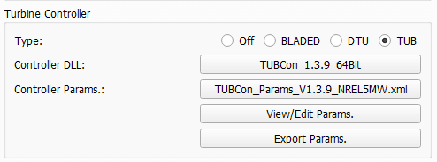

Wind Turbine Controllers
------------------------

QBlade allows the integration of  standard wind turbine controllers to perform aero-servo-hydro-elastic simulations. This is realized via the coupling to a dynamic link library (.dll) which is called every time step by QBlade to update control actions performed on the wind turbine. This is shown in :numref:`fig-controller-interaction`.

.. _fig-controller-interaction:
.. figure:: controller_interaction.png
    :align: center
    :alt: Controller Interaction with QBlade.

    Controller interaction with QBlade: For each time step, QBlade passes the sensor input and retrieves the control actions demanded from the controller in a predetermined swap array.

Several commonly used controller interfaces are compatible with QBlade. The different types of controller interfaces that QBlade is compatible with are:

 * **Bladed** interface: the function *DISCON* is called 
 * **DTU** interface: the function *update_regulation* is called
 * **TUB** interface: the function *TUBController* is called
 
Since QBlade is compiled as a 64bit software it is **only possible to call 64bit compiled controller libraries from QBlade**. Open source examples of these three formats are available online. An example for the Bladed-style controller is the :footcite:t:`ROSCO` controller. 

An example for a DTU-style controller is the :footcite:t:`DTUWEC` controller. An example for the TUB-Style controller is the TUB Controller presented in :footcite:t:`Perez-Becker2021`. The QBlade release contains pre-compiled ROSCO, DTU and TUB Controllers.  

For these commonly used interfaces the data that is passed between the controller and the simulation in QBlade and its position in the swap array that is used for this communication is already predefined. This means that there are fixed array positions for data such as torque, rpm, pitch angles and tower top accelerations. The specific data that is communicated and its position depends on the controller interface definition and is different between the BLADED-style, DTU-style and TUB-style interfaces.

.. admonition:: Location of controller library files
   :class: info

   To use a controller library (.dll or .so) in QBlade, place the file in the `/ControllerFiles` directory within the QBlade installation. When a simulation is initiated, QBlade automatically creates a unique temporary copy of each controller library file in this directory for every simulation instance.
 
External Library Interface
--------------------------

QBlade also allows to integrate multiple custom dynamic libraries into a simulation. The purpose of a custom library could be the control of an active damping device, the control of a mooring cable length or any other active system which influence can be modeled by the application of a force, moment, a change in mass, pitch torque or a change in mooring line length. 

The structure of the External Library Interface consists of an arbitrarily named *update()* function that is automatically called during every timestep of the simulation (after rampup has been completed). A swap array of floats of arbitrary size is passed to the *update()* function and retrieved from the update function. The content of the swap array can be freely assigned by the user from all variables that are evaluated from a simulation. In addition the user can also define to what actions should be performed on the turbine, based on the content of the swap array. A minimum working example for the source code of the controller (with focus only on the function definitions) is shown in the section :ref:`Example for a custom controller library in C`.
	
In :ref:`Sending Turbine Data to an External Library` and  :ref:`Applying External Library Data to the Turbine` it is explained how the communication with a controller can be customized. 

Adding a Controller or an External Library to a Turbine Definition
------------------------------------------------------------------

A controller library can be included in a turbine definition by selecting the library in the dialog shown in :numref:`fig-controller_dialog`. Depending on which controller interface type is used the appropriate option has to be selected. Furthermore, a controller parameter file has to be selected and loaded by the user. The parameter file is stored in the QBlade project and can be edited by the user once loaded. This if for example useful for setting up an identical turbine with a modified controller parameter (i.e. for control parameter tuning). Controller parameter files edited within QBlade can also be exported to ASCII format. 

Any number of custom external libraries can be loaded in the lower part of the dialog shown in :numref:`fig-controller_dialog`. When loading a custom library the user also has to specify the function name that should be called by QBlade as well as the swap array size that will be used for communication between the library and QBlade. Furthermore, a parameter file can optionally be loaded. 

Each external library receives an integer identifier, which is later used to pass and receive data to and from its swap array.

.. _fig-controller_dialog:

    
    The controller dialog.
    
Below is an example for the *Turbine Controllers* and *External Libraries* sections in a :ref:`Turbine Definition ASCII File` (.trb). For a predefined controller the controller type, the controller file and its parameter file have to be defined. The three parameters that need to be passed for the external library are the file name (*type2_dll*), the function name, in this case *update2* and the swap array size.

.. code-block:: console
	:caption: : customDll.cpp
	
	----------------------------------------Turbine Controller-----------------------------------------------------------
	3                                        CONTROLLERTYPE     - the type of turbine controller 0 = none, 1 = BLADED, 2 = DTU, 3 = TUB
	TUBCon_1.3.9_64Bit                       CONTROLLERFILE     - the controller file name, WITHOUT file ending (.dll or .so ) - leave blank if unused
	Control/TUBCon_Params_V1.3.9_NREL5MW.xml PARAMETERFILE      - the controller parameter file name (leave blank if unused)

	----------------------------------------External Libraries-----------------------------------------------------------
	type2_dll                                LIBFILE_1          - the library file name, WITHOUT file ending (.dll or .so )
	update2                                  LIBFUNCTION_1      - the library function name that should be called every timestep
	100                                      LIBARRAYSIZE_1     - the library swap array size for data exchange
	param.txt                                LIBPARAMETERFILE_1 - the library parameter file name (leave blank if unused)

**IMPORTANT**: 

 - The controller library (.dll or .so) must always be located in the folder path *.\\ControllerFiles* relative to the QBlade executable. 
 - QBlade is a 64bit code, so the controller dlls must also be compiled for 64bit use. 

Defining the Controller or Library Sampling Timestep
----------------------------------------------------

By default, if no explicit sampling timestep is specified, QBlade executes the turbine controller or external library at every simulation timestep. In this case, the controller sampling period is identical to the simulation timestep (``TIMESTEP``).

To decouple the controller update rate from the simulation timestep, the user may specify a custom sampling interval using the parameter ``SAMPLESTEP``. This optional parameter must be defined inside the controller or external-library parameter file:

.. code-block:: console
   :caption: Example: setting a custom sample step for the controller

       0.1    SAMPLESTEP

In this example, the controller is executed every 0.1 seconds, regardless of the simulation timestep.

QBlade uses an asynchronous sampling mechanism: the controller operates on its own internal sampling timeline, independent of the simulation timestep. Conceptually, the controller “ticks” at fixed intervals determined by ``SAMPLESTEP`` (e.g., 0.0 s, 0.1 s, 0.2 s, ...), while the simulation advances with a potentially different timestep. Whenever the simulation time reaches or exceeds the next scheduled controller sampling point, the controller is executed. Between these sampling points, the previously computed controller outputs are held constant using a zero-order hold.

This design intentionally mirrors real industrial PLC-based wind turbine controllers. In an actual turbine, the PLC or embedded controller executes its control loop at a fixed cycle time (for example 25–100 ms), independent of the much faster real-world dynamics of the mechanical and aerodynamic system. The PLC does not update continuously: it samples sensor values at discrete intervals, performs its control computations, and holds its actuator commands constant until the next control cycle. QBlade’s sampling mechanism reproduces this behavior exactly, enabling realistic simulation of discrete-time control systems.

The only restriction is that the sampling step must not be smaller than the simulation timestep (:math:`dt_\text{sample} < dt_\text{sim}`). If a smaller sampling step is specified, QBlade will automatically fall back to using the simulation timestep as the effective sampling interval.

Sending Turbine Data to a Wind Turbine Controller
-------------------------------------------------

In addition to the standard predefined sensor information that is passed between QBlade and the controller, the user can add additional custom data to the swap array. This is useful for the development of specialized controllers that rely on unconventional sensor input. Depending on the controller format chosen, different positions of the swap array will be unoccupied. 

**IMPORTANT**: The user should know which array entries are unused before adding custom sensors. Otherwise, using this option will lead to unwanted turbine behavior!

To add custom sensors to the swap array of a *Predefined Controller* (BLADED, DTU or TUB interface), the following table needs to be added to the controller parameter file, the substructure file or the structural model main file (up to the user to decide what is most convenient). The search order in the files is:

 1. structural main file
 2. substructure file
 3. controller parameter stream

The box below shows an exemplary **CONTROLLER_IN** table. The first column contains the swap array position and the second column the variable name in quotation marks. In the example below the table assigns the variable *Time [s]* to swap array position [0], the variable *Timestep [-]* to array position [1] and the variable *X_l Acc. BLD_1 pos 1.000* to array position [10]. Note that the full variable name, as shown in any of QBlade's graphs must be included in the table. If the variable name does not exist (or the data is not stored as part of the simulation) no value is passed to the swap array at the designated position. Also note that the data defined in this table overwrites the standard data that is normally passed to the predefined controller interface.

.. code-block:: console
	:caption: : CONTROLLER_IN Table
	
	CONTROLLER_IN
	SWAP DATA
	0    "Time [s]"
	1    "Timestep [-]"
	10   "X_l Acc. BLD_1 pos 1.000"

**Note** that the output of the desired sensor should be enabled in the :ref:`StrDef_MainFile`, and the variable name must exist. Otherwise, zeros will be passed to the controller.

It is also possible to send sectional data using this table. Sectional data requires the inclusion of normalized position information, specifying the relative position along the blade or strut. An example configuration is shown below:

.. code-block:: console
    :caption: CONTROLLER_IN Table Example – Sending Sectional Data

    CONTROLLER_IN
    SWAP DATA POSITION
    0    "Angle of Attack at 0.25c (at section) Blade 1 [deg]" 0.5
    1    "Circulation (at section) Blade 2 [m^2/s]" 0.2
    10   "Time [s]"
	
You can directly communicate the timestep size to the controller by using "dt" in the DATA column.

Sending Turbine Data to a Wind Turbine Controller Across Turbine Instances
^^^^^^^^^^^^^^^^^^^^^^^^^^^^^^^^^^^^^^^^^^^^^^^^^^^^^^^^^^^^^^^^^^^^^^^^^^

In multi-turbine or multi-rotor simulations, sensor data from one turbine can be transmitted to the controller of another turbine. To achieve this, append **NUM_X** to the **CONTROLLER_IN** keyword, where **X** is the integer identifier of the target turbine instance. **The identifiers start at 0 for the first turbine and increment sequentially up to N-1, where N is the total number of turbines in the simulation.**

For instance, to send data to the third turbine in the list (index Turbine[2] in C++ notation), the **CONTROLLER_IN** table should be configured as follows:

.. code-block:: console
    :caption: CONTROLLER_IN Table Example – Sending Data to Turbine[2] (the third item in C++)

    CONTROLLER_IN NUM_2
    SWAP DATA
    0    "Time [s]"
    1    "Timestep [-]"
    10   "X_l Acc. BLD_1 pos 1.000"
    
It is also possible to send data from this turbine controllers SWAP array to the SWAP array of the turbine controller of Turbine[2]. In the example below the SWAP array values from indices 14 and 11 of this turbine are send to the SWAP array of Turbine[2] at the indices 0 and 1.

.. code-block:: console
    :caption: CONTROLLER_IN Table Example – Sending Sectional Data

    CONTROLLER_IN NUM_2
    SWAP DATA POSITION
    0    "SWAP_14" 
    1    "SWAP_11"
    
.. admonition:: Turbine indices in multi-turbine simulations
   :class: important
   
   While most numberings in QBlade, such as for substructure transition pieces, or for external controllers, start at 1 - the turbine objects are numbered with c++ array notation. The main reason for this is to have consistency with the numbering of turbine objects with the functions in QBlade's :ref:`Command Line Interface (CLI)`.

Sending Turbine Data to an External Library
-------------------------------------------

Sending custom data to an external library is the same process as sending data to a predefined controller (see :ref:`Sending Turbine Data to a Wind Turbine Controller`), only the keyword for the table changes. In this case we are passing data to the external controller *1*, indicated by the keyword *EXTERNAL_1_IN*. To pass to the second external controller you would use the keyword *EXTERNAL_2_IN*. It is also possible to send data from the turbine controllers SWAP array to the external library. To do this, simply enter **SWAP**, followed by the swap array index number:

.. code-block:: console
	:caption: : EXTERNAL_1_IN Table
	
	EXTERNAL_1_IN
	SWAP DATA
	0    "Time [s]"
	1    "Timestep [-]"
	2    "SWAP_3"

Note that the output of the desired sensor should be enabled in the :ref:`StrDef_MainFile` and the variable name must exist. Otherwise, zeros will be passed to the controller.

You can directly communicate the timestep size to the controller by using "dt" in the DATA column.

Sending Turbine Data to an External Library Across Turbine Instances
^^^^^^^^^^^^^^^^^^^^^^^^^^^^^^^^^^^^^^^^^^^^^^^^^^^^^^^^^^^^^^^^^^^^

Similar to :ref:`Sending Turbine Data to a Wind Turbine Controller Across Turbine Instances`, it is also possible to send data across turbine instances to an external library. To do this, the user must add the keyword **NUM_X**, where **X** represents the identifier of the target turbine instance.

For example, the following configuration sends data to the second external library (**EXTERNAL_2**) of the fourth turbine (**NUM_3**) in the simulation:

.. code-block:: console
    :caption: EXTERNAL_2_IN Table Example – Sending Data to external controller 2 turbine with id = 3

    EXTERNAL_2_IN NUM_3
    SWAP DATA
    0    "Time [s]"
    1    "Timestep [-]"
    2    "SWAP_3"
    
.. admonition:: Turbine indices in multi-turbine simulations
   :class: important
   
   While most numberings in QBlade, such as for substructure transition pieces, or for external controllers, start at 1 - the turbine objects are numbered with c++ array notation. The main reason for this is to have consistency with the numbering of turbine objects with the functions in QBlade's :ref:`Command Line Interface (CLI)`.

Applying Wind Turbine Controller Data to the Turbine
----------------------------------------------------

Swap array data from predefined controller interfaces is automatically applied to perform specific control actions, such as the application of generator torque on the model or control of the blade pitch. The functionality presented hereafter allows to use custom data from the controller swap array to perform specific actions on the turbine. 

This functionality is very similar to the function :code:`SetExternalAction()`, from QBlade's Software in Loop Interface (SIL), that is described in the :ref:`Interface Function Documentation`. It allows to assign forces, moments, masses and other actions to a turbine in a highly flexible manner.

Again, a table is defined to gather the controller data from the controller swap array. The keyword for this table is **CONTROLLER_OUT**. The table has a minimum of 6 columns, and an optional 7th column. An exemplary table is shown below: 

.. code-block:: console
	:caption: : CONTROLLER_OUT Table
	
	CONTROLLER_OUT
	SWAP  ACTION     ID     POS  DIR  LOCAL  NUM
	50    SETLENGTH  MOO_1  1.0  X    true   0
	50    SETLENGTH  MOO_2  1.0  X    true   0

Below an overview of the six columns is given:

 * **1:** The swap array **DATA** that will be applied
 * **2:** The **ACTION** that will be performed, based on the data
 * **3:** The **ID** at which the action will be performed
 * **4:** The **POSITION** at which the action will be performed
 * **5:** The **DIRECTION** in which the action is being performed.
 * **6:** **ISLOCAL** whether the direction is defined in local element coordinates or in global coordinates
 * **7:** **NUM** the turbine number on which the action should be performed (num >= 0) or the shared mooring system (num = -1), (default num = -2, *this* turbine)

The different columns are now further defined:

**DATA**
 In this column the swapArray index is selected from which data will be used to perform an action.
  
**Action**
 Different actions can be performed, these are:
  * ADDMASS: adds mass of **DATA** to a location, in [kg]
  * ADDFORCE: adds a force of **DATA** to a location, in [N]
  * ADDTORQUE: adds a torque of **DATA** to a location, in [Nm]
  * SETLENGTH: sets the delta Length of **DATA** of a cable, in [m]
  * SETAFC: sets the state of **DATA** of an AFC element [-]
  * SETTORQUE: sets the generator torque of **DATA**, in [Nm]
  * SETYAW: sets the yaw angle of **DATA**, in [rad]
  * SETPITCH: sets the pitch angle of **DATA** for BLD_X, in [rad]
  * SETBRAKE: sets the brake modulation of **DATA** [0-1]
  * POSOFFSET : applies a position offset, in [m]
  * ROTOFFSET : applies a rotation offset, in [rad]

**ID**
 The **ID** is used to identify a certain turbine component, possible **IDs** and actions that can be performed on them are shown below:
  * CAB_<X>: applies the action to the guycable with ID <X>. Actions on cables are: SETLENGTH, ADDMASS, ADDFORCE
  * MOO_<X>: applies the action to the mooring line with ID <X>. Actions on moorings are: SETLENGTH, ADDMASS, ADDFORCE
  * TRQ: applies the action to the torquetube. Actions on the torquetube are: ADDFORCE, ADDTORQUE, ADDMASS
  * BLD_<X>: applies the action to blade <X>. Actions on the blades are: ADDFORCE, ADDTORQUE, ADDMASS
  * STR_<X>_<Y>: applies the action to strut <X> of blade <Y>. Actions on the struts are: ADDFORCE, ADDTORQUE, ADDMASS
  * AFC_<X>_<Y>: applies the action to AFC <X> of blade <Y>. Actions on the AFC elements are: SETAFC
  * SUB_<X>: applies the action to the substructure element with ID <X>. Actions on the substructure elements are: ADDFORCE, ADDTORQUE, ADDMASS
  * JNT_<X>: applies the action to the substructure joint with ID <X>. Actions on the substructure joints are: ADDFORCE, ADDTORQUE, ADDMASS
  * HUB: applies the action to the free LSS hub node. Actions on the hub node are: ADDFORCE, ADDTORQUE, ADDMASS
  * HUBFIXED: applies the action to the fixed non-rotating hub node. Actions on the hub node are: ADDFORCE, ADDTORQUE, ADDMASS, POSOFFSET, ROTOFFSET
  * NAC: applies the action to the nacelle node, located at the tower top, yawing. Actions on the nacelle node are: ADDFORCE, ADDTORQUE, ADDMASS, POSOFFSET, ROTOFFSET 

**POSITION**
 Sets the normalized position [0-1] at which the mass, force or torque is applied. Only has an effect on elements, not on nodes. 
 
**DIRECTION**
 Specifies the direction along which the force or torque is applied, options are "X", "Y", "Z".
 
**ISLOCAL**
 Specifies sets whether the direction is defined in global or local (element or node) coordinates.
 
**NUM**
 (OPTIONAL) Specifies if the action should be performed on different turbine in a multi-turbine simulation (num >=0) or on the global mooring system (num == -1), (default: num = -1, *this* turbine)

Applying External Library Data to the Turbine
---------------------------------------------

Applying custom data from an external library library to the turbine is the same as applying this data from a predefined controller (see :ref:`Applying Wind Turbine Controller Data to the Turbine`) with the exception that the keyword of the table changes to **EXTERNAL_<num>_OUT**, where **<num>** is to be replaced by the library integer ID.

.. code-block:: console
	:caption: : EXTERNAL_1_OUT Table
	
	EXTERNAL_1_OUT
	SWAP  ACTION     ID     POS  DIR  LOCAL  NUM
	50    SETLENGTH  MOO_1  1.0  X    true   0
	50    SETLENGTH  MOO_2  1.0  X    true   0
	
	

Example for a custom controller library in C
--------------------------------------------

The example below shows the source code of a simple external controller library in C-language. Remember that this library should be compiled as **64bit** to be compatible with QBlade.

.. code-block:: c
	:linenos:
	:caption: : customDll.cpp

	#include <stdio.h>
	#include <cstring>
	
	bool firstCall = true;
	double value;
	char message_out[1024];
	
	//----------------------------------------------------------------
	// Called once per timestep. This function name needs to match the
	// one that you have assigned as the library function name.
	//----------------------------------------------------------------
	extern "C" __declspec(dllexport) void __cdecl update(float *avrSwap){
	
		if (firstCall){
			// example one-time initialization
			snprintf(message_out,sizeof(message_out),"update call: first call, do some initialization things! Timestep = %f",avrSwap[1]);
			firstCall = false;
		}
		else{
			// this is an example how some value is computed from the data in the swap array and then
			// returned in the same swap array at position [50]
			snprintf(message_out,sizeof(message_out),"update call: successive call, do some calculation things! Time = %f",avrSwap[0]);
			avrSwap[50] = avrSwap[0]*(-1.0);
		}
	
	}
	
	//----------------------------------------------------------------
	// Called once before the first `update`. `paramFile` is the full
	// path to your parameter file. Use it to load config.
	// This function should have the same name as the "update" 
	// function with "_init" appended to it
	//----------------------------------------------------------------
	extern "C" __declspec(dllexport) void __cdecl update_init(const char *paramFile){
	
		snprintf(message_out,sizeof(message_out),"_init call: full parameter filename %s",paramFile);
		// TODO: open paramFile, parse settings, initialize your controller here
	}
	
	//----------------------------------------------------------------
	// if this optional function is defined QBlade calls it 
	// automatically to print the output that "update" passes to the
	// message_out variable. This function should have the same name 
	// as the "update" function with "_message" appended to it.
	//----------------------------------------------------------------
	extern "C" __declspec(dllexport) void __cdecl update_message(char *outBuf){
	
		// copy the full 1024-byte buffer, including its terminator
		std::memcpy(outBuf, message_out, sizeof(message_out));
	}

.. footbibliography::
