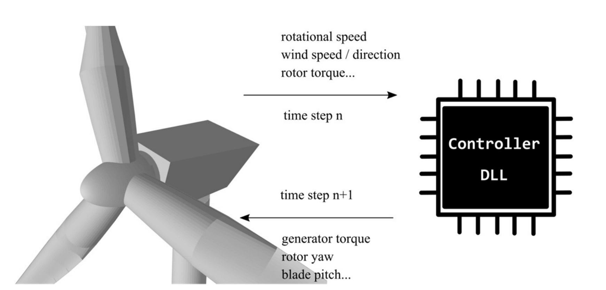
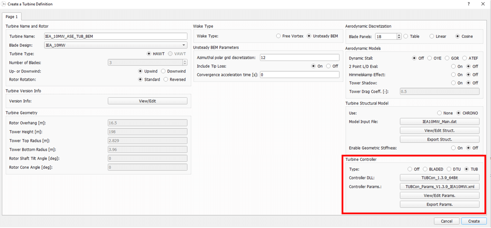

Turbine Controller
==================

QBlade allows the integration of controllers to perform aero-servo-hydro-elastic simulations. This is done via the integration of a controller dynamic link library (.dll)
that is called every time step by QBlade. In a predefined exchange array, QBlade passes the necessary sensor input to the controller, calls the controller function and the controller returns the demanded actuator actions. 
This is shown in :numref:`fig-controller-interaction`.

.. _fig-controller-interaction:

    Controller interaction with QBlade: For each time step, QBlade passes the sensor input and retrieves the control actions demanded from the controller in a predetermined exchange array.

Currently, three controller formats are compatible with QBlade:

- Blade-style controllers
- DTU-style controllers
- TUB-style controller

For Bladed-style controllers, QBlade calls the controller function *DISCON* from the dll. For DTU-style controllers, QBlade calls the controller function *update_regulation*.
For TUB-Style controllers, QBlade calls the controller function *TUBController*.

Open source examples of these three formats are available online. An example for the Bladed-style controller is the :footcite:t:`ROSCO` controller. 
An example for a DTU-style controller is the :footcite:t:`DTUWEC` controller. An example for the TUB-Style controller is the TUB Controller presented in :footcite:t:`Perez-Becker2021`.
QBlade is delivered with pre-compiled DTU and TUB Controllers.  

.. _fig-controller-setup:

    Setting up a controller in QBlade. The user can choose between three formats.

All controllers are set up in the same manner in the turbine definition dialog, shown in :numref:`fig-controller-setup`.
The user must choose which controller format to use and specify the name of the controller dll and the path to the controller parameter file. 

**IMPORTANT**: 

 - The controller dll must always be located in the relative folder path *.\\ControllerFiles* to the QBlade executable file. 
 - QBlade is a 64bit code, so the controller dlls must also be compiled for 64bit use. 
 
In addition to the controller dll, the user also has to provide the controller parameter file. There are no specific requirements for this file, except that it should be in ASCII. The user is therefore free to choose the format. 
The latter file is saved in the QBlade project file and can be edited once loaded. This if for example useful for setting up an identical turbine with a modified controller parameter (i.e. for control parameter tuning).
Controller parameter files edited within QBlade can also be exported to ASCII format.

Adding Custom Sensors to the Exchange Array
^^^^^^^^^^^^^^^^^^^^^^^^^^^^^^^^^^^^^^^^^^^^
In addition to the standard sensor information that is passed between QBlade and the controller, the user can add additional sensors to the exchange array. This is useful for the development
of specialized controllers that rely on unconventional sensorial input. Depending on the controller format chosen, different positions of the exchange array will be unoccupied. 

**IMPORTANT**: The user should know which array entries are unused before adding custom sensors. Otherwise, using this option will lead to unwanted turbine behavior!

To add custom sensors to the exchange array, following keywords need to be added to the controller parameter file in a new line:

- [<ArrayEntry>] "<Sensor Name>"

The <ArrayEntry> specifies the location of the array in which the sensor input should be written (the first index starts at the array[0] position). 
The <Sensor Name> is the name of the sensor that is written in the simulation output graphs. Using these commands, multiple custom sensors can be added to the interface array. 
For example, if the local tip acceleration in the x direction of blade 1 should be passed to the controller in the 300th entry (at position array[299]) of the exchange array, the user can add following line anywhere in the
controller parameter file.

[299] "X_l Acc. BLD_1 pos 1.000"

Note that the output of the desired sensor should be enabled in the :ref:`StrDef_MainFile`. Otherwise, only zeros will be passed to the controller.

.. footbibliography::
