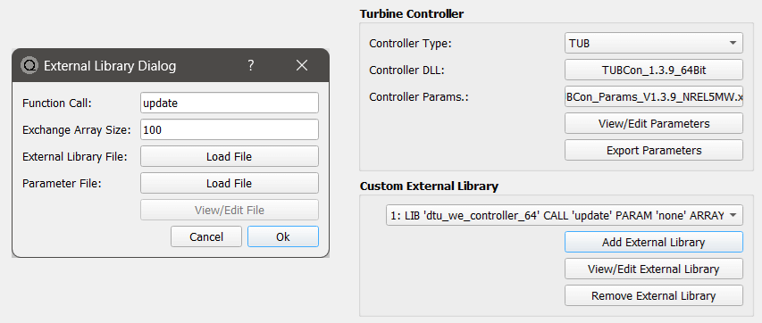

Turbine Controller Libraries
============================

Predefined Controller Interfaces
--------------------------------

QBlade allows the integration of  standard wind turbine controllers to perform aero-servo-hydro-elastic simulations. This is realized via the coupling to a dynamic link library (.dll) which is called every time step by QBlade to update control actions performed on the wind turbine. This is shown in :numref:`fig-controller-interaction`.

.. _fig-controller-interaction:

    Controller interaction with QBlade: For each time step, QBlade passes the sensor input and retrieves the control actions demanded from the controller in a predetermined exchange array.

Several commonly used controller interfaces are compatible with QBlade. The different types of controller interfaces that QBlade is compatible with are:

 * **Bladed** interface: the function *DISCON* is called 
 * **DTU** interface: the function *update_regulation* is called
 * **TUB** interface: the function *TUBController* is called
 
Since QBlade is compiled as a 64bit software it is **only possible to call 64bit compiled controller libraries from QBlade**. Open source examples of these three formats are available online. An example for the Bladed-style controller is the :footcite:t:`ROSCO` controller. 

An example for a DTU-style controller is the :footcite:t:`DTUWEC` controller. An example for the TUB-Style controller is the TUB Controller presented in :footcite:t:`Perez-Becker2021`. The QBlade release contains pre-compiled ROSCO, DTU and TUB Controllers.  

For these commonly used interfaces the data that is passed between the controller and the simulation in QBlade and its position in the exchange array that is used for this communication is already predefined. This means that there are fixed array positions for data such as torque, rpm, pitch angles and tower top accelerations. The specific data that is communicated and its position depends on the controller interface definition and is different between the BLADED-style, DTU-style and TUB-style interfaces.
 
External Library Interface
--------------------------

QBlade also allows to integrate multiple custom dynamic libraries into a simulation. The purpose of a custom library could be the control of an active damping device, the control of a mooring cable length or any other active system which influence can be modeled by the application of a force, moment, a change in mass, pitch torque or a change in mooring line length. 

The structure of the External Library Interface consists of an arbitrarily named *update()* function that is automatically called during every timestep of the simulation (after rampup has been completed). A swap array of floats of arbitrary size is passed to the *update()* function and retrieved from the update function. The content of the swap array can be freely assigned by the user from all variables that are evaluated from a simulation. In addition the user can also define to what actions should be performed on the turbine, based on the content of the swap array. A minimum working example for the source code of the controller (with fucus only on the function definitions) is shown in the section :ref:`Example for a custom controller library in C`.
	
In :ref:`Passing Custom Data to an External Library` and  :ref:`Passing External Library Data to the Turbine` it is explained how the communication with a controller can be customized. 

Adding a Controller or an External Library to a Turbine Definition
------------------------------------------------------------------

A controller library can be included in a turbine definition by selecting the library in the dialog shown in :numref:`fig-controller_dialog`. Depending on which controller interface type is used the appropriate option has to be selected. Furthermore, a controller parameter file has to be selected and loaded by the user. The parameter file is stored in the QBlade project and can be edited by the user once loaded. This if for example useful for setting up an identical turbine with a modified controller parameter (i.e. for control parameter tuning). Controller parameter files edited within QBlade can also be exported to ASCII format. 

Any number of custom external libraries can be loaded in the lower part of the dialog shown in :numref:`fig-controller_dialog`. When loading a custom library the user also has to specify the function name that should be called by QBlade as well as the exchange array size that will be used for communication between the library and QBlade. Each external library received an integer identifier, which is later used to pass and receive data to and from its swap array.

.. _fig-controller_dialog:

    
    The controller dialog.
    
Below is an example for the *Turbine Controllers* and *External Libraries* sections in a :ref:`Turbine Definition ASCII File` (.trb). For a predefined controller the controller type, the controller file and its parameter file have to be defined. The three parameters that need to be passed for the external library are the file name (*type2_dll*), the function name, in this case *update2* and the swap array size.

.. code-block:: console
	:caption: : customDll.cpp
	
	----------------------------------------Turbine Controller-----------------------------------------------------------
	3                                        CONTROLLERTYPE     - the type of turbine controller 0 = none, 1 = BLADED, 2 = DTU, 3 = TUB
	TUBCon_1.3.9_64Bit                       CONTROLLERFILE     - the controller file name, WITHOUT file ending (.dll or .so ) - leave blank if unused
	Control/TUBCon_Params_V1.3.9_NREL5MW.xml PARAMETERFILE      - the controller parameter file name (leave blank if unused)

	----------------------------------------External Libraries-----------------------------------------------------------
	type2_dll                                LIBFILE_1          - the library file name, WITHOUT file ending (.dll or .so )
	update2                                  LIBFUNCTION_1      - the libary function name that should be called every timestep
	100                                      LIBARRAYSIZE_1     - the library exchange array size for data exchange

**IMPORTANT**: 

 - The controller library (.dll or .so) must always be located in the folder path *.\\ControllerFiles* relative to the QBlade executable. 
 - QBlade is a 64bit code, so the controller dlls must also be compiled for 64bit use. 

Passing Custom Data to a Controller
-----------------------------------

In addition to the standard predefined sensor information that is passed between QBlade and the controller, the user can add additional sensors to the exchange array. This is useful for the development of specialized controllers that rely on unconventional sensorial input. Depending on the controller format chosen, different positions of the exchange array will be unoccupied. 

**IMPORTANT**: The user should know which array entries are unused before adding custom sensors. Otherwise, using this option will lead to unwanted turbine behavior!

To add custom sensors to the exchange array of a *Predefined Controller*, the following table needs to be added to the controller parameter file, the substructure file or the structural model main file (up to the user to decide what is most convenient). The search order in the files is:

 1. structural main file
 2. substructure file
 3. controller parameter stream

The box below shows an exemplary **CONTROLLER_IN** table. The first column contains the swap array position and the second column the variable name in quotation marks. In the example below the table assigns the variable *Time [s]* to swap array position [0], the variable *Timestep [s]* to array position [1] and the variable *X_l Acc. BLD_1 pos 1.000* to array position [10]. Note that the full variable name, as shown in any of QBlade's graphs must be included in the table. If the variable name does not exists (or the data is not stored as part of the simulation) no value is passed to the swap array at the designated position. Also note that the data defined in this table overwrites the standard data that is usually passed to the predefined controller interface.

.. code-block:: console
	:caption: : CONTROLLER_IN Table
	
	CONTROLLER_IN
	0  "Time [s]"
	1  "Timestep [s]"
	10 "X_l Acc. BLD_1 pos 1.000"

Passing Custom Data to an External Library
^^^^^^^^^^^^^^^^^^^^^^^^^^^^^^^^^^^^^^^^^^

Passing custom data to an external library is the same process as passing data to a predefined controller, only the keyword for the table changes. In this case we are passing data to the external controller *1*, indicated by the keyword *EXTERNAL_1_IN*. To pass to the second external controller you would use the keyword *EXTERNAL_2_IN*.

.. code-block:: console
	:caption: : EXTERNAL_1_IN Table
	
	EXTERNAL_1_IN
	0 "Time [s]"
	1 "Timestep [s]"

Note that the output of the desired sensor should be enabled in the :ref:`StrDef_MainFile`. Otherwise, only zeros will be passed to the controller.

Passing Custom Controller Data to the Turbine
---------------------------------------------

Swap array data from predefined controller interfaces is automatically applied to perform specific control actions, such as the application of generator torque on the model or control of the blade pitch. The functionality presented hereafter allows to *wire* data from the controller swap array to specific actions performed on the turbine. 

This functionality is very similar to the function :code:`SetExternalAction()`, from QBlade's Software in Loop Interface (SIL), that is described in the :ref:`Interface Function Documentation`. It allows to assign forces, moments, masses and other actions to a turbine in a highly flexible manner.

Again, a table is defined to gather the controller data from the controller swap array. The keyword for this table is **CONTROLLER_OUT**. The table has 7 columns. An examplary table is shown below: 

.. code-block:: console
	:caption: : CONTROLLER_OUT Table
	
	CONTROLLER_OUT
	50	SETLENGTH	MOO_1	1.0	X	true
	50	SETLENGTH	MOO_2	1.0	X	true

Below an overview of the six columns is given:

 * **1:** The swap array **DATA** that will be applied
 * **2:** The **ACTION** that will be performed, based on the data
 * **3:** The **ID** at which the action will be performed
 * **4:** The **POSITION** at which the action will be performed
 * **5:** The **DIRECTION** in which the action is being performed.
 * **6:** The **ISLOCAL** whether the direction is defined in local element coordinates or in global coordinates
 
The different columns are now further defined:

**DATA**
 In this column the swapArray index is selected from which data will be used to perform an action.
  
**Action**
 Different actions can be performed, these are:
  * ADDMASS: adds mass of **DATA** to a location, in [kg]
  * ADDFORCE: adds a force of **DATA** to a location, in [N]
  * ADDTORQUE: adds a torque of **DATA** to a location, in [Nm]
  * SETLENGTH: sets the delta Length of **DATA** of a cable, in [m]
  * SETAFC: sets the state of **DATA** of an AFC element [-]
  * SETTORQUE: sets the generator torque of **DATA**, in [Nm]
  * SETYAW: sets the yaw angle of **DATA**, in [deg]
  * SETPITCH: sets the pitch angle of **DATA** for BLD_X, in [deg]
  * SETBRAKE: sets the brake modulation of **DATA** [0-1]
  
**ID**
 The **ID** is used to identify a certain turbine component, possible **IDs** and actions that can be performed on them are shown below:
  * CAB_<X>: applies the action to the guycable with ID <X>. Actions on cables are: SETLENGTH, ADDMASS, ADDFORCE
  * MOO_<X>: applies the action to the mooring line with ID <X>. Actions on moorings are: SETLENGTH, ADDMASS, ADDFORCE
  * SMOO_<X>: applies the action to the shared mooring line with ID <X>. Actions on moorings are: SETLENGTH, ADDMASS, ADDFORCE
  * TRQ: applies the action to the torquetube. Actions on the torquetube are: ADDFORCE, ADDTORQUE, ADDMASS
  * BLD_<X>: applies the action to blade <X>. Actions on the blades are: ADDFORCE, ADDTORQUE, ADDMASS
  * STR_<X>_<Y>: applies the action to strut <X> of blade <Y>. Actions on the struts are: ADDFORCE, ADDTORQUE, ADDMASS
  * AFC_<X>_<Y>: applies the action to AFC <X> of blade <Y>. Actions on the AFC elements are: SETAFC
  * SUB_<X>: applies the action to the substructure element with ID <X>. Actions on the substructure elements are: ADDFORCE, ADDTORQUE, ADDMASS
  * JNT_<X>: applies the action to the substructure joint with ID <X>. Actions on the substructure joints are: ADDFORCE, ADDTORQUE, ADDMASS
  * HUB: applies the action to the free LSS hub node. Actions on the hub node are: ADDFORCE, ADDTORQUE, ADDMASS
  * HUBFIXED: applies the action to the fixed non-rotating hub node. Actions on the hub node are: DDFORCE, ADDTORQUE, ADDMASS

**POSITION**
 Sets the normalized position [0-1] at which the mass, force or torque is applied. Only has an effect on elements, not on nodes. 
 
**DIRECTION**
 Specifies the direction along which the force or torque is applied, options are "X", "Y", "Z".
 
**ISLOCAL**
 Specifies sets whether the direction is defined in global or local (element or node) coordinates.

Passing External Library Data to the Turbine
^^^^^^^^^^^^^^^^^^^^^^^^^^^^^^^^^^^^^^^^^^^^

Passing custom data from an external library library to the turbine is the same as passing this data from a predefined controller with the exception that the keyword of the table changes to **EXTERNAL_<num>_OUT**, where **<num>** is to be replaced by the library integer ID.

.. code-block:: console
	:caption: : EXTERNAL_1_OUT Table
	
	EXTERNAL_1_OUT
	50	SETLENGTH	MOO_1	1.0	X	true
	50	SETLENGTH	MOO_2	1.0	X	true
	
	

Example for a custom controller library in C
--------------------------------------------

The example below shows the source code of a simple external controller library in C-language. Remember that this library should be compiled as **64bit** to be compatible with QBlade.

.. code-block:: c
	:linenos:
	:caption: : customDll.cpp

	#include <stdio.h>

	bool firstCall = true;
	double value;
	char message_out[1000];

	//this should be the function that QBlade calls at every timestep. The function name can be assigned 
	//in QBlade turbine setup dialog or in the respective section of the .trb file
	extern "C" void __declspec(dllexport) __cdecl update(float *avrSwap){

	    if (firstCall){
		//this is an example how the external controller could be initialized
		sprintf(message_out,"First call, do some initialization things! Timestep = %f",avrSwap[1]);
		firstCall = false;
	    }
	    
	    //this is an example how some value is computed from the data in the swap array and then 
	    //returned in the same swap array at position [50]
	    sprintf(message_out,"Successive call, do some calculation things! Time = %f",avrSwap[0]);
	    avrSwap[50] = avrSwap[0]*(-1.0);
	    
	}

	//this function should have the same name as the function above with "_message" appended to it
	//if this function is defined QBlade calls it automatically to print the output that "update"
	//passes to the message_out variable
	extern "C" void __declspec(dllexport) __cdecl update_message(char *message){

	    sprintf(message,message_out);
	}

.. footbibliography::
