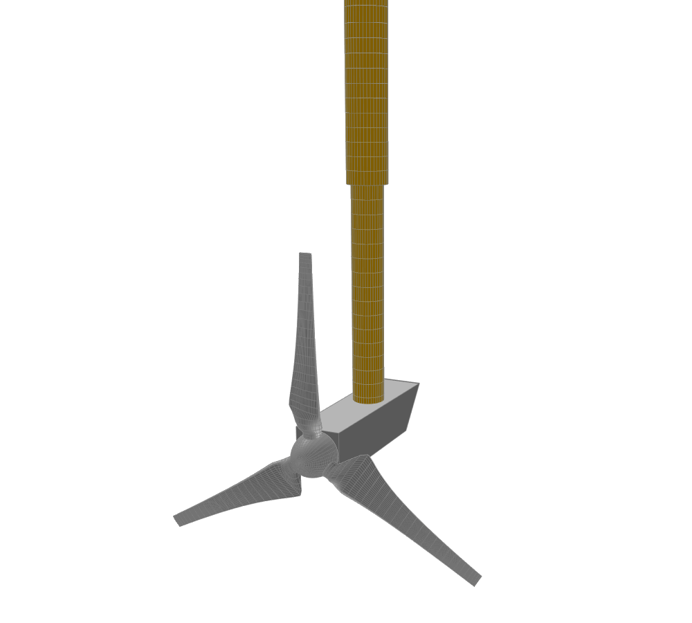

Marine Hydrokinetic Turbines 
----------------------------

.. _fig-mhk_turbine:

    A marine hydrokinetic turbine designed in QBlade.

QBlade also provides the capability to model Marine Hydrokinetic (MHK) Turbines that are operating in water instead of air. When changing from air to water factors such as buoyancy, added mass, and inertia forces become increasingly important. Properly and consistently modeling these effects requires following a specific set of steps which are presented in the sections below.

Simulation Settings for MHK Turbines
************************************

MHK turbines are treated as if they were *onshore* turbines within the modeling framework. This involves substituting the density and viscosity values of air with those corresponding to water to ensure accurate physical properties throughout the model.

 * In the simulation settings, Turbine Environment set the Installation to **Onshore**.
 * Change the **Air Density** value to the respective value for water.
 * Change the **Kinematic Viscosity Air** value to the value for water.

Blade and Tower Model Settings for MHK Turbines
***********************************************

To assign **Added Mass** and **Dynamic Pressure** coefficients to the :ref:`Blade, Strut and Tower Structural Data Files`, specific keywords can simply be added to the structural data table files associated with these components. Additionally, it's possible to activate **Buoyancy** for these components using a dedicated keyword. Below are the relevant keywords explained:

The keyword :code:`ADDEDMASSCOEFF` is employed to assign an added mass coefficient to the blade. This coefficient becomes valuable when modeling marine hydrokinetic turbines (MHK), contributing to the calculation of hydrodynamic inertia force and added-mass force in a Morison-style approach.

For added mass calculations, the blade sections are approximated as flat plates, while the tower and torquetube are assumed to have cylindrical shapes.

.. code-block:: console
	:caption: : Exemplary Added Mass Keyword use
	
	1.2 ADDEDMASSCOEFF

The keyword :code:`DYNPRESSURECOEFF` is used to assign a dynamic pressure coefficient to the blade. This coefficient plays a role in modeling marine hydrokinetic turbines (MHK) and contributes to the Morison-style hydrodynamic inertia force calculation.

.. code-block:: console
	:caption: : Exemplary Dynamic Pressure Coefficient Keyword use
	
	1.2 DYNPRESSURECOEFF

The keyword :code:`BUOYANCYCOEFF` linearly scales the buoyancy calculations for the structure to which it is applied. This accounts for the buoyancy force acting on the cross-sectional area of a blade or tower section. A value of 0.0 means no buoyancy is evaluated. A value of 1.0 calculates buoyancy based on the displaced volume.

.. code-block:: console
	:caption: : Exemplary Buoyancy Keyword use
	
	1.0 BUOYANCYCOEFF
	
Substructure Model Settings for MHK Turbines
********************************************

In the Substructure (see :ref:`Creating a Substructure` section), **Morison Coefficients** and **Buoyancy** can be assigned to various components, following the usual procedure (see :ref:`Morison Equation (Strip Theory) Modelling`). In this context the whole substructure (and turbine) is considered to be *submerged* in water. During the simulation of an *onshore* installed turbine, these coefficients will be used in conjunction with the **Air Density** value that was previously replaced with the value for water (see :ref:`Simulation Settings for MHK Turbines`).