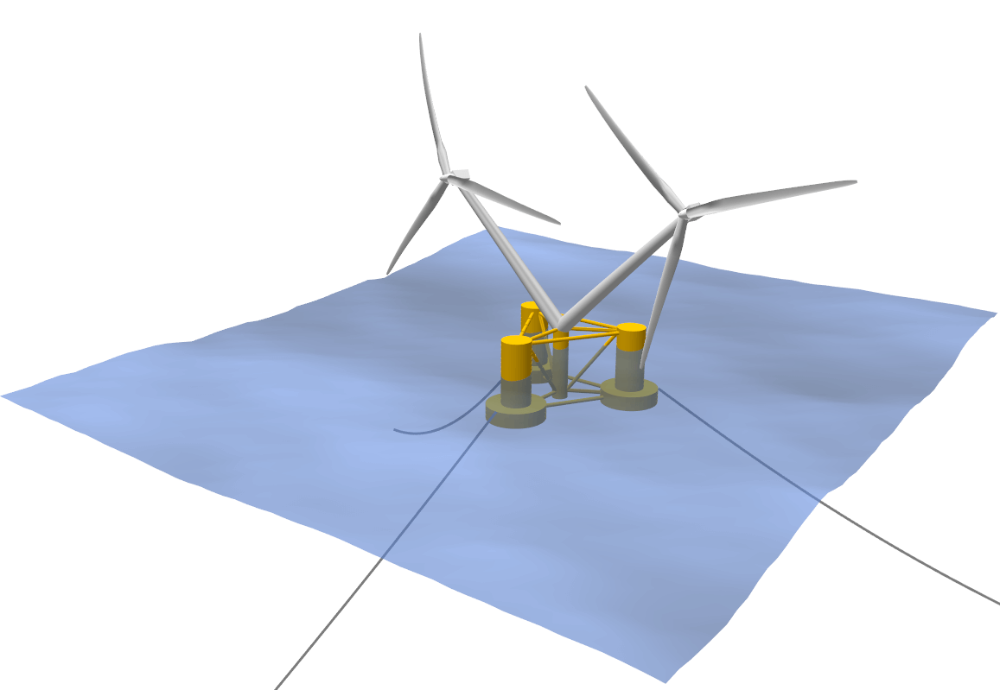

Multi Rotor Turbine Assembly
****************************

**This feature is only available in the Enterprise Edition of QBlade.**

.. _fig-multi_turbine:

    Visualization of a Multi-Rotor Turbine Assembly. 

A turbine with multiple rotors may be defined in the dialog *Menu->Turbine Definition->Create a Multi-Rotor Turbine Assembly*. A Multi-Rotor Assembly requires the definition of a common :ref:`Substructure Definition`. The common substructure definition must then contain multiple transition pieces (**TP_INTERFACE_POS**) that may have different orientations (**TP_ORIENTATION**). If a common substructure is loaded into the Multi Turbine Assembly dialog (see :numref:`fig-multi_turbine_dialog`) a turbine from QBlades database (that contains its own structural definition and controller) can be assigned to each of these transition pieces.

.. _fig-multi_turbine_dialog:
.. figure:: multi_turbine_dialog.png
    :align: center
    :alt: The Multi-Rotor Assembly Dialog.

    The Multi-Rotor Assembly Dialog. 
    
Multi Rotor Turbine Assembly Export
***********************************

A Multi Turbine Assembly can be exported or imported in the ``.mta`` format. The file content points towards the common substructure file and towards the turbine (``.trb``) files that are used in the multi-rotor assembly. See an exemplary ``.mta`` file below:

.. code-block:: console

	----------------------------------------QBlade Multi Turbine Assembly Definition File-------------------------------
	Generated with : QBlade IH v2.0.2_alpha windows
	Archive Format: 310003
	Time : 18:25:50
	Date : 04.07.2022

	----------------------------------------Object Name-----------------------------------------------------------------
	double_OC4                               OBJECTNAME         - the name of the multi-rotor turbine object

	----------------------------------------Assembly Definition---------------------------------------------------------
	OC4_DeepCWindSemi_Sub_LPMD.dat           SUBSTRUCTURE       - the path of the common substructure file that is used in this multi turbine assembly
	NREL_5MW_OC4.trb                         MASTER             - the master turbine of the assembly
	NREL_5MW_OC4.trb                         SLAVE_1            - the slave turbine(s) of the assembly

