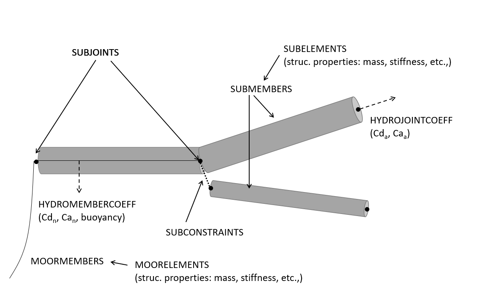

Turbine Structural Definition
=============================

.. _StrDef_BladeTower:

Blade and Tower Definition
--------------------------

See :footcite:t:`Marten19` for the detailed definition of these parameters.

======== ==================== ========================================= =======
Col. Nr. Name                 Explanation                               Unit
======== ==================== ========================================= =======
1        Length               Curved length distance from the first     -
                              body node normalized by the body length        
-------- -------------------- ----------------------------------------- -------
2        Mass density         Mass per unit length                      kg/m
-------- -------------------- ----------------------------------------- -------
3        Bend. stiff. X       Bending Stiffness around X                Nm^2
                              (:math:`EI_{xx}`)         
-------- -------------------- ----------------------------------------- ------- 
4        Bend. stiff. Y       Bending Stiffness around Y                Nm^2
                              (:math:`EI_{yy}`)  
-------- -------------------- ----------------------------------------- ------- 
5        Axial stiff.         Longitudinal Stiffness                    N
                              (:math:`EA`)                   
-------- -------------------- ----------------------------------------- ------- 
6        Tors. stiff.         Torsional Stiffness                       Nm^2
                              (:math:`GJ`)                   
-------- -------------------- ----------------------------------------- ------- 
7        Shear stiff.         Shear Stiffness                           N
                              (:math:`GA`) (not used with Euler beams)     
-------- -------------------- ----------------------------------------- ------- 
8        Str. pitch           Structural pitch angle between reference  deg
                              X axis and elastic X axis         
-------- -------------------- ----------------------------------------- ------- 
9        Shear factor X       Shear factor for force in principal       -
                              bending axis X  
-------- -------------------- ----------------------------------------- ------- 
10       Shear factor Y       Shear factor for force in principal       -
                              bending axis Y
-------- -------------------- ----------------------------------------- ------- 
11       Radius of gyration X Norm. radius of inertia corresponding to  %chord
                              a rotation around the elastic axis X   
-------- -------------------- ----------------------------------------- ------- 
12       Radius of gyration Y Norm. radius of inertia corresponding to  %chord
                              a rotation around the elastic axis Y    
-------- -------------------- ----------------------------------------- ------- 
13       Center of mass X     Norm. center of mass position X           %chord           
-------- -------------------- ----------------------------------------- ------- 
14       Center of mass Y     Norm. center of mass position Y           %chord
-------- -------------------- ----------------------------------------- ------- 
15       Center of elast. X   Norm. center of elasticity position X     %chord
-------- -------------------- ----------------------------------------- ------- 
16       Center of elast. Y   Norm. center of elasticity position Y     %chord
-------- -------------------- ----------------------------------------- ------- 
17       Center of shear X    Norm. center of shear position X          %chord
-------- -------------------- ----------------------------------------- ------- 
18       Center of shear Y    Norm. center of shear position Y          %chord
-------- -------------------- ----------------------------------------- ------- 
19       Diameter             Cross section diameter                    m
-------- -------------------- ----------------------------------------- ------- 
20       Drag                 Drag coefficient for aerodynamic drag     -                                                                                                              
======== ==================== ========================================= =======  

Substructure Definition
-----------------------

As with the other structural definition files, the substructure is defined by a series of keywords that are recognized by QBlade when creating the turbine. The format is the same as with the other structural file definitions: 

 - *<Value>* **<Keyword>**, for parameters defined by a single values.
 - **<Keyword>** <new line> *<Header>* <new line> *<Values>* for parameters defined by a table. 

An example of a parameter that is defined by a table with tree columns is shown below.

=========== ========== ===========
**<Keyword>**
----------------------------------
<Header 1>  <Header 2> <Header 3> 
=========== ========== ===========
<Value 1>   <Value 2>  <Value 3>
=========== ========== ===========

There is no particular oder in which these keywords should be placed. The only exception is when defining tables. When a table is defined by a keyword, it should be immediately followed by the 
table header (optional) and the table content.

.. _fig-substruc-keywords:

    Main keywords used to define the substructure. Each keyword is defined in detail in the text.

The main keywords that are used to define a substructure are shown in :numref:`fig-substruc-keywords`. This figure also shows the relationship between each of the keywords.
It should also be noted that QBlade allows the user to combine elements from the :doc:`../../theory/hydrodynamics/lpft/lpft` and :doc:`../../theory/hydrodynamics/me/me` hydrodynamic models freely. 
So the user should be careful when setting up the substructure in QBlade so that the model remains consistent.

Following keywords can be used to define the substructure.

General Substructure Parameters
^^^^^^^^^^^^^^^^^^^^^^^^^^^^^^^

- **ISFLOATING** is a flag that determines if the substructure is floating of bottom-fixed. If the structure is bottom-fixed the joint coordinates (see **SUBJOINTS** below) are assigned in a coordinate system with its origin placed at the mudline. For floaters, the origin is placed at the mean see level (MSL) and marks the floaters's neutral point (NP)
- **WATERDEPTH** sets the design water depth of substructure.
- **WATERDENSITY**: sets the water density to calculate the mass of the flooded members. Note that this water density is only for the turbine setup and is not used for offshore calculations.
- **STIFFTUNER** is a multiplication factor that affects the stiffness of the flexible elements defined in **SUBELEMENTS**.
- **MASSTUNER** is a multiplication factor that affects the mass density of the elements defined in **SUBELEMENTS**.
- **BUOYANCYTUNER** is a multiplication factor that affects the calculation of the buoyancy forces.
- **ADVANCEDBUOYANCY** is an option to use an advanced discretization technique to calculate buoyancy of partially submerged members, especially useful if non-vertical substructure members are located close to the mean sea level. The value used must be a square integer number.
- **STATICBUOYANCY** is an optional flag that controls the way the buoyancy is calculated in QBlade. If set to true, it calculates the buoyancy considering only the mean sea level. If set to false (default), the local wave elevation is used to calculate the buoyancy.
- **TRANSITIONBLOCK** adds a rectangle between the substructure and the tower base. It is used just for visualization purposes.
  
  ========= ========= =========
  Width     Length    Height 
  ========= ========= =========  
  <Value 1> <Value 2> <Value 3>
  ========= ========= ========= 

- **TRANSITIONCYLINDER** adds a cylinder between the substructure and the tower base. It is used just for visualization purposes.
  
  ========= ========= 
  Height    Diameter  
  ========= =========  
  <Value 1> <Value 2>
  ========= =========  

- **RGBCOLOR** defines the color of the **TRANSITIONBLOCK** or **TRANSITIONCYLINDER**. It is used just for visualization purposes.
  
  ========= ========= =========
  Red       Green     Blue 
  ========= ========= =========  
  <Value 1> <Value 2> <Value 3>
  ========= ========= ========= 

Substructure Geometry and Elements
^^^^^^^^^^^^^^^^^^^^^^^^^^^^^^^^^^

- **SUBJOINTS** is a table that is used to place spatial points that help define the members of the substructure. 
  Each row of the table defines one joint and has four entries: the first gives the id number of the joint and the other three the cartesian coordinates of the joint (in m). The origin is the mudline if **ISFLOATING** is false and the MSL if **ISFLOATING** is true.
  The table is structured as follows:

  ======= ========= ========= =========
  JointID JointX    JointY    JointZ 
  ======= ========= ========= =========  
  1       <Value 1> <Value 2> <Value 3>
  ------- --------- --------- ---------
  ...     ...       ...       ...
  ======= ========= ========= ========= 

- **JOINTOFFSET** is a table that can be used to apply a global offset to the positions of **SUBJOINTS**. Note that the offset is only applied to the joints and not the mass and hydro reference points defined in :ref:`StrDef_LPFT`.
  The table is structured as follows:

  ========= ========= =========
  XOffset   YOffset   ZOffset 
  ========= ========= =========  
  <Value 1> <Value 2> <Value 3>
  ========= ========= ========= 

- **SUBELEMENTS** is a table that defines the flexible elements that will be used for the substructure definition. Each row represents one (cylindrical) element, which is defined by its structural parameters.
  When setting up the substructure, one **SUBELEMENT** definition can be used for several **SUBMEMBERS** (see below). Each row has 20 entries. These define the structural parameters of the element. 
  The entry placement is very similar to the blade and tower structural element table (see :ref:`StrDef_BladeTower`). There two important differences though.
  
  1) The first entry is used to indicate the ID number of the element (ElemID).
  2) The last (20th) entry is used to indicate the Rayleigh damping of the element.

- **SUBELEMENTSRIGID** is a table that defines rigid elements that will be used for the substructure definition. Each row represents one (cylindrical) element, which is defined by two attributes: its mass density and its diameter.
  When setting up the substructure, one **SUBELEMENTRIGID** definition can be used for several **SUBMEMBERS** (see below). An exemplary table is shown below.

  ======= ========= ========= 
  ElemID  MassDens  Diameter   
  ======= ========= =========  
  1       <Value 1> <Value 2>
  ------- --------- ---------
  ...     ...       ...      
  ======= ========= =========  

- **SUBMEMBERS** is a table that contains the members that make up the turbine substructure. A member is defined between two entries of the **SUBJOINTS** table (defined by their ID nr.) and one entry from either the **SUBELEMENT** or **SUBELEMENTRIGID** tables. 
  Additionally, it can have one Morison force coefficients group defined via the **HYDROMEMBERCOEFF** keyword and a marine growth entry from the **MARINEGROWTH** table. Also, this table allows the member to be flooded via a
  flooded cross sectional area entry (in m^2). The member can be subdivided into smaller elements for a more accurate structural and hydrodynamic evaluation. This is done in the 'MembDisc' column; it gives the maximum distance between the 
  discrete subelements of the member (in m). Also, this table has the option to enable the buoyancy forces for the individual members (0 = False, 1 = True). Finally, the member can be optionally named for easier recognition in the output tables.
  The keyword table has the following format:

  ======= ========= ========= ========= ========= ========= ========= ========= ========= ========= ========== 
  MemID   Joint1ID  Joint2ID  ElemID    RigElmID  HyCoID    IsBuoy    MarGroID  FloodArea MembDisc  Name
  ======= ========= ========= ========= ========= ========= ========= ========= ========= ========= ==========    
  1       <Value 1> <Value 2> <Value 3> <Value 4> <Value 5> <Value 6> <Value 7> <Value 8> <Value 9> <Value 10>
  ------- --------- --------- --------- --------- --------- --------- --------- --------- --------- ----------
  ...     ...       ...       ...       ...       ...       ...       ...       ...       ...       ...
  ======= ========= ========= ========= ========= ========= ========= ========= ========= ========= ==========   

- **SUBCONSTRAINTS** is a table that defines the constraints of joints that are not connected by members, constraints of joints to the ground or to one **TP_INTERFACE_POS** transition piece point. 
  Each row of the table has 12 entries. The first entry defines the constraint ID number. The next two entries define the two joints which can be constrained. The forth entry defines the number of the transition piece point (**TP_INTERFACE_POS**) that is to be constrained (see **TP_INTERFACE_POS** keyword and :ref:`StrDef_LPFT`). 
  Note that at least one joint of the substructure should be constrained to the transition piece (defined by **TP_INTERFACE_POS**) and that a constraint is defined **either** between two joints or one joint and one transition piece point. 
  The fifth and sixth entries specify the connection method for bottom-fixed substructures to the ground (see :ref:`StrDef_Mooring`). The fifth entry specifies a stiff constraint with the ground. The sixth entry specifies a constraint to the ground via a non-linear spring-damping element (defined via an ID number). 
  The last 6 entries specify which degrees of freedom are constrained: three translational and three rotational degrees of freedom. 
  For these entries 0 means unconstrained and 1 means constrained.

  ======= ========= ========= ========= ========= ========= ========= ========= ========= ========= ========== ========== 
  ConID   Joint1ID  Joint2ID  TrPID     Fixed     SpringID  DoF_tX    DoF_tY    DoF_tZ    DoF_rX    DoF_rY     DoF_rZ
  ======= ========= ========= ========= ========= ========= ========= ========= ========= ========= ========== ==========    
  1       <Value 1> <Value 2> <Value 3> <Value 4> <Value 5> <Value 6> <Value 7> <Value 8> <Value 9> <Value 10> <Value 11>
  ------- --------- --------- --------- --------- --------- --------- --------- --------- --------- ---------- ----------
  ...     ...       ...       ...       ...       ...       ...       ...       ...       ...       ...        ...
  ======= ========= ========= ========= ========= ========= ========= ========= ========= ========= ========== ==========  

- **MARINEGROWTH** is a table that allows the user to define different types of marine growth that is present in the members. In QBlade, marine growth is simulated as an additional thickness that affects the
  diameter of the cylindrical element. An entry is defined by its ID number, the thickness of the growth (added to the cylinder radius) and the density of the growth.

  ======= ========= =========  
  MaGroID Thickness Density  
  ======= ========= =========  
  1       <Value 1> <Value 2>  
  ------- --------- ---------
  ...     ...       ...      
  ======= ========= ========= 

- **TP_INTERFACE_POS** are the (x,y,z) coordinates (in m) of the position of a particular transition piece point in the substructure. It can for example be the point where the substructure is connected to the tower base. For floating substructures it is defined in (x,y,z) [m] from the MSL = (0,0,0). 
  For bottom fixed substructures, it is defined from the mudline. Note that the inertia and hydrodynamic reference points (**REF_COG_POS** and **REF_HYDRO_POS**) are always constrained to this point (see :ref:`StrDef_LPFT`). There can be several transition piece points. Further points are then defined
  by additional keywords where an underscore and a number is added to the keyword (e.g. **TP_INTERFACE_POS_2**). This allows the user to define additional inertia and hydrodynamic reference points (see :ref:`StrDef_LPFT`). All transition piece points have to be constrained to a least one joint of the substructure via the **SUBCONSTRAINTS** table.  
  The structure of the table is:

  ========= ========= =========
  X-pos     Y-pos     Z-pos 
  ========= ========= =========  
  <Value 1> <Value 2> <Value 3>
  ========= ========= ========= 

Morison Equation-Related Parameters
^^^^^^^^^^^^^^^^^^^^^^^^^^^^^^^^^^^

- **HYDROMEMBERCOEFF** defines a table that contains the hydrodynamic normal coefficients that are used for the different members of the substructure. Each row contains one group of coefficients that can be used by 
  one or more members. The table contains five entries. These are the ID number of the group, the normal drag coefficient, the normal added mass coefficient, the normal dynamic pressure coefficient and a flag that enables the MacCamy-Fuchs correction (MCFC).
  
  ======= ========= ========= ========= =========  
  HyCoID  CdN       CaN       CpN       MCFC   
  ======= ========= ========= ========= =========  
  1       <Value 1> <Value 2> <Value 3> <Value 4>  
  ------- --------- --------- --------- ---------
  ...     ...       ...       ...       ...
  ======= ========= ========= ========= =========    

- **HYDROJOINTCOEFF** is a table that defines hydrodynamic axial coefficients that can be placed at specific joints (defined by their ID number) of the substructure (i.e. at the ends of members). QBlade assumes a spherical end of the element when
  calculating the hydrodynamic axial forces (e.g. :math:`F_a^{ax} = \frac{2\pi}{3}(\frac{d}{2})^3\cdot C_a^{ax}`). The table contains the axial drag, added mass and dynamic pressure axial coefficients and is structured as follows:

  ======= ========= ========= ========= =========  
  CoeffID JointID   CdAx      CaAx      CpAx
  ======= ========= ========= ========= =========  
  1       <Value 1> <Value 2> <Value 3> <Value 4>  
  ------- --------- --------- --------- ---------
  ...     ...       ...       ...       ...
  ======= ========= ========= ========= =========  

- **WAVEKINEVALTYPE** is a flag that control how the local wave kinematics are used to calculate the Morison forces (see :ref:`ME_modeling-considerations`).
  The available options are:

  - 0: local evaluation of wave kinematics, 
  - 1: evaluation at the fixed initial reference position, 
  - 2: evaluation at a lagged position (controlled by **WAVEKINTAU**).
  
- **WAVEKINTAU** is the time constant for the first order low-pass filter used to determine lagged position of the Morison element (when **WAVEKINEVALTYPE** is set to 2).

.. _StrDef_LPFT:

Linear Potential Flow-Related Parameters
^^^^^^^^^^^^^^^^^^^^^^^^^^^^^^^^^^^^^^^^

These parameters are related to the :doc:`../../theory/hydrodynamics/lpft/lpft` (LPFT). :numref:`fig-substruc-lpft-ref` shows three important keywords that are used for the implementation of the LPFT on a potential flow body:
The transition piece point **TP_INTERFACE_POS** the inertia reference point **REF_COG_POS** and the hydrodynamic reference point **REF_HYDRO_POS**. Note that the other keywords in this section are used to specify the forces that act on these reference points.
As explained above, the inertia and hydrodynamic reference points are always constrained to the transition piece point. 

.. _fig-substruc-lpft-ref:
.. figure:: lpft_ref_points.png
    :align: center
    :alt: LPFT ref. points.

    Main reference points for the LPFT keywords. The inertia reference point **REF_COG_POS** and the hydrodynamic reference point **REF_HYDRO_POS** are constrained to the transition piece point **TP_INTERFACE_POS**.

It should be noted that QBlade supports multiple linear potential flow bodies as part of a substructure definition.
In order to include multiple bodies, each body has to have its own set of keywords. The required keywords lie between the entries **REF_COG_POS** and **POT_EXC_FILE**. With the exception of the
first body, additional bodies are defined by adding an underscore and a number after the keyword. So, for example, if a substructure has two bodies that use the linear potential flow theory,
the second body would be defined by adding a second transition piece point **TP_INTERFACE_POS_2**  with its corresponding inertia point denoted as **REF_COG_POS_2**, a mass matrix denoted as **SUB_MASS_2** and so on. 

- **REF_COG_POS** defines the (x,y,z) position (in m) of a inertia point of the system (i.e. the center of gravity). It is in this position that the **SUB_MASS** matrix is evaluated.
  This point is automatically constrained to the transition piece, defined by **TP_INTERFACE_POS**. It has the following format:
  
  ========= ========= =========
  X-pos     Y-pos     Z-pos 
  ========= ========= =========  
  <Value 1> <Value 2> <Value 3>
  ========= ========= =========

- **SUB_MASS** defines a complete 6 by 6 mass and rotational inertia matrix that is placed in the location defined by the **REF_COG_POS** keyword.
  The units are kg for the mass and kg m^2 for the inertias. An example of this matrix is shown below:

  ========= ========= ========= ============== ============== ==============
  Mass      0         0         0              0              0
  --------- --------- --------- -------------- -------------- --------------
  0         Mass      0         0              0              0
  --------- --------- --------- -------------- -------------- --------------
  0         0         Mass      0              0              0
  --------- --------- --------- -------------- -------------- --------------
  0         0         0         :math:`I_{xx}` 0              0
  --------- --------- --------- -------------- -------------- --------------
  0         0         0         0              :math:`I_{yy}` 0
  --------- --------- --------- -------------- -------------- --------------
  0         0         0         0              0              :math:`I_{zz}`
  ========= ========= ========= ============== ============== ==============

- **REF_HYDRO_POS** defines the (x,y,z) position (in m) of a hydrodynamic evaluation point of the system (i.e. where the lumped hydrodynamic forces are applied). 
  It is in this position that the hydrodynamic matrices (e.g. **SUB_HYDROSTIFFNESS**, **SUB_HYDRODAMPING**, **SUB_HYDROADDEDMASS**, etc.) and the radiation and excitation forces are applied.
  This point is directly constrained to the **TP_INTERFACE_POS** point, so no additional constraints are necessary to attach this point to the substructure.
  It has the following format:

  ========= ========= =========
  X-pos     Y-pos     Z-pos 
  ========= ========= =========  
  <Value 1> <Value 2> <Value 3>
  ========= ========= =========

- **SUB_HYDROSTIFFNESS** defines a complete 6 by 6 stiffness matrix that is evaluated in the location defined by the **REF_HYDRO_POS** keyword.
  The units are N/m, N/rad, Nm/m, Nm/rad, depending on the entry. The general form of this matrix is shown below:

  ============== ============== ============== ============== ============== ==============
  :math:`K_{11}` :math:`K_{12}` :math:`K_{13}` :math:`K_{14}` :math:`K_{15}` :math:`K_{16}`
  -------------- -------------- -------------- -------------- -------------- --------------
  :math:`K_{21}` :math:`K_{22}` :math:`K_{23}` :math:`K_{24}` :math:`K_{25}` :math:`K_{26}`
  -------------- -------------- -------------- -------------- -------------- --------------
  :math:`K_{31}` :math:`K_{32}` :math:`K_{33}` :math:`K_{34}` :math:`K_{35}` :math:`K_{36}`
  -------------- -------------- -------------- -------------- -------------- --------------
  :math:`K_{41}` :math:`K_{42}` :math:`K_{43}` :math:`K_{44}` :math:`K_{45}` :math:`K_{46}`
  -------------- -------------- -------------- -------------- -------------- --------------
  :math:`K_{51}` :math:`K_{52}` :math:`K_{53}` :math:`K_{54}` :math:`K_{55}` :math:`K_{56}`
  -------------- -------------- -------------- -------------- -------------- --------------
  :math:`K_{61}` :math:`K_{62}` :math:`K_{63}` :math:`K_{64}` :math:`K_{65}` :math:`K_{66}`
  ============== ============== ============== ============== ============== ==============

- **SUB_HYDRODAMPING** defines a complete 6 by 6 damping matrix that is evaluated in the location defined by the **REF_HYDRO_POS** keyword.
  The units are N/(m/s), N/(rad/s), Nm/(m/s) or Nm/(rad/s), depending on the entry. This matrix has the same form as the **SUB_HYDROSTIFFNESS** matrix.

- **SUB_HYDROQUADDAMPING** defines a complete 6 by 6 quadratic damping matrix that is evaluated in the location defined by the **REF_HYDRO_POS** keyword.
  The units are N/(m/s)^2, N/(rad/s)^2, Nm/(m/s)^2, Nm/(rad/s)^2, depending on the entry. This matrix has the same form as the **SUB_HYDROSTIFFNESS** matrix.

- **SUB_HYDROADDEDMASS** defines a complete 6 by 6 added mass matrix that is evaluated in the location defined by the **REF_HYDRO_POS** keyword.
  The units are kg. This matrix has the same form as the **SUB_HYDROSTIFFNESS** matrix.

- **SUB_CONSTFORCE** applies a constant force (and/or torque) to the **REF_HYDRO_POS** point. It can be used to e.g. model linear buoyancy forces.
  The units are N or Nm, depending on the entry.
  
  ============== ============== ============== ============== ============== ==============
  :math:`F_{1}`  :math:`F_{2}`  :math:`F_{3}`  :math:`F_{4}`  :math:`F_{5}`  :math:`F_{6}`
  ============== ============== ============== ============== ============== ==============

- **POT_RAD_FILE** defines the file where the radiation coefficients for the linear potential flow model are located. The file ending must be included. This determines the format of the file.
  QBlade currently supports radiation files in the WAMIT, NEMOH and BEMUse formats.

- **POT_EXC_FILE** defines the file where the excitation coefficients for the linear potential flow model are located. The file ending must be included. This determines the format of the file.
  QBlade currently supports excitation files in the WAMIT, NEMOH and BEMUse formats.

- **USE_RADIATION** is a flag that enables the calculation of the radiation loads on all potential flow bodies.
- **DELTA_FREQ_RAD** is the discretization of the frequencies used for the calculation of the radiation forces (in Hz).
- **TRUNC_TIME_RAD** is the truncation time for the wave radiation kernel calculations (in s). 
- **USE_EXCITATION** is a flag that enables the calculation of the excitation loads on all potential flow bodies.
- **DELTA_FREQ_DIFF** is the discretization of the frequencies used for the calculation of the excitation forces (in Hz).
- **DELTA_DIR_DIFF** is the discretization of the directions used for the calculation of multi-directional excitation forces (in rad).
- **TRUNC_TIME_DIFF** is the truncation time for the wave excitation kernel calculations (in s). 

.. _StrDef_Mooring:

Cable Elements, Ground-Fixing and Station-Keeping Parameters
^^^^^^^^^^^^^^^^^^^^^^^^^^^^^^^^^^^^^^^^^^^^^^^^^^^^^^^^^^^^
The connection to the ground is handled differently for floating and fixed-bottom substructures. For floating substructures, the anchoring is done via the mooring lines defined with the **MOORELEMENTS** and 
**MOORMEMBERS** keywords. These keywords can also be used to define flexible cable elements of the substructure. For bottom-fixed substructures, the connection the ground is defined in the **SUBCONSTRAINTS** table.
It can be either a rigid connection or a connection via a system of non-linear springs and dampers. These latter elements are defined with the keywords **NLSPRINGDAMPERS** and optionally **SPRINGDAMPK**.

- **MOORELEMENTS** is a table that contains the structural parameters of the flexible cable elements of the substructure such as mooring lines. Each row defines one set of parameters and has 7 values. These are the mooring element ID number, the mass density (in kg/m^3), the cross sectional area used for structural calculations (in m^2),
  the second moment of area (in m^4), Young's modulus if the cable element (in N/m^2), the Rayleigh damping and the effective diameter of the cable used for hydrodynamic calculations.

  ======= ========= ========= ============= ============ ========= =========
  MoorID  Mass dens Area      2nd Mom. Area Young's Mod. R. Damp.  Diameter 
  ======= ========= ========= ============= ============ ========= =========   
  1       <Value 1> <Value 2> <Value 3>     <Value 4>    <Value 5> <Value 6>
  ------- --------- --------- ------------- ------------ --------- ---------
  ...     ...       ...       ...           ...          ...       ...       
  ======= ========= ========= ============= ============ ========= =========  

- **MOORMEMBERS** is a table that contains the information of the cable members (such as the mooring lines). Each row defines one cable member and has 10 entries. The first entry is the ID number of the cable member.
  The next two entries are the connection points of the cable member. There are several ways of defining the connection points. These are:
  
  - With the keyword **JNT_<Nr>**, where <Nr> represents the number of the joint. This way, the cable is connected directly to a existing joint.
  - With the keyword **FLT_<XPos>_<YPos>_<ZPos>**, where <XPos>_<YPos>_<ZPos> represent the (x,y,z) coordinates of the connection point (in m). Here, QBlade creates a constraint between this point and the floater to attach the cable.
  - With the keyword **GRD_<XPos>_<YPos>**, where <XPos>_<YPos> represent the (x,y) coordinates of the anchor point (in m).
  
  The fourth entry is the length of the cable (in m). The fifth entry is the ID number of the cable element defined in **MOORELEMENTS**. The sixth entry is the ID number of the hydrodynamic coefficient group defined in **HYDROMEMBERCOEFF**.
  The seventh entry specifies if the cable is buoyant (= 1) or not (= 0). The eighth entry specifies the ID number of the marine growth element used for this cable (see **MARINEGROWTH**). The ninth entry is the number of discretization elements used 
  to discretize the cable and the tenth entry is the name of the cable element.

  ======= ========= ========= ========= ========= ========= ========= ========= ========= =========  
  MMemID  Conn1     Conn2     Length    MoorID    HyCoID    IsBuoy    MaGroID   MembDisc  Name      
  ======= ========= ========= ========= ========= ========= ========= ========= ========= =========     
  1       <Value 1> <Value 2> <Value 3> <Value 4> <Value 5> <Value 6> <Value 7> <Value 8> <Value 9>
  ------- --------- --------- --------- --------- --------- --------- --------- --------- ---------
  ...     ...       ...       ...       ...       ...       ...       ...       ...       ...       
  ======= ========= ========= ========= ========= ========= ========= ========= ========= =========  

- **NLSPRINGDAMPERS** is a table that defines one or more non-linear spring-damper systems for connecting the substructure to the ground. 
  Each row represents a spring-damper system and has 2N + 3 entries, where N is the number of points on the definition table of the non-linear spring/damper.
  The first entry represents the ID number of the system (used in the **SUBCONSTRAINTS** table). The second entry defines the type of system that is being modelled.
  There are two options: 'spring' and 'damp'. This affects the way the coefficients in the following entries are interpreted. 

  - If 'spring' is selected, then QBlade expects the definition table to consists of displacement (in m) and stiffness (in N/m) entries.
  - If 'damp' is selected, then QBlade expects the definition table to consist of velocity (in m/s) and damping (in N/(m/s)) entires.
  
  The third row represents the stiffness/damping at zero displacement/velocity. The following 2N entries represent the additional lookup table entries for the non-linear spring/damper system.
  The order is :math:`x_1/v_1`, :math:`K/D(x_1/v_1)`; :math:`x_2/v_2`, :math:`K/D(x_2/v_2)` and so on.

  ======== ========= ==================== =============== ==================== =============== ==================== =========
  SpringID Type      :math:`K/D(x/v = 0)` :math:`x_1/v_1` :math:`K/D(x_1/v_1)` :math:`x_2/v_2` :math:`K/D(x_2/v_2)` ...
  ======== ========= ==================== =============== ==================== =============== ==================== =========  
  1        <Value 1> <Value 2>            <Value 3>       <Value 4>            <Value 5>       <Value 6>            ...
  -------- --------- -------------------- --------------- -------------------- --------------- -------------------- ---------
  ...      ...       ...                  ...             ...                  ...             ...                  ...       
  ======== ========= ==================== =============== ==================== =============== ==================== =========   

- **SPRINGDAMPK** is an optional proportionality constant to add a damping value to the spring elements. If this keyword is used, then
  all of the spring elements defined in **NLSPRINGDAMPERS** are treated as spring-damping systems. The additional damping coefficients are
  calculated using the following approach: :math:`D_i`  = **SPRINGDAMPK** :math:`\cdot K_i`.  This keyword does not affect the 'damp' elements defined in **NLSPRINGDAMPERS**.

Setting the Output Sensors
^^^^^^^^^^^^^^^^^^^^^^^^^^^

The output for the substructure is also controlled by keywords. QBlade can generate output for the members defined in the **SUBMEMBERS** and in the **MOORMEMBERS** tables.
The logic of defining an ouput is as follows:

- **SUB_<MemID>_<RelPos>** is the keyword used for setting an output of the submember with the ID number = <MemID> and a relative postion = <RelPos>. The relative position goes from 0 (= the position of Joint1ID) to 1 (= the postion of Joint2ID).
- **MOO_<MMemID>_<RelPos>** is the keyword used for setting an output of the cable member with the ID number = <MMemID> and a relative postion = <RelPos>. The relative position goes from 0 (= the position of Conn1) to 1 (= the postion of Conn2).
  