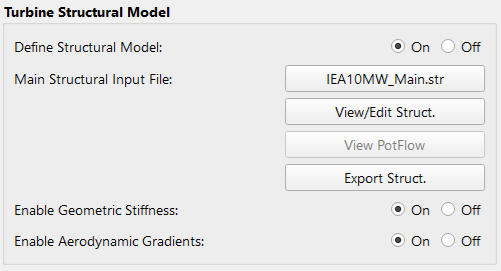
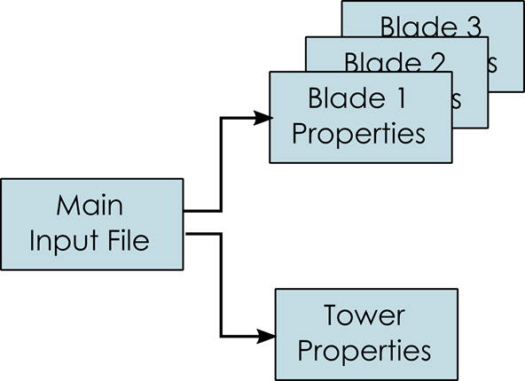
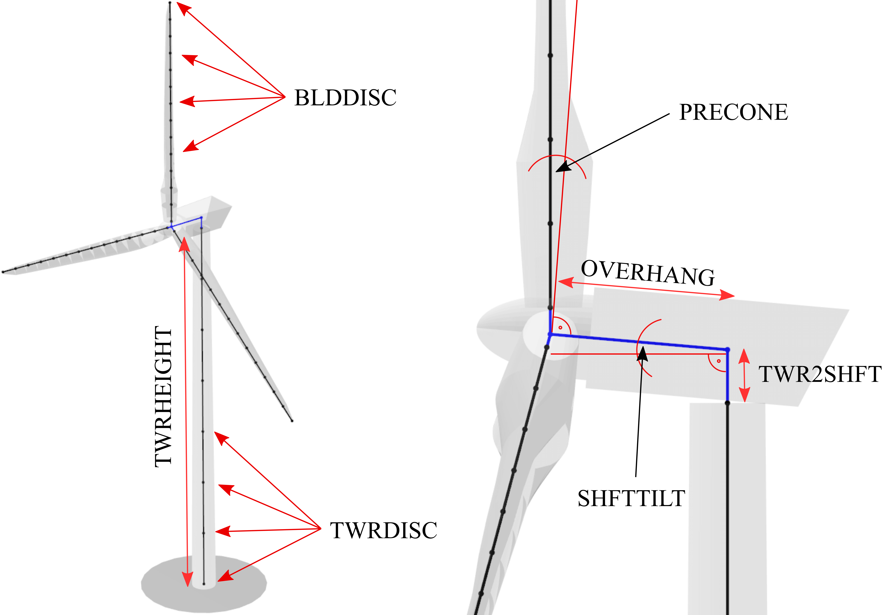
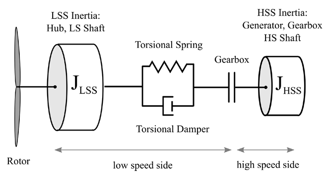
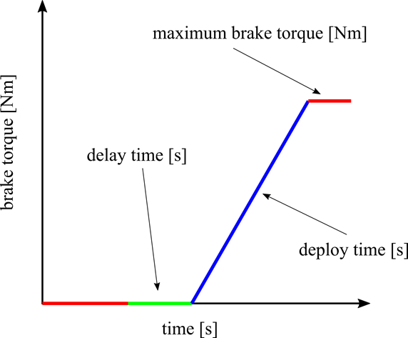
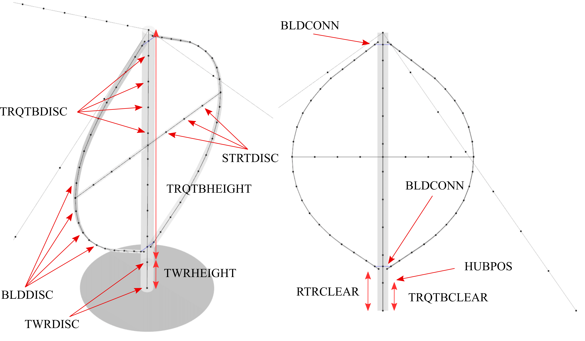
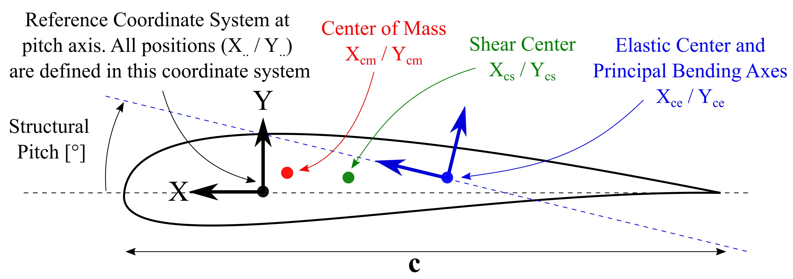
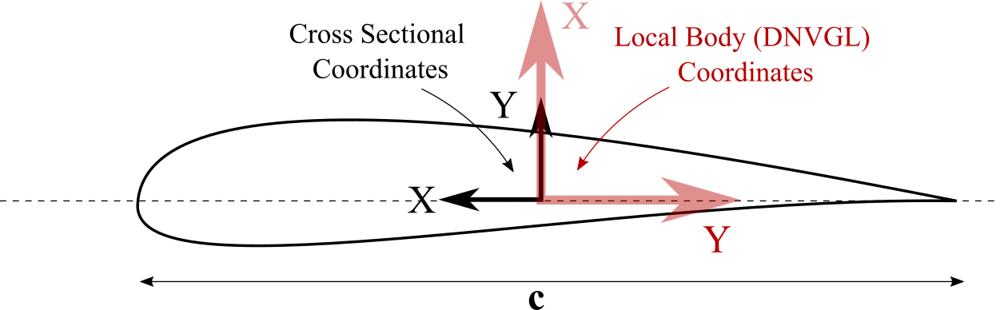

Structural Modeling
###################

A structural turbine model in QBlade is defined by a set of ASCII input files that describe the overall dimensions of the turbine and the structural properties of the various turbine components. *Structural properties* in this sense relates broadly to the mass, inertia, stiffness and damping properties that are required by the structural simulation engine to resolve the structural dynamics. In most cases these structural properties need to be obtained from specialized software, for example software that is build to design a structural blade layout and can generate the cross-sectional mass, stiffness and damping properties that are required to setup a structural model in QBlade. An overview of the how the turbine structure is modeled through the integration of Project-CHRONO in QBlade can be found in the section: :ref:`Multi Body Beam Formulation`. 

A structural model may be loaded into a turbine definition by loading the structural model main file through the open file dialog. When a structural model has been assigned to a turbine the structural model files may be examined by clicking **View/Edit Struct**. The dialog that shows the file contents can also be used to quickly change parameters of the structural model, without the need to modify and save the file outside of QBlade and then importing them again. This edit functionality however doesn't cause to *reload* files from the file system, such that changing the string of a blade parameter table doesn't lead to reloading the newly defined filename. Generally, it is recommended to only use this edit functionality to quickly change a few parameters, but to setup and work with the structural model files outside of QBlade in a text editor.

.. _fig-structural_dialog:

    
    The structural model dialog.
    
An overview of the file structure of the structural model definition files is shown in :numref:`fig-file_structure`. The main input file needs to be loaded through the dialog. It contains the main turbine parameters and the location of the structural data tables for the definition of the tower and the blades. 
    
.. _fig-file_structure:

    
    The file structure of the structural model input files.

.. _StrDef_MainFile:

Main Structural Definition File
===============================

Within the main definition file the overall dimensions of the wind turbine are defined. Furthermore, nacelle mass and inertia and drivetrain properties are defined here. The main input file also contains the file locations of the structural data tables that define the detailed structural properties of the blades, tower and the torquetube (for a VAWT turbine). An overview of important parameters that define the turbine geometry and dimensions is shown in :numref:`fig-struct_hawt` and :numref:`fig-struct_vawt`.

Exemplary Main File
-------------------

An exemplary main structural input file for the NREL 5MW HAWT wind turbine is shown below and will be discussed in more detail in the following:

.. code-block:: console
	:caption: : Main Input File

	---------------------- QBLADE STRUCTURAL MODEL INPUT FILE -----------------
	NREL 5MW Turbine
	------------------------------- CHRONO PARAMETERS -------------------------
	0.2		GLBGEOEPS - Global geometry epsilon for node placement

	------------------------------- HAWT TURBINE CONFIGURATION ----------------
	2.5		PRECONE - Rotor PreCone (deg) (HAWT only)
	5		SHFTTILT - Turbine Shaft Tilt (deg) (HAWT only)
	5.0191		OVERHANG - Rotor Overhang (m) (HAWT only)
	1.96256		TWR2SHFT - Tower to Shaft distance (m) (HAWT only)

	------------------------------- MASS AND INERTIA --------------------------
	0.0		YAWBRMASS - Yaw Bearing Mass (kg) (HAWT only)
	240000		NACMASS - Nacelle Mass (kg) (HAWT only)
	1.9    		NACCMX - Downwind distance from the tower-top to the nacelle CM (m) (HAWT only)
	0.0      	NACCMY - Lateral  distance from the tower-top to the nacelle CM (m) (HAWT only)
	1.75   		NACCMZ - Vertical distance from the tower-top to the nacelle CM (m) (HAWT only)
	2607890		NACYINER - Nacelle Yaw Inertia (kg*m^2) (HAWT only)
	56780		HUBMASS - Hub Mass (kg)
	115926		HUBINER - Hub Inertia (kg*m^2)

	------------------------------- DRIVETRAIN MODEL --------------------------
	97		GBRATIO - gearbox ratio (N)
	1.0		GBOXEFF - gearbox efficiency (0-1)
	1.0		GENEFF - generator efficiency  (0-1)
	true		DRTRDOF - model drivetrain dynamics (true / false)
	534.116		GENINER	- Generator side (HSS) Inertia (kg*m^2)
	867637000	DTTORSPR - Drivetrain torsional stiffness (N*m/rad)
	6215000		DTTORDMP - Drivetrain torsional damping (N*m*s/rad)

	------------------------------- BRAKE MODEL -------------------------------
	0		BRKTORQUE - maximum brake torque
	0		BRKDEPLOY - brake deploy time (s) (only used with DTU style controllers)
	0		BRKDELAY - brake delay time (s) (only used with DTU style controllers)

	------------------------------- SENSOR ERRORS -----------------------------
	0		ERRORYAW - yaw error (deg) (HAWT only)
	0		ERRORPITCH_1 - pitch error blade1 (deg)
	0		ERRORPITCH_2 - pitch error blade2 (deg)
	0		ERRORPITCH_3 - pitch error blade3 (deg)

	------------------------------- BLADES ------------------------------------
	3				NUMBLD - Number of blades 
	NREL5MW_Blade.str		BLDFILE_1 - Name of file containing properties for blade 1
	NREL5MW_Blade.str		BLDFILE_2 - Name of file containing properties for blade 2
	NREL5MW_Blade.str		BLDFILE_3 - Name of file containing properties for blade 3

	------------------------------- TOWER -------------------------------------
	77.6				TWRHEIGHT - Height of the tower (m)
	OC3_Sparbuoy_Tower.str		TWRFILE - Name of file containing properties for the tower
	OC3_Sparbuoy_Sub_LPMD.str	SUBFILE	 - Name of the substructure file

	------------------------------- DATA OUTPUT TYPES -------------------------
	true			FOR_OUT - store (local) forces at all chosen locations 
	true			ROT_OUT - store (local) body rotations at all chosen locations 
	true			MOM_OUT - store (local) moments at all chosen locations 
	true			DEF_OUT - store (local) deflections at all chosen locations 
	true			POS_OUT - store (global) positions at all chosen locations 
	true			VEL_OUT - store (global) velocities at all chosen locations 
	true			ACC_OUT - store (global) accelerations at all chosen locations
	true			LVE_OUT - store (local) velocities at all chosen locations
	true			LAC_OUT - store (local) accelerations at all chosen locations

	------------------------------- DATA OUTPUT LOCATIONS ---------------------
	any number, or zero, user defined positions can be chosen as output locations. 
	Locations can be assigned at any of the following components: blades, struts, tower 
	and guy cables. See the following examples for the used nomenclature:

	BLD_1_1.0		- exemplary position, blade 1 at 100% normalized radius 
	BLD_1_0.8		- exemplary position, blade 1 at  80% normalized radius 
	BLD_1_0.5		- exemplary position, blade 1 at  50% normalized radius 
	BLD_1_0.4		- exemplary position, blade 1 at  40% normalized radius 
	BLD_1_0.2		- exemplary position, blade 1 at  20% normalized radius 
	BLD_1_0.0		- exemplary position, blade 1 at  00% normalized radius 

	BLD_2_1.0		- exemplary position, blade 2 at 100% normalized radius 
	BLD_2_0.8		- exemplary position, blade 2 at  80% normalized radius 
	BLD_2_0.5		- exemplary position, blade 2 at  50% normalized radius
	BLD_2_0.4		- exemplary position, blade 2 at  40% normalized radius 
	BLD_2_0.2		- exemplary position, blade 2 at  20% normalized radius 
	BLD_2_0.0		- exemplary position, blade 2 at  00% normalized radius 

	BLD_3_1.0		- exemplary position, blade 3 at 100% normalized radius 
	BLD_3_0.8		- exemplary position, blade 3 at  80% normalized radius 
	BLD_3_0.5		- exemplary position, blade 3 at  50% normalized radius
	BLD_3_0.4		- exemplary position, blade 3 at  40% normalized radius 
	BLD_3_0.2		- exemplary position, blade 3 at  20% normalized radius 
	BLD_3_0.0		- exemplary position, blade 3 at  00% normalized radius 

	TWR_1.00		- exemplary position, tower at 100% normalized height 
	TWR_0.90		- exemplary position, tower at  90% normalized height 
	TWR_0.80		- exemplary position, tower at  80% normalized height 
	TWR_0.70		- exemplary position, tower at  70% normalized height 
	TWR_0.60		- exemplary position, tower at  60% normalized height 
	TWR_0.50		- exemplary position, tower at  50% normalized height 
	TWR_0.40		- exemplary position, tower at  40% normalized height 
	TWR_0.30		- exemplary position, tower at  30% normalized height 
	TWR_0.20		- exemplary position, tower at  20% normalized height 
	TWR_0.10		- exemplary position, tower at  10% normalized height 
	TWR_0.00		- exemplary position, tower at   0% normalized height 

The different sections of the structural model input file will now be briefly discussed.

HAWT Turbine Configuration
--------------------------

.. _fig-struct_hawt:

    
    Overview of geometrical parameters for a HAWT turbine.

.. code-block:: console
	:caption: : HAWT Turbine Configuration

	------------------------------- HAWT TURBINE CONFIGURATION ----------------
	2.5		PRECONE - Rotor PreCone (deg) (HAWT only)
	5		SHFTTILT - Turbine Shaft Tilt (deg) (HAWT only)
	5.0191		OVERHANG - Rotor Overhang (m) (HAWT only)
	1.96256		TWR2SHFT - Tower to Shaft distance (m) (HAWT only)
	
In this section of the file the main geometrical turbine parameters are defined. These parameters are equivalent to the parameters discussed in :ref:`Turbine Geometry`.

Mass and Inertia Parameters
---------------------------

.. code-block:: console
	:caption: : Mass and inertia parameters
	
	------------------------------- MASS AND INERTIA --------------------------
	0.0		YAWBRMASS - Yaw Bearing Mass (kg) (HAWT only)
	240000		NACMASS - Nacelle Mass (kg) (HAWT only)
	1.9    		NACCMX - Downwind distance from the tower-top to the nacelle CM (m) (HAWT only)
	0.0      	NACCMY - Lateral  distance from the tower-top to the nacelle CM (m) (HAWT only)
	1.75   		NACCMZ - Vertical distance from the tower-top to the nacelle CM (m) (HAWT only)
	2607890		NACYINER - Nacelle Yaw Inertia (kg*m^2) (HAWT only)
	56780		HUBMASS - Hub Mass (kg)
	115926		HUBINER - Hub Inertia (kg*m^2)
	
In this section of the input file mass and inertia properties are assigned to the nacelle and the hub. It should be noted here that the parameter :code:`HUBINER` should only account for the rotational inertia of the hub itself, and not account for the inertia of the rotor blades as this is explicity included through the finite element model. 

Mass and Inertia Parameters Extended
^^^^^^^^^^^^^^^^^^^^^^^^^^^^^^^^^^^^

:code:`NACCM`
 this (alternative) keyword can be used to set the center of mass of the nacelle in a single line by specifying the x, y and z positions before or after the keyword.
 
:code:`NACINER`
 this (alternative) keyword can be used to define the full inertia matrix of the nacelle (applied at the nacelle CM. Six values can be specified to define the XX, YY, ZZ, XY, XZ and YZ inertia of the nacelle.

:code:`HUBINER`
 this (alternative) keyword can be used to define the full inertia matrix of the hub (applied at the hub position. Six values can be specified to define the XX, YY, ZZ, XY, XZ and YZ inertia of the hub.

Nacelle Drag Model
------------------

.. code-block:: console
	:caption: : Nacelle drag

	------------------------------- NACELLE DRAG ------------------------------
	10.0    	NACCAX - Downwind distance from the tower-top to the nacelle CD (m) (HAWT only)
	0.0      	NACCAY - Lateral  distance from the tower-top to the nacelle CD (m) (HAWT only)
	1.75   		NACCAZ - Vertical distance from the tower-top to the nacelle CD (m) (HAWT only)
	15    		NACARX - Downwind area of the nacelle (m^2) (HAWT only)
	90      	NACARY - Lateral  area of the nacelle (m^2) (HAWT only)
	60   		NACARZ - Vertical area of the nacelle (m^2) (HAWT only)
	1.2    		NACCDX - Downwind drag coefficient of the nacelle (-) (HAWT only)
	1.2      	NACCDY - Lateral drag coefficient of the nacelle (-) (HAWT only)
	1.2   		NACCDZ - Vertical drag coefficient of the nacelle (-) (HAWT only)
	
The nacelle drag model is optional. If no nacelle drag is defined no nacelle drag is applied. The nacelle drag can only be used with HAWT turbine definitions. The model defined a center of drag (NACCA) and three nacelle areas (NACAR) with three nacelle drag coefficients (NACCD). The total acting nacelle drag force in all directions is then summed up and applied at the center of drag (NACCD).

Drivetrain Parameters
---------------------

.. code-block:: console
	:caption: : Drivetrain parameters

	------------------------------- DRIVETRAIN MODEL --------------------------
	97		GBRATIO - gearbox ratio (N)
	1.0		GBOXEFF - gearbox efficiency (0-1)
	1.0		GENEFF - generator efficiency  (0-1)
	true		DRTRDOF - model drivetrain dynamics (true / false)
	534.116		GENINER	- Generator side (HSS) Inertia (kg*m^2)
	867637000	DTTORSPR - Drivetrain torsional stiffness (N*m/rad)
	6215000		DTTORDMP - Drivetrain torsional damping (N*m*s/rad)
	
This section of the main input file defined the drive train model. The drive train model in QBlade is a simple 2 mass spring-damper model. An overview is given in :numref:`fig-drivetrain`. The parameter **GBOXEFF** define the mechanical losses within the gearbox, **GENEFF** defined the electrical losses within the generator.
The drivetrain is parameterized by the main shaft torsional stiffness and damping, a high speed side (HSS) generator inertia and the low speed side (LSS) inertia. The LSS inertia (of shaft and Hub combined) should be summed up and assigned to the :code:`HUBINER` value. 

.. _fig-drivetrain:

    
    An overview of the drivetrain model in QBlade.
    

Brake Model Parameters
----------------------    

.. code-block:: console
	:caption: : Brake model parameters

	------------------------------- BRAKE MODEL -------------------------------
	0			BRKTORQUE - maximum brake torque
	0			BRKDEPLOY - brake deploy time (s) 
	0			BRKDELAY - brake delay time (s)

The brake in QBlade is defined as shown above. The brake is parameterized with a delay time, a deploy time and a maximum value for the brake torque. After the brake signal is emitted from the controller, or a brake event, after the delay time (:code:`BRKDELAY`) has passed the brake is activated and ramped up to the maximum brake torque (:code:`BRKTORQUE`) during the deploy time (:code:`BRKDEPLOY`). An overview of this process is shown in :numref:`fig-brake`.	

.. _fig-brake:

    
    An overview of the brake model in QBlade.
    
Modeling Sensor Errors
----------------------  

.. code-block:: console	
	:caption: : Sensor errors
 
    	------------------------------- SENSOR ERRORS -----------------------------
	0		ERRORYAW - yaw error (deg) (HAWT only)
	0		ERRORPITCH_1 - pitch error blade1 (deg)
	0		ERRORPITCH_2 - pitch error blade2 (deg)
	0		ERRORPITCH_3 - pitch error blade3 (deg)
	
Sensor errors are defined for each blade pitch bearing sensor and the yaw bearing sensor. These errors are simply added to the corresponding signals as an offset.

Blade Parameters
----------------

.. code-block:: console
	:caption: : Blade parameters
	
	------------------------------- BLADES ------------------------------------
	3				NUMBLD - Number of blades 
	NREL5MW_Blade.str		BLDFILE_1 - Name of file containing properties for blade 1
	NREL5MW_Blade.str		BLDFILE_2 - Name of file containing properties for blade 2
	NREL5MW_Blade.str		BLDFILE_3 - Name of file containing properties for blade 3
	
The location of the structural data tables for the blades is defined by the keywords shown above. The number of blades is defined by the parameter :code:`NUMBLD`, this value overrides the number of blades that is defined in the turbine definition dialog. For each blade a keyword :code:`BLDFILE_X` is searched for where the filename of the blade data table is defined. Different blade data tables can be assigned to each individual blade.

Tower Parameters
----------------

.. code-block:: console
	:caption: : Tower parameters

	------------------------------- TOWER -------------------------------------
	77.6						TWRHEIGHT - Height of the tower (m)
	OC3_Sparbuoy_Tower.str		TWRFILE - Name of file containing properties for the tower
	OC3_Sparbuoy_Sub_LPMD.str	SUBFILE	 - Name of the substructure file
	
The structural tower data table is defined in a similar fashion as for the blades. The keyword :code:`TWRHEIGHT` defines the absolute height of the tower. The keyword :code:`SUBFILE` points to a substructure file that can be used to define a more complicated floating or bottom fixed substructure for offshore wind turbines or to model soil dynamics. If the keyword :code:`SUBFILE` is not defined then the tower will simply be rigidly constrained to the ground. More information on how a substructure file is defined is found in the section: :ref:`Substructure Modeling`.

VAWT Specific Parameters
------------------------

.. _fig-struct_vawt:

    
    Overview of geometrical parameters for a VAWT turbine.

Strut Parameters
^^^^^^^^^^^^^^^^

.. code-block:: console
	:caption: : Strut parameters
	
	------------------------------- STRUTS ------------------------------------
	strutF100.dat		STRTFILE_1 - Name of file containing properties for strut1 (if blade has struts)
	strutF100.dat		STRTFILE_2 - Name of file containing properties for strut2 (if blade has struts)
	
One structural properties table is defined for each strut. This table is used for the corresponding strut on each blade. So if there are three blades the parameter :code`STRTFILE_1` specifies the properties of strut 1 on each of the three blades. 

Strut Constraint Table
^^^^^^^^^^^^^^^^^^^^^^

In some cases, the user may want to specify a special constraint for the connection between the strut and the blade, or the strut and the torquetube, for example to model a hinge or similar. By default, each strut is connected rigidly to the blade and the torquetube. The :code:`STRUT_BLADE_CONSTRAINTS` and :code:`STRUT_TORQUETUBE_CONSTRAINTS` tables can be used to control the constrained degrees of freedom between struts, blades and the torquetube. The DOFs are defined in the local coordinate system of the corresponding strut.

.. code-block:: console
	:caption: : The STRUT_BLADE_CONSTRAINTS table
	
	STRUT_BLADE_CONSTRAINTS
	STR_ID	BLD_ID	DoF_X	DoF_Y	DoF_Z	DoF_rX	DoF_rY	DoF_rZ
	1	1	1	1	1	1	0	1
	1	2	1	1	1	1	0	1
	
This exemplary table models a hinge connection between strut 1 and blade 1 and strut 1 and blade 2, where the rotational degree of freedom around the local y-axis of the strut is not constrained.

.. code-block:: console
	:caption: : The STRUT_TORQUETUBE_CONSTRAINTS table
	
	STRUT_TORQUETUBE_CONSTRAINTS
	STR_ID	BLD_ID	DoF_X	DoF_Y	DoF_Z	DoF_rX	DoF_rY	DoF_rZ
	1	1	1	1	1	1	0	1
	1	2	1	1	1	1	0	1
	
This exemplary table models a hinge connection between strut 1 and the torquetube and strut 1 and the torquetube, where the rotational degree of freedom around the local y-axis of the strut is not constrained.
	
Tower and Torquetube Parameters
^^^^^^^^^^^^^^^^^^^^^^^^^^^^^^^
	
.. code-block:: console
	:caption: : Tower and torquetube parameters

	------------------------------- TOWER AND TORQUE TUBE ---------------------
	20.845			TWRHEIGHT -  Height of the (fixed - non rotating) tower [m]
	tower.dat		TWRFILE - Name of file containing properties for the tower

	2.4376			TRQTBHEIGHT - Height (or length) of the torque tube (the rotating part of the tower) [m]
	torquetube.dat		TRQTBFILE - Name of file containing properties for the torque tube

	18.427			TRQTBCLEAR - Clearance of the torque tube, must be <= TWRHEIGHT [m]
	18.427			HUBPOS - Height of the generator hub that is connecting the torque tube with the fixed tower (VAWT only) [m]
	2.4376			TRQTBCONN - Absolute height position, starting after torque tube clearance, of a frictionless bearing that connects the torque tube to the fixed tower [m]
	
	0.5			BLDCONN - Absolute height position, starting after rotor clearance, of blade of the rigid blade torque tube connection 1 in [m] (VAWT only)
	40.853			BLDCONN - Absolute height position, starting after rotor clearance, of blade of the rigid blade torque tube connection 2 in [m] (VAWT only)

	15.635			RTRCLEAR - Rotor clearance	
	
See :numref:`fig-struct_vawt` for a visual explanation of each parameter.

Cable Parameters
^^^^^^^^^^^^^^^^

.. code-block:: console
	:caption: : Cable Parameters	
	
	------------------------------- BLDDE CABLES (VAWT only) ------------------
	cable.dat		CABFILE - file containing the definitions of cables
	
An exemplary cable definition file is shown here: :ref:`Cable Structural Data File`.
	
Loading Data and Sensor Locations
=================================

.. code-block:: console
	:caption: : Output data definition and sensor locations

	------------------------------- DATA OUTPUT TYPES -------------------------
	true			FOR_OUT - store forces at all sensor locations 
	true			DEF_OUT - store deflections at all sensor locations 
	true			POS_OUT - store positions at all sensor locations 
	true			VEL_OUT - store velocities at all sensor locations 
	true			ACC_OUT - store accelerations at all sensor locations 
	true			STR_OUT - store element strain at all sensor locations 
	true			AER_OUT - store aerodynamic data at all sensor locations 

	------------------------------- SENSOR OUTPUT LOCATIONS -------------------
	any number, or zero, user defined positions can be chosen as output locations. 
	Locations can be assigned at any of the following components: blades, struts, tower 
	and guy cables. See the following examples for the used nomenclature:

	BLD_1_1.0		- exemplary position, blade 1 at 100% normalized radius 
	BLD_1_0.8		- exemplary position, blade 1 at  80% normalized radius 
	BLD_1_0.5		- exemplary position, blade 1 at  50% normalized radius 
	BLD_1_0.4		- exemplary position, blade 1 at  40% normalized radius 
	BLD_1_0.2		- exemplary position, blade 1 at  20% normalized radius 
	BLD_1_0.0		- exemplary position, blade 1 at  00% normalized radius 

	BLD_2_1.0		- exemplary position, blade 2 at 100% normalized radius 
	BLD_2_0.8		- exemplary position, blade 2 at  80% normalized radius 
	BLD_2_0.5		- exemplary position, blade 2 at  50% normalized radius
	BLD_2_0.4		- exemplary position, blade 2 at  40% normalized radius 
	BLD_2_0.2		- exemplary position, blade 2 at  20% normalized radius 
	BLD_2_0.0		- exemplary position, blade 2 at  00% normalized radius 

	BLD_3_1.0		- exemplary position, blade 3 at 100% normalized radius 
	BLD_3_0.8		- exemplary position, blade 3 at  80% normalized radius 
	BLD_3_0.5		- exemplary position, blade 3 at  50% normalized radius
	BLD_3_0.4		- exemplary position, blade 3 at  40% normalized radius 
	BLD_3_0.2		- exemplary position, blade 3 at  20% normalized radius 
	BLD_3_0.0		- exemplary position, blade 3 at  00% normalized radius 

	TWR_1.00		- exemplary position, tower at 100% normalized height 
	TWR_0.90		- exemplary position, tower at  90% normalized height 
	TWR_0.80		- exemplary position, tower at  80% normalized height 
	TWR_0.70		- exemplary position, tower at  70% normalized height 
	TWR_0.60		- exemplary position, tower at  60% normalized height 
	TWR_0.50		- exemplary position, tower at  50% normalized height 
	TWR_0.40		- exemplary position, tower at  40% normalized height 
	TWR_0.30		- exemplary position, tower at  30% normalized height 
	TWR_0.20		- exemplary position, tower at  20% normalized height 
	TWR_0.10		- exemplary position, tower at  10% normalized height 
	TWR_0.00		- exemplary position, tower at   0% normalized height 
	
The last part of the main structural input file deals with the definition of loading data and sensor locations. The locations at which the data will be stored are defined through the following keywords that can be placed anywhere in the structural model main input file:

* :code:`BLD_X_Y`: Stores data for blade X at the normalized curved length position Y
* :code:`STR_X_Y_Z`: Stores data for strut Y of blade X at the normalized curved length position Z
* :code:`TWR_X`: Stores data for the tower at the normalized curved length position X
* :code:`TRQ_X`: Stores data for the torque tube at the normalized curved length position X
* :code:`CAB_X_Y`: Stores data for guy cable X at the normalized curved length position Y

Furthermore data is automatically stored at each inter body connection of the model. Each inter body connection is identified by a combination of two body name tags and a z value that gives the height position at which the connection was created during the model definition. In the following two exemplary auto-generated variable names are shown and explained:

**Y l Mom. TRQ - BLD_3 z=29.7m**
	The moment around the local Y axis at the connection between the torque tube and blade 3, which was defined at a height of 29.7m. This result is given in the local coordinates of the torque tube since the TRQ tag is the first tag in the variable name.
**X l For. STR_2_2 - BLD_2 z=27.5m**
	This example defines the local reaction force at the connection between the top strut of blade 2 and blade 2, given for the local X axis of the strut. 

Seven different data types can be specified to be stored (true) or not (false) at all locations that are specified or automatically generated. It is recommended to only activate the sensor output that are required for the particular analysis to reduce the overall memory requirements and size of project and data files generated by QBlade. The different types of data that can be stored for each sensor are:

true			FOR_OUT - store forces at all sensor locations 
true			DEF_OUT - store deflections at all sensor locations 
true			POS_OUT - store positions at all sensor locations 
true			VEL_OUT - store velocities at all sensor locations 
true			ACC_OUT - store accelerations at all sensor locations 
true			STR_OUT - store element strain at all sensor locations 
true			AER_OUT - store aerodynamic data at all sensor locations 

The forces and moments that obtained from a structural body are the **internal shear forces and bending moments**. However, the forces and moments given at an inter body connection can be interpreted as the **reaction forces and moments** acting on the constraint. For an overview of the coordinate systems / conventions in which the simulation results are stored see the section: :ref:`Coordinate Systems`.

Structural Definition of Bodies
===============================

For an aeroelastic wind turbine setup, each body in the multi-body setup is defined by its own structural data table. These datatables contain the crosssectional, structural information that is required to setup the beam elements, which make up a structural body. The structural bodies that can be defined with structural datatables are: **blades**, **struts**, **tower**, **torquetube**, **cable elements** and the **substructure**. Different types of elements can be used to setup these structural bodies. The different element types are briefly explained below:

Euler-Bernoulli Beam
--------------------

Euler-Bernoulli beams are the most basic type of beams in QBlade. These beams rely on the thin beam theory and thus do not consider shear forces. They are been implemented using a corotational approach, which enables the handling of large deflections and displacements.

Timoshenko Beam
---------------

Timoshenko beams represent a more advanced beam model in QBlade compared to Euler-Bernoulli beams. These beams incorporate the effects of shear deformation, making them suitable for a wider range of bodies. Similar to Euler-Bernoulli beams, Timoshenko beams are implemented with a corotational formulation to accommodate large displacements and deflections while providing a more accurate representation of the beam's behavior.

Timoshenko Beam FPM
-------------------

Timoshenko beams with a Fully Populated Stiffness Matrix (FPM) represent the most sophisticated and versatile beam model in QBlade. Timoshenko FPM beams take into account also off-diagonal coupling effects, such as bend-twist coupling, which is particularly important for an accurate modeling of very large blades. The Timoshenko FPM element is reserved to be used excludively to model rotor blades or struts.

ANCF Cable Element
------------------

The ANCF Cable element in QBlade is used for an efficient simulation of slender, cable like structures such as mooring lines and blade cables. These elements utilize Absolute Nodal Coordinate Formulation to obtain accurate and efficient results for complex mooring system configurations or tower guywires (see :ref:`Cable Structural Data File` and :ref:`Mooring Elements and Ground-Constraints`).

Blade, Strut and Tower Structural Data Files
============================================

The cross-sectional beam properties of the blade, tower and strut bodies have to be defined in the form of structural data tables. The definition of the table entries are found in :ref:`Blade and Strut Euler Bernoulli and Timoshenko Datatable`, :ref:`Blade and Strut Timoshenko FPM Datatable` and :ref:`Tower and Torquetube Euler Bernoulli and Timoshenko Datatable`. An exemplary structural blade data table for a Timoshenko Beam is shown below:

.. code-block:: console
	:caption: : Exemplary blade structural data file for a Timoshenko beam

	0.0024	RAYLEIGHDMP
	
	0	INTPTYPE 0-LINEAR; 1-AKIMA; 2-HERMITE; 3-C2SPLINE
	1	BEAMTYPE 0-EULER; 1-TIMOSHENKO; 2-TIMOSHENKO_FPM
	1	DISCTYPE 0-LINEAR; 1-COSINE; 2-STRUCT; 3-AERO
	60	DISC

	ADDMASS_0.50 0.00 - add a point mass at relative position 0.50 with 0.00kg mass

	LENFRACT_[-]  MASSD_[kg/m]  EIx_[N.m^2]   EIy_[N.m^2]   EA_[N]        GJ_[N.m^2]    GA_[N]        STRPIT_[deg]  KSX_[-]       KSY_[-]       RGX_[-]       RGY_[-]       XCM_[-]       YCM_[-]       XCE_[-]       YCE_[-]       XCS_[-]       YCS_[-]      
	0.0000E+00    7.1502E+02    1.8116E+10    1.8116E+10    9.7300E+09    5.5600E+09    6.9500E+08    0.0000E+00    5.0000E-01    5.0000E-01    3.2931E-01    3.2936E-01    -4.7995E-05   0.0000E+00    0.0000E+00    0.0000E+00    0.0000E+00    0.0000E+00   
	3.2520E-03    7.1502E+02    1.8116E+10    1.8116E+10    9.7300E+09    5.5600E+09    6.9500E+08    0.0000E+00    5.0000E-01    5.0000E-01    3.2931E-01    3.2936E-01    -4.7995E-05   0.0000E+00    0.0000E+00    0.0000E+00    0.0000E+00    0.0000E+00   
	1.9512E-02    8.1446E+02    1.9418E+10    1.9558E+10    1.0790E+10    5.4300E+09    7.7070E+08    0.0000E+00    5.0000E-01    5.0000E-01    3.2685E-01    3.2307E-01    7.0102E-03    0.0000E+00    0.0000E+00    0.0000E+00    0.0000E+00    0.0000E+00   
	3.5772E-02    7.7991E+02    1.7458E+10    1.9502E+10    1.0067E+10    4.9900E+09    7.1910E+08    0.0000E+00    5.0000E-01    5.0000E-01    3.0601E-01    3.1861E-01    3.8932E-03    0.0000E+00    5.4989E-03    0.0000E+00    5.4989E-03    0.0000E+00   
	5.2033E-02    7.7937E+02    1.5288E+10    1.9782E+10    9.8672E+09    4.6700E+09    7.0480E+08    0.0000E+00    5.0000E-01    5.0000E-01    2.8228E-01    3.1667E-01    5.4728E-03    0.0000E+00    1.5995E-02    0.0000E+00    1.5995E-02    0.0000E+00   
	6.8293E-02    6.2399E+02    1.0783E+10    1.4854E+10    7.6076E+09    3.4700E+09    5.4340E+08    0.0000E+00    5.0000E-01    5.0000E-01    2.6375E-01    3.0599E-01    1.4164E-02    0.0000E+00    2.8457E-02    0.0000E+00    2.8457E-02    0.0000E+00   
	8.4553E-02    4.7421E+02    7.2296E+09    1.0220E+10    5.4908E+09    2.3200E+09    3.9220E+08    0.0000E+00    5.0000E-01    5.0000E-01    2.4658E-01    2.9224E-01    2.5352E-02    0.0000E+00    4.0201E-02    0.0000E+00    4.0201E-02    0.0000E+00   
	1.0081E-01    4.4659E+02    6.3098E+09    9.1448E+09    4.9714E+09    1.9100E+09    3.5510E+08    0.0000E+00    5.0000E-01    5.0000E-01    2.3129E-01    2.8160E-01    3.5071E-02    0.0000E+00    5.1288E-02    0.0000E+00    5.1288E-02    0.0000E+00   
	1.1707E-01    4.2193E+02    5.5286E+09    8.0626E+09    4.4940E+09    1.5700E+09    3.2100E+08    0.0000E+00    5.0000E-01    5.0000E-01    2.1690E-01    2.7057E-01    4.6278E-02    0.0000E+00    6.4150E-02    0.0000E+00    6.4150E-02    0.0000E+00   
	1.3333E-01    4.0237E+02    4.9798E+09    6.8838E+09    4.0348E+09    1.1600E+09    2.8820E+08    0.0000E+00    5.0000E-01    5.0000E-01    2.0504E-01    2.5549E-01    5.5352E-02    0.0000E+00    7.6335E-02    0.0000E+00    7.6335E-02    0.0000E+00   
	1.4959E-01    4.2090E+02    4.9364E+09    7.0098E+09    4.0376E+09    1.0000E+09    2.8840E+08    0.0000E+00    5.0000E-01    5.0000E-01    1.9141E-01    2.4658E-01    6.7216E-02    0.0000E+00    8.7894E-02    0.0000E+00    8.7894E-02    0.0000E+00   
	1.6585E-01    4.4898E+02    4.6914E+09    7.1680E+09    4.1692E+09    8.5600E+08    2.9780E+08    0.0000E+00    5.0000E-01    5.0000E-01    1.7635E-01    2.4202E-01    6.8242E-02    0.0000E+00    1.0107E-01    0.0000E+00    1.0107E-01    0.0000E+00   
	1.8211E-01    4.3897E+02    3.9494E+09    7.2716E+09    4.0824E+09    6.7200E+08    2.9160E+08    0.0000E+00    5.0000E-01    5.0000E-01    1.6368E-01    2.4883E-01    6.6958E-02    0.0000E+00    1.1356E-01    0.0000E+00    1.1356E-01    0.0000E+00   
	1.9837E-01    4.2777E+02    3.3866E+09    7.0812E+09    4.0866E+09    5.4700E+08    2.9190E+08    0.0000E+00    5.0000E-01    5.0000E-01    1.5436E-01    2.5762E-01    5.8711E-02    0.0000E+00    1.2168E-01    0.0000E+00    1.2168E-01    0.0000E+00   
	2.1463E-01    4.0169E+02    2.9344E+09    6.2440E+09    3.6680E+09    4.4900E+08    2.6200E+08    0.0000E+00    5.0000E-01    5.0000E-01    1.4756E-01    2.5220E-01    5.9779E-02    0.0000E+00    1.2323E-01    0.0000E+00    1.2323E-01    0.0000E+00   
	2.3089E-01    3.7157E+02    2.5690E+09    5.0484E+09    3.1472E+09    3.3600E+08    2.2480E+08    0.0000E+00    5.0000E-01    5.0000E-01    1.4153E-01    2.4160E-01    6.8041E-02    0.0000E+00    1.2262E-01    0.0000E+00    1.2262E-01    0.0000E+00   
	2.4715E-01    3.6805E+02    2.3884E+09    4.9490E+09    3.0114E+09    3.1100E+08    2.1510E+08    0.0000E+00    5.0000E-01    5.0000E-01    1.3776E-01    2.4075E-01    6.9442E-02    0.0000E+00    1.2360E-01    0.0000E+00    1.2360E-01    0.0000E+00   
	2.6341E-01    3.6496E+02    2.2722E+09    4.8076E+09    2.8826E+09    2.9200E+08    2.0590E+08    0.0000E+00    5.0000E-01    5.0000E-01    1.3583E-01    2.3952E-01    7.0957E-02    0.0000E+00    1.2269E-01    0.0000E+00    1.2269E-01    0.0000E+00   
	2.9593E-01    3.5737E+02    2.0496E+09    4.5010E+09    2.6138E+09    2.6100E+08    1.8670E+08    0.0000E+00    5.0000E-01    5.0000E-01    1.3211E-01    2.3616E-01    7.3227E-02    0.0000E+00    1.2305E-01    0.0000E+00    1.2305E-01    0.0000E+00   
	3.2846E-01    3.4754E+02    1.8284E+09    4.2434E+09    2.3576E+09    2.2900E+08    1.6840E+08    0.0000E+00    5.0000E-01    5.0000E-01    1.2843E-01    2.3363E-01    7.8424E-02    0.0000E+00    1.2360E-01    0.0000E+00    1.2360E-01    0.0000E+00   
	3.6098E-01    3.3910E+02    1.5890E+09    3.9956E+09    2.1462E+09    2.0100E+08    1.5330E+08    0.0000E+00    5.0000E-01    5.0000E-01    1.2363E-01    2.3296E-01    7.8316E-02    0.0000E+00    1.2421E-01    0.0000E+00    1.2421E-01    0.0000E+00   
	3.9350E-01    3.3050E+02    1.3619E+09    3.7506E+09    1.9446E+09    1.7400E+08    1.3890E+08    0.0000E+00    5.0000E-01    5.0000E-01    1.1868E-01    2.3275E-01    7.8557E-02    0.0000E+00    1.2284E-01    0.0000E+00    1.2284E-01    0.0000E+00   
	4.2602E-01    3.1040E+02    1.1024E+09    3.4468E+09    1.6324E+09    1.4400E+08    1.1660E+08    0.0000E+00    5.0000E-01    5.0000E-01    1.1139E-01    2.2858E-01    8.7855E-02    0.0000E+00    1.2396E-01    0.0000E+00    1.2396E-01    0.0000E+00   
	4.5854E-01    3.0238E+02    8.7584E+08    3.1388E+09    1.4322E+09    1.2000E+08    1.0230E+08    0.0000E+00    5.0000E-01    5.0000E-01    1.0343E-01    2.2650E-01    8.5572E-02    0.0000E+00    1.2279E-01    0.0000E+00    1.2279E-01    0.0000E+00   
	4.9106E-01    2.7734E+02    6.8124E+08    2.7342E+09    1.1687E+09    8.1200E+07    8.3480E+07    0.0000E+00    5.0000E-01    5.0000E-01    9.6993E-02    2.2246E-01    8.9951E-02    0.0000E+00    1.2425E-01    0.0000E+00    1.2425E-01    0.0000E+00   
	5.2358E-01    2.6666E+02    5.3466E+08    2.5550E+09    1.0475E+09    6.9100E+07    7.4820E+07    0.0000E+00    5.0000E-01    5.0000E-01    9.0303E-02    2.2464E-01    8.8604E-02    0.0000E+00    1.2292E-01    0.0000E+00    1.2292E-01    0.0000E+00   
	5.5610E-01    2.5451E+02    4.0894E+08    2.3338E+09    9.2302E+08    5.7500E+07    6.5930E+07    0.0000E+00    5.0000E-01    5.0000E-01    8.3338E-02    2.2561E-01    8.5360E-02    0.0000E+00    1.2426E-01    0.0000E+00    1.2426E-01    0.0000E+00   
	5.8862E-01    2.3236E+02    3.1458E+08    1.8284E+09    7.6076E+08    4.5900E+07    5.4340E+07    0.0000E+00    5.0000E-01    5.0000E-01    7.9830E-02    2.2268E-01    8.4224E-02    0.0000E+00    1.2569E-01    0.0000E+00    1.2569E-01    0.0000E+00   
	6.2114E-01    2.1094E+02    2.3870E+08    1.5848E+09    6.4806E+08    3.6000E+07    4.6290E+07    0.0000E+00    5.0000E-01    5.0000E-01    7.6068E-02    2.2493E-01    7.9155E-02    0.0000E+00    1.2420E-01    0.0000E+00    1.2420E-01    0.0000E+00   
	6.5366E-01    1.8894E+02    1.7584E+08    1.3234E+09    5.3970E+08    2.7400E+07    3.8550E+07    0.0000E+00    5.0000E-01    5.0000E-01    7.2179E-02    2.2638E-01    7.0245E-02    0.0000E+00    1.2575E-01    0.0000E+00    1.2575E-01    0.0000E+00   
	6.8618E-01    1.7387E+02    1.2601E+08    1.1837E+09    5.3116E+08    2.0900E+07    3.7940E+07    0.0000E+00    5.0000E-01    5.0000E-01    6.6939E-02    2.4642E-01    4.3584E-02    0.0000E+00    1.2414E-01    0.0000E+00    1.2414E-01    0.0000E+00   
	7.1870E-01    1.6262E+02    1.0725E+08    1.0202E+09    4.6004E+08    1.8500E+07    3.2860E+07    0.0000E+00    5.0000E-01    5.0000E-01    6.6508E-02    2.4696E-01    3.6522E-02    0.0000E+00    1.2581E-01    0.0000E+00    1.2581E-01    0.0000E+00   
	7.5122E-01    1.4632E+02    9.0874E+07    7.9786E+08    3.7576E+08    1.6300E+07    2.6840E+07    0.0000E+00    5.0000E-01    5.0000E-01    6.6749E-02    2.4513E-01    4.5051E-02    0.0000E+00    1.2407E-01    0.0000E+00    1.2407E-01    0.0000E+00   
	7.8374E-01    1.3644E+02    7.6314E+07    7.0966E+08    3.2886E+08    1.4500E+07    2.3490E+07    0.0000E+00    5.0000E-01    5.0000E-01    6.6198E-02    2.4839E-01    4.0603E-02    0.0000E+00    1.2588E-01    0.0000E+00    1.2588E-01    0.0000E+00   
	8.1626E-01    1.1296E+02    6.1054E+07    5.1814E+08    2.4402E+08    9.0700E+06    1.7430E+07    0.0000E+00    5.0000E-01    5.0000E-01    6.6835E-02    2.4572E-01    4.5184E-02    0.0000E+00    1.2398E-01    0.0000E+00    1.2398E-01    0.0000E+00   
	8.4878E-01    1.0403E+02    4.9476E+07    4.5486E+08    2.1154E+08    8.0600E+06    1.5110E+07    0.0000E+00    5.0000E-01    5.0000E-01    6.6071E-02    2.5059E-01    3.7078E-02    0.0000E+00    1.2596E-01    0.0000E+00    1.2596E-01    0.0000E+00   
	8.8130E-01    9.5044E+01    3.9354E+07    3.9508E+08    1.8158E+08    7.0800E+06    1.2970E+07    0.0000E+00    5.0000E-01    5.0000E-01    6.5143E-02    2.5583E-01    2.7860E-02    0.0000E+00    1.2388E-01    0.0000E+00    1.2388E-01    0.0000E+00   
	8.9756E-01    8.7412E+01    3.4664E+07    3.5378E+08    1.6030E+08    6.0900E+06    1.1450E+07    0.0000E+00    5.0000E-01    5.0000E-01    6.5499E-02    2.5874E-01    2.3511E-02    0.0000E+00    1.2342E-01    0.0000E+00    1.2342E-01    0.0000E+00   
	9.1382E-01    7.6781E+01    3.0408E+07    3.0478E+08    1.0923E+08    5.7500E+06    7.8020E+06    0.0000E+00    5.0000E-01    5.0000E-01    6.7897E-02    2.3439E-01    5.8270E-02    0.0000E+00    1.2811E-01    0.0000E+00    1.2811E-01    0.0000E+00   
	9.3008E-01    7.2427E+01    2.6516E+07    2.8140E+08    1.0009E+08    5.3300E+06    7.1490E+06    0.0000E+00    5.0000E-01    5.0000E-01    6.8201E-02    2.4056E-01    5.2444E-02    0.0000E+00    1.2366E-01    0.0000E+00    1.2366E-01    0.0000E+00   
	9.3821E-01    6.9786E+01    2.3842E+07    2.6166E+08    9.2246E+07    4.9400E+06    6.5890E+06    0.0000E+00    5.0000E-01    5.0000E-01    6.8860E-02    2.4603E-01    5.0497E-02    0.0000E+00    1.2917E-01    0.0000E+00    1.2917E-01    0.0000E+00   
	9.4634E-01    6.2494E+01    1.9628E+07    1.5876E+08    6.3224E+07    4.2400E+06    4.5160E+06    0.0000E+00    5.0000E-01    5.0000E-01    7.0184E-02    2.2737E-01    7.8974E-02    0.0000E+00    1.2693E-01    0.0000E+00    1.2693E-01    0.0000E+00   
	9.5447E-01    5.8886E+01    1.6002E+07    1.3789E+08    5.3326E+07    3.6600E+06    3.8090E+06    0.0000E+00    5.0000E-01    5.0000E-01    6.9485E-02    2.3028E-01    7.8893E-02    0.0000E+00    1.3004E-01    0.0000E+00    1.3004E-01    0.0000E+00   
	9.6260E-01    5.5273E+01    1.2830E+07    1.1879E+08    4.4534E+07    3.1300E+06    3.1810E+06    0.0000E+00    5.0000E-01    5.0000E-01    6.8804E-02    2.3374E-01    7.7403E-02    0.0000E+00    1.2753E-01    0.0000E+00    1.2753E-01    0.0000E+00   
	9.7073E-01    5.1724E+01    1.0080E+07    1.0163E+08    3.6904E+07    2.6400E+06    2.6360E+06    0.0000E+00    5.0000E-01    5.0000E-01    6.8277E-02    2.3815E-01    7.4901E-02    0.0000E+00    1.2462E-01    0.0000E+00    1.2462E-01    0.0000E+00   
	9.7886E-01    4.8253E+01    7.5502E+06    8.5064E+07    2.9918E+07    2.1700E+06    2.1370E+06    0.0000E+00    5.0000E-01    5.0000E-01    6.6807E-02    2.4331E-01    7.4254E-02    0.0000E+00    1.2173E-01    0.0000E+00    1.2173E-01    0.0000E+00   
	9.8699E-01    4.3884E+01    4.6004E+06    6.4260E+07    2.1308E+07    1.5800E+06    1.5220E+06    0.0000E+00    5.0000E-01    5.0000E-01    6.1430E-02    2.4597E-01    8.1096E-02    0.0000E+00    1.2205E-01    0.0000E+00    1.2205E-01    0.0000E+00   
	9.9512E-01    1.2062E+01    2.5004E+05    6.6094E+06    4.8496E+06    2.5000E+05    3.4640E+05    0.0000E+00    5.0000E-01    5.0000E-01    5.4262E-02    2.6302E-01    7.4337E-02    0.0000E+00    1.2247E-01    0.0000E+00    1.2247E-01    0.0000E+00   
	1.0000E+00    1.0867E+01    1.6996E+05    5.0106E+06    3.5294E+06    1.9000E+05    2.5210E+05    0.0000E+00    5.0000E-01    5.0000E-01    4.4641E-02    2.6025E-01    7.1103E-02    0.0000E+00    1.2487E-01    0.0000E+00    1.2487E-01    0.0000E+00   

	RGBCOLOR
	R	G	B
	220	220	220
	
The keyword :code:`RAYLEIGHDMP`: defines a stiffness proportional Rayleigh damping coefficient (see :ref:`Damping of Structural Bodies`). The parameters :code:`STIFFTUNER` and :code:`MASSTUNER` can be used to tune the global stiffness or mass properties of the data table through a multiplication by this factor. The keyword :code:`RGBCOLOR` defines the rgb values that are used to color the structural body during the 3D visualization. 

The keyword :code:`INTPTYPE` controls the interpolation of the cross-sectional quantities between the user specified data table and the structural elements. Options are: 0-LINEAR; 1-AKIMA; 2-HERMITE; 3-C2SPLINE

The keyword :code:`BEAMTYPE` sets the type of structural beam, based on which the structural datatable is interpreted. Options are: 0-EULER; 1-TIMOSHENKO; 2-TIMOSHENKO_FPM. Please note that the user defined datatable has to match the selected beam type (see :ref:`Blade and Strut Euler Bernoulli and Timoshenko Datatable` and :ref:`Blade and Strut Timoshenko FPM Datatable`)

The keyword :code:`DISCTYPE` controls the discretization type of the structural body. Options are: 0-LINEAR; 1-COSINE; 2-STRUCT; 3-AERO. LINEAR is the standard linear discretization, based over the number of nodes specified by the keyword :code:`<num> DISC`. COSINE is a cosine distribution based on the number of nodes specified by the keyword :code:`<num> DISC`. STRUCT discretizes the structural body based on the structural data table. AERO discretizes the structural body based on the discretization of the aerodynamic blade design.

The keyword :code:`<num> DISC` controls the number of structural nodes that are distributed over the length of the body:

The keyword :code:`ADDMASS_<pos>` can be used to add a mass at the normalized position *<pos>*. :code:`ADDMASS_<pos>` can be followed by up to 7 numeric values (at least one) to assign mass and rotational inertia properties. For example: :code:`ADDMASS_0.2 10 1 2 3 4 5 6` adds a mass of 10kg at the normalized position of 0.2. The following numbers assign the rotational inertia in local body coordinates: *Ixx = 1, Iyy = 2, Izz = 3, Ixy = 4, Ixz = 5, Iyz = 6*. 

Blade and Strut Euler Bernoulli and Timoshenko Datatable
--------------------------------------------------------

The following table gives an overview of the entries of the structural data table for blades and struts. All entries reserved for modeling the shear stiffness are only used with Timoshenko beams and are simply ignored when defined for an Euler-Bernoulli beam.

.. table:: Blade / Strut Cross Sectional Beam Properties for Euler-Bernoulli Beams
	:widths: 10 20 30 10

	======== ==================== ========================================= =======
	Col. Nr. Name                 Explanation                               Unit
	======== ==================== ========================================= =======
	1        Length               Norm. curved length                       -
	-------- -------------------- ----------------------------------------- -------
	2        Mass density         Mass per unit length                      kg/m
	-------- -------------------- ----------------------------------------- -------
	3        Bend. stiff. X       Bending Stiffness around :math:`X_{ce}`   Nm^2
				      (:math:`EI_{xx}`)         
	-------- -------------------- ----------------------------------------- ------- 
	4        Bend. stiff. Y       Bending Stiffness around :math:`Y_{ce}`   Nm^2
				      (:math:`EI_{yy}`)  
	-------- -------------------- ----------------------------------------- ------- 
	5        Axial stiff.         Longitudinal Stiffness                    N
				      (:math:`EA`)                   
	-------- -------------------- ----------------------------------------- ------- 
	6        Tors. stiff.         Torsional Stiffness                       Nm^2
				      (:math:`GJ`)                   
	-------- -------------------- ----------------------------------------- ------- 
	7        Shear stiff.         Shear Stiffness                           N
				      (:math:`GA`) (not used with Euler beams)     
	-------- -------------------- ----------------------------------------- ------- 
	8        Str. pitch           Structural pitch angle between reference  deg
				      :math:`X` and :math:`X_{ce}` axis         
	-------- -------------------- ----------------------------------------- ------- 
	9        Shear factor X       Shear factor for force in principal       -
				      bending axis :math:`X_{ce}`  
	-------- -------------------- ----------------------------------------- ------- 
	10       Shear factor Y       Shear factor for force in principal       -
				      bending axis :math:`Y_{ce}`
	-------- -------------------- ----------------------------------------- ------- 
	11       Radius of gyration X Norm. radius of inertia corresponding to  %chord
				      a rotation around :math:`X_{ce}`   
	-------- -------------------- ----------------------------------------- ------- 
	12       Radius of gyration Y Norm. radius of inertia corresponding to  %chord
				      a rotation around :math:`Y_{ce}`    
	-------- -------------------- ----------------------------------------- ------- 
	13       Center of mass X     Norm. center of mass position :math:`X`   %chord           
	-------- -------------------- ----------------------------------------- ------- 
	14       Center of mass Y     Norm. center of mass position :math:`Y`   %chord
	-------- -------------------- ----------------------------------------- ------- 
	15       Center of elast. X   Norm. center of elasticity position       %chord
				      :math:`X`
	-------- -------------------- ----------------------------------------- ------- 
	16       Center of elast. Y   Norm. center of elasticity position       %chord
				      :math:`Y`
	-------- -------------------- ----------------------------------------- ------- 
	17       Center of shear X    Norm. center of shear position :math:`X`  %chord
	-------- -------------------- ----------------------------------------- ------- 
	18       Center of shear Y    Norm. center of shear position :math:`Y`  %chord
	-------- -------------------- ----------------------------------------- ------- 
	19       Damping Coefficient  **(optional)** This column allows to        -
				      assign distributed Rayleigh beta coeff.
	======== ==================== ========================================= ======= 

The radius of gyration :math:`r_g` is related to the moment of inertia (:math:`I_{xx}`, or :math:`I_{yy}`) in the following way:

:math:`r_{g,x} = \sqrt{\frac{I_{xx}}{m}} = \sqrt{\frac{I_x}{A}}`

Please not the the radius of gyration in the structural datatable furthermore is normalized by the local chord of the blade.

Blade and Strut Timoshenko FPM Datatable
----------------------------------------

The following table gives an overview of the entries of the structural data table for blades and struts:

.. table:: Blade / Strut Cross Sectional Beam Properties for Timoshenko FPM Beams
	:widths: 10 20 30 10

	======== ==================== ========================================= =======
	Col. Nr. Name                 Explanation                               Unit
	======== ==================== ========================================= =======
	1        Length               Norm. curved length                       -
	-------- -------------------- ----------------------------------------- -------
	2        Beam offset X        Offset in local x-direction (norm with c) -
	-------- -------------------- ----------------------------------------- -------
	3        Beam offset Y        Offset in local y-direction (norm with c) -
	-------- -------------------- ----------------------------------------- ------- 
	4        Pitch                Structural pitch, applied to matrix       deg
	-------- -------------------- ----------------------------------------- ------- 
	5        K11                  (1,1) entry for the stiffness matrix      N
	-------- -------------------- ----------------------------------------- ------- 
	6        K12                  (1,2) entry for the stiffness matrix      N
	-------- -------------------- ----------------------------------------- -------
	7        K13                  (1,3) entry for the stiffness matrix      N
	-------- -------------------- ----------------------------------------- -------
	8        K14                  (1,4) entry for the stiffness matrix      Nm
	-------- -------------------- ----------------------------------------- -------
	9        K15                  (1,5) entry for the stiffness matrix      Nm
	-------- -------------------- ----------------------------------------- -------
	10       K16                  (1,6) entry for the stiffness matrix      Nm
	-------- -------------------- ----------------------------------------- -------
	11       K22                  (2,2) entry for the stiffness matrix      N
	-------- -------------------- ----------------------------------------- -------
	12       K23                  (2,3) entry for the stiffness matrix      N
	-------- -------------------- ----------------------------------------- -------
	13       K24                  (2,4) entry for the stiffness matrix      N
	-------- -------------------- ----------------------------------------- -------
	14       K25                  (2,5) entry for the stiffness matrix      N
	-------- -------------------- ----------------------------------------- -------
	15       K26                  (2,6) entry for the stiffness matrix      N
	-------- -------------------- ----------------------------------------- -------
	16       K33                  (3,3) entry for the stiffness matrix      N
	-------- -------------------- ----------------------------------------- -------
	17       K34                  (3,4) entry for the stiffness matrix      Nm
	-------- -------------------- ----------------------------------------- -------
	18       K35                  (3,5) entry for the stiffness matrix      Nm
	-------- -------------------- ----------------------------------------- -------
	29       K36                  (3,6) entry for the stiffness matrix      Nm
	-------- -------------------- ----------------------------------------- -------
	20       K44                  (4,4) entry for the stiffness matrix      Nm^2
	-------- -------------------- ----------------------------------------- -------
	21       K45                  (4,5) entry for the stiffness matrix      Nm^2
	-------- -------------------- ----------------------------------------- -------
	22       K46                  (4,6) entry for the stiffness matrix      Nm^2
	-------- -------------------- ----------------------------------------- -------
	23       K55                  (5,5) entry for the stiffness matrix      Nm^2
	-------- -------------------- ----------------------------------------- -------
	24       K56                  (5,6) entry for the stiffness matrix      Nm^2
	-------- -------------------- ----------------------------------------- -------
	25       K66                  (6,6) entry for the stiffness matrix      Nm^2
	-------- -------------------- ----------------------------------------- -------
	26       M11                  (1,1) entry for the mass matrix           kg
	-------- -------------------- ----------------------------------------- ------- 
	27       M12                  (1,2) entry for the mass matrix           kg
	-------- -------------------- ----------------------------------------- -------
	28       M13                  (1,3) entry for the mass matrix           kg
	-------- -------------------- ----------------------------------------- -------
	29       M14                  (1,4) entry for the mass matrix           kgm
	-------- -------------------- ----------------------------------------- -------
	30       M15                  (1,5) entry for the mass matrix           kgm
	-------- -------------------- ----------------------------------------- -------
	31       M16                  (1,6) entry for the mass matrix           kgm
	-------- -------------------- ----------------------------------------- -------
	32       M22                  (2,2) entry for the mass matrix           kg
	-------- -------------------- ----------------------------------------- -------
	33       M23                  (2,3) entry for the mass matrix           kg
	-------- -------------------- ----------------------------------------- -------
	34       M24                  (2,4) entry for the mass matrix           kg
	-------- -------------------- ----------------------------------------- -------
	35       M25                  (2,5) entry for the mass matrix           kg
	-------- -------------------- ----------------------------------------- -------
	36       M26                  (2,6) entry for the mass matrix           kg
	-------- -------------------- ----------------------------------------- -------
	37       M33                  (3,3) entry for the mass matrix           kg
	-------- -------------------- ----------------------------------------- -------
	38       M34                  (3,4) entry for the mass matrix           kgm
	-------- -------------------- ----------------------------------------- -------
	39       M35                  (3,5) entry for the mass matrix           kgm
	-------- -------------------- ----------------------------------------- -------
	40       M36                  (3,6) entry for the mass matrix           kgm
	-------- -------------------- ----------------------------------------- -------
	41       M44                  (4,4) entry for the mass matrix           kgm^2
	-------- -------------------- ----------------------------------------- -------
	42       M45                  (4,5) entry for the mass matrix           kgm^2
	-------- -------------------- ----------------------------------------- -------
	43       M46                  (4,6) entry for the mass matrix           kgm^2
	-------- -------------------- ----------------------------------------- -------
	44       M55                  (5,5) entry for the mass matrix           kgm^2
	-------- -------------------- ----------------------------------------- -------
	45       M56                  (5,6) entry for the mass matrix           kgm^2
	-------- -------------------- ----------------------------------------- -------
	46       M66                  (6,6) entry for the mass matrix           kgm^2
	======== ==================== ========================================= ======= 

Tower and Torquetube Euler Bernoulli and Timoshenko Datatable
-------------------------------------------------------------

The following table gives an overview of the entries of the structural data table:

.. table:: Tower / Torquetube Cross Sectional Beam Properties
	:widths: 10 20 30 10

	======== ==================== ========================================= =======
	Col. Nr. Name                 Explanation                               Unit
	======== ==================== ========================================= =======
	1        Length               Norm. curved length                       -
	-------- -------------------- ----------------------------------------- -------
	2        Mass density         Mass per unit length                      kg/m
	-------- -------------------- ----------------------------------------- -------
	3        Bend. stiff. X       Bending Stiffness around :math:`X_{ce}`   Nm^2
				      (:math:`EI_{xx}`)         
	-------- -------------------- ----------------------------------------- ------- 
	4        Bend. stiff. Y       Bending Stiffness around :math:`Y_{ce}`   Nm^2
				      (:math:`EI_{yy}`)  
	-------- -------------------- ----------------------------------------- ------- 
	5        Axial stiff.         Longitudinal Stiffness                    N
				      (:math:`EA`)                   
	-------- -------------------- ----------------------------------------- ------- 
	6        Tors. stiff.         Torsional Stiffness                       Nm^2
				      (:math:`GJ`)                   
	-------- -------------------- ----------------------------------------- ------- 
	7        Shear stiff.         Shear Stiffness                           N
				      (:math:`GA`) (not used with Euler beams)     
	-------- -------------------- ----------------------------------------- ------- 
	8        Str. pitch           Structural pitch angle between reference  deg
				      :math:`X` and :math:`X_{ce}` axis         
	-------- -------------------- ----------------------------------------- ------- 
	9        Shear factor X       Shear factor for force in principal       -
				      bending axis :math:`X_{ce}`  
	-------- -------------------- ----------------------------------------- ------- 
	10       Shear factor Y       Shear factor for force in principal       -
				      bending axis :math:`Y_{ce}`
	-------- -------------------- ----------------------------------------- ------- 
	11       Radius of gyration X Norm. radius of inertia corresponding to  %chord
				      a rotation around :math:`X_{ce}`   
	-------- -------------------- ----------------------------------------- ------- 
	12       Radius of gyration Y Norm. radius of inertia corresponding to  %chord
				      a rotation around :math:`Y_{ce}`    
	-------- -------------------- ----------------------------------------- ------- 
	13       Center of mass X     Norm. center of mass position :math:`X`   %chord           
	-------- -------------------- ----------------------------------------- ------- 
	14       Center of mass Y     Norm. center of mass position :math:`Y`   %chord
	-------- -------------------- ----------------------------------------- ------- 
	15       Center of elast. X   Norm. center of elasticity position       %chord
				      :math:`X`
	-------- -------------------- ----------------------------------------- ------- 
	16       Center of elast. Y   Norm. center of elasticity position       %chord
				      :math:`Y`
	-------- -------------------- ----------------------------------------- ------- 
	17       Center of shear X    Norm. center of shear position :math:`X`  %chord
	-------- -------------------- ----------------------------------------- ------- 
	18       Center of shear Y    Norm. center of shear position :math:`Y`  %chord
	-------- -------------------- ----------------------------------------- ------- 
	19       Diameter             Cross section diameter                    m
	-------- -------------------- ----------------------------------------- ------- 
	20       Drag                 **(optional)** Drag coefficient for         -      
				      aerodynamic drag
	-------- -------------------- ----------------------------------------- ------- 
	21       Damping Coefficient  **(optional)** This column allows to        -
				      assign distributed Rayleigh beta coeff.
	======== ==================== ========================================= ======= 

The radius of gyration :math:`r_g` is related to the moment of inertia (:math:`I_{xx}`, or :math:`I_{yy}`) in the following way:

:math:`r_{g,x} = \sqrt{\frac{I_{xx}}{m}} = \sqrt{\frac{I_x}{A}}`

Please not the the radius of gyration in the structural datatable furthermore is normalized by the local diameter of the tower or torquetube.

Cable Structural Data File
==========================

.. code-block:: console
	:caption: : Exemplary cable definition data file
	
	------------------------------CABLE DATA--------------------------------

	CABELEMENTS
	CabID	MASS_[kg/m]	EIy_[N.m^2]	EA_[N]		DAMP_[-]	DIA_[m]
	1	1.574300E+00	6.755490E+02	4.222260E+07	0.002		0.016
	2	9.048000E-01	1.964547E+02	2.182830E+07	0.002		0.012

	CABMEMBERS
	ID	CONN_1		CONN_2		Tension[N]	CabID 	Drag	ElmDsc	Name
	1	STR_1_1_0.0	STR_1_1_1.0	70000		1	0	2	B1StrutBot
	2	STR_2_1_0.0	STR_2_1_1.0	70000		1	0	2	B1StrutTop
	3	STR_1_1_1.0	TRQ_0.9631	15000		2	0.99	2	B1TieRod3
	4	STR_2_1_1.0	TRQ_0.2839	15000		2	0.99	2	B1TieRod1
	5	STR_1_2_0.0	STR_1_2_1.0	70000		1	0	2	B2StrutBot
	6	STR_2_2_0.0	STR_2_2_1.0	70000		1	0	2	B2StrutTop
	7	STR_1_2_1.0	TRQ_0.9631	15000		2	0.99	2	B2TieRod3
	8	STR_2_2_1.0	TRQ_0.2839	15000		2	0.99	2	B2TieRod1
	9	STR_1_3_0.0	STR_1_3_1.0	70000		1	0	2	B2StrutBot
	10	STR_2_3_0.0	STR_2_3_1.0	70000		1	0	2	B2StrutTop
	11	STR_1_3_1.0	TRQ_0.9631	15000		2	0.99	2	B2TieRod3
	12	STR_2_3_1.0	TRQ_0.2839	15000		2	0.99	2	B2TieRod1

Cables can be defined between blades (BLD), struts (STR), the tower (TWR), torquetube (TRQ) or the ground (GRD).

:code:`CABDAMP`
 In some cases, if the alpha damping coefficient of a cable element (CABELEMENTS) is too large, a simulation can become unstable. Therefore, be default the damping coefficient of the cable elements is not applied. If the user wishes to activate the axial damping of mooring lines and guy cables, the keyword :code:`CABDAMP` must be set to true.
 
 .. code-block:: console
   	:caption: : Activating axial cable damping for all CABELEMENTS be setting the keyword CABDAMP

	true CABDAMP

Damping of Structural Bodies
============================

Two different damping models exists, which can be used to define the damping properties of a structural body. 

Isotropic Rayleigh Damping
--------------------------

A single Rayleigh damping coefficient can be set for each structural data table by using the keyword :code:`RAYLEIGHDMP`. This keyword defined the *stiffness proportional* Rayleigh damping coefficient :math:`\beta`. The :math:`\beta` coefficient is applied to each degree of freedom of the structural body:

:math:`C=beta*K`, 

where :math:`C`is the damping matrix and :math:`K` the stiffness matrix. The Rayleigh damping :math:`beta` coefficient is related to the fraction of critical damping :math:`Xi` as:

:math:`\zeta = \beta * \pi * f`, or 

:math:`\beta = \frac{\zeta}{\pi * f}`.

Rayleigh damping is not constant, but varies with frequency. Typically, Rayleigh damping is set for the first natural frequency of a component. Optionally, it is also possible to assign a nonuniformly distributed :math:`\beta` coefficient via the structural datatables (see :ref:`Blade and Strut Euler Bernoulli and Timoshenko Datatable`). 

Anisotropic Rayleigh Damping
----------------------------

For a more detailed definition of the damping properties of a structural body the anisotropic damping model is recommended. This damping model allows to define different damping properties for the different degreed of freedom (or modes) of a structural body. The anisotropic damping of a body is defined by at least four parameters (and an optional fifth parameter), followed by the keyword :code:`RAYLEIGHDMP_ANISO`.

.. code-block:: console
	:caption: : Exemplary definition of anisotropic damping properties in a structural data file.
	
	0.004048 0.003153 0.00027325 0.00000 0.00000 RAYLEIGHDMP_ANISO	

The five parameters are related to the anisotropic damping in the following way:

 * **1:** The stiffness proportional :math:`\beta` Rayleigh damping coefficient for bending about the local y-axis (flapwise) or shear along the local x-axis.
 * **2:** The stiffness proportional :math:`\beta` Rayleigh damping coefficient for bending about the local x-axis (edgewise) or shear along the local y-axis.
 * **3:** The stiffness proportional :math:`\beta` Rayleigh damping coefficient for bending about the local z-axis (torsion).
 * **4:** The stiffness proportional :math:`\beta` Rayleigh damping coefficient along the local z-axis (elongation).
 * **5:** (optional) A mass proportional :math:`\alpha` Rayleigh damping coefficient, applied to all degrees of freedom (0.00 as default).
 
In the same way as the isotropic stiffness proportional Rayleigh damping coefficients, the Rayleigh damping :math:`beta` coefficients are related to the fraction of critical damping :math:`Xi` of the related mode shape as:

:math:`\zeta = \beta * \pi * f`, or 

:math:`\beta = \frac{\zeta}{\pi * f}`.

Cross Sectional Coordinate Systems
==================================

The local cross-sectional coordinate system for the definition of the blade and strut structural data table is shown in :numref:`fig-crossection`.

.. _fig-crossection:

    
    Visualization of the local coordinate system that is used to define the cross sectional beam properties of blades and struts.
    
**Please note**: this cross sectional coordinate system is **ONLY** used for the definition of the **blade** and **strut** sectional structural properties! This cross sectional blade or strut coordinate system does **NOT** coincide with the local blade coordinate system (see :ref:`Local Blade Coordinate System`), which is used to report the loading data of the blade or strut. The local blade (and strut) coordinate system, used to report loads, follows the DNVGL definition :footcite:`dnvgl`. The local body coordinate system (:numref:`fig-crossection_body`) differs from the cross-sectional coordinate system shown in :numref:`fig-crossection` in the following way: 

* the **local blade X-axis** points in the direction of the **cross sectional Y-axis**.
* the **local blade Y-Axis** points in the direction **opposite the cross sectional X-axis**.
* the **local blade Z-Axis** points along the blade **principal axis** towards the blade tip.

.. _fig-crossection_body:

    
    Difference between the local body coordinate system (DNVGL) and the cross sectional properties coordinate system.

For all other structural bodies (tower, torquetube, substructure) the coordinate system in which the cross sectional structural properties are defined coincides with the local body coordinate system (see :ref:`Local Blade Coordinate System`).

.. footbibliography::