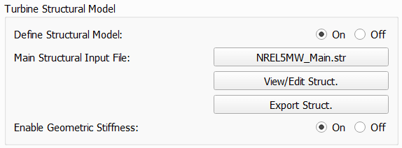
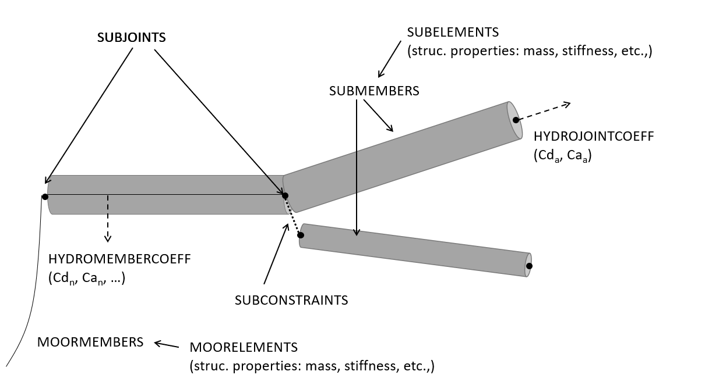
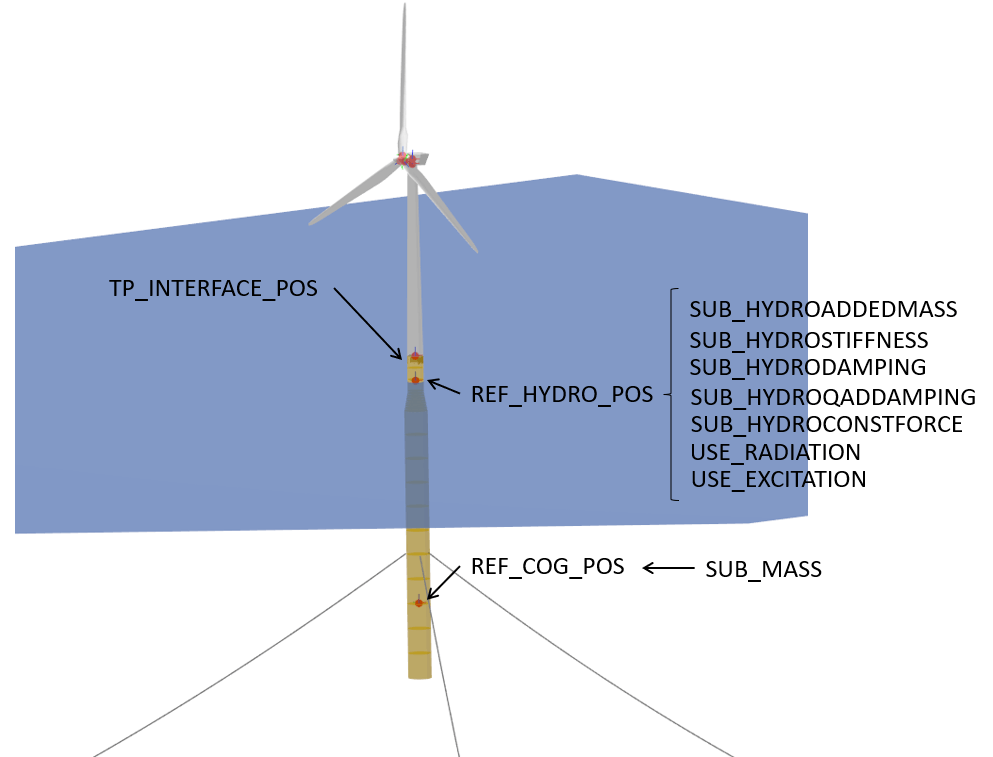

Turbine Structural Model
========================

A structural model may be loaded into a turbine definition by setting the model to *CHRONO* and loading the structural model main file through the open file dialog. When a structural model has been assigned to a turbine the structural model files may be examined by clicking **View/Edit Struct**. The dialog that shows the file contents can also be used to quickly change parameters of the structural model, without the need to modify and save the file outside of QBlade and then importing them again. This edit functionality however doesnt cause to *reload* files from the file system, such that changing the string of a blade parameter table doesnt lead to reloading the newly defined filename. Generally, it is recommended to only use this edit functionality to quickly change a few parameters, but to setup and work with the structural model files outside of QBlade in a text editor.

.. _fig-structural_dialog:

    
    The structural model dialog.
    
An overview of the file structure of the structural model definition files is hown in :numref:`fig-file_structure`. The main input file needs to be loaded through the dialog. It contains the main turbine parameters and the location of the structural data tables for the definition of the tower and the blades. 
    
.. _fig-file_structure:

    
    The file structure of the structural model input files.

.. _StrDef_MainFile:

Main Definition File
--------------------

The structure of the main input file will be discussed. An exemplary file is shown below:

.. code-block:: console

	---------------------- QBLADE STRUCTURAL MODEL INPUT FILE -----------------
	NREL 5MW Turbine
	------------------------------- CHRONO PARAMETERS -------------------------
	0.2		GLBGEOEPS - Global geometry epsilon for node placement

	------------------------------- HAWT TURBINE CONFIGURATION ----------------
	2.5		PRECONE - Rotor PreCone (deg) (HAWT only)
	5		SHFTTILT - Turbine Shaft Tilt (deg) (HAWT only)
	5.0191		OVERHANG - Rotor Overhang (m) (HAWT only)
	1.96256		TWR2SHFT - Tower to Shaft distance (m) (HAWT only)

	------------------------------- MASS AND INERTIA --------------------------
	0.0		YAWBRMASS - Yaw Bearing Mass (kg) (HAWT only)
	240000		NACMASS - Nacelle Mass (kg) (HAWT only)
	1.9    		NACCMX - Downwind distance from the tower-top to the nacelle CM (m) (HAWT only)
	0.0      	NACCMY - Lateral  distance from the tower-top to the nacelle CM (m) (HAWT only)
	1.75   		NACCMZ - Vertical distance from the tower-top to the nacelle CM (m) (HAWT only)
	2607890		NACYINER - Nacelle Yaw Inertia (kg*m^2) (HAWT only)
	56780		HUBMASS - Hub Mass (kg)
	115926		HUBINER - Hub Inertia (kg*m^2)

	------------------------------- DRIVETRAIN MODEL --------------------------
	97		GBRATIO - gearbox ratio (N)
	1.0		GBOXEFF - gearbox efficiency (0-1)
	true		DRTRDOF - model drivetrain dynamics (true / false)
	534.116		GENINER	- Generator side (HSS) Inertia (kg*m^2)
	867637000	DTTORSPR - Drivetrain torsional stiffness (N*m/rad)
	6215000		DTTORDMP - Drivetrain torsional damping (N*m*s/rad)

	------------------------------- BRAKE MODEL -------------------------------
	0		BRKTORQUE - maximum brake torque
	0		BRKDEPLOY - brake deploy time (s) (only used with DTU style controllers)
	0		BRKDELAY - brake delay time (s) (only used with DTU style controllers)

	------------------------------- SENSOR ERRORS -----------------------------
	0		ERRORYAW - yaw error (deg) (HAWT only)
	0		ERRORPITCH_1 - pitch error blade1 (deg)
	0		ERRORPITCH_2 - pitch error blade2 (deg)
	0		ERRORPITCH_3 - pitch error blade3 (deg)

	------------------------------- BLADES ------------------------------------
	3				NUMBLD - Number of blades 
	NREL5MW_Blade.str		BLDFILE_1 - Name of file containing properties for blade 1
	NREL5MW_Blade.str		BLDFILE_2 - Name of file containing properties for blade 2
	NREL5MW_Blade.str		BLDFILE_3 - Name of file containing properties for blade 3

	------------------------------- TOWER -------------------------------------
	77.6				TWRHEIGHT - Height of the tower (m)
	OC3_Sparbuoy_Tower.str		TWRFILE - Name of file containing properties for the tower
	OC3_Sparbuoy_Sub_LPMD.str	SUBFILE	 - Name of the substructure file

	------------------------------- DATA OUTPUT TYPES -------------------------
	true			FOR_OUT - store (local) forces at all chosen locations 
	true			ROT_OUT - store (local) body rotations at all chosen locations 
	true			MOM_OUT - store (local) moments at all chosen locations 
	true			DEF_OUT - store (local) deflections at all chosen locations 
	true			POS_OUT - store (global) positions at all chosen locations 
	true			VEL_OUT - store (global) velocities at all chosen locations 
	true			ACC_OUT - store (global) accelerations at all chosen locations
	true			LVE_OUT - store (local) velocities at all chosen locations
	true			LAC_OUT - store (local) accelerations at all chosen locations

	------------------------------- DATA OUTPUT LOCATIONS ---------------------
	any number, or zero, user defined positions can be chosen as output locations. 
	Locations can be assigned at any of the following components: blades, struts, tower 
	and guy cables. See the following examples for the used nomenclature:

	BLD_1_1.0		- exemplary position, blade 1 at 100% normalized radius 
	BLD_1_0.8		- exemplary position, blade 1 at  80% normalized radius 
	BLD_1_0.5		- exemplary position, blade 1 at  50% normalized radius 
	BLD_1_0.4		- exemplary position, blade 1 at  40% normalized radius 
	BLD_1_0.2		- exemplary position, blade 1 at  20% normalized radius 
	BLD_1_0.0		- exemplary position, blade 1 at  00% normalized radius 

	BLD_2_1.0		- exemplary position, blade 2 at 100% normalized radius 
	BLD_2_0.8		- exemplary position, blade 2 at  80% normalized radius 
	BLD_2_0.5		- exemplary position, blade 2 at  50% normalized radius
	BLD_2_0.4		- exemplary position, blade 2 at  40% normalized radius 
	BLD_2_0.2		- exemplary position, blade 2 at  20% normalized radius 
	BLD_2_0.0		- exemplary position, blade 2 at  00% normalized radius 

	BLD_3_1.0		- exemplary position, blade 3 at 100% normalized radius 
	BLD_3_0.8		- exemplary position, blade 3 at  80% normalized radius 
	BLD_3_0.5		- exemplary position, blade 3 at  50% normalized radius
	BLD_3_0.4		- exemplary position, blade 3 at  40% normalized radius 
	BLD_3_0.2		- exemplary position, blade 3 at  20% normalized radius 
	BLD_3_0.0		- exemplary position, blade 3 at  00% normalized radius 

	TWR_1.00		- exemplary position, tower at 100% normalized height 
	TWR_0.90		- exemplary position, tower at  90% normalized height 
	TWR_0.80		- exemplary position, tower at  80% normalized height 
	TWR_0.70		- exemplary position, tower at  70% normalized height 
	TWR_0.60		- exemplary position, tower at  60% normalized height 
	TWR_0.50		- exemplary position, tower at  50% normalized height 
	TWR_0.40		- exemplary position, tower at  40% normalized height 
	TWR_0.30		- exemplary position, tower at  30% normalized height 
	TWR_0.20		- exemplary position, tower at  20% normalized height 
	TWR_0.10		- exemplary position, tower at  10% normalized height 
	TWR_0.00		- exemplary position, tower at   0% normalized height 

The different sections of the structural model input file will now be briefly discussed.

.. code-block:: console

	------------------------------- HAWT TURBINE CONFIGURATION ----------------
	2.5		PRECONE - Rotor PreCone (deg) (HAWT only)
	5		SHFTTILT - Turbine Shaft Tilt (deg) (HAWT only)
	5.0191		OVERHANG - Rotor Overhang (m) (HAWT only)
	1.96256		TWR2SHFT - Tower to Shaft distance (m) (HAWT only)
	
In this section of the file the main geometrical turbine parameters are defined. These parameters are equivalent to the parameters discussed in :ref:`Turbine Geometry`.

.. code-block:: console

	------------------------------- MASS AND INERTIA --------------------------
	0.0		YAWBRMASS - Yaw Bearing Mass (kg) (HAWT only)
	240000		NACMASS - Nacelle Mass (kg) (HAWT only)
	1.9    		NACCMX - Downwind distance from the tower-top to the nacelle CM (m) (HAWT only)
	0.0      	NACCMY - Lateral  distance from the tower-top to the nacelle CM (m) (HAWT only)
	1.75   		NACCMZ - Vertical distance from the tower-top to the nacelle CM (m) (HAWT only)
	2607890		NACYINER - Nacelle Yaw Inertia (kg*m^2) (HAWT only)
	56780		HUBMASS - Hub Mass (kg)
	115926		HUBINER - Hub Inertia (kg*m^2)
	
In this section of the input file mass and inertia properties are assigned to the nacelle and the hub. It should be noted here that the parameter **HUBINER** should only account for the rotational inertia of the hub itself, and not account for the inertia of the rotor blades as this is explicity included through the finite element model. 

.. code-block:: console

	------------------------------- DRIVETRAIN MODEL --------------------------
	97		GBRATIO - gearbox ratio (N)
	1.0		GBOXEFF - gearbox efficiency (0-1)
	true		DRTRDOF - model drivetrain dynamics (true / false)
	534.116		GENINER	- Generator side (HSS) Inertia (kg*m^2)
	867637000	DTTORSPR - Drivetrain torsional stiffness (N*m/rad)
	6215000		DTTORDMP - Drivetrain torsional damping (N*m*s/rad)
	
This section of the main input file defined the drive train model. The drive train model in QBlade is a simple 2 mass spring-damper model. An overview is given in :numref:`fig-drivetrain`.
The drivetrain is parameterized by the main shaft torsional stiffness and damping, a high speed side (HSS) generator inertia and the low speed side (LSS) inertia. The LSS inertia (of shaft and Hub combined) should be summes up and assigned to the **HUBINER** value. 

.. _fig-drivetrain:
.. figure:: drivetrain.png
    :align: center
    :alt: An overview of the drivetrain model in QBlade.
    
    An overview of the drivetrain model in QBlade.
    
    
.. code-block:: console

	------------------------------- BRAKE MODEL -------------------------------
	0			BRKTORQUE - maximum brake torque
	0			BRKDEPLOY - brake deploy time (s) 
	0			BRKDELAY - brake delay time (s)

The brake in QBlade is defined as shown above. The brake is parameterized with a delay time, a deploy time and a maximum value for the brake torque. After the brake signal is emitted from the controller, or a brake event, after the delay time (**BRKDELAY**) has passed the brake is activated and ramped up to the maximum brake torque (**BRKTORQUE**) during the deploy time (**BRKDEPLOY**). An overview of this process is shown in :numref:`fig-brake`.	

.. _fig-brake:

    
    An overview of the brake model in QBlade.
    
.. code-block:: console
 
    	------------------------------- SENSOR ERRORS -----------------------------
	0		ERRORYAW - yaw error (deg) (HAWT only)
	0		ERRORPITCH_1 - pitch error blade1 (deg)
	0		ERRORPITCH_2 - pitch error blade2 (deg)
	0		ERRORPITCH_3 - pitch error blade3 (deg)
	
Sensor errors are defined for each blade pitch bearing sensor and the yaw bearing sensor. These errors are simply added to the corresponding signals as an offset.

.. code-block:: console

	------------------------------- BLADES ------------------------------------
	3				NUMBLD - Number of blades 
	NREL5MW_Blade.str		BLDFILE_1 - Name of file containing properties for blade 1
	NREL5MW_Blade.str		BLDFILE_2 - Name of file containing properties for blade 2
	NREL5MW_Blade.str		BLDFILE_3 - Name of file containing properties for blade 3
	
The location of the structural data tables for the blades is defined by the keywords shown above. The number of blades is defined by the parameter **NUMBLD**, this value overrides the number of blades that is defined in the turbine definition dialog. For each blade a keyword **BLDFILE_X** is searched for where the filename of the blade data table is defined. Different blade data tables can be assigned to each individual blade.

.. code-block:: console

	------------------------------- TOWER -------------------------------------
	77.6				TWRHEIGHT - Height of the tower (m)
	OC3_Sparbuoy_Tower.str		TWRFILE - Name of file containing properties for the tower
	OC3_Sparbuoy_Sub_LPMD.str	SUBFILE	 - Name of the substructure file
	
The structural tower data table is defined in a similar fashion as for the blades. The keyword **TWRHEIGHT** defines the absolute height of the tower. The keyword **SUBFILE** points to a substructure file that can be used to define a more complicated floating or bottom fixed substructure for offshore wind turbines or to model soil dynamics. If the keyword **SUBFILE** is not defined then the tower will simply be rigidly contrained to the ground. More information on how a substructure file is defined is found in the section: :ref:`Substructure Definition`.

Loading Data and Sensor Locations
---------------------------------

.. code-block:: console

	------------------------------- DATA OUTPUT TYPES -------------------------
	true			FOR_OUT - store (local) forces at all chosen locations 
	true			ROT_OUT - store (local) body rotations at all chosen locations 
	true			MOM_OUT - store (local) moments at all chosen locations 
	true			DEF_OUT - store (local) deflections at all chosen locations 
	true			POS_OUT - store (global) positions at all chosen locations 
	true			VEL_OUT - store (global) velocities at all chosen locations 
	true			ACC_OUT - store (global) accelerations at all chosen locations
	true			LVE_OUT - store (local) velocities at all chosen locations
	true			LAC_OUT - store (local) accelerations at all chosen locations

	------------------------------- DATA OUTPUT LOCATIONS ---------------------
	any number, or zero, user defined positions can be chosen as output locations. 
	Locations can be assigned at any of the following components: blades, struts, tower 
	and guy cables. See the following examples for the used nomenclature:

	BLD_1_1.0		- exemplary position, blade 1 at 100% normalized radius 
	BLD_1_0.8		- exemplary position, blade 1 at  80% normalized radius 
	BLD_1_0.5		- exemplary position, blade 1 at  50% normalized radius 
	BLD_1_0.4		- exemplary position, blade 1 at  40% normalized radius 
	BLD_1_0.2		- exemplary position, blade 1 at  20% normalized radius 
	BLD_1_0.0		- exemplary position, blade 1 at  00% normalized radius 

	BLD_2_1.0		- exemplary position, blade 2 at 100% normalized radius 
	BLD_2_0.8		- exemplary position, blade 2 at  80% normalized radius 
	BLD_2_0.5		- exemplary position, blade 2 at  50% normalized radius
	BLD_2_0.4		- exemplary position, blade 2 at  40% normalized radius 
	BLD_2_0.2		- exemplary position, blade 2 at  20% normalized radius 
	BLD_2_0.0		- exemplary position, blade 2 at  00% normalized radius 

	BLD_3_1.0		- exemplary position, blade 3 at 100% normalized radius 
	BLD_3_0.8		- exemplary position, blade 3 at  80% normalized radius 
	BLD_3_0.5		- exemplary position, blade 3 at  50% normalized radius
	BLD_3_0.4		- exemplary position, blade 3 at  40% normalized radius 
	BLD_3_0.2		- exemplary position, blade 3 at  20% normalized radius 
	BLD_3_0.0		- exemplary position, blade 3 at  00% normalized radius 

	TWR_1.00		- exemplary position, tower at 100% normalized height 
	TWR_0.90		- exemplary position, tower at  90% normalized height 
	TWR_0.80		- exemplary position, tower at  80% normalized height 
	TWR_0.70		- exemplary position, tower at  70% normalized height 
	TWR_0.60		- exemplary position, tower at  60% normalized height 
	TWR_0.50		- exemplary position, tower at  50% normalized height 
	TWR_0.40		- exemplary position, tower at  40% normalized height 
	TWR_0.30		- exemplary position, tower at  30% normalized height 
	TWR_0.20		- exemplary position, tower at  20% normalized height 
	TWR_0.10		- exemplary position, tower at  10% normalized height 
	TWR_0.00		- exemplary position, tower at   0% normalized height 
	
The last part of the main structural input file deals with the definition of loading data and sensor locations. The locations at which the data will be stored are defined through the following keywords that can be placed anywhere in the structural model main input file:

* **BLD_X_Y**: Stores data for blade X at the normalized curved length position Y
* **STR_X_Y_Z**: Stores data for strut Y of blade X at the normalized curved length position Z
* **TWR_X**: Stores data for the tower at the normalized curved length position X
* **TRQ_X**: Stores data for the torque tube at the normalized curved length position X
* **CAB_X_Y**: Stores data for guy cable X at the normalized curved length position Y

Furthermore data is automatically stored at each inter body connection of the model. Each inter body connection is identified by a combination of two body name tags and a z value that gives the height position at which the connection was created during the model definition. In the following two exemplary auto-generated variable names are shown and explained:

* **Y l Mom. TRQ - BLD_3 z=29.7m**: The moment around the local Y axis at the connection between the torque tube and blade 3, which was defined at a height of 29.7m. This result is given in the local coordinates of the torque tube since the TRQ tag is the first tag in the variable name.
* **X l For. STR_2_2 - BLD_2 z=27.5m**: This example defines the local reaction force at the connection between the top strut of blade 2 and blade 2, given for the local X axis of the strut. 

Nine different data types can be specified to be stored (true) or not (false) at all locations that are specified or automatically generated. These are:

* *true / false* **FOR_OUT**: Store the local forces for all locations
* *true / false* **MOM_OUT**: Store the local moments for all locations
* *true / false* **DEF_OUT**: Store the local deflections for all locations
* *true / false* **ROT_OUT**: Store the local accumulated rotations at all chosen locations
* *true / false* **POS_OUT**: Store the global positions for all locations
* *true / false* **VEL_OUT**: Store the global velocities for all locations
* *true / false* **ACC_OUT**: Store the global accelerations for all locations
* *true / false* **LVE_OUT**: Store the local velocities for all locations
* *true / false* **LAC_OUT**: Store the local accelerations for all locations

The forces and moments that obtained from a structural body are the **internal shear forces and bending moments**. However, the forces and moments given at an inter body connection can be interpreted as the **reaction forces and moments** acting on the constraint. For an overview of the coordinate systems / conventions in which the simulation results are stored see the section: :ref:`Coordinate Systems`.

.. _StrDef_BladeTower:

Blade and Tower Structural Data Tables
--------------------------------------

The cross-sectional beam properties of the blade, tower and strut bodies have to be defined in the form of structural data tables. An exemplary data table is shown below:

.. code-block:: console

	Structural Data Table Generated with : QBlade QBlade EE v x.x.x 64bit-windows-release; on 09.01.2022; at 18:14:21

	0.0024		RAYLEIGHDMP
	1.00		STIFFTUNER
	1.00		MASSTUNER

	20		DISC

	ADDMASS_0.50_0.00 - add a point mass at relative position 0.50 with 0.00kg mass

	LENFRACT_[-]  MASSD_[kg/m]  EIx_[N.m^2]   EIy_[N.m^2]   EA_[N]        GJ_[N.m^2]    GA_[N]        STRPIT_[deg]  KSX_[-]       KSY_[-]       RGX_[-]       RGY_[-]       XCM_[-]       YCM_[-]       XCE_[-]       YCE_[-]       XCS_[-]       YCS_[-]      
	0.0000E+00    7.1502E+02    1.8116E+10    1.8116E+10    9.7300E+09    5.5600E+09    6.9500E+08    0.0000E+00    5.0000E-01    5.0000E-01    3.2931E-01    3.2936E-01    -4.7995E-05   0.0000E+00    0.0000E+00    0.0000E+00    0.0000E+00    0.0000E+00   
	3.2520E-03    7.1502E+02    1.8116E+10    1.8116E+10    9.7300E+09    5.5600E+09    6.9500E+08    0.0000E+00    5.0000E-01    5.0000E-01    3.2931E-01    3.2936E-01    -4.7995E-05   0.0000E+00    0.0000E+00    0.0000E+00    0.0000E+00    0.0000E+00   
	1.9512E-02    8.1446E+02    1.9418E+10    1.9558E+10    1.0790E+10    5.4300E+09    7.7070E+08    0.0000E+00    5.0000E-01    5.0000E-01    3.2685E-01    3.2307E-01    7.0102E-03    0.0000E+00    0.0000E+00    0.0000E+00    0.0000E+00    0.0000E+00   
	3.5772E-02    7.7991E+02    1.7458E+10    1.9502E+10    1.0067E+10    4.9900E+09    7.1910E+08    0.0000E+00    5.0000E-01    5.0000E-01    3.0601E-01    3.1861E-01    3.8932E-03    0.0000E+00    5.4989E-03    0.0000E+00    5.4989E-03    0.0000E+00   
	5.2033E-02    7.7937E+02    1.5288E+10    1.9782E+10    9.8672E+09    4.6700E+09    7.0480E+08    0.0000E+00    5.0000E-01    5.0000E-01    2.8228E-01    3.1667E-01    5.4728E-03    0.0000E+00    1.5995E-02    0.0000E+00    1.5995E-02    0.0000E+00   
	6.8293E-02    6.2399E+02    1.0783E+10    1.4854E+10    7.6076E+09    3.4700E+09    5.4340E+08    0.0000E+00    5.0000E-01    5.0000E-01    2.6375E-01    3.0599E-01    1.4164E-02    0.0000E+00    2.8457E-02    0.0000E+00    2.8457E-02    0.0000E+00   
	8.4553E-02    4.7421E+02    7.2296E+09    1.0220E+10    5.4908E+09    2.3200E+09    3.9220E+08    0.0000E+00    5.0000E-01    5.0000E-01    2.4658E-01    2.9224E-01    2.5352E-02    0.0000E+00    4.0201E-02    0.0000E+00    4.0201E-02    0.0000E+00   
	1.0081E-01    4.4659E+02    6.3098E+09    9.1448E+09    4.9714E+09    1.9100E+09    3.5510E+08    0.0000E+00    5.0000E-01    5.0000E-01    2.3129E-01    2.8160E-01    3.5071E-02    0.0000E+00    5.1288E-02    0.0000E+00    5.1288E-02    0.0000E+00   
	1.1707E-01    4.2193E+02    5.5286E+09    8.0626E+09    4.4940E+09    1.5700E+09    3.2100E+08    0.0000E+00    5.0000E-01    5.0000E-01    2.1690E-01    2.7057E-01    4.6278E-02    0.0000E+00    6.4150E-02    0.0000E+00    6.4150E-02    0.0000E+00   
	1.3333E-01    4.0237E+02    4.9798E+09    6.8838E+09    4.0348E+09    1.1600E+09    2.8820E+08    0.0000E+00    5.0000E-01    5.0000E-01    2.0504E-01    2.5549E-01    5.5352E-02    0.0000E+00    7.6335E-02    0.0000E+00    7.6335E-02    0.0000E+00   
	1.4959E-01    4.2090E+02    4.9364E+09    7.0098E+09    4.0376E+09    1.0000E+09    2.8840E+08    0.0000E+00    5.0000E-01    5.0000E-01    1.9141E-01    2.4658E-01    6.7216E-02    0.0000E+00    8.7894E-02    0.0000E+00    8.7894E-02    0.0000E+00   
	1.6585E-01    4.4898E+02    4.6914E+09    7.1680E+09    4.1692E+09    8.5600E+08    2.9780E+08    0.0000E+00    5.0000E-01    5.0000E-01    1.7635E-01    2.4202E-01    6.8242E-02    0.0000E+00    1.0107E-01    0.0000E+00    1.0107E-01    0.0000E+00   
	1.8211E-01    4.3897E+02    3.9494E+09    7.2716E+09    4.0824E+09    6.7200E+08    2.9160E+08    0.0000E+00    5.0000E-01    5.0000E-01    1.6368E-01    2.4883E-01    6.6958E-02    0.0000E+00    1.1356E-01    0.0000E+00    1.1356E-01    0.0000E+00   
	1.9837E-01    4.2777E+02    3.3866E+09    7.0812E+09    4.0866E+09    5.4700E+08    2.9190E+08    0.0000E+00    5.0000E-01    5.0000E-01    1.5436E-01    2.5762E-01    5.8711E-02    0.0000E+00    1.2168E-01    0.0000E+00    1.2168E-01    0.0000E+00   
	2.1463E-01    4.0169E+02    2.9344E+09    6.2440E+09    3.6680E+09    4.4900E+08    2.6200E+08    0.0000E+00    5.0000E-01    5.0000E-01    1.4756E-01    2.5220E-01    5.9779E-02    0.0000E+00    1.2323E-01    0.0000E+00    1.2323E-01    0.0000E+00   
	2.3089E-01    3.7157E+02    2.5690E+09    5.0484E+09    3.1472E+09    3.3600E+08    2.2480E+08    0.0000E+00    5.0000E-01    5.0000E-01    1.4153E-01    2.4160E-01    6.8041E-02    0.0000E+00    1.2262E-01    0.0000E+00    1.2262E-01    0.0000E+00   
	2.4715E-01    3.6805E+02    2.3884E+09    4.9490E+09    3.0114E+09    3.1100E+08    2.1510E+08    0.0000E+00    5.0000E-01    5.0000E-01    1.3776E-01    2.4075E-01    6.9442E-02    0.0000E+00    1.2360E-01    0.0000E+00    1.2360E-01    0.0000E+00   
	2.6341E-01    3.6496E+02    2.2722E+09    4.8076E+09    2.8826E+09    2.9200E+08    2.0590E+08    0.0000E+00    5.0000E-01    5.0000E-01    1.3583E-01    2.3952E-01    7.0957E-02    0.0000E+00    1.2269E-01    0.0000E+00    1.2269E-01    0.0000E+00   
	2.9593E-01    3.5737E+02    2.0496E+09    4.5010E+09    2.6138E+09    2.6100E+08    1.8670E+08    0.0000E+00    5.0000E-01    5.0000E-01    1.3211E-01    2.3616E-01    7.3227E-02    0.0000E+00    1.2305E-01    0.0000E+00    1.2305E-01    0.0000E+00   
	3.2846E-01    3.4754E+02    1.8284E+09    4.2434E+09    2.3576E+09    2.2900E+08    1.6840E+08    0.0000E+00    5.0000E-01    5.0000E-01    1.2843E-01    2.3363E-01    7.8424E-02    0.0000E+00    1.2360E-01    0.0000E+00    1.2360E-01    0.0000E+00   
	3.6098E-01    3.3910E+02    1.5890E+09    3.9956E+09    2.1462E+09    2.0100E+08    1.5330E+08    0.0000E+00    5.0000E-01    5.0000E-01    1.2363E-01    2.3296E-01    7.8316E-02    0.0000E+00    1.2421E-01    0.0000E+00    1.2421E-01    0.0000E+00   
	3.9350E-01    3.3050E+02    1.3619E+09    3.7506E+09    1.9446E+09    1.7400E+08    1.3890E+08    0.0000E+00    5.0000E-01    5.0000E-01    1.1868E-01    2.3275E-01    7.8557E-02    0.0000E+00    1.2284E-01    0.0000E+00    1.2284E-01    0.0000E+00   
	4.2602E-01    3.1040E+02    1.1024E+09    3.4468E+09    1.6324E+09    1.4400E+08    1.1660E+08    0.0000E+00    5.0000E-01    5.0000E-01    1.1139E-01    2.2858E-01    8.7855E-02    0.0000E+00    1.2396E-01    0.0000E+00    1.2396E-01    0.0000E+00   
	4.5854E-01    3.0238E+02    8.7584E+08    3.1388E+09    1.4322E+09    1.2000E+08    1.0230E+08    0.0000E+00    5.0000E-01    5.0000E-01    1.0343E-01    2.2650E-01    8.5572E-02    0.0000E+00    1.2279E-01    0.0000E+00    1.2279E-01    0.0000E+00   
	4.9106E-01    2.7734E+02    6.8124E+08    2.7342E+09    1.1687E+09    8.1200E+07    8.3480E+07    0.0000E+00    5.0000E-01    5.0000E-01    9.6993E-02    2.2246E-01    8.9951E-02    0.0000E+00    1.2425E-01    0.0000E+00    1.2425E-01    0.0000E+00   
	5.2358E-01    2.6666E+02    5.3466E+08    2.5550E+09    1.0475E+09    6.9100E+07    7.4820E+07    0.0000E+00    5.0000E-01    5.0000E-01    9.0303E-02    2.2464E-01    8.8604E-02    0.0000E+00    1.2292E-01    0.0000E+00    1.2292E-01    0.0000E+00   
	5.5610E-01    2.5451E+02    4.0894E+08    2.3338E+09    9.2302E+08    5.7500E+07    6.5930E+07    0.0000E+00    5.0000E-01    5.0000E-01    8.3338E-02    2.2561E-01    8.5360E-02    0.0000E+00    1.2426E-01    0.0000E+00    1.2426E-01    0.0000E+00   
	5.8862E-01    2.3236E+02    3.1458E+08    1.8284E+09    7.6076E+08    4.5900E+07    5.4340E+07    0.0000E+00    5.0000E-01    5.0000E-01    7.9830E-02    2.2268E-01    8.4224E-02    0.0000E+00    1.2569E-01    0.0000E+00    1.2569E-01    0.0000E+00   
	6.2114E-01    2.1094E+02    2.3870E+08    1.5848E+09    6.4806E+08    3.6000E+07    4.6290E+07    0.0000E+00    5.0000E-01    5.0000E-01    7.6068E-02    2.2493E-01    7.9155E-02    0.0000E+00    1.2420E-01    0.0000E+00    1.2420E-01    0.0000E+00   
	6.5366E-01    1.8894E+02    1.7584E+08    1.3234E+09    5.3970E+08    2.7400E+07    3.8550E+07    0.0000E+00    5.0000E-01    5.0000E-01    7.2179E-02    2.2638E-01    7.0245E-02    0.0000E+00    1.2575E-01    0.0000E+00    1.2575E-01    0.0000E+00   
	6.8618E-01    1.7387E+02    1.2601E+08    1.1837E+09    5.3116E+08    2.0900E+07    3.7940E+07    0.0000E+00    5.0000E-01    5.0000E-01    6.6939E-02    2.4642E-01    4.3584E-02    0.0000E+00    1.2414E-01    0.0000E+00    1.2414E-01    0.0000E+00   
	7.1870E-01    1.6262E+02    1.0725E+08    1.0202E+09    4.6004E+08    1.8500E+07    3.2860E+07    0.0000E+00    5.0000E-01    5.0000E-01    6.6508E-02    2.4696E-01    3.6522E-02    0.0000E+00    1.2581E-01    0.0000E+00    1.2581E-01    0.0000E+00   
	7.5122E-01    1.4632E+02    9.0874E+07    7.9786E+08    3.7576E+08    1.6300E+07    2.6840E+07    0.0000E+00    5.0000E-01    5.0000E-01    6.6749E-02    2.4513E-01    4.5051E-02    0.0000E+00    1.2407E-01    0.0000E+00    1.2407E-01    0.0000E+00   
	7.8374E-01    1.3644E+02    7.6314E+07    7.0966E+08    3.2886E+08    1.4500E+07    2.3490E+07    0.0000E+00    5.0000E-01    5.0000E-01    6.6198E-02    2.4839E-01    4.0603E-02    0.0000E+00    1.2588E-01    0.0000E+00    1.2588E-01    0.0000E+00   
	8.1626E-01    1.1296E+02    6.1054E+07    5.1814E+08    2.4402E+08    9.0700E+06    1.7430E+07    0.0000E+00    5.0000E-01    5.0000E-01    6.6835E-02    2.4572E-01    4.5184E-02    0.0000E+00    1.2398E-01    0.0000E+00    1.2398E-01    0.0000E+00   
	8.4878E-01    1.0403E+02    4.9476E+07    4.5486E+08    2.1154E+08    8.0600E+06    1.5110E+07    0.0000E+00    5.0000E-01    5.0000E-01    6.6071E-02    2.5059E-01    3.7078E-02    0.0000E+00    1.2596E-01    0.0000E+00    1.2596E-01    0.0000E+00   
	8.8130E-01    9.5044E+01    3.9354E+07    3.9508E+08    1.8158E+08    7.0800E+06    1.2970E+07    0.0000E+00    5.0000E-01    5.0000E-01    6.5143E-02    2.5583E-01    2.7860E-02    0.0000E+00    1.2388E-01    0.0000E+00    1.2388E-01    0.0000E+00   
	8.9756E-01    8.7412E+01    3.4664E+07    3.5378E+08    1.6030E+08    6.0900E+06    1.1450E+07    0.0000E+00    5.0000E-01    5.0000E-01    6.5499E-02    2.5874E-01    2.3511E-02    0.0000E+00    1.2342E-01    0.0000E+00    1.2342E-01    0.0000E+00   
	9.1382E-01    7.6781E+01    3.0408E+07    3.0478E+08    1.0923E+08    5.7500E+06    7.8020E+06    0.0000E+00    5.0000E-01    5.0000E-01    6.7897E-02    2.3439E-01    5.8270E-02    0.0000E+00    1.2811E-01    0.0000E+00    1.2811E-01    0.0000E+00   
	9.3008E-01    7.2427E+01    2.6516E+07    2.8140E+08    1.0009E+08    5.3300E+06    7.1490E+06    0.0000E+00    5.0000E-01    5.0000E-01    6.8201E-02    2.4056E-01    5.2444E-02    0.0000E+00    1.2366E-01    0.0000E+00    1.2366E-01    0.0000E+00   
	9.3821E-01    6.9786E+01    2.3842E+07    2.6166E+08    9.2246E+07    4.9400E+06    6.5890E+06    0.0000E+00    5.0000E-01    5.0000E-01    6.8860E-02    2.4603E-01    5.0497E-02    0.0000E+00    1.2917E-01    0.0000E+00    1.2917E-01    0.0000E+00   
	9.4634E-01    6.2494E+01    1.9628E+07    1.5876E+08    6.3224E+07    4.2400E+06    4.5160E+06    0.0000E+00    5.0000E-01    5.0000E-01    7.0184E-02    2.2737E-01    7.8974E-02    0.0000E+00    1.2693E-01    0.0000E+00    1.2693E-01    0.0000E+00   
	9.5447E-01    5.8886E+01    1.6002E+07    1.3789E+08    5.3326E+07    3.6600E+06    3.8090E+06    0.0000E+00    5.0000E-01    5.0000E-01    6.9485E-02    2.3028E-01    7.8893E-02    0.0000E+00    1.3004E-01    0.0000E+00    1.3004E-01    0.0000E+00   
	9.6260E-01    5.5273E+01    1.2830E+07    1.1879E+08    4.4534E+07    3.1300E+06    3.1810E+06    0.0000E+00    5.0000E-01    5.0000E-01    6.8804E-02    2.3374E-01    7.7403E-02    0.0000E+00    1.2753E-01    0.0000E+00    1.2753E-01    0.0000E+00   
	9.7073E-01    5.1724E+01    1.0080E+07    1.0163E+08    3.6904E+07    2.6400E+06    2.6360E+06    0.0000E+00    5.0000E-01    5.0000E-01    6.8277E-02    2.3815E-01    7.4901E-02    0.0000E+00    1.2462E-01    0.0000E+00    1.2462E-01    0.0000E+00   
	9.7886E-01    4.8253E+01    7.5502E+06    8.5064E+07    2.9918E+07    2.1700E+06    2.1370E+06    0.0000E+00    5.0000E-01    5.0000E-01    6.6807E-02    2.4331E-01    7.4254E-02    0.0000E+00    1.2173E-01    0.0000E+00    1.2173E-01    0.0000E+00   
	9.8699E-01    4.3884E+01    4.6004E+06    6.4260E+07    2.1308E+07    1.5800E+06    1.5220E+06    0.0000E+00    5.0000E-01    5.0000E-01    6.1430E-02    2.4597E-01    8.1096E-02    0.0000E+00    1.2205E-01    0.0000E+00    1.2205E-01    0.0000E+00   
	9.9512E-01    1.2062E+01    2.5004E+05    6.6094E+06    4.8496E+06    2.5000E+05    3.4640E+05    0.0000E+00    5.0000E-01    5.0000E-01    5.4262E-02    2.6302E-01    7.4337E-02    0.0000E+00    1.2247E-01    0.0000E+00    1.2247E-01    0.0000E+00   
	1.0000E+00    1.0867E+01    1.6996E+05    5.0106E+06    3.5294E+06    1.9000E+05    2.5210E+05    0.0000E+00    5.0000E-01    5.0000E-01    4.4641E-02    2.6025E-01    7.1103E-02    0.0000E+00    1.2487E-01    0.0000E+00    1.2487E-01    0.0000E+00   

	RGBCOLOR
	R	G	B
	220	220	220
	
The keyword **RAYLEIGHDMP** defines a stiffness proportional Rayleigh damping coefficient. The parameters **STIFFTUNER** and **MASSTUNER** can be used to tune the global stiffness or mass properties of the data table through a multiplication by this factor. The keyword **RGBCOLOR** defines the rgb values that are used to color the structural body during the 3D visualization. The keyword **DISC** controls the discretization of the body into structural nodes. The following options are available:

* **20 DISC**: Discretization into 20 equally spaced (along the curved length) structural nodes.
* **struct DISC**: The discretization is carried out after the discretization in the structural data table.
* **aero DISC**: The discretization is carried out after the discretization in the aerodynamic blade data table (only for blade bodies).

The following table gives an overview of the entries of the structural data table:

======== ==================== ========================================= =======
Col. Nr. Name                 Explanation                               Unit
======== ==================== ========================================= =======
1        Length               Curved length distance from the first     -
                              body node normalized by the body length        
-------- -------------------- ----------------------------------------- -------
2        Mass density         Mass per unit length                      kg/m
-------- -------------------- ----------------------------------------- -------
3        Bend. stiff. X       Bending Stiffness around X                Nm^2
                              (:math:`EI_{xx}`)         
-------- -------------------- ----------------------------------------- ------- 
4        Bend. stiff. Y       Bending Stiffness around Y                Nm^2
                              (:math:`EI_{yy}`)  
-------- -------------------- ----------------------------------------- ------- 
5        Axial stiff.         Longitudinal Stiffness                    N
                              (:math:`EA`)                   
-------- -------------------- ----------------------------------------- ------- 
6        Tors. stiff.         Torsional Stiffness                       Nm^2
                              (:math:`GJ`)                   
-------- -------------------- ----------------------------------------- ------- 
7        Shear stiff.         Shear Stiffness                           N
                              (:math:`GA`) (not used with Euler beams)     
-------- -------------------- ----------------------------------------- ------- 
8        Str. pitch           Structural pitch angle between reference  deg
                              X axis and elastic X axis         
-------- -------------------- ----------------------------------------- ------- 
9        Shear factor X       Shear factor for force in principal       -
                              bending axis X  
-------- -------------------- ----------------------------------------- ------- 
10       Shear factor Y       Shear factor for force in principal       -
                              bending axis Y
-------- -------------------- ----------------------------------------- ------- 
11       Radius of gyration X Norm. radius of inertia corresponding to  %chord
                              a rotation around the elastic axis X   
-------- -------------------- ----------------------------------------- ------- 
12       Radius of gyration Y Norm. radius of inertia corresponding to  %chord
                              a rotation around the elastic axis Y    
-------- -------------------- ----------------------------------------- ------- 
13       Center of mass X     Norm. center of mass position X           %chord           
-------- -------------------- ----------------------------------------- ------- 
14       Center of mass Y     Norm. center of mass position Y           %chord
-------- -------------------- ----------------------------------------- ------- 
15       Center of elast. X   Norm. center of elasticity position X     %chord
-------- -------------------- ----------------------------------------- ------- 
16       Center of elast. Y   Norm. center of elasticity position Y     %chord
-------- -------------------- ----------------------------------------- ------- 
17       Center of shear X    Norm. center of shear position X          %chord
-------- -------------------- ----------------------------------------- ------- 
18       Center of shear Y    Norm. center of shear position Y          %chord
-------- -------------------- ----------------------------------------- ------- 
19       Diameter             Cross section diameter                    m
-------- -------------------- ----------------------------------------- ------- 
20       Drag                 Drag coefficient for aerodynamic drag     -                                                                                                              
======== ==================== ========================================= =======  

The local cross-sectional coordinate system for the definition of the structural data table is shown in :numref:`fig-crossection`.

.. _fig-crossection:
.. figure:: crossection.png
    :align: center
    :alt: Visualization of the local coordinate system that is used to define the cross sectional beam properties.
    
    Visualization of the local coordinate system that is used to define the cross sectional beam properties.

Substructure Definition
-----------------------

As with the other structural definition files, the substructure is defined by a series of keywords that are recognized by QBlade when creating the turbine. The format is the same as with the other structural file definitions: 

 * *<Value>* **<Keyword>**, for parameters defined by a single values.
 * **<Keyword>** <new line> *<Header>* <new line> *<Values>* for parameters defined by a table. The *<Header>* <new line> part is only optional and can be omitted.
 
A table is identified by its *Keyword* and the row and column count of the subsequent ASCII values, which need to separated by *space(s)* or *tab(s)*.
An example of a table with two rows and tree columns is shown below.

=========== =========== ===========
**<Keyword>**
-----------------------------------
<Header 1>  <Header 2>  <Header 3> 
=========== =========== ===========
<Value 1,1> <Value 1,2> <Value 1,3>
----------- ----------- -----------
<Value 2,1> <Value 2,2> <Value 2,3>
=========== =========== ===========

There is no particular oder in which these keywords should be placed. The only exception is when defining tables. When a table is defined by a keyword, it should be immediately followed by the 
table header (optional) and the table content.

.. _fig-substruc-keywords:

    Main keywords used to define the substructure. Each keyword is defined in detail in the text.

The main keywords that are used to define a substructure are shown in :numref:`fig-substruc-keywords`. This figure also shows the relationship between each of the keywords.
It should also be noted that QBlade allows the user to combine elements from the :doc:`../../theory/hydrodynamics/lpft/lpft` and :doc:`../../theory/hydrodynamics/me/me` hydrodynamic models freely. 
So the user should be careful when setting up the substructure in QBlade so that the model remains consistent.

Following keywords can be used to define the substructure.

General Substructure Parameters
^^^^^^^^^^^^^^^^^^^^^^^^^^^^^^^

* **ISFLOATING** is a flag that determines if the substructure is floating of bottom-fixed. If the structure is bottom-fixed the joint coordinates (see **SUBJOINTS** below) are assigned in a coordinate system with its origin placed at the seabed. For floaters, the origin is placed at the mean see level (MSL) and marks the floaters's neutral point (NP)
* **WATERDEPTH** sets the design water depth of the substructure, this value is only used for visualization of the turbine and the identification of flooded members. Note that this water depth is only for the turbine setup and is not used for offshore calculations.
* **WATERDENSITY**: sets the water density to calculate the mass of the flooded members. Note that this water density is only for the turbine setup and is not used for offshore calculations.
* **STIFFTUNER** is a multiplication factor that affects the stiffness of the flexible elements defined in **SUBELEMENTS**.
* **MASSTUNER** is a multiplication factor that affects the mass density of ALL elements defined in **SUBELEMENTS**.
* **BUOYANCYTUNER** is a multiplication factor that affects the calculation of the explicit buoyancy forces. Buoyancy caused by the linear hydrodynamic stiffness matrix is not affected by this factor.
* **ADVANCEDBUOYANCY** is an option to use an advanced discretization technique to calculate the explicit buoyancy of partially submerged members, especially useful if non-vertical substructure members are located close to the mean sea level. The value used must be a square integer number (a value of 100 is suggested).
* **STATICBUOYANCY** is an optional flag that controls the way the buoyancy arising from the linear hydrodynamic stiffness matrix is calculated in QBlade. If set to true, the buoyancy (vertical hydrodynamic stiffness along the global z-axis) is considering only the mean sea level. If set to false (default), the local wave elevation, at the **REF_HYDRO_POS**, is used to calculate the buoyancy.

* **TRANSITIONBLOCK** adds a rectangle between the substructure and the tower base. It is used just for visualization purposes.
  
  ========= ========= =========
  Width     Length    Height 
  ========= ========= =========  
  <Value 1> <Value 2> <Value 3>
  ========= ========= ========= 

* **TRANSITIONCYLINDER** adds a cylinder between the substructure and the tower base. It is used just for visualization purposes.
  
  ========= ========= 
  Height    Diameter  
  ========= =========  
  <Value 1> <Value 2>
  ========= =========  

* **RGBCOLOR** defines the color of the complete substructure. It is used just for visualization purposes.
  
  ========= ========= =========
  Red       Green     Blue 
  ========= ========= =========  
  <Value 1> <Value 2> <Value 3>
  ========= ========= ========= 

Substructure Geometry and Elements
^^^^^^^^^^^^^^^^^^^^^^^^^^^^^^^^^^

* **SUBJOINTS** is a table that is used to place spatial points that help define the members of the substructure. 
  Each row of the table defines one joint and has four entries: the first gives the id number of the joint and the other three the cartesian coordinates of the joint (in m). The origin is the seabed if **ISFLOATING** is false and the MSL if **ISFLOATING** is true.
  The table is structured as follows:

  ======= ========= ========= =========
  JointID JointX    JointY    JointZ 
  ======= ========= ========= =========  
  1       <Value 1> <Value 2> <Value 3>
  ------- --------- --------- ---------
  ...     ...       ...       ...
  ======= ========= ========= ========= 

* **JOINTOFFSET** is a table that can be used to apply a global offset to the positions of ALL **SUBJOINTS**. Note that the offset is only applied to the joints and not the mass and hydro reference points defined in :ref:`StrDef_LPFT`.
  The table is structured as follows:

  ========= ========= =========
  XOffset   YOffset   ZOffset 
  ========= ========= =========  
  <Value 1> <Value 2> <Value 3>
  ========= ========= ========= 

* **SUBELEMENTS** is a table that defines the flexible elements that will be used for the substructure definition. Each row represents one (cylindrical) element, which is defined by its structural parameters.
  When setting up the substructure, one **SUBELEMENT** definition can be used for several **SUBMEMBERS** (see below). Each row has 20 entries. These define the structural parameters of the element. 
  The entry placement is very similar to the blade and tower structural element table (see :ref:`StrDef_BladeTower`). There two important differences though.
  
  1) The first entry is used to indicate the ID number of the element (ElemID).
  2) The last (20th) entry is used to indicate the Rayleigh damping of the element.

* **SUBELEMENTSRIGID** is a table that defines rigid elements that will be used for the substructure definition. Each row represents one (cylindrical) element, which is defined by two attributes: its mass density and its diameter.
  When setting up the substructure, one **SUBELEMENTRIGID** definition can be used for several **SUBMEMBERS** (see below). An exemplary table is shown below.

  ======= ========= ========= 
  ElemID  MassDens  Diameter   
  ======= ========= =========  
  1       <Value 1> <Value 2>
  ------- --------- ---------
  ...     ...       ...      
  ======= ========= =========  

* **SUBMEMBERS** is a table that contains the members that make up the turbine substructure. A member is defined between two entries of the **SUBJOINTS** table (defined by their ID nr.) and one entry from either the **SUBELEMENT** or **SUBELEMENTRIGID** tables. 
  Additionally, it can have one Morison force coefficients group defined via the **HYDROMEMBERCOEFF** keyword and a marine growth entry from the **MARINEGROWTH** table. Also, this table allows the member to be flooded via a
  flooded cross sectional area entry (in m^2). The member can be subdivided into smaller elements for a more accurate structural and hydrodynamic evaluation. This is done in the 'MembDisc' column; it gives the maximum allowed length of a  discrete subelement of the member (in m). Also, this table has the option to enable the buoyancy forces for the individual members (0 = False, 1 = True). Finally, the member can be optionally named for easier recognition in the output tables.
  The keyword table has the following format:

  ======= ========= ========= ========= ========= ========= ========= ========= ========= ========= ========== 
  MemID   Joint1ID  Joint2ID  ElemID    RigElmID  HyCoID    IsBuoy    MarGroID  FloodArea MembDisc  Name
  ======= ========= ========= ========= ========= ========= ========= ========= ========= ========= ==========    
  1       <Value 1> <Value 2> <Value 3> <Value 4> <Value 5> <Value 6> <Value 7> <Value 8> <Value 9> <Value 10>
  ------- --------- --------- --------- --------- --------- --------- --------- --------- --------- ----------
  ...     ...       ...       ...       ...       ...       ...       ...       ...       ...       ...
  ======= ========= ========= ========= ========= ========= ========= ========= ========= ========= ==========   

* **SUBCONSTRAINTS** is a table that defines the constraints of joints that are not connected by members, constraints of joints to the ground or to one **TP_INTERFACE_POS** transition piece point. 
  Each row of the table has 12 entries. The first entry defines the constraint ID number. The next two entries define the two joints which can be constrained. The forth entry defines the number of the transition piece point (**TP_INTERFACE_POS**) that is to be constrained (see **TP_INTERFACE_POS** keyword and :ref:`StrDef_LPFT`). 
  Note that at least one joint of the substructure should be constrained to the transition piece (defined by **TP_INTERFACE_POS**) and that a constraint is defined **either** between two joints or one joint and one transition piece point. 
  The fifth and sixth entries specify the connection method for bottom-fixed substructures to the ground (see :ref:`StrDef_Mooring`). The fifth entry specifies a stiff constraint with the ground. The sixth entry specifies a constraint to the ground via a non-linear spring-damping element (defined via an ID number). 
  The last 6 entries specify which degrees of freedom are constrained: three translational and three rotational degrees of freedom. 
  For these entries 0 means unconstrained and 1 means constrained.

  ======= ========= ========= ========= ========= ========= ========= ========= ========= ========= ========== ========== 
  ConID   Joint1ID  Joint2ID  TrPID     Fixed     SpringID  DoF_tX    DoF_tY    DoF_tZ    DoF_rX    DoF_rY     DoF_rZ
  ======= ========= ========= ========= ========= ========= ========= ========= ========= ========= ========== ==========    
  1       <Value 1> <Value 2> <Value 3> <Value 4> <Value 5> <Value 6> <Value 7> <Value 8> <Value 9> <Value 10> <Value 11>
  ------- --------- --------- --------- --------- --------- --------- --------- --------- --------- ---------- ----------
  ...     ...       ...       ...       ...       ...       ...       ...       ...       ...       ...        ...
  ======= ========= ========= ========= ========= ========= ========= ========= ========= ========= ========== ==========  

* **MARINEGROWTH** is a table that allows the user to define different types of marine growth that is present in the members. In QBlade, marine growth is simulated as an additional thickness that affects the
  diameter of the cylindrical element. An entry is defined by its ID number, the thickness of the growth (added to the cylinder radius) and the density of the growth.

  ======= ========= =========  
  MaGroID Thickness Density  
  ======= ========= =========  
  1       <Value 1> <Value 2>  
  ------- --------- ---------
  ...     ...       ...      
  ======= ========= ========= 

* **TP_INTERFACE_POS** are the (x,y,z) coordinates (in m) of the position of a particular transition piece point in the substructure. It can for example be the point where the substructure is connected to the tower base. For floating substructures it is defined in (x,y,z) [m] from the MSL = (0,0,0). 
  For bottom fixed substructures, it is defined from the seabed. Note that the inertia and hydrodynamic reference points (**REF_COG_POS** and **REF_HYDRO_POS**) are always constrained to this point (see :ref:`StrDef_LPFT`). There can be several transition piece points. Further points are then defined
  by additional keywords where an underscore and a number is added to the keyword (e.g. **TP_INTERFACE_POS_2**). This allows the user to define additional inertia and hydrodynamic reference points (see :ref:`StrDef_LPFT`). All transition piece points have to be constrained to a least one joint of the substructure via the **SUBCONSTRAINTS** table.  
  The structure of the table is:

  ========= ========= =========
  X-pos     Y-pos     Z-pos 
  ========= ========= =========  
  <Value 1> <Value 2> <Value 3>
  ========= ========= ========= 

* **TP_ORIENTATION** defines the orientation of the tower base or RNA coordinate system which is connected to the **TP_INTERFACE_POS** by defining its :math:`X_t`- and :math:`Y_t`-Axis in the global coordinate system. 
  If **TP_ORIENTATION** is not specified the default values are :math:`X_t=(1,0,0)` and :math:`Y_t=(0,1,0)`, so the tower base coordinate system is aligned with the global coordinate system. The :math:`Z_t`-Axis is evaluated from the cross-product of :math:`X_t` and :math:`Y_t`.

  =============== =============== ===============
  XGlobal         YGlobal         ZGlobal
  =============== =============== ===============  
  :math:`X_{t1}`  :math:`X_{t2}`  :math:`X_{t3}`
  --------------- --------------- ---------------
  :math:`Y_{t1}`  :math:`Y_{t2}`  :math:`Y_{t3}`
  =============== =============== ===============

Morison Equation-Related Parameters
^^^^^^^^^^^^^^^^^^^^^^^^^^^^^^^^^^^

* **HYDROMEMBERCOEFF** defines a table that contains the hydrodynamic normal coefficients that are used for the different members of the substructure. Each row contains one group of coefficients that can be used by 
  one or more members. The table contains five entries. These are the ID number of the group, the normal drag coefficient, the normal added mass coefficient, the normal dynamic pressure coefficient and a flag that enables the MacCamy-Fuchs correction (MCFC).
  
  ======= ========= ========= ========= =========  
  HyCoID  CdN       CaN       CpN       MCFC   
  ======= ========= ========= ========= =========  
  1       <Value 1> <Value 2> <Value 3> <Value 4>  
  ------- --------- --------- --------- ---------
  ...     ...       ...       ...       ...
  ======= ========= ========= ========= =========    

* **HYDROJOINTCOEFF** is a table that defines hydrodynamic axial coefficients that can be placed at specific joints (defined by their ID number) of the substructure (i.e. at the ends of members). QBlade assumes a spherical end of the element when
  calculating the hydrodynamic axial forces (e.g. :math:`F_a^{ax} = \frac{2\pi}{3}(\frac{d}{2})^3\cdot C_a^{ax}`). The table contains the axial drag, added mass and dynamic pressure axial coefficients and is structured as follows:

  ======= ========= ========= ========= =========  
  CoeffID JointID   CdAx      CaAx      CpAx
  ======= ========= ========= ========= =========  
  1       <Value 1> <Value 2> <Value 3> <Value 4>  
  ------- --------- --------- --------- ---------
  ...     ...       ...       ...       ...
  ======= ========= ========= ========= =========  

* **WAVEKINEVALTYPE** is a flag that control how the local wave kinematics are used to calculate the Morison forces (see :ref:`ME_modeling-considerations`).
  The available options are:

  - 0: local evaluation of wave kinematics, 
  - 1: evaluation at the fixed initial reference position, 
  - 2: evaluation at a lagged position (controlled by **WAVEKINTAU**).
  
* **WAVEKINTAU** is the time constant for the first order low-pass filter used to determine lagged position of the Morison element (when **WAVEKINEVALTYPE** is set to 2).

.. _StrDef_LPFT:

Linear Potential Flow-Related Parameters
^^^^^^^^^^^^^^^^^^^^^^^^^^^^^^^^^^^^^^^^

These parameters are related to the :doc:`../../theory/hydrodynamics/lpft/lpft` (LPFT). :numref:`fig-substruc-lpft-ref` shows three important keywords that are used for the implementation of the LPFT on a potential flow body:
The transition piece point **TP_INTERFACE_POS** the inertia reference point **REF_COG_POS** and the hydrodynamic reference point **REF_HYDRO_POS**. Note that the other keywords in this section are used to specify the forces that act on these reference points.
As explained above, the inertia and hydrodynamic reference points are always constrained to the transition piece point. 

.. _fig-substruc-lpft-ref:

    Main reference points for the LPFT keywords. The inertia reference point **REF_COG_POS** and the hydrodynamic reference point **REF_HYDRO_POS** are constrained to the transition piece point **TP_INTERFACE_POS**.

It should be noted that QBlade supports multiple linear potential flow bodies as part of a substructure definition.
In order to include multiple bodies, each body has to have its own set of keywords. The required keywords lie between the entries **REF_COG_POS** and **POT_EXC_FILE** that are listed in the following. With the exception of the
first body, additional bodies are defined by adding an underscore and a number after the keyword. So, for example, if a substructure has two bodies that use the linear potential flow theory,
the second body would be defined by adding a second transition piece point **TP_INTERFACE_POS_2**  with its corresponding inertia point denoted as **REF_COG_POS_2**, a mass matrix denoted as **SUB_MASS_2** and so on. 

* **REF_COG_POS** defines the (x,y,z) position (in m) of a inertia point of the system (i.e. the center of gravity). It is in this position that the **SUB_MASS** matrix is evaluated.
  This point is automatically constrained to the transition piece, defined by **TP_INTERFACE_POS**. It has the following format:
  
  ========= ========= =========
  X-pos     Y-pos     Z-pos 
  ========= ========= =========  
  <Value 1> <Value 2> <Value 3>
  ========= ========= =========

* **SUB_MASS** defines a complete 6 by 6 mass and rotational inertia matrix that is placed in the location defined by the **REF_COG_POS** keyword.
  The units are kg for the mass and kg m^2 for the inertias. An example of this matrix is shown below:

  ========= ========= ========= ============== ============== ==============
  Mass      0         0         0              0              0
  --------- --------- --------- -------------- -------------- --------------
  0         Mass      0         0              0              0
  --------- --------- --------- -------------- -------------- --------------
  0         0         Mass      0              0              0
  --------- --------- --------- -------------- -------------- --------------
  0         0         0         :math:`I_{xx}` 0              0
  --------- --------- --------- -------------- -------------- --------------
  0         0         0         0              :math:`I_{yy}` 0
  --------- --------- --------- -------------- -------------- --------------
  0         0         0         0              0              :math:`I_{zz}`
  ========= ========= ========= ============== ============== ==============

* **REF_HYDRO_POS** defines the (x,y,z) position (in m) of a hydrodynamic evaluation point of the system (i.e. where the lumped hydrodynamic forces are applied). 
  It is in this position that the hydrodynamic matrices (e.g. **SUB_HYDROSTIFFNESS**, **SUB_HYDRODAMPING**, **SUB_HYDROADDEDMASS**, etc.) and the radiation and excitation forces are applied.
  This point is directly constrained to the **TP_INTERFACE_POS** point, so no additional constraints are necessary to attach this point to the substructure.
  It has the following format:

  ========= ========= =========
  X-pos     Y-pos     Z-pos 
  ========= ========= =========  
  <Value 1> <Value 2> <Value 3>
  ========= ========= =========

* **SUB_HYDROSTIFFNESS** defines a complete 6 by 6 stiffness matrix that is evaluated in the location defined by the **REF_HYDRO_POS** keyword.
  The units are N/m, N/rad, Nm/m, Nm/rad, depending on the entry. The general form of this matrix is shown below:

  ============== ============== ============== ============== ============== ==============
  :math:`K_{11}` :math:`K_{12}` :math:`K_{13}` :math:`K_{14}` :math:`K_{15}` :math:`K_{16}`
  -------------- -------------- -------------- -------------- -------------- --------------
  :math:`K_{21}` :math:`K_{22}` :math:`K_{23}` :math:`K_{24}` :math:`K_{25}` :math:`K_{26}`
  -------------- -------------- -------------- -------------- -------------- --------------
  :math:`K_{31}` :math:`K_{32}` :math:`K_{33}` :math:`K_{34}` :math:`K_{35}` :math:`K_{36}`
  -------------- -------------- -------------- -------------- -------------- --------------
  :math:`K_{41}` :math:`K_{42}` :math:`K_{43}` :math:`K_{44}` :math:`K_{45}` :math:`K_{46}`
  -------------- -------------- -------------- -------------- -------------- --------------
  :math:`K_{51}` :math:`K_{52}` :math:`K_{53}` :math:`K_{54}` :math:`K_{55}` :math:`K_{56}`
  -------------- -------------- -------------- -------------- -------------- --------------
  :math:`K_{61}` :math:`K_{62}` :math:`K_{63}` :math:`K_{64}` :math:`K_{65}` :math:`K_{66}`
  ============== ============== ============== ============== ============== ==============

* **SUB_HYDRODAMPING** defines a complete 6 by 6 damping matrix that is evaluated in the location defined by the **REF_HYDRO_POS** keyword.
  The units are N/(m/s), N/(rad/s), Nm/(m/s) or Nm/(rad/s), depending on the entry. This matrix has the same form as the **SUB_HYDROSTIFFNESS** matrix.

* **SUB_HYDROQUADDAMPING** defines a complete 6 by 6 quadratic damping matrix that is evaluated in the location defined by the **REF_HYDRO_POS** keyword.
  The units are N/(m/s)^2, N/(rad/s)^2, Nm/(m/s)^2, Nm/(rad/s)^2, depending on the entry. This matrix has the same form as the **SUB_HYDROSTIFFNESS** matrix.

* **SUB_HYDROADDEDMASS** defines a complete 6 by 6 added mass matrix that is evaluated in the location defined by the **REF_HYDRO_POS** keyword.
  The units are kg. This matrix has the same form as the **SUB_HYDROSTIFFNESS** matrix.

* **SUB_CONSTFORCE** applies a constant force (and/or torque) to the **REF_HYDRO_POS** point. It can be used to e.g. model the constant buoyancy force acting on the floater in its equilibrium position.
  The units are N or Nm, depending on the entry.
  
  ============== ============== ============== ============== ============== ==============
  :math:`F_{1}`  :math:`F_{2}`  :math:`F_{3}`  :math:`F_{4}`  :math:`F_{5}`  :math:`F_{6}`
  ============== ============== ============== ============== ============== ==============

* **POT_RAD_FILE** defines the file where the radiation coefficients for the linear potential flow model are located. The file ending must be included. This determines the format of the file.
  QBlade currently supports radiation files in the WAMIT, NEMOH and BEMUse formats.

* **POT_EXC_FILE** defines the file where the excitation coefficients for the linear potential flow model are located. The file ending must be included. This determines the format of the file.
  QBlade currently supports excitation files in the WAMIT, NEMOH and BEMUse formats.
  
* **POT_DIFF_FILE** defines the file where the second-order difference-frequency wave force coefficients are located. The file ending must be included. This determines the format of the file. 
  QBlade currently supports difference-frequency files only in the WAMIT format.

* **POT_SUM_FILE** defines the file where the second-order sum-frequency wave force coefficients are located. The file ending must be included. This determines the format of the file. 
  QBlade currently supports sum-frequency files only in the WAMIT format.

* **USE_RADIATION** is a flag that enables the calculation of the radiation loads on all potential flow bodies.
* **DELTA_FREQ_RAD** is the discretization of the frequencies used for the calculation of the radiation forces (in Hz).
* **TRUNC_TIME_RAD** is the truncation time for the wave radiation kernel calculations (in s). 
* **USE_EXCITATION** is a flag that enables the calculation of the excitation loads on all potential flow bodies.
* **DELTA_FREQ_DIFF** is the discretization of the frequencies used for the calculation of the excitation forces (in Hz).
* **DELTA_DIR_DIFF** is the discretization of the directions used for the calculation of multi-directional excitation forces (in rad).
* **TRUNC_TIME_DIFF** is the truncation time for the wave excitation kernel calculations (in s). 
* **USE_DIFF_FREQS** is a flag that enables the calculation (full field QTF) of the difference-frequency loads on all potential flow bodies.
* **USE_NEWMAN** is a flag that enables the (computationally efficient) Newman approximation for the evaluation of difference-frequency wave forces
* **USE_MEANDRIFT** is a flag that, when activated, applies the mean drift forces
* **USE_SUM_FREQS** is a flag that enables the (full field QTF) calculation of the sum-frequency loads on all potential flow bodies.
* **UNITLENGTH_WAMIT** Enables to specify a WAMIT unit length different than 1.0, if not specified 1.0 is assumed.

.. _StrDef_Mooring:

Cable Elements, Ground-Fixing and Station-Keeping Parameters
^^^^^^^^^^^^^^^^^^^^^^^^^^^^^^^^^^^^^^^^^^^^^^^^^^^^^^^^^^^^
The connection to the ground is handled differently for floating and fixed-bottom substructures. For floating substructures, the anchoring is done via the mooring lines defined with the **MOORELEMENTS** and 
**MOORMEMBERS** keywords. These keywords can also be used to define flexible cable elements of the substructure. For bottom-fixed substructures, the connection the ground is defined in the **SUBCONSTRAINTS** table.
It can be either a rigid connection or a connection via a system of non-linear springs and dampers. These latter elements are defined with the keywords **NLSPRINGDAMPERS** and optionally **SPRINGDAMPK**.

* **MOORELEMENTS** is a table that contains the structural parameters of the flexible cable elements of the substructure such as mooring lines. Each row defines one set of parameters and has 7 values. These are the mooring element ID number, the mass density (in kg/m^3), the cross sectional area used for structural calculations (in m^2),
  the second moment of area (in m^4), Young's modulus if the cable element (in N/m^2), the Rayleigh damping and the effective diameter of the cable used for hydrodynamic calculations.

  ============= ============= ============= ============= ============= ============= =============
  MoorID        Mass dens     Area          2nd Mom. Area Young's Mod.  Rayl. Damp.   Diameter 
  ============= ============= ============= ============= ============= ============= =============   
  1             <Value 1>     <Value 2>     <Value 3>     <Value 4>     <Value 5>     <Value 6>
  ------------- ------------- ------------- ------------- ------------- ------------- -------------
  ...           ...           ...           ...           ...           ...           ...       
  ============= ============= ============= ============= ============= ============= ============= 

* **MOORMEMBERS** is a table that contains the information of the cable members (such as the mooring lines). Each row defines one cable member and has 10 entries. The first entry is the ID number of the cable member.
  The next two entries are the connection points of the cable member. There are several ways of defining the connection points. These are:
  
  - With the keyword **JNT_<ID>**, where <ID> represents the ID of the joint. This way, the cable is connected directly to a existing joint.
  - With the keyword **FLT_<XPos>_<YPos>_<ZPos>**, where <XPos>_<YPos>_<ZPos> represent the global (x,y,z) coordinates of the connection point (in m). Here, QBlade creates a constraint between this point and the floater to attach the cable.
  - With the keyword **GRD_<XPos>_<YPos>**, where <XPos>_<YPos> represent the global (x,y) (in m) coordinates of an anchor point which is located at the z-position of the seabed.
  
  The fourth entry is the length of the cable (in m). The fifth entry is the ID number of the cable element defined in **MOORELEMENTS**. The sixth entry is the ID number of the hydrodynamic coefficient group defined in **HYDROMEMBERCOEFF**.
  The seventh entry specifies if the cable is buoyant (= 1) or not (= 0). The eighth entry specifies the ID number of the marine growth element used for this cable (see **MARINEGROWTH**). The ninth entry is the number of discretization nodes used 
  to discretize the cable and the tenth entry is the name of the cable element.

  ======= ========= ========= ========= ========= ========= ========= ========= ========= =========  
  MMemID  Conn1     Conn2     Length    MoorID    HyCoID    IsBuoy    MaGroID   MembDisc  Name      
  ======= ========= ========= ========= ========= ========= ========= ========= ========= =========     
  1       <Value 1> <Value 2> <Value 3> <Value 4> <Value 5> <Value 6> <Value 7> <Value 8> <Value 9>
  ------- --------- --------- --------- --------- --------- --------- --------- --------- ---------
  ...     ...       ...       ...       ...       ...       ...       ...       ...       ...       
  ======= ========= ========= ========= ========= ========= ========= ========= ========= =========  

* **NLSPRINGDAMPERS** is a table that defines one or more non-linear spring-damper systems for connecting the substructure to the ground. 
  Each row represents a spring-damper system and has 2N + 3 entries, where N is the number of points on the definition table of the non-linear spring/damper.
  The first entry represents the ID number of the system (used in the **SUBCONSTRAINTS** table). The second entry defines the type of system that is being modelled.
  There are two options: 'spring' and 'damp'. This affects the way the coefficients in the following entries are interpreted. 

  * If 'spring' is selected, then QBlade expects the definition table to consists of displacement (in m) and stiffness (in N/m) entries.
  * If 'damp' is selected, then QBlade expects the definition table to consist of velocity (in m/s) and damping (in N/(m/s)) entires.
  
  The third row represents the stiffness/damping at zero displacement/velocity. The following 2N entries represent the additional lookup table entries for the non-linear spring/damper system.
  The order is :math:`x_1/v_1`, :math:`K/D(x_1/v_1)`; :math:`x_2/v_2`, :math:`K/D(x_2/v_2)` and so on.

  ======== ========= ==================== =============== ==================== =============== ==================== =========
  SpringID Type      :math:`K/D(x/v = 0)` :math:`x_1/v_1` :math:`K/D(x_1/v_1)` :math:`x_2/v_2` :math:`K/D(x_2/v_2)` ...
  ======== ========= ==================== =============== ==================== =============== ==================== =========  
  1        <Value 1> <Value 2>            <Value 3>       <Value 4>            <Value 5>       <Value 6>            ...
  -------- --------- -------------------- --------------- -------------------- --------------- -------------------- ---------
  ...      ...       ...                  ...             ...                  ...             ...                  ...       
  ======== ========= ==================== =============== ==================== =============== ==================== =========   

* **SPRINGDAMPK** is an optional proportionality constant to add a damping value to the spring elements. If this keyword is used, then
  all of the spring elements defined in **NLSPRINGDAMPERS** are treated as spring-damping systems. The additional damping coefficients are
  calculated using the following approach: :math:`D_i`  = **SPRINGDAMPK** :math:`\cdot K_i`.  This keyword does not affect the 'damp' elements defined in **NLSPRINGDAMPERS**.

Setting the Output Sensors
^^^^^^^^^^^^^^^^^^^^^^^^^^^

The output for the substructure is also controlled by keywords. QBlade can generate output for the members defined in the **SUBMEMBERS** and in the **MOORMEMBERS** tables.
The logic of defining an ouput is as follows:

* **SUB_<MemID>_<RelPos>** is the keyword used for setting an output of the submember with the ID number = <MemID> and a relative postion = <RelPos>. The relative position goes from 0 (= the position of Joint1ID) to 1 (= the postion of Joint2ID).
* **MOO_<MMemID>_<RelPos>** is the keyword used for setting an output of the cable member with the ID number = <MMemID> and a relative postion = <RelPos>. The relative position goes from 0 (= the position of Conn1) to 1 (= the postion of Conn2).
  
.. footbibliography::
