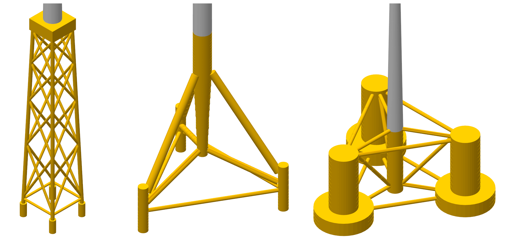
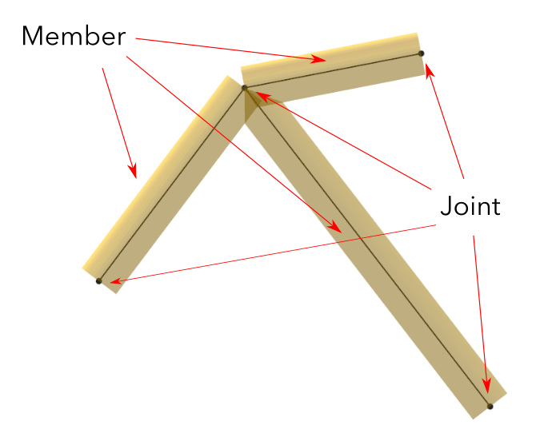
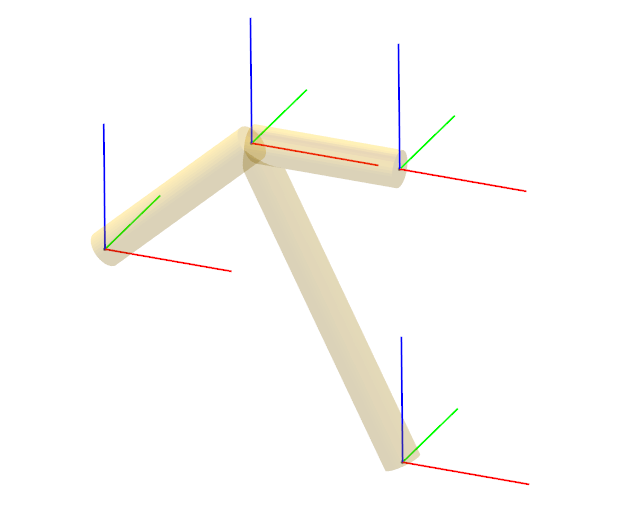
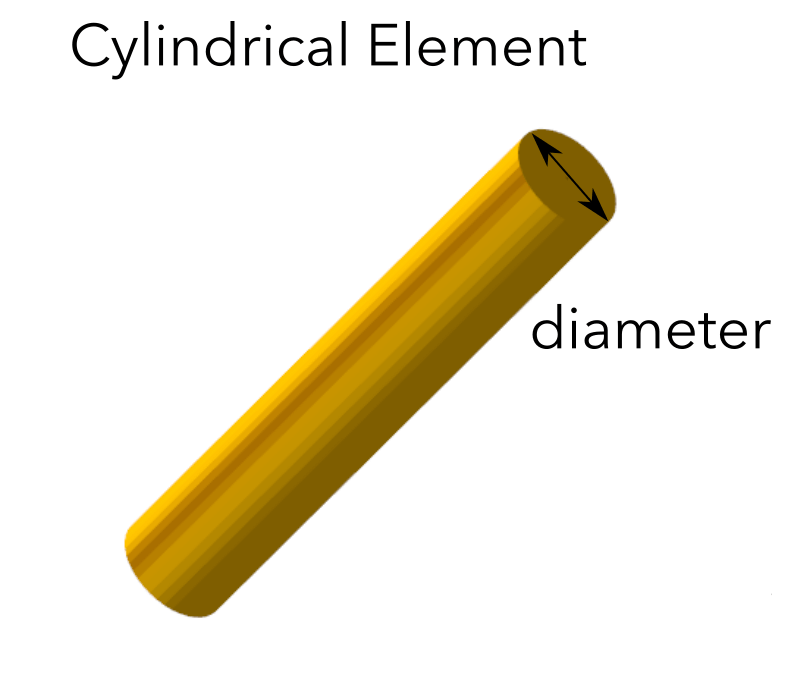
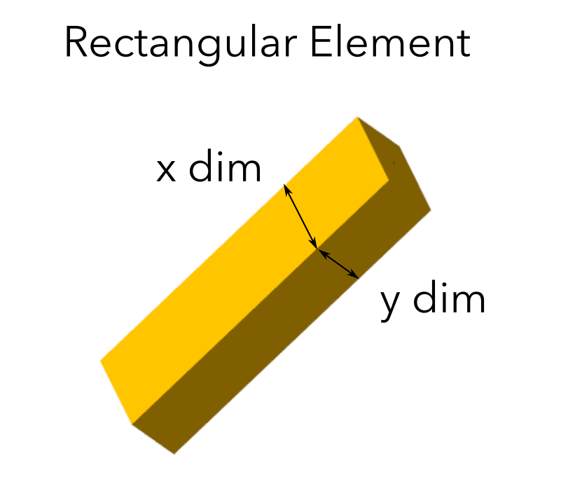
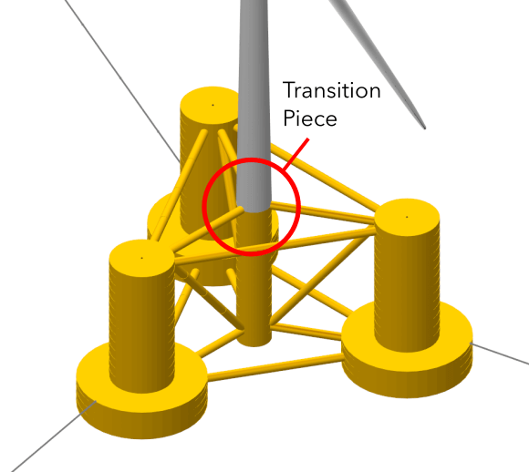
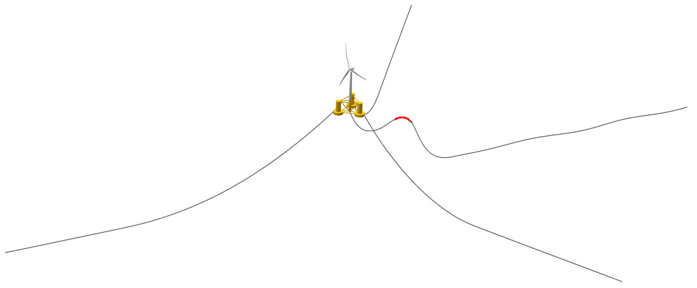
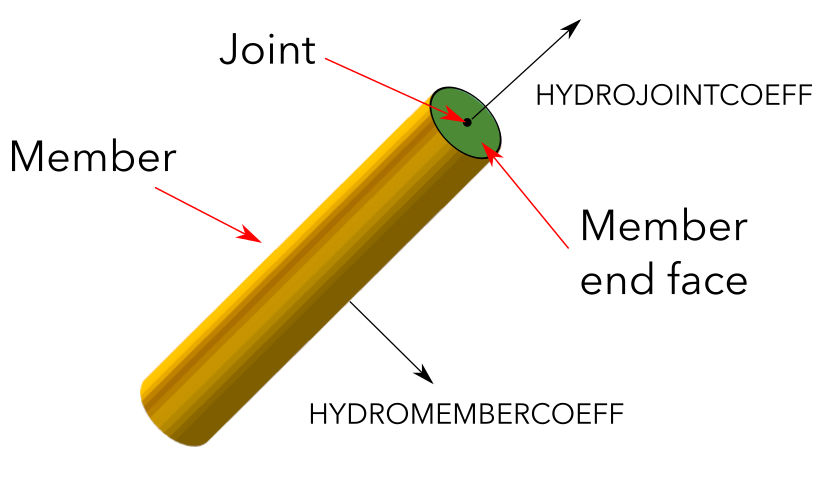

Substructure Design
===================

Substructure Overview
---------------------

Optionally, a substructure definition can be added to the structural model of a wind turbine in QBlade. The substructure definition can fulfill several different roles. Below a few typical applications of substructure definitions are given:

 * **Lattice towers:** The substructure can be used to model the turbine tower with greater freedom as the standard tower file, which can only model tubular, straight towers, for instance by explicitly defining a lattice tower structure in the substructure file.
 * **Floaters and moorings**: The substructure can be used to define the floater of a floating offshore wind turbine (FOWT). This requires that the floater is modeled both hydrodynamically (Morison or Potential flow) and structurally /flexible or rigid) within the substructure definition. The substructure definition is also used to define the mooring system which keeps the floater place.
 * **Soil modeling:** In the substructure file a p-y curve can be defined to model nonlinear soil dynamics, both onshore or offshore.
 * **Multi-rotor assemblies:** The substructure definition is also used to define the substructure of a multi-rotor assembly, with an arbitrary number of rotors.

To add a substructure to a turbine definition you need to add the filename of the substructure definition followed by the keyword :code:`SUBFILE` anywhere within the main structural input file. 

It is possible to connect the substructure either to the tower bottom, torquetube bottom or directly to the rotor nacelle assembly (RNA) of a turbine definition. If the main structural input file contains a :code:`TWRFILE` the transition piece of the substructure (:code:`TP_INTERFACE_POS`) is automatically connected to the tower bottom. If the substructure contains no :code:`TWRFILE` keyword the transition piece is connected to the rotor nacelle assembly (RNA).

.. _fig-substruc-structures:

    Three different substructures (in yellow) connected to the tower bottom (grey).
    
Modeling Options for an Offshore Substructure
---------------------------------------------

When it comes to modeling the hydrodynamics and structural dynamics of an offshore substructure, there are several options to consider. This section is meant to give an overview on how different aspects can be modeled:

Substructure Mass and Inertia
^^^^^^^^^^^^^^^^^^^^^^^^^^^^^

The substructure is typically composed of interconnected members and joints (see :ref:`General Topology of a Substructure`). These members can be modeled as either flexible (with associated stiffness, mass, etc.) or rigid (with or without mass). If the members have nonzero mass properties, the substructure's mass and inertia are explicitly included. Alternatively, the complete substructure's mass can be represented using a 6x6 mass matrix, known as *lumped mass* (see :ref:`Lumped Mass, Inertia and Hydrodynamic Forces`).

Substructure Buoyancy
^^^^^^^^^^^^^^^^^^^^^

Similar to mass and inertia, substructure buoyancy can be modeled explicitly or in a lumped linearized manner. Explicit modeling involves enabling the buoyancy calculation for each member based on its submerged part in the :code:`SUBMEMBERS` table (see :ref:`Substructure Members`). Explicity buoyancy applies buoyancy forces locally to each member. In the lumped approach, a 6x6 hydrodynamic stiffness matrix is defined to represent the substructure's buoyancy restoring forces and moments (see :ref:`Lumped Mass, Inertia and Hydrodynamic Forces`). This linearized hydrodynamic stiffness matrix is valid for small rotations and translations of the substructure.

Substructure Hydrodynamics
^^^^^^^^^^^^^^^^^^^^^^^^^^

The hydrodynamic forces acting on a substructure can be evaluated by means of linear potential flow theory or the Morison equation. When the Morison Equation is used (see :ref:`Morison Equation-Related Parameters`) Morison coefficients are assigned to each substructure member and the resulting forces (based on local wave and floater kinematics) are applied locally to each member. Alternatively, a linear potential flow solver (such as WAMIT, NEMOH, or ANSYS AQWA) can generate databases representing lumped hydrodynamic forces acting on the substructure (see :ref:`Linear Potential Flow-Related Parameters`). Furthermore, it is also possible to assign *lumped* 6x6 hydrodynamic linear or quadratic drag and added mass matrices (see :ref:`Lumped Mass, Inertia and Hydrodynamic Forces`).

Different Scenarios
^^^^^^^^^^^^^^^^^^^

It is possible to combine different approaches mentioned above. A common mix involves using linear potential flow hydrodynamics along with the Morison equation to account for viscous hydrodynamic drag. If obtaining distributed loads for substructure components is important, hydrodynamic forces should be distributed as well (Morison equation with explicit buoyancy modeling), and the substructure members should be modeled as flexible elements. By carefully selecting and combining these modeling options, a comprehensive understanding of the hydrodynamics and structural dynamics of an offshore substructure can be achieved.

Keywords and Tables
-------------------

As with the other structural definition files, the substructure is defined by a series of keywords that are recognized by QBlade when creating the turbine. The format is the same as with the other structural file definitions: 

A parameter is defined by its value followed by the parameter *Keyword*:

* *<Value>* :code:`KEYWORD`, for parameters defined by a single values.
 
.. code-block:: console

	Value	KEYWORD
 
A table is identified by its *Keyword* and the row and column count of the subsequent ASCII values, which need to separated by *space(s)* or *tab(s)*.
An example of a table with two rows and tree columns is shown below.
 
* :code:`KEYWORD` <new line> *<Header>* <new line> *<Values>* for parameters defined by a table. The *<Header>* <new line> part is only optional and can be omitted.

.. code-block:: console

	KEYWORD
	Header1		Header2 	Header3 	...
	Value(1,1)	Value(1,2)	Value(1,3)	...
	Value(2,1)	Value(2,2)	Value(2,3)	...
	...		...		...		...

There is no particular order in which these keywords and the associated data tables should be placed. The only exception is when defining tables. When a table is defined by a keyword, it should be immediately followed by the 
table header (optional) and the table content.

General Topology of a Substructure
----------------------------------

In general, a substructure consists of **Members** that are defined between **Joints**. A **Member** is a cylindrical or rectangular element that connects two **Nodes**. A **Member** is oriented along the vector that connects the two **Joints**, this vector also defines the **Members** length. A **Member** can either be defined as **rigid** or as **flexible**. When several members are defined between the same joint(s), these members are rigidly connected through the common joints (see :numref:`fig-substruc-member_joint`).

.. _fig-substruc-member_joint:

    Three cylindrical members defined between four joints of a substructure.
    
Substructure Joints
-------------------

Joints are defined via the :code:`SUBJOINTS` table. A joint is defined by its position and optionally by its orientation. In most cases it is sufficient to define only the position of the joint, however when imposing constraints along certain degrees of freedom of a joint the joint orientation becomes important. Joints generally dont have a mass, but can be assigned a mass using the :code:`ADDMASS_<JntID>` keyword.

.. _fig-substruc-joint:

    Three subjoints and their coordinate system (x-red, y-blue, z-green).

:code:`SUBJOINTS`
 Defines a table that is used to place spatial joints that help define the members of the substructure. Each row of the table defines one joint and has four entries: the first gives the id number of the joint and the other three the Cartesian coordinates of the joint (in m). The origin is the seabed if :code:`ISFLOATING` is false and the MSL if :code:`ISFLOATING` is true. 
 
 The table is structured as follows:

 .. code-block:: console 
	:caption: : The SUBJOINTS table, no orientation defined

	SUBJOINTS 	
	JntID JntX[m]	  JntY[m]     JntZ[m]	  X1      Y1      Z1      X2      Y2      Z2
	 1     0.00000     0.00000   -20.00000    1.00    0.00    0.00    0.00    1.00    0.00
	 2     0.00000     0.00000    10.00000    1.00    0.00    0.00    0.00    1.00    0.00
	 3    14.43376    25.00000   -14.00000    1.00    0.00    0.00    0.00    1.00    0.00
	 4    14.43376    25.00000    12.00000    1.00    0.00    0.00    0.00    1.00    0.00
	 5   -28.86751     0.00000   -14.00000    1.00    0.00    0.00    0.00    1.00    0.00
	 6   -28.86751     0.00000    12.00000    1.00    0.00    0.00    0.00    1.00    0.00
	 7    14.43376   -25.00000   -14.00000    1.00    0.00    0.00    0.00    1.00    0.00
	 8    14.43376   -25.00000    12.00000    1.00    0.00    0.00    0.00    1.00    0.00
	 9    14.43375    25.00000   -20.00000    1.00    0.00    0.00    0.00    1.00    0.00
	10   -28.86750     0.00000   -20.00000    1.00    0.00    0.00    0.00    1.00    0.00
	11    14.43375   -25.00000   -20.00000    1.00    0.00    0.00    0.00    1.00    0.00
	12     9.23760    22.00000    10.00000    1.00    0.00    0.00    0.00    1.00    0.00
	13   -23.67130     3.00000    10.00000    1.00    0.00    0.00    0.00    1.00    0.00
	14   -23.67130    -3.00000    10.00000    1.00    0.00    0.00    0.00    1.00    0.00
	15     9.23760   -22.00000    10.00000    1.00    0.00    0.00    0.00    1.00    0.00
	16    14.43375   -19.00000    10.00000    1.00    0.00    0.00    0.00    1.00    0.00
	17    14.43375    19.00000    10.00000    1.00    0.00    0.00    0.00    1.00    0.00
	18     4.04145    19.00000   -17.00000    1.00    0.00    0.00    0.00    1.00    0.00
	19   -18.47520     6.00000   -17.00000    1.00    0.00    0.00    0.00    1.00    0.00
	20   -18.47520    -6.00000   -17.00000    1.00    0.00    0.00    0.00    1.00    0.00

:code:`SUBJOINTS` (orientation defined by y- and y-axes)
 Defines a table that is used to place spatial joints that help define the members of the substructure. Each row of the table defines one joint and has four entries: the first gives the id number of the joint and the other three the Cartesian coordinates of the joint (in m). The origin is the seabed if :code:`ISFLOATING` is false and the MSL if :code:`ISFLOATING` is true. 
 
 The values X1, Y1, Z1, X2, Y2 and Z2 are optional and can be used to define the local coordinate axes of the joint. X1, Y1 and Z1 are defining the vector of the joints local X-Axis (in global coordinates). X2, Y2 and Z2 define the joints Y-Axis (in global coordinates). The Z-Axis is then constructed to define a right-hand coordinate system. The standard joint orientation is X1, Y1, Z1 = (1,0,0) and X2, Y2, Z2 = (0,1,0). If the user wants to define joint orientations they have to be defined for each joint in the table.
 
 The table is structured as follows:

 .. code-block:: console 
	:caption: : The SUBJOINTS table, with orientations defined by x- and y-axes

	SUBJOINTS 	
	JntID JntX[m]	  JntY[m]     JntZ[m]	  X1      Y1      Z1      X2      Y2      Z2
	 1     0.00000     0.00000   -20.00000    1.00    0.00    0.00    0.00    1.00    0.00
	 2     0.00000     0.00000    10.00000    1.00    0.00    0.00    0.00    1.00    0.00
	 3    14.43376    25.00000   -14.00000    1.00    0.00    0.00    0.00    1.00    0.00
	 4    14.43376    25.00000    12.00000    1.00    0.00    0.00    0.00    1.00    0.00
	 5   -28.86751     0.00000   -14.00000    1.00    0.00    0.00    0.00    1.00    0.00
	 6   -28.86751     0.00000    12.00000    1.00    0.00    0.00    0.00    1.00    0.00
	 7    14.43376   -25.00000   -14.00000    1.00    0.00    0.00    0.00    1.00    0.00
	 8    14.43376   -25.00000    12.00000    1.00    0.00    0.00    0.00    1.00    0.00
	 9    14.43375    25.00000   -20.00000    1.00    0.00    0.00    0.00    1.00    0.00
	10   -28.86750     0.00000   -20.00000    1.00    0.00    0.00    0.00    1.00    0.00
	11    14.43375   -25.00000   -20.00000    1.00    0.00    0.00    0.00    1.00    0.00
	12     9.23760    22.00000    10.00000    1.00    0.00    0.00    0.00    1.00    0.00
	13   -23.67130     3.00000    10.00000    1.00    0.00    0.00    0.00    1.00    0.00
	14   -23.67130    -3.00000    10.00000    1.00    0.00    0.00    0.00    1.00    0.00
	15     9.23760   -22.00000    10.00000    1.00    0.00    0.00    0.00    1.00    0.00
	16    14.43375   -19.00000    10.00000    1.00    0.00    0.00    0.00    1.00    0.00
	17    14.43375    19.00000    10.00000    1.00    0.00    0.00    0.00    1.00    0.00
	18     4.04145    19.00000   -17.00000    1.00    0.00    0.00    0.00    1.00    0.00
	19   -18.47520     6.00000   -17.00000    1.00    0.00    0.00    0.00    1.00    0.00
	20   -18.47520    -6.00000   -17.00000    1.00    0.00    0.00    0.00    1.00    0.00
	
:code:`SUBJOINTS` (orientation defined by Euler angles))
 An alternative way to define the orientation of the substructure joints is to define the orientation of each joint by means of three consecutive Euler rotations around the global coordinate system. The first rotation is performed around the global X-axis, the second rotation around the global Y-axis and the third rotation around the global Z-axis. The last three columns are also optional, if not defined the orientation of each joint is the same as the global coordinate system.
 
 .. code-block:: console 
	:caption: : The SUBJOINTS table, with orientation defined by Euler angles

	SUBJOINTS 	
	JntID JntX[m]	  JntY[m]     JntZ[m]	  	RotX[deg]    	RotY[deg]    	RotZ[deg]
	 1     0.00000     0.00000   -20.00000		0.00		0.00		0.00
	 2     0.00000     0.00000    10.00000		0.00    	0.00		0.00
	 3    14.43376    25.00000   -14.00000		0.00    	0.00		0.00
	 4    14.43376    25.00000    12.00000		0.00    	0.00		0.00
	 5   -28.86751     0.00000   -14.00000		0.00    	0.00		0.00
	 6   -28.86751     0.00000    12.00000		0.00    	0.00		0.00
	 7    14.43376   -25.00000   -14.00000		0.00    	0.00		0.00
	 8    14.43376   -25.00000    12.00000		0.00    	0.00		0.00
	 9    14.43375    25.00000   -20.00000		0.00    	0.00		0.00
	10   -28.86750     0.00000   -20.00000		0.00    	0.00		0.00
	11    14.43375   -25.00000   -20.00000		0.00    	0.00		0.00
	12     9.23760    22.00000    10.00000		0.00    	0.00		0.00
	13   -23.67130     3.00000    10.00000		0.00    	0.00		0.00
	14   -23.67130    -3.00000    10.00000		0.00    	0.00		0.00
	15     9.23760   -22.00000    10.00000		0.00    	0.00		0.00
	16    14.43375   -19.00000    10.00000		0.00    	0.00		0.00
	17    14.43375    19.00000    10.00000		0.00    	0.00		0.00
	18     4.04145    19.00000   -17.00000		0.00    	0.00		0.00
	19   -18.47520     6.00000   -17.00000		0.00    	0.00		0.00
	20   -18.47520    -6.00000   -17.00000		0.00    	0.00		0.00
	
:code:`JOINTOFFSET`
 Defines a table that can be used to apply a global offset to the positions of all :code:`SUBJOINTS`. Note that the offset is only applied to the joints and not the mass and hydro reference points defined in :ref:`StrDef_LPFT`.

 The table is structured as follows:

 .. code-block:: console
	:caption: : The JOINTOFFSET table

	JOINTOFFSET 	
	XOFF	YOFF	ZOFF
	10	0	0
	
:code:`ADDMASS_<JntID>`
 can be used to add a mass at a joint *<JntID>*. :code:`ADDMASS_<JntID>` can be followed by up to 7 numeric values (at least one) to assign mass and rotational inertia properties. For example: :code:`ADDMASS_5 10 1 2 3 4 5 6` adds a mass of 10kg at the joint with ID 5. The following numbers assign the rotational inertia in local joint coordinates: *Ixx = 1, Iyy = 2, Izz = 3, Ixy = 4, Ixz = 5, Iyz = 6*. 

Substructure Elements
---------------------

Four different types of element exits that can be used to construct the substructure geometry in the :code:`SUBMEMBERS` table. Each element definition, identified by a unique *Element ID*, can be used to generate multiple members. The available element types are: cylidrical flexible elements, cylindrical rigid elements, rectangular flexible elements and rectangular rigid elements. 

.. _fig-substruc-cylindrical:

    A cylindrical element, geometry defined by its end-joints and the diameter.

:code:`SUBELEMENTS`
 Defines a table that defines flexible cylindrical elements that can be used for the substructure definition. Each row represents one (cylindrical) element, which is defined by its structural parameters.
 When setting up the substructure, one :code:`SUBELEMENT` definition can be used for several :code:`SUBMEMBERS` (see below). Each row has 20 entries. These define the structural parameters of the element. 
 The entry placement is very similar to the blade and tower structural element table (see :ref:`StrDef_BladeTower`). There two important differences though.
   
 1) The first entry is used to indicate the ID number of the element (ElemID).
 2) The last (20th) entry is used to indicate the Rayleigh damping of the element.
   
 .. code-block:: console
   	:caption: : The SUBELEMENTS table

	SUBELEMENTS
	ElemID	MASS_[kg/m]	Eix_[N.m^2]	Eiy_[N.m^2]	EA_[N]		GJ_[N.m^2]	GA_[N]		STRPIT_[deg]	KSX_[-]		KSY_[-]		RGX_[-]		RGY_[-]		XCM_[-]		YCM_[-]		XCE_[-]		YCE_[-]		XCS_[-]		YCS_[-]		DIA_[m]		DAMP[-]
	1	4.7868E+03	6.7007E+13	6.7007E+13	1.2805E+13	5.0380E+13	0.0000E+00	0.0000E+00	5.0000E-01	5.0000E-01	2.7735E-01	2.7735E-01	0.0000E+00	0.0000E+00	0.0000E+00	0.0000E+00	0.0000E+00	0.0000E+00	6.5000E+00	1.0000E-02
	2	1.7668E+04	8.4228E+14	8.4228E+14	4.7263E+13	4.7260E+13	0.0000E+00	0.0000E+00	5.0000E-01	5.0000E-01	2.0412E-01	2.0412E-01	0.0000E+00	0.0000E+00	0.0000E+00	0.0000E+00	0.0000E+00	0.0000E+00	1.2000E+01	1.0000E-02
	3	3.5424E+04	6.7890E+15	6.7890E+15	9.4764E+13	5.1050E+15	0.0000E+00	0.0000E+00	5.0000E-01	5.0000E-01	1.4434E-01	1.4434E-01	0.0000E+00	0.0000E+00	0.0000E+00	0.0000E+00	0.0000E+00	0.0000E+00	2.4000E+01	1.0000E-02
	4	6.8297E+02	5.7201E+11	5.7201E+11	1.8271E+12	4.3010E+11	0.0000E+00	0.0000E+00	5.0000E-01	5.0000E-01	5.5902E-01	5.5902E-01	0.0000E+00	0.0000E+00	0.0000E+00	0.0000E+00	0.0000E+00	0.0000E+00	1.6000E+00	1.0000E-02

:code:`SUBELEMENTSRIGID`
 Defines a table that defines rigid elements that will be used for the substructure definition. Each row represents one (cylindrical) element, which is defined by two attributes: its mass density and its diameter.
 When setting up the substructure, one :code:`SUBELEMENTRIGID` definition can be used for several :code:`SUBMEMBERS` (see below). An exemplary table is shown below.

 .. code-block:: console
   	:caption: : The SUBELEMENTSRIGID table

	SUBELEMENTSRIGID
	ElemID 	BMASSD	DIAMETER
	1	1	6.5
	2	1	12
	3	1 	24
	4	1 	1.6

.. _fig-substruc-rectangular:

    A rectangular element, geometry defined by its end-joints and its x and y dimension.

:code:`SUBELEMENTS_RECT`
 Defines a table that defines rectangular flexible elements that will be used for the substructure definition. Each row represents one (rectangular) element, which is defined by its structural parameters.
 The only difference between the :code:`SUBELEMENTS_RECT` and the :code:`SUBELEMENTS` tables is that the element dimensions along its local x-axis (*XDIM* column 19) and its local y-axis (*YDIM* column 20) need to be specified, instead of the cylindrical diameter. Thus, two additional values are required and the Rayleigh damping coefficient is shifted to column 22 accordingly. The diameter is in this case only used as a hydrodynamic equivalent diameter for the calculation of Morison forces at the end faces of a member (if a :code:`HYDROJOINTCOEFF` is defined for one of the members end nodes).
  
 .. code-block:: console
   	:caption: : The SUBELEMENTS_RECT table

	SUBELEMENTS_RECT
	ElemID	MASS_[kg/m]	Eix_[N.m^2]	Eiy_[N.m^2]	EA_[N]		GJ_[N.m^2]	GA_[N]		STRPIT_[deg]	KSX_[-]		KSY_[-]		RGX_[-]		RGY_[-]		XCM_[-]		YCM_[-]		XCE_[-]		YCE_[-]		XCS_[-]		YCS_[-]		XDIM_[m]	YDIM_[m]	DIA_[m]		DAMP[-]
	1	4.7868E+03	6.7007E+13	6.7007E+13	1.2805E+13	5.0380E+13	0.0000E+00	0.0000E+00	5.0000E-01	5.0000E-01	2.7735E-01	2.7735E-01	0.0000E+00	0.0000E+00	0.0000E+00	0.0000E+00	0.0000E+00	0.0000E+00	6.5000E+00	6.5000E+00	6.5000E+00	1.0000E-02
	2	1.7668E+04	8.4228E+14	8.4228E+14	4.7263E+13	4.7260E+13	0.0000E+00	0.0000E+00	5.0000E-01	5.0000E-01	2.0412E-01	2.0412E-01	0.0000E+00	0.0000E+00	0.0000E+00	0.0000E+00	0.0000E+00	0.0000E+00	1.2000E+01	1.2000E+01	1.2000E+01	1.0000E-02
	3	3.5424E+04	6.7890E+15	6.7890E+15	9.4764E+13	5.1050E+15	0.0000E+00	0.0000E+00	5.0000E-01	5.0000E-01	1.4434E-01	1.4434E-01	0.0000E+00	0.0000E+00	0.0000E+00	0.0000E+00	0.0000E+00	0.0000E+00	2.4000E+01	2.4000E+01	2.4000E+01	1.0000E-02
	4	6.8297E+02	5.7201E+11	5.7201E+11	1.8271E+12	4.3010E+11	0.0000E+00	0.0000E+00	5.0000E-01	5.0000E-01	5.5902E-01	5.5902E-01	0.0000E+00	0.0000E+00	0.0000E+00	0.0000E+00	0.0000E+00	0.0000E+00	1.6000E+00	1.6000E+00	1.6000E+00	1.0000E-02

:code:`SUBELEMENTSRIGID_RECT`
 Defines a table that defines rectangular rigid elements that will be used for the substructure definition. Each row represents one (rectangular) element, which is defined by four attributes: its mass density, its dimensions along the local x- and y-axis and an equivalent hydrodynamic diameter which is used to evaluate hydrodynamic forces at the members end faces.
 When setting up the substructure, one :code:`SUBELEMENTRIGID_RECT` definition can be used for several :code:`SUBMEMBERS` (see below). An exemplary table is shown below.

 .. code-block:: console
   	:caption: : The SUBELEMENTSRIGID_RECT table

	SUBELEMENTSRIGID_RECT
	ElemID 	BMASSD	XDIM	YDIM	DIA
	1	1	2	6	1
	2	1	3	1	1
	3	1 	5	5	1
	4	1 	4	2	1
	
:code:`STIFFTUNER`
 A multiplication factor that affects the stiffness of the flexible elements defined in :code:`SUBELEMENTS`.

:code:`MASSTUNER`
 A multiplication factor that affects the mass density of ALL elements defined in :code:`SUBELEMENTS`.

Substructure Members
--------------------

The members of the substructure are defines within the :code:`SUBMEMBERS` table. Each line in the table generated one element that is defined by an element definition, identified by its *Element ID* and two joints, defined by their *Joint ID*. In addition the :code:`SUBMEMBERS` table assigns the member rotation (for rectangular elements) hydrodynamic coefficients, marine growth, flooded area and the discretization for each member.

:code:`SUBMEMBERS`
 Defines a table that contains the members that make up the turbine substructure. A member, with the ID **MemID**, is defined between two entries of the :code:`SUBJOINTS` table (**Jnt1ID** and **Jnt2ID**) and one entry from an element table (**ElmID**) (:code:`SUBELEMENTS`, :code:`SUBELEMENTSRIGID`, :code:`SUBELEMENTS_RECT`, :code:`SUBELEMENTSRIGID_RECT`). The column **ElmRot** can be used to rotate the member around its principal axis. Rotations are entered in degree.
 Additionally, it can have one Morison force coefficients group (**HyCoID**) defined in the :code:`HYDROMEMBERCOEFF` table and a marine growth entry (**MaGrID**) from the :code:`MARINEGROWTH` table. Also, this table allows the member to be flooded via a flooded cross sectional area entry in [m^2] (**FldArea**). The member can be subdivided into smaller elements for a more accurate structural and hydrodynamic evaluation. This is done in the **MemDisc** column; it gives the maximum allowed length of a discrete structural element of the member in [m]. Also, this table has the option to enable the buoyancy forces (**IsBuoy**) for the individual members (0 = False, 1 = True). Finally, the member can be optionally named for easier recognition in the output tables (**Name**). The last three optional columns can be used to assign a unique color, specified by its RBG components (**Red**, **Green**, **Blue**), to the member.
  
 The keyword table has the following format:

 .. code-block:: console
   	:caption: : The SUBMEMBERS table

	SUBMEMBERS
	MemID	Jnt1ID	Jnt2ID	ElmID	ElmRot	HyCoID	IsBuoy 	MaGrID	FldArea	MemDisc	Name 			Red	Green	Blue
	 1	1	2	1	0	3	1	0	0	2	Main_Column		100	200	100
	 2	45	4	2	0	4	1	0	0	2	Upper_Column_1		100	200	100
	 3	46	6	2	0	4	1	0	0	2	Upper_Column_2		100	200	100
	 4	47	8	2	0	4	1	0	0	2	Upper_Column_3		100	200	100
	29	3	45	2	0	4	1	0	0	2	Upper_Column_flooded_1	100	200	100
	30	5	46	2	0	4	1	0	0	2	Upper_Column_flooded_2	100	200	100
	31	7	47	2	0	4	1	0	0	2	Upper_Column_flooded_3	100	200	100
	 5	48	3	3	0	5	1	0	0	2	Base_Column_1		100	200	100
	 6	49	5	3	0	5	1	0	0	2	Base_Column_2		100	200	100
	 7	50	7	3	0	5	1	0	0	2	Base_Column_3		100	200	100
	26	42	48	3	0	5	1	0	0	2	Base_column_flooded_1	100	200	100
	27	43	49	3	0	5	1	0	0	2	Base_column_flooded_2	100	200	100
	28	44	50	3	0	5	1	0	0	2	Base_column_flooded_3	100	200	100
	
Substructure Constraints    	
------------------------

When multiple members are connected to the same joint these members are *rigidly* constrained through this common joint. By using the :code:`SUBCONSTRAINTS` table it is possible to constrain arbitrary joints, and thereby also the element connected to those joints. The :code:`SUBCONSTRAINTS` table also allows to **fix** a joint or to connect a joint with the **transition piece**, which connects to the turbine structure. The joints can be constrained along any of their degrees of freedom (DoF). Furthermore, it is possible to constrain joints with a spring or damper, instead of a rigid constraint.

:code:`SUBCONSTRAINTS`
 Defines the table that defines the constraints between two joints that are not already connected by members, constraints of joints to the ground or to one :code:`TP_INTERFACE_POS` transition piece point. 
 
 Each row of the table has 12 entries. The first entry defines the constraint ID number (**CstID**). The next entry define the joint which shall be constrained (**JntID**). The joint can now be constrained to a second joint, by inserting its JntID into the **JntCon** column, to a :code:`TP_INTERFACE_POS` by inserting its number into the 4th column (**TpCon**) or to the ground by setting the **GrdCon** column to 1. A joint can **either** between two joints (**JntCon**) or one joint and one transition piece (**TpCon**) point or one joint and the ground (**GrdCon**), so only one of these three columns should be used at the same time. 
 
 The sixth entry specifies the constraint to be realized via a non-linear spring-damping element (defined via an the spring ID number). If no spring or damper element is selected the constraint is realized as stiff.
 The last 6 entries specify which degrees of freedom are constrained (either stiff or with a spring damper element): the three translational and three rotational degrees of freedom. 
 
 For these entries 0 means unconstrained and 1 means constrained. A spring-damper element is always acting along the constrained degrees of freedom. 
 The coordinate system for these constraints is defined by the type that JointID1 is connected to. If Joint1ID is connected to Joint2ID the coordinate system in which this constrained is carried out is that of Joint2ID. If Joint1ID is connected to the transition piece the coordinate system of the transition piece is utilized for the connection. A connection with the ground is realized in the global world coordinate system.
 
 An exemplary :code:`SUBCONSTRAINTS` table is shown below. In this example all joints in the table are connected directly to the transition piece.

 .. code-block:: console
   	:caption: : The SUBCONSTRAINTS table

	SUBCONSTRAINTS
	CstID	JntID	JntCon	TpCon	GrdCon	Spring	DoF_X	DoF_Y	DoF_Z	DoF_rX	DoF_rY	DoF_rZ
	1	2	0	1	0	0	1	1	1	1	1	1
	2	24	0	1	0	0	1	1	1	1	1	1
	3	26	0	1	0	0	1	1	1	1	1	1
	4	28	0	1	0	0	1	1	1	1	1	1
	8	30	0	1	0	0	1	1	1	1	1	1
	9	32	0	1	0	0	1	1	1	1	1	1
	10	34	0	1	0	0	1	1	1	1	1	1
	14	12	0	1	0	0	1	1	1	1	1	1
	15	14	0	1	0	0	1	1	1	1	1	1
	16	16	0	1	0	0	1	1	1	1	1	1
	
 Note that at least one joint of the substructure members :code:`SUBMEMBERS` should be constrained to the transition piece (defined by :code:`TP_INTERFACE_POS`), to connect the member to the tower bottom of the wind turbine. 
 
 **Connections to a Second Transition Piece**
  A joint can be connected to any created transition piece by entering number of the :code:`TP_INTERFACE_POS_<X>` into the *TpCon* column. 
 
 **Connections to the Torquetube**
  When building a floater for a vertical axis wind turbine (VAWT) the user also has the option to connect a joint to the bottom of a rotating torquetube. This is done by inserting a negative number into the **TpCon** column. So to connect to the torquetube of the 1st turbine, the user would insert -1 into column **TpCon**. To connect to the torquetube bottom of the second turbine insert -2.
  
  It is also possible to connect a joint to the top of the torquetube of any turbine, to do this subtract 100 from the value inserted in the *TpCon* column. As an example: to connect to the torquetube top of the second turbine (located at :code:`TP_INTERFACE_POS_2`) insert -102 in the *TpCon* column.
 
 **Connections to the Tower Top**
  Connections to the tower top are realized in a similar way as connections to the torquetube top. By adding 100 into column *TpCon*. So to connect to the tower top of turbine 1 insert 101 in column *TpCon*.

The Transition Piece
--------------------

.. _fig-substruc-transition_piece:

    
    The transition piece

The transition piece is the reference position in the substructure definition that defines the interface between the turbine definition and the substructure. It is possible to connect the substructure either to the tower bottom, to the torquetube bottom or directly to the rotor nacelle assembly (RNA) of a turbine definition. If the main structural input file contains a :code:`TWRFILE` the transition piece of the substructure (:code:`TP_INTERFACE_POS`) is automatically connected to the tower bottom. If the substructure contains no :code:`TWRFILE` keyword the transition piece is connected to the rotor nacelle assembly (RNA). Through the :code:`SUBCONSTRAINTS` table joints (and their connected members) can be connected to the transition piece. 

:code:`TP_INTERFACE_POS_<X>`
 Defines the (x,y,z) coordinates (in m) of the position of the transition piece location of the substructure. It is defined as the point where the substructure is connected to the tower base of the wind turbine. 
 * For floating substructures it is defined in (x,y,z) [m] from the MSL = (0,0,0). 
 * For bottom fixed substructures, it is defined from the seabed. 
 Note that the inertia and hydrodynamic reference points (:code:`REF_COG_POS` and :code:`REF_HYDRO_POS`) are always automatically constrained to this point (see :ref:`StrDef_LPFT`). There can be several transition piece points. Further points are then defined by adding additional keywords where an underscore and a number is added to the keyword (e.g. :code:`TP_INTERFACE_POS_2`). This allows the user to define additional inertia and hydrodynamic reference points (see :ref:`StrDef_LPFT`). If a multi-rotor wind turbine is simulated the TP_INTERFACE_POS_1 would automatically connect to the tower bottom of turbine 1, TP_INTERFACE_POS_2 would automatically connect to the tower bottom of turbine 2 and so on.All transition piece points can be constrained to a joint of the substructure in the :code:`SUBCONSTRAINTS` table.  
 The structure of the table is:

   .. code-block:: console
   	:caption: : The TP_INTERFACE_POS table

	TP_INTERFACE_POS
	X[m]		Y[m]		Z[m]
	0 		0 		10
	
 Note: for the 1st :code:`TP_INTERFACE_POS_<X>` the numbering **_1** can be omitted, so TP1 can be defined by the keyword :code:`TP_INTERFACE_POS`. This is also true for the definitions of all following reference points.

:code:`TP_ORIENTATION_<X>` (orientation defined by x- and y -axes)
 Defines the orientation of the tower base or RNA coordinate system which is connected to the :code:`TP_INTERFACE_POS_<X>` by defining its :math:`X_t`- and :math:`Y_t`-Axis in the global coordinate system. The first row defines the X-axis (:math:`X_{tp}`) orientation and the second row defines the Y-axis (:math:`Y_{tp}`) orientation of the transition piece coordinate system. 
 If :code:`TP_ORIENTATION_<X>` is not specified the default values are :math:`X_{tp}=(1,0,0)` and :math:`Y_{tp}=(0,1,0)`, so the tower base coordinate system is aligned with the global coordinate system. The :math:`Z_t`-Axis is evaluated from the cross-product of :math:`X_t` and :math:`Y_t`.

   .. code-block:: console
   	:caption: : The TP_ORIENTATION 2x3 table

	TP_ORIENTATION
	X[m]		Y[m]		Z[m]
	1 		0 		0
	0 		1 		0
	
:code:`TP_ORIENTATION_<X>` (orientation defined by Euler angles)
 An alternative way of defining the orientation of the tower base or RNA is to specify the orientation by means of three Euler angles. Starting from the global coordinate system three consecutive Euler rotations are performed, first around the global X, second around the global Y and third around the global Z axis.  

   .. code-block:: console
   	:caption: : The TP_ORIENTATION 1x3 table

	TP_ORIENTATION
	Rot_X[deg]	Rot_Y[deg]	Rot_Z[deg]
	30 		0 		0
	
Lumped Mass, Inertia and Hydrodynamic Forces
--------------------------------------------

.. _fig-substruc-lpft-ref:
.. figure:: lpft_ref_points.png
    :align: center
    :alt: LPFT ref. points.

    Main reference points for the substructure. The inertia reference point :code:`REF_COG_POS` and the hydrodynamic reference point :code:`REF_HYDRO_POS` are constrained to the transition piece point :code:`TP_INTERFACE_POS`.

For each transition piece multiple reference position exist, which are rigidly constrained with the transition piece. These reference points can be used to assign lumped masses, lumped hydrodynamic forces (such as linear stiffness or damping) or lumped hydrodynamic added mass. The :code:`REF_HYDRO_POS_<X>` reference point also acts as the position at which the forces from *linear potential flow* data are applied to the substructure (see :ref:`Linear Potential Flow-Related Parameters`).

:code:`REF_COG_POS_<X>`
 defines the (x,y,z) position (in m) of a inertia point of the system (i.e. the center of gravity). It is in this position that the :code:`SUB_MASS` matrix is evaluated. This point is automatically constrained to the transition piece, defined by :code:`TP_INTERFACE_POS`. It has the following format:
  
 .. code-block:: console
   	:caption: : The REF_COG_POS table

	REF_COG_POS 
	X[m]		Y[m]		Z[m]
	0		0		-13.46

:code:`SUB_MASS_<X>`
 defines a complete 6 by 6 mass and rotational inertia matrix that is placed in the location defined by the :code:`REF_COG_POS_<X>` keyword. The units are kg for the mass and kg m^2 for the inertia. An example of this matrix is shown below:

 .. code-block:: console
   	:caption: : The SUB_MASS table

	SUB_MASS
	1.34730e+07   0.00000e+00   0.00000e+00   0.00000e+00   0.00000e+00   0.00000e+00
	0.00000e+00   1.34730e+07   0.00000e+00   0.00000e+00   0.00000e+00   0.00000e+00
	0.00000e+00   0.00000e+00   1.34730e+07   0.00000e+00   0.00000e+00   0.00000e+00
	0.00000e+00   0.00000e+00   0.00000e+00   6.82700e+09   0.00000e+00   0.00000e+00
	0.00000e+00   0.00000e+00   0.00000e+00   0.00000e+00   6.82700e+09   0.00000e+00
	0.00000e+00   0.00000e+00   0.00000e+00   0.00000e+00   0.00000e+00   1.22600e+10

:code:`REF_HYDRO_POS_<X>`
 defines the (x,y,z) position (in m) of a hydrodynamic evaluation point of the system (i.e. where the lumped hydrodynamic forces are applied). It is in this position that the hydrodynamic matrices (e.g. :code:`SUB_HYDROSTIFFNESS_<X>`, :code:`SUB_HYDRODAMPING_<X>`, :code:`SUB_HYDROADDEDMASS_<X>`, etc.) and the radiation and excitation forces are applied. This point is directly constrained to the :code:`TP_INTERFACE_POS_<X>` point, so no additional constraints are necessary to attach this point to the substructure. It has the following format:

 .. code-block:: console
   	:caption: : The REF_HYDRO_POS_1 table

	REF_HYDRO_POS_1 
	X[m]		Y[m]		Z[m]
	0		0		-10.00

:code:`SUB_HYDROSTIFFNESS_<X>`
 defines a complete 6 by 6 stiffness matrix that is evaluated in the location defined by the :code:`REF_HYDRO_POS_<X>` keyword. The units are N/m, N/rad, Nm/m, Nm/rad, depending on the entry. The general form of this matrix is shown below:
 
 .. code-block:: console
   	:caption: : The SUB_HYDROSTIFFNESS_1 table

	SUB_HYDROSTIFFNESS_1
	0		0		0		0		0		0
	0		0		0		0		0		0
	0		0		3.32941e+05	0		0		0
	0		0		0		-4.99918e+09	0		0
	0		0		0		0		-4.99918e+09 	0
	0		0		0		0		0		9.834e+07

:code:`SUB_HYDRODAMPING_<X>`
 defines a complete 6 by 6 damping matrix that is evaluated in the location defined by the :code:`REF_HYDRO_POS_<X>` keyword. The units are N/(m/s), N/(rad/s), Nm/(m/s) or Nm/(rad/s), depending on the entry. This matrix has the same form as the :code:`SUB_HYDROSTIFFNESS_<X>` matrix.

:code:`SUB_HYDROQUADDAMPING_<X>`
 defines a complete 6 by 6 quadratic damping matrix that is evaluated in the location defined by the :code:`REF_HYDRO_POS_<X>` keyword. The units are N/(m/s)^2, N/(rad/s)^2, Nm/(m/s)^2, Nm/(rad/s)^2, depending on the entry. This matrix has the same form as the :code:`SUB_HYDROSTIFFNESS_<X>` matrix.

:code:`SUB_HYDROADDEDMASS_<X>`
 defines a complete 6 by 6 added mass matrix that is evaluated in the location defined by the :code:`REF_HYDRO_POS_<X>` keyword. The units are kg. This matrix has the same form as the :code:`SUB_HYDROSTIFFNESS_<X>` matrix.

:code:`SUB_CONSTFORCE_<X>`
 applies a constant force (and/or torque) to the :code:`REF_HYDRO_POS_<X>` point. It can be used to e.g. model the constant buoyancy force acting on the floater in its equilibrium position. The units are N or Nm, depending on the entry.
  
 .. code-block:: console
   	:caption: : The SUB_HYDROCONSTFORCE_1 table

	SUB_HYDROCONSTFORCE_1 //the constant hydrodynamic buoyancy (and other forces,moments) 
	0		0		8.07081e+07	0		0		0
	
:code:`SUB_DISPLACEDVOLUME_<X>`
 applies a constant force in the global z-direction to the :code:`REF_HYDRO_POS_<X>` point that is calculated based on the displaced water volume given by the user. It can be used to e.g. model the constant buoyancy force acting on the floater in its equilibrium position in a simple way without evaluating the force directly. This force is added to the :code:`SUB_CONSTFORCE_<X>` entries, but can be used without specifying :code:`SUB_CONSTFORCE_<X>`.

Cable Elements and Ground-Fixing
--------------------------------

.. _fig-turbine-cables:

    
    Mooring lines connected to a floating wind turbine for ground fixing.

The connection to the ground is handled differently for floating and fixed-bottom substructures. For floating substructures, the anchoring is done via the mooring lines defined with the :code:`MOORELEMENTS` and 
:code:`MOORMEMBERS` keywords. These keywords can also be used to define flexible cable elements of the substructure. For bottom-fixed substructures, the connection the ground is defined in the :code:`SUBCONSTRAINTS` table.
It can be either a rigid connection or a connection via a system of non-linear springs and dampers. These latter elements are defined with the keywords :code:`NLSPRINGDAMPERS` and optionally :code:`SPRINGDAMPK`.

:code:`MOORELEMENTS` 
 is a table that contains the structural parameters of the flexible cable elements of the substructure such as mooring lines. Each row defines one set of parameters and has 6 values. These are the mooring element ID number, the mass per length [kg/m], bending stiffness around y or x in [Nm^2], the axial stiffness in [N], a structural (longitudinal) damping coefficient and a hydrodynamic diameter in [m], which is used during buoyancy and Morison force evaluations.

 .. code-block:: console
   	:caption: : The MOORELEMENTS table

	MOORELEMENTS
	MooID	MASS_[kg/m]	EIy_[N.m^2]	EA_[N]		DAMP_[-]	DIA_[m]
	1	1.086306E+02	6.148892E+08	7.536117E+08	0.001		0.077
	2	2.013616E+02	4.234759E+08	8.513517E+08	0.001		0.137
	
 In some cases, if a too large alpha damping coefficient is used for a mooring line element, the simulation can become unstable. In most cases, damping may be set to zero for the mooring lines.

:code:`MOORMEMBERS`
 is a table that contains the information of the cable members (such as the mooring lines). Each row defines one cable member and has 10 entries. The first entry is the ID number of the cable member. The next two entries are the connection points of the cable member. There are several ways of defining the connection points. These are:
  
 - With the keyword :code:`JNT_<ID>`, where <ID> represents the ID of the joint. This way, the cable is connected directly to a existing joint.
 - With the keyword :code:`FLT_<XPos>_<YPos>_<ZPos>`, where <XPos>_<YPos>_<ZPos> represent the global (x,y,z) coordinates of the connection point (in m). Here, QBlade creates a constraint between this point and the floater to attach the cable.
 - With the keyword :code:`GRD_<XPos>_<YPos>`, where <XPos>_<YPos> represent the global (x,y) (in m) coordinates of an anchor point which is located at the z-position of the seabed.
  
 The fourth entry is the length of the cable (in m). The fifth entry is the ID number of the cable element defined in :code:`MOORELEMENTS`. The sixth entry is the ID number of the hydrodynamic coefficient group defined in :code:`HYDROMEMBERCOEFF`.
 The seventh entry specifies if the cable is buoyant (= 1) or not (= 0). The eighth entry specifies the ID number of the marine growth element used for this cable (see :code:`MARINEGROWTH`). The ninth entry is the number of discretization nodes used 
 to discretize the cable and the tenth entry is the name of the cable element.

 .. code-block:: console
   	:caption: : The MOORMEMBERS table

	MOORMEMBERS
	ID	CONN_1				CONN_2			Len.[m]	MoorID 	HyCoID	IsBuoy	MaGrID	ElmDsc	Name
	1	FLT_-40.868_0.0_-14.0		GRD_-837.6_0		835.5	1	1	1	0	30	Mooring1
	2	FLT_20.434_35.393_-14.0		GRD_418.8_725.4		835.5	1	1	1	0	30	Mooring2
	3	FLT_20.434_-35.393_-14.0	GRD_418.8_-725.4	835.5	1	1	1	0	30	Mooring3

Cable Element Lineloads
^^^^^^^^^^^^^^^^^^^^^^^

:code:`MOORLOADS`
 is a table that allows to add buoyancy loads or additional weight to a cable member defined in the :code:`MOORMEMBERS` table. The first column is the cable member ID, the second column the starting position of the load, the third column is the end position of the load and the fourth column the load itself, defined in [N/m]. The loads only act along the global Z-Axis. A positive load is pointing upwards and a negative load is pointing downwards.
 
 .. _fig-moor-loads:
 .. figure:: moor_load.png
    :align: center
    :alt: A buoyancy load acting on a power cable.
    
    A buoyancy load acting on a power cable.

    
 .. code-block:: console
   	:caption: : The MOORLOADS table
	
	MOORLOADS
	ID	Start[m]	End [m]		Force [N/m]
	1	150		180		2000	
	3	520		550		2000

Nonlinear Spring and Damper Constraints
---------------------------------------

:code:`NLSPRINGDAMPERS`
 is a table that defines one or more non-linear spring-damper systems for connecting the substructure to the ground, or for the interconnection of two joints in the constraints table. A usual application would be to model the soil dynamics using nonlinear (p-y curves) springs. Another application would be to define compliant connections between substructure members or joints. Furthermore, in the :code:`SUBCONSTRAINTS` table the nonlinear springs, or dampers may be assigned to constrain any or all degrees of freedom of choice.
 
 Each row in the :code:`NLSPRINGDAMPERS` table represents a spring-damper system and has 2N + 3 entries, where N is the number of points on the definition table of the non-linear spring/damper. The first entry represents the ID number of the system (used in the :code:`SUBCONSTRAINTS` table). The second entry defines the type of system that is being modeled. There are two options: 'spring' and 'damp'. This affects the way the coefficients in the following entries are interpreted. 

 - If 'spring' is selected, then QBlade expects the definition table to consists of displacement or rotation (in m or rad) and stiffness (in N/m or Nm/rad) entries.
 - If 'damp' is selected, then QBlade expects the definition table to consist of velocity (in m/s or rad/s) and damping (in N(m/s) or Nm/(rad/s)) entries.
  
 When a spring or damper is used to constrain two joints its nonlinear definition always acts as a rotational spring or damper along the rotational DOF's and as a translational spring or damper along the translational DOF's. Thus, usually a spring is either defined as a rotational spring and then assigned to constrain rotational DOF's or as a translational spring to constrain translational DOF's.
  
 The third row represents the stiffness/damping at zero displacement/velocity. The following 2N entries represent the additional lookup table entries for the non-linear spring/damper system. The order is :math:`x_1/v_1`, :math:`K/D(x_1/v_1)`; :math:`x_2/v_2`, :math:`K/D(x_2/v_2)` and so on.

 .. code-block:: console
	:caption: : The NLSPRINGDAMPERS table

	NLSPRINGDAMPERS
	ElemID	Type	Coefficient (for x = 0)	Coefficient & Displacement/Velocity Sets (for NL springs, dampers)
	1	spring	0.000E+00	1.000	1.160E+06
	2	spring	0.000E+00	1.000	9.000E+06
	3	spring	0.000E+00	1.000	2.090E+07
	4	spring	0.000E+00	1.000	3.560E+07
	5	spring	0.000E+00	1.000	5.220E+07
	6	spring	0.000E+00	1.000	8.020E+07
	7	spring	0.000E+00	1.000	1.140E+08
	8	spring	0.000E+00	1.000	1.430E+08
	9	spring	0.000E+00	1.000	1.720E+08
	10	spring	0.000E+00	1.000	2.000E+08
	11	spring	0.000E+00	1.000	2.280E+08
	12	spring	0.000E+00	1.000	2.540E+08
	13	spring	0.000E+00	1.000	2.800E+08
	14	spring	0.000E+00	1.000	3.050E+08
	15	spring	0.000E+00	1.000	3.850E+08
	16	spring	0.000E+00	1.000	4.600E+08
	17	spring	0.000E+00	1.000	4.950E+08
	18	spring	0.000E+00	1.000	5.300E+08
	19	spring	0.000E+00	1.000	5.660E+08
	20	spring	0.000E+00	1.000	6.010E+08
	21	spring	0.000E+00	1.000	6.360E+08
	22	spring	0.000E+00	1.000	6.710E+08
	23	spring	0.000E+00	1.000	7.070E+08
	24	spring	0.000E+00	1.000	7.420E+08
	25	spring	0.000E+00	1.000	7.770E+08
	26	spring	0.000E+00	1.000	8.130E+08
	27	spring	0.000E+00	1.000	8.480E+08
	28	spring	0.000E+00	1.000	8.830E+08
	29	spring	0.000E+00	1.000	9.190E+08
	30	spring	0.000E+00	1.000	9.540E+08
	31	spring	0.000E+00	1.000	9.890E+08
	32	spring	0.000E+00	1.000	1.020E+09
	33	spring	0.000E+00	1.000	1.060E+09
	34	spring	0.000E+00	1.000	1.100E+09
	35	spring	0.000E+00	1.000	1.130E+09
	36	spring	0.000E+00	1.000	1.170E+09
	37	spring	0.000E+00	1.000	5.950E+08

:code:`SPRINGDAMPK`
 is an optional proportionality constant to add a damping value to the spring elements. If this keyword is used, then all of the spring elements defined in :code:`NLSPRINGDAMPERS` are treated as spring-damping systems. The additional damping coefficients are calculated using the following approach: :math:`D_i`  = :code:`SPRINGDAMPK` :math:`\cdot K_i`.  This keyword does not affect the 'damp' elements defined in :code:`NLSPRINGDAMPERS`.

Hydrodynamic Modeling of a Substructure
---------------------------------------

Two options are available in QBlade to model the hydrodynamic forces acting on an offshore substructure: The Morison equation and the linear potential flow theory.

When modeling the hydrodynamics using the Morison equation the user can distribute hydrodynamic coefficients that act in the normal direction of a substructure member. Furthermore, coefficients can be added to substructure joints so that the Morison equation is applied to the end faces of members. Thus, when modeling the hydrodynamics using the Morison equation the hydrodynamic forces are *distributed* over the substructure model. 

The second option is to model the hydrodynamic forces using a linear potential flow theory generated database. At present, QBlade can interpret hydrodynamic input data in the *WAMIT* and *NEMOH* formats. When modeling the hydrodynamic with potential flow theory the *lumped* hydrodynamic forces are always applied at the hydrodynamic reference point (:code:`REF_HYDRO_POS_<X>`). So in most cases a substructure modeled with potential flow theory should be modeled using *rigid* elements.

QBlade allows the user to combine elements from the :doc:`../../theory/hydrodynamics/lpft/lpft` and :doc:`../../theory/hydrodynamics/me/me` hydrodynamic models freely. The user should be careful when setting up the substructure in QBlade so that the model remains consistent.

A typical mix between the Morison equation and potential flow theory is to have all hydrodynamic forces be evaluated by a linear potential flow database and use the Morison question to compute the hydrodynamic drag force, which is missing from the potential flow theory due to its assumption of inviscid flow.

Morison Equation-Related Parameters
-----------------------------------

Hydrodynamic coefficients can be assigned to substructure members and joints. Hydrodynamic member coefficients (:code:`HYDROMEMBERCOEFF`) act in the direction normal to the center-line of the substructure member. Hydrodynamic joint coefficients act in the direction normal to the end face of a member (see :numref:`fig-substruct-morison_member`). 

.. _fig-substruct-morison_member:

    Hydrodynamic coefficients acting on a substructure member.

:code:`HYDROMEMBERCOEFF`
 defines a table that contains the hydrodynamic normal coefficients that are used for the **cylindrical** members of the substructure. Each row contains one group of coefficients that can be used by one or more cylindrical members. The table contains five entries. These are the ID number of the group, the normal drag coefficient, the normal added mass coefficient, the normal dynamic pressure coefficient and a flag that enables the MacCamy-Fuchs correction (MCFC).
  

   .. code-block:: console
   	:caption: : The HYDROMEMBERCOEFF table

	HYDROMEMBERCOEFF
	CoeffID	CdN	CaN	CpN	MCFC
	1	2.0 	0.8	1.0	1	
	2	0.63	0.0	0.0	1	
	3	0.56	0.0	0.0	0	
	4	0.61	0.0	0.0	0	
	5	0.68	0.0	0.0	0	
	
:code:`HYDROMEMBERCOEFF_RECT`
 defines a table that contains the hydrodynamic normal coefficients that are used for the **rectangular** members of the substructure. Each row contains one group of coefficients that can be used by one or more rectangular members. The table contains eight entries. These are the ID number of the group, the normal drag coefficient along the members x-direction, the normal added mass coefficient along the members x-direction, the normal dynamic pressure coefficient along the members x-direction, the normal drag coefficient along the members y-direction, the normal added mass coefficient along the members y-direction, the normal dynamic pressure coefficient along the members y-direction and a flag that enables the MacCamy-Fuchs correction (MCFC).
  

   .. code-block:: console
   	:caption: : The HYDROMEMBERCOEFF_RECT table

	HYDROMEMBERCOEFF_RECT
	CoeffID	CdNx	CaNx	CpNx	CdNy	CaNy	CpNy	MCFC
	1	2.0 	0.8	1.0	2.0 	0.8	1.0	1	
	2	0.63	0.0	0.0	0.63	0.0	0.0	1	
	3	0.56	0.0	0.0	0.56	0.0	0.0	0	
	4	0.61	0.0	0.0	0.61	0.0	0.0	0	
	5	0.68	0.0	0.0	0.68	0.0	0.0	0	

:code:`HYDROJOINTCOEFF`
 is a table that defines hydrodynamic axial coefficients that can be placed at specific joints (defined by their ID number) of the substructure that are located at the ends of **cylindrical** members. QBlade assumes a spherical end of the element when calculating the hydrodynamic axial forces (e.g. :math:`F_a^{ax} = \frac{2\pi}{3}(\frac{d}{2})^3\cdot C_a^{ax}`). The table contains the axial drag, added mass and dynamic pressure axial coefficients and is structured as follows. These coefficients only have an effect if the joint is located at the end of a cylindrical member, for rectangular members it doesn't have an effect. The hydrodynamic reference volume for a member end face is assumed to be a semi-spheroid with the member diameter. If two substructure members are connected to the same node the member face reference areas and reference volumes are subtracted from another so that just the area and reference volumes that is exposed to the fluid is considered when evaluating the Morison forces.

   .. code-block:: console
   	:caption: : The HYDROJOINTCOEFF table

	HYDROJOINTCOEFF
	CoeffID	JointID	CdA	CaA	CpA
	1	9	4.8	0.0 	0.0	
	2	10	4.8	0.0 	0.0	
	3	11	4.8	0.0 	0.0	
	4 	1 	0.0 	0.0 	0.0 	
	5	3	0.0	0.0 	0.0	
	6	5	0.0	0.0 	0.0	
	7	7	0.0	0.0 	0.0	

:code:`WAVEKINEVAL_MOR`
 is an *optional* flag that controls how the local wave kinematics are used to calculate the Morison forces (see :ref:`ME_modeling-considerations`).
 The available options are:

  - 0: local evaluation of wave kinematics (this is the default value if not specified)
  - 1: evaluation at the fixed, undisplaced/unrotated initial reference position
  - 2: evaluation at a lagged position (controlled by :code:`WAVEKINTAU`).
  
:code:`WAVEKINEVAL_POT`
 is an *optional* flag that control how the local wave kinematics are used to calculate the diffraction and second order forces at potential flow bodies.
 The available options are:

  - 0: local evaluation of wave kinematics
  - 1: evaluation at the fixed, undisplaced/unrotated initial reference position (**this is the default value if not specified**)
  - 2: evaluation at a lagged position (controlled by :code:`WAVEKINTAU`).
  
:code:`WAVEKINTAU`
 is an *optional* time constant for the first order low-pass filter used to determine lagged position of the Morison/Potential Flow elements (when :code:`WAVEKINEVAL_MOR` or :code:`WAVEKINEVAL_POT` is set to 2). The default value is 30s.

.. _StrDef_LPFT:

Linear Potential Flow-Related Parameters
----------------------------------------

It should be noted that QBlade supports multiple linear potential flow bodies as part of a substructure definition.
In order to include multiple bodies, each body has to have its own set of keywords. The required keywords lie between the entries :code:`REF_COG_POS` and :code:`POT_EXC_FILE` that are listed in the following. With the exception of the first body, additional bodies are defined by adding an underscore and a number after the keyword. So, for example, if a substructure has two bodies that use the linear potential flow theory, the second body would be defined by adding a second transition piece point :code:`TP_INTERFACE_POS_2`  with its corresponding inertia point denoted as :code:`REF_COG_POS_2`, a mass matrix denoted as :code:`SUB_MASS_2` and so on. 

:code:`POT_RAD_FILE_<X>`
 defines the file where the radiation coefficients for the linear potential flow model are located. The file ending must be included. This determines the format of the file. QBlade currently supports radiation files in the WAMIT, NEMOH and BEMUse formats.

:code:`POT_EXC_FILE_<X>`
 defines the file where the excitation coefficients for the linear potential flow model are located. The file ending must be included. This determines the format of the file. QBlade currently supports excitation files in the WAMIT, NEMOH and BEMUse formats.
  
:code:`POT_DIFF_FILE_<X>`
 defines the file where the second-order difference-frequency wave force coefficients are located. The file ending must be included. This determines the format of the file.  QBlade currently supports difference-frequency files only in the WAMIT format.

:code:`POT_SUM_FILE_<X>`
 defines the file where the second-order sum-frequency wave force coefficients are located. The file ending must be included. This determines the format of the file.  QBlade currently supports sum-frequency files only in the WAMIT format.

:code:`USE_RADIATION`
 is a flag that enables the calculation of the radiation loads on all potential flow bodies. (true or false)

:code:`USE_RAD_ADDMASS`
 when this flag is set to true the hydrodynamic added mass matrix is automatically extracted from the potential flow radiation file (if such a file is defined). Using this flag will **overwrite** the user defined SUB_HYDROADDEDMASS definition. This is an optional flag and the default value is *false*.

:code:`DELTA_FREQ_RAD`
 is the discretization of the frequencies used for the calculation of the radiation forces (in Hz).

:code:`TRUNC_TIME_RAD`
 is the truncation time for the wave radiation kernel calculations (in s). 

:code:`USE_EXCITATION`
 is a flag that enables the calculation of the excitation loads on all potential flow bodies. (true or false)

:code:`DELTA_FREQ_EXC`
 is the discretization of the frequencies used for the calculation of the excitation forces (in Hz).

:code:`DELTA_DIR_EXC`
 is the discretization of the directions used for the calculation of multi-directional excitation forces (in degree). The default value is 0.5 degree.

:code:`TRUNC_TIME_EXC`
 is the truncation time for the wave excitation kernel calculations (in s). 

:code:`DIFF_EVAL_TYPE`
 is a flag that controls how the 2nd order difference-frequency loads on all potential flow bodies are evaluated:
 
 * 0 - no difference forces are evaluated
 * 1 - difference-frequency loads are evaluated explicitly (full field QTF, high computational demand) 
 * 2 - the computationally efficient Newman approximation is used for the calculation of difference frequency forces
 * 3 - only the mean drift forces are considered

:code:`USE_SUM_FREQS`
 is a flag that enables the (full field QTF) calculation of the sum-frequency loads on all potential flow bodies. (true or false)

:code:`UNITLENGTH_WAMIT`
 Enables to specify a WAMIT unit length different than 1.0, if not specified 1.0 is the default value.

.. _StrDef_Mooring:

Miscellaneous Substructure Parameters
-------------------------------------
The following keywords can be used to define different properties and modeling options for the substructure.

:code:`ISFLOATING`
 A flag that determines if the substructure is floating of bottom-fixed. If the structure is bottom-fixed the joint coordinates (see :code:`SUBJOINTS` below) are assigned in a coordinate system with its origin placed at the seabed. For floaters, the origin is placed at the mean see level (MSL) and marks the floaters's neutral point (NP)

:code:`WATERDEPTH`
 Sets the design water depth of the substructure, this value is only used for visualization of the turbine and the identification of flooded members during turbine setup. Note that this water depth is only for the turbine setup and is not used during the simulations. During the simulation the water depth is obtained from the simulation settings.

:code:`WATERDENSITY`
 Sets the water density to calculate the mass of the flooded members. Note that this water density is only for the turbine setup and is not used during simulations. During simulations the water density is obtained from the simulation settings.

:code:`SEABEDDISC`
 Sets the sub-discretization length for mooring lines in contact with the seabed, in [m]. A value of 1 means that when a mooring line element is in contact with the seabed the mooring element will be discretized into elements of 1m length for which the contact forces will be evaluated. The default value is 2.

:code:`CONSTRAINEDFLOATER`
 A flag that if set to true constrains the floater. A constrained floater can be subjected to a prescribed motion via a *Prescribed Motion File* (see :ref:`Turbine Behavior`).

:code:`BUOYANCYTUNER`
 A multiplication factor that affects the calculation of the explicit buoyancy forces. Buoyancy caused by the linear hydrodynamic stiffness matrix is not affected by this factor.

:code:`ADVANCEDBUOYANCY`
 An option to use an advanced discretization technique to calculate the explicit buoyancy of partially submerged members, especially useful if non-vertical substructure members are located close to the mean sea level. Each partially submerged member will be discretized into the user defined number of elements. The value used must be a square integer number (a value of 100 is suggested).

:code:`STATICBUOYANCY`
 An optional flag that controls for which sea level the explicit buoyancy is calculated in QBlade. If set to true, the buoyancy is considering only the mean sea level. If set to false (default), the local wave elevation at each member is used to calculate the buoyancy. When evaluating the hydrodynamics using potential a potential flow theory excitation database (:code:`USE_EXCITATION`) it is recommended to enable the :code:`STATICBUOYANCY` option since the hydrodynamic forces due to a change in wave elevation are already accounted for by the excitation forces. Using the the instantaneous sea level for the evaluation of buoyancy in such a case would cause this part of the buoyancy force to be double-accounted for.

:code:`MARINEGROWTH`
 A table that allows the user to define different types of marine growth that is present in the members. In QBlade, marine growth is simulated as an additional thickness that affects the diameter of the cylindrical or rectangular element. An entry is defined by its ID number, the thickness of the growth (added to the cylinder radius) and the density of the growth.
 
  .. code-block:: console
   	:caption: : The MARINEGROWTH table

	MARINEGROWTH
	ID	Thickn	Density		
	1	0.1	1100	

:code:`TRANSITIONBLOCK`
 Adds a rectangle between the substructure and the tower base. It is used just for visualization purposes.
  
 .. code-block:: console	
	:caption: : The TRANSITIONBLOCK table

	TRANSITIONBLOCK 
	WIDTH	LENGTH	HEIGHT
	12	12	4

:code:`TRANSITIONCYLINDER`
 Adds a cylinder between the substructure and the tower base. It is used just for visualization purposes.
 
 .. code-block:: console 
	:caption: : The TRANSITIONCYLINDER table

	TRANSITIONCYLINDER 
	HEIGHT	DIAMETER	
	0.5	6.5 

:code:`RGBCOLOR`
 Defines the color of the complete substructure. It is used just for visualization purposes.
  
 .. code-block:: console 
   	:caption: : The RGBCOLOR table

	RGBCOLOR
	Red	Green	Blue
	255	200	15

Defining Sensors Locations
--------------------------

The locations at which data is recorded for the substructure is also controlled by keywords. QBlade can generate output for the members defined in the :code:`SUBMEMBERS` and in the :code:`MOORMEMBERS` tables.
The logic of defining an output is as follows:

:code:`SUB_<MemID>_<RelPos>`
 is the keyword used for setting an output of a member from the the :code:`SUBMEMBERS` table with the ID number = <MemID> and a relative postion = <RelPos>. The relative position goes from 0 (= the position of Joint1ID) to 1 (= the postion of Joint2ID). When an output sensor is placed at a member hydrodynamic loads are displayed in the *Hydrodynamic Time Graph* and internal structural loads are displayed in the *Structural Time Graph*.

:code:`MOO_<MMemID>_<RelPos>`
 is the keyword used for placing a sensor on the cable member with the ID number = <MMemID> and a relative postion = <RelPos>. The relative position goes from 0 (= the position of Conn1) to 1 (= the postion of Conn2).
 
:code:`CST_<CstID>`
 is the keyword used for placing a sensor on the constraint from the :code:`SUBCONSTRAINTS` table with the ID number = <CstID>. The internal loads (force and torque) in the internal constraint coordinate system are then displayed in the *Structural Time Graph*.
 
:code:`JNT_<JntID>`
 is the keyword used for placing a sensor on a joint from the :code:`SUBJOINTS` table with the ID number = <JntID>. The position and rotation of the joint in absolute coordinates are displayed in the *Structural Time Graph*.
 
Exemplary Substructure File
---------------------------

An exemplary substructure file for the OC4 Semi-Submersible floater is shown below. This floater is modeled with rigid cylindrical elements. The hydrodynamics are evaluated based on linear potential flow theory. The buoyancy is evaluated explicitly from the members, who also contribute to the total hydrodynamic forces with Morison based drag forces. In this example the members are defined as mass-less (0.0001kg/m) and the total mass is assigned through the 6x6 mass matrix. The total floater hydrodynamic added mass is also included via a 6x6 matrix.

.. code-block:: console	
	:caption: : An exemplary substructure file

	200		WATERDEPTH  //design depth

	1025		WATERDENSITY // design density, used for flooded member mass calcs

	true 		ISFLOATING //if the structure is fixed the joint coordinates are assigned in a coordinate system with O(0,0,0) at the mudline, for floaters O(0,0,0) is at the MSL and marks the floaters's NP

	100 		ADVANCEDBUOYANCY //using an advanced discretization technique (N must be a square int number) to calculate buoyancy of partially submerged members, especially usefull if "lying" cylinders are used to generate the draft

	0		WAVEKINEVALTYPE // 0 - local evaluation, 1 - eval at fixed ref pos, 2 - eval at lagged position
	30		WAVEKINTAU // time constant for the lagged waveKin position evaluation

	// potential flow model options, specify RADiation and EXCitation files separately (only RAD if BEMuse), don't forget the file endings, as this identifies the format!

	true		STATICBUOYANCY // static buoyancy, based on the MSL should be used when using Morison member buoyancy combined with potential flow diffraction forces

	radiation.1	POT_RAD_FILE
	true 		USE_RADIATION
	0.05		DELTA_FREQ_RAD
	60.0		TRUNC_TIME_RAD
	false 		USE_RAD_ADDMASS

	excitation.3	POT_EXC_FILE
	true		USE_EXCITATION
	0.05		DELTA_FREQ_EXC
	0.50		DELTA_DIR_EXC
	60.0		TRUNC_TIME_EXC

	difference.12d	POT_DIFF_FILE
	2		DIFF_EVAL_TYPE  (0-none,1-explicit,2-newman,3-meandrift)

	sum.12s		POT_SUM_FILE
	true		USE_SUM_FREQS

	JOINTOFFSET // these global offsets are only applied to joints (not the TP or cog position)	
	XPOS	YPOS	ZPOS
	0	0	0

	MARINEGROWTH
	ID	Thickn	Density		
	1	0.1	1100		

	//all following positions are defined in (x,y,z) [m]: for floaters: from the neutral point, which is located at MSL (0,0,0); for bottom fixed substructures: defined from seabed

	TP_INTERFACE_POS //the interface position between substructure and tower or RNA 
	X[m]		Y[m]		Z[m]
	0 		0 		10

	REF_COG_POS  //cog reference position, at which the mass matrix is evaluated
	X[m]		Y[m]		Z[m]
	0		0		-13.46

	REF_HYDRO_POS //reference point for the evaluation of linearized hydrodynamic stiffness, damping, quaddamping, addedmass matrices and the constant force vector
	X[m]		Y[m]		Z[m]
	0		0		0

	SUB_MASS //the floater mass matrix is defined at the REF_COG_POS
	1.34730e+07   0.00000e+00   0.00000e+00   0.00000e+00   0.00000e+00   0.00000e+00
	0.00000e+00   1.34730e+07   0.00000e+00   0.00000e+00   0.00000e+00   0.00000e+00
	0.00000e+00   0.00000e+00   1.34730e+07   0.00000e+00   0.00000e+00   0.00000e+00
	0.00000e+00   0.00000e+00   0.00000e+00   6.82700e+09   0.00000e+00   0.00000e+00
	0.00000e+00   0.00000e+00   0.00000e+00   0.00000e+00   6.82700e+09   0.00000e+00
	0.00000e+00   0.00000e+00   0.00000e+00   0.00000e+00   0.00000e+00   1.22600e+10

	SUB_HYDROADDEDMASS //the hydrodynamic added mass is defined and applied at the REF_HYDRO_POS
	6.3199481E+06	0		-5.4452131E+02	0		-8.4184511E+07	0
	0		6.3199122E+06	0		8.4184511E+07	0		2.0423668E+02
	-1.8215736E+02	0		1.4673705E+07	0		1.7654785E+03	0
	0		8.4181805E+07	0		7.1983946E+09	0		1.0104395E+04
	-8.4190835E+07	0		-8.7227367E+04	0		7.1983290E+09	0
	0		6.2468769E+03	0		-3.6169083E+04	0		4.7423470E+09

	SUBJOINTS //defined either from MSL (if isFLoating) or from seabed using the designDepth variable (if !isFLoating)	
	JntID  JntX        JntY	       JntZ
	 1      0.00000     0.00000   -20.00000
	 2      0.00000     0.00000    10.00000
	 3     14.43376    25.00000   -14.00000
	 4     14.43376    25.00000    12.00000
	 5    -28.86751     0.00000   -14.00000
	 6    -28.86751     0.00000    12.00000
	 7     14.43376   -25.00000   -14.00000
	 8     14.43376   -25.00000    12.00000
	 9     14.43375    25.00000   -20.00000
	10    -28.86750     0.00000   -20.00000
	11     14.43375   -25.00000   -20.00000
	12      9.23760    22.00000    10.00000
	13    -23.67130     3.00000    10.00000
	14    -23.67130    -3.00000    10.00000
	15      9.23760   -22.00000    10.00000
	16     14.43375   -19.00000    10.00000
	17     14.43375    19.00000    10.00000
	18      4.04145    19.00000   -17.00000
	19    -18.47520     6.00000   -17.00000
	20    -18.47520    -6.00000   -17.00000
	21      4.04145   -19.00000   -17.00000
	22     14.43375   -13.00000   -17.00000
	23     14.43375    13.00000   -17.00000
	24      1.62500     2.81500    10.00000
	25     11.43376    19.80385    10.00000
	26     -3.25000     0.00000    10.00000
	27    -22.87000     0.00000    10.00000
	28      1.62500    -2.81500    10.00000
	29     11.43376   -19.80385    10.00000
	30      1.62500     2.81500   -17.00000
	31      8.43376    14.60770   -17.00000
	32     -3.25000     0.00000   -17.00000
	33    -16.87000     0.00000   -17.00000
	34      1.62500    -2.81500   -17.00000
	35      8.43376   -14.60770   -17.00000
	36      1.62500     2.81500   -16.20000
	37     11.43376    19.80385     9.13000
	38     -3.25000     0.00000   -16.20000
	39    -22.87000     0.00000     9.13000
	40      1.62500    -2.81500   -16.20000
	41     11.43376   -19.80385     9.13000
	42     14.43376    25.00000   -19.94000
	43    -28.86751     0.00000   -19.94000
	44     14.43376   -25.00000   -19.94000
	45     14.43376    25.00000   -6.170000	
	46    -28.86751     0.00000   -6.170000
	47     14.43376   -25.00000   -6.170000
	48     14.43376    25.00000   -14.89000
	49    -28.86751     0.00000   -14.89000
	50     14.43376   -25.00000   -14.89000

	1.00	STIFFTUNER
	1.00	MASSTUNER
	1.00 	BUOYANCYTUNER

	SUBELEMENTSRIGID
	ElemID 	BMASSD	DIAMETER
	1	0.0001	6.5
	2	0.0001	12
	3	0.0001 	24
	4	0.0001 	1.6

	// Heave hydro forces of base columns
	HYDROJOINTCOEFF  //hydrodynamic coefficients to be assigned to joints, acting on connected members faces in axial direction, occulation of interconnected members is automatically accounted for
	CoeffID	JointID	CdA	CaA	CpA
	1	9	4.8	0.0 	0.0	// Bottom_Base_Column_1
	2	10	4.8	0.0 	0.0	// Bottom_Base_Column_2
	3	11	4.8	0.0 	0.0	// Bottom_Base_Column_3
	4 	1 	0.0 	0.0 	0.0 	// Main_Column
	5	3	0.0	0.0 	0.0	// Top_Base_Column_1
	6	5	0.0	0.0 	0.0	// Top_Base_Column_2
	7	7	0.0	0.0 	0.0	// Top_Base_Column_3	

	HYDROMEMBERCOEFF //hydrodynamic coefficients to be assigned to rigid or elastic cylindrical members, defined for the normal-to-axis direction of the cylinders
	CoeffID	CdN	CaN	CpN	MCFC
	1	2.0 	0.8	1.0	0	// Mooring_Lines
	2	0.63	0.0	0.0	0	// D_1.6m
	3	0.56	0.0	0.0	0	// D_6.5m
	4	0.61	0.0	0.0	0	// D_12m
	5	0.68	0.0	0.0	0	// D_24m

	SUBCONSTRAINTS //in this version of the OC4 the member nodes are connected directly through the constraints
	CstID	JntID	JntCon	TpCon	GrdCon	Spring	DoF_X	DoF_Y	DoF_Z	DoF_rX	DoF_rY	DoF_rZ
	1	2	0	1	0	0	1	1	1	1	1	1
	2	24	0	1	0	0	1	1	1	1	1	1
	3	26	0	1	0	0	1	1	1	1	1	1
	4	28	0	1	0	0	1	1	1	1	1	1
	8	30	0	1	0	0	1	1	1	1	1	1
	9	32	0	1	0	0	1	1	1	1	1	1
	10	34	0	1	0	0	1	1	1	1	1	1
	14	12	0	1	0	0	1	1	1	1	1	1
	15	14	0	1	0	0	1	1	1	1	1	1
	16	16	0	1	0	0	1	1	1	1	1	1
	20	18	0	1	0	0	1	1	1	1	1	1
	21	20	0	1	0	0	1	1	1	1	1	1
	22	22	0	1	0	0	1	1	1	1	1	1
	26	36	0	1	0	0	1	1	1	1	1	1
	27	38	0	1	0	0	1	1	1	1	1	1
	28	40	0	1	0	0	1	1	1	1	1	1
	29	9	0	1	0	0	1	1	1	1	1	1
	30	10	0	1	0	0	1	1	1	1	1	1
	31	11	0	1	0	0	1	1	1	1	1	1

	SUBMEMBERS
	MemID	Jnt1ID	Jnt2ID	ElmID	ElmRot	HyCoID	IsBuoy 	MaGrID	FldArea	ElmDsc	Name (optional)
	 1	1	2	1	0	3	1	0	0	2	Main_Column
	 2	45	4	2	0	4	1	0	0	2	Upper_Column_1
	 3	46	6	2	0	4	1	0	0	2	Upper_Column_2
	 4	47	8	2	0	4	1	0	0	2	Upper_Column_3
	29	3	45	2	0	4	1	0	0	2	Upper_Column_flooded_1
	30	5	46	2	0	4	1	0	0	2	Upper_Column_flooded_2
	31	7	47	2	0	4	1	0	0	2	Upper_Column_flooded_3
	 5	48	3	3	0	5	1	0	0	2	Base_Column_1
	 6	49	5	3	0	5	1	0	0	2	Base_Column_2
	 7	50	7	3	0	5	1	0	0	2	Base_Column_3
	26	42	48	3	0	5	1	0	0	2	Base_column_flooded_1
	27	43	49	3	0	5	1	0	0	2	Base_column_flooded_2
	28	44	50	3	0	5	1	0	0	2	Base_column_flooded_3
	23	9	42	3	0	5	1	0	0	2	Base_column_cap_1
	24	10	43	3	0	5	1	0	0	2	Base_column_cap_2
	25	11	44	3	0	5	1	0	0	2	Base_column_cap_3
	 8	12	13	4	0	2	1	0	0	10	Delta_Pontoon_Upper_1
	 9	14	15	4	0	2	1	0	0	10	Delta_Pontoon_Upper_2
	10	16	17	4	0	2	1	0	0	10	Delta_Pontoon_Upper_3
	11	18	19	4	0	2	1	0	0	10	Delta_Pontoon_Lower_1
	12	20	21	4	0	2	1	0	0	10	Delta_Pontoon_Lower_2
	13	22	23	4	0	2	1	0	0	10	Delta_Pontoon_Lower_3
	14	24	25	4	0	2	1	0	0	10	Y_Pontoon_Upper_1
	15	26	27	4	0	2	1	0	0	10	Y_Pontoon_Upper_2
	16	28	29	4	0	2	1	0	0	10	Y_Pontoon_Upper_3
	17	30	31	4	0	2	1	0	0	10	Y_Pontoon_Lower_1
	18	32	33	4	0	2	1	0	0	10	Y_Pontoon_Lower_2
	19	34	35	4	0	2	1	0	0	10	Y_Pontoon_Lower_3
	20	36	37	4	0	2	1	0	0	10	Cross_Brace_1
	21	38	39	4	0	2	1	0	0	10	Cross_Brace_2
	22	40	41	4	0	2	1	0	0	10	Cross_Brace_3

	MOORELEMENTS
	MooID	MASS_[kg/m]	EIy_[N.m^2]	EA_[N]		DAMP_[-]	DIA_[m]
	1	1.086306E+02	6.148892E+08	7.536117E+08	0.001		0.077

	MOORMEMBERS
	ID	CONN_1				CONN_2			Len.[m]	MoorID 	HyCoID	IsBuoy	MaGrID	ElmDsc	Name
	1	FLT_-40.868_0.0_-14.0		GRD_-837.6_0		835.5	1	1	1	0	30	Mooring1
	2	FLT_20.434_35.393_-14.0		GRD_418.8_725.4		835.5	1	1	1	0	30	Mooring2
	3	FLT_20.434_-35.393_-14.0	GRD_418.8_-725.4	835.5	1	1	1	0	30	Mooring3

	TRANSITIONCYLINDER // just for visualization
	HEIGHT	DIAMETER	
	0.5	6.5

	RGBCOLOR //setting the color of the floater to bright orange
	R	G	B
	255	200	15

	//adding some output sensors to the mooring lines
	MOO_1_0.5
	MOO_1_1.0
	MOO_2_0.5
	MOO_2_1.0
	MOO_3_0.5
	MOO_3_1.0
	
Substructure File Format Changes from QBlade v2.06b
---------------------------------------------------

The section describes the changes that have been made to different parts of the substructure file format from QBlade 2.06b onward.
In most cases compatibility is still ensured and older formats are automatically detected, however you are strongly advised to update the substructure files that you are working with to this new format. All in all the changes are very little and can be implemented in a few minutes per file. See a summary of the changes below:

SUBMEMBERS Table
^^^^^^^^^^^^^^^^

In QBlade versions prior to 2.06b the **SUBMEMBERS** table looked like this:

 .. code-block:: console
   	:caption: : The old SUBMEMBERS table, prior to QBlade v2.06b

	SUBMEMBERS
	MemID   Jnt1ID  Jnt2ID  ElmID   RElmID  HyCoID  IsBuoy  MaGrID  FldArea ElmDsc  Name (optional)
	 1       1       2      0       1       3       1       0       0       2       Main_Column
	 2      45       4      0       2       4       1       0       0       2       Upper_Column_1
	 3      46       6      0       2       4       1       0       0       2       Upper_Column_2
	 4      47       8      0       2       4       1       0       0       2       Upper_Column_3
	29       3      45      0       2       4       1       0       0       2       Upper_Column_flooded_1
	30       5      46      0       2       4       1       0       0       2       Upper_Column_flooded_2
	31       7      47      0       2       4       1       0       0       2       Upper_Column_flooded_3
	 5      48       3      0       3       5       1       0       0       2       Base_Column_1
	 6      49       5      0       3       5       1       0       0       2       Base_Column_2
	 7      50       7      0       3       5       1       0       0       2       Base_Column_3
	26      42      48      0       3       5       1       0       0       2       Base_column_flooded_1
	27      43      49      0       3       5       1       0       0       2       Base_column_flooded_2
	28      44      50      0       3       5       1       0       0       2       Base_column_flooded_3
	23       9      42      0       3       5       1       0       0       2       Base_column_cap_1
	24      10      43      0       3       5       1       0       0       2       Base_column_cap_2
	25      11      44      0       3       5       1       0       0       2       Base_column_cap_3
	
Pay attention to the columns 4 and 5. In the old version column 4 specified a flexible element ID **ElmID** and column 5 a rigid element ID **RElmID**. In QBlade v2.06b we have added more available element types (rectangular, rectangular rigid) that can be used for the construction of the substructure. 

Because we did not want to add an extra column for each element type to the **SUBMEMBERS** table all element types can now be assigned in column 4. However, this change also requires that an element ID is unique across all different element types. Whereas previously you could have a rigid element with ID 1 and a flexible element with ID 1 this is not possible anymore since each element requires a unique ID. 

Furthermore, for rectangular elements their orientation becomes important (vs cylindrical elements which are unidirectional), so we are using column 5 of the **SUBMEMBERS** table to define the rotation of an element (in degrees).

To sum up the changes:

 * **Column 4** is now used to define all different element types
 * **All elements** (across different types) need a **unique element ID**
 * **Column 5** is now used to assign the element rotation

Based on this we can easily convert the old **SUBMEMBERS** table to the new format that is shown below:

 .. code-block:: console
   	:caption: : The new SUBMEMBERS table, from QBlade v2.06b

	SUBMEMBERS
	MemID   Jnt1ID  Jnt2ID  ElmID   ElmRot  HyCoID  IsBuoy  MaGrID  FldArea ElmDsc  Name (optional)
	 1       1       2      1       0       3       1       0       0       2       Main_Column
	 2      45       4      2       0       4       1       0       0       2       Upper_Column_1
	 3      46       6      2       0       4       1       0       0       2       Upper_Column_2
	 4      47       8      2       0       4       1       0       0       2       Upper_Column_3
	29       3      45      2       0       4       1       0       0       2       Upper_Column_flooded_1
	30       5      46      2       0       4       1       0       0       2       Upper_Column_flooded_2
	31       7      47      2       0       4       1       0       0       2       Upper_Column_flooded_3
	 5      48       3      3       0       5       1       0       0       2       Base_Column_1
	 6      49       5      3       0       5       1       0       0       2       Base_Column_2
	 7      50       7      3       0       5       1       0       0       2       Base_Column_3
	26      42      48      3       0       5       1       0       0       2       Base_column_flooded_1
	27      43      49      3       0       5       1       0       0       2       Base_column_flooded_2
	28      44      50      3       0       5       1       0       0       2       Base_column_flooded_3
	23       9      42      3       0       5       1       0       0       2       Base_column_cap_1
	24      10      43      3       0       5       1       0       0       2       Base_column_cap_2
	25      11      44      3       0       5       1       0       0       2       Base_column_cap_3
	
As you can see in the above table we have moved all entries from column 5 of the old format (**RElmID**) to column 4 of the new format (**ElmID**). Since the rotation for cylindrical elements has no effect we simply added 0 for all members into column 5 (**ElmRot**).

SUBELEMENTS Tables
^^^^^^^^^^^^^^^^^^

Each subelement that is defined now requires a unique element ID (the first column of each table) across all element types (**SUBELEMENTS**, **SUBELEMENTSRIGID**, **SUBELEMENTS_RECT**, **SUBELEMENTSRIGID_RECT**). In contrast in previous versions of QBlade the element ID only needed to unique within each table. 

As an example, such an element definition was possible in older versions of the substructure format:

 .. code-block:: console
   	:caption: : Old SUBELEMENTS tables, prior to QBlade v2.06b
	
	SUBELEMENTSRIGID
	ElemID  BMASSD  DIAMETER
	1       1       6.5
	2       1       12
	3       1       24
	4       1       1.6
	
	SUBELEMENTS
	ElemID	MASS_[kg/m]	Eix_[N.m^2]	Eiy_[N.m^2]	EA_[N]		GJ_[N.m^2]	GA_[N]		STRPIT_[deg]	KSX_[-]		KSY_[-]		RGX_[-]		RGY_[-]		XCM_[-]		YCM_[-]		XCE_[-]		YCE_[-]		XCS_[-]		YCS_[-]		DIA_[m]		DAMP[-]
	1	1.106E+04	2.515E+12	2.515E+12	2.959E+11	1.940E+12	1.141E+11	0.000E+00	5.000E-01	5.000E-01	3.512E-01	3.512E-01	0.000E+00	0.000E+00	0.000E+00	0.000E+00	0.000E+00	0.000E+00	8.300E+00	1.000E-02
	2	2.817E+03	1.819E+11	1.819E+11	7.537E+10	1.403E+11	2.907E+10	0.000E+00	5.000E-01	5.000E-01	3.515E-01	3.515E-01	0.000E+00	0.000E+00	0.000E+00	0.000E+00	0.000E+00	0.000E+00	4.420E+00	1.000E-02
	3	1.481E+03	1.922E+10	1.922E+10	3.963E+10	1.483E+10	1.529E+10	0.000E+00	5.000E-01	5.000E-01	3.482E-01	3.482E-01	0.000E+00	0.000E+00	0.000E+00	0.000E+00	0.000E+00	0.000E+00	2.000E+00	1.000E-02
	4	1.107E+03	1.447E+10	1.447E+10	2.961E+10	1.117E+10	1.142E+10	0.000E+00	5.000E-01	5.000E-01	3.496E-01	3.496E-01	0.000E+00	0.000E+00	0.000E+00	0.000E+00	0.000E+00	0.000E+00	2.000E+00	1.000E-02
	
This now needs to be change so that every element ID is unique across all element types, in this example the only change is to change the **ElmID** in column 1 of the **SUBELEMENTS** table:

 .. code-block:: console
   	:caption: : New SUBELEMENTS tables, from QBlade v2.06b
	
	SUBELEMENTSRIGID
	ElemID  BMASSD  DIAMETER
	1       1       6.5
	2       1       12
	3       1       24
	4       1       1.6
	
	SUBELEMENTS
	ElemID	MASS_[kg/m]	Eix_[N.m^2]	Eiy_[N.m^2]	EA_[N]		GJ_[N.m^2]	GA_[N]		STRPIT_[deg]	KSX_[-]		KSY_[-]		RGX_[-]		RGY_[-]		XCM_[-]		YCM_[-]		XCE_[-]		YCE_[-]		XCS_[-]		YCS_[-]		DIA_[m]		DAMP[-]
	5	1.106E+04	2.515E+12	2.515E+12	2.959E+11	1.940E+12	1.141E+11	0.000E+00	5.000E-01	5.000E-01	3.512E-01	3.512E-01	0.000E+00	0.000E+00	0.000E+00	0.000E+00	0.000E+00	0.000E+00	8.300E+00	1.000E-02
	6	2.817E+03	1.819E+11	1.819E+11	7.537E+10	1.403E+11	2.907E+10	0.000E+00	5.000E-01	5.000E-01	3.515E-01	3.515E-01	0.000E+00	0.000E+00	0.000E+00	0.000E+00	0.000E+00	0.000E+00	4.420E+00	1.000E-02
	7	1.481E+03	1.922E+10	1.922E+10	3.963E+10	1.483E+10	1.529E+10	0.000E+00	5.000E-01	5.000E-01	3.482E-01	3.482E-01	0.000E+00	0.000E+00	0.000E+00	0.000E+00	0.000E+00	0.000E+00	2.000E+00	1.000E-02
	8	1.107E+03	1.447E+10	1.447E+10	2.961E+10	1.117E+10	1.142E+10	0.000E+00	5.000E-01	5.000E-01	3.496E-01	3.496E-01	0.000E+00	0.000E+00	0.000E+00	0.000E+00	0.000E+00	0.000E+00	2.000E+00	1.000E-02
	

MOORELEMENTS Table
^^^^^^^^^^^^^^^^^^

The format of the **MOORELEMENTS** table has also been updated to align it more with the other element table formats. Older **MOORELEMENTS** formats are still accepted and recognized, however only the new format is documented from now on and should be preferred. 

The old **MOORELEMENTS** format shown below:

 .. code-block:: console
   	:caption: : Old MOORELEMENTS tables, prior QBlade v2.06b
	
	MOORELEMENTS
	ID      Dens.[kg/m^3]	Area[m^2]	Iyy[m^4]	EMod[N/m^4]	RDp.[-]	Dia[m]
	1       2.35723E+04     4.6084E-03      3.7601E-03      1.6353E+11      0.015   0.0766
	
has now been updated to:

 .. code-block:: console
   	:caption: : New MOORELEMENTS tables, from QBlade v2.06b
	
	MOORELEMENTS
	MooID	MASS_[kg/m]	EIy_[N.m^2]	EA_[N]		DAMP_[-]	DIA_[m]
	1	1.086306E+02	6.148892E+08	7.536117E+08	0.015		0.0766

As you can see the new format requires one less column and specifies the stiffness and mass per length directly, in the same way as the other element tables.

  
.. footbibliography::
