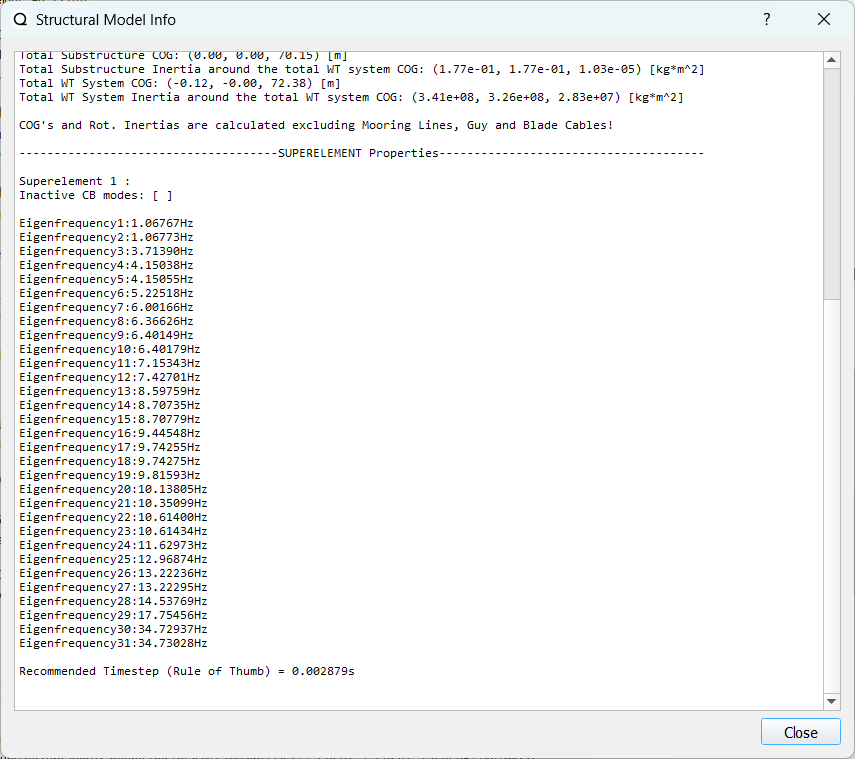
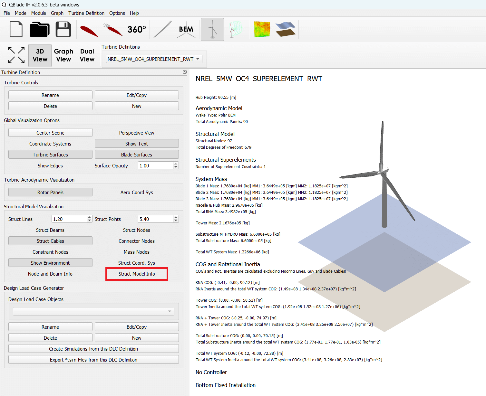

Superelements
-------------

Craig-Bampton (CB) superelements are a reduction technique used in structural analysis to efficiently model complex systems while retaining their essential dynamic behavior. The CB method involves dividing a large finite element model into smaller substructures, each known as a superelement. These superelements are interconnected through shared degrees of freedom (DOFs) along the interface, see also :footcite:`Branlard2020` .

In the context of offshore wind turbine simulation, superelements are a powerful technique used to model complex structures efficiently and accurately. Superelements provide a way to break down a large, intricate structure into smaller, manageable substructures. Each superelement represents a portion of the overall structure, and they are interconnected to form the complete system. 

Sequential Load Analysis
^^^^^^^^^^^^^^^^^^^^^^^^

In the offshore wind industry, it is common practice to perform sequentially coupled load analyses for fixed-bottom (offshore) wind turbines. This approach involves two main parties: the substructure designer and the wind turbine designer, see also :footcite:`Branlard2020` .

Substructure Designer:
 The substructure designer performs a dynamic reduction of the offshore wind turbine's substructure using a reduction method such as the linear Craig-Bampton (CB) method, which is a special case of the Guyan method. The reduction process yields reduced mass, damping, and stiffness matrices, along with reduced forces (hydrodynamic and gravitational) at the interface with the tower. This dynamic reduction results in a superelement representation of the substructure, which captures its essential behavior while reducing the computational complexity.

Wind Turbine Designer:
 The wind turbine designer analyzes aeroelastic loads on the tower and rotor nacelle assembly using an aero-servo-elastic code such as QBlade. This code is capable of simultaneously processing the CB information at the tower base and throughout the rest of the structure. The loads from the full wind turbine simulation are communicated back to the substructure designer for further analysis.

Sequential Approach:
 The process is called a sequential approach because the substructure and wind turbine designers perform time simulations separately and exchange interface loads and displacements iteratively. The substructure designer uses a finite element method (FEM) software to generate the superelement using the CB reduction method. The wind turbine designer performs a full wind turbine simulation using the superelement representation of the substructure. The interface time series (loads and displacements) from the full turbine simulation are passed back to the substructure designer for reanalysis, stress recovery, and code check. This iterative exchange of information allows both parties to consider the interactions between the substructure and wind turbine and perform more accurate simulations.

Benefits of the Sequential Approach:
 The use of superelements with the CB reduction technique allows for compartmentalization of intellectual properties while accounting for interactions between the substructure and wind turbine. It improves computational efficiency by reducing the large number of degrees of freedom associated with standard finite element analysis of multimember structures. By retaining the fundamental low-frequency response modes, the method maintains the overall system's fidelity, but its linearity and application require expertise. 

Superelement Definitions
^^^^^^^^^^^^^^^^^^^^^^^^

QBlade allows to define an arbitrary number of superelements within its :ref:`Substructure Definition` File which, in the same way as :ref:`Nonlinear Spring and Damper Constraints`, can be assigned to connect two joints or to connect a joint to the ground. A typical application of a superelement would be for it to replace the explicit structural beam model of a jacket substructure. 

In QBlade, a superelement is defined by a stiffness matrix K, a mass matrix M and *optionally* a damping matrix C. These matrices are defined by using the a set of keywords. If multiple superelements should be defined within a single substructure definition each keyword needs to be appended with the global superelement definition ID (:code:`SUPELEM_MASS_2`, :code:`SUPELEM_STIFF_2` and :code:`SUPELEM_DAMP_2`). If only a single superelement is used the global definition ID **_<X>** can optionally be omitted. It is important to note that the global definition ID **_<X>** needs to be appended to every keyword that describes a superelement definition. So to use two different superelement definitions, a :code:`SUPELEM_MASS_1` and :code:`SUPELEM_MASS_2` matrix is required, etc. Also, please note that a single superelement definition can be used in multiple constraints via the :code:`SUBCONSTRAINTS` table. A superelement constraint is then identified by its constraint ID.

The minimum matrix size for a superelement is 6x6, these 6 DoF represent the DoF of the *interface* node of the superelement. These 6 modes are also called the *Guyan* modes. The additional DoF (above 6) are the *Craig-Bampton* modes. 

Mass, Stiffness and Damping Matrices
^^^^^^^^^^^^^^^^^^^^^^^^^^^^^^^^^^^^

The following exemplary matrices for the OC4 Jacket superelement are taken from the `OpenFAST Github repository <https://github.com/OpenFAST/r-test/blob/main/glue-codes/openfast/5MW_OC4Jckt_ExtPtfm/ExtPtfm_SE.dat>`_. 

:code:`SUPELEM_MASS_<X>`
 is the keyword for the mass matrix. The matrix needs to be square and needs to have a minimum size of 6x6. <X> specifies the global ID of this superelement definition. _<X> can be omitted for the first superelement.
 
  .. code-block:: console
   	:caption: : An exemplary mass matrix for a superelement (size 31x31)
	
	SUPELEM_MASS
	9.62349663e+05  5.07244708e-11 -4.23103689e-11  5.67542783e-10 -5.28236955e+06  2.84384853e-10  3.60609453e+02 -4.21795932e-12  5.68434189e-14 -3.49587026e-12 -1.11910481e-13 -6.94910796e-12  1.71286635e+02 -2.67720068e-10 -5.19584376e-13  2.93098879e-13  6.61626264e+01 -1.92928340e-10 -1.12265752e-12 -1.76164254e+02  3.88521215e-10 -9.52127266e-13  7.49622586e-13  1.58440372e-10 -9.54272988e+01  2.84217094e-13  8.52651283e-14  5.09814413e-13 -4.95956670e+01 -1.36008182e-09 -3.62643943e-13
	5.02697235e-11  9.62255787e+05 -3.00720954e-10  5.28204269e+06  2.42627584e-11  1.74721822e-09  6.66533495e-12  3.60594532e+02 -4.54924987e-12 -2.33058017e-12  2.45847787e-12  1.11199938e-12  2.66871858e-10  1.71280791e+02 -1.98419059e-12 -6.85673740e-13  1.92540650e-10  6.61575677e+01  3.02868841e-12  3.88151733e-10  1.76097008e+02  1.63424829e-12 -4.26325641e-14  9.55355779e+01  1.57776014e-10  2.84217094e-13  2.20268248e-13  4.19220214e-13  1.36034473e-09 -4.95618190e+01  2.58222263e-13
	-4.32198636e-11 -3.00720954e-10  9.38302373e+05 -5.43480339e-09  1.36757045e-10 -2.40072354e-10  1.77635684e-15 -5.57776048e-13 -5.89750471e-13 -3.53139740e-12  2.89310003e-02  8.29517478e+01  3.21342952e-12 -8.17124146e-13  2.84061752e-02 -1.33171368e+02  4.31654712e-13 -2.48689958e-13 -8.09101576e+01  4.26325641e-13  8.66862138e-13 -5.45693239e-02 -8.70414851e-13  2.48689958e-14 -3.80140364e-13  2.16574646e-02  2.20268248e-13  1.16342863e+02  5.16919840e-13 -7.67386155e-13 -1.61684683e+02
	5.96646613e-10  5.28204269e+06 -5.52211488e-09  6.71710431e+07  5.19372141e-09  6.36789574e-09  3.24149596e-11  6.82513608e+03 -1.16585852e-10 -5.76392267e-11 -4.14956958e-12  3.13775672e-11  4.05203338e-09  2.57258734e+03 -4.54747351e-12  1.40971679e-11  3.27209904e-09  1.11887783e+03  2.27942110e-11  4.00615363e-09  1.80141709e+03 -8.52651283e-13  2.27373675e-12  1.02076670e+03  1.69688974e-09 -1.45519152e-11 -8.41282599e-12 -1.75077730e-11  2.16663807e-08 -7.90339629e+02  4.68378114e-11
	-5.28236955e+06 -4.84107210e-12  1.65860876e-10  5.25192907e-09  6.71760707e+07 -1.88736567e-09 -6.82540351e+03  9.20437060e-11  1.27329258e-11  6.15045792e-11  1.93836058e-11  9.96465133e-11 -2.57268757e+03  4.00778433e-09 -4.02167188e-12 -1.37276857e-11 -1.11895113e+03  3.25478311e-09  1.88720151e-11  1.80213474e+03 -3.98034672e-09  1.79625204e-11 -1.05160325e-11 -1.68893166e-09  1.01964602e+03  4.66116035e-12  4.23483471e-12  2.21689334e-12  7.90657287e+02  2.16987246e-08 -1.67410530e-11
	1.38865700e-10  1.73266631e-09 -2.40072354e-10  6.83355703e-09 -2.81868825e-09  1.02967449e+07 -2.61479727e-12 -2.33200126e-11  5.63008746e-01 -2.55342290e+03 -1.35041311e-10 -1.06531672e-10 -4.72510919e-11  1.47011292e-11 -3.20996563e-11  2.84217094e-14 -3.25428573e-12 -1.70530257e-13 -2.06057393e-13  7.10542736e-14 -1.98951966e-13  3.49587026e-12 -1.98408716e-01  2.10320650e-12  1.56319402e-12  2.13731255e-11 -1.14981199e+03  1.53477231e-12 -3.16902060e-12  1.29318778e-12  3.02257525e-12
	3.60609453e+02  6.66533495e-12  1.77635684e-15  3.24149596e-11 -6.82540351e+03 -2.61479727e-12  1.00000000e+00  0.00000000e+00  0.00000000e+00  0.00000000e+00  0.00000000e+00  0.00000000e+00  0.00000000e+00  0.00000000e+00  0.00000000e+00  0.00000000e+00  0.00000000e+00  0.00000000e+00  0.00000000e+00  0.00000000e+00  0.00000000e+00  0.00000000e+00  0.00000000e+00  0.00000000e+00  0.00000000e+00  0.00000000e+00  0.00000000e+00  0.00000000e+00  0.00000000e+00  0.00000000e+00  0.00000000e+00
	-4.21795932e-12  3.60594532e+02 -5.57776048e-13  6.82513608e+03  9.20437060e-11 -2.33200126e-11  0.00000000e+00  1.00000000e+00  0.00000000e+00  0.00000000e+00  0.00000000e+00  0.00000000e+00  0.00000000e+00  0.00000000e+00  0.00000000e+00  0.00000000e+00  0.00000000e+00  0.00000000e+00  0.00000000e+00  0.00000000e+00  0.00000000e+00  0.00000000e+00  0.00000000e+00  0.00000000e+00  0.00000000e+00  0.00000000e+00  0.00000000e+00  0.00000000e+00  0.00000000e+00  0.00000000e+00  0.00000000e+00
	5.68434189e-14 -4.54924987e-12 -5.89750471e-13 -1.16585852e-10  1.27329258e-11  5.63008746e-01  0.00000000e+00  0.00000000e+00  1.00000000e+00  0.00000000e+00  0.00000000e+00  0.00000000e+00  0.00000000e+00  0.00000000e+00  0.00000000e+00  0.00000000e+00  0.00000000e+00  0.00000000e+00  0.00000000e+00  0.00000000e+00  0.00000000e+00  0.00000000e+00  0.00000000e+00  0.00000000e+00  0.00000000e+00  0.00000000e+00  0.00000000e+00  0.00000000e+00  0.00000000e+00  0.00000000e+00  0.00000000e+00
	-3.49587026e-12 -2.33058017e-12 -3.53139740e-12 -5.76392267e-11  6.15045792e-11 -2.55342290e+03  0.00000000e+00  0.00000000e+00  0.00000000e+00  1.00000000e+00  0.00000000e+00  0.00000000e+00  0.00000000e+00  0.00000000e+00  0.00000000e+00  0.00000000e+00  0.00000000e+00  0.00000000e+00  0.00000000e+00  0.00000000e+00  0.00000000e+00  0.00000000e+00  0.00000000e+00  0.00000000e+00  0.00000000e+00  0.00000000e+00  0.00000000e+00  0.00000000e+00  0.00000000e+00  0.00000000e+00  0.00000000e+00
	-1.11910481e-13  2.45847787e-12  2.89310003e-02 -4.14956958e-12  1.93836058e-11 -1.35041311e-10  0.00000000e+00  0.00000000e+00  0.00000000e+00  0.00000000e+00  1.00000000e+00  0.00000000e+00  0.00000000e+00  0.00000000e+00  0.00000000e+00  0.00000000e+00  0.00000000e+00  0.00000000e+00  0.00000000e+00  0.00000000e+00  0.00000000e+00  0.00000000e+00  0.00000000e+00  0.00000000e+00  0.00000000e+00  0.00000000e+00  0.00000000e+00  0.00000000e+00  0.00000000e+00  0.00000000e+00  0.00000000e+00
	-6.94910796e-12  1.11199938e-12  8.29517478e+01  3.13775672e-11  9.96465133e-11 -1.06531672e-10  0.00000000e+00  0.00000000e+00  0.00000000e+00  0.00000000e+00  0.00000000e+00  1.00000000e+00  0.00000000e+00  0.00000000e+00  0.00000000e+00  0.00000000e+00  0.00000000e+00  0.00000000e+00  0.00000000e+00  0.00000000e+00  0.00000000e+00  0.00000000e+00  0.00000000e+00  0.00000000e+00  0.00000000e+00  0.00000000e+00  0.00000000e+00  0.00000000e+00  0.00000000e+00  0.00000000e+00  0.00000000e+00
	1.71286635e+02  2.66871858e-10  3.21342952e-12  4.05203338e-09 -2.57268757e+03 -4.72510919e-11  0.00000000e+00  0.00000000e+00  0.00000000e+00  0.00000000e+00  0.00000000e+00  0.00000000e+00  1.00000000e+00  0.00000000e+00  0.00000000e+00  0.00000000e+00  0.00000000e+00  0.00000000e+00  0.00000000e+00  0.00000000e+00  0.00000000e+00  0.00000000e+00  0.00000000e+00  0.00000000e+00  0.00000000e+00  0.00000000e+00  0.00000000e+00  0.00000000e+00  0.00000000e+00  0.00000000e+00  0.00000000e+00
	-2.67720068e-10  1.71280791e+02 -8.17124146e-13  2.57258734e+03  4.00778433e-09  1.47011292e-11  0.00000000e+00  0.00000000e+00  0.00000000e+00  0.00000000e+00  0.00000000e+00  0.00000000e+00  0.00000000e+00  1.00000000e+00  0.00000000e+00  0.00000000e+00  0.00000000e+00  0.00000000e+00  0.00000000e+00  0.00000000e+00  0.00000000e+00  0.00000000e+00  0.00000000e+00  0.00000000e+00  0.00000000e+00  0.00000000e+00  0.00000000e+00  0.00000000e+00  0.00000000e+00  0.00000000e+00  0.00000000e+00
	-5.19584376e-13 -1.98419059e-12  2.84061752e-02 -4.54747351e-12 -4.02167188e-12 -3.20996563e-11  0.00000000e+00  0.00000000e+00  0.00000000e+00  0.00000000e+00  0.00000000e+00  0.00000000e+00  0.00000000e+00  0.00000000e+00  1.00000000e+00  0.00000000e+00  0.00000000e+00  0.00000000e+00  0.00000000e+00  0.00000000e+00  0.00000000e+00  0.00000000e+00  0.00000000e+00  0.00000000e+00  0.00000000e+00  0.00000000e+00  0.00000000e+00  0.00000000e+00  0.00000000e+00  0.00000000e+00  0.00000000e+00
	2.93098879e-13 -6.85673740e-13 -1.33171368e+02  1.40971679e-11 -1.37276857e-11  2.84217094e-14  0.00000000e+00  0.00000000e+00  0.00000000e+00  0.00000000e+00  0.00000000e+00  0.00000000e+00  0.00000000e+00  0.00000000e+00  0.00000000e+00  1.00000000e+00  0.00000000e+00  0.00000000e+00  0.00000000e+00  0.00000000e+00  0.00000000e+00  0.00000000e+00  0.00000000e+00  0.00000000e+00  0.00000000e+00  0.00000000e+00  0.00000000e+00  0.00000000e+00  0.00000000e+00  0.00000000e+00  0.00000000e+00
	6.61626264e+01  1.92540650e-10  4.31654712e-13  3.27209904e-09 -1.11895113e+03 -3.25428573e-12  0.00000000e+00  0.00000000e+00  0.00000000e+00  0.00000000e+00  0.00000000e+00  0.00000000e+00  0.00000000e+00  0.00000000e+00  0.00000000e+00  0.00000000e+00  1.00000000e+00  0.00000000e+00  0.00000000e+00  0.00000000e+00  0.00000000e+00  0.00000000e+00  0.00000000e+00  0.00000000e+00  0.00000000e+00  0.00000000e+00  0.00000000e+00  0.00000000e+00  0.00000000e+00  0.00000000e+00  0.00000000e+00
	-1.92928340e-10  6.61575677e+01 -2.48689958e-13  1.11887783e+03  3.25478311e-09 -1.70530257e-13  0.00000000e+00  0.00000000e+00  0.00000000e+00  0.00000000e+00  0.00000000e+00  0.00000000e+00  0.00000000e+00  0.00000000e+00  0.00000000e+00  0.00000000e+00  0.00000000e+00  1.00000000e+00  0.00000000e+00  0.00000000e+00  0.00000000e+00  0.00000000e+00  0.00000000e+00  0.00000000e+00  0.00000000e+00  0.00000000e+00  0.00000000e+00  0.00000000e+00  0.00000000e+00  0.00000000e+00  0.00000000e+00
	-1.12265752e-12  3.02868841e-12 -8.09101576e+01  2.27942110e-11  1.88720151e-11 -2.06057393e-13  0.00000000e+00  0.00000000e+00  0.00000000e+00  0.00000000e+00  0.00000000e+00  0.00000000e+00  0.00000000e+00  0.00000000e+00  0.00000000e+00  0.00000000e+00  0.00000000e+00  0.00000000e+00  1.00000000e+00  0.00000000e+00  0.00000000e+00  0.00000000e+00  0.00000000e+00  0.00000000e+00  0.00000000e+00  0.00000000e+00  0.00000000e+00  0.00000000e+00  0.00000000e+00  0.00000000e+00  0.00000000e+00
	-1.76164254e+02  3.88151733e-10  4.26325641e-13  4.00615363e-09  1.80213474e+03  7.10542736e-14  0.00000000e+00  0.00000000e+00  0.00000000e+00  0.00000000e+00  0.00000000e+00  0.00000000e+00  0.00000000e+00  0.00000000e+00  0.00000000e+00  0.00000000e+00  0.00000000e+00  0.00000000e+00  0.00000000e+00  1.00000000e+00  0.00000000e+00  0.00000000e+00  0.00000000e+00  0.00000000e+00  0.00000000e+00  0.00000000e+00  0.00000000e+00  0.00000000e+00  0.00000000e+00  0.00000000e+00  0.00000000e+00
	3.88521215e-10  1.76097008e+02  8.66862138e-13  1.80141709e+03 -3.98034672e-09 -1.98951966e-13  0.00000000e+00  0.00000000e+00  0.00000000e+00  0.00000000e+00  0.00000000e+00  0.00000000e+00  0.00000000e+00  0.00000000e+00  0.00000000e+00  0.00000000e+00  0.00000000e+00  0.00000000e+00  0.00000000e+00  0.00000000e+00  1.00000000e+00  0.00000000e+00  0.00000000e+00  0.00000000e+00  0.00000000e+00  0.00000000e+00  0.00000000e+00  0.00000000e+00  0.00000000e+00  0.00000000e+00  0.00000000e+00
	-9.52127266e-13  1.63424829e-12 -5.45693239e-02 -8.52651283e-13  1.79625204e-11  3.49587026e-12  0.00000000e+00  0.00000000e+00  0.00000000e+00  0.00000000e+00  0.00000000e+00  0.00000000e+00  0.00000000e+00  0.00000000e+00  0.00000000e+00  0.00000000e+00  0.00000000e+00  0.00000000e+00  0.00000000e+00  0.00000000e+00  0.00000000e+00  1.00000000e+00  0.00000000e+00  0.00000000e+00  0.00000000e+00  0.00000000e+00  0.00000000e+00  0.00000000e+00  0.00000000e+00  0.00000000e+00  0.00000000e+00
	7.49622586e-13 -4.26325641e-14 -8.70414851e-13  2.27373675e-12 -1.05160325e-11 -1.98408716e-01  0.00000000e+00  0.00000000e+00  0.00000000e+00  0.00000000e+00  0.00000000e+00  0.00000000e+00  0.00000000e+00  0.00000000e+00  0.00000000e+00  0.00000000e+00  0.00000000e+00  0.00000000e+00  0.00000000e+00  0.00000000e+00  0.00000000e+00  0.00000000e+00  1.00000000e+00  0.00000000e+00  0.00000000e+00  0.00000000e+00  0.00000000e+00  0.00000000e+00  0.00000000e+00  0.00000000e+00  0.00000000e+00
	1.58440372e-10  9.55355779e+01  2.48689958e-14  1.02076670e+03 -1.68893166e-09  2.10320650e-12  0.00000000e+00  0.00000000e+00  0.00000000e+00  0.00000000e+00  0.00000000e+00  0.00000000e+00  0.00000000e+00  0.00000000e+00  0.00000000e+00  0.00000000e+00  0.00000000e+00  0.00000000e+00  0.00000000e+00  0.00000000e+00  0.00000000e+00  0.00000000e+00  0.00000000e+00  1.00000000e+00  0.00000000e+00  0.00000000e+00  0.00000000e+00  0.00000000e+00  0.00000000e+00  0.00000000e+00  0.00000000e+00
	-9.54272988e+01  1.57776014e-10 -3.80140364e-13  1.69688974e-09  1.01964602e+03  1.56319402e-12  0.00000000e+00  0.00000000e+00  0.00000000e+00  0.00000000e+00  0.00000000e+00  0.00000000e+00  0.00000000e+00  0.00000000e+00  0.00000000e+00  0.00000000e+00  0.00000000e+00  0.00000000e+00  0.00000000e+00  0.00000000e+00  0.00000000e+00  0.00000000e+00  0.00000000e+00  0.00000000e+00  1.00000000e+00  0.00000000e+00  0.00000000e+00  0.00000000e+00  0.00000000e+00  0.00000000e+00  0.00000000e+00
	2.84217094e-13  2.84217094e-13  2.16574646e-02 -1.45519152e-11  4.66116035e-12  2.13731255e-11  0.00000000e+00  0.00000000e+00  0.00000000e+00  0.00000000e+00  0.00000000e+00  0.00000000e+00  0.00000000e+00  0.00000000e+00  0.00000000e+00  0.00000000e+00  0.00000000e+00  0.00000000e+00  0.00000000e+00  0.00000000e+00  0.00000000e+00  0.00000000e+00  0.00000000e+00  0.00000000e+00  0.00000000e+00  1.00000000e+00  0.00000000e+00  0.00000000e+00  0.00000000e+00  0.00000000e+00  0.00000000e+00
	8.52651283e-14  2.20268248e-13  2.20268248e-13 -8.41282599e-12  4.23483471e-12 -1.14981199e+03  0.00000000e+00  0.00000000e+00  0.00000000e+00  0.00000000e+00  0.00000000e+00  0.00000000e+00  0.00000000e+00  0.00000000e+00  0.00000000e+00  0.00000000e+00  0.00000000e+00  0.00000000e+00  0.00000000e+00  0.00000000e+00  0.00000000e+00  0.00000000e+00  0.00000000e+00  0.00000000e+00  0.00000000e+00  0.00000000e+00  1.00000000e+00  0.00000000e+00  0.00000000e+00  0.00000000e+00  0.00000000e+00
	5.09814413e-13  4.19220214e-13  1.16342863e+02 -1.75077730e-11  2.21689334e-12  1.53477231e-12  0.00000000e+00  0.00000000e+00  0.00000000e+00  0.00000000e+00  0.00000000e+00  0.00000000e+00  0.00000000e+00  0.00000000e+00  0.00000000e+00  0.00000000e+00  0.00000000e+00  0.00000000e+00  0.00000000e+00  0.00000000e+00  0.00000000e+00  0.00000000e+00  0.00000000e+00  0.00000000e+00  0.00000000e+00  0.00000000e+00  0.00000000e+00  1.00000000e+00  0.00000000e+00  0.00000000e+00  0.00000000e+00
	-4.95956670e+01  1.36034473e-09  5.16919840e-13  2.16663807e-08  7.90657287e+02 -3.16902060e-12  0.00000000e+00  0.00000000e+00  0.00000000e+00  0.00000000e+00  0.00000000e+00  0.00000000e+00  0.00000000e+00  0.00000000e+00  0.00000000e+00  0.00000000e+00  0.00000000e+00  0.00000000e+00  0.00000000e+00  0.00000000e+00  0.00000000e+00  0.00000000e+00  0.00000000e+00  0.00000000e+00  0.00000000e+00  0.00000000e+00  0.00000000e+00  0.00000000e+00  1.00000000e+00  0.00000000e+00  0.00000000e+00
	-1.36008182e-09 -4.95618190e+01 -7.67386155e-13 -7.90339629e+02  2.16987246e-08  1.29318778e-12  0.00000000e+00  0.00000000e+00  0.00000000e+00  0.00000000e+00  0.00000000e+00  0.00000000e+00  0.00000000e+00  0.00000000e+00  0.00000000e+00  0.00000000e+00  0.00000000e+00  0.00000000e+00  0.00000000e+00  0.00000000e+00  0.00000000e+00  0.00000000e+00  0.00000000e+00  0.00000000e+00  0.00000000e+00  0.00000000e+00  0.00000000e+00  0.00000000e+00  0.00000000e+00  1.00000000e+00  0.00000000e+00
	-3.62643943e-13  2.58222263e-13 -1.61684683e+02  4.68378114e-11 -1.67410530e-11  3.02257525e-12  0.00000000e+00  0.00000000e+00  0.00000000e+00  0.00000000e+00  0.00000000e+00  0.00000000e+00  0.00000000e+00  0.00000000e+00  0.00000000e+00  0.00000000e+00  0.00000000e+00  0.00000000e+00  0.00000000e+00  0.00000000e+00  0.00000000e+00  0.00000000e+00  0.00000000e+00  0.00000000e+00  0.00000000e+00  0.00000000e+00  0.00000000e+00  0.00000000e+00  0.00000000e+00  0.00000000e+00  1.00000000e+00

:code:`SUPELEM_STIFF_<X>`
 is the keyword for the stiffness matrix. The matrix needs to be square and needs to have a minimum size of 6x6. <X> specifies the global ID of this superelement definition. _<X> can be omitted for the first superelement.
 
   .. code-block:: console
   	:caption: : An exemplary stiffness matrix for a superelement (size 31x31)
	
	SUPELEM_STIFF
	8.43408083e+07  1.70093408e+00 -2.98665579e-01 -1.27235487e-01 -2.32742574e+09 -8.89638805e+00  0.00000000e+00  0.00000000e+00  0.00000000e+00  0.00000000e+00  0.00000000e+00  0.00000000e+00  0.00000000e+00  0.00000000e+00  0.00000000e+00  0.00000000e+00  0.00000000e+00  0.00000000e+00  0.00000000e+00  0.00000000e+00  0.00000000e+00  0.00000000e+00  0.00000000e+00  0.00000000e+00  0.00000000e+00  0.00000000e+00  0.00000000e+00  0.00000000e+00  0.00000000e+00  0.00000000e+00  0.00000000e+00
	1.70093407e+00  8.43407974e+07 -3.47132372e-01  2.32742570e+09  2.35131553e+00  2.22409205e+01  0.00000000e+00  0.00000000e+00  0.00000000e+00  0.00000000e+00  0.00000000e+00  0.00000000e+00  0.00000000e+00  0.00000000e+00  0.00000000e+00  0.00000000e+00  0.00000000e+00  0.00000000e+00  0.00000000e+00  0.00000000e+00  0.00000000e+00  0.00000000e+00  0.00000000e+00  0.00000000e+00  0.00000000e+00  0.00000000e+00  0.00000000e+00  0.00000000e+00  0.00000000e+00  0.00000000e+00  0.00000000e+00
	2.98666294e-01 -3.47133325e-01  1.96653266e+09 -8.89595318e+00  3.05175781e-04  3.82992553e+00  0.00000000e+00  0.00000000e+00  0.00000000e+00  0.00000000e+00  0.00000000e+00  0.00000000e+00  0.00000000e+00  0.00000000e+00  0.00000000e+00  0.00000000e+00  0.00000000e+00  0.00000000e+00  0.00000000e+00  0.00000000e+00  0.00000000e+00  0.00000000e+00  0.00000000e+00  0.00000000e+00  0.00000000e+00  0.00000000e+00  0.00000000e+00  0.00000000e+00  0.00000000e+00  0.00000000e+00  0.00000000e+00
	1.27237395e-01  2.32742570e+09 -8.89601421e+00  1.09880894e+11  5.78474426e+01 -6.38474651e+00  0.00000000e+00  0.00000000e+00  0.00000000e+00  0.00000000e+00  0.00000000e+00  0.00000000e+00  0.00000000e+00  0.00000000e+00  0.00000000e+00  0.00000000e+00  0.00000000e+00  0.00000000e+00  0.00000000e+00  0.00000000e+00  0.00000000e+00  0.00000000e+00  0.00000000e+00  0.00000000e+00  0.00000000e+00  0.00000000e+00  0.00000000e+00  0.00000000e+00  0.00000000e+00  0.00000000e+00  0.00000000e+00
	2.32742574e+09  2.35131077e+00  2.44140625e-04  5.78474426e+01  1.09880894e+11  1.53579546e+01  0.00000000e+00  0.00000000e+00  0.00000000e+00  0.00000000e+00  0.00000000e+00  0.00000000e+00  0.00000000e+00  0.00000000e+00  0.00000000e+00  0.00000000e+00  0.00000000e+00  0.00000000e+00  0.00000000e+00  0.00000000e+00  0.00000000e+00  0.00000000e+00  0.00000000e+00  0.00000000e+00  0.00000000e+00  0.00000000e+00  0.00000000e+00  0.00000000e+00  0.00000000e+00  0.00000000e+00  0.00000000e+00
	8.89639568e+00  2.22409358e+01  3.82992249e+00 -6.38456340e+00  1.53578326e+01  8.20023159e+09  0.00000000e+00  0.00000000e+00  0.00000000e+00  0.00000000e+00  0.00000000e+00  0.00000000e+00  0.00000000e+00  0.00000000e+00  0.00000000e+00  0.00000000e+00  0.00000000e+00  0.00000000e+00  0.00000000e+00  0.00000000e+00  0.00000000e+00  0.00000000e+00  0.00000000e+00  0.00000000e+00  0.00000000e+00  0.00000000e+00  0.00000000e+00  0.00000000e+00  0.00000000e+00  0.00000000e+00  0.00000000e+00
	0.00000000e+00  0.00000000e+00  0.00000000e+00  0.00000000e+00  0.00000000e+00  0.00000000e+00  8.27071909e+02  0.00000000e+00  0.00000000e+00  0.00000000e+00  0.00000000e+00  0.00000000e+00  0.00000000e+00  0.00000000e+00  0.00000000e+00  0.00000000e+00  0.00000000e+00  0.00000000e+00  0.00000000e+00  0.00000000e+00  0.00000000e+00  0.00000000e+00  0.00000000e+00  0.00000000e+00  0.00000000e+00  0.00000000e+00  0.00000000e+00  0.00000000e+00  0.00000000e+00  0.00000000e+00  0.00000000e+00
	0.00000000e+00  0.00000000e+00  0.00000000e+00  0.00000000e+00  0.00000000e+00  0.00000000e+00  0.00000000e+00  8.27135704e+02  0.00000000e+00  0.00000000e+00  0.00000000e+00  0.00000000e+00  0.00000000e+00  0.00000000e+00  0.00000000e+00  0.00000000e+00  0.00000000e+00  0.00000000e+00  0.00000000e+00  0.00000000e+00  0.00000000e+00  0.00000000e+00  0.00000000e+00  0.00000000e+00  0.00000000e+00  0.00000000e+00  0.00000000e+00  0.00000000e+00  0.00000000e+00  0.00000000e+00  0.00000000e+00
	0.00000000e+00  0.00000000e+00  0.00000000e+00  0.00000000e+00  0.00000000e+00  0.00000000e+00  0.00000000e+00  0.00000000e+00  1.07785834e+03  0.00000000e+00  0.00000000e+00  0.00000000e+00  0.00000000e+00  0.00000000e+00  0.00000000e+00  0.00000000e+00  0.00000000e+00  0.00000000e+00  0.00000000e+00  0.00000000e+00  0.00000000e+00  0.00000000e+00  0.00000000e+00  0.00000000e+00  0.00000000e+00  0.00000000e+00  0.00000000e+00  0.00000000e+00  0.00000000e+00  0.00000000e+00  0.00000000e+00
	0.00000000e+00  0.00000000e+00  0.00000000e+00  0.00000000e+00  0.00000000e+00  0.00000000e+00  0.00000000e+00  0.00000000e+00  0.00000000e+00  1.31373750e+03  0.00000000e+00  0.00000000e+00  0.00000000e+00  0.00000000e+00  0.00000000e+00  0.00000000e+00  0.00000000e+00  0.00000000e+00  0.00000000e+00  0.00000000e+00  0.00000000e+00  0.00000000e+00  0.00000000e+00  0.00000000e+00  0.00000000e+00  0.00000000e+00  0.00000000e+00  0.00000000e+00  0.00000000e+00  0.00000000e+00  0.00000000e+00
	0.00000000e+00  0.00000000e+00  0.00000000e+00  0.00000000e+00  0.00000000e+00  0.00000000e+00  0.00000000e+00  0.00000000e+00  0.00000000e+00  0.00000000e+00  1.42200736e+03  0.00000000e+00  0.00000000e+00  0.00000000e+00  0.00000000e+00  0.00000000e+00  0.00000000e+00  0.00000000e+00  0.00000000e+00  0.00000000e+00  0.00000000e+00  0.00000000e+00  0.00000000e+00  0.00000000e+00  0.00000000e+00  0.00000000e+00  0.00000000e+00  0.00000000e+00  0.00000000e+00  0.00000000e+00  0.00000000e+00
	0.00000000e+00  0.00000000e+00  0.00000000e+00  0.00000000e+00  0.00000000e+00  0.00000000e+00  0.00000000e+00  0.00000000e+00  0.00000000e+00  0.00000000e+00  0.00000000e+00  1.64405336e+03  0.00000000e+00  0.00000000e+00  0.00000000e+00  0.00000000e+00  0.00000000e+00  0.00000000e+00  0.00000000e+00  0.00000000e+00  0.00000000e+00  0.00000000e+00  0.00000000e+00  0.00000000e+00  0.00000000e+00  0.00000000e+00  0.00000000e+00  0.00000000e+00  0.00000000e+00  0.00000000e+00  0.00000000e+00
	0.00000000e+00  0.00000000e+00  0.00000000e+00  0.00000000e+00  0.00000000e+00  0.00000000e+00  0.00000000e+00  0.00000000e+00  0.00000000e+00  0.00000000e+00  0.00000000e+00  0.00000000e+00  1.68270024e+03  0.00000000e+00  0.00000000e+00  0.00000000e+00  0.00000000e+00  0.00000000e+00  0.00000000e+00  0.00000000e+00  0.00000000e+00  0.00000000e+00  0.00000000e+00  0.00000000e+00  0.00000000e+00  0.00000000e+00  0.00000000e+00  0.00000000e+00  0.00000000e+00  0.00000000e+00  0.00000000e+00
	0.00000000e+00  0.00000000e+00  0.00000000e+00  0.00000000e+00  0.00000000e+00  0.00000000e+00  0.00000000e+00  0.00000000e+00  0.00000000e+00  0.00000000e+00  0.00000000e+00  0.00000000e+00  0.00000000e+00  1.68285762e+03  0.00000000e+00  0.00000000e+00  0.00000000e+00  0.00000000e+00  0.00000000e+00  0.00000000e+00  0.00000000e+00  0.00000000e+00  0.00000000e+00  0.00000000e+00  0.00000000e+00  0.00000000e+00  0.00000000e+00  0.00000000e+00  0.00000000e+00  0.00000000e+00  0.00000000e+00
	0.00000000e+00  0.00000000e+00  0.00000000e+00  0.00000000e+00  0.00000000e+00  0.00000000e+00  0.00000000e+00  0.00000000e+00  0.00000000e+00  0.00000000e+00  0.00000000e+00  0.00000000e+00  0.00000000e+00  0.00000000e+00  2.17765046e+03  0.00000000e+00  0.00000000e+00  0.00000000e+00  0.00000000e+00  0.00000000e+00  0.00000000e+00  0.00000000e+00  0.00000000e+00  0.00000000e+00  0.00000000e+00  0.00000000e+00  0.00000000e+00  0.00000000e+00  0.00000000e+00  0.00000000e+00  0.00000000e+00
	0.00000000e+00  0.00000000e+00  0.00000000e+00  0.00000000e+00  0.00000000e+00  0.00000000e+00  0.00000000e+00  0.00000000e+00  0.00000000e+00  0.00000000e+00  0.00000000e+00  0.00000000e+00  0.00000000e+00  0.00000000e+00  0.00000000e+00  2.74450663e+03  0.00000000e+00  0.00000000e+00  0.00000000e+00  0.00000000e+00  0.00000000e+00  0.00000000e+00  0.00000000e+00  0.00000000e+00  0.00000000e+00  0.00000000e+00  0.00000000e+00  0.00000000e+00  0.00000000e+00  0.00000000e+00  0.00000000e+00
	0.00000000e+00  0.00000000e+00  0.00000000e+00  0.00000000e+00  0.00000000e+00  0.00000000e+00  0.00000000e+00  0.00000000e+00  0.00000000e+00  0.00000000e+00  0.00000000e+00  0.00000000e+00  0.00000000e+00  0.00000000e+00  0.00000000e+00  0.00000000e+00  3.05700783e+03  0.00000000e+00  0.00000000e+00  0.00000000e+00  0.00000000e+00  0.00000000e+00  0.00000000e+00  0.00000000e+00  0.00000000e+00  0.00000000e+00  0.00000000e+00  0.00000000e+00  0.00000000e+00  0.00000000e+00  0.00000000e+00
	0.00000000e+00  0.00000000e+00  0.00000000e+00  0.00000000e+00  0.00000000e+00  0.00000000e+00  0.00000000e+00  0.00000000e+00  0.00000000e+00  0.00000000e+00  0.00000000e+00  0.00000000e+00  0.00000000e+00  0.00000000e+00  0.00000000e+00  0.00000000e+00  0.00000000e+00  3.05731505e+03  0.00000000e+00  0.00000000e+00  0.00000000e+00  0.00000000e+00  0.00000000e+00  0.00000000e+00  0.00000000e+00  0.00000000e+00  0.00000000e+00  0.00000000e+00  0.00000000e+00  0.00000000e+00  0.00000000e+00
	0.00000000e+00  0.00000000e+00  0.00000000e+00  0.00000000e+00  0.00000000e+00  0.00000000e+00  0.00000000e+00  0.00000000e+00  0.00000000e+00  0.00000000e+00  0.00000000e+00  0.00000000e+00  0.00000000e+00  0.00000000e+00  0.00000000e+00  0.00000000e+00  0.00000000e+00  0.00000000e+00  3.73972065e+03  0.00000000e+00  0.00000000e+00  0.00000000e+00  0.00000000e+00  0.00000000e+00  0.00000000e+00  0.00000000e+00  0.00000000e+00  0.00000000e+00  0.00000000e+00  0.00000000e+00  0.00000000e+00
	0.00000000e+00  0.00000000e+00  0.00000000e+00  0.00000000e+00  0.00000000e+00  0.00000000e+00  0.00000000e+00  0.00000000e+00  0.00000000e+00  0.00000000e+00  0.00000000e+00  0.00000000e+00  0.00000000e+00  0.00000000e+00  0.00000000e+00  0.00000000e+00  0.00000000e+00  0.00000000e+00  0.00000000e+00  3.86089760e+03  0.00000000e+00  0.00000000e+00  0.00000000e+00  0.00000000e+00  0.00000000e+00  0.00000000e+00  0.00000000e+00  0.00000000e+00  0.00000000e+00  0.00000000e+00  0.00000000e+00
	0.00000000e+00  0.00000000e+00  0.00000000e+00  0.00000000e+00  0.00000000e+00  0.00000000e+00  0.00000000e+00  0.00000000e+00  0.00000000e+00  0.00000000e+00  0.00000000e+00  0.00000000e+00  0.00000000e+00  0.00000000e+00  0.00000000e+00  0.00000000e+00  0.00000000e+00  0.00000000e+00  0.00000000e+00  0.00000000e+00  3.86096001e+03  0.00000000e+00  0.00000000e+00  0.00000000e+00  0.00000000e+00  0.00000000e+00  0.00000000e+00  0.00000000e+00  0.00000000e+00  0.00000000e+00  0.00000000e+00
	0.00000000e+00  0.00000000e+00  0.00000000e+00  0.00000000e+00  0.00000000e+00  0.00000000e+00  0.00000000e+00  0.00000000e+00  0.00000000e+00  0.00000000e+00  0.00000000e+00  0.00000000e+00  0.00000000e+00  0.00000000e+00  0.00000000e+00  0.00000000e+00  0.00000000e+00  0.00000000e+00  0.00000000e+00  0.00000000e+00  0.00000000e+00  4.05759493e+03  0.00000000e+00  0.00000000e+00  0.00000000e+00  0.00000000e+00  0.00000000e+00  0.00000000e+00  0.00000000e+00  0.00000000e+00  0.00000000e+00
	0.00000000e+00  0.00000000e+00  0.00000000e+00  0.00000000e+00  0.00000000e+00  0.00000000e+00  0.00000000e+00  0.00000000e+00  0.00000000e+00  0.00000000e+00  0.00000000e+00  0.00000000e+00  0.00000000e+00  0.00000000e+00  0.00000000e+00  0.00000000e+00  0.00000000e+00  0.00000000e+00  0.00000000e+00  0.00000000e+00  0.00000000e+00  0.00000000e+00  4.22983825e+03  0.00000000e+00  0.00000000e+00  0.00000000e+00  0.00000000e+00  0.00000000e+00  0.00000000e+00  0.00000000e+00  0.00000000e+00
	0.00000000e+00  0.00000000e+00  0.00000000e+00  0.00000000e+00  0.00000000e+00  0.00000000e+00  0.00000000e+00  0.00000000e+00  0.00000000e+00  0.00000000e+00  0.00000000e+00  0.00000000e+00  0.00000000e+00  0.00000000e+00  0.00000000e+00  0.00000000e+00  0.00000000e+00  0.00000000e+00  0.00000000e+00  0.00000000e+00  0.00000000e+00  0.00000000e+00  0.00000000e+00  4.49929678e+03  0.00000000e+00  0.00000000e+00  0.00000000e+00  0.00000000e+00  0.00000000e+00  0.00000000e+00  0.00000000e+00
	0.00000000e+00  0.00000000e+00  0.00000000e+00  0.00000000e+00  0.00000000e+00  0.00000000e+00  0.00000000e+00  0.00000000e+00  0.00000000e+00  0.00000000e+00  0.00000000e+00  0.00000000e+00  0.00000000e+00  0.00000000e+00  0.00000000e+00  0.00000000e+00  0.00000000e+00  0.00000000e+00  0.00000000e+00  0.00000000e+00  0.00000000e+00  0.00000000e+00  0.00000000e+00  0.00000000e+00  4.49948480e+03  0.00000000e+00  0.00000000e+00  0.00000000e+00  0.00000000e+00  0.00000000e+00  0.00000000e+00
	0.00000000e+00  0.00000000e+00  0.00000000e+00  0.00000000e+00  0.00000000e+00  0.00000000e+00  0.00000000e+00  0.00000000e+00  0.00000000e+00  0.00000000e+00  0.00000000e+00  0.00000000e+00  0.00000000e+00  0.00000000e+00  0.00000000e+00  0.00000000e+00  0.00000000e+00  0.00000000e+00  0.00000000e+00  0.00000000e+00  0.00000000e+00  0.00000000e+00  0.00000000e+00  0.00000000e+00  0.00000000e+00  5.33947790e+03  0.00000000e+00  0.00000000e+00  0.00000000e+00  0.00000000e+00  0.00000000e+00
	0.00000000e+00  0.00000000e+00  0.00000000e+00  0.00000000e+00  0.00000000e+00  0.00000000e+00  0.00000000e+00  0.00000000e+00  0.00000000e+00  0.00000000e+00  0.00000000e+00  0.00000000e+00  0.00000000e+00  0.00000000e+00  0.00000000e+00  0.00000000e+00  0.00000000e+00  0.00000000e+00  0.00000000e+00  0.00000000e+00  0.00000000e+00  0.00000000e+00  0.00000000e+00  0.00000000e+00  0.00000000e+00  0.00000000e+00  5.43841131e+03  0.00000000e+00  0.00000000e+00  0.00000000e+00  0.00000000e+00
	0.00000000e+00  0.00000000e+00  0.00000000e+00  0.00000000e+00  0.00000000e+00  0.00000000e+00  0.00000000e+00  0.00000000e+00  0.00000000e+00  0.00000000e+00  0.00000000e+00  0.00000000e+00  0.00000000e+00  0.00000000e+00  0.00000000e+00  0.00000000e+00  0.00000000e+00  0.00000000e+00  0.00000000e+00  0.00000000e+00  0.00000000e+00  0.00000000e+00  0.00000000e+00  0.00000000e+00  0.00000000e+00  0.00000000e+00  0.00000000e+00  6.51457159e+03  0.00000000e+00  0.00000000e+00  0.00000000e+00
	0.00000000e+00  0.00000000e+00  0.00000000e+00  0.00000000e+00  0.00000000e+00  0.00000000e+00  0.00000000e+00  0.00000000e+00  0.00000000e+00  0.00000000e+00  0.00000000e+00  0.00000000e+00  0.00000000e+00  0.00000000e+00  0.00000000e+00  0.00000000e+00  0.00000000e+00  0.00000000e+00  0.00000000e+00  0.00000000e+00  0.00000000e+00  0.00000000e+00  0.00000000e+00  0.00000000e+00  0.00000000e+00  0.00000000e+00  0.00000000e+00  0.00000000e+00  7.04641399e+03  0.00000000e+00  0.00000000e+00
	0.00000000e+00  0.00000000e+00  0.00000000e+00  0.00000000e+00  0.00000000e+00  0.00000000e+00  0.00000000e+00  0.00000000e+00  0.00000000e+00  0.00000000e+00  0.00000000e+00  0.00000000e+00  0.00000000e+00  0.00000000e+00  0.00000000e+00  0.00000000e+00  0.00000000e+00  0.00000000e+00  0.00000000e+00  0.00000000e+00  0.00000000e+00  0.00000000e+00  0.00000000e+00  0.00000000e+00  0.00000000e+00  0.00000000e+00  0.00000000e+00  0.00000000e+00  0.00000000e+00  7.04695067e+03  0.00000000e+00
	0.00000000e+00  0.00000000e+00  0.00000000e+00  0.00000000e+00  0.00000000e+00  0.00000000e+00  0.00000000e+00  0.00000000e+00  0.00000000e+00  0.00000000e+00  0.00000000e+00  0.00000000e+00  0.00000000e+00  0.00000000e+00  0.00000000e+00  0.00000000e+00  0.00000000e+00  0.00000000e+00  0.00000000e+00  0.00000000e+00  0.00000000e+00  0.00000000e+00  0.00000000e+00  0.00000000e+00  0.00000000e+00  0.00000000e+00  0.00000000e+00  0.00000000e+00  0.00000000e+00  0.00000000e+00  7.97634193e+03

:code:`SUPELEM_DAMP_<X>`
 is the keyword for the **optional** damping matrix. The matrix needs to be square and needs to have a minimum size of 6x6. <X> specifies the global ID of this superelement definition. _<X> can be omitted for the first superelement. The damping matrix is only optional, superelement damping can also be assigned through Rayleigh damping coefficients or a critical damping of certain modes (see :ref:`Superelement Damping`).
 
   .. code-block:: console
   	:caption: : An exemplary damping matrix for a superelement (size 31x31)

	SUPELEM_DAMP
	1.54140226e+05  1.03756979e-03 -1.82186007e-04 -7.76135866e-05 -1.98341136e+06 -5.42679668e-03  3.84806348e+01 -4.50098439e-13  6.06576123e-15 -3.73044315e-13 -1.19419674e-14 -7.41539310e-13  1.82779968e+01 -2.85684085e-11 -5.54448487e-14  3.12765813e-14  7.06021387e+00 -2.05873832e-11 -1.19798784e-13 -1.87984875e+01  4.14590989e-11 -1.01601501e-13  7.99922262e-14  1.69071721e-11 -1.01830471e+01  3.03288061e-14  9.09864184e-15  5.44022960e-14 -5.29235362e+00 -1.45134332e-10 -3.86977351e-14
	1.03756979e-03  1.54130201e+05 -2.11750779e-04  1.98337646e+06  1.43430248e-03  1.35669617e-02  7.11257893e-13  3.84790425e+01 -4.85450453e-13 -2.48696210e-13  2.62344173e-13  1.18661454e-13  2.84778960e-11  1.82773732e+01 -2.11732978e-13 -7.31682448e-14  2.05460128e-11  7.05967405e+00  3.23191340e-13  4.14196714e-11  1.87913117e+01  1.74390635e-13 -4.54932092e-15  1.01946015e+01  1.68362785e-11  3.03288061e-14  2.35048248e-14  4.47349890e-14  1.45162386e-10 -5.28874170e+00  2.75548977e-14
	-1.82186444e-04 -2.11751361e-04  1.29971117e+06 -5.42653202e-03  1.86171820e-07  2.33625455e-03  1.89555038e-16 -5.95202820e-14 -6.29322727e-14 -3.76835416e-13  3.08722704e-03  8.85178101e+00  3.42905064e-13 -8.71953176e-14  3.03122296e-03 -1.42107167e+01  4.60618743e-14 -2.65377054e-14 -8.63392292e+00  4.54932092e-14  9.25028587e-14 -5.82309255e-03 -9.28819688e-14  2.65377054e-15 -4.05647782e-14  2.31106805e-03  2.35048248e-14  1.24149470e+01  5.51605162e-14 -8.18877766e-14 -1.72533725e+01
	-7.76147470e-05  1.98337646e+06 -5.42656926e-03  7.41951676e+07  3.52869406e-02 -3.89469469e-03  3.45900034e-12  7.28310271e+02 -1.24408763e-11 -6.15068188e-12 -4.42800570e-13  3.34830020e-12  4.32392481e-10  2.74520795e+02 -4.85260898e-13  1.50430878e-12  3.49165688e-10  1.19395453e+02  2.43237025e-12  4.27496654e-10  1.92229217e+02 -9.09864184e-14  2.42630449e-13  1.08926015e+02  1.81075104e-10 -1.55283487e-12 -8.97732662e-13 -1.86825446e-12  2.31201948e-09 -8.43371418e+01  4.99806286e-12
	-1.98341136e+06  1.43429957e-03  1.48943480e-07  3.52869406e-02  7.41957040e+07  9.36835213e-03 -7.28338809e+02  9.82198387e-12  1.35873051e-12  6.56315365e-12  2.06842458e-12  1.06332794e-11 -2.74531491e+02  4.27670665e-10 -4.29152607e-13 -1.46488134e-12 -1.19403275e+02  3.47317906e-10  2.01383273e-12  1.92305798e+02 -4.24742798e-10  1.91678055e-12 -1.12216583e-12 -1.80225898e-10  1.08806426e+02  4.97392421e-13  4.51899211e-13  2.36564688e-13  8.43710391e+01  2.31547090e-09 -1.78643776e-12
	-5.42680135e-03  1.35669710e-02  2.33625269e-03 -3.89458295e-03  9.36827756e-03  6.10090692e+06 -2.79025016e-13 -2.48847854e-12  6.00786632e-02 -2.72475757e+02 -1.44102583e-11 -1.13679948e-11 -5.04216402e-12  1.56875750e-12 -3.42535432e-12  3.03288061e-15 -3.47264830e-13 -1.81972837e-14 -2.19883844e-14  7.58220153e-15 -2.12301643e-14  3.73044315e-13 -2.11721941e-02  2.24433165e-13  1.66808434e-13  2.28072622e-12 -1.22696437e+02  1.63775553e-13 -3.38166188e-13  1.37996068e-13  3.22539004e-13
	3.84806348e+01  7.11257893e-13  1.89555038e-16  3.45900034e-12 -7.28338809e+02 -2.79025016e-13  6.11223865e-01  0.00000000e+00  0.00000000e+00  0.00000000e+00  0.00000000e+00  0.00000000e+00  0.00000000e+00  0.00000000e+00  0.00000000e+00  0.00000000e+00  0.00000000e+00  0.00000000e+00  0.00000000e+00  0.00000000e+00  0.00000000e+00  0.00000000e+00  0.00000000e+00  0.00000000e+00  0.00000000e+00  0.00000000e+00  0.00000000e+00  0.00000000e+00  0.00000000e+00  0.00000000e+00  0.00000000e+00
	-4.50098439e-13  3.84790425e+01 -5.95202820e-14  7.28310271e+02  9.82198387e-12 -2.48847854e-12  0.00000000e+00  6.11262780e-01  0.00000000e+00  0.00000000e+00  0.00000000e+00  0.00000000e+00  0.00000000e+00  0.00000000e+00  0.00000000e+00  0.00000000e+00  0.00000000e+00  0.00000000e+00  0.00000000e+00  0.00000000e+00  0.00000000e+00  0.00000000e+00  0.00000000e+00  0.00000000e+00  0.00000000e+00  0.00000000e+00  0.00000000e+00  0.00000000e+00  0.00000000e+00  0.00000000e+00  0.00000000e+00
	6.06576123e-15 -4.85450453e-13 -6.29322727e-14 -1.24408763e-11  1.35873051e-12  6.00786632e-02  0.00000000e+00  0.00000000e+00  7.64203586e-01  0.00000000e+00  0.00000000e+00  0.00000000e+00  0.00000000e+00  0.00000000e+00  0.00000000e+00  0.00000000e+00  0.00000000e+00  0.00000000e+00  0.00000000e+00  0.00000000e+00  0.00000000e+00  0.00000000e+00  0.00000000e+00  0.00000000e+00  0.00000000e+00  0.00000000e+00  0.00000000e+00  0.00000000e+00  0.00000000e+00  0.00000000e+00  0.00000000e+00
	-3.73044315e-13 -2.48696210e-13 -3.76835416e-13 -6.15068188e-12  6.56315365e-12 -2.72475757e+02  0.00000000e+00  0.00000000e+00  0.00000000e+00  9.08089876e-01  0.00000000e+00  0.00000000e+00  0.00000000e+00  0.00000000e+00  0.00000000e+00  0.00000000e+00  0.00000000e+00  0.00000000e+00  0.00000000e+00  0.00000000e+00  0.00000000e+00  0.00000000e+00  0.00000000e+00  0.00000000e+00  0.00000000e+00  0.00000000e+00  0.00000000e+00  0.00000000e+00  0.00000000e+00  0.00000000e+00  0.00000000e+00
	-1.19419674e-14  2.62344173e-13  3.08722704e-03 -4.42800570e-13  2.06842458e-12 -1.44102583e-11  0.00000000e+00  0.00000000e+00  0.00000000e+00  0.00000000e+00  9.74134488e-01  0.00000000e+00  0.00000000e+00  0.00000000e+00  0.00000000e+00  0.00000000e+00  0.00000000e+00  0.00000000e+00  0.00000000e+00  0.00000000e+00  0.00000000e+00  0.00000000e+00  0.00000000e+00  0.00000000e+00  0.00000000e+00  0.00000000e+00  0.00000000e+00  0.00000000e+00  0.00000000e+00  0.00000000e+00  0.00000000e+00
	-7.41539310e-13  1.18661454e-13  8.85178101e+00  3.34830020e-12  1.06332794e-11 -1.13679948e-11  0.00000000e+00  0.00000000e+00  0.00000000e+00  0.00000000e+00  0.00000000e+00  1.10958255e+00  0.00000000e+00  0.00000000e+00  0.00000000e+00  0.00000000e+00  0.00000000e+00  0.00000000e+00  0.00000000e+00  0.00000000e+00  0.00000000e+00  0.00000000e+00  0.00000000e+00  0.00000000e+00  0.00000000e+00  0.00000000e+00  0.00000000e+00  0.00000000e+00  0.00000000e+00  0.00000000e+00  0.00000000e+00
	1.82779968e+01  2.84778960e-11  3.42905064e-13  4.32392481e-10 -2.74531491e+02 -5.04216402e-12  0.00000000e+00  0.00000000e+00  0.00000000e+00  0.00000000e+00  0.00000000e+00  0.00000000e+00  1.13315715e+00  0.00000000e+00  0.00000000e+00  0.00000000e+00  0.00000000e+00  0.00000000e+00  0.00000000e+00  0.00000000e+00  0.00000000e+00  0.00000000e+00  0.00000000e+00  0.00000000e+00  0.00000000e+00  0.00000000e+00  0.00000000e+00  0.00000000e+00  0.00000000e+00  0.00000000e+00  0.00000000e+00
	-2.85684085e-11  1.82773732e+01 -8.71953176e-14  2.74520795e+02  4.27670665e-10  1.56875750e-12  0.00000000e+00  0.00000000e+00  0.00000000e+00  0.00000000e+00  0.00000000e+00  0.00000000e+00  0.00000000e+00  1.13325315e+00  0.00000000e+00  0.00000000e+00  0.00000000e+00  0.00000000e+00  0.00000000e+00  0.00000000e+00  0.00000000e+00  0.00000000e+00  0.00000000e+00  0.00000000e+00  0.00000000e+00  0.00000000e+00  0.00000000e+00  0.00000000e+00  0.00000000e+00  0.00000000e+00  0.00000000e+00
	-5.54448487e-14 -2.11732978e-13  3.03122296e-03 -4.85260898e-13 -4.29152607e-13 -3.42535432e-12  0.00000000e+00  0.00000000e+00  0.00000000e+00  0.00000000e+00  0.00000000e+00  0.00000000e+00  0.00000000e+00  0.00000000e+00  1.43507678e+00  0.00000000e+00  0.00000000e+00  0.00000000e+00  0.00000000e+00  0.00000000e+00  0.00000000e+00  0.00000000e+00  0.00000000e+00  0.00000000e+00  0.00000000e+00  0.00000000e+00  0.00000000e+00  0.00000000e+00  0.00000000e+00  0.00000000e+00  0.00000000e+00
	3.12765813e-14 -7.31682448e-14 -1.42107167e+01  1.50430878e-12 -1.46488134e-12  3.03288061e-15  0.00000000e+00  0.00000000e+00  0.00000000e+00  0.00000000e+00  0.00000000e+00  0.00000000e+00  0.00000000e+00  0.00000000e+00  0.00000000e+00  1.78085904e+00  0.00000000e+00  0.00000000e+00  0.00000000e+00  0.00000000e+00  0.00000000e+00  0.00000000e+00  0.00000000e+00  0.00000000e+00  0.00000000e+00  0.00000000e+00  0.00000000e+00  0.00000000e+00  0.00000000e+00  0.00000000e+00  0.00000000e+00
	7.06021387e+00  2.05460128e-11  4.60618743e-14  3.49165688e-10 -1.19403275e+02 -3.47264830e-13  0.00000000e+00  0.00000000e+00  0.00000000e+00  0.00000000e+00  0.00000000e+00  0.00000000e+00  0.00000000e+00  0.00000000e+00  0.00000000e+00  0.00000000e+00  1.97148478e+00  0.00000000e+00  0.00000000e+00  0.00000000e+00  0.00000000e+00  0.00000000e+00  0.00000000e+00  0.00000000e+00  0.00000000e+00  0.00000000e+00  0.00000000e+00  0.00000000e+00  0.00000000e+00  0.00000000e+00  0.00000000e+00
	-2.05873832e-11  7.05967405e+00 -2.65377054e-14  1.19395453e+02  3.47317906e-10 -1.81972837e-14  0.00000000e+00  0.00000000e+00  0.00000000e+00  0.00000000e+00  0.00000000e+00  0.00000000e+00  0.00000000e+00  0.00000000e+00  0.00000000e+00  0.00000000e+00  0.00000000e+00  1.97167218e+00  0.00000000e+00  0.00000000e+00  0.00000000e+00  0.00000000e+00  0.00000000e+00  0.00000000e+00  0.00000000e+00  0.00000000e+00  0.00000000e+00  0.00000000e+00  0.00000000e+00  0.00000000e+00  0.00000000e+00
	-1.19798784e-13  3.23191340e-13 -8.63392292e+00  2.43237025e-12  2.01383273e-12 -2.19883844e-14  0.00000000e+00  0.00000000e+00  0.00000000e+00  0.00000000e+00  0.00000000e+00  0.00000000e+00  0.00000000e+00  0.00000000e+00  0.00000000e+00  0.00000000e+00  0.00000000e+00  0.00000000e+00  2.38793960e+00  0.00000000e+00  0.00000000e+00  0.00000000e+00  0.00000000e+00  0.00000000e+00  0.00000000e+00  0.00000000e+00  0.00000000e+00  0.00000000e+00  0.00000000e+00  0.00000000e+00  0.00000000e+00
	-1.87984875e+01  4.14196714e-11  4.54932092e-14  4.27496654e-10  1.92305798e+02  7.58220153e-15  0.00000000e+00  0.00000000e+00  0.00000000e+00  0.00000000e+00  0.00000000e+00  0.00000000e+00  0.00000000e+00  0.00000000e+00  0.00000000e+00  0.00000000e+00  0.00000000e+00  0.00000000e+00  0.00000000e+00  2.46185753e+00  0.00000000e+00  0.00000000e+00  0.00000000e+00  0.00000000e+00  0.00000000e+00  0.00000000e+00  0.00000000e+00  0.00000000e+00  0.00000000e+00  0.00000000e+00  0.00000000e+00
	4.14590989e-11  1.87913117e+01  9.25028587e-14  1.92229217e+02 -4.24742798e-10 -2.12301643e-14  0.00000000e+00  0.00000000e+00  0.00000000e+00  0.00000000e+00  0.00000000e+00  0.00000000e+00  0.00000000e+00  0.00000000e+00  0.00000000e+00  0.00000000e+00  0.00000000e+00  0.00000000e+00  0.00000000e+00  0.00000000e+00  2.46189561e+00  0.00000000e+00  0.00000000e+00  0.00000000e+00  0.00000000e+00  0.00000000e+00  0.00000000e+00  0.00000000e+00  0.00000000e+00  0.00000000e+00  0.00000000e+00
	-1.01601501e-13  1.74390635e-13 -5.82309255e-03 -9.09864184e-14  1.91678055e-12  3.73044315e-13  0.00000000e+00  0.00000000e+00  0.00000000e+00  0.00000000e+00  0.00000000e+00  0.00000000e+00  0.00000000e+00  0.00000000e+00  0.00000000e+00  0.00000000e+00  0.00000000e+00  0.00000000e+00  0.00000000e+00  0.00000000e+00  0.00000000e+00  2.58184291e+00  0.00000000e+00  0.00000000e+00  0.00000000e+00  0.00000000e+00  0.00000000e+00  0.00000000e+00  0.00000000e+00  0.00000000e+00  0.00000000e+00
	7.99922262e-14 -4.54932092e-15 -9.28819688e-14  2.42630449e-13 -1.12216583e-12 -2.11721941e-02  0.00000000e+00  0.00000000e+00  0.00000000e+00  0.00000000e+00  0.00000000e+00  0.00000000e+00  0.00000000e+00  0.00000000e+00  0.00000000e+00  0.00000000e+00  0.00000000e+00  0.00000000e+00  0.00000000e+00  0.00000000e+00  0.00000000e+00  0.00000000e+00  2.68691133e+00  0.00000000e+00  0.00000000e+00  0.00000000e+00  0.00000000e+00  0.00000000e+00  0.00000000e+00  0.00000000e+00  0.00000000e+00
	1.69071721e-11  1.01946015e+01  2.65377054e-15  1.08926015e+02 -1.80225898e-10  2.24433165e-13  0.00000000e+00  0.00000000e+00  0.00000000e+00  0.00000000e+00  0.00000000e+00  0.00000000e+00  0.00000000e+00  0.00000000e+00  0.00000000e+00  0.00000000e+00  0.00000000e+00  0.00000000e+00  0.00000000e+00  0.00000000e+00  0.00000000e+00  0.00000000e+00  0.00000000e+00  2.85128104e+00  0.00000000e+00  0.00000000e+00  0.00000000e+00  0.00000000e+00  0.00000000e+00  0.00000000e+00  0.00000000e+00
	-1.01830471e+01  1.68362785e-11 -4.05647782e-14  1.81075104e-10  1.08806426e+02  1.66808434e-13  0.00000000e+00  0.00000000e+00  0.00000000e+00  0.00000000e+00  0.00000000e+00  0.00000000e+00  0.00000000e+00  0.00000000e+00  0.00000000e+00  0.00000000e+00  0.00000000e+00  0.00000000e+00  0.00000000e+00  0.00000000e+00  0.00000000e+00  0.00000000e+00  0.00000000e+00  0.00000000e+00  2.85139573e+00  0.00000000e+00  0.00000000e+00  0.00000000e+00  0.00000000e+00  0.00000000e+00  0.00000000e+00
	3.03288061e-14  3.03288061e-14  2.31106805e-03 -1.55283487e-12  4.97392421e-13  2.28072622e-12  0.00000000e+00  0.00000000e+00  0.00000000e+00  0.00000000e+00  0.00000000e+00  0.00000000e+00  0.00000000e+00  0.00000000e+00  0.00000000e+00  0.00000000e+00  0.00000000e+00  0.00000000e+00  0.00000000e+00  0.00000000e+00  0.00000000e+00  0.00000000e+00  0.00000000e+00  0.00000000e+00  0.00000000e+00  3.36379152e+00  0.00000000e+00  0.00000000e+00  0.00000000e+00  0.00000000e+00  0.00000000e+00
	9.09864184e-15  2.35048248e-14  2.35048248e-14 -8.97732662e-13  4.51899211e-13 -1.22696437e+02  0.00000000e+00  0.00000000e+00  0.00000000e+00  0.00000000e+00  0.00000000e+00  0.00000000e+00  0.00000000e+00  0.00000000e+00  0.00000000e+00  0.00000000e+00  0.00000000e+00  0.00000000e+00  0.00000000e+00  0.00000000e+00  0.00000000e+00  0.00000000e+00  0.00000000e+00  0.00000000e+00  0.00000000e+00  0.00000000e+00  3.42414090e+00  0.00000000e+00  0.00000000e+00  0.00000000e+00  0.00000000e+00
	5.44022960e-14  4.47349890e-14  1.24149470e+01 -1.86825446e-12  2.36564688e-13  1.63775553e-13  0.00000000e+00  0.00000000e+00  0.00000000e+00  0.00000000e+00  0.00000000e+00  0.00000000e+00  0.00000000e+00  0.00000000e+00  0.00000000e+00  0.00000000e+00  0.00000000e+00  0.00000000e+00  0.00000000e+00  0.00000000e+00  0.00000000e+00  0.00000000e+00  0.00000000e+00  0.00000000e+00  0.00000000e+00  0.00000000e+00  0.00000000e+00  4.08059867e+00  0.00000000e+00  0.00000000e+00  0.00000000e+00
	-5.29235362e+00  1.45162386e-10  5.51605162e-14  2.31201948e-09  8.43710391e+01 -3.38166188e-13  0.00000000e+00  0.00000000e+00  0.00000000e+00  0.00000000e+00  0.00000000e+00  0.00000000e+00  0.00000000e+00  0.00000000e+00  0.00000000e+00  0.00000000e+00  0.00000000e+00  0.00000000e+00  0.00000000e+00  0.00000000e+00  0.00000000e+00  0.00000000e+00  0.00000000e+00  0.00000000e+00  0.00000000e+00  0.00000000e+00  0.00000000e+00  0.00000000e+00  4.40502253e+00  0.00000000e+00  0.00000000e+00
	-1.45134332e-10 -5.28874170e+00 -8.18877766e-14 -8.43371418e+01  2.31547090e-09  1.37996068e-13  0.00000000e+00  0.00000000e+00  0.00000000e+00  0.00000000e+00  0.00000000e+00  0.00000000e+00  0.00000000e+00  0.00000000e+00  0.00000000e+00  0.00000000e+00  0.00000000e+00  0.00000000e+00  0.00000000e+00  0.00000000e+00  0.00000000e+00  0.00000000e+00  0.00000000e+00  0.00000000e+00  0.00000000e+00  0.00000000e+00  0.00000000e+00  0.00000000e+00  0.00000000e+00  4.40534991e+00  0.00000000e+00
	-3.86977351e-14  2.75548977e-14 -1.72533725e+01  4.99806286e-12 -1.78643776e-12  3.22539004e-13  0.00000000e+00  0.00000000e+00  0.00000000e+00  0.00000000e+00  0.00000000e+00  0.00000000e+00  0.00000000e+00  0.00000000e+00  0.00000000e+00  0.00000000e+00  0.00000000e+00  0.00000000e+00  0.00000000e+00  0.00000000e+00  0.00000000e+00  0.00000000e+00  0.00000000e+00  0.00000000e+00  0.00000000e+00  0.00000000e+00  0.00000000e+00  0.00000000e+00  0.00000000e+00  0.00000000e+00  4.97227857e+00
	
Superelement Damping
^^^^^^^^^^^^^^^^^^^^

All following keywords are **optional**, if no damping matrix is assigned and none of the following keywords are used no damping will be present in the superelement.

:code:`SUPELEM_ALPHA_<X>`
 is the keyword to define the mass-proportional Rayleigh damping alpha coefficient.
 
 .. code-block:: console
	:caption: : SUPELEM_ALPHA example, to specify an alpha coefficient of 0.001
	
	0.001 SUPELEM_ALPHA

	
 
:code:`SUPELEM_BETA_<X>`
 is the keyword to define the stiffness-proportional Rayleigh damping beta coefficient.
 
 .. code-block:: console
	:caption: : SUPELEM_BETA example, to specify a beta coefficient of 0.002
	
	0.002 SUPELEM_BETA

:code:`SUPELEM_CRIT_DAMPING_<X>`
 is a keyword to directly specify a percentage of critical damping for user selected modes of the superelement. The user needs to supply three values. The percentage of critical damping followed by the numbers of two modes for which the critical damping should be tuned. Based on the percentage of critical damping and the two modes the Rayleigh alpha and beta coefficients are automatically set by the program.
 
 .. code-block:: console
	:caption: : SUPELEM_CRIT_DAMPING example, to specify a a critical damping of 1% for modes 1 and 3
	
	0.01 1 3 SUPELEM_CRIT_DAMPING

Time Integration Parameters
^^^^^^^^^^^^^^^^^^^^^^^^^^^

The following parameters are **optional** and if not user specified are set to their default values.

:code:`SUPELEM_SUBSTEP_<X>`
 is a keyword to control how many sub time integration steps should be performed on the superelement during a normal structural timestep. The default value is 1, meaning one integration step per structural timestep. If the superelement simulation is diverging increasing this value might prevent the superelement simulation from diverging.
 
 .. code-block:: console
	:caption: : SUPELEM_SUBSTEP example, to set the number of substeps to 5
	
	5 SUPELEM_SUBSTEP
 
:code:`SUPELEM_INTEGRATOR_<X>`
 is a keyword with which the user can choose from two different time integrators to evaluate the kinematics of the superelement. 
 
 * 1: The integration is performed with Runge-Kutta 4 (RK4) (more accurate)
 * 2: The integration is performed by first order Euler integration. (faster)
 
 The default value is 1: RK4.
 
 .. code-block:: console
	:caption: : SUPELEM_INTEGRATOR example, to set integrator to 1st order Euler 
	
	2 SUPELEM_INTEGRATOR
 
Initial Conditions and DoF
^^^^^^^^^^^^^^^^^^^^^^^^^^

The following parameters are optional, and as default all *Craig-Bampton* (CB) modes of the superelement definition are active and all initial positions and velocities are set to zero.

:code:`SUPELEM_INACTIVE_CB_<X>`
 this keyword can be used to deactivate individual CB modes of the superelement, such as for a sensitivity analysis or to remove a high frequency mode from the superelement. It is important to note that after removing a certain CB mode (for example the first CB mode which is the 7th row/column of the matrices) all remaining CB modes keep their identification numbers. If for example from a 31x31 sized superelement (6 Guyan + 25 CB modes) the first CB mode is removed (7th row/column) the last CB mode will still be mode 25 (and not 24). This is important when assigning initial conditions or forces to specific CB modes. 
 
 .. code-block:: console
	:caption: : SUPELEM_INACTIVE_CB example, to remove the first 10 CB modes
	
	1 2 3 4 5 6 7 8 9 10 SUPELEM_INACTIVE_CB
 
:code:`SUPELEM_INIT_CB_<X>`
 this keyword specifies for which CB modes boundary conditions should be set. The CB mode numbering here is unaffected from the removal oif CB modes via the keyword :code:`SUPELEM_INACTIVE_CB<X>`.
 
  .. code-block:: console
	:caption: : SUPELEM_INIT_CB example, to specify initial conditions for the CB modes 11 12 and 13
	
	11 12 13 SUPELEM_INIT_CB
	
:code:`SUPELEM_INIT_POS_<X>`
 this keyword sets the defined modal positions as initial conditions to the modes that were specified by :code:`SUPELEM_INIT_CB<X>`.

 .. code-block:: console
	:caption: : SUPELEM_INIT_POS example, to specify initial modal positions 1, 2 and 3
	
	1 2 3 SUPELEM_INIT_POS
 
:code:`SUPELEM_INIT_VEL_<X>`
 this keyword sets the defined modal velocities as initial conditions to the modes that were specified by :code:`SUPELEM_INIT_CB<X>`.
 
 .. code-block:: console
	:caption: : SUPELEM_INIT_VEL example, to specify initial modal velocities 1, -2 and 10
	
	1 -2 10 SUPELEM_INIT_VEL

Assigning Superelements in the Constraint Table
^^^^^^^^^^^^^^^^^^^^^^^^^^^^^^^^^^^^^^^^^^^^^^^

In QBlade, superelements can be assigned via the :ref:`Substructure Constraints` Table in the same way that :ref:`Nonlinear Spring and Damper Constraints` are defined. The **negative** global superelement ID needs to be assigned to the *Sping* column of the :code:`SUBCONSTRAINTS` table. If only a single superelement definition exists in the substructure file the superelement ID is automatically 1. If multiple superelements are defined the ID is defined by the number appended to the superelement keywords, such as: :code:`SUPELEM_STIFF_2`. If multiple elements are defined their ID's need to start from 1 in ascending order (1, 2, 3..., N).

 .. code-block:: console
	:caption: : Superelements assigned to connections in the SUBCONSTRAINTS table

	SUBCONSTRAINTS
	CstID   JntID   JntCon  TpCon   GrdCon  Spring  DoF_X   DoF_Y   DoF_Z   DoF_rX  DoF_rY  DoF_rZ
	1       1       2       0       0      -1       1       1       1       1       1       1
	2       3       0       0       1      -2       1       1       1       1       1       1
	3       4       5       0       0      -2       1       1       1       0       0       0

In the example above superelements are assigned to connections via the :code:`SUBCONSTRAINTS` table. The first constraint (CstID 1) connects Joint 1 with Joint 2 via the superelement ID 1. The second constraint (CstID 2) connects Joint 3 to the ground via the superelement ID 2. The third constraint (CstID 3) connects Joint 4 to Joint 5 via superelement ID 2, however this time only the translational Dof of the superelement (DoF_X, DoF_Y and DoF_Z) are activated, while the rotational Dof (DoF_rX, DoF_rY, DoF_rZ) are deactivated. 

What this example also shows is that it is possible to use a single superelement definition for multiple constraints, in the example above superelement ID 2 is assigned to the constraints 2 and 3. To distinguish these superelement constraints (for example to apply a loading or to specify an output sensor) once a superelement has been assigned to a constraint it is identified by its constraint ID.

Assigning Loads to Superelements
^^^^^^^^^^^^^^^^^^^^^^^^^^^^^^^^	

Loads can be assigned to a superelement using the *External Loading File* format (see :ref:`Turbine Behavior`). In this context it is important to note the **Constraint ID** with which a superelement is identified. 

To assign a load to a superelement the keyword :code:`CST_<X>_FEXT` needs to be followed by a matrix with the time dependen loading data, where the **<X>** is the constraint ID of the superelement constraint. In the following matrix, the first column needs to be time in [s] in ascending order. QBlade will interpolate loads linearly between the given timestamps. The following column are for the modal loading data, the first six columns for the *Guyan* modes, followed by the columns for the *Craig-Bampton* modes. The last column can optionally contain wave elevation data.

 .. code-block:: console
	:caption: : An External Loading File containing superelement loads over 5s. The first column is time, followed by 31 columns of loads.
	
	CST_2_FEXT	
	0.0000	0.00000000E+000	0.00000000E+000	0.00000000E+000	0.00000000E+000	0.00000000E+000	0.00000000E+000	0.00000000E+000	0.00000000E+000	0.00000000E+000	0.00000000E+000	0.00000000E+000	0.00000000E+000	0.00000000E+000	0.00000000E+000	0.00000000E+000	0.00000000E+000	0.00000000E+000	0.00000000E+000	0.00000000E+000	0.00000000E+000	0.00000000E+000	0.00000000E+000	0.00000000E+000	0.00000000E+000	0.00000000E+000	0.00000000E+000	0.00000000E+000	0.00000000E+000	0.00000000E+000	0.00000000E+000	0.00000000E+000	
	0.0500	9.65000686E+001	6.75167835E+001	5.59603921E+000	1.94085426E+003	-1.67607231E+003	2.78103398E+002	2.11807086E-001	3.06056353E-001	-7.16636965E-002	-1.32221499E-001	-3.09321068E-001	2.96320552E-001	9.57080020E-002	3.21900660E-001	3.57202184E-002	5.96997460E-002	5.33285560E-002	4.81000055E-001	1.72809280E-001	4.83297577E-002	-6.30939698E-001	2.94163321E-003	4.43763165E-002	-3.13644503E-001	1.94766802E-002	2.33182037E-002	-6.18114234E-002	-5.53942774E-002	5.30193399E-002	7.02684111E-001	9.46807268E-003	
	0.1000	3.98574430E+002	2.59332684E+002	1.82706921E+001	7.47829471E+003	-6.92289659E+003	1.09740732E+003	8.74685831E-001	1.14434069E+000	-2.76968546E-001	-5.19268481E-001	-1.28478827E+000	1.23262268E+000	4.01892051E-001	1.36701033E+000	1.50417675E-001	2.42428870E-001	2.22090382E-001	1.89938130E+000	7.21634735E-001	1.87100094E-001	-2.49046348E+000	-8.84231549E-003	1.86783023E-001	-1.21610177E+000	6.84245151E-002	1.14054073E-001	-2.59647750E-001	-2.04940011E-001	2.34428052E-001	2.72601597E+000	4.10980676E-002	
	0.1500	9.20902919E+002	5.57660161E+002	2.79504276E+001	1.61333674E+004	-1.60244840E+004	2.42797079E+003	2.02760045E+000	2.39957975E+000	-5.98071745E-001	-1.13914268E+000	-2.94095794E+000	2.82377281E+000	9.41529359E-001	3.19236706E+000	3.40366359E-001	5.46137895E-001	5.25207967E-001	4.17282895E+000	1.66155238E+000	4.29828251E-001	-5.48152513E+000	-5.51334107E-002	4.43560645E-001	-2.61001767E+000	1.54789384E-001	2.66786020E-001	-6.23996051E-001	-4.49311187E-001	5.37891085E-001	5.87009707E+000	9.56980366E-002	
	0.2000	1.66074968E+003	9.60831149E+002	3.12738173E+001	2.78458318E+004	-2.88538578E+004	4.24551091E+003	3.64371435E+000	4.07500658E+000	-1.02940858E+000	-1.97902132E+000	-5.22088903E+000	5.03587109E+000	1.72023919E+000	5.74465880E+000	6.05059317E-001	9.68622572E-001	9.62504643E-001	7.27313761E+000	2.98399608E+000	7.41792099E-001	-9.56757118E+000	-1.60309028E-001	8.11027507E-001	-4.48564981E+000	2.48517642E-001	5.06241124E-001	-1.15092282E+000	-7.43915902E-001	9.99171958E-001	1.01144637E+001	1.78505936E-001	
	0.2500	2.62372626E+003	1.42902258E+003	1.25455692E+001	4.15596879E+004	-4.55032616E+004	6.47673272E+003	5.82425169E+000	5.98826481E+000	-1.53344403E+000	-2.95031135E+000	-8.17550256E+000	7.45692586E+000	2.44732453E+000	8.85324104E+000	9.84904666E-001	1.51373735E+000	1.44339048E+000	1.09199422E+001	4.56576688E+000	9.40367411E-001	-1.44118339E+001	-3.86590861E-001	1.23100584E+000	-6.60886918E+000	2.06090741E-001	9.40983842E-001	-1.91062403E+000	-9.11682636E-001	1.61850554E+000	1.50152256E+001	3.06783514E-001	
	0.3000	3.78408077E+003	2.06404603E+003	-1.68034618E+001	5.98751187E+004	-6.52427075E+004	9.22765971E+003	8.18360614E+000	8.72882247E+000	-2.19303649E+000	-4.22867370E+000	-1.10862475E+001	1.07816894E+001	3.95805957E+000	1.24097347E+001	1.29250709E+000	2.12660986E+000	2.27359367E+000	1.55462378E+001	6.57854744E+000	1.46121548E+000	-2.05635404E+001	-6.65331537E-001	1.84281829E+000	-9.39930611E+000	3.69957765E-001	1.22879859E+000	-2.73001552E+000	-1.31828415E+000	2.41973450E+000	2.13602334E+001	4.37411746E-001	
	0.3500	5.12216008E+003	2.81676141E+003	-6.66872613E+001	8.14778630E+004	-8.77296137E+004	1.23850704E+004	1.07831234E+001	1.21080295E+001	-2.94377883E+000	-5.68652143E+000	-1.39007179E+001	1.44295578E+001	5.88379585E+000	1.60626675E+001	1.56236893E+000	2.80493729E+000	3.33460105E+000	2.07628379E+001	8.82573176E+000	2.07588579E+000	-2.75576192E+001	-1.06771220E+000	2.57646292E+000	-1.25564934E+001	5.61254306E-001	1.49303433E+000	-3.68345293E+000	-1.72913010E+000	3.42299313E+000	2.86040052E+001	5.94666005E-001	
	0.4000	6.58039234E+003	3.47659832E+003	-1.80493633E+002	1.00925410E+005	-1.12792091E+005	1.55476560E+004	1.43589775E+001	1.51076481E+001	-3.59809595E+000	-6.82715966E+000	-1.77876273E+001	1.59252295E+001	5.89786170E+000	1.92026459E+001	2.17025381E+000	3.61639323E+000	3.78764521E+000	2.53047081E+001	1.04740975E+001	1.69959838E+000	-3.38455398E+001	-1.63129086E+000	3.05766473E+000	-1.50009704E+001	-2.00155184E-002	2.38589345E+000	-5.25337807E+000	-1.32767512E+000	4.24259900E+000	3.47750919E+001	8.65397803E-001	
	0.4500	8.16608633E+003	4.58132710E+003	-2.79154055E+002	1.32026753E+005	-1.38482185E+005	1.95087532E+004	1.69564261E+001	2.06349639E+001	-4.63259754E+000	-8.72694882E+000	-1.93389077E+001	1.99693569E+001	8.97827180E+000	2.21137565E+001	2.17218863E+000	4.33370315E+000	5.43200869E+000	3.18562264E+001	1.29533874E+001	2.69884310E+000	-4.27570975E+001	-2.16569495E+000	4.03851704E+000	-1.92164956E+001	4.19859985E-001	2.26187587E+000	-6.33981624E+000	-1.97767261E+000	5.47102626E+000	4.44630340E+001	1.02825214E+000	
	0.5000	9.78451422E+003	5.63409427E+003	-4.20788100E+002	1.61909888E+005	-1.64874724E+005	2.34455573E+004	2.00474052E+001	2.61751329E+001	-5.53994483E+000	-1.03362990E+001	-2.08669079E+001	2.19759849E+001	1.07576347E+001	2.38156226E+001	2.30879644E+000	5.10749726E+000	6.71184011E+000	3.76378810E+001	1.47896280E+001	2.94305408E+000	-5.08742448E+001	-2.91402132E+000	4.85541085E+000	-2.27698091E+001	2.61732773E-001	2.53834443E+000	-7.86777041E+000	-1.88632742E+000	6.70694432E+000	5.32037370E+001	1.29719130E+000	
	0.5500	1.14333101E+004	6.64145975E+003	-6.37530148E+002	1.90889171E+005	-1.92143645E+005	2.72910543E+004	2.40680567E+001	3.18803874E+001	-6.40632623E+000	-1.15269848E+001	-2.30889453E+001	2.04553715E+001	9.82725061E+000	2.38679274E+001	2.81713697E+000	5.97757316E+000	7.11215274E+000	4.24949184E+001	1.54580014E+001	1.80178021E+000	-5.80274537E+001	-3.77197845E+000	5.25886804E+000	-2.55649105E+001	-9.29746542E-001	3.51301053E+000	-1.01386932E+001	-7.36136537E-001	7.50173880E+000	6.08787329E+001	1.67131170E+000	
	0.6000	1.30525945E+004	8.31615460E+003	-7.77513323E+002	2.36949705E+005	-2.16083658E+005	3.20449143E+004	2.55711533E+001	4.14826035E+001	-7.72647119E+000	-1.38787074E+001	-2.02213038E+001	2.38069237E+001	1.48794413E+001	2.31075304E+001	2.03345553E+000	6.53947199E+000	9.74630945E+000	5.02080868E+001	1.75112326E+001	3.46203060E+000	-6.88695586E+001	-4.48682352E+000	6.63521149E+000	-3.11026331E+001	-1.31570627E-002	2.38478258E+000	-1.11970807E+001	-1.66588492E+000	9.10590293E+000	7.38771999E+001	1.81571609E+000	
	0.6500	1.45773451E+004	9.68594710E+003	-1.01603355E+003	2.75397833E+005	-2.39922423E+005	3.62175018E+004	2.87652081E+001	5.00220550E+001	-8.74147821E+000	-1.52124904E+001	-1.92382219E+001	2.07132106E+001	1.45426063E+001	1.98321427E+001	2.03745868E+000	7.26168334E+000	1.05410295E+001	5.53995530E+001	1.73847757E+001	2.50202869E+000	-7.67851310E+001	-5.37049570E+000	7.19671564E+000	-3.45418771E+001	-1.04281329E+000	2.72444057E+000	-1.35313306E+001	-5.45730391E-001	9.90376465E+000	8.33638002E+001	2.17499291E+000	
	0.7000	1.60409756E+004	1.11098724E+004	-1.26390976E+003	3.15328647E+005	-2.62415268E+005	4.03837781E+004	3.18992257E+001	5.93752164E+001	-9.70198655E+000	-1.63578425E+001	-1.69596849E+001	1.56707871E+001	1.35858632E+001	1.44757034E+001	1.94968632E+000	7.94117137E+000	1.12487165E+001	5.99454309E+001	1.65320643E+001	1.06795184E+000	-8.40945867E+001	-6.46777935E+000	7.67002627E+000	-3.75912323E+001	-2.44568911E+000	3.16433853E+000	-1.61394405E+001	1.15622130E+000	1.08066914E+001	9.24361035E+001	2.59706357E+000	
	0.7500	1.74518276E+004	1.33276017E+004	-1.44620669E+003	3.75334111E+005	-2.80618497E+005	4.54507560E+004	3.19795111E+001	7.32867246E+001	-1.12834732E+001	-1.89245470E+001	-8.80268336E+000	1.65788138E+001	1.97225524E+001	8.42343062E+000	2.99057505E-001	8.20024605E+000	1.45715981E+001	6.79656037E+001	1.72802550E+001	3.16238464E+000	-9.58369949E+001	-7.17052999E+000	9.27857043E+000	-4.40194027E+001	-1.14067571E+000	8.34914923E-001	-1.71619623E+001	-8.57933979E-003	1.22449167E+001	1.07877817E+002	2.64527924E+000	
	0.8000	1.86833433E+004	1.48318241E+004	-1.74289164E+003	4.17423325E+005	-2.99396256E+005	4.94103878E+004	3.51553986E+001	8.40528416E+001	-1.22177442E+001	-1.96457866E+001	-4.66867421E+000	7.13246024E+000	1.67065487E+001	-8.97730906E-001	1.41607512E-001	8.78739393E+000	1.47373886E+001	7.11527541E+001	1.46788090E+001	7.06976919E-001	-1.01781037E+002	-8.36019004E+000	9.37850419E+000	-4.62760813E+001	-3.25328599E+000	1.39844833E+000	-2.03491051E+001	2.58557259E+000	1.26673845E+001	1.15950536E+002	3.15052323E+000	
	0.8500	1.98549466E+004	1.65724228E+004	-2.00040769E+003	4.65263064E+005	-3.15803395E+005	5.35229299E+004	3.70300018E+001	9.63852395E+001	-1.32292603E+001	-2.07535659E+001	2.55102758E+000	-6.23589959E-001	1.64675577E+001	-1.13222902E+001	-7.12131430E-001	9.16351341E+000	1.60183195E+001	7.49593394E+001	1.24738646E+001	-5.09859443E-001	-1.08601165E+002	-9.64167111E+000	9.99284826E+000	-4.92869827E+001	-4.44913919E+000	9.51077845E-001	-2.29121244E+001	4.42215647E+000	1.36178740E+001	1.25481288E+002	3.54450648E+000	
	0.9000	2.09793770E+004	1.91117073E+004	-2.20907652E+003	5.33371402E+005	-3.28277403E+005	5.85272709E+004	3.59531425E+001	1.13156200E+002	-1.49835708E+001	-2.33197698E+001	1.50740372E+001	-2.10360578E+000	2.32334750E+001	-2.18472805E+001	-3.08333212E+000	9.12090242E+000	1.98202647E+001	8.24795497E+001	1.19530984E+001	1.93554655E+000	-1.20098236E+002	-1.03122560E+001	1.15951547E+001	-5.58337753E+001	-2.80155662E+000	-2.36835127E+000	-2.39617023E+001	3.07331731E+000	1.47182188E+001	1.41559603E+002	3.52058365E+000	
	0.9500	2.19410148E+004	2.03481369E+004	-2.53909943E+003	5.68371787E+005	-3.43916005E+005	6.16205446E+004	3.96865011E+001	1.23414467E+002	-1.55235749E+001	-2.30989803E+001	2.04864084E+001	-1.72023298E+001	1.70609367E+001	-3.52391068E+001	-3.08112902E+000	9.63646213E+000	1.91315817E+001	8.25189374E+001	7.27710928E+000	-2.24197875E+000	-1.22401515E+002	-1.19918536E+001	1.12301882E+001	-5.56888999E+001	-6.19755261E+000	-1.02879577E+000	-2.79375787E+001	7.44221193E+000	1.49927403E+001	1.45397555E+002	4.21244851E+000	
	1.0000	2.28389877E+004	2.23018540E+004	-2.77841631E+003	6.21306183E+005	-3.55483682E+005	6.55931652E+004	4.00847486E+001	1.37424079E+002	-1.66660190E+001	-2.44200773E+001	3.15887760E+001	-2.42715946E+001	1.93008450E+001	-4.78493705E+001	-4.78353602E+000	9.70200880E+000	2.14559655E+001	8.62382974E+001	4.92724159E+000	-2.12824854E+000	-1.29262692E+002	-1.32048888E+001	1.20843305E+001	-5.89799756E+001	-6.32853246E+000	-2.75124521E+000	-3.00630704E+001	8.35905728E+000	1.59512952E+001	1.55411573E+002	4.50692906E+000	
	1.0500	2.37856872E+004	2.46219950E+004	-3.04088766E+003	6.83344034E+005	-3.66456294E+005	6.98343054E+004	3.92490124E+001	1.53229513E+002	-1.82691370E+001	-2.65194398E+001	4.44793653E+001	-2.77744111E+001	2.48980386E+001	-5.95595876E+001	-7.14990730E+000	9.55892724E+000	2.49506553E+001	9.20156711E+001	3.55072015E+000	-7.29179658E-002	-1.38623038E+002	-1.39214433E+001	1.34305779E+001	-6.41404419E+001	-4.91545601E+000	-6.01197823E+000	-3.13598189E+001	7.33684286E+000	1.65822455E+001	1.68653813E+002	4.49913262E+000	
	1.1000	2.46000736E+004	2.53009680E+004	-3.35346106E+003	7.03686734E+005	-3.82185606E+005	7.18252252E+004	4.36311665E+001	1.60393405E+002	-1.82659405E+001	-2.54481776E+001	4.92522909E+001	-4.44482438E+001	1.74143693E+001	-7.30716635E+001	-6.88110576E+000	1.00973260E+001	2.38865124E+001	8.91637245E+001	-1.51938766E+000	-5.14193992E+000	-1.37236736E+002	-1.61992137E+001	1.27862780E+001	-6.13839810E+001	-9.03722388E+000	-3.72609853E+000	-3.57638628E+001	1.29453657E+001	1.73492191E+001	1.67202427E+002	5.41658702E+000	
	1.1500	2.54025148E+004	2.72147176E+004	-3.64554754E+003	7.55020758E+005	-3.93250962E+005	7.53687962E+004	4.34373909E+001	1.73589786E+002	-1.96238245E+001	-2.70710911E+001	6.03503684E+001	-4.83151792E+001	2.18114379E+001	-8.34973605E+001	-8.92810889E+000	1.00095118E+001	2.68725262E+001	9.34160199E+001	-2.97519189E+000	-3.46755249E+000	-1.44496845E+002	-1.69282243E+001	1.37696268E+001	-6.50684754E+001	-7.87866252E+000	-6.45623195E+000	-3.72951815E+001	1.22254498E+001	1.77057158E+001	1.77180329E+002	5.52501486E+000	
	1.2000	2.62102663E+004	2.87647974E+004	-3.90974274E+003	7.96660925E+005	-4.05290920E+005	7.83804623E+004	4.33904054E+001	1.84430153E+002	-2.05853275E+001	-2.83627808E+001	7.08183591E+001	-5.11709410E+001	2.66276724E+001	-9.26162554E+001	-1.08886274E+001	9.95063191E+000	2.99961871E+001	9.64375109E+001	-3.90786217E+000	-1.80953874E+000	-1.50068715E+002	-1.80636054E+001	1.48287240E+001	-6.75121538E+001	-6.82153616E+000	-8.75313546E+000	-3.87198231E+001	1.19152679E+001	1.87861656E+001	1.84473227E+002	5.74308217E+000	
	1.2500	2.70901409E+004	2.88129594E+004	-4.29679581E+003	8.00546427E+005	-4.25247576E+005	7.91477981E+004	4.91839147E+001	1.87074326E+002	-2.03506724E+001	-2.67062809E+001	7.10762435E+001	-6.68619341E+001	1.75128287E+001	-1.02050390E+002	-9.83209538E+000	1.06822556E+001	2.81164951E+001	9.21739102E+001	-8.33539590E+000	-7.59057763E+000	-1.46430761E+002	-2.03471622E+001	1.37505881E+001	-6.30732694E+001	-1.14416300E+001	-5.33886968E+000	-4.34021722E+001	1.78643131E+001	1.92150815E+001	1.78867752E+002	6.75105751E+000	
	1.3000	2.77948790E+004	3.03800004E+004	-4.59666360E+003	8.42074445E+005	-4.36220129E+005	8.21146938E+004	4.80798591E+001	1.96927286E+002	-2.16077556E+001	-2.86690083E+001	8.09105095E+001	-6.37672873E+001	2.59183504E+001	-1.07005561E+002	-1.22088999E+001	1.05052971E+001	3.22123364E+001	9.69529614E+001	-7.40416815E+000	-3.57006979E+000	-1.53739984E+002	-2.07594644E+001	1.50684579E+001	-6.68865745E+001	-8.50005489E+000	-8.92486709E+000	-4.37543464E+001	1.51623475E+001	1.98713832E+001	1.87791405E+002	6.76570940E+000	
	1.3500	2.85337513E+004	3.09565255E+004	-4.93757006E+003	8.58397664E+005	-4.51466407E+005	8.36124993E+004	4.99646849E+001	2.01094673E+002	-2.20105467E+001	-2.89500656E+001	8.49625556E+001	-6.63068994E+001	2.75366469E+001	-1.11070062E+002	-1.29595226E+001	1.07662595E+001	3.38083507E+001	9.74190500E+001	-7.80783775E+000	-3.37337006E+000	-1.55465580E+002	-2.19936972E+001	1.53299981E+001	-6.65833455E+001	-8.53312766E+000	-9.27983111E+000	-4.56025991E+001	1.58995738E+001	2.07274523E+001	1.88769213E+002	7.24815701E+000	
	1.4000	2.94158435E+004	3.04211979E+004	-5.39283257E+003	8.46804110E+005	-4.73568752E+005	8.32507199E+004	5.62383702E+001	1.98957431E+002	-2.16218993E+001	-2.71054983E+001	8.05397697E+001	-7.75424886E+001	1.88966483E+001	-1.14311719E+002	-1.13209663E+001	1.16466368E+001	3.16068294E+001	9.29958936E+001	-1.04539580E+001	-8.76263555E+000	-1.50869528E+002	-2.39699595E+001	1.40285124E+001	-6.15775456E+001	-1.28019222E+001	-5.27252399E+000	-4.97645093E+001	2.11259739E+001	2.09966179E+001	1.80758068E+002	8.26179666E+000	
	1.4500	2.98903622E+004	3.15878732E+004	-5.69014991E+003	8.77226982E+005	-4.81877737E+005	8.57123034E+004	5.40610778E+001	2.05044250E+002	-2.27377498E+001	-2.93813264E+001	8.82719973E+001	-6.73397812E+001	3.07718945E+001	-1.13266142E+002	-1.38383588E+001	1.14328245E+001	3.64311754E+001	9.84370960E+001	-7.08517249E+000	-2.67102036E+000	-1.58244524E+002	-2.39528919E+001	1.54570029E+001	-6.57504662E+001	-8.28603210E+000	-9.41094576E+000	-4.87381422E+001	1.66091998E+001	2.20376095E+001	1.89018716E+002	8.22947015E+000	
	1.5000	3.05087738E+004	3.12550145E+004	-6.16215920E+003	8.70133760E+005	-4.98634046E+005	8.55180479E+004	5.81372466E+001	2.02934106E+002	-2.27785458E+001	-2.85766629E+001	8.42772956E+001	-7.09523375E+001	2.71856590E+001	-1.12267107E+002	-1.29332773E+001	1.20848177E+001	3.55588339E+001	9.68538552E+001	-7.49100784E+000	-4.88294424E+000	-1.56632095E+002	-2.48698179E+001	1.45387790E+001	-6.33254974E+001	-1.00161153E+001	-7.37309003E+000	-5.11106678E+001	1.86121128E+001	2.18915885E+001	1.84885681E+002	8.92712399E+000	
	1.5500	3.10449127E+004	3.04416337E+004	-6.57770730E+003	8.50650440E+005	-5.14968115E+005	8.46232831E+004	6.27481123E+001	1.97991953E+002	-2.22983469E+001	-2.70946384E+001	7.85998209E+001	-7.54053621E+001	2.20979705E+001	-1.10547838E+002	-1.15021441E+001	1.28853855E+001	3.40404869E+001	9.33864276E+001	-7.87219090E+000	-8.39235296E+000	-1.52473022E+002	-2.63944961E+001	1.33180083E+001	-5.92099397E+001	-1.28277351E+001	-3.92227921E+000	-5.36648810E+001	2.21598315E+001	2.27092218E+001	1.77360354E+002	9.88426031E+000	
	1.6000	3.11649657E+004	3.13455204E+004	-6.93947141E+003	8.73884589E+005	-5.17577541E+005	8.64470026E+004	6.00876760E+001	2.01602429E+002	-2.35398122E+001	-2.94259970E+001	8.28008250E+001	-6.24246864E+001	3.34800982E+001	-1.05452809E+002	-1.35694631E+001	1.26834549E+001	3.80405198E+001	9.95123873E+001	-3.75457265E+000	-1.98210253E+000	-1.59977180E+002	-2.54220114E+001	1.42081410E+001	-6.41423359E+001	-7.90822965E+000	-7.99044893E+000	-5.17439396E+001	1.65569531E+001	2.27683067E+001	1.86023956E+002	9.73439007E+000	
	1.6500	3.13091413E+004	3.03928847E+004	-7.39261347E+003	8.50713332E+005	-5.27659116E+005	8.49724504E+004	6.44256606E+001	1.95569426E+002	-2.31862257E+001	-2.78018582E+001	7.47787106E+001	-6.69574237E+001	2.66391172E+001	-1.02414050E+002	-1.16968359E+001	1.35003583E+001	3.54169811E+001	9.61688798E+001	-4.37840497E+000	-5.95999554E+000	-1.55537448E+002	-2.61696950E+001	1.23023151E+001	-6.04569276E+001	-1.08845271E+001	-4.27155135E+000	-5.39018430E+001	1.97432025E+001	2.25130158E+001	1.78810696E+002	1.06416635E+001	
	1.7000	3.12496808E+004	2.97174280E+004	-7.77101500E+003	8.33963462E+005	-5.31981491E+005	8.38474543E+004	6.65420733E+001	1.90868749E+002	-2.29978691E+001	-2.69474066E+001	6.95725835E+001	-6.70539590E+001	2.40415615E+001	-9.87002987E+001	-1.06733332E+001	1.40293301E+001	3.41733197E+001	9.45186485E+001	-3.82261607E+000	-7.73091740E+000	-1.53042935E+002	-2.65932229E+001	1.10073059E+001	-5.85884738E+001	-1.21958863E+001	-2.09287582E+000	-5.46004104E+001	2.11844710E+001	2.27578007E+001	1.74684675E+002	1.13234049E+001	
	1.7500	3.06852470E+004	3.05973716E+004	-8.06702064E+003	8.56455860E+005	-5.22191918E+005	8.53236600E+004	6.25936081E+001	1.94404790E+002	-2.43853269E+001	-2.92122557E+001	7.29958859E+001	-5.46300458E+001	3.38882122E+001	-9.38353930E+001	-1.25118006E+001	1.37084878E+001	3.70824258E+001	1.00793340E+002	-3.46884233E-001	-1.70503054E+000	-1.60287827E+002	-2.47741063E+001	1.10897070E+001	-6.44001501E+001	-7.39394388E+000	-6.09757846E+000	-5.18906834E+001	1.53102757E+001	2.19958136E+001	1.84628866E+002	1.11037906E+001	
	1.8000	3.01966102E+004	2.93249563E+004	-8.42680394E+003	8.24527857E+005	-5.20718037E+005	8.26483736E+004	6.61749145E+001	1.86965771E+002	-2.37212303E+001	-2.69136685E+001	6.39288043E+001	-6.20795994E+001	2.38391239E+001	-9.21945157E+001	-1.00709369E+001	1.44593547E+001	3.28666992E+001	9.57411878E+001	-2.21534906E+000	-7.48273301E+000	-1.53326477E+002	-2.52910402E+001	8.41573659E+000	-6.00564930E+001	-1.15972970E+001	-1.32293989E+000	-5.34474288E+001	1.97105833E+001	2.15061591E+001	1.75841817E+002	1.20569351E+001	
	1.8500	2.92356655E+004	2.92907126E+004	-8.65574235E+003	8.23728133E+005	-5.06498477E+005	8.20793002E+004	6.46077789E+001	1.86303816E+002	-2.42020174E+001	-2.70516033E+001	6.27386924E+001	-5.99591340E+001	2.39275428E+001	-9.05649950E+001	-1.00272165E+001	1.44758474E+001	3.21091043E+001	9.66047272E+001	-1.92443704E+000	-7.10419477E+000	-1.53692940E+002	-2.42469379E+001	6.92884116E+000	-6.16084957E+001	-1.10215764E+001	-1.43489961E+000	-5.22044755E+001	1.86181380E+001	2.06435235E+001	1.77931109E+002	1.23231550E+001	
	1.9000	2.79085874E+004	3.00700373E+004	-8.78830313E+003	8.43194024E+005	-4.82609253E+005	8.27893101E+004	5.95468226E+001	1.90211786E+002	-2.54191279E+001	-2.87553116E+001	6.69137178E+001	-5.21677762E+001	3.02751466E+001	-8.94229899E+001	-1.15707695E+001	1.39547805E+001	3.34848435E+001	1.01178640E+002	-5.46019311E-001	-2.75021260E+000	-1.58654467E+002	-2.20755726E+001	6.21786871E+000	-6.70136674E+001	-7.34597631E+000	-4.86732959E+000	-4.89911565E+001	1.38990290E+001	1.93344996E+001	1.87126767E+002	1.20746562E+001	
	1.9500	2.67660212E+004	2.90822950E+004	-8.97899489E+003	8.18353008E+005	-4.67880456E+005	7.99312791E+004	6.13947498E+001	1.85560324E+002	-2.49112627E+001	-2.64176779E+001	6.07849981E+001	-6.32439457E+001	1.87030038E+001	-9.25922844E+001	-9.32723751E+000	1.44358834E+001	2.85758754E+001	9.57636379E+001	-4.19086913E+000	-9.34913773E+000	-1.51284266E+002	-2.22220264E+001	3.01837130E+000	-6.34720712E+001	-1.20088148E+001	-3.42342022E-001	-4.98736042E+001	1.87450452E+001	1.84150728E+001	1.80163256E+002	1.29216697E+001	
	2.0000	2.51047202E+004	2.98938744E+004	-9.03919492E+003	8.39022721E+005	-4.38679795E+005	8.04082677E+004	5.68005522E+001	1.90814246E+002	-2.60959552E+001	-2.75241705E+001	6.53744142E+001	-6.19601361E+001	2.06234208E+001	-9.60522191E+001	-1.04049380E+001	1.39433976E+001	2.84393464E+001	9.86932594E+001	-5.17272059E+000	-7.37698324E+000	-1.54440906E+002	-2.01620237E+001	1.49186429E+000	-6.80368265E+001	-1.00413330E+001	-2.71669119E+000	-4.73061284E+001	1.59191692E+001	1.65953052E+001	1.88387550E+002	1.28288403E+001	
	2.0500	2.32849439E+004	3.08637684E+004	-8.99354412E+003	8.63575108E+005	-4.05770909E+005	8.11086975E+004	5.12341115E+001	1.97457037E+002	-2.72557404E+001	-2.87897004E+001	7.26123854E+001	-6.09948797E+001	2.36347441E+001	-1.01611569E+002	-1.19382016E+001	1.32873223E+001	2.88198129E+001	1.01524157E+002	-6.44072477E+000	-4.98413039E+000	-1.57619911E+002	-1.82756509E+001	1.31271952E-001	-7.28594870E+001	-7.80144493E+000	-5.60371392E+000	-4.42972773E+001	1.30824436E+001	1.52867198E+001	1.97333019E+002	1.27031190E+001	
	2.1000	2.17476866E+004	3.05410185E+004	-9.06234699E+003	8.55907438E+005	-3.82317721E+005	7.88387206E+004	5.17700912E+001	1.98085063E+002	-2.72868335E+001	-2.68385220E+001	7.09233659E+001	-7.66685518E+001	1.09850932E+001	-1.11179839E+002	-1.02106298E+001	1.34788378E+001	2.37220777E+001	9.66765375E+001	-1.22239140E+001	-1.19783596E+001	-1.51393651E+002	-1.80386331E+001	-3.39573777E+000	-7.07961123E+001	-1.25919363E+001	-2.02243088E+000	-4.48814596E+001	1.79461874E+001	1.34884693E+001	1.93926576E+002	1.33660535E+001	
	2.1500	1.95408233E+004	3.20960231E+004	-8.87834213E+003	8.95412128E+005	-3.41791395E+005	8.04632632E+004	4.45408727E+001	2.08964014E+002	-2.89028398E+001	-2.87622074E+001	8.27285884E+001	-7.69552487E+001	1.53189580E+001	-1.20913834E+002	-1.26071839E+001	1.24794229E+001	2.47821930E+001	1.00480384E+002	-1.45120507E+001	-8.46048484E+000	-1.56120194E+002	-1.57456372E+001	-4.70304138E+000	-7.71453424E+001	-9.42145696E+000	-6.47327603E+000	-4.12745214E+001	1.41615742E+001	1.16949929E+001	2.06205943E+002	1.30561682E+001	
	2.2000	1.74357662E+004	3.32501508E+004	-8.69485231E+003	9.24986932E+005	-3.04482639E+005	8.10542326E+004	3.94781255E+001	2.18356551E+002	-3.01412587E+001	-2.95210090E+001	9.21743318E+001	-8.43166654E+001	1.37671623E+001	-1.33366545E+002	-1.39024724E+001	1.17449666E+001	2.38935951E+001	1.01260646E+002	-1.88081484E+001	-8.52704194E+000	-1.57255196E+002	-1.41730845E+001	-6.82210193E+000	-8.09021218E+001	-8.94023614E+000	-8.63717227E+000	-3.89980174E+001	1.33943550E+001	9.76270759E+000	2.13975954E+002	1.30139037E+001	
	2.2500	1.51876084E+004	3.36184923E+004	-8.51696950E+003	9.35369396E+005	-2.69549986E+005	8.11261644E+004	3.80978372E+001	2.24922694E+002	-3.02548417E+001	-2.83929197E+001	9.87024306E+001	-1.05160247E+002	1.84376067E+000	-1.51814472E+002	-1.34720884E+001	1.14912618E+001	1.96976167E+001	9.56385387E+001	-2.69531510E+001	-1.47073857E+001	-1.50989736E+002	-1.42092286E+001	-1.03677395E+001	-7.90050580E+001	-1.30469581E+001	-6.79380800E+000	-3.92185637E+001	1.82739344E+001	7.76003066E+000	2.12113095E+002	1.38309416E+001	
	2.3000	1.30953955E+004	3.56502529E+004	-8.17667292E+003	9.86370594E+005	-2.28469102E+005	8.20305641E+004	2.97613273E+001	2.39393379E+002	-3.24943551E+001	-3.05870509E+001	1.14907646E+002	-1.06480040E+002	7.85685259E+000	-1.65369963E+002	-1.66356197E+001	1.00905643E+001	2.17703914E+001	9.99739456E+001	-3.00034503E+001	-1.04339993E+001	-1.56630786E+002	-1.18907703E+001	-1.13331445E+001	-8.64799663E+001	-9.30602900E+000	-1.26303779E+001	-3.50182537E+001	1.38784775E+001	5.95845976E+000	2.26549057E+002	1.30025558E+001	
	2.3500	1.05598611E+004	3.69114519E+004	-7.82756269E+003	1.01938390E+006	-1.87240468E+005	8.38699846E+004	2.56220567E+001	2.51481315E+002	-3.34252647E+001	-3.10265634E+001	1.28137745E+002	-1.24058906E+002	1.57694478E+000	-1.86502150E+002	-1.79498015E+001	9.26766211E+000	1.99179940E+001	9.71695074E+001	-3.78401963E+001	-1.27998029E+001	-1.54229575E+002	-1.11847333E+001	-1.41763868E+001	-8.75437972E+001	-1.04760234E+001	-1.41917019E+001	-3.38824104E+001	1.56161985E+001	3.43416997E+000	2.30426983E+002	1.33803509E+001	
	2.4000	8.74463252E+003	3.75465012E+004	-7.48194738E+003	1.03545508E+006	-1.57193096E+005	8.26688248E+004	2.33311676E+001	2.59488958E+002	-3.40708054E+001	-3.02294194E+001	1.37109185E+002	-1.41692578E+002	-6.67474857E+000	-2.04719249E+002	-1.82030040E+001	8.71301975E+000	1.72804418E+001	9.28234168E+001	-4.50370526E+001	-1.73571520E+001	-1.49485454E+002	-1.11768818E+001	-1.69055644E+001	-8.69452917E+001	-1.34090739E+001	-1.37783402E+001	-3.32052023E+001	1.91035128E+001	1.88545649E+000	2.30471955E+002	1.35718881E+001	
	2.4500	6.81429725E+003	3.97076368E+004	-6.96246574E+003	1.09000966E+006	-1.20633846E+005	8.43396943E+004	1.58011163E+001	2.74888918E+002	-3.64907451E+001	-3.27087212E+001	1.53561237E+002	-1.44389170E+002	-1.22218605E+000	-2.19194898E+002	-2.13691528E+001	7.29386088E+000	1.95125595E+001	9.71052410E+001	-4.84988049E+001	-1.30208478E+001	-1.55315968E+002	-9.00230562E+000	-1.77952146E+001	-9.41683723E+001	-9.64737931E+000	-1.97711042E+001	-2.93607739E+001	1.47844083E+001	-1.97385252E-001	2.44601027E+002	1.26996804E+001	
	2.5000	5.00611207E+003	4.05066853E+004	-6.60406490E+003	1.11056604E+006	-9.29939787E+004	8.37035988E+004	1.37537979E+001	2.83740837E+002	-3.73209935E+001	-3.23976222E+001	1.63024041E+002	-1.61339601E+002	-8.56335091E+000	-2.37236093E+002	-2.18632447E+001	6.70066659E+000	1.74326557E+001	9.33845536E+001	-5.54588314E+001	-1.66314345E+001	-1.51522585E+002	-8.88509006E+000	-2.03041081E+001	-9.38500297E+001	-1.18426264E+001	-2.00210133E+001	-2.86964253E+001	1.74712721E+001	-2.12095286E+000	2.45241710E+002	1.28679190E+001	
	2.5500	3.50771473E+003	4.13000092E+004	-6.09484847E+003	1.13070553E+006	-7.00381268E+004	8.35002578E+004	1.17639614E+001	2.91952045E+002	-3.82131841E+001	-3.23998815E+001	1.71736450E+002	-1.75316990E+002	-1.41667395E+001	-2.52845962E+002	-2.24454785E+001	6.11789269E+000	1.59729860E+001	9.06028800E+001	-6.13104701E+001	-1.92706458E+001	-1.48767654E+002	-8.73764886E+000	-2.23770382E+001	-9.40254832E+001	-1.33937812E+001	-2.06250343E+001	-2.77926161E+001	1.94356331E+001	-3.71289492E+000	2.46514155E+002	1.28971094E+001	
	2.6000	1.73068613E+003	4.32747855E+004	-5.35419693E+003	1.18121883E+006	-4.04715912E+004	8.68110093E+004	5.56867089E+000	3.05987957E+002	-4.02423019E+001	-3.51847505E+001	1.87252485E+002	-1.77681852E+002	-8.53125298E+000	-2.66129673E+002	-2.54785082E+001	4.90001409E+000	1.86176721E+001	9.41160442E+001	-6.41250879E+001	-1.47031092E+001	-1.53918939E+002	-7.32429128E+000	-2.30441294E+001	-9.97537916E+001	-9.61140438E+000	-2.60944698E+001	-2.45892184E+001	1.57069646E+001	-5.06743777E+000	2.58059935E+002	1.24097669E+001	
	2.6500	7.88500344E+002	4.34289312E+004	-4.84300945E+003	1.18493290E+006	-2.96332614E+004	8.54612883E+004	6.23813214E+000	3.09798185E+002	-4.06751473E+001	-3.44091255E+001	1.90517557E+002	-1.92072438E+002	-1.68690772E+001	-2.78004409E+002	-2.49238646E+001	4.73439619E+000	1.61661385E+001	8.98370621E+001	-6.93632384E+001	-1.90515034E+001	-1.49086256E+002	-7.67263107E+000	-2.51840784E+001	-9.77611936E+001	-1.25014750E+001	-2.48692924E+001	-2.46387507E+001	1.89830856E+001	-6.52701894E+000	2.54878000E+002	1.25838220E+001	
	2.7000	-1.26958594E+002	4.42381808E+004	-4.19470311E+003	1.20567351E+006	-1.84305349E+004	8.63053284E+004	4.98847889E+000	3.16481589E+002	-4.18051022E+001	-3.53060390E+001	1.96432501E+002	-1.98902994E+002	-1.86999858E+001	-2.87120137E+002	-2.55822430E+001	4.30314136E+000	1.60727627E+001	8.96442131E+001	-7.23727173E+001	-1.92758791E+001	-1.49330069E+002	-7.32676789E+000	-2.64428559E+001	-9.90999700E+001	-1.23724855E+001	-2.61956467E+001	-2.35541635E+001	1.89697937E+001	-7.78351358E+000	2.57794417E+002	1.24742759E+001	
	2.7500	-1.05649126E+003	4.55569072E+004	-3.37430810E+003	1.23945656E+006	-6.17588075E+003	8.92098641E+004	1.55577095E+000	3.25175651E+002	-4.33562217E+001	-3.78040443E+001	2.05477156E+002	-1.97460597E+002	-1.33131667E+001	-2.93274300E+002	-2.75768326E+001	3.56989987E+000	1.86380274E+001	9.29521033E+001	-7.29115714E+001	-1.50969166E+001	-1.53872701E+002	-6.53303502E+000	-2.65878023E+001	-1.03256894E+002	-9.08010835E+000	-3.00798299E+001	-2.10262017E+001	1.57815009E+001	-8.20789799E+000	2.65777955E+002	1.21231021E+001	
	2.8000	-1.28829480E+003	4.52653777E+004	-2.83344467E+003	1.23211124E+006	-1.04977360E+004	8.83125223E+004	4.70502583E+000	3.24805629E+002	-4.35051148E+001	-3.70664795E+001	2.02539027E+002	-2.07822191E+002	-2.16806178E+001	-2.98126570E+002	-2.61361214E+001	3.89185878E+000	1.60958129E+001	8.93978423E+001	-7.59034715E+001	-1.93277298E+001	-1.49688977E+002	-7.10100346E+000	-2.84041702E+001	-1.00485128E+002	-1.20229906E+001	-2.77571839E+001	-2.18634783E+001	1.89334544E+001	-9.39045777E+000	2.60740743E+002	1.24841781E+001	
	2.8500	-1.69164349E+003	4.63529632E+004	-2.33473335E+003	1.25923237E+006	-6.66979734E+003	8.87185586E+004	3.22839093E+000	3.33983895E+002	-4.49706563E+001	-3.83013752E+001	2.14422553E+002	-2.15943192E+002	-2.04507377E+001	-3.11348183E+002	-2.79532428E+001	2.99188583E+000	1.80634234E+001	8.79993615E+001	-7.93784188E+001	-1.82155595E+001	-1.49070785E+002	-7.63500499E+000	-2.88982394E+001	-1.00850151E+002	-1.09406215E+001	-3.09203417E+001	-2.05714931E+001	1.83796115E+001	-1.04462526E+001	2.61726597E+002	1.19760466E+001	
	2.9000	-1.36317741E+003	4.64279461E+004	-1.28662888E+003	1.26203482E+006	-1.96252677E+004	9.15803148E+004	4.04439484E+000	3.30455175E+002	-4.57533491E+001	-4.07133396E+001	2.03811681E+002	-1.99266602E+002	-1.50373943E+001	-2.95079818E+002	-2.71102522E+001	3.61752284E+000	1.91587028E+001	9.57721512E+001	-7.30327837E+001	-1.39089489E+001	-1.57414572E+002	-6.05336474E+000	-2.83318800E+001	-1.06012165E+002	-7.82675996E+000	-3.12331227E+001	-1.85979288E+001	1.41773671E+001	-9.72840799E+000	2.70091524E+002	1.19034922E+001	
	2.9500	-9.54670174E+002	4.62205680E+004	-1.04662567E+003	1.25607038E+006	-3.27323145E+004	8.93270229E+004	7.93790276E+000	3.31577735E+002	-4.60954863E+001	-3.97128759E+001	2.04538410E+002	-2.13545202E+002	-2.33468483E+001	-3.04092377E+002	-2.61545301E+001	3.64717179E+000	1.74128049E+001	9.02486097E+001	-7.72089899E+001	-1.86250121E+001	-1.51359933E+002	-7.44466479E+000	-2.97703684E+001	-1.01604366E+002	-1.10985492E+001	-2.97251857E+001	-1.97768730E+001	1.77653741E+001	-1.13578902E+001	2.61943202E+002	1.18820141E+001	
	3.0000	-5.96322532E+002	4.66614662E+004	-2.46540248E+002	1.26783683E+006	-4.46494566E+004	9.19429017E+004	8.23805387E+000	3.32238741E+002	-4.70578504E+001	-4.20255003E+001	2.01887134E+002	-2.03795207E+002	-1.78824987E+001	-2.96888531E+002	-2.64150670E+001	3.76367430E+000	1.95347354E+001	9.52203137E+001	-7.34812945E+001	-1.46381596E+001	-1.57181759E+002	-6.86049595E+000	-2.91497116E+001	-1.05015713E+002	-8.17820392E+000	-3.13652643E+001	-1.80773311E+001	1.44403802E+001	-1.09004185E+001	2.67615919E+002	1.16789919E+001	
	3.0500	-4.20997419E+001	4.67799961E+004	4.32061348E+002	1.27162418E+006	-6.08402534E+004	9.43589866E+004	1.01709660E+001	3.30823169E+002	-4.77253415E+001	-4.38004266E+001	1.95718364E+002	-1.95903240E+002	-1.54312653E+001	-2.88385140E+002	-2.58322997E+001	4.19793437E+000	2.04778808E+001	9.92992840E+001	-6.99740344E+001	-1.22471374E+001	-1.61833715E+002	-6.41142427E+000	-2.89541663E+001	-1.07242656E+002	-6.45249924E+000	-3.16582560E+001	-1.72141771E+001	1.22343622E+001	-1.07322870E+001	2.71186910E+002	1.16933112E+001	
	3.1000	1.16241203E+003	4.56584272E+004	1.24364030E+003	1.24259708E+006	-9.27053969E+004	9.11001410E+004	1.64585145E+001	3.21035770E+002	-4.75157847E+001	-4.31702635E+001	1.76872760E+002	-1.89829644E+002	-2.07554118E+001	-2.72531468E+002	-2.24074219E+001	5.45098753E+000	1.78578418E+001	1.01350868E+002	-6.60522382E+001	-1.49609074E+001	-1.63160811E+002	-5.99204712E+000	-2.89077724E+001	-1.06745763E+002	-8.48286482E+000	-2.75923051E+001	-1.80599472E+001	1.28086064E+001	-1.12574811E+001	2.68888494E+002	1.17303014E+001	
	3.1500	1.93811482E+003	4.59757523E+004	1.96830093E+003	1.25224078E+006	-1.10156871E+005	9.56662244E+004	1.71813929E+001	3.19043072E+002	-4.83317501E+001	-4.62450989E+001	1.68818248E+002	-1.72331536E+002	-1.30286069E+001	-2.57172369E+002	-2.21762613E+001	5.99270131E+000	2.02471084E+001	1.09597283E+002	-5.92256173E+001	-9.38033933E+000	-1.72470014E+002	-4.84057549E+000	-2.78559732E+001	-1.11971290E+002	-4.49407821E+000	-2.89717807E+001	-1.60114598E+001	8.02010875E+000	-1.01191663E+001	2.77800092E+002	1.16332794E+001	
	3.2000	3.41394494E+003	4.55046126E+004	2.40023547E+003	1.24126977E+006	-1.38540465E+005	9.70458599E+004	2.13248944E+001	3.12225353E+002	-4.86923363E+001	-4.75586422E+001	1.52704070E+002	-1.59678827E+002	-1.26145783E+001	-2.39237902E+002	-1.99304948E+001	7.05705480E+000	1.95955580E+001	1.15548129E+002	-5.32995100E+001	-8.38825011E+000	-1.78604580E+002	-3.78759370E+000	-2.75022249E+001	-1.14817474E+002	-3.81199778E+000	-2.73263619E+001	-1.53902634E+001	5.76857843E+000	-1.01947848E+001	2.81891445E+002	1.14667706E+001	
	3.2500	5.41316720E+003	4.44612916E+004	2.67328439E+003	1.21507992E+006	-1.73956164E+005	9.59787305E+004	2.70918439E+001	3.01766944E+002	-4.85980363E+001	-4.77480907E+001	1.31942743E+002	-1.48159019E+002	-1.52990681E+001	-2.18809523E+002	-1.65970091E+001	8.40398751E+000	1.75065008E+001	1.20192068E+002	-4.72750397E+001	-9.79576186E+000	-1.82791558E+002	-2.90762028E+000	-2.72226558E+001	-1.16286813E+002	-4.90011307E+000	-2.39740802E+001	-1.52221427E+001	4.84414973E+000	-1.03967162E+001	2.83058901E+002	1.11611526E+001	
	3.3000	6.42311854E+003	4.48559786E+004	3.29651239E+003	1.22755246E+006	-1.92408079E+005	1.01316472E+005	2.78738854E+001	2.99292107E+002	-4.94214502E+001	-5.11708016E+001	1.20309094E+002	-1.27217036E+002	-7.40209474E+000	-1.99350651E+002	-1.58786176E+001	9.19210293E+000	1.94431963E+001	1.31045105E+002	-3.91435131E+001	-4.02649656E+000	-1.95008404E+002	-1.07617283E+000	-2.58764816E+001	-1.23416373E+002	-7.68755976E-001	-2.50044300E+001	-1.30564229E+001	-6.56444322E-001	-9.34558457E+000	2.95691101E+002	1.09930593E+001	
	3.3500	6.93590075E+003	4.48369803E+004	4.03434378E+003	1.22919493E+006	-1.96732722E+005	1.02213385E+005	2.89721943E+001	2.94539822E+002	-4.96188489E+001	-5.23245986E+001	9.87550317E+001	-1.11134239E+002	-9.71548834E+000	-1.78152637E+002	-1.26476371E+001	1.04875333E+001	1.58864408E+001	1.42838389E+002	-3.31315661E+001	-3.88581667E+000	-2.07493186E+002	3.07037627E+000	-2.53442203E+001	-1.32341917E+002	-4.37096130E-001	-2.27077086E+001	-1.15134588E+001	-4.32870116E+000	-1.05743759E+001	3.12432244E+002	1.04694100E+001	
	3.4000	9.77438237E+003	4.35126224E+004	3.99603725E+003	1.19586934E+006	-2.47844672E+005	1.03146314E+005	3.65852958E+001	2.81528265E+002	-4.93761400E+001	-5.30469877E+001	7.74563187E+001	-9.69907267E+001	-9.84716875E+000	-1.54424868E+002	-9.50305459E+000	1.20073942E+001	1.53158438E+001	1.46598827E+002	-2.53395995E+001	-4.10262056E+000	-2.10834307E+002	2.61027748E+000	-2.48339680E+001	-1.31821467E+002	-9.34495648E-001	-1.93969858E+001	-1.18724287E+001	-5.15633705E+000	-9.74589000E+000	3.09397065E+002	1.04941651E+001	
	3.4500	1.00406347E+004	4.46043933E+004	5.01374833E+003	1.22739576E+006	-2.45014899E+005	1.07828265E+005	3.38663562E+001	2.82447021E+002	-5.04606405E+001	-5.69107336E+001	6.16112240E+001	-7.06612695E+001	-2.51879504E+000	-1.31473431E+002	-7.77367132E+000	1.31004694E+001	1.52514158E+001	1.64696593E+002	-1.60666860E+001	5.01594286E-001	-2.30879768E+002	6.54163423E+000	-2.30880279E+001	-1.46483706E+002	2.41161658E+000	-1.90296523E+001	-7.83657473E+000	-1.11284086E+001	-7.71605919E+000	3.37042466E+002	9.98515347E+000	
	3.5000	1.25346258E+004	4.31747300E+004	4.93285456E+003	1.19154808E+006	-2.89598583E+005	1.07920112E+005	4.11989875E+001	2.68467636E+002	-4.98729911E+001	-5.71061560E+001	3.71572838E+001	-5.59252628E+001	-4.57572603E+000	-1.05704757E+002	-4.35060415E+000	1.46016444E+001	1.33460717E+001	1.69330385E+002	-8.67758391E+000	5.81126792E-001	-2.35179173E+002	7.83169132E+000	-2.22938964E+001	-1.46632487E+002	2.37394866E+000	-1.62419224E+001	-8.68566199E+000	-1.35217913E+001	-9.01235079E+000	3.35654405E+002	9.71210670E+000	
	3.5500	1.39556628E+004	4.28709324E+004	5.37399160E+003	1.18593857E+006	-3.10465698E+005	1.09788695E+005	4.39604750E+001	2.60864479E+002	-4.99523960E+001	-5.88007924E+001	1.43596409E+001	-3.55023400E+001	-3.60389858E+000	-7.97813213E+001	-1.21359030E+000	1.60670322E+001	1.14427108E+001	1.81034336E+002	-3.38034077E-001	1.99190238E+000	-2.47587104E+002	1.07426920E+001	-2.10707569E+001	-1.54241495E+002	3.33709342E+000	-1.38587570E+001	-7.36370699E+000	-1.73319604E+001	-8.89622944E+000	3.49229473E+002	9.31668436E+000	
	3.6000	1.51163774E+004	4.32048032E+004	6.07849408E+003	1.19739063E+006	-3.25429948E+005	1.13806946E+005	4.40267056E+001	2.56505445E+002	-5.04666591E+001	-6.20217610E+001	-4.45100138E+000	-8.25740625E+000	3.80553916E+000	-5.27909909E+001	6.86658434E-001	1.72532860E+001	1.18467255E+001	1.96318791E+002	9.89300031E+000	7.03211169E+000	-2.64345120E+002	1.40179265E+001	-1.88555183E+001	-1.65078066E+002	6.89970278E+000	-1.35030971E+001	-4.62276064E+000	-2.35197577E+001	-7.47774503E+000	3.68961723E+002	8.75644279E+000	
	3.6500	1.58839391E+004	4.29387504E+004	6.69487025E+003	1.19292483E+006	-3.31327299E+005	1.14083371E+005	4.60998892E+001	2.49084351E+002	-5.03692267E+001	-6.29080277E+001	-3.31868051E+001	1.00001410E+001	-1.25339940E+000	-2.57725010E+001	5.53332673E+000	1.91707940E+001	6.41668188E+000	2.10410490E+002	1.71678354E+001	4.67736498E+000	-2.78919125E+002	1.82362952E+001	-1.84062875E+001	-1.75746535E+002	5.15556915E+000	-8.36385002E+000	-3.00054561E+000	-2.55712711E+001	-7.60748280E+000	3.88930287E+002	8.36833943E+000	
	3.7000	1.82715627E+004	4.21574300E+004	6.91941825E+003	1.17429315E+006	-3.69867494E+005	1.15426714E+005	5.04982320E+001	2.37467257E+002	-5.02890857E+001	-6.45736587E+001	-5.73272123E+001	3.51802168E+001	3.19985582E+000	5.31910774E+000	8.28377353E+000	2.05604238E+001	6.22905803E+000	2.21129245E+002	2.75520275E+001	8.29158599E+000	-2.90121149E+002	2.06973717E+001	-1.61419217E+001	-1.81199141E+002	7.60652244E+000	-7.04242174E+000	-2.17404747E+000	-3.09123013E+001	-7.50160109E+000	3.97400333E+002	7.63743373E+000	
	3.7500	1.91934686E+004	4.24774279E+004	7.65403239E+003	1.18561919E+006	-3.81230819E+005	1.19749453E+005	5.06380594E+001	2.33680838E+002	-5.05309694E+001	-6.74370705E+001	-7.50612812E+001	5.91297357E+001	8.85982660E+000	2.96049845E+001	1.02297060E+001	2.17278549E+001	6.11617164E+000	2.35180446E+002	3.65254797E+001	1.23873087E+001	-3.05616843E+002	2.37411911E+001	-1.40936150E+001	-1.91136086E+002	1.04235665E+001	-6.18577859E+000	-6.75469772E-002	-3.60057040E+001	-6.06533215E+000	4.15933174E+002	7.25184238E+000	
	3.8000	2.02658094E+004	4.18222409E+004	8.30310707E+003	1.17103558E+006	-3.92999173E+005	1.19950148E+005	5.37069525E+001	2.22596822E+002	-5.01666890E+001	-6.81952108E+001	-1.08728052E+002	8.14809475E+001	3.95163056E+000	6.27537213E+001	1.56837972E+001	2.39299560E+001	3.26116909E-001	2.50164781E+002	4.54232230E+001	1.03552003E+001	-3.20813280E+002	2.82951249E+001	-1.33315155E+001	-2.01813591E+002	8.80079405E+000	-3.54312336E-001	1.33423308E+000	-3.85472392E+001	-6.06449444E+000	4.35392331E+002	6.81665756E+000	
	3.8500	2.24939168E+004	4.10522800E+004	8.80995711E+003	1.15334274E+006	-4.29237975E+005	1.22867291E+005	5.73443805E+001	2.09822209E+002	-4.98775861E+001	-7.04644436E+001	-1.35148953E+002	1.12598407E+002	1.08438579E+001	9.87836051E+001	1.85480652E+001	2.55239558E+001	5.18817238E-001	2.63397983E+002	5.78299580E+001	1.52991640E+001	-3.34685536E+002	3.10673338E+001	-1.04804072E+001	-2.09000135E+002	1.20588401E+001	1.32728845E+000	2.51003131E+000	-4.45944867E+001	-4.72064526E+000	4.47043348E+002	6.25623631E+000	
	3.9000	2.44508196E+004	4.05025967E+004	9.46711851E+003	1.14125939E+006	-4.56783746E+005	1.24464653E+005	6.00245568E+001	1.98039937E+002	-4.99013135E+001	-7.25297823E+001	-1.65141950E+002	1.44440878E+002	1.53779427E+001	1.36446052E+002	2.23826825E+001	2.73570687E+001	-1.07882168E+000	2.79592535E+002	7.02073584E+001	1.84009811E+001	-3.51511289E+002	3.48459935E+001	-7.96574170E+000	-2.19530950E+002	1.39982076E+001	4.43822297E+000	4.41457460E+000	-5.01268192E+001	-3.23949517E+000	4.65105858E+002	5.46468641E+000	
	3.9500	2.61833471E+004	3.91368511E+004	9.94146593E+003	1.10789723E+006	-4.84571005E+005	1.25547672E+005	6.53584656E+001	1.82116085E+002	-4.88910842E+001	-7.29913068E+001	-1.98799063E+002	1.67926486E+002	1.24280201E+001	1.72271945E+002	2.73954505E+001	2.95305601E+001	-5.38704578E+000	2.90931517E+002	8.00287256E+001	1.78671284E+001	-3.62588183E+002	3.81471850E+001	-6.61960688E+000	-2.25567831E+002	1.32566354E+001	9.82346662E+000	4.40215273E+000	-5.27286107E+001	-3.02380129E+000	4.75067892E+002	5.25551891E+000	
	4.0000	2.82240632E+004	3.86565867E+004	1.06032397E+004	1.09772888E+006	-5.12602845E+005	1.27877045E+005	6.72624341E+001	1.70308114E+002	-4.89363673E+001	-7.54291959E+001	-2.27440472E+002	2.03258420E+002	2.00811059E+001	2.11395584E+002	3.05532692E+001	3.11702114E+001	-5.80916289E+000	3.07836970E+002	9.33161085E+001	2.30862639E+001	-3.80284042E+002	4.22627048E+001	-3.37878282E+000	-2.36429410E+002	1.67723650E+001	1.16181861E+001	6.44295419E+000	-5.98493154E+001	-1.54611743E+000	4.93511627E+002	4.24475095E+000	
	4.0500	3.00615256E+004	3.77089486E+004	1.12074878E+004	1.07530630E+006	-5.41516328E+005	1.30571009E+005	7.11146551E+001	1.56517543E+002	-4.83213825E+001	-7.69516201E+001	-2.56919203E+002	2.31522356E+002	2.28103508E+001	2.47528866E+002	3.44582243E+001	3.31013261E+001	-7.72011936E+000	3.20900163E+002	1.04656665E+002	2.53134920E+001	-3.93589118E+002	4.51098634E+001	-1.17270943E+000	-2.43813133E+002	1.79012191E+001	1.55834885E+001	7.06144356E+000	-6.37072144E+001	2.04491160E-001	5.05829736E+002	3.97949938E+000	
	4.1000	3.22555439E+004	3.61131396E+004	1.15878127E+004	1.03509715E+006	-5.76456688E+005	1.30778921E+005	7.68943967E+001	1.38924698E+002	-4.73219700E+001	-7.70700944E+001	-2.89983026E+002	2.56256853E+002	2.14708912E+001	2.84554934E+002	3.92359568E+001	3.51707643E+001	-1.12035560E+001	3.31167704E+002	1.15001784E+002	2.52167532E+001	-4.03290601E+002	4.78283028E+001	6.21557672E-001	-2.48597163E+002	1.73325070E+001	2.08451502E+001	6.71447904E+000	-6.62228249E+001	9.78083976E-001	5.12746664E+002	3.57334244E+000	
	4.1500	3.48653454E+004	3.49374295E+004	1.25195539E+004	1.00729937E+006	-6.18427284E+005	1.34238116E+005	8.08424723E+001	1.20200021E+002	-4.69117602E+001	-7.96083047E+001	-3.27396711E+002	3.00950013E+002	3.10993577E+001	3.35770190E+002	4.36633727E+001	3.75997075E+001	-1.14907535E+001	3.49970494E+002	1.32588959E+002	3.08560932E+001	-4.22422698E+002	5.12539247E+001	4.21147151E+000	-2.59394073E+002	2.07073834E+001	2.52106078E+001	8.19184167E+000	-7.27836859E+001	4.97785430E+000	5.30070820E+002	3.17367530E+000	
	4.2000	3.74421800E+004	3.33597429E+004	1.28572457E+004	9.67277611E+005	-6.59008440E+005	1.33544667E+005	8.63876132E+001	1.02471731E+002	-4.61424644E+001	-7.97864003E+001	-3.58919012E+002	3.28260234E+002	3.27075558E+001	3.73696661E+002	4.80066178E+001	3.95110496E+001	-1.36924455E+001	3.60387763E+002	1.43879623E+002	3.16861256E+001	-4.32245909E+002	5.35217085E+001	6.71347321E+000	-2.64143775E+002	2.07640310E+001	2.99839872E+001	7.97416673E+000	-7.57427889E+001	6.48827181E+000	5.36317304E+002	2.50780384E+000	
	4.2500	3.88467206E+004	3.28120876E+004	1.27299776E+004	9.52698376E+005	-6.79616729E+005	1.34899989E+005	8.97160956E+001	9.72098688E+001	-4.54388629E+001	-7.95817360E+001	-3.66810343E+002	3.31408085E+002	3.12396962E+001	3.82457536E+002	4.92566295E+001	4.00707881E+001	-1.43735871E+001	3.61363572E+002	1.45729379E+002	3.08929329E+001	-4.33280187E+002	5.31416765E+001	8.02759224E+000	-2.63069879E+002	1.96702554E+001	3.17084795E+001	6.34023023E+000	-7.49211075E+001	7.02576067E+000	5.34175987E+002	2.30098745E+000	
	4.3000	4.20450974E+004	3.11217837E+004	1.36854648E+004	9.11206551E+005	-7.32984998E+005	1.37910599E+005	9.51832841E+001	7.44445716E+001	-4.48038434E+001	-8.14656521E+001	-4.07091198E+002	3.79160737E+002	4.19554470E+001	4.38058037E+002	5.41459434E+001	4.27698986E+001	-1.41750490E+001	3.79204928E+002	1.65066899E+002	3.63333905E+001	-4.50985900E+002	5.54970009E+001	1.16707464E+001	-2.72191868E+002	2.25399711E+001	3.75673023E+001	6.86962526E+000	-8.03348790E+001	1.27701566E+001	5.47705665E+002	2.18788004E+000	
	4.3500	4.45508103E+004	2.96854655E+004	1.37068946E+004	8.73610734E+005	-7.71501614E+005	1.36568747E+005	1.00700100E+002	6.08672503E+001	-4.38857756E+001	-8.06069615E+001	-4.27297435E+002	3.92992067E+002	4.12749833E+001	4.61502912E+002	5.70914605E+001	4.39593548E+001	-1.57134715E+001	3.82820871E+002	1.71337562E+002	3.54581885E+001	-4.53886866E+002	5.59635781E+001	1.38045671E+001	-2.71983319E+002	2.13584234E+001	4.11704620E+001	5.21638153E+000	-8.07306955E+001	1.35708058E+001	5.45407164E+002	1.53944118E+000	
	4.4000	4.54959404E+004	2.96751696E+004	1.35574182E+004	8.72792105E+005	-7.82117202E+005	1.37765199E+005	1.01950771E+002	6.06009708E+001	-4.33029198E+001	-8.03571297E+001	-4.27441734E+002	3.92055094E+002	4.09932792E+001	4.62123637E+002	5.71610418E+001	4.40203967E+001	-1.54240254E+001	3.82830349E+002	1.71185230E+002	3.51811385E+001	-4.54413520E+002	5.53461643E+001	1.52715809E+001	-2.71019945E+002	2.07197326E+001	4.14264015E+001	3.70722752E+000	-7.98182379E+001	1.42405618E+001	5.44487362E+002	1.27881847E+000	
	4.4500	4.70331500E+004	3.01046979E+004	1.33506303E+004	8.83213386E+005	-8.02367293E+005	1.40183865E+005	1.02407011E+002	6.39086988E+001	-4.30170450E+001	-8.10796273E+001	-4.18004004E+002	3.91665802E+002	4.73733560E+001	4.57559749E+002	5.53951695E+001	4.35699684E+001	-1.13300521E+001	3.81511097E+002	1.71564060E+002	3.73548215E+001	-4.54186340E+002	5.26474568E+001	1.79367315E+001	-2.68695997E+002	2.16727819E+001	3.96625403E+001	2.47228706E+000	-7.90390050E+001	1.70401865E+001	5.41016797E+002	9.64432691E-001	
	4.5000	4.82107640E+004	2.97693318E+004	1.27101606E+004	8.72901736E+005	-8.19782049E+005	1.40664863E+005	1.05744092E+002	6.46719730E+001	-4.19719985E+001	-7.94207222E+001	-4.09538009E+002	3.76496674E+002	4.33630075E+001	4.45624480E+002	5.45736036E+001	4.31455316E+001	-1.05922940E+001	3.72925136E+002	1.66685377E+002	3.48266597E+001	-4.45627392E+002	4.96143069E+001	1.87235254E+001	-2.60487298E+002	1.92815734E+001	3.96532614E+001	-1.22026989E+000	-7.47674231E+001	1.70909566E+001	5.27027227E+002	1.02069849E+000	
	4.5500	4.93033523E+004	3.01471662E+004	1.21428478E+004	8.81119847E+005	-8.33467078E+005	1.42163908E+005	1.06624151E+002	7.07741081E+001	-4.13654248E+001	-7.87517240E+001	-3.92032257E+002	3.61880551E+002	4.48153737E+001	4.27878539E+002	5.20721989E+001	4.21836988E+001	-7.16893864E+000	3.64821735E+002	1.61761690E+002	3.44415313E+001	-4.38262851E+002	4.57025845E+001	2.03561318E+001	-2.53275178E+002	1.84371670E+001	3.75607318E+001	-4.04256388E+000	-7.11795820E+001	1.85565655E+001	5.15274753E+002	9.19700352E-001	
	4.6000	5.03346792E+004	3.09503601E+004	1.15336165E+004	9.00196363E+005	-8.44432444E+005	1.43826903E+005	1.06079160E+002	8.05858556E+001	-4.09856989E+001	-7.84198926E+001	-3.67782492E+002	3.45361383E+002	4.88283441E+001	4.04526016E+002	4.84388123E+001	4.08020218E+001	-2.22259922E+000	3.55966437E+002	1.55964398E+002	3.48913399E+001	-4.30528858E+002	4.11105753E+001	2.23806666E+001	-2.45917853E+002	1.82260028E+001	3.41262096E+001	-6.55841290E+000	-6.76461937E+001	2.05298466E+001	5.03628566E+002	7.27467638E-001	
	4.6500	5.08977764E+004	3.11854847E+004	1.05732224E+004	9.04057829E+005	-8.50954654E+005	1.44403410E+005	1.08000389E+002	8.90124531E+001	-4.00193652E+001	-7.60978208E+001	-3.43696486E+002	3.14817493E+002	4.33125629E+001	3.73479489E+002	4.55631467E+001	3.94319773E+001	-2.86220347E-001	3.40675498E+002	1.45106697E+002	3.11553146E+001	-4.15519126E+002	3.62189426E+001	2.25440412E+001	-2.33489625E+002	1.50405593E+001	3.21967033E+001	-1.13285725E+001	-6.08490902E+001	2.00916831E+001	4.83113383E+002	9.54610416E-001	
	4.7000	5.15095305E+004	3.22550744E+004	9.73502643E+003	9.29595252E+005	-8.54760805E+005	1.45841159E+005	1.06792820E+002	1.03125464E+002	-3.96167946E+001	-7.51296857E+001	-3.10316698E+002	2.87971685E+002	4.55303625E+001	3.38155000E+002	4.07997625E+001	3.74987747E+001	5.03676303E+000	3.27232418E+002	1.35330824E+002	3.04409242E+001	-4.03240044E+002	3.05402541E+001	2.39811405E+001	-2.23183920E+002	1.40564311E+001	2.77898716E+001	-1.46509920E+001	-5.55413672E+001	2.15106715E+001	4.66800951E+002	9.10375351E-001	
	4.7500	5.19551607E+004	3.34987086E+004	8.77763288E+003	9.59515850E+005	-8.55534155E+005	1.47184528E+005	1.05382739E+002	1.19462409E+002	-3.93352756E+001	-7.39311394E+001	-2.73215744E+002	2.56304236E+002	4.65986253E+001	2.97533063E+002	3.56150597E+001	3.53324783E+001	1.03626946E+001	3.12041625E+002	1.23701541E+002	2.90584405E+001	-3.89285588E+002	2.44919736E+001	2.50549013E+001	-2.11859046E+002	1.26481670E+001	2.29779572E+001	-1.83472651E+001	-4.94968745E+001	2.24445377E+001	4.48944830E+002	8.83174922E-001	
	4.8000	5.17946501E+004	3.41787531E+004	7.69580266E+003	9.74338177E+005	-8.50512651E+005	1.47234183E+005	1.05546481E+002	1.34040649E+002	-3.83642438E+001	-7.10398774E+001	-2.35948892E+002	2.14251448E+002	4.06512226E+001	2.51014618E+002	3.09485952E+001	3.31462742E+001	1.34601248E+001	2.91363475E+002	1.08228382E+002	2.46519523E+001	-3.69011024E+002	1.81473506E+001	2.48213051E+001	-1.96181673E+002	9.07322328E+000	1.94029070E+001	-2.36742382E+001	-4.08669555E+001	2.18492090E+001	4.23406075E+002	1.28310379E+000	
	4.8500	5.19070466E+004	3.58109953E+004	6.63217510E+003	1.01408907E+006	-8.44601440E+005	1.48510699E+005	1.02637541E+002	1.54475099E+002	-3.82785791E+001	-6.98420417E+001	-1.91016893E+002	1.77795123E+002	4.28308664E+001	2.02257929E+002	2.45788840E+001	3.04926561E+001	1.98373822E+001	2.74092253E+002	9.46042444E+001	2.34183193E+001	-3.53195987E+002	1.13704784E+001	2.57448208E+001	-1.83937844E+002	7.86449469E+000	1.33277491E+001	-2.72564167E+001	-3.43222717E+001	2.28725471E+001	4.04301250E+002	1.26812825E+000	
	4.9000	5.17625493E+004	3.71970882E+004	5.44123134E+003	1.04738959E+006	-8.35669827E+005	1.49224648E+005	1.00409364E+002	1.74363614E+002	-3.79064798E+001	-6.78284540E+001	-1.45524464E+002	1.35920759E+002	4.16319223E+001	1.50036088E+002	1.83957287E+001	2.77957942E+001	2.51811085E+001	2.54011727E+002	7.89907763E+001	2.06554334E+001	-3.34164448E+002	4.41275903E+000	2.59449363E+001	-1.69546053E+002	5.58971270E+000	7.76464694E+000	-3.15790674E+001	-2.64961960E+001	2.31144671E+001	3.81409200E+002	1.43436173E+000	
	4.9500	5.18552058E+004	3.81506405E+004	4.57575928E+003	1.06912646E+006	-8.29295394E+005	1.50446390E+005	9.96649919E+001	1.91733048E+002	-3.73635737E+001	-6.48017007E+001	-1.03835063E+002	9.04457613E+001	3.57870066E+001	9.81970511E+001	1.30723871E+001	2.53236104E+001	2.85606159E+001	2.32111769E+002	6.20642374E+001	1.58961484E+001	-3.12701950E+002	-2.19123370E+000	2.50219840E+001	-1.53621682E+002	1.81765815E+000	3.41591141E+000	-3.69786969E+001	-1.73727364E+001	2.23934913E+001	3.55523539E+002	1.67960606E+000	
	5.0000	5.14407056E+004	4.00472145E+004	3.26677953E+003	1.11580135E+006	-8.14793492E+005	1.51127321E+005	9.54288831E+001	2.15319278E+002	-3.73765274E+001	-6.35154562E+001	-5.28052023E+001	4.96009071E+001	3.82950123E+001	4.25087436E+001	5.83417398E+000	2.22953573E+001	3.54797187E+001	2.12877709E+002	4.66542570E+001	1.44630631E+001	-2.94992066E+002	-9.43587080E+000	2.55519193E+001	-1.40552145E+002	6.54934111E-001	-3.50135696E+000	-4.02913590E+001	-1.03901617E+001	2.32202765E+001	3.35255856E+002	1.78431583E+000	
	

Furthermore, it is possible to **overwrite** the mass, stiffness or damping matrices in an *External Loading File*. This is useful so that superelement dynamics can be tailored individually on a per- Design Load Case basis, where the superelement dynamics might be dependent on the seastate or other factors. Below is a list of keywords that are automatically detected in an *External Loading File*.

 * :code:`SUPELEM_MASS_<X>`
 * :code:`SUPELEM_STIFF_<X>`
 * :code:`SUPELEM_DAMP_<X>`
 * :code:`SUPELEM_ALPHA_<X>`
 * :code:`SUPELEM_BETA_<X>`
 * :code:`SUPELEM_CRIT_DAMPING_<X>`
 
Recommended Timesteps and Modal Frequencies
^^^^^^^^^^^^^^^^^^^^^^^^^^^^^^^^^^^^^^^^^^^

After a superelement has been defined in a :ref:Substructure Definition` File in QBlade the user can inquire information about the superelement in the *Structural Model Info* window (see :numref:`fig-superelement-info`). 

.. _fig-superelement-info:

    Info on the superelements model frequencies, used to tune critical damping and set the recommended timestep.
    
    
The displayed info contains the modal frequencies of the superelement in ascending order (these are also the mode numbers referred to when using :code:`SUPELEM_CRIT_DAMPING` to setup the superelements critical damping) and a recommended timestep. The recommended timestep is chosen such that the highest frequency mode of the superelement is resolved with at least 10 timesteps: 

:math:`\Delta t = \frac{1}{10f_{max}}`.

The structural model info window can be opened by clicking the *Struct Model Info* button in the dock window (see :numref:`fig-struct-model-info`).

.. _fig-struct-model-info:

    The structural model info in the turbine design module.
    
Defining Output Sensors for a Superelement
^^^^^^^^^^^^^^^^^^^^^^^^^^^^^^^^^^^^^^^^^^

The locations at which data is recorded for the superelement is also controlled by keywords. QBlade can generate output for each CB mode of the superelement. The CB mode numbering is not affected by removing certain CB modes (:code:`SUPELEM_INACTIVE_CB_<X>`). Each output requires the constraint ID of the superelement (CstID) and the ID of the CB mode for which an output should be recorded. If a CB mode or a constraint ID cannot be found no output is produced and the data channel is not added to the graphs.

The possible outputs for a superelement are as follows:

:code:`CST_<CstID>_CBPOS_<CBID>`
 records the modal position of the CB mode CBID of the superelement CstID.

:code:`CST_<CstID>_CBVEL_<CBID>`
 records the modal velocity of the CB mode CBID of the superelement CstID.
 
:code:`CST_<CstID>_CBACC_<CBID>`
 records the modal acceleration of the CB mode CBID of the superelement CstID.
 
:code:`CST_<CstID>_CBF_<CBID>`
 records the modal force of the CB mode CBID of the superelement CstID.
 
:code:`CST_<CstID>_CBFEXT_<CBID>`
 records the modal external force (as specified in the *External Loading File* of the CB mode CBID of the superelement CstID.

Exemplary Superelement Definition for the OC4 Jacket
^^^^^^^^^^^^^^^^^^^^^^^^^^^^^^^^^^^^^^^^^^^^^^^^^^^^

An exemplary substructure file, containing the superelement definition of the OC4 Jacket substructure, based on the `OpenFAST Github repository <https://github.com/OpenFAST/r-test/blob/main/glue-codes/openfast/5MW_OC4Jckt_ExtPtfm/ExtPtfm_SE.dat>`_ is shown below. The file is annotated with comments explaining the model setup:

 .. code-block:: console
	:caption: : A superelement definition for the OC4 Jacket substructure (OC4_Jacket_Sub.str)
	
	-----------------------------SUBSTRUCTURE DATA----------------------------
	
	50	WATERDEPTH  //design depth
	
	1025	WATERDENSITY // design density, used for flooded member mass calcs
	
	false 	ISFLOATING //if the structure is fixed the joint coordinates are assigned in a coordinate system with O(0,0,0) at the mudline, for floaters O(0,0,0) is at the MSL and marks the floaters's NP
	
	
	//all following positions are defined in (x,y,z) [m]: for floaters: from the neutral point, which is located at MSL (0,0,0); for bottom fixed substructures: defined from seabed
	
	TP_INTERFACE_POS //the interface position between substructure and tower or RNA 
	X[m]		Y[m]		Z[m]
	0 		0 		70.15
	
	REF_COG_POS  //cog reference position, at which the mass matrix is evaluated
	X[m]		Y[m]		Z[m]
	0 		0 		70.15
	
	REF_HYDRO_POS //reference point for the evaluation of linearized hydrodynamic stiffness, damping, quaddamping, addedmass matrices and the constant force vector, not needed here
	X[m]		Y[m]		Z[m]
	0		0		70.15
	
	SUB_MASS //a lumped mass matrix at the CoG position
	6.6000E+05	0.0000E+00	0.0000E+00	0.0000E+00	0.0000E+00	0.0000E+00
	0.0000E+00	6.6000E+05	0.0000E+00	0.0000E+00	0.0000E+00	0.0000E+00
	0.0000E+00	0.0000E+00	6.6000E+05	0.0000E+00	0.0000E+00	0.0000E+00
	0.0000E+00	0.0000E+00	0.0000E+00	6.0029E+06	0.0000E+00	0.0000E+00
	0.0000E+00	0.0000E+00	0.0000E+00	0.0000E+00	6.0029E+06	0.0000E+00
	0.0000E+00	0.0000E+00	0.0000E+00	0.0000E+00	0.0000E+00	1.0230E+07
	
	SUBJOINTS // a single joint is here defined, which will be constrained to the transition piece (TP) and to the ground via the superelement
	JointID	JointX	JointY	JointZ
	1	0.000	0.000	70.15
	
	
	SUBCONSTRAINTS // the first constraint connects Joint1 and the TP, the second constraint fixes Joint1 (already connected to the TP) to the ground via the superelement ID 1
	ID	JntID	Jnt2ID	TrP	Ground  Spring	DoF_X	DoF_Y	DoF_Z	DoF_rX	DoF_rY	DoF_rZ
	1	1	0	1	0	0	1	1	1	1	1	1
	2	1	0	0	1	-1	1	1	1	1	1	1
	
	SUPELEM_MASS //the superelement mass matrix, _1 can be omitted since there is only a single superelement definition in this file
	9.62349663e+05  5.07244708e-11 -4.23103689e-11  5.67542783e-10 -5.28236955e+06  2.84384853e-10  3.60609453e+02 -4.21795932e-12  5.68434189e-14 -3.49587026e-12 -1.11910481e-13 -6.94910796e-12  1.71286635e+02 -2.67720068e-10 -5.19584376e-13  2.93098879e-13  6.61626264e+01 -1.92928340e-10 -1.12265752e-12 -1.76164254e+02  3.88521215e-10 -9.52127266e-13  7.49622586e-13  1.58440372e-10 -9.54272988e+01  2.84217094e-13  8.52651283e-14  5.09814413e-13 -4.95956670e+01 -1.36008182e-09 -3.62643943e-13
	5.02697235e-11  9.62255787e+05 -3.00720954e-10  5.28204269e+06  2.42627584e-11  1.74721822e-09  6.66533495e-12  3.60594532e+02 -4.54924987e-12 -2.33058017e-12  2.45847787e-12  1.11199938e-12  2.66871858e-10  1.71280791e+02 -1.98419059e-12 -6.85673740e-13  1.92540650e-10  6.61575677e+01  3.02868841e-12  3.88151733e-10  1.76097008e+02  1.63424829e-12 -4.26325641e-14  9.55355779e+01  1.57776014e-10  2.84217094e-13  2.20268248e-13  4.19220214e-13  1.36034473e-09 -4.95618190e+01  2.58222263e-13
	-4.32198636e-11 -3.00720954e-10  9.38302373e+05 -5.43480339e-09  1.36757045e-10 -2.40072354e-10  1.77635684e-15 -5.57776048e-13 -5.89750471e-13 -3.53139740e-12  2.89310003e-02  8.29517478e+01  3.21342952e-12 -8.17124146e-13  2.84061752e-02 -1.33171368e+02  4.31654712e-13 -2.48689958e-13 -8.09101576e+01  4.26325641e-13  8.66862138e-13 -5.45693239e-02 -8.70414851e-13  2.48689958e-14 -3.80140364e-13  2.16574646e-02  2.20268248e-13  1.16342863e+02  5.16919840e-13 -7.67386155e-13 -1.61684683e+02
	5.96646613e-10  5.28204269e+06 -5.52211488e-09  6.71710431e+07  5.19372141e-09  6.36789574e-09  3.24149596e-11  6.82513608e+03 -1.16585852e-10 -5.76392267e-11 -4.14956958e-12  3.13775672e-11  4.05203338e-09  2.57258734e+03 -4.54747351e-12  1.40971679e-11  3.27209904e-09  1.11887783e+03  2.27942110e-11  4.00615363e-09  1.80141709e+03 -8.52651283e-13  2.27373675e-12  1.02076670e+03  1.69688974e-09 -1.45519152e-11 -8.41282599e-12 -1.75077730e-11  2.16663807e-08 -7.90339629e+02  4.68378114e-11
	-5.28236955e+06 -4.84107210e-12  1.65860876e-10  5.25192907e-09  6.71760707e+07 -1.88736567e-09 -6.82540351e+03  9.20437060e-11  1.27329258e-11  6.15045792e-11  1.93836058e-11  9.96465133e-11 -2.57268757e+03  4.00778433e-09 -4.02167188e-12 -1.37276857e-11 -1.11895113e+03  3.25478311e-09  1.88720151e-11  1.80213474e+03 -3.98034672e-09  1.79625204e-11 -1.05160325e-11 -1.68893166e-09  1.01964602e+03  4.66116035e-12  4.23483471e-12  2.21689334e-12  7.90657287e+02  2.16987246e-08 -1.67410530e-11
	1.38865700e-10  1.73266631e-09 -2.40072354e-10  6.83355703e-09 -2.81868825e-09  1.02967449e+07 -2.61479727e-12 -2.33200126e-11  5.63008746e-01 -2.55342290e+03 -1.35041311e-10 -1.06531672e-10 -4.72510919e-11  1.47011292e-11 -3.20996563e-11  2.84217094e-14 -3.25428573e-12 -1.70530257e-13 -2.06057393e-13  7.10542736e-14 -1.98951966e-13  3.49587026e-12 -1.98408716e-01  2.10320650e-12  1.56319402e-12  2.13731255e-11 -1.14981199e+03  1.53477231e-12 -3.16902060e-12  1.29318778e-12  3.02257525e-12
	3.60609453e+02  6.66533495e-12  1.77635684e-15  3.24149596e-11 -6.82540351e+03 -2.61479727e-12  1.00000000e+00  0.00000000e+00  0.00000000e+00  0.00000000e+00  0.00000000e+00  0.00000000e+00  0.00000000e+00  0.00000000e+00  0.00000000e+00  0.00000000e+00  0.00000000e+00  0.00000000e+00  0.00000000e+00  0.00000000e+00  0.00000000e+00  0.00000000e+00  0.00000000e+00  0.00000000e+00  0.00000000e+00  0.00000000e+00  0.00000000e+00  0.00000000e+00  0.00000000e+00  0.00000000e+00  0.00000000e+00
	-4.21795932e-12  3.60594532e+02 -5.57776048e-13  6.82513608e+03  9.20437060e-11 -2.33200126e-11  0.00000000e+00  1.00000000e+00  0.00000000e+00  0.00000000e+00  0.00000000e+00  0.00000000e+00  0.00000000e+00  0.00000000e+00  0.00000000e+00  0.00000000e+00  0.00000000e+00  0.00000000e+00  0.00000000e+00  0.00000000e+00  0.00000000e+00  0.00000000e+00  0.00000000e+00  0.00000000e+00  0.00000000e+00  0.00000000e+00  0.00000000e+00  0.00000000e+00  0.00000000e+00  0.00000000e+00  0.00000000e+00
	5.68434189e-14 -4.54924987e-12 -5.89750471e-13 -1.16585852e-10  1.27329258e-11  5.63008746e-01  0.00000000e+00  0.00000000e+00  1.00000000e+00  0.00000000e+00  0.00000000e+00  0.00000000e+00  0.00000000e+00  0.00000000e+00  0.00000000e+00  0.00000000e+00  0.00000000e+00  0.00000000e+00  0.00000000e+00  0.00000000e+00  0.00000000e+00  0.00000000e+00  0.00000000e+00  0.00000000e+00  0.00000000e+00  0.00000000e+00  0.00000000e+00  0.00000000e+00  0.00000000e+00  0.00000000e+00  0.00000000e+00
	-3.49587026e-12 -2.33058017e-12 -3.53139740e-12 -5.76392267e-11  6.15045792e-11 -2.55342290e+03  0.00000000e+00  0.00000000e+00  0.00000000e+00  1.00000000e+00  0.00000000e+00  0.00000000e+00  0.00000000e+00  0.00000000e+00  0.00000000e+00  0.00000000e+00  0.00000000e+00  0.00000000e+00  0.00000000e+00  0.00000000e+00  0.00000000e+00  0.00000000e+00  0.00000000e+00  0.00000000e+00  0.00000000e+00  0.00000000e+00  0.00000000e+00  0.00000000e+00  0.00000000e+00  0.00000000e+00  0.00000000e+00
	-1.11910481e-13  2.45847787e-12  2.89310003e-02 -4.14956958e-12  1.93836058e-11 -1.35041311e-10  0.00000000e+00  0.00000000e+00  0.00000000e+00  0.00000000e+00  1.00000000e+00  0.00000000e+00  0.00000000e+00  0.00000000e+00  0.00000000e+00  0.00000000e+00  0.00000000e+00  0.00000000e+00  0.00000000e+00  0.00000000e+00  0.00000000e+00  0.00000000e+00  0.00000000e+00  0.00000000e+00  0.00000000e+00  0.00000000e+00  0.00000000e+00  0.00000000e+00  0.00000000e+00  0.00000000e+00  0.00000000e+00
	-6.94910796e-12  1.11199938e-12  8.29517478e+01  3.13775672e-11  9.96465133e-11 -1.06531672e-10  0.00000000e+00  0.00000000e+00  0.00000000e+00  0.00000000e+00  0.00000000e+00  1.00000000e+00  0.00000000e+00  0.00000000e+00  0.00000000e+00  0.00000000e+00  0.00000000e+00  0.00000000e+00  0.00000000e+00  0.00000000e+00  0.00000000e+00  0.00000000e+00  0.00000000e+00  0.00000000e+00  0.00000000e+00  0.00000000e+00  0.00000000e+00  0.00000000e+00  0.00000000e+00  0.00000000e+00  0.00000000e+00
	1.71286635e+02  2.66871858e-10  3.21342952e-12  4.05203338e-09 -2.57268757e+03 -4.72510919e-11  0.00000000e+00  0.00000000e+00  0.00000000e+00  0.00000000e+00  0.00000000e+00  0.00000000e+00  1.00000000e+00  0.00000000e+00  0.00000000e+00  0.00000000e+00  0.00000000e+00  0.00000000e+00  0.00000000e+00  0.00000000e+00  0.00000000e+00  0.00000000e+00  0.00000000e+00  0.00000000e+00  0.00000000e+00  0.00000000e+00  0.00000000e+00  0.00000000e+00  0.00000000e+00  0.00000000e+00  0.00000000e+00
	-2.67720068e-10  1.71280791e+02 -8.17124146e-13  2.57258734e+03  4.00778433e-09  1.47011292e-11  0.00000000e+00  0.00000000e+00  0.00000000e+00  0.00000000e+00  0.00000000e+00  0.00000000e+00  0.00000000e+00  1.00000000e+00  0.00000000e+00  0.00000000e+00  0.00000000e+00  0.00000000e+00  0.00000000e+00  0.00000000e+00  0.00000000e+00  0.00000000e+00  0.00000000e+00  0.00000000e+00  0.00000000e+00  0.00000000e+00  0.00000000e+00  0.00000000e+00  0.00000000e+00  0.00000000e+00  0.00000000e+00
	-5.19584376e-13 -1.98419059e-12  2.84061752e-02 -4.54747351e-12 -4.02167188e-12 -3.20996563e-11  0.00000000e+00  0.00000000e+00  0.00000000e+00  0.00000000e+00  0.00000000e+00  0.00000000e+00  0.00000000e+00  0.00000000e+00  1.00000000e+00  0.00000000e+00  0.00000000e+00  0.00000000e+00  0.00000000e+00  0.00000000e+00  0.00000000e+00  0.00000000e+00  0.00000000e+00  0.00000000e+00  0.00000000e+00  0.00000000e+00  0.00000000e+00  0.00000000e+00  0.00000000e+00  0.00000000e+00  0.00000000e+00
	2.93098879e-13 -6.85673740e-13 -1.33171368e+02  1.40971679e-11 -1.37276857e-11  2.84217094e-14  0.00000000e+00  0.00000000e+00  0.00000000e+00  0.00000000e+00  0.00000000e+00  0.00000000e+00  0.00000000e+00  0.00000000e+00  0.00000000e+00  1.00000000e+00  0.00000000e+00  0.00000000e+00  0.00000000e+00  0.00000000e+00  0.00000000e+00  0.00000000e+00  0.00000000e+00  0.00000000e+00  0.00000000e+00  0.00000000e+00  0.00000000e+00  0.00000000e+00  0.00000000e+00  0.00000000e+00  0.00000000e+00
	6.61626264e+01  1.92540650e-10  4.31654712e-13  3.27209904e-09 -1.11895113e+03 -3.25428573e-12  0.00000000e+00  0.00000000e+00  0.00000000e+00  0.00000000e+00  0.00000000e+00  0.00000000e+00  0.00000000e+00  0.00000000e+00  0.00000000e+00  0.00000000e+00  1.00000000e+00  0.00000000e+00  0.00000000e+00  0.00000000e+00  0.00000000e+00  0.00000000e+00  0.00000000e+00  0.00000000e+00  0.00000000e+00  0.00000000e+00  0.00000000e+00  0.00000000e+00  0.00000000e+00  0.00000000e+00  0.00000000e+00
	-1.92928340e-10  6.61575677e+01 -2.48689958e-13  1.11887783e+03  3.25478311e-09 -1.70530257e-13  0.00000000e+00  0.00000000e+00  0.00000000e+00  0.00000000e+00  0.00000000e+00  0.00000000e+00  0.00000000e+00  0.00000000e+00  0.00000000e+00  0.00000000e+00  0.00000000e+00  1.00000000e+00  0.00000000e+00  0.00000000e+00  0.00000000e+00  0.00000000e+00  0.00000000e+00  0.00000000e+00  0.00000000e+00  0.00000000e+00  0.00000000e+00  0.00000000e+00  0.00000000e+00  0.00000000e+00  0.00000000e+00
	-1.12265752e-12  3.02868841e-12 -8.09101576e+01  2.27942110e-11  1.88720151e-11 -2.06057393e-13  0.00000000e+00  0.00000000e+00  0.00000000e+00  0.00000000e+00  0.00000000e+00  0.00000000e+00  0.00000000e+00  0.00000000e+00  0.00000000e+00  0.00000000e+00  0.00000000e+00  0.00000000e+00  1.00000000e+00  0.00000000e+00  0.00000000e+00  0.00000000e+00  0.00000000e+00  0.00000000e+00  0.00000000e+00  0.00000000e+00  0.00000000e+00  0.00000000e+00  0.00000000e+00  0.00000000e+00  0.00000000e+00
	-1.76164254e+02  3.88151733e-10  4.26325641e-13  4.00615363e-09  1.80213474e+03  7.10542736e-14  0.00000000e+00  0.00000000e+00  0.00000000e+00  0.00000000e+00  0.00000000e+00  0.00000000e+00  0.00000000e+00  0.00000000e+00  0.00000000e+00  0.00000000e+00  0.00000000e+00  0.00000000e+00  0.00000000e+00  1.00000000e+00  0.00000000e+00  0.00000000e+00  0.00000000e+00  0.00000000e+00  0.00000000e+00  0.00000000e+00  0.00000000e+00  0.00000000e+00  0.00000000e+00  0.00000000e+00  0.00000000e+00
	3.88521215e-10  1.76097008e+02  8.66862138e-13  1.80141709e+03 -3.98034672e-09 -1.98951966e-13  0.00000000e+00  0.00000000e+00  0.00000000e+00  0.00000000e+00  0.00000000e+00  0.00000000e+00  0.00000000e+00  0.00000000e+00  0.00000000e+00  0.00000000e+00  0.00000000e+00  0.00000000e+00  0.00000000e+00  0.00000000e+00  1.00000000e+00  0.00000000e+00  0.00000000e+00  0.00000000e+00  0.00000000e+00  0.00000000e+00  0.00000000e+00  0.00000000e+00  0.00000000e+00  0.00000000e+00  0.00000000e+00
	-9.52127266e-13  1.63424829e-12 -5.45693239e-02 -8.52651283e-13  1.79625204e-11  3.49587026e-12  0.00000000e+00  0.00000000e+00  0.00000000e+00  0.00000000e+00  0.00000000e+00  0.00000000e+00  0.00000000e+00  0.00000000e+00  0.00000000e+00  0.00000000e+00  0.00000000e+00  0.00000000e+00  0.00000000e+00  0.00000000e+00  0.00000000e+00  1.00000000e+00  0.00000000e+00  0.00000000e+00  0.00000000e+00  0.00000000e+00  0.00000000e+00  0.00000000e+00  0.00000000e+00  0.00000000e+00  0.00000000e+00
	7.49622586e-13 -4.26325641e-14 -8.70414851e-13  2.27373675e-12 -1.05160325e-11 -1.98408716e-01  0.00000000e+00  0.00000000e+00  0.00000000e+00  0.00000000e+00  0.00000000e+00  0.00000000e+00  0.00000000e+00  0.00000000e+00  0.00000000e+00  0.00000000e+00  0.00000000e+00  0.00000000e+00  0.00000000e+00  0.00000000e+00  0.00000000e+00  0.00000000e+00  1.00000000e+00  0.00000000e+00  0.00000000e+00  0.00000000e+00  0.00000000e+00  0.00000000e+00  0.00000000e+00  0.00000000e+00  0.00000000e+00
	1.58440372e-10  9.55355779e+01  2.48689958e-14  1.02076670e+03 -1.68893166e-09  2.10320650e-12  0.00000000e+00  0.00000000e+00  0.00000000e+00  0.00000000e+00  0.00000000e+00  0.00000000e+00  0.00000000e+00  0.00000000e+00  0.00000000e+00  0.00000000e+00  0.00000000e+00  0.00000000e+00  0.00000000e+00  0.00000000e+00  0.00000000e+00  0.00000000e+00  0.00000000e+00  1.00000000e+00  0.00000000e+00  0.00000000e+00  0.00000000e+00  0.00000000e+00  0.00000000e+00  0.00000000e+00  0.00000000e+00
	-9.54272988e+01  1.57776014e-10 -3.80140364e-13  1.69688974e-09  1.01964602e+03  1.56319402e-12  0.00000000e+00  0.00000000e+00  0.00000000e+00  0.00000000e+00  0.00000000e+00  0.00000000e+00  0.00000000e+00  0.00000000e+00  0.00000000e+00  0.00000000e+00  0.00000000e+00  0.00000000e+00  0.00000000e+00  0.00000000e+00  0.00000000e+00  0.00000000e+00  0.00000000e+00  0.00000000e+00  1.00000000e+00  0.00000000e+00  0.00000000e+00  0.00000000e+00  0.00000000e+00  0.00000000e+00  0.00000000e+00
	2.84217094e-13  2.84217094e-13  2.16574646e-02 -1.45519152e-11  4.66116035e-12  2.13731255e-11  0.00000000e+00  0.00000000e+00  0.00000000e+00  0.00000000e+00  0.00000000e+00  0.00000000e+00  0.00000000e+00  0.00000000e+00  0.00000000e+00  0.00000000e+00  0.00000000e+00  0.00000000e+00  0.00000000e+00  0.00000000e+00  0.00000000e+00  0.00000000e+00  0.00000000e+00  0.00000000e+00  0.00000000e+00  1.00000000e+00  0.00000000e+00  0.00000000e+00  0.00000000e+00  0.00000000e+00  0.00000000e+00
	8.52651283e-14  2.20268248e-13  2.20268248e-13 -8.41282599e-12  4.23483471e-12 -1.14981199e+03  0.00000000e+00  0.00000000e+00  0.00000000e+00  0.00000000e+00  0.00000000e+00  0.00000000e+00  0.00000000e+00  0.00000000e+00  0.00000000e+00  0.00000000e+00  0.00000000e+00  0.00000000e+00  0.00000000e+00  0.00000000e+00  0.00000000e+00  0.00000000e+00  0.00000000e+00  0.00000000e+00  0.00000000e+00  0.00000000e+00  1.00000000e+00  0.00000000e+00  0.00000000e+00  0.00000000e+00  0.00000000e+00
	5.09814413e-13  4.19220214e-13  1.16342863e+02 -1.75077730e-11  2.21689334e-12  1.53477231e-12  0.00000000e+00  0.00000000e+00  0.00000000e+00  0.00000000e+00  0.00000000e+00  0.00000000e+00  0.00000000e+00  0.00000000e+00  0.00000000e+00  0.00000000e+00  0.00000000e+00  0.00000000e+00  0.00000000e+00  0.00000000e+00  0.00000000e+00  0.00000000e+00  0.00000000e+00  0.00000000e+00  0.00000000e+00  0.00000000e+00  0.00000000e+00  1.00000000e+00  0.00000000e+00  0.00000000e+00  0.00000000e+00
	-4.95956670e+01  1.36034473e-09  5.16919840e-13  2.16663807e-08  7.90657287e+02 -3.16902060e-12  0.00000000e+00  0.00000000e+00  0.00000000e+00  0.00000000e+00  0.00000000e+00  0.00000000e+00  0.00000000e+00  0.00000000e+00  0.00000000e+00  0.00000000e+00  0.00000000e+00  0.00000000e+00  0.00000000e+00  0.00000000e+00  0.00000000e+00  0.00000000e+00  0.00000000e+00  0.00000000e+00  0.00000000e+00  0.00000000e+00  0.00000000e+00  0.00000000e+00  1.00000000e+00  0.00000000e+00  0.00000000e+00
	-1.36008182e-09 -4.95618190e+01 -7.67386155e-13 -7.90339629e+02  2.16987246e-08  1.29318778e-12  0.00000000e+00  0.00000000e+00  0.00000000e+00  0.00000000e+00  0.00000000e+00  0.00000000e+00  0.00000000e+00  0.00000000e+00  0.00000000e+00  0.00000000e+00  0.00000000e+00  0.00000000e+00  0.00000000e+00  0.00000000e+00  0.00000000e+00  0.00000000e+00  0.00000000e+00  0.00000000e+00  0.00000000e+00  0.00000000e+00  0.00000000e+00  0.00000000e+00  0.00000000e+00  1.00000000e+00  0.00000000e+00
	-3.62643943e-13  2.58222263e-13 -1.61684683e+02  4.68378114e-11 -1.67410530e-11  3.02257525e-12  0.00000000e+00  0.00000000e+00  0.00000000e+00  0.00000000e+00  0.00000000e+00  0.00000000e+00  0.00000000e+00  0.00000000e+00  0.00000000e+00  0.00000000e+00  0.00000000e+00  0.00000000e+00  0.00000000e+00  0.00000000e+00  0.00000000e+00  0.00000000e+00  0.00000000e+00  0.00000000e+00  0.00000000e+00  0.00000000e+00  0.00000000e+00  0.00000000e+00  0.00000000e+00  0.00000000e+00  1.00000000e+00
	
	SUPELEM_STIFF //the superelement stiffness matrix, _1 can be omitted since there is only a single superelement definition in this file
	8.43408083e+07  1.70093408e+00 -2.98665579e-01 -1.27235487e-01 -2.32742574e+09 -8.89638805e+00  0.00000000e+00  0.00000000e+00  0.00000000e+00  0.00000000e+00  0.00000000e+00  0.00000000e+00  0.00000000e+00  0.00000000e+00  0.00000000e+00  0.00000000e+00  0.00000000e+00  0.00000000e+00  0.00000000e+00  0.00000000e+00  0.00000000e+00  0.00000000e+00  0.00000000e+00  0.00000000e+00  0.00000000e+00  0.00000000e+00  0.00000000e+00  0.00000000e+00  0.00000000e+00  0.00000000e+00  0.00000000e+00
	1.70093407e+00  8.43407974e+07 -3.47132372e-01  2.32742570e+09  2.35131553e+00  2.22409205e+01  0.00000000e+00  0.00000000e+00  0.00000000e+00  0.00000000e+00  0.00000000e+00  0.00000000e+00  0.00000000e+00  0.00000000e+00  0.00000000e+00  0.00000000e+00  0.00000000e+00  0.00000000e+00  0.00000000e+00  0.00000000e+00  0.00000000e+00  0.00000000e+00  0.00000000e+00  0.00000000e+00  0.00000000e+00  0.00000000e+00  0.00000000e+00  0.00000000e+00  0.00000000e+00  0.00000000e+00  0.00000000e+00
	-2.98666294e-01 -3.47133325e-01  1.96653266e+09 -8.89595318e+00  3.05175781e-04  3.82992553e+00  0.00000000e+00  0.00000000e+00  0.00000000e+00  0.00000000e+00  0.00000000e+00  0.00000000e+00  0.00000000e+00  0.00000000e+00  0.00000000e+00  0.00000000e+00  0.00000000e+00  0.00000000e+00  0.00000000e+00  0.00000000e+00  0.00000000e+00  0.00000000e+00  0.00000000e+00  0.00000000e+00  0.00000000e+00  0.00000000e+00  0.00000000e+00  0.00000000e+00  0.00000000e+00  0.00000000e+00  0.00000000e+00
	-1.27237395e-01  2.32742570e+09 -8.89601421e+00  1.09880894e+11  5.78474426e+01 -6.38474651e+00  0.00000000e+00  0.00000000e+00  0.00000000e+00  0.00000000e+00  0.00000000e+00  0.00000000e+00  0.00000000e+00  0.00000000e+00  0.00000000e+00  0.00000000e+00  0.00000000e+00  0.00000000e+00  0.00000000e+00  0.00000000e+00  0.00000000e+00  0.00000000e+00  0.00000000e+00  0.00000000e+00  0.00000000e+00  0.00000000e+00  0.00000000e+00  0.00000000e+00  0.00000000e+00  0.00000000e+00  0.00000000e+00
	-2.32742574e+09  2.35131077e+00  2.44140625e-04  5.78474426e+01  1.09880894e+11  1.53579546e+01  0.00000000e+00  0.00000000e+00  0.00000000e+00  0.00000000e+00  0.00000000e+00  0.00000000e+00  0.00000000e+00  0.00000000e+00  0.00000000e+00  0.00000000e+00  0.00000000e+00  0.00000000e+00  0.00000000e+00  0.00000000e+00  0.00000000e+00  0.00000000e+00  0.00000000e+00  0.00000000e+00  0.00000000e+00  0.00000000e+00  0.00000000e+00  0.00000000e+00  0.00000000e+00  0.00000000e+00  0.00000000e+00
	-8.89639568e+00  2.22409358e+01  3.82992249e+00 -6.38456340e+00  1.53578326e+01  8.20023159e+09  0.00000000e+00  0.00000000e+00  0.00000000e+00  0.00000000e+00  0.00000000e+00  0.00000000e+00  0.00000000e+00  0.00000000e+00  0.00000000e+00  0.00000000e+00  0.00000000e+00  0.00000000e+00  0.00000000e+00  0.00000000e+00  0.00000000e+00  0.00000000e+00  0.00000000e+00  0.00000000e+00  0.00000000e+00  0.00000000e+00  0.00000000e+00  0.00000000e+00  0.00000000e+00  0.00000000e+00  0.00000000e+00
	0.00000000e+00  0.00000000e+00  0.00000000e+00  0.00000000e+00  0.00000000e+00  0.00000000e+00  8.27071909e+02  0.00000000e+00  0.00000000e+00  0.00000000e+00  0.00000000e+00  0.00000000e+00  0.00000000e+00  0.00000000e+00  0.00000000e+00  0.00000000e+00  0.00000000e+00  0.00000000e+00  0.00000000e+00  0.00000000e+00  0.00000000e+00  0.00000000e+00  0.00000000e+00  0.00000000e+00  0.00000000e+00  0.00000000e+00  0.00000000e+00  0.00000000e+00  0.00000000e+00  0.00000000e+00  0.00000000e+00
	0.00000000e+00  0.00000000e+00  0.00000000e+00  0.00000000e+00  0.00000000e+00  0.00000000e+00  0.00000000e+00  8.27135704e+02  0.00000000e+00  0.00000000e+00  0.00000000e+00  0.00000000e+00  0.00000000e+00  0.00000000e+00  0.00000000e+00  0.00000000e+00  0.00000000e+00  0.00000000e+00  0.00000000e+00  0.00000000e+00  0.00000000e+00  0.00000000e+00  0.00000000e+00  0.00000000e+00  0.00000000e+00  0.00000000e+00  0.00000000e+00  0.00000000e+00  0.00000000e+00  0.00000000e+00  0.00000000e+00
	0.00000000e+00  0.00000000e+00  0.00000000e+00  0.00000000e+00  0.00000000e+00  0.00000000e+00  0.00000000e+00  0.00000000e+00  1.07785834e+03  0.00000000e+00  0.00000000e+00  0.00000000e+00  0.00000000e+00  0.00000000e+00  0.00000000e+00  0.00000000e+00  0.00000000e+00  0.00000000e+00  0.00000000e+00  0.00000000e+00  0.00000000e+00  0.00000000e+00  0.00000000e+00  0.00000000e+00  0.00000000e+00  0.00000000e+00  0.00000000e+00  0.00000000e+00  0.00000000e+00  0.00000000e+00  0.00000000e+00
	0.00000000e+00  0.00000000e+00  0.00000000e+00  0.00000000e+00  0.00000000e+00  0.00000000e+00  0.00000000e+00  0.00000000e+00  0.00000000e+00  1.31373750e+03  0.00000000e+00  0.00000000e+00  0.00000000e+00  0.00000000e+00  0.00000000e+00  0.00000000e+00  0.00000000e+00  0.00000000e+00  0.00000000e+00  0.00000000e+00  0.00000000e+00  0.00000000e+00  0.00000000e+00  0.00000000e+00  0.00000000e+00  0.00000000e+00  0.00000000e+00  0.00000000e+00  0.00000000e+00  0.00000000e+00  0.00000000e+00
	0.00000000e+00  0.00000000e+00  0.00000000e+00  0.00000000e+00  0.00000000e+00  0.00000000e+00  0.00000000e+00  0.00000000e+00  0.00000000e+00  0.00000000e+00  1.42200736e+03  0.00000000e+00  0.00000000e+00  0.00000000e+00  0.00000000e+00  0.00000000e+00  0.00000000e+00  0.00000000e+00  0.00000000e+00  0.00000000e+00  0.00000000e+00  0.00000000e+00  0.00000000e+00  0.00000000e+00  0.00000000e+00  0.00000000e+00  0.00000000e+00  0.00000000e+00  0.00000000e+00  0.00000000e+00  0.00000000e+00
	0.00000000e+00  0.00000000e+00  0.00000000e+00  0.00000000e+00  0.00000000e+00  0.00000000e+00  0.00000000e+00  0.00000000e+00  0.00000000e+00  0.00000000e+00  0.00000000e+00  1.64405336e+03  0.00000000e+00  0.00000000e+00  0.00000000e+00  0.00000000e+00  0.00000000e+00  0.00000000e+00  0.00000000e+00  0.00000000e+00  0.00000000e+00  0.00000000e+00  0.00000000e+00  0.00000000e+00  0.00000000e+00  0.00000000e+00  0.00000000e+00  0.00000000e+00  0.00000000e+00  0.00000000e+00  0.00000000e+00
	0.00000000e+00  0.00000000e+00  0.00000000e+00  0.00000000e+00  0.00000000e+00  0.00000000e+00  0.00000000e+00  0.00000000e+00  0.00000000e+00  0.00000000e+00  0.00000000e+00  0.00000000e+00  1.68270024e+03  0.00000000e+00  0.00000000e+00  0.00000000e+00  0.00000000e+00  0.00000000e+00  0.00000000e+00  0.00000000e+00  0.00000000e+00  0.00000000e+00  0.00000000e+00  0.00000000e+00  0.00000000e+00  0.00000000e+00  0.00000000e+00  0.00000000e+00  0.00000000e+00  0.00000000e+00  0.00000000e+00
	0.00000000e+00  0.00000000e+00  0.00000000e+00  0.00000000e+00  0.00000000e+00  0.00000000e+00  0.00000000e+00  0.00000000e+00  0.00000000e+00  0.00000000e+00  0.00000000e+00  0.00000000e+00  0.00000000e+00  1.68285762e+03  0.00000000e+00  0.00000000e+00  0.00000000e+00  0.00000000e+00  0.00000000e+00  0.00000000e+00  0.00000000e+00  0.00000000e+00  0.00000000e+00  0.00000000e+00  0.00000000e+00  0.00000000e+00  0.00000000e+00  0.00000000e+00  0.00000000e+00  0.00000000e+00  0.00000000e+00
	0.00000000e+00  0.00000000e+00  0.00000000e+00  0.00000000e+00  0.00000000e+00  0.00000000e+00  0.00000000e+00  0.00000000e+00  0.00000000e+00  0.00000000e+00  0.00000000e+00  0.00000000e+00  0.00000000e+00  0.00000000e+00  2.17765046e+03  0.00000000e+00  0.00000000e+00  0.00000000e+00  0.00000000e+00  0.00000000e+00  0.00000000e+00  0.00000000e+00  0.00000000e+00  0.00000000e+00  0.00000000e+00  0.00000000e+00  0.00000000e+00  0.00000000e+00  0.00000000e+00  0.00000000e+00  0.00000000e+00
	0.00000000e+00  0.00000000e+00  0.00000000e+00  0.00000000e+00  0.00000000e+00  0.00000000e+00  0.00000000e+00  0.00000000e+00  0.00000000e+00  0.00000000e+00  0.00000000e+00  0.00000000e+00  0.00000000e+00  0.00000000e+00  0.00000000e+00  2.74450663e+03  0.00000000e+00  0.00000000e+00  0.00000000e+00  0.00000000e+00  0.00000000e+00  0.00000000e+00  0.00000000e+00  0.00000000e+00  0.00000000e+00  0.00000000e+00  0.00000000e+00  0.00000000e+00  0.00000000e+00  0.00000000e+00  0.00000000e+00
	0.00000000e+00  0.00000000e+00  0.00000000e+00  0.00000000e+00  0.00000000e+00  0.00000000e+00  0.00000000e+00  0.00000000e+00  0.00000000e+00  0.00000000e+00  0.00000000e+00  0.00000000e+00  0.00000000e+00  0.00000000e+00  0.00000000e+00  0.00000000e+00  3.05700783e+03  0.00000000e+00  0.00000000e+00  0.00000000e+00  0.00000000e+00  0.00000000e+00  0.00000000e+00  0.00000000e+00  0.00000000e+00  0.00000000e+00  0.00000000e+00  0.00000000e+00  0.00000000e+00  0.00000000e+00  0.00000000e+00
	0.00000000e+00  0.00000000e+00  0.00000000e+00  0.00000000e+00  0.00000000e+00  0.00000000e+00  0.00000000e+00  0.00000000e+00  0.00000000e+00  0.00000000e+00  0.00000000e+00  0.00000000e+00  0.00000000e+00  0.00000000e+00  0.00000000e+00  0.00000000e+00  0.00000000e+00  3.05731505e+03  0.00000000e+00  0.00000000e+00  0.00000000e+00  0.00000000e+00  0.00000000e+00  0.00000000e+00  0.00000000e+00  0.00000000e+00  0.00000000e+00  0.00000000e+00  0.00000000e+00  0.00000000e+00  0.00000000e+00
	0.00000000e+00  0.00000000e+00  0.00000000e+00  0.00000000e+00  0.00000000e+00  0.00000000e+00  0.00000000e+00  0.00000000e+00  0.00000000e+00  0.00000000e+00  0.00000000e+00  0.00000000e+00  0.00000000e+00  0.00000000e+00  0.00000000e+00  0.00000000e+00  0.00000000e+00  0.00000000e+00  3.73972065e+03  0.00000000e+00  0.00000000e+00  0.00000000e+00  0.00000000e+00  0.00000000e+00  0.00000000e+00  0.00000000e+00  0.00000000e+00  0.00000000e+00  0.00000000e+00  0.00000000e+00  0.00000000e+00
	0.00000000e+00  0.00000000e+00  0.00000000e+00  0.00000000e+00  0.00000000e+00  0.00000000e+00  0.00000000e+00  0.00000000e+00  0.00000000e+00  0.00000000e+00  0.00000000e+00  0.00000000e+00  0.00000000e+00  0.00000000e+00  0.00000000e+00  0.00000000e+00  0.00000000e+00  0.00000000e+00  0.00000000e+00  3.86089760e+03  0.00000000e+00  0.00000000e+00  0.00000000e+00  0.00000000e+00  0.00000000e+00  0.00000000e+00  0.00000000e+00  0.00000000e+00  0.00000000e+00  0.00000000e+00  0.00000000e+00
	0.00000000e+00  0.00000000e+00  0.00000000e+00  0.00000000e+00  0.00000000e+00  0.00000000e+00  0.00000000e+00  0.00000000e+00  0.00000000e+00  0.00000000e+00  0.00000000e+00  0.00000000e+00  0.00000000e+00  0.00000000e+00  0.00000000e+00  0.00000000e+00  0.00000000e+00  0.00000000e+00  0.00000000e+00  0.00000000e+00  3.86096001e+03  0.00000000e+00  0.00000000e+00  0.00000000e+00  0.00000000e+00  0.00000000e+00  0.00000000e+00  0.00000000e+00  0.00000000e+00  0.00000000e+00  0.00000000e+00
	0.00000000e+00  0.00000000e+00  0.00000000e+00  0.00000000e+00  0.00000000e+00  0.00000000e+00  0.00000000e+00  0.00000000e+00  0.00000000e+00  0.00000000e+00  0.00000000e+00  0.00000000e+00  0.00000000e+00  0.00000000e+00  0.00000000e+00  0.00000000e+00  0.00000000e+00  0.00000000e+00  0.00000000e+00  0.00000000e+00  0.00000000e+00  4.05759493e+03  0.00000000e+00  0.00000000e+00  0.00000000e+00  0.00000000e+00  0.00000000e+00  0.00000000e+00  0.00000000e+00  0.00000000e+00  0.00000000e+00
	0.00000000e+00  0.00000000e+00  0.00000000e+00  0.00000000e+00  0.00000000e+00  0.00000000e+00  0.00000000e+00  0.00000000e+00  0.00000000e+00  0.00000000e+00  0.00000000e+00  0.00000000e+00  0.00000000e+00  0.00000000e+00  0.00000000e+00  0.00000000e+00  0.00000000e+00  0.00000000e+00  0.00000000e+00  0.00000000e+00  0.00000000e+00  0.00000000e+00  4.22983825e+03  0.00000000e+00  0.00000000e+00  0.00000000e+00  0.00000000e+00  0.00000000e+00  0.00000000e+00  0.00000000e+00  0.00000000e+00
	0.00000000e+00  0.00000000e+00  0.00000000e+00  0.00000000e+00  0.00000000e+00  0.00000000e+00  0.00000000e+00  0.00000000e+00  0.00000000e+00  0.00000000e+00  0.00000000e+00  0.00000000e+00  0.00000000e+00  0.00000000e+00  0.00000000e+00  0.00000000e+00  0.00000000e+00  0.00000000e+00  0.00000000e+00  0.00000000e+00  0.00000000e+00  0.00000000e+00  0.00000000e+00  4.49929678e+03  0.00000000e+00  0.00000000e+00  0.00000000e+00  0.00000000e+00  0.00000000e+00  0.00000000e+00  0.00000000e+00
	0.00000000e+00  0.00000000e+00  0.00000000e+00  0.00000000e+00  0.00000000e+00  0.00000000e+00  0.00000000e+00  0.00000000e+00  0.00000000e+00  0.00000000e+00  0.00000000e+00  0.00000000e+00  0.00000000e+00  0.00000000e+00  0.00000000e+00  0.00000000e+00  0.00000000e+00  0.00000000e+00  0.00000000e+00  0.00000000e+00  0.00000000e+00  0.00000000e+00  0.00000000e+00  0.00000000e+00  4.49948480e+03  0.00000000e+00  0.00000000e+00  0.00000000e+00  0.00000000e+00  0.00000000e+00  0.00000000e+00
	0.00000000e+00  0.00000000e+00  0.00000000e+00  0.00000000e+00  0.00000000e+00  0.00000000e+00  0.00000000e+00  0.00000000e+00  0.00000000e+00  0.00000000e+00  0.00000000e+00  0.00000000e+00  0.00000000e+00  0.00000000e+00  0.00000000e+00  0.00000000e+00  0.00000000e+00  0.00000000e+00  0.00000000e+00  0.00000000e+00  0.00000000e+00  0.00000000e+00  0.00000000e+00  0.00000000e+00  0.00000000e+00  5.33947790e+03  0.00000000e+00  0.00000000e+00  0.00000000e+00  0.00000000e+00  0.00000000e+00
	0.00000000e+00  0.00000000e+00  0.00000000e+00  0.00000000e+00  0.00000000e+00  0.00000000e+00  0.00000000e+00  0.00000000e+00  0.00000000e+00  0.00000000e+00  0.00000000e+00  0.00000000e+00  0.00000000e+00  0.00000000e+00  0.00000000e+00  0.00000000e+00  0.00000000e+00  0.00000000e+00  0.00000000e+00  0.00000000e+00  0.00000000e+00  0.00000000e+00  0.00000000e+00  0.00000000e+00  0.00000000e+00  0.00000000e+00  5.43841131e+03  0.00000000e+00  0.00000000e+00  0.00000000e+00  0.00000000e+00
	0.00000000e+00  0.00000000e+00  0.00000000e+00  0.00000000e+00  0.00000000e+00  0.00000000e+00  0.00000000e+00  0.00000000e+00  0.00000000e+00  0.00000000e+00  0.00000000e+00  0.00000000e+00  0.00000000e+00  0.00000000e+00  0.00000000e+00  0.00000000e+00  0.00000000e+00  0.00000000e+00  0.00000000e+00  0.00000000e+00  0.00000000e+00  0.00000000e+00  0.00000000e+00  0.00000000e+00  0.00000000e+00  0.00000000e+00  0.00000000e+00  6.51457159e+03  0.00000000e+00  0.00000000e+00  0.00000000e+00
	0.00000000e+00  0.00000000e+00  0.00000000e+00  0.00000000e+00  0.00000000e+00  0.00000000e+00  0.00000000e+00  0.00000000e+00  0.00000000e+00  0.00000000e+00  0.00000000e+00  0.00000000e+00  0.00000000e+00  0.00000000e+00  0.00000000e+00  0.00000000e+00  0.00000000e+00  0.00000000e+00  0.00000000e+00  0.00000000e+00  0.00000000e+00  0.00000000e+00  0.00000000e+00  0.00000000e+00  0.00000000e+00  0.00000000e+00  0.00000000e+00  0.00000000e+00  7.04641399e+03  0.00000000e+00  0.00000000e+00
	0.00000000e+00  0.00000000e+00  0.00000000e+00  0.00000000e+00  0.00000000e+00  0.00000000e+00  0.00000000e+00  0.00000000e+00  0.00000000e+00  0.00000000e+00  0.00000000e+00  0.00000000e+00  0.00000000e+00  0.00000000e+00  0.00000000e+00  0.00000000e+00  0.00000000e+00  0.00000000e+00  0.00000000e+00  0.00000000e+00  0.00000000e+00  0.00000000e+00  0.00000000e+00  0.00000000e+00  0.00000000e+00  0.00000000e+00  0.00000000e+00  0.00000000e+00  0.00000000e+00  7.04695067e+03  0.00000000e+00
	0.00000000e+00  0.00000000e+00  0.00000000e+00  0.00000000e+00  0.00000000e+00  0.00000000e+00  0.00000000e+00  0.00000000e+00  0.00000000e+00  0.00000000e+00  0.00000000e+00  0.00000000e+00  0.00000000e+00  0.00000000e+00  0.00000000e+00  0.00000000e+00  0.00000000e+00  0.00000000e+00  0.00000000e+00  0.00000000e+00  0.00000000e+00  0.00000000e+00  0.00000000e+00  0.00000000e+00  0.00000000e+00  0.00000000e+00  0.00000000e+00  0.00000000e+00  0.00000000e+00  0.00000000e+00  7.97634193e+03
	
	SUPELEM_DAMP //the superelement damping matrix, _1 can be omitted since there is only a single superelement definition in this file
	1.54140226e+05  1.03756979e-03 -1.82186007e-04 -7.76135866e-05 -1.98341136e+06 -5.42679668e-03  3.84806348e+01 -4.50098439e-13  6.06576123e-15 -3.73044315e-13 -1.19419674e-14 -7.41539310e-13  1.82779968e+01 -2.85684085e-11 -5.54448487e-14  3.12765813e-14  7.06021387e+00 -2.05873832e-11 -1.19798784e-13 -1.87984875e+01  4.14590989e-11 -1.01601501e-13  7.99922262e-14  1.69071721e-11 -1.01830471e+01  3.03288061e-14  9.09864184e-15  5.44022960e-14 -5.29235362e+00 -1.45134332e-10 -3.86977351e-14
	1.03756979e-03  1.54130201e+05 -2.11750779e-04  1.98337646e+06  1.43430248e-03  1.35669617e-02  7.11257893e-13  3.84790425e+01 -4.85450453e-13 -2.48696210e-13  2.62344173e-13  1.18661454e-13  2.84778960e-11  1.82773732e+01 -2.11732978e-13 -7.31682448e-14  2.05460128e-11  7.05967405e+00  3.23191340e-13  4.14196714e-11  1.87913117e+01  1.74390635e-13 -4.54932092e-15  1.01946015e+01  1.68362785e-11  3.03288061e-14  2.35048248e-14  4.47349890e-14  1.45162386e-10 -5.28874170e+00  2.75548977e-14
	-1.82186444e-04 -2.11751361e-04  1.29971117e+06 -5.42653202e-03  1.86171820e-07  2.33625455e-03  1.89555038e-16 -5.95202820e-14 -6.29322727e-14 -3.76835416e-13  3.08722704e-03  8.85178101e+00  3.42905064e-13 -8.71953176e-14  3.03122296e-03 -1.42107167e+01  4.60618743e-14 -2.65377054e-14 -8.63392292e+00  4.54932092e-14  9.25028587e-14 -5.82309255e-03 -9.28819688e-14  2.65377054e-15 -4.05647782e-14  2.31106805e-03  2.35048248e-14  1.24149470e+01  5.51605162e-14 -8.18877766e-14 -1.72533725e+01
	-7.76147470e-05  1.98337646e+06 -5.42656926e-03  7.41951676e+07  3.52869406e-02 -3.89469469e-03  3.45900034e-12  7.28310271e+02 -1.24408763e-11 -6.15068188e-12 -4.42800570e-13  3.34830020e-12  4.32392481e-10  2.74520795e+02 -4.85260898e-13  1.50430878e-12  3.49165688e-10  1.19395453e+02  2.43237025e-12  4.27496654e-10  1.92229217e+02 -9.09864184e-14  2.42630449e-13  1.08926015e+02  1.81075104e-10 -1.55283487e-12 -8.97732662e-13 -1.86825446e-12  2.31201948e-09 -8.43371418e+01  4.99806286e-12
	-1.98341136e+06  1.43429957e-03  1.48943480e-07  3.52869406e-02  7.41957040e+07  9.36835213e-03 -7.28338809e+02  9.82198387e-12  1.35873051e-12  6.56315365e-12  2.06842458e-12  1.06332794e-11 -2.74531491e+02  4.27670665e-10 -4.29152607e-13 -1.46488134e-12 -1.19403275e+02  3.47317906e-10  2.01383273e-12  1.92305798e+02 -4.24742798e-10  1.91678055e-12 -1.12216583e-12 -1.80225898e-10  1.08806426e+02  4.97392421e-13  4.51899211e-13  2.36564688e-13  8.43710391e+01  2.31547090e-09 -1.78643776e-12
	-5.42680135e-03  1.35669710e-02  2.33625269e-03 -3.89458295e-03  9.36827756e-03  6.10090692e+06 -2.79025016e-13 -2.48847854e-12  6.00786632e-02 -2.72475757e+02 -1.44102583e-11 -1.13679948e-11 -5.04216402e-12  1.56875750e-12 -3.42535432e-12  3.03288061e-15 -3.47264830e-13 -1.81972837e-14 -2.19883844e-14  7.58220153e-15 -2.12301643e-14  3.73044315e-13 -2.11721941e-02  2.24433165e-13  1.66808434e-13  2.28072622e-12 -1.22696437e+02  1.63775553e-13 -3.38166188e-13  1.37996068e-13  3.22539004e-13
	3.84806348e+01  7.11257893e-13  1.89555038e-16  3.45900034e-12 -7.28338809e+02 -2.79025016e-13  6.11223865e-01  0.00000000e+00  0.00000000e+00  0.00000000e+00  0.00000000e+00  0.00000000e+00  0.00000000e+00  0.00000000e+00  0.00000000e+00  0.00000000e+00  0.00000000e+00  0.00000000e+00  0.00000000e+00  0.00000000e+00  0.00000000e+00  0.00000000e+00  0.00000000e+00  0.00000000e+00  0.00000000e+00  0.00000000e+00  0.00000000e+00  0.00000000e+00  0.00000000e+00  0.00000000e+00  0.00000000e+00
	-4.50098439e-13  3.84790425e+01 -5.95202820e-14  7.28310271e+02  9.82198387e-12 -2.48847854e-12  0.00000000e+00  6.11262780e-01  0.00000000e+00  0.00000000e+00  0.00000000e+00  0.00000000e+00  0.00000000e+00  0.00000000e+00  0.00000000e+00  0.00000000e+00  0.00000000e+00  0.00000000e+00  0.00000000e+00  0.00000000e+00  0.00000000e+00  0.00000000e+00  0.00000000e+00  0.00000000e+00  0.00000000e+00  0.00000000e+00  0.00000000e+00  0.00000000e+00  0.00000000e+00  0.00000000e+00  0.00000000e+00
	6.06576123e-15 -4.85450453e-13 -6.29322727e-14 -1.24408763e-11  1.35873051e-12  6.00786632e-02  0.00000000e+00  0.00000000e+00  7.64203586e-01  0.00000000e+00  0.00000000e+00  0.00000000e+00  0.00000000e+00  0.00000000e+00  0.00000000e+00  0.00000000e+00  0.00000000e+00  0.00000000e+00  0.00000000e+00  0.00000000e+00  0.00000000e+00  0.00000000e+00  0.00000000e+00  0.00000000e+00  0.00000000e+00  0.00000000e+00  0.00000000e+00  0.00000000e+00  0.00000000e+00  0.00000000e+00  0.00000000e+00
	-3.73044315e-13 -2.48696210e-13 -3.76835416e-13 -6.15068188e-12  6.56315365e-12 -2.72475757e+02  0.00000000e+00  0.00000000e+00  0.00000000e+00  9.08089876e-01  0.00000000e+00  0.00000000e+00  0.00000000e+00  0.00000000e+00  0.00000000e+00  0.00000000e+00  0.00000000e+00  0.00000000e+00  0.00000000e+00  0.00000000e+00  0.00000000e+00  0.00000000e+00  0.00000000e+00  0.00000000e+00  0.00000000e+00  0.00000000e+00  0.00000000e+00  0.00000000e+00  0.00000000e+00  0.00000000e+00  0.00000000e+00
	-1.19419674e-14  2.62344173e-13  3.08722704e-03 -4.42800570e-13  2.06842458e-12 -1.44102583e-11  0.00000000e+00  0.00000000e+00  0.00000000e+00  0.00000000e+00  9.74134488e-01  0.00000000e+00  0.00000000e+00  0.00000000e+00  0.00000000e+00  0.00000000e+00  0.00000000e+00  0.00000000e+00  0.00000000e+00  0.00000000e+00  0.00000000e+00  0.00000000e+00  0.00000000e+00  0.00000000e+00  0.00000000e+00  0.00000000e+00  0.00000000e+00  0.00000000e+00  0.00000000e+00  0.00000000e+00  0.00000000e+00
	-7.41539310e-13  1.18661454e-13  8.85178101e+00  3.34830020e-12  1.06332794e-11 -1.13679948e-11  0.00000000e+00  0.00000000e+00  0.00000000e+00  0.00000000e+00  0.00000000e+00  1.10958255e+00  0.00000000e+00  0.00000000e+00  0.00000000e+00  0.00000000e+00  0.00000000e+00  0.00000000e+00  0.00000000e+00  0.00000000e+00  0.00000000e+00  0.00000000e+00  0.00000000e+00  0.00000000e+00  0.00000000e+00  0.00000000e+00  0.00000000e+00  0.00000000e+00  0.00000000e+00  0.00000000e+00  0.00000000e+00
	1.82779968e+01  2.84778960e-11  3.42905064e-13  4.32392481e-10 -2.74531491e+02 -5.04216402e-12  0.00000000e+00  0.00000000e+00  0.00000000e+00  0.00000000e+00  0.00000000e+00  0.00000000e+00  1.13315715e+00  0.00000000e+00  0.00000000e+00  0.00000000e+00  0.00000000e+00  0.00000000e+00  0.00000000e+00  0.00000000e+00  0.00000000e+00  0.00000000e+00  0.00000000e+00  0.00000000e+00  0.00000000e+00  0.00000000e+00  0.00000000e+00  0.00000000e+00  0.00000000e+00  0.00000000e+00  0.00000000e+00
	-2.85684085e-11  1.82773732e+01 -8.71953176e-14  2.74520795e+02  4.27670665e-10  1.56875750e-12  0.00000000e+00  0.00000000e+00  0.00000000e+00  0.00000000e+00  0.00000000e+00  0.00000000e+00  0.00000000e+00  1.13325315e+00  0.00000000e+00  0.00000000e+00  0.00000000e+00  0.00000000e+00  0.00000000e+00  0.00000000e+00  0.00000000e+00  0.00000000e+00  0.00000000e+00  0.00000000e+00  0.00000000e+00  0.00000000e+00  0.00000000e+00  0.00000000e+00  0.00000000e+00  0.00000000e+00  0.00000000e+00
	-5.54448487e-14 -2.11732978e-13  3.03122296e-03 -4.85260898e-13 -4.29152607e-13 -3.42535432e-12  0.00000000e+00  0.00000000e+00  0.00000000e+00  0.00000000e+00  0.00000000e+00  0.00000000e+00  0.00000000e+00  0.00000000e+00  1.43507678e+00  0.00000000e+00  0.00000000e+00  0.00000000e+00  0.00000000e+00  0.00000000e+00  0.00000000e+00  0.00000000e+00  0.00000000e+00  0.00000000e+00  0.00000000e+00  0.00000000e+00  0.00000000e+00  0.00000000e+00  0.00000000e+00  0.00000000e+00  0.00000000e+00
	3.12765813e-14 -7.31682448e-14 -1.42107167e+01  1.50430878e-12 -1.46488134e-12  3.03288061e-15  0.00000000e+00  0.00000000e+00  0.00000000e+00  0.00000000e+00  0.00000000e+00  0.00000000e+00  0.00000000e+00  0.00000000e+00  0.00000000e+00  1.78085904e+00  0.00000000e+00  0.00000000e+00  0.00000000e+00  0.00000000e+00  0.00000000e+00  0.00000000e+00  0.00000000e+00  0.00000000e+00  0.00000000e+00  0.00000000e+00  0.00000000e+00  0.00000000e+00  0.00000000e+00  0.00000000e+00  0.00000000e+00
	7.06021387e+00  2.05460128e-11  4.60618743e-14  3.49165688e-10 -1.19403275e+02 -3.47264830e-13  0.00000000e+00  0.00000000e+00  0.00000000e+00  0.00000000e+00  0.00000000e+00  0.00000000e+00  0.00000000e+00  0.00000000e+00  0.00000000e+00  0.00000000e+00  1.97148478e+00  0.00000000e+00  0.00000000e+00  0.00000000e+00  0.00000000e+00  0.00000000e+00  0.00000000e+00  0.00000000e+00  0.00000000e+00  0.00000000e+00  0.00000000e+00  0.00000000e+00  0.00000000e+00  0.00000000e+00  0.00000000e+00
	-2.05873832e-11  7.05967405e+00 -2.65377054e-14  1.19395453e+02  3.47317906e-10 -1.81972837e-14  0.00000000e+00  0.00000000e+00  0.00000000e+00  0.00000000e+00  0.00000000e+00  0.00000000e+00  0.00000000e+00  0.00000000e+00  0.00000000e+00  0.00000000e+00  0.00000000e+00  1.97167218e+00  0.00000000e+00  0.00000000e+00  0.00000000e+00  0.00000000e+00  0.00000000e+00  0.00000000e+00  0.00000000e+00  0.00000000e+00  0.00000000e+00  0.00000000e+00  0.00000000e+00  0.00000000e+00  0.00000000e+00
	-1.19798784e-13  3.23191340e-13 -8.63392292e+00  2.43237025e-12  2.01383273e-12 -2.19883844e-14  0.00000000e+00  0.00000000e+00  0.00000000e+00  0.00000000e+00  0.00000000e+00  0.00000000e+00  0.00000000e+00  0.00000000e+00  0.00000000e+00  0.00000000e+00  0.00000000e+00  0.00000000e+00  2.38793960e+00  0.00000000e+00  0.00000000e+00  0.00000000e+00  0.00000000e+00  0.00000000e+00  0.00000000e+00  0.00000000e+00  0.00000000e+00  0.00000000e+00  0.00000000e+00  0.00000000e+00  0.00000000e+00
	-1.87984875e+01  4.14196714e-11  4.54932092e-14  4.27496654e-10  1.92305798e+02  7.58220153e-15  0.00000000e+00  0.00000000e+00  0.00000000e+00  0.00000000e+00  0.00000000e+00  0.00000000e+00  0.00000000e+00  0.00000000e+00  0.00000000e+00  0.00000000e+00  0.00000000e+00  0.00000000e+00  0.00000000e+00  2.46185753e+00  0.00000000e+00  0.00000000e+00  0.00000000e+00  0.00000000e+00  0.00000000e+00  0.00000000e+00  0.00000000e+00  0.00000000e+00  0.00000000e+00  0.00000000e+00  0.00000000e+00
	4.14590989e-11  1.87913117e+01  9.25028587e-14  1.92229217e+02 -4.24742798e-10 -2.12301643e-14  0.00000000e+00  0.00000000e+00  0.00000000e+00  0.00000000e+00  0.00000000e+00  0.00000000e+00  0.00000000e+00  0.00000000e+00  0.00000000e+00  0.00000000e+00  0.00000000e+00  0.00000000e+00  0.00000000e+00  0.00000000e+00  2.46189561e+00  0.00000000e+00  0.00000000e+00  0.00000000e+00  0.00000000e+00  0.00000000e+00  0.00000000e+00  0.00000000e+00  0.00000000e+00  0.00000000e+00  0.00000000e+00
	-1.01601501e-13  1.74390635e-13 -5.82309255e-03 -9.09864184e-14  1.91678055e-12  3.73044315e-13  0.00000000e+00  0.00000000e+00  0.00000000e+00  0.00000000e+00  0.00000000e+00  0.00000000e+00  0.00000000e+00  0.00000000e+00  0.00000000e+00  0.00000000e+00  0.00000000e+00  0.00000000e+00  0.00000000e+00  0.00000000e+00  0.00000000e+00  2.58184291e+00  0.00000000e+00  0.00000000e+00  0.00000000e+00  0.00000000e+00  0.00000000e+00  0.00000000e+00  0.00000000e+00  0.00000000e+00  0.00000000e+00
	7.99922262e-14 -4.54932092e-15 -9.28819688e-14  2.42630449e-13 -1.12216583e-12 -2.11721941e-02  0.00000000e+00  0.00000000e+00  0.00000000e+00  0.00000000e+00  0.00000000e+00  0.00000000e+00  0.00000000e+00  0.00000000e+00  0.00000000e+00  0.00000000e+00  0.00000000e+00  0.00000000e+00  0.00000000e+00  0.00000000e+00  0.00000000e+00  0.00000000e+00  2.68691133e+00  0.00000000e+00  0.00000000e+00  0.00000000e+00  0.00000000e+00  0.00000000e+00  0.00000000e+00  0.00000000e+00  0.00000000e+00
	1.69071721e-11  1.01946015e+01  2.65377054e-15  1.08926015e+02 -1.80225898e-10  2.24433165e-13  0.00000000e+00  0.00000000e+00  0.00000000e+00  0.00000000e+00  0.00000000e+00  0.00000000e+00  0.00000000e+00  0.00000000e+00  0.00000000e+00  0.00000000e+00  0.00000000e+00  0.00000000e+00  0.00000000e+00  0.00000000e+00  0.00000000e+00  0.00000000e+00  0.00000000e+00  2.85128104e+00  0.00000000e+00  0.00000000e+00  0.00000000e+00  0.00000000e+00  0.00000000e+00  0.00000000e+00  0.00000000e+00
	-1.01830471e+01  1.68362785e-11 -4.05647782e-14  1.81075104e-10  1.08806426e+02  1.66808434e-13  0.00000000e+00  0.00000000e+00  0.00000000e+00  0.00000000e+00  0.00000000e+00  0.00000000e+00  0.00000000e+00  0.00000000e+00  0.00000000e+00  0.00000000e+00  0.00000000e+00  0.00000000e+00  0.00000000e+00  0.00000000e+00  0.00000000e+00  0.00000000e+00  0.00000000e+00  0.00000000e+00  2.85139573e+00  0.00000000e+00  0.00000000e+00  0.00000000e+00  0.00000000e+00  0.00000000e+00  0.00000000e+00
	3.03288061e-14  3.03288061e-14  2.31106805e-03 -1.55283487e-12  4.97392421e-13  2.28072622e-12  0.00000000e+00  0.00000000e+00  0.00000000e+00  0.00000000e+00  0.00000000e+00  0.00000000e+00  0.00000000e+00  0.00000000e+00  0.00000000e+00  0.00000000e+00  0.00000000e+00  0.00000000e+00  0.00000000e+00  0.00000000e+00  0.00000000e+00  0.00000000e+00  0.00000000e+00  0.00000000e+00  0.00000000e+00  3.36379152e+00  0.00000000e+00  0.00000000e+00  0.00000000e+00  0.00000000e+00  0.00000000e+00
	9.09864184e-15  2.35048248e-14  2.35048248e-14 -8.97732662e-13  4.51899211e-13 -1.22696437e+02  0.00000000e+00  0.00000000e+00  0.00000000e+00  0.00000000e+00  0.00000000e+00  0.00000000e+00  0.00000000e+00  0.00000000e+00  0.00000000e+00  0.00000000e+00  0.00000000e+00  0.00000000e+00  0.00000000e+00  0.00000000e+00  0.00000000e+00  0.00000000e+00  0.00000000e+00  0.00000000e+00  0.00000000e+00  0.00000000e+00  3.42414090e+00  0.00000000e+00  0.00000000e+00  0.00000000e+00  0.00000000e+00
	5.44022960e-14  4.47349890e-14  1.24149470e+01 -1.86825446e-12  2.36564688e-13  1.63775553e-13  0.00000000e+00  0.00000000e+00  0.00000000e+00  0.00000000e+00  0.00000000e+00  0.00000000e+00  0.00000000e+00  0.00000000e+00  0.00000000e+00  0.00000000e+00  0.00000000e+00  0.00000000e+00  0.00000000e+00  0.00000000e+00  0.00000000e+00  0.00000000e+00  0.00000000e+00  0.00000000e+00  0.00000000e+00  0.00000000e+00  0.00000000e+00  4.08059867e+00  0.00000000e+00  0.00000000e+00  0.00000000e+00
	-5.29235362e+00  1.45162386e-10  5.51605162e-14  2.31201948e-09  8.43710391e+01 -3.38166188e-13  0.00000000e+00  0.00000000e+00  0.00000000e+00  0.00000000e+00  0.00000000e+00  0.00000000e+00  0.00000000e+00  0.00000000e+00  0.00000000e+00  0.00000000e+00  0.00000000e+00  0.00000000e+00  0.00000000e+00  0.00000000e+00  0.00000000e+00  0.00000000e+00  0.00000000e+00  0.00000000e+00  0.00000000e+00  0.00000000e+00  0.00000000e+00  0.00000000e+00  4.40502253e+00  0.00000000e+00  0.00000000e+00
	-1.45134332e-10 -5.28874170e+00 -8.18877766e-14 -8.43371418e+01  2.31547090e-09  1.37996068e-13  0.00000000e+00  0.00000000e+00  0.00000000e+00  0.00000000e+00  0.00000000e+00  0.00000000e+00  0.00000000e+00  0.00000000e+00  0.00000000e+00  0.00000000e+00  0.00000000e+00  0.00000000e+00  0.00000000e+00  0.00000000e+00  0.00000000e+00  0.00000000e+00  0.00000000e+00  0.00000000e+00  0.00000000e+00  0.00000000e+00  0.00000000e+00  0.00000000e+00  0.00000000e+00  4.40534991e+00  0.00000000e+00
	-3.86977351e-14  2.75548977e-14 -1.72533725e+01  4.99806286e-12 -1.78643776e-12  3.22539004e-13  0.00000000e+00  0.00000000e+00  0.00000000e+00  0.00000000e+00  0.00000000e+00  0.00000000e+00  0.00000000e+00  0.00000000e+00  0.00000000e+00  0.00000000e+00  0.00000000e+00  0.00000000e+00  0.00000000e+00  0.00000000e+00  0.00000000e+00  0.00000000e+00  0.00000000e+00  0.00000000e+00  0.00000000e+00  0.00000000e+00  0.00000000e+00  0.00000000e+00  0.00000000e+00  0.00000000e+00  4.97227857e+00
	
	2 SUPELEM_SUBSTEP //we use 2 integration steps for this superelement per structural timestep
	
	//following are output sensors for the CB modes of the superelement
	
	CST_2_CBPOS_1
	CST_2_CBPOS_2
	CST_2_CBPOS_3
	CST_2_CBPOS_4
	CST_2_CBPOS_5
	CST_2_CBPOS_6
	CST_2_CBPOS_7
	CST_2_CBPOS_8
	CST_2_CBPOS_9
	CST_2_CBPOS_10
	CST_2_CBPOS_11
	CST_2_CBPOS_12
	CST_2_CBPOS_13
	CST_2_CBPOS_14
	CST_2_CBPOS_15
	CST_2_CBPOS_16
	CST_2_CBPOS_17
	CST_2_CBPOS_18
	CST_2_CBPOS_19
	CST_2_CBPOS_20
	CST_2_CBPOS_21
	CST_2_CBPOS_22
	CST_2_CBPOS_23
	CST_2_CBPOS_24
	CST_2_CBPOS_25
	
	CST_2_CBVEL_1
	CST_2_CBVEL_2
	CST_2_CBVEL_3
	CST_2_CBVEL_4
	CST_2_CBVEL_5
	CST_2_CBVEL_6
	CST_2_CBVEL_7
	CST_2_CBVEL_8
	CST_2_CBVEL_9
	CST_2_CBVEL_10
	CST_2_CBVEL_11
	CST_2_CBVEL_12
	CST_2_CBVEL_13
	CST_2_CBVEL_14
	CST_2_CBVEL_15
	CST_2_CBVEL_16
	CST_2_CBVEL_17
	CST_2_CBVEL_18
	CST_2_CBVEL_19
	CST_2_CBVEL_20
	CST_2_CBVEL_21
	CST_2_CBVEL_22
	CST_2_CBVEL_23
	CST_2_CBVEL_24
	CST_2_CBVEL_25
	
	CST_2_CBACC_1
	CST_2_CBACC_2
	CST_2_CBACC_3
	CST_2_CBACC_4
	CST_2_CBACC_5
	CST_2_CBACC_6
	CST_2_CBACC_7
	CST_2_CBACC_8
	CST_2_CBACC_9
	CST_2_CBACC_10
	CST_2_CBACC_11
	CST_2_CBACC_12
	CST_2_CBACC_13
	CST_2_CBACC_14
	CST_2_CBACC_15
	CST_2_CBACC_16
	CST_2_CBACC_17
	CST_2_CBACC_18
	CST_2_CBACC_19
	CST_2_CBACC_20
	CST_2_CBACC_21
	CST_2_CBACC_22
	CST_2_CBACC_23
	CST_2_CBACC_24
	CST_2_CBACC_25
	
	CST_2_CBF_1
	CST_2_CBF_2
	CST_2_CBF_3
	CST_2_CBF_4
	CST_2_CBF_5
	CST_2_CBF_6
	CST_2_CBF_7
	CST_2_CBF_8
	CST_2_CBF_9
	CST_2_CBF_10
	CST_2_CBF_11
	CST_2_CBF_12
	CST_2_CBF_13
	CST_2_CBF_14
	CST_2_CBF_15
	CST_2_CBF_16
	CST_2_CBF_17
	CST_2_CBF_18
	CST_2_CBF_19
	CST_2_CBF_20
	CST_2_CBF_21
	CST_2_CBF_22
	CST_2_CBF_23
	CST_2_CBF_24
	CST_2_CBF_25
	
	CST_2_CBFEXT_1
	CST_2_CBFEXT_2
	CST_2_CBFEXT_3
	CST_2_CBFEXT_4
	CST_2_CBFEXT_5
	CST_2_CBFEXT_6
	CST_2_CBFEXT_7
	CST_2_CBFEXT_8
	CST_2_CBFEXT_9
	CST_2_CBFEXT_10
	CST_2_CBFEXT_11
	CST_2_CBFEXT_12
	CST_2_CBFEXT_13
	CST_2_CBFEXT_14
	CST_2_CBFEXT_15
	CST_2_CBFEXT_16
	CST_2_CBFEXT_17
	CST_2_CBFEXT_18
	CST_2_CBFEXT_19
	CST_2_CBFEXT_20
	CST_2_CBFEXT_21
	CST_2_CBFEXT_22
	CST_2_CBFEXT_23
	CST_2_CBFEXT_24
	CST_2_CBFEXT_25
	
.. footbibliography::
