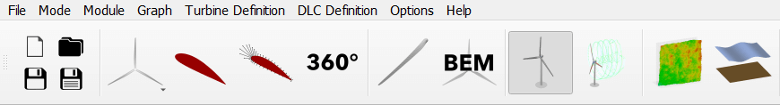
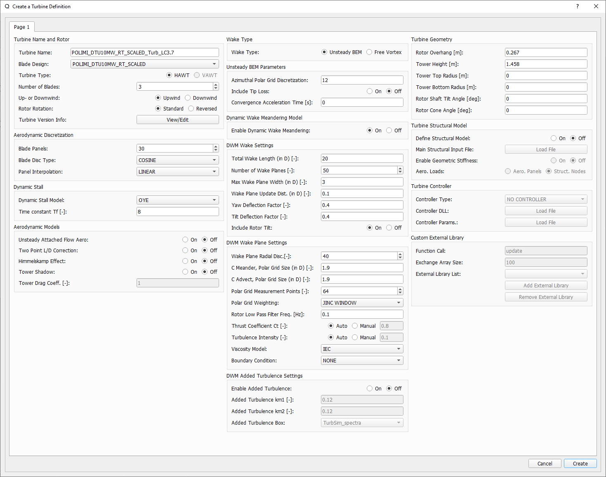
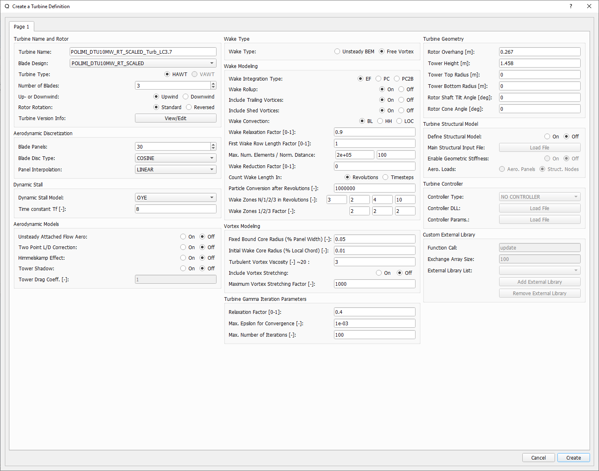

Modeling Overview
=================

.. _fig-turbine-module:

    The turbine module in the QBlade's main toolbar.

The Turbine Definition Module allows users to define new wind turbines or edit existing ones. When a new wind turbine is defined a dialog opens where the user can specify in detail how the turbine should be modeled **aerodynamically**, **structurally**, and whether a **controller** should be included.. 

The Turbine Definition Dialog
-----------------------------
    
.. _fig-turb_dialog1:

   The turbine definition dialog showing unsteady BEM, and Dynamic Wake Meandering (DWM) options (click to enlarge).
   
.. _fig-turb_dialog2:

   The turbine definition dialog showing LLFVW options (click to enlarge).
    
In the turbine definition dialog the user can set all details of the wind turbine that should be modeled. In the following all parameters and entries of this dialog are explained. 

Aerodynamic only Turbine Definitions
------------------------------------

A turbine object can either be defined with or without a structural model definition. If the turbine object is defined without a structural model, it is treated as a rigid model, and only its aerodynamic behavior is evaluated during a simulation. The only operational modes for a turbine object without a structural model are constant or prescribed operational speed (see :ref:`Aerodynamic Modeling`).

Aeroelastic Turbine Definitions
-------------------------------

If a structural model (see :ref:`Structural Modeling`) is added to a turbine object an aeroelastic simulation can be performed. The simulation results then include gravitational, inertia, centrifugal, gyroscopic and aerodynamic forces. For turbine objects with structural model definitions a wind turbine controller may be added to the turbine definition (see :ref:`Wind Turbine Controllers`). If a turbine object also contains a definition of a floating or bottom fixed substructure (see :ref:`Creating a Substructure`) also hydrodynamic forces are evaluated during the simulation. All input parameters of a turbine definition in QBlade are described in the following sections of this documentation, ordered by their appearance in the dialog. If you want to quickly find information about a specific parameter it is suggested to use the **search functionality** of this online documentation.

General Turbine Parameters
==========================

Turbine Name and Rotor
----------------------

- **Turbine Name**: A unique name needs to be assigned to the turbine object.
- **Blade Design**: Choose the aerodynamic blade design that will be used for this turbine object.
- **Turbine Type**: Switch between a HAWT or a VAWT turbine design.
- **Number of Blades**: Sets the number of blades for this rotor. This overrides the number of blades that is specified in the *Blade Design*. If the turbine is equipped with a structural model the number of blades is defined in the structural model main input file and this value is not used.
- **Up- or Downwind**: Choose an up- or downwind rotor configuration (only used for HAWT turbine definitions).
- **Rotor Rotation**: Sets the rotor rotation to standard (clockwise) or reversed (counterclockwise).

Turbine Version Info
--------------------

- **Version Info**: Adds an info string to this turbine object that can be used to annotate changes to the model or revisions of the turbine design.
    
.. footbibliography::
